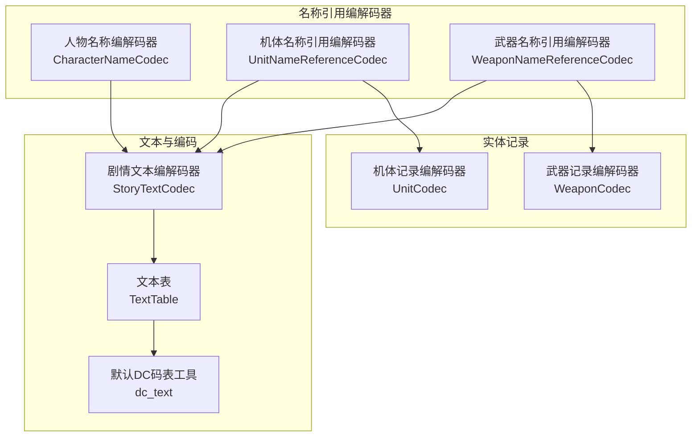
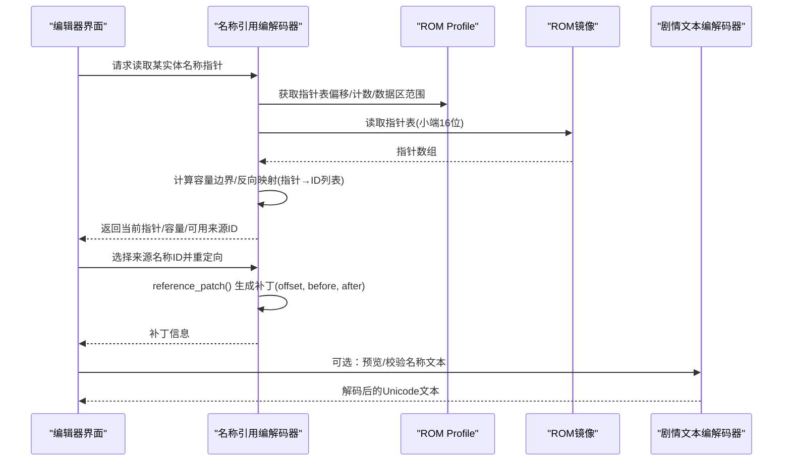
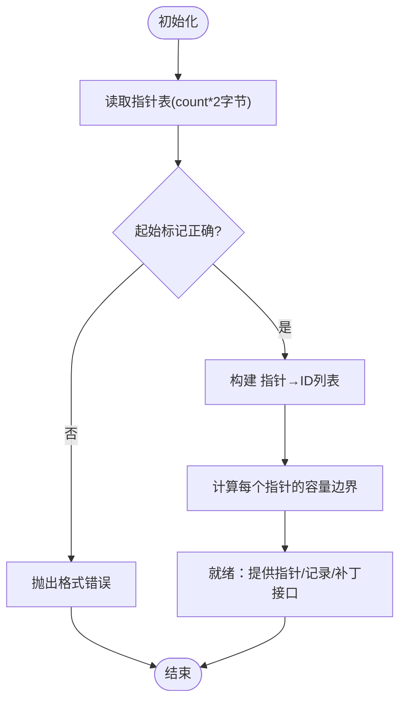
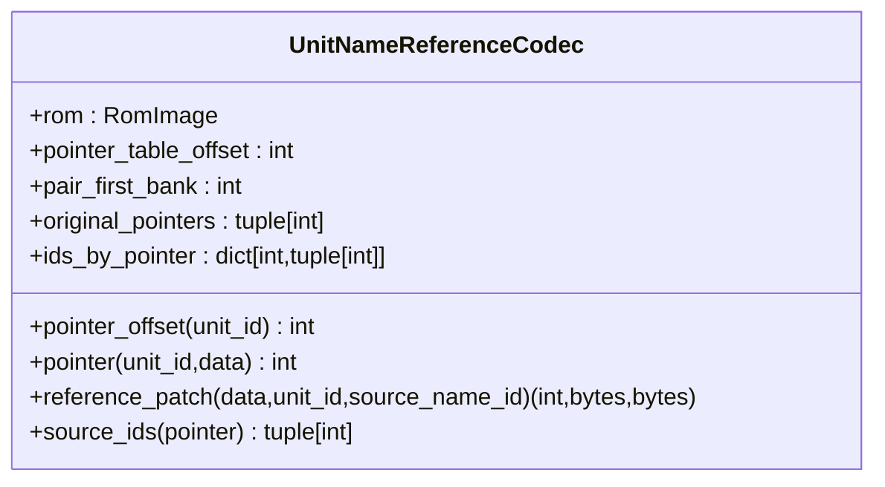
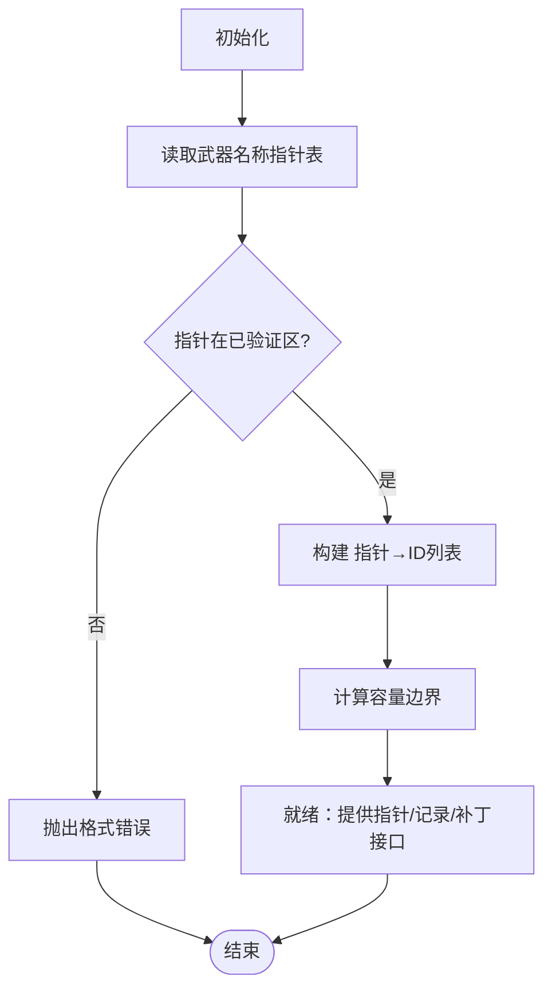
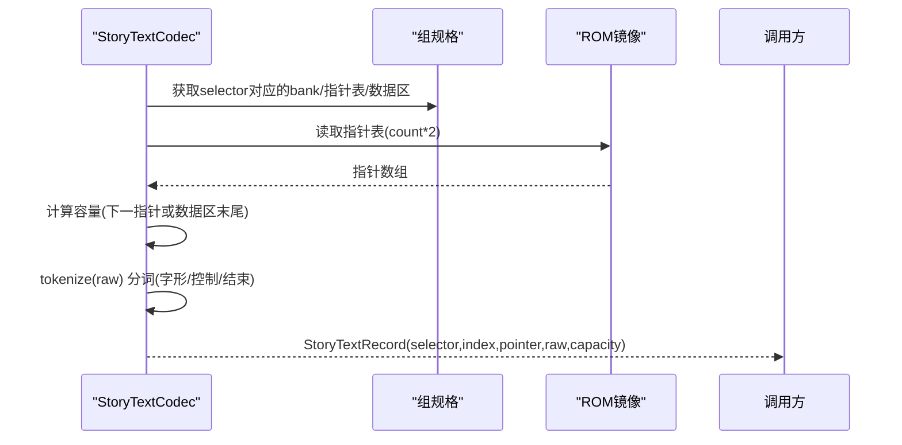
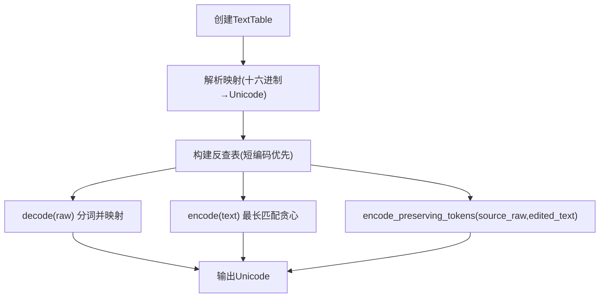
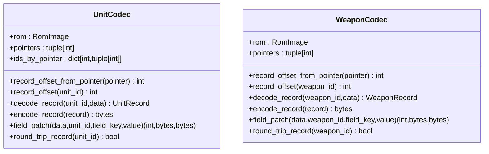
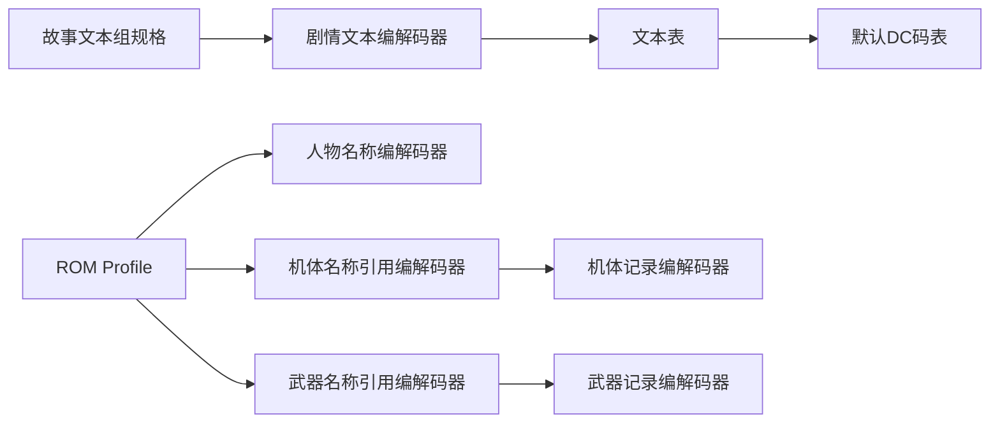

# 名称引用编解码器

<cite>
**本文引用的文件**
- [character_name.py](file://src/fc_editor/codecs/character_name.py)
- [unit_name.py](file://src/fc_editor/codecs/unit_name.py)
- [weapon_name.py](file://src/fc_editor/codecs/weapon_name.py)
- [story_text.py](file://src/fc_editor/codecs/story_text.py)
- [text_table.py](file://src/fc_editor/text_table.py)
- [dc_text.py](file://src/fc_editor/dc_text.py)
- [unit.py](file://src/fc_editor/codecs/unit.py)
- [weapon.py](file://src/fc_editor/codecs/weapon.py)
</cite>

## 目录
1. [简介](#简介)
2. [项目结构](#项目结构)
3. [核心组件](#核心组件)
4. [架构总览](#架构总览)
5. [详细组件分析](#详细组件分析)
6. [依赖关系分析](#依赖关系分析)
7. [性能考量](#性能考量)
8. [故障排查指南](#故障排查指南)
9. [结论](#结论)
10. [附录](#附录)

## 简介
本技术文档围绕“名称引用编解码器”展开，聚焦于游戏对象名称的存储格式、字符串编码方式与引用索引机制。内容覆盖机体名称、武器名称、人物名称的数据结构差异，共享字符集的使用方式，名称表的内存布局与动态加载机制，多语言支持实现，以及名称数据的读写示例、编码格式规范与兼容性处理策略。同时提供内存优化技巧与国际化支持方案，帮助读者在 FC ROM 修改与扩展工程中安全地编辑与替换名称数据。

## 项目结构
本项目将名称相关能力集中在 fc_editor.codecs 与文本表模块中：
- 名称引用编解码器：按实体类型拆分（人物、机体、武器），通过指针表+容量边界的方式保证写入安全。
- 剧情文本编解码器：负责本地化文本的分词、长度校验与精确大小写入。
- 文本表与默认码表：提供字节到 Unicode 的双向映射，并保留控制码与原始字节语义。
- 单元与武器记录编解码器：辅助读取/写入实体记录，配合名称引用进行一致性检查。

**图表来源**
- [character_name.py:9-141](file://src/fc_editor/codecs/character_name.py#L9-L141)
- [unit_name.py:9-90](file://src/fc_editor/codecs/unit_name.py#L9-L90)
- [weapon_name.py:9-120](file://src/fc_editor/codecs/weapon_name.py#L9-L120)
- [story_text.py:17-259](file://src/fc_editor/codecs/story_text.py#L17-L259)
- [text_table.py:9-158](file://src/fc_editor/text_table.py#L9-L158)
- [dc_text.py:372-407](file://src/fc_editor/dc_text.py#L372-L407)
- [unit.py:14-120](file://src/fc_editor/codecs/unit.py#L14-L120)
- [weapon.py:13-90](file://src/fc_editor/codecs/weapon.py#L13-L90)

**章节来源**
- [character_name.py:9-141](file://src/fc_editor/codecs/character_name.py#L9-L141)
- [unit_name.py:9-90](file://src/fc_editor/codecs/unit_name.py#L9-L90)
- [weapon_name.py:9-120](file://src/fc_editor/codecs/weapon_name.py#L9-L120)
- [story_text.py:17-259](file://src/fc_editor/codecs/story_text.py#L17-L259)
- [text_table.py:9-158](file://src/fc_editor/text_table.py#L9-L158)
- [dc_text.py:372-407](file://src/fc_editor/dc_text.py#L372-L407)
- [unit.py:14-120](file://src/fc_editor/codecs/unit.py#L14-L120)
- [weapon.py:13-90](file://src/fc_editor/codecs/weapon.py#L13-L90)

## 核心组件
- 人物名称编解码器：验证并安全重定向已验证的人物名称指针表，计算每个记录的容量边界，避免越界写入。
- 机体名称引用编解码器：稳定地通过重定向到现有本地化名称来编辑机体名称，限制指针范围在 Bank 12/13 的 16 KiB 窗口。
- 武器名称引用编解码器：复用已有本地化记录，确保指针位于已验证数据区，并提供容量计算与回环校验。
- 剧情文本编解码器：对本地化文本进行无损分词，识别字形码、控制码与结束符，保证替换时严格保持记录容量。
- 文本表与默认码表：提供字节到 Unicode 的双向映射，保留控制码与原始字节语义，支持模板导出与增量保留编码。
- 实体记录编解码器：读取/写入机体与武器记录，用于字段级补丁与一致性检查。

**章节来源**
- [character_name.py:9-141](file://src/fc_editor/codecs/character_name.py#L9-L141)
- [unit_name.py:9-90](file://src/fc_editor/codecs/unit_name.py#L9-L90)
- [weapon_name.py:9-120](file://src/fc_editor/codecs/weapon_name.py#L9-L120)
- [story_text.py:17-259](file://src/fc_editor/codecs/story_text.py#L17-L259)
- [text_table.py:9-158](file://src/fc_editor/text_table.py#L9-L158)
- [dc_text.py:372-407](file://src/fc_editor/dc_text.py#L372-L407)
- [unit.py:14-120](file://src/fc_editor/codecs/unit.py#L14-L120)
- [weapon.py:13-90](file://src/fc_editor/codecs/weapon.py#L13-L90)

## 架构总览
名称引用编解码器的核心思想是“指针表 + 容量边界 + 引用复用”。各实体类型的名称以 CPU 指针形式存储在 PRG Bank 的特定窗口内，指针表起始位置由 ROM profile 指定；每个指针指向的记录具有固定容量或可计算的容量边界，写入时必须严格匹配容量，避免破坏相邻记录。

**图表来源**
- [character_name.py:65-128](file://src/fc_editor/codecs/character_name.py#L65-L128)
- [unit_name.py:58-82](file://src/fc_editor/codecs/unit_name.py#L58-L82)
- [weapon_name.py:59-112](file://src/fc_editor/codecs/weapon_name.py#L59-L112)
- [story_text.py:156-245](file://src/fc_editor/codecs/story_text.py#L156-L245)

## 详细组件分析

### 人物名称编解码器（CharacterNameCodec）
- 功能要点
  - 从 profile 中读取指针表偏移、数据区范围与数量，解析为小端16位指针数组。
  - 校验起始标记与指针范围，构建“指针→ID列表”的反向映射，便于批量重定向。
  - 计算每个指针的容量边界（下一个指针或数据区末尾），确保写入不越界。
  - 提供 pointer_offset、pointer、record_bytes、reference_patch、round_trip 等方法。
- 内存布局
  - 指针表位于 profile.character_name_pointer_table_offset，长度为 count*2。
  - 数据区位于 profile.character_name_data_prg_bank 的 $8000-$BFFF 窗口，首尾指针由 profile 限定。
- 关键流程
  - 读取指针表 → 校验起始标记与范围 → 构建 ids_by_pointer → 计算 capacities → 提供 patch 方法。

**图表来源**
- [character_name.py:12-63](file://src/fc_editor/codecs/character_name.py#L12-L63)
- [character_name.py:65-141](file://src/fc_editor/codecs/character_name.py#L65-L141)

**章节来源**
- [character_name.py:9-141](file://src/fc_editor/codecs/character_name.py#L9-L141)

### 机体名称引用编解码器（UnitNameReferenceCodec）
- 功能要点
  - 读取并校验机体名称指针表，限制指针范围在 Bank 12/13 的 16 KiB 窗口（0x8000–0xBFFF）。
  - 构建 ids_by_pointer 反向映射，支持 source_ids 查询哪些 ID 引用了同一指针。
  - 提供 reference_patch 将某机体名称重定向到另一个有效来源的名称指针。
- 内存布局
  - 指针表偏移来自 profile.unit_name_pointer_table_offset，长度为 unit_name_count*2。
  - 数据区位于 Bank 12/13 的 16 KiB 窗口，起始指针由 profile.unit_name_first_pointer 限定。
- 关键流程
  - 读取指针表 → 校验范围 → 构建 ids_by_pointer → 提供 patch 与 source_ids。

**图表来源**
- [unit_name.py:9-90](file://src/fc_editor/codecs/unit_name.py#L9-L90)

**章节来源**
- [unit_name.py:9-90](file://src/fc_editor/codecs/unit_name.py#L9-L90)

### 武器名称引用编解码器（WeaponNameReferenceCodec）
- 功能要点
  - 读取并校验武器名称指针表，确保指针位于已验证数据区。
  - 计算每个指针的容量边界，提供 record_bytes 读取完整记录。
  - 提供 reference_patch 将武器名称重定向到另一个有效来源。
- 内存布局
  - 指针表偏移来自 profile.weapon_name_pointer_table_offset，长度为 weapon_name_pointer_count*2。
  - 数据区位于 profile.weapon_name_data_prg_bank 的窗口，首尾指针由 profile 限定。
- 关键流程
  - 读取指针表 → 校验范围 → 构建 ids_by_pointer → 计算 capacities → 提供 patch 与 round_trip。

**图表来源**
- [weapon_name.py:12-57](file://src/fc_editor/codecs/weapon_name.py#L12-L57)
- [weapon_name.py:59-120](file://src/fc_editor/codecs/weapon_name.py#L59-L120)

**章节来源**
- [weapon_name.py:9-120](file://src/fc_editor/codecs/weapon_name.py#L9-L120)

### 剧情文本编解码器（StoryTextCodec）
- 功能要点
  - 将本地化文本按“字形码/控制码/结束符”分词，保证 FF 不被误认为两字节字形的一部分。
  - 计算每条记录的容量（基于下一指针或数据区末尾），确保 replacement_patch 写入严格等长。
  - 提供 standalone_terminator_end 定位首个独立 FF 的位置，避免与字形码冲突。
  - 支持 group bank 覆盖与 selector 分组管理。
- 内存布局
  - 每组文本有独立的指针表与数据区，CPU 地址必须在偶数 Bank 的 $8000 窗口。
  - 字形码前导字节集合 GLYPH_LEADS 决定两字节字形边界。
- 关键流程
  - 读取指针表 → 校验起始与范围 → 计算容量 → 分词 → 替换补丁。

**图表来源**
- [story_text.py:33-95](file://src/fc_editor/codecs/story_text.py#L33-L95)
- [story_text.py:97-144](file://src/fc_editor/codecs/story_text.py#L97-L144)
- [story_text.py:156-245](file://src/fc_editor/codecs/story_text.py#L156-L245)

**章节来源**
- [story_text.py:17-259](file://src/fc_editor/codecs/story_text.py#L17-L259)

### 文本表与默认码表（TextTable / dc_text）
- 功能要点
  - TextTable 提供 byte_to_text 映射，支持 parse、decode、encode、encode_preserving_tokens、template。
  - encode_preserving_tokens 使用 SequenceMatcher 保留未变更的源 token 字节，仅重写变化部分，避免不必要的字节改写。
  - default_dc_text_table 内置压缩的 DC 字库映射，补充 F2 换行与 FF 结束符，并为未映射单字节提供显式占位表示。
- 内存布局
  - 映射键为字节序列（可能为1或2字节），值为 Unicode 字符串。
  - 反查表 text_to_byte 优先选择最短编码，减少冗余改写。
- 关键流程
  - 解析映射 → 构建反查表 → 解码/编码 → 保留 token 的增量编码。

**图表来源**
- [text_table.py:9-158](file://src/fc_editor/text_table.py#L9-L158)
- [dc_text.py:372-407](file://src/fc_editor/dc_text.py#L372-L407)

**章节来源**
- [text_table.py:9-158](file://src/fc_editor/text_table.py#L9-L158)
- [dc_text.py:372-407](file://src/fc_editor/dc_text.py#L372-L407)

### 实体记录编解码器（UnitCodec / WeaponCodec）
- 功能要点
  - UnitCodec：读取128条机体指针，校验起始标记与记录范围，提供 decode_record/encode_record/field_patch。
  - WeaponCodec：读取192条武器指针，校验起始标记与记录范围，提供 decode_record/encode_record/field_patch。
- 内存布局
  - 指针表位于 profile 指定的偏移，记录位于各自 data_prg_bank 的窗口。
  - 记录大小由常量 UNIT_RECORD_SIZE/WEAPON_RECORD_SIZE 规定。
- 关键流程
  - 读取指针表 → 校验范围 → 计算记录偏移 → 解码/编码记录 → 字段级补丁。

**图表来源**
- [unit.py:14-120](file://src/fc_editor/codecs/unit.py#L14-L120)
- [weapon.py:13-90](file://src/fc_editor/codecs/weapon.py#L13-L90)

**章节来源**
- [unit.py:14-120](file://src/fc_editor/codecs/unit.py#L14-L120)
- [weapon.py:13-90](file://src/fc_editor/codecs/weapon.py#L13-L90)

## 依赖关系分析
- 名称引用编解码器依赖 ROM profile 提供的指针表偏移、数据区范围与计数，确保指针合法与容量可计算。
- 剧情文本编解码器依赖 StoryTextGroupSpec 定义每组文本的 bank、指针表、数据区与容量策略。
- 文本表依赖 StoryTextCodec.tokenize 进行分词，保证解码/编码与原始字节边界一致。
- 实体记录编解码器依赖常量与模型定义，确保记录大小与字段布局一致。

**图表来源**
- [character_name.py:12-29](file://src/fc_editor/codecs/character_name.py#L12-L29)
- [unit_name.py:12-41](file://src/fc_editor/codecs/unit_name.py#L12-L41)
- [weapon_name.py:12-29](file://src/fc_editor/codecs/weapon_name.py#L12-L29)
- [story_text.py:33-65](file://src/fc_editor/codecs/story_text.py#L33-L65)
- [text_table.py:63-93](file://src/fc_editor/text_table.py#L63-L93)
- [dc_text.py:372-407](file://src/fc_editor/dc_text.py#L372-L407)
- [unit.py:17-66](file://src/fc_editor/codecs/unit.py#L17-L66)
- [weapon.py:16-39](file://src/fc_editor/codecs/weapon.py#L16-L39)

**章节来源**
- [character_name.py:12-29](file://src/fc_editor/codecs/character_name.py#L12-L29)
- [unit_name.py:12-41](file://src/fc_editor/codecs/unit_name.py#L12-L41)
- [weapon_name.py:12-29](file://src/fc_editor/codecs/weapon_name.py#L12-L29)
- [story_text.py:33-65](file://src/fc_editor/codecs/story_text.py#L33-L65)
- [text_table.py:63-93](file://src/fc_editor/text_table.py#L63-L93)
- [dc_text.py:372-407](file://src/fc_editor/dc_text.py#L372-L407)
- [unit.py:17-66](file://src/fc_editor/codecs/unit.py#L17-L66)
- [weapon.py:16-39](file://src/fc_editor/codecs/weapon.py#L16-L39)

## 性能考量
- 指针表与容量预计算：在初始化阶段一次性构建 ids_by_pointer 与 capacities，后续读取/写入 O(1) 访问，避免重复扫描。
- 分词与映射缓存：StoryTextCodec.tokenize 与 TextTable.text_to_byte 的反查表采用有序与最短编码优先策略，减少匹配开销。
- 增量保留编码：encode_preserving_tokens 仅在变更区域重新编码，保留未变 token 的原始字节，降低 ROM 写入量与校验成本。
- 内存布局约束：严格限制指针范围与记录容量，避免越界导致的额外安全检查与修复成本。

[本节为通用性能建议，不直接分析具体文件]

## 故障排查指南
- 指针表不完整或起始标记不正确：检查 profile 中的指针表偏移与计数，确认 ROM 版本与 profile 匹配。
- 指针超出已验证数据区：确认指针位于允许的 Bank 窗口（如 $8000–$BFFF），并符合首尾指针约定。
- 记录容量无效：检查相邻指针顺序与数据区末尾，确保 capacity > 0。
- 文本记录长度不匹配：replacement_patch 要求替换字节长度等于记录容量，需先 decode 再按容量构造新记录。
- 未知字符无编码：encode 时若遇到未映射字符会抛出异常，需扩展 TextTable 映射或使用 encode_preserving_tokens 保留原始字节。

**章节来源**
- [character_name.py:15-63](file://src/fc_editor/codecs/character_name.py#L15-L63)
- [unit_name.py:30-50](file://src/fc_editor/codecs/unit_name.py#L30-L50)
- [weapon_name.py:15-57](file://src/fc_editor/codecs/weapon_name.py#L15-L57)
- [story_text.py:97-144](file://src/fc_editor/codecs/story_text.py#L97-L144)
- [text_table.py:67-93](file://src/fc_editor/text_table.py#L67-L93)

## 结论
名称引用编解码器通过指针表与容量边界的安全机制，结合剧情文本的无损分词与文本表的精确映射，实现了在 FC ROM 中对名称数据的稳定编辑与替换。人物、机体、武器三类名称在数据结构上各有差异，但都遵循相同的“指针+容量+引用复用”原则。借助默认 DC 码表与增量保留编码，系统在保证兼容性的同时提升了效率与可维护性。建议在扩展多语言与新增名称类型时，延续这一模式，确保指针合法性与容量一致性。

[本节为总结性内容，不直接分析具体文件]

## 附录

### 名称数据读写示例（路径指引）
- 读取人物名称指针与记录：
  - [pointer_offset/pointer/record_bytes:65-103](file://src/fc_editor/codecs/character_name.py#L65-L103)
- 重定向人物名称到来源 ID：
  - [reference_patch:112-128](file://src/fc_editor/codecs/character_name.py#L112-L128)
- 读取机体名称指针与重定向：
  - [pointer_offset/pointer/reference_patch/source_ids:58-89](file://src/fc_editor/codecs/unit_name.py#L58-L89)
- 读取武器名称指针与重定向：
  - [pointer_offset/pointer/record_bytes/reference_patch/round_trip:59-119](file://src/fc_editor/codecs/weapon_name.py#L59-L119)
- 解码/编码剧情文本：
  - [decode/tokenize/replacement_patch:156-245](file://src/fc_editor/codecs/story_text.py#L156-L245)
- 文本表映射与模板：
  - [parse/template/encode_preserving_tokens:17-158](file://src/fc_editor/text_table.py#L17-L158)
- 默认 DC 码表加载：
  - [default_dc_text_table:372-396](file://src/fc_editor/dc_text.py#L372-L396)

### 编码格式规范
- 指针：小端16位，位于 profile 指定的指针表偏移。
- 记录容量：由下一指针或数据区末尾确定，写入必须严格等长。
- 文本分词：两字节字形码以前导字节集合 GLYPH_LEADS 界定，FF 为结束符，F0+ 为控制码。
- 文本映射：TextTable.byte_to_text 为字节→Unicode，反查表优先最短编码。

**章节来源**
- [story_text.py:25-31](file://src/fc_editor/codecs/story_text.py#L25-L31)
- [story_text.py:181-207](file://src/fc_editor/codecs/story_text.py#L181-L207)
- [text_table.py:48-93](file://src/fc_editor/text_table.py#L48-L93)

### 兼容性处理策略
- 增量保留编码：encode_preserving_tokens 保留未变更 token 的原始字节，避免无关改写。
- 未知字节显式表示：默认码表为未映射单字节提供“⟦原始字节 XX⟧”占位，防止丢失语义。
- 指针范围校验：所有名称指针必须位于已验证数据区或 Bank 窗口，否则抛出格式错误。

**章节来源**
- [text_table.py:95-145](file://src/fc_editor/text_table.py#L95-L145)
- [dc_text.py:385-396](file://src/fc_editor/dc_text.py#L385-L396)
- [character_name.py:31-43](file://src/fc_editor/codecs/character_name.py#L31-L43)
- [unit_name.py:44-50](file://src/fc_editor/codecs/unit_name.py#L44-L50)
- [weapon_name.py:30-38](file://src/fc_editor/codecs/weapon_name.py#L30-L38)

### 内存优化技巧
- 预计算容量与反向映射：减少运行时扫描与查找开销。
- 最小化 ROM 写入：仅重写变更区域，保留未变 token 的原始字节。
- 利用 Bank 窗口对齐：指针统一落在 $8000–$BFFF 窗口，简化地址转换与校验。

[本节为通用优化建议，不直接分析具体文件]

### 国际化支持方案
- 共享字符集：TextTable 提供统一的字节→Unicode 映射，支持多语言扩展。
- 控制码保留：F2 换行与 FF 结束符在默认码表中显式保留，确保跨语言渲染一致。
- 模板导出：TextTable.template 可导出待填充的映射模板，便于本地化团队协作。

**章节来源**
- [text_table.py:147-158](file://src/fc_editor/text_table.py#L147-L158)
- [dc_text.py:385-396](file://src/fc_editor/dc_text.py#L385-L396)