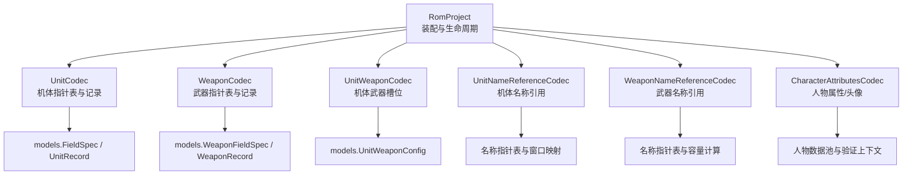
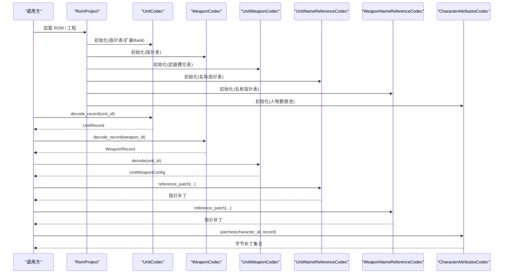
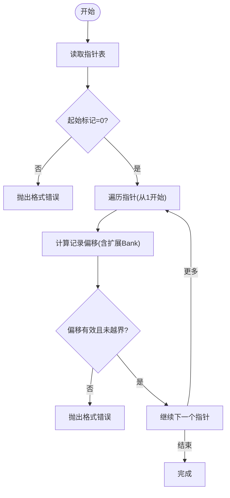
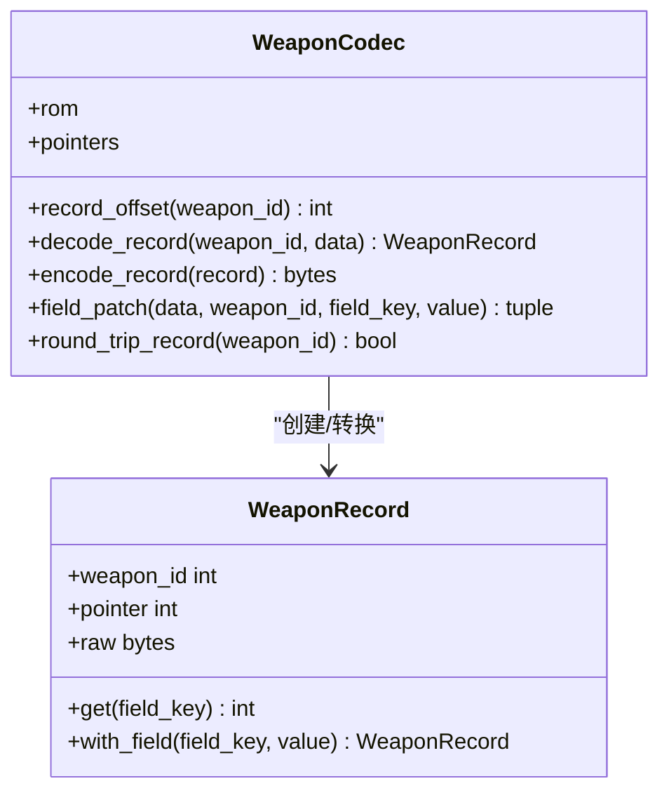
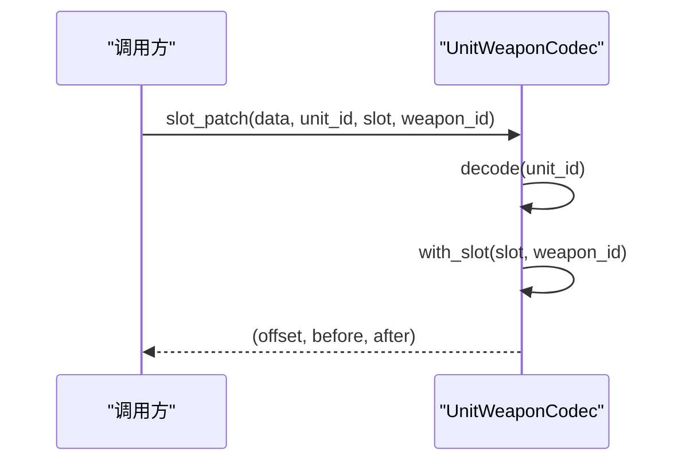
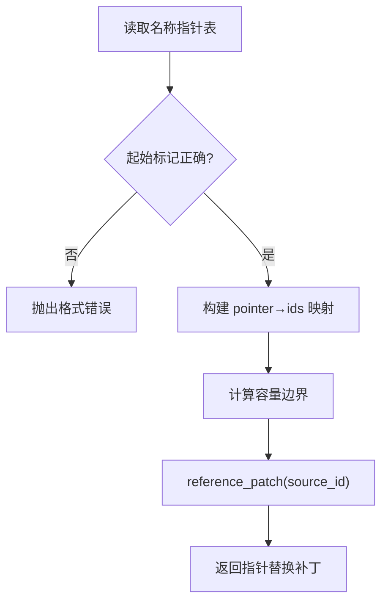
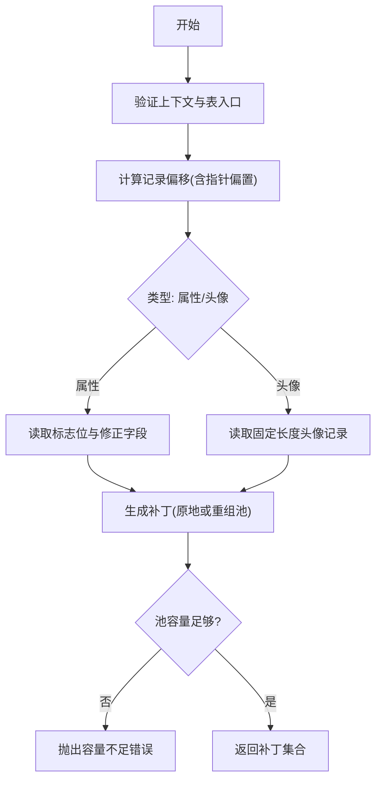
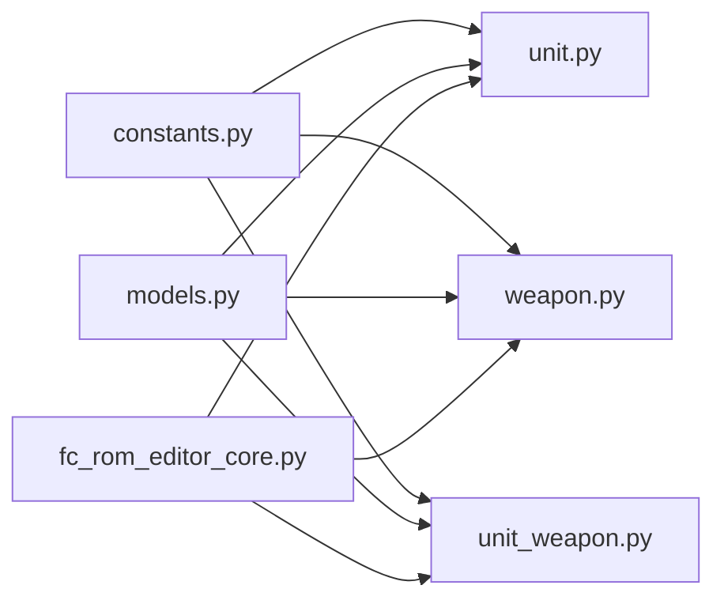

# 数据编解码器

<cite>
**本文引用的文件**
- [src/fc_rom_editor_core.py](file://src/fc_rom_editor_core.py)
- [src/fc_editor/codecs/__init__.py](file://src/fc_editor/codecs/__init__.py)
- [src/fc_editor/codecs/unit.py](file://src/fc_editor/codecs/unit.py)
- [src/fc_editor/codecs/weapon.py](file://src/fc_editor/codecs/weapon.py)
- [src/fc_editor/codecs/unit_weapon.py](file://src/fc_editor/codecs/unit_weapon.py)
- [src/fc_editor/codecs/unit_name.py](file://src/fc_editor/codecs/unit_name.py)
- [src/fc_editor/codecs/weapon_name.py](file://src/fc_editor/codecs/weapon_name.py)
- [src/fc_editor/codecs/character_attributes.py](file://src/fc_editor/codecs/character_attributes.py)
- [src/fc_editor/models.py](file://src/fc_editor/models.py)
- [src/fc_editor/constants.py](file://src/fc_editor/constants.py)
</cite>

## 目录
1. [简介](#简介)
2. [项目结构](#项目结构)
3. [核心组件](#核心组件)
4. [架构总览](#架构总览)
5. [详细组件分析](#详细组件分析)
6. [依赖关系分析](#依赖关系分析)
7. [性能考虑](#性能考虑)
8. [故障排查指南](#故障排查指南)
9. [结论](#结论)
10. [附录](#附录)

## 简介
本技术文档聚焦于游戏实体数据的二进制编解码实现，覆盖机体（Unit）、武器（Weapon）、人物属性（CharacterAttributes）等核心对象的数据格式、字段映射、数值范围校验、名称引用机制、关联数据管理、版本兼容性处理。文档提供数据布局说明、解析流程、错误处理策略、完整性检查方法、性能优化建议与调试技巧，帮助读者在不直接阅读源码的情况下理解并安全地修改 ROM 数据。

## 项目结构
本项目将 ROM 数据编解码能力集中在 fc_editor.codecs 子模块中，并通过顶层 RomProject 统一装配各编解码器实例，形成“ROM 镜像 + 配置 Profile + 资源分配”的编辑工作流。关键组织方式如下：
- 常量与模型定义：constants.py 提供记录大小、表偏移、PRG Bank 尺寸等；models.py 定义 FieldSpec/WeaponFieldSpec、UnitRecord/WeaponRecord 等数据结构及字段元信息。
- 编解码器：unit.py、weapon.py、unit_weapon.py、unit_name.py、weapon_name.py、character_attributes.py 分别负责不同实体的读取、写入、校验与补丁生成。
- 装配入口：fc_rom_editor_core.py 中的 RomProject 根据 ROM Profile 和扩展规划动态选择并初始化各编解码器，暴露统一的读写接口。

图表来源
- [src/fc_rom_editor_core.py:463-618](file://src/fc_rom_editor_core.py#L463-L618)
- [src/fc_editor/codecs/unit.py:14-120](file://src/fc_editor/codecs/unit.py#L14-L120)
- [src/fc_editor/codecs/weapon.py:13-90](file://src/fc_editor/codecs/weapon.py#L13-L90)
- [src/fc_editor/codecs/unit_weapon.py:11-79](file://src/fc_editor/codecs/unit_weapon.py#L11-L79)
- [src/fc_editor/codecs/unit_name.py:9-90](file://src/fc_editor/codecs/unit_name.py#L9-L90)
- [src/fc_editor/codecs/weapon_name.py:9-120](file://src/fc_editor/codecs/weapon_name.py#L9-L120)
- [src/fc_editor/codecs/character_attributes.py:78-237](file://src/fc_editor/codecs/character_attributes.py#L78-L237)

章节来源
- [src/fc_rom_editor_core.py:463-618](file://src/fc_rom_editor_core.py#L463-L618)
- [src/fc_editor/codecs/__init__.py:1-47](file://src/fc_editor/codecs/__init__.py#L1-L47)

## 核心组件
- 机体编解码器（UnitCodec）：读取 128 项机体指针表，定位每条记录的固定长度数据块，支持按字段键值进行原地 patch 与往返一致性检查。
- 武器编解码器（WeaponCodec）：读取 192 项武器指针表，定位每条记录的固定长度数据块，支持字段级 patch 与往返一致性检查。
- 机体武器配置（UnitWeaponCodec）：为每个机体维护两个武器 ID 槽位的直连表，支持槽位级替换与越界校验。
- 名称引用编解码器（UnitNameReferenceCodec、WeaponNameReferenceCodec）：通过重定向到已存在的本地化名称记录，避免破坏名称数据区；计算容量边界并保证指针合法。
- 人物属性编解码器（CharacterAttributesCodec）：在已验证的数据池内读写可变长的人物属性与固定长度的头像记录，支持共享记录去重与池内重组。

章节来源
- [src/fc_editor/codecs/unit.py:14-120](file://src/fc_editor/codecs/unit.py#L14-L120)
- [src/fc_editor/codecs/weapon.py:13-90](file://src/fc_editor/codecs/weapon.py#L13-L90)
- [src/fc_editor/codecs/unit_weapon.py:11-79](file://src/fc_editor/codecs/unit_weapon.py#L11-L79)
- [src/fc_editor/codecs/unit_name.py:9-90](file://src/fc_editor/codecs/unit_name.py#L9-L90)
- [src/fc_editor/codecs/weapon_name.py:9-120](file://src/fc_editor/codecs/weapon_name.py#L9-L120)
- [src/fc_editor/codecs/character_attributes.py:78-237](file://src/fc_editor/codecs/character_attributes.py#L78-L237)

## 架构总览
RomProject 作为编排者，依据 ROM Profile 与扩展标志，决定使用基础或扩展模式下的编解码器实例，并维护指针表、ID 映射、资源分配等信息。各 Codec 之间保持低耦合，仅通过 models 与 constants 共享数据契约。

图表来源
- [src/fc_rom_editor_core.py:463-618](file://src/fc_rom_editor_core.py#L463-L618)
- [src/fc_editor/codecs/unit.py:14-120](file://src/fc_editor/codecs/unit.py#L14-L120)
- [src/fc_editor/codecs/weapon.py:13-90](file://src/fc_editor/codecs/weapon.py#L13-L90)
- [src/fc_editor/codecs/unit_weapon.py:11-79](file://src/fc_editor/codecs/unit_weapon.py#L11-L79)
- [src/fc_editor/codecs/unit_name.py:9-90](file://src/fc_editor/codecs/unit_name.py#L9-L90)
- [src/fc_editor/codecs/weapon_name.py:9-120](file://src/fc_editor/codecs/weapon_name.py#L9-L120)
- [src/fc_editor/codecs/character_attributes.py:78-237](file://src/fc_editor/codecs/character_attributes.py#L78-L237)

## 详细组件分析

### 机体（Unit）编解码
- 数据布局
  - 指针表：小端 16 位指针数组，首项为哨兵 0，后续每项指向一条固定长度的机体记录。
  - 记录长度：固定宽度，便于随机访问与原地 patch。
  - 扩展模式：当存在扩展标志时，指针可能落在特定 Bank 对窗口内，需转换为文件偏移。
- 字段映射与校验
  - 字段由 FieldSpec 描述，包含记录偏移、宽度、最小/最大值、掩码与位移、显示缩放、可选枚举等。
  - 编码时严格校验范围与掩码，防止越界与非法位组合。
- 关键流程
  - 读取指针表并校验起始标记与记录边界。
  - 根据 unit_id 获取记录偏移，读取固定长度原始字节。
  - 按字段键值进行原地 patch，返回偏移与前/后字节用于事务提交。
  - 往返一致性检查确保编解码无损。

图表来源
- [src/fc_editor/codecs/unit.py:42-66](file://src/fc_editor/codecs/unit.py#L42-L66)
- [src/fc_editor/codecs/unit.py:68-84](file://src/fc_editor/codecs/unit.py#L68-L84)

章节来源
- [src/fc_editor/codecs/unit.py:14-120](file://src/fc_editor/codecs/unit.py#L14-L120)
- [src/fc_editor/models.py:13-58](file://src/fc_editor/models.py#L13-L58)
- [src/fc_editor/models.py:61-162](file://src/fc_editor/models.py#L61-L162)
- [src/fc_editor/constants.py:12-16](file://src/fc_editor/constants.py#L12-L16)

### 武器（Weapon）编解码
- 数据布局
  - 指针表：小端 16 位指针数组，首项为哨兵 0，后续每项指向一条固定长度的武器记录。
  - 记录长度：固定宽度，便于随机访问与原地 patch。
- 字段映射与校验
  - 字段由 WeaponFieldSpec 描述，支持掩码、位移与值偏置，编码前进行范围校验。
- 关键流程
  - 读取指针表并校验起始标记与记录边界。
  - 根据 weapon_id 获取记录偏移，读取固定长度原始字节。
  - 按字段键值生成补丁，返回偏移与前/后字节。
  - 往返一致性检查确保编解码无损。

图表来源
- [src/fc_editor/codecs/weapon.py:13-90](file://src/fc_editor/codecs/weapon.py#L13-L90)
- [src/fc_editor/models.py:185-203](file://src/fc_editor/models.py#L185-L203)

章节来源
- [src/fc_editor/codecs/weapon.py:13-90](file://src/fc_editor/codecs/weapon.py#L13-L90)
- [src/fc_editor/models.py:205-285](file://src/fc_editor/models.py#L205-L285)
- [src/fc_editor/constants.py:17-20](file://src/fc_editor/constants.py#L17-L20)

### 机体武器配置（UnitWeaponCodec）
- 数据布局
  - 每个机体对应一个固定大小的槽位表，包含两个武器 ID。
- 关键流程
  - 校验表长度与武器 ID 范围。
  - 读取/写入指定槽位，返回补丁三元组（偏移、原字节、新字节）。

图表来源
- [src/fc_editor/codecs/unit_weapon.py:11-79](file://src/fc_editor/codecs/unit_weapon.py#L11-L79)
- [src/fc_editor/models.py:288-307](file://src/fc_editor/models.py#L288-L307)

章节来源
- [src/fc_editor/codecs/unit_weapon.py:11-79](file://src/fc_editor/codecs/unit_weapon.py#L11-L79)
- [src/fc_editor/models.py:288-307](file://src/fc_editor/models.py#L288-L307)
- [src/fc_editor/constants.py:22-23](file://src/fc_editor/constants.py#L22-L23)

### 名称引用机制（UnitNameReferenceCodec、WeaponNameReferenceCodec）
- 设计目标
  - 不新增名称数据，而是将名称指针重定向到已存在的本地化记录，保证数据区稳定与可逆。
- 关键点
  - 读取原始指针表，建立 pointer→ids 的反向映射，便于批量同步名称。
  - 计算名称数据区的容量边界，防止越界。
  - 提供 reference_patch 生成指针替换补丁。
- 版本兼容
  - 仅在具备已验证 Profile 的 ROM 上启用，否则抛出格式错误。

图表来源
- [src/fc_editor/codecs/unit_name.py:9-90](file://src/fc_editor/codecs/unit_name.py#L9-L90)
- [src/fc_editor/codecs/weapon_name.py:9-120](file://src/fc_editor/codecs/weapon_name.py#L9-L120)

章节来源
- [src/fc_editor/codecs/unit_name.py:9-90](file://src/fc_editor/codecs/unit_name.py#L9-L90)
- [src/fc_editor/codecs/weapon_name.py:9-120](file://src/fc_editor/codecs/weapon_name.py#L9-L120)

### 人物属性（CharacterAttributesCodec）
- 数据布局
  - 指针表：小端 16 位指针数组，首项为哨兵 0。
  - 数据池：固定范围的内存池，存放可变长属性记录与固定长度头像记录。
  - 属性记录：头部包含标志位，指示哪些修正字段存在；尾部追加对应修正值。
  - 头像记录：固定长度，包含颜色索引、图库编号与位置编码。
- 关键流程
  - 验证代码上下文与表入口，确保 ROM 版本匹配。
  - 读取/写入属性或头像记录，必要时在池内进行重组与去重。
  - 若池容量不足，给出明确提示与建议操作。
- 版本兼容
  - 仅支持已验证的 ROM 变体；否则拒绝操作。

图表来源
- [src/fc_editor/codecs/character_attributes.py:78-237](file://src/fc_editor/codecs/character_attributes.py#L78-L237)

章节来源
- [src/fc_editor/codecs/character_attributes.py:9-263](file://src/fc_editor/codecs/character_attributes.py#L9-L263)

## 依赖关系分析
- 常量依赖：constants.py 提供记录大小、表偏移、PRG Bank 尺寸等，被各 Codec 与 RomProject 共同使用。
- 模型依赖：models.py 定义字段规格与记录结构，Codec 通过 FieldSpec/WeaponFieldSpec 进行编解码与校验。
- 装配依赖：RomProject 根据 ROM Profile 与扩展标志装配具体 Codec 实例，统一管理指针表与资源分配。

图表来源
- [src/fc_editor/constants.py:1-69](file://src/fc_editor/constants.py#L1-L69)
- [src/fc_editor/models.py:1-426](file://src/fc_editor/models.py#L1-L426)
- [src/fc_rom_editor_core.py:463-618](file://src/fc_rom_editor_core.py#L463-L618)

章节来源
- [src/fc_editor/constants.py:1-69](file://src/fc_editor/constants.py#L1-L69)
- [src/fc_editor/models.py:1-426](file://src/fc_editor/models.py#L1-L426)
- [src/fc_rom_editor_core.py:463-618](file://src/fc_rom_editor_core.py#L463-L618)

## 性能考虑
- 指针表一次性读取并缓存，避免重复 IO。
- 固定长度记录支持原地 patch，减少额外缓冲与拷贝。
- 人物属性池重组采用去重策略，减少冗余记录占用。
- 名称引用通过重定向而非复制，降低数据区膨胀风险。
- 使用事务与快照机制，批量修改时减少中间状态开销。

[本节为通用指导，无需特定文件来源]

## 故障排查指南
- 常见错误类型
  - 指针表不完整或起始标记不正确：检查指针表长度与首项是否为 0。
  - 记录超出支持区域：确认记录偏移与长度未越界。
  - 名称指针超出窗口或数据区：核对名称指针范围与容量边界。
  - 人物数据池容量不足：减少修正字段或勾选同时修改共用记录。
  - 版本不匹配：当前 ROM 未通过上下文验证，拒绝操作。
- 调试建议
  - 使用 round_trip_record 或 round_trip 进行编解码一致性检查。
  - 打印指针表与记录偏移，确认地址映射正确。
  - 逐步缩小问题范围，先验证指针表，再验证记录内容。
  - 结合事务撤销/重做功能回滚到已知良好状态。

章节来源
- [src/fc_editor/codecs/unit.py:42-66](file://src/fc_editor/codecs/unit.py#L42-L66)
- [src/fc_editor/codecs/weapon.py:20-39](file://src/fc_editor/codecs/weapon.py#L20-L39)
- [src/fc_editor/codecs/unit_name.py:30-56](file://src/fc_editor/codecs/unit_name.py#L30-L56)
- [src/fc_editor/codecs/weapon_name.py:23-57](file://src/fc_editor/codecs/weapon_name.py#L23-L57)
- [src/fc_editor/codecs/character_attributes.py:103-125](file://src/fc_editor/codecs/character_attributes.py#L103-L125)
- [src/fc_editor/codecs/character_attributes.py:202-237](file://src/fc_editor/codecs/character_attributes.py#L202-L237)

## 结论
该数据编解码体系以常量与模型为契约，通过独立的 Codec 实现高内聚、低耦合的编解码逻辑。RomProject 负责装配与生命周期管理，确保在不同 ROM 变体下的一致行为。名称引用与池内重组机制在保证数据完整性的同时提升了可扩展性。遵循本文档的校验与调试方法，可在不破坏 ROM 的前提下安全地进行数据修改。

[本节为总结性内容，无需特定文件来源]

## 附录
- 数据格式示例（路径参考）
  - 机体记录：参见 [src/fc_editor/codecs/unit.py:86-93](file://src/fc_editor/codecs/unit.py#L86-L93)
  - 武器记录：参见 [src/fc_editor/codecs/weapon.py:55-66](file://src/fc_editor/codecs/weapon.py#L55-L66)
  - 人物属性：参见 [src/fc_editor/codecs/character_attributes.py:157-172](file://src/fc_editor/codecs/character_attributes.py#L157-L172)
  - 头像记录：参见 [src/fc_editor/codecs/character_attributes.py:174-182](file://src/fc_editor/codecs/character_attributes.py#L174-L182)
- 解析代码片段（路径参考）
  - 指针表读取与校验：参见 [src/fc_editor/codecs/unit.py:42-66](file://src/fc_editor/codecs/unit.py#L42-L66)、[src/fc_editor/codecs/weapon.py:20-39](file://src/fc_editor/codecs/weapon.py#L20-L39)
  - 字段编码与校验：参见 [src/fc_editor/models.py:13-58](file://src/fc_editor/models.py#L13-L58)、[src/fc_editor/models.py:205-243](file://src/fc_editor/models.py#L205-L243)
  - 名称引用补丁：参见 [src/fc_editor/codecs/unit_name.py:68-82](file://src/fc_editor/codecs/unit_name.py#L68-L82)、[src/fc_editor/codecs/weapon_name.py:98-112](file://src/fc_editor/codecs/weapon_name.py#L98-L112)
  - 人物属性补丁：参见 [src/fc_editor/codecs/character_attributes.py:193-237](file://src/fc_editor/codecs/character_attributes.py#L193-L237)
- 错误处理策略（路径参考）
  - 格式错误与范围校验：参见 [src/fc_editor/codecs/unit.py:42-66](file://src/fc_editor/codecs/unit.py#L42-L66)、[src/fc_editor/codecs/weapon.py:20-39](file://src/fc_editor/codecs/weapon.py#L20-L39)、[src/fc_editor/codecs/character_attributes.py:103-125](file://src/fc_editor/codecs/character_attributes.py#L103-L125)
- 性能优化技巧（路径参考）
  - 往返一致性检查：参见 [src/fc_editor/codecs/unit.py:117-120](file://src/fc_editor/codecs/unit.py#L117-L120)、[src/fc_editor/codecs/weapon.py:87-90](file://src/fc_editor/codecs/weapon.py#L87-L90)、[src/fc_editor/codecs/weapon_name.py:114-120](file://src/fc_editor/codecs/weapon_name.py#L114-L120)
  - 池内重组与去重：参见 [src/fc_editor/codecs/character_attributes.py:211-237](file://src/fc_editor/codecs/character_attributes.py#L211-L237)