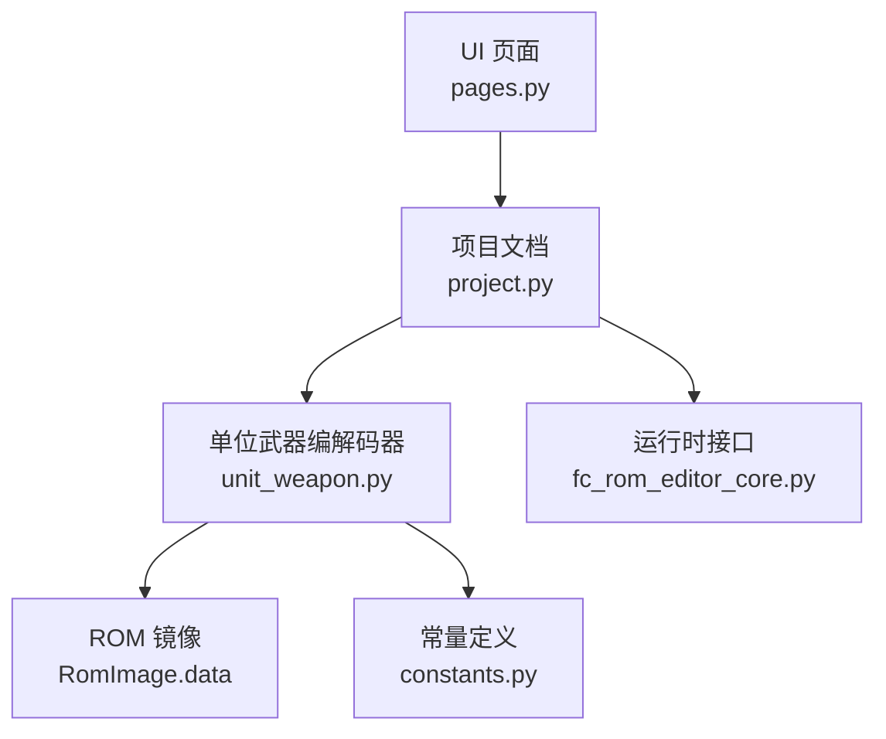
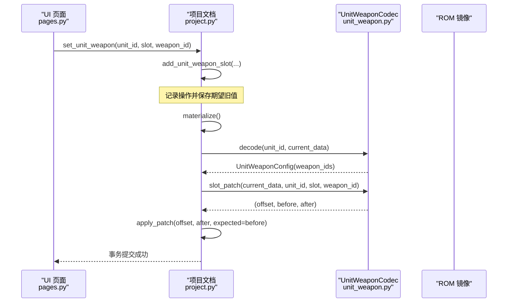
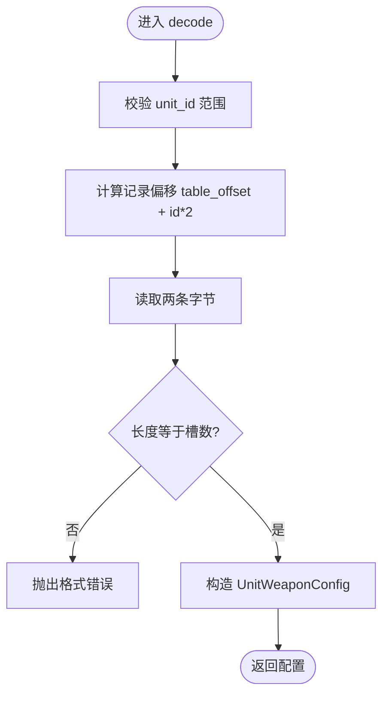
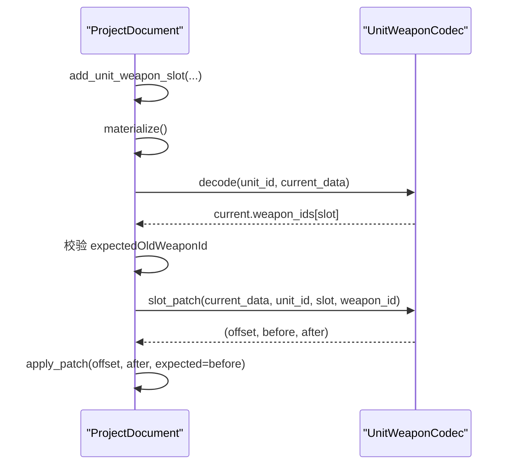
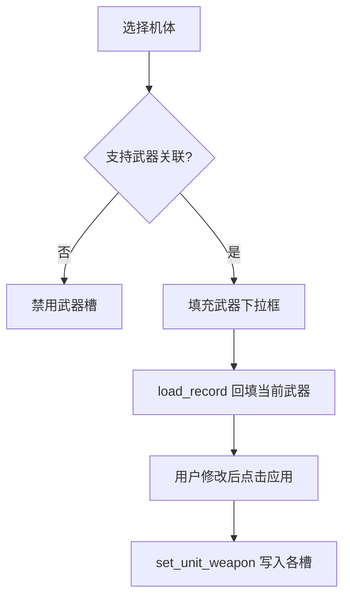
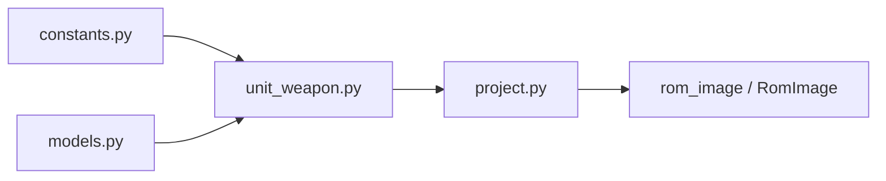

# 机体武器关联编解码器

<cite>
**本文引用的文件**
- [src/fc_editor/codecs/unit_weapon.py](file://src/fc_editor/codecs/unit_weapon.py)
- [src/fc_editor/project.py](file://src/fc_editor/project.py)
- [src/fc_editor/constants.py](file://src/fc_editor/constants.py)
- [src/fc_editor/models.py](file://src/fc_editor/models.py)
- [src/dc_modifier/pages.py](file://src/dc_modifier/pages.py)
- [src/fc_rom_editor_core.py](file://src/fc_rom_editor_core.py)
</cite>

## 目录
1. [简介](#简介)
2. [项目结构](#项目结构)
3. [核心组件](#核心组件)
4. [架构总览](#架构总览)
5. [详细组件分析](#详细组件分析)
6. [依赖关系分析](#依赖关系分析)
7. [性能与容量特性](#性能与容量特性)
8. [故障排查指南](#故障排查指南)
9. [结论](#结论)
10. [附录：数据模型与示例](#附录数据模型与示例)

## 简介
本技术文档聚焦“机体武器关联（UnitWeapon）”的编解码能力，系统说明以下要点：
- 机体与武器的绑定关系在 ROM 中的存储格式与访问方式
- 武器槽位管理机制、默认装备配置与冲突检测
- 可装备武器的筛选规则、等级/熟练度等参数的表示位置
- 特殊武器的解锁条件与扩展性设计
- 具体关联数据示例、装备逻辑实现细节与最佳实践

该能力由 UnitWeaponCodec 提供，通过 ProjectDocument 的操作管线进行安全写入，并在 UI 层暴露为“武器槽”编辑控件。

## 项目结构
围绕 UnitWeapon 的关键文件与职责如下：
- 编解码器：unit_weapon.py，负责读取/写入每机体的两格武器 ID
- 常量定义：constants.py，定义表偏移、槽位数、武器总数等
- 模型与字段：models.py，定义机体/武器记录结构与字段规范
- 工程操作：project.py，将“设置武器槽”转化为可重放的项目操作
- 编辑器集成：pages.py，提供 UI 上的武器槽选择与批量应用
- 运行时接口：fc_rom_editor_core.py，对外暴露 supports/get/set/reset 等方法

图表来源
- [src/dc_modifier/pages.py:550-880](file://src/dc_modifier/pages.py#L550-L880)
- [src/fc_editor/project.py:183-204](file://src/fc_editor/project.py#L183-L204)
- [src/fc_editor/codecs/unit_weapon.py:11-79](file://src/fc_editor/codecs/unit_weapon.py#L11-L79)
- [src/fc_editor/constants.py:22-24](file://src/fc_editor/constants.py#L22-L24)
- [src/fc_rom_editor_core.py:1486-1988](file://src/fc_rom_editor_core.py#L1486-L1988)

章节来源
- [src/dc_modifier/pages.py:550-880](file://src/dc_modifier/pages.py#L550-L880)
- [src/fc_editor/project.py:183-204](file://src/fc_editor/project.py#L183-L204)
- [src/fc_editor/codecs/unit_weapon.py:11-79](file://src/fc_editor/codecs/unit_weapon.py#L11-L79)
- [src/fc_editor/constants.py:22-24](file://src/fc_editor/constants.py#L22-L24)
- [src/fc_rom_editor_core.py:1486-1988](file://src/fc_rom_editor_core.py#L1486-L1988)

## 核心组件
- UnitWeaponCodec：以“每机体固定两条武器 ID”的形式读写 ROM 中的武器关联表；支持校验表范围、武器 ID 合法性，并提供按槽位的补丁生成。
- ProjectDocument：将“设置某机体某槽武器”封装为可审计、可回滚的项目操作，并在 materialize 阶段调用 UnitWeaponCodec 完成实际补丁。
- UI 页面 pages.py：为每个机体提供两个武器槽下拉框，自动填充可用武器列表，支持复制/还原/批量应用。
- 常量 constants.py：集中定义 UNIT_WEAPON_TABLE_OFFSET、UNIT_WEAPON_SLOT_COUNT、WEAPON_COUNT 等关键常量。
- 模型 models.py：定义 FieldSpec、UnitRecord、WeaponRecord 等通用数据结构，用于其他字段编解码与校验。

章节来源
- [src/fc_editor/codecs/unit_weapon.py:11-79](file://src/fc_editor/codecs/unit_weapon.py#L11-L79)
- [src/fc_editor/project.py:183-204](file://src/fc_editor/project.py#L183-L204)
- [src/dc_modifier/pages.py:550-880](file://src/dc_modifier/pages.py#L550-L880)
- [src/fc_editor/constants.py:22-24](file://src/fc_editor/constants.py#L22-L24)
- [src/fc_editor/models.py:13-58](file://src/fc_editor/models.py#L13-L58)

## 架构总览
下图展示从 UI 到 ROM 的数据流与控制流：

图表来源
- [src/dc_modifier/pages.py:821-848](file://src/dc_modifier/pages.py#L821-L848)
- [src/fc_editor/project.py:183-204](file://src/fc_editor/project.py#L183-L204)
- [src/fc_editor/project.py:600-625](file://src/fc_editor/project.py#L600-L625)
- [src/fc_editor/codecs/unit_weapon.py:50-79](file://src/fc_editor/codecs/unit_weapon.py#L50-L79)

## 详细组件分析

### UnitWeaponCodec：存储格式与编解码
- 存储布局
  - 表基址：由 profile.unit_weapon_table_offset 决定，若启用扩展则根据初始计划计算实际偏移。
  - 每条记录长度：UNIT_WEAPON_SLOT_COUNT = 2（即两个武器 ID）。
  - 第 i 条记录的起始偏移：table_offset + i * 2。
- 解码流程
  - 校验表是否越界、每个武器 ID 是否小于 WEAPON_COUNT。
  - 读取两条字节作为武器 ID 元组，构造 UnitWeaponConfig。
- 编码与补丁
  - encode 直接返回武器 ID 字节序列。
  - slot_patch 对指定槽位进行替换，返回偏移、原值与新值，供上层应用补丁。

图表来源
- [src/fc_editor/codecs/unit_weapon.py:30-58](file://src/fc_editor/codecs/unit_weapon.py#L30-L58)

章节来源
- [src/fc_editor/codecs/unit_weapon.py:11-79](file://src/fc_editor/codecs/unit_weapon.py#L11-L79)
- [src/fc_editor/constants.py:22-24](file://src/fc_editor/constants.py#L22-L24)

### ProjectDocument：操作建模与安全写入
- 操作建模
  - add_unit_weapon_slot：记录一次“设置某机体某槽武器”的操作，包含 unitId、slot、weaponId、expectedOldWeaponId。
  - 参数校验：unit_id 必须在 01–FF，slot 必须为 0 或 1，weapon_id 必须在 00–FF。
- 执行阶段（materialize）
  - 若当前基准 ROM 未验证武器关系表，拒绝写入。
  - 读取当前工作副本数据，解码当前武器配置，校验期望旧值。
  - 调用 codec.slot_patch 获取精确补丁，并以 before/after 形式应用。

图表来源
- [src/fc_editor/project.py:183-204](file://src/fc_editor/project.py#L183-L204)
- [src/fc_editor/project.py:600-625](file://src/fc_editor/project.py#L600-L625)

章节来源
- [src/fc_editor/project.py:183-204](file://src/fc_editor/project.py#L183-L204)
- [src/fc_editor/project.py:600-625](file://src/fc_editor/project.py#L600-L625)

### UI 页面：武器槽管理与默认装备
- 武器槽控件
  - 每个机体提供两个下拉框，分别对应槽 0 和槽 1。
  - 当项目支持武器关联时，下拉框会列出“无武器”以及所有有效武器 ID 及其显示名。
- 加载与刷新
  - load_record 中，若支持武器关联，则根据 project.get_unit_weapons(record_id) 回填当前武器。
  - refresh 中，根据 project.supports_unit_weapons 动态启用/禁用武器槽控件。
- 应用与复制
  - apply_record 会将表单中的武器槽值写入 project.set_unit_weapon。
  - duplicate_record/copy_record_to 支持将源机体的数值、名称引用与两格武器配置复制到目标机体。

图表来源
- [src/dc_modifier/pages.py:672-688](file://src/dc_modifier/pages.py#L672-L688)
- [src/dc_modifier/pages.py:723-729](file://src/dc_modifier/pages.py#L723-L729)
- [src/dc_modifier/pages.py:821-848](file://src/dc_modifier/pages.py#L821-L848)
- [src/dc_modifier/pages.py:807-813](file://src/dc_modifier/pages.py#L807-L813)

章节来源
- [src/dc_modifier/pages.py:550-880](file://src/dc_modifier/pages.py#L550-L880)

### 运行时接口：supports/get/set/reset
- supports_unit_weapons：判断当前 ROM 是否具备已验证的武器关系表。
- get_unit_weapons：返回某机体的两格武器 ID 元组。
- set_unit_weapon：设置指定槽位的武器 ID。
- reset_unit_weapons：将该机体的两格武器恢复为基准值。

章节来源
- [src/fc_rom_editor_core.py:1486-1988](file://src/fc_rom_editor_core.py#L1486-L1988)

## 依赖关系分析
- 常量依赖
  - UNIT_WEAPON_TABLE_OFFSET、UNIT_WEAPON_SLOT_COUNT、WEAPON_COUNT 来自 constants.py，被编解码器与项目文档使用。
- 模型依赖
  - UnitWeaponConfig 由 unit_weapon.py 引入，用于承载解码结果。
  - FieldSpec/UnitRecord/WeaponRecord 在 models.py 中定义，服务于更广泛的字段编解码。
- 工程集成
  - project.py 在 materialize 阶段根据 initial_plan 计算 unit_weapon_codec 的表偏移，确保扩展模式下正确定位。

图表来源
- [src/fc_editor/constants.py:22-24](file://src/fc_editor/constants.py#L22-L24)
- [src/fc_editor/codecs/unit_weapon.py:1-9](file://src/fc_editor/codecs/unit_weapon.py#L1-L9)
- [src/fc_editor/project.py:468-482](file://src/fc_editor/project.py#L468-L482)

章节来源
- [src/fc_editor/constants.py:22-24](file://src/fc_editor/constants.py#L22-L24)
- [src/fc_editor/codecs/unit_weapon.py:1-9](file://src/fc_editor/codecs/unit_weapon.py#L1-L9)
- [src/fc_editor/project.py:468-482](file://src/fc_editor/project.py#L468-L482)

## 性能与容量特性
- 时间复杂度
  - decode/slot_patch 均为 O(1)，仅涉及固定长度的切片与比较。
- 空间复杂度
  - 不引入额外大对象，仅在内存中持有少量 bytes/bytearray。
- 容量约束
  - 武器 ID 上限受 WEAPON_COUNT 限制；超出将被拒绝。
  - 表大小受 ROM 容量与 profile.unit_count 限制；越界将触发格式错误。

[本节为通用性能讨论，无需特定文件引用]

## 故障排查指南
常见错误与处理建议：
- 表越界或记录不完整
  - 现象：抛出“机体武器配置表超出 ROM”或“武器配置不完整”。
  - 原因：ROM 尺寸不足或表偏移计算错误。
  - 处理：检查 profile.unit_weapon_table_offset 与 initial_plan 的偏移计算。
- 无效武器 ID
  - 现象：抛出“引用了无效武器”。
  - 原因：武器 ID ≥ WEAPON_COUNT。
  - 处理：确认武器表规模与 ID 分配。
- 原值不匹配
  - 现象：materialize 时报“原武器不匹配”。
  - 原因：并发修改或多步操作导致期望旧值失效。
  - 处理：重新读取当前状态，更新 expectedOldWeaponId 后重试。
- 不支持当前 ROM
  - 现象：提示“没有已验证的机体武器关系表”。
  - 原因：当前基准 ROM 未启用或无法识别武器表。
  - 处理：切换到支持该表的 ROM 版本。

章节来源
- [src/fc_editor/codecs/unit_weapon.py:37-48](file://src/fc_editor/codecs/unit_weapon.py#L37-L48)
- [src/fc_editor/project.py:600-625](file://src/fc_editor/project.py#L600-L625)

## 结论
UnitWeapon 编解码器以极简的两格武器 ID 表实现了机体与武器的强绑定，配合 ProjectDocument 的事务化操作，保证了修改的安全性与可追溯性。UI 层提供了直观的武器槽编辑体验，并通过 supports_unit_weapons 机制适配不同 ROM 版本。对于扩展场景，可通过 initial_plan 动态计算表偏移，保持兼容性与稳定性。

[本节为总结性内容，无需特定文件引用]

## 附录：数据模型与示例

### 数据模型概览
- 常量
  - UNIT_WEAPON_TABLE_OFFSET：武器关联表在 ROM 中的偏移。
  - UNIT_WEAPON_SLOT_COUNT：每机体的武器槽数量（固定为 2）。
  - WEAPON_COUNT：武器 ID 的上限。
- 模型
  - UnitWeaponConfig：包含 unit_id 与 weapon_ids（长度为 2 的元组）。
  - FieldSpec/UnitRecord/WeaponRecord：用于其他字段的统一编解码与校验。

章节来源
- [src/fc_editor/constants.py:22-24](file://src/fc_editor/constants.py#L22-L24)
- [src/fc_editor/models.py:13-58](file://src/fc_editor/models.py#L13-L58)

### 关联数据示例（概念性）
- 示例 A：机体 $01 默认装备
  - 槽 0：$01（基础近战武器）
  - 槽 1：$02（远程射击武器）
- 示例 B：机体 $05 自定义装备
  - 槽 0：$0A（高威力武器）
  - 槽 1：$00（空槽）
- 示例 C：复制装备
  - 将机体 $01 的两格武器复制到机体 $03，得到相同配置。

注意：以上为概念性示例，实际值需依据具体 ROM 的武器表与配置。

### 装备逻辑与冲突检测
- 装备逻辑
  - UI 层根据 supports_unit_weapons 决定是否启用武器槽。
  - 应用时将每个槽的值写入 project.set_unit_weapon，最终由 ProjectDocument 转换为原始补丁。
- 冲突检测
  - 在 materialize 阶段校验 expectedOldWeaponId，避免覆盖他人修改。
  - 武器 ID 必须小于 WEAPON_COUNT，否则拒绝。

章节来源
- [src/dc_modifier/pages.py:672-688](file://src/dc_modifier/pages.py#L672-L688)
- [src/dc_modifier/pages.py:821-848](file://src/dc_modifier/pages.py#L821-L848)
- [src/fc_editor/project.py:600-625](file://src/fc_editor/project.py#L600-L625)

### 等级要求、熟练度与特殊武器解锁
- 等级/熟练度
  - 这些属性通常位于武器记录或机体记录的字段中，由 FieldSpec 描述其偏移、宽度与取值范围。
  - 具体字段键与含义请参考 models.py 中的字段定义与注释。
- 特殊武器解锁
  - 若存在基于剧情/关卡/标志的特殊武器解锁逻辑，通常由游戏运行时判定，不在 UnitWeapon 表中直接体现。
  - 如需在工具层模拟解锁，可在 UI 层允许选择对应武器 ID，但需确保武器 ID 合法且未被其他规则禁止。

章节来源
- [src/fc_editor/models.py:13-58](file://src/fc_editor/models.py#L13-L58)

### 扩展性与最佳实践
- 扩展点
  - 通过 initial_plan 动态计算 unit_weapon_codec 的表偏移，适配扩展模式下的资源重定位。
  - 新增武器或机体时，确保 WEAPON_COUNT 与 unit_count 保持一致。
- 最佳实践
  - 始终使用 ProjectDocument 的操作接口写入，避免直接写 ROM。
  - 在 UI 层提供“还原此机体”功能，便于回退到基准配置。
  - 对共享名称/属性的机体，复制前给出明确提示，防止意外影响多 ID 共享的记录。

章节来源
- [src/fc_editor/project.py:468-482](file://src/fc_editor/project.py#L468-L482)
- [src/dc_modifier/pages.py:868-877](file://src/dc_modifier/pages.py#L868-L877)