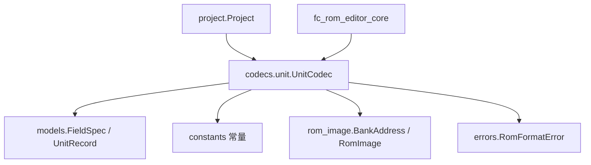
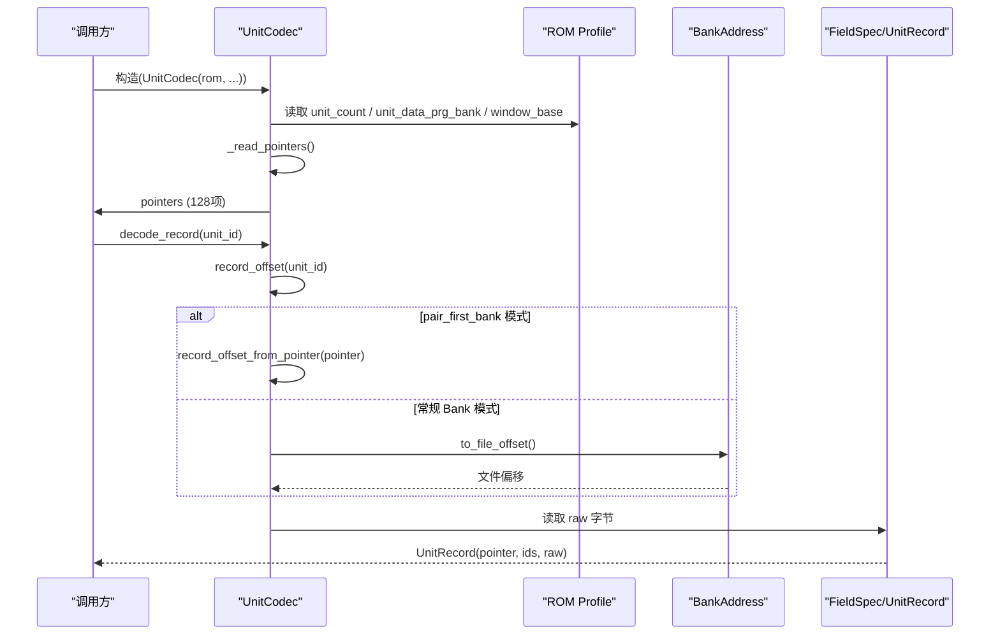
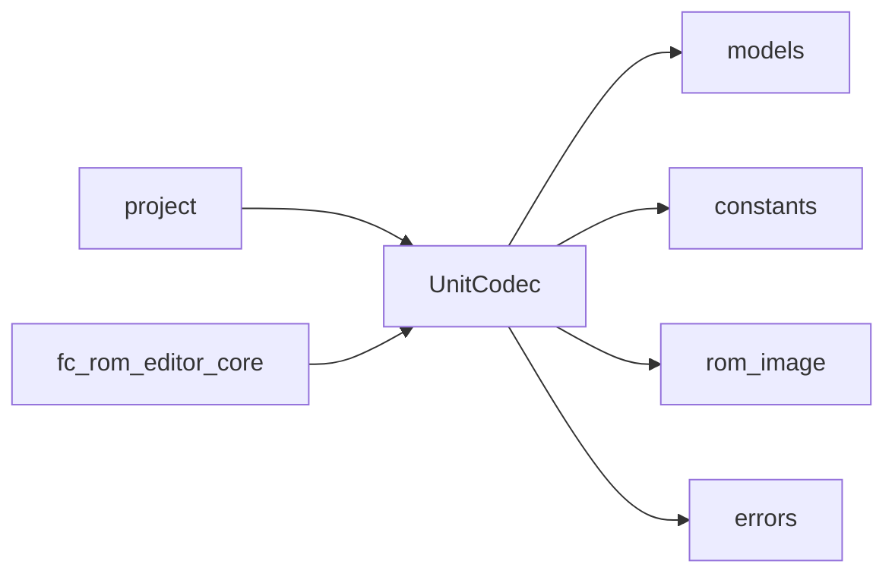
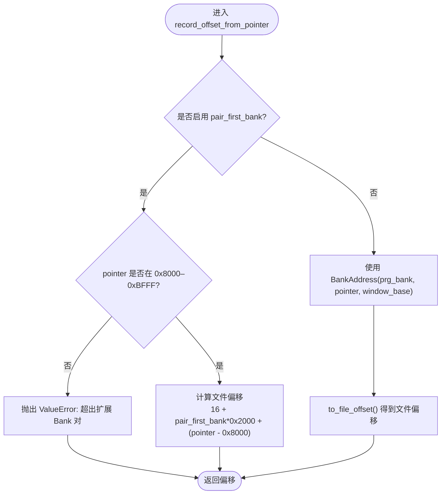
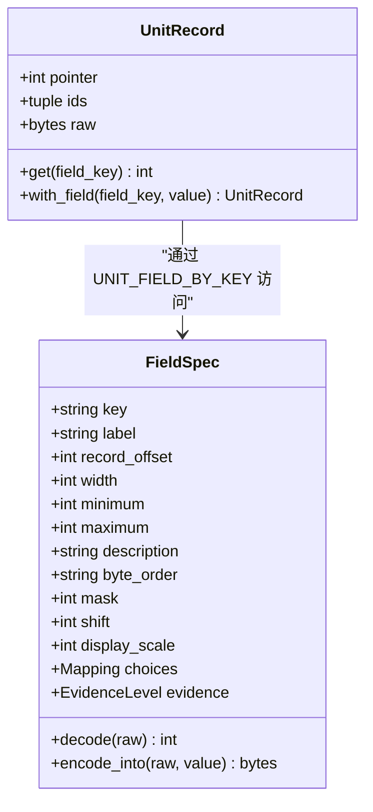

# 机体编解码器

<cite>
**本文引用的文件**
- [unit.py](file://src/fc_editor/codecs/unit.py)
- [models.py](file://src/fc_editor/models.py)
- [constants.py](file://src/fc_editor/constants.py)
- [rom_image.py](file://src/fc_editor/rom_image.py)
- [errors.py](file://src/fc_editor/errors.py)
- [project.py](file://src/fc_editor/project.py)
- [fc_rom_editor_core.py](file://src/fc_rom_editor_core.py)
</cite>

## 目录
1. [简介](#简介)
2. [项目结构](#项目结构)
3. [核心组件](#核心组件)
4. [架构总览](#架构总览)
5. [详细组件分析](#详细组件分析)
6. [依赖关系分析](#依赖关系分析)
7. [性能考虑](#性能考虑)
8. [故障排查指南](#故障排查指南)
9. [结论](#结论)
10. [附录](#附录)

## 简介
本技术文档聚焦于“机体（Unit）”数据的无损编解码实现，围绕 UnitCodec 类展开，系统阐述以下要点：
- 读取并解析 128 条机体指针表
- 机体记录的内存布局与字段映射
- pointer_table_offset 的作用、pair_first_bank 的 Bank 对处理逻辑
- record_offset_from_pointer 的地址转换算法
- UnitRecord 数据结构的构建过程与 ids_by_pointer 分组管理机制
- 二进制格式示例、字段偏移计算、错误处理策略
- 性能优化技巧与调试方法

## 项目结构
本项目将机体编解码相关代码集中在 fc_editor 子包中：
- codecs.unit：实现 UnitCodec，负责指针表读取、记录编解码、字段补丁等
- models：定义 FieldSpec、UnitRecord、武器记录等数据结构与字段规范
- constants：提供常量如 UNIT_RECORD_SIZE、UNIT_COUNT、默认指针表偏移等
- rom_image：提供 RomImage、BankAddress 等 ROM 抽象与地址转换工具
- errors：统一异常类型，如 RomFormatError
- project 与 fc_rom_editor_core：在工程与编辑器核心中实例化并使用 UnitCodec

图表来源
- [unit.py:14-120](file://src/fc_editor/codecs/unit.py#L14-L120)
- [models.py:13-183](file://src/fc_editor/models.py#L13-L183)
- [constants.py:12-16](file://src/fc_editor/constants.py#L12-L16)
- [rom_image.py:22-49](file://src/fc_editor/rom_image.py#L22-L49)
- [errors.py:1-11](file://src/fc_editor/errors.py#L1-L11)

章节来源
- [unit.py:14-120](file://src/fc_editor/codecs/unit.py#L14-L120)
- [models.py:13-183](file://src/fc_editor/models.py#L13-L183)
- [constants.py:12-16](file://src/fc_editor/constants.py#L12-L16)
- [rom_image.py:22-49](file://src/fc_editor/rom_image.py#L22-L49)
- [errors.py:1-11](file://src/fc_editor/errors.py#L1-L11)

## 核心组件
- UnitCodec：负责读取 128 项指针表、校验指针有效性、将指针转换为记录偏移、解码/编码机体记录、按字段键进行原地补丁、以及往返一致性检查。
- FieldSpec：描述每条字段的偏移、宽度、取值范围、掩码/位移、字节序等，并提供 decode/encode_into 能力。
- UnitRecord：封装一条完整机体记录的原始字节、所属指针及共享该指针的所有 ID 列表。
- BankAddress/RomImage：提供 PRG Bank 到文件偏移的转换，支持窗口基址配置。
- 常量：UNIT_RECORD_SIZE=0x10、UNIT_COUNT=0x80（128）、默认指针表偏移等。

章节来源
- [unit.py:14-120](file://src/fc_editor/codecs/unit.py#L14-L120)
- [models.py:13-183](file://src/fc_editor/models.py#L13-L183)
- [constants.py:12-16](file://src/fc_editor/constants.py#L12-L16)
- [rom_image.py:22-49](file://src/fc_editor/rom_image.py#L22-L49)

## 架构总览
下图展示了从 ROM 镜像到机体记录的端到端流程，包括指针表读取、地址转换、记录解码与字段访问。

图表来源
- [unit.py:17-93](file://src/fc_editor/codecs/unit.py#L17-L93)
- [rom_image.py:22-49](file://src/fc_editor/rom_image.py#L22-L49)
- [models.py:13-183](file://src/fc_editor/models.py#L13-L183)

## 详细组件分析

### UnitCodec：指针表读取与记录编解码
- 初始化
  - 接受 RomImage 与可选 data；若未提供 data，则使用 rom.data。
  - pointer_table_offset：优先使用传入值，否则回退至 rom.profile.unit_pointer_table_offset。
  - pair_first_bank：可选参数，用于特殊 Bank 对模式。
  - 构造时即执行 _read_pointers()，生成 128 项指针元组，并建立 ids_by_pointer 映射。
- 指针表读取与校验
  - 根据 profile.unit_count 计算表大小（每项 2 字节小端），切片读取。
  - 长度不足抛出 RomFormatError。
  - 使用 struct.unpack("<N H") 解析为无符号短整型数组。
  - 校验 pointers[0] == 0，否则视为起始标记不正确。
  - 遍历 pointers[1:]，逐一通过 record_offset_from_pointer 转换并验证：
    - 偏移不得小于指针表结束位置
    - 记录末尾不得超出 ROM 大小
  - 任一非法均抛出 RomFormatError，附带具体 unit_id 与指针值。
- 地址转换算法
  - record_offset_from_pointer(pointer)
    - 当 pair_first_bank 非空：要求 pointer 位于 0x8000–0xBFFF 范围内，返回 16 + pair_first_bank*0x2000 + (pointer - 0x8000)。
    - 否则：使用 BankAddress(rom.profile.unit_data_prg_bank, pointer, window_base=...) 转换为文件偏移。
  - record_offset(unit_id)：先校验 unit_id 范围，再委托 record_offset_from_pointer(pointers[unit_id])。
- 记录解码与编码
  - decode_record(unit_id, data=None)：定位偏移后读取固定长度的 raw 字节，构造 UnitRecord(pointer, ids_by_pointer[pointer], raw)。
  - encode_record(record)：仅校验 record.pointer 存在于 ids_by_pointer，返回 bytes(record.raw)。
- 字段补丁
  - field_patch(data, unit_id, field_key, value)：
    - 通过 UNIT_FIELD_BY_KEY 获取 FieldSpec；若字段名以 "_growth" 结尾，则以 rom.profile.growth_curve_max 覆盖最大值。
    - 解码当前记录，调用 field.encode_into(raw, value) 得到新 raw。
    - 计算目标写入偏移：record_offset(unit_id) + field.record_offset。
    - 返回 (offset, before, after) 三元组，便于外部对比差异。
- 往返一致性
  - round_trip_record(unit_id)：解码后再编码，断言与原 raw 一致。

章节来源
- [unit.py:17-120](file://src/fc_editor/codecs/unit.py#L17-L120)

### 指针表与记录的二进制格式
- 指针表
  - 位置：由 pointer_table_offset 指定，可来自常量或 ROM profile。
  - 长度：unit_count × 2 字节（小端）。
  - 内容：每个条目为 16 位偏移/指针；pointers[0] 必须为 0。
- 记录
  - 长度：UNIT_RECORD_SIZE = 0x10 字节。
  - 布局：各字段由 FieldSpec 定义，包含 record_offset、width、mask/shift、byte_order 等。
  - 典型字段（节选）：
    - 地形适应：偏移 0x00，宽度 1，掩码 0x03
    - 特殊技能：偏移 0x01，宽度 1
    - 移动力：偏移 0x03，宽度 1
    - 速度：偏移 0x04，宽度 1
    - 强度：偏移 0x05，宽度 1
    - 防卫：偏移 0x06，宽度 1
    - 基础金钱：偏移 0x07，宽度 1
    - HP：偏移 0x08，宽度 2（小端）
    - 基础经验：偏移 0x0A，宽度 1
    - 成长曲线：偏移 0x0C–0x0F，宽度 1 各一
- 地址空间
  - 常规模式：指针指向 unit_data_prg_bank 中的逻辑地址，经 BankAddress(window_base) 转为文件偏移。
  - 扩展 Bank 对模式：当设置 pair_first_bank 时，指针限定在 0x8000–0xBFFF，直接映射到连续文件区域。

章节来源
- [constants.py:12-16](file://src/fc_editor/constants.py#L12-L16)
- [models.py:61-108](file://src/fc_editor/models.py#L61-L108)
- [unit.py:42-77](file://src/fc_editor/codecs/unit.py#L42-L77)

### ids_by_pointer 分组管理
- 目的：多个不同 unit_id 可能共享同一条记录（例如多机体共用同一模板）。
- 机制：
  - 在构造时遍历 pointers，对 unit_id > 0 且 pointer != 0 的项，按 pointer 分组聚合 unit_id。
  - 生成 ids_by_pointer: {pointer: tuple(sorted_ids)}。
- 作用：
  - decode_record 时，UnitRecord.ids 反映所有共享该记录的机体 ID 集合。
  - encode_record 时，校验 record.pointer 是否属于已知分组，防止写入未知指针。

章节来源
- [unit.py:34-40](file://src/fc_editor/codecs/unit.py#L34-L40)
- [unit.py:86-98](file://src/fc_editor/codecs/unit.py#L86-L98)

### 字段映射与偏移计算
- FieldSpec.decode：从 raw 的 record_offset 起读取 width 字节，按 byte_order 转整数；如有 mask/shift，进行位操作提取。
- FieldSpec.encode_into：将 value 写回 raw 对应区间；若带 mask/shift，先清位再置位。
- 字段增长上限：当字段 key 以 "_growth" 结尾时，field.maximum 会被替换为 rom.profile.growth_curve_max，确保与游戏配置一致。
- 字段校验：FieldSpec.__post_init__ 会校验 record_offset 与 width 不越界，minimum ≤ maximum。

章节来源
- [models.py:13-58](file://src/fc_editor/models.py#L13-L58)
- [unit.py:100-115](file://src/fc_editor/codecs/unit.py#L100-L115)

### 地址转换与 Bank 对处理
- 常规模式：
  - 使用 BankAddress(prg_bank, pointer, window_base) 将逻辑地址映射为文件偏移。
  - 适用于标准 MMC3 映射下的单位数据区。
- 扩展 Bank 对模式：
  - 当 pair_first_bank 非空时，强制指针落在 0x8000–0xBFFF。
  - 计算公式：文件偏移 = 16 + pair_first_bank × 0x2000 + (pointer − 0x8000)。
  - 该模式常用于特定扩展布局，避免复杂窗口映射。

章节来源
- [unit.py:68-77](file://src/fc_editor/codecs/unit.py#L68-L77)
- [rom_image.py:22-49](file://src/fc_editor/rom_image.py#L22-L49)

### 错误处理策略
- 指针表不完整：抛出 RomFormatError，提示“机体指针表不完整”。
- 起始标记错误：pointers[0] 不为 0 时抛出 RomFormatError。
- 指针无效：record_offset_from_pointer 抛出 ValueError，被捕获并包装为 RomFormatError，携带 unit_id 与 pointer。
- 记录越界：偏移小于表尾或记录超出 ROM 大小，抛出 RomFormatError。
- 记录不完整：读取 raw 长度不等于 UNIT_RECORD_SIZE，抛出 RomFormatError。
- 未知指针：encode_record 时若 record.pointer 不在 ids_by_pointer，抛出 ValueError。
- 字段越界/范围错误：FieldSpec.__post_init__ 与 encode_into 内部校验失败抛出 ValueError。

章节来源
- [unit.py:42-98](file://src/fc_editor/codecs/unit.py#L42-L98)
- [errors.py:1-11](file://src/fc_editor/errors.py#L1-L11)
- [models.py:29-58](file://src/fc_editor/models.py#L29-L58)

### 使用方式与集成点
- 工程层：project.py 在加载/保存项目时创建 UnitCodec，并基于其进行读写。
- 编辑器核心：fc_rom_editor_core.py 维护 base_unit_codec，并在需要时重建或复用。
- 测试：tests/test_dc_modifier.py 中通过 UnitCodec 对 ROM 进行断言与验证。

章节来源
- [project.py:448-465](file://src/fc_editor/project.py#L448-L465)
- [fc_rom_editor_core.py:485-502](file://src/fc_rom_editor_core.py#L485-L502)
- [fc_rom_editor_core.py:788](file://src/fc_rom_editor_core.py#L788)
- [fc_rom_editor_core.py:866](file://src/fc_rom_editor_core.py#L866)
- [test_dc_modifier.py:20-70](file://tests/test_dc_modifier.py#L20-L70)

## 依赖关系分析
- UnitCodec 依赖：
  - models：FieldSpec、UnitRecord、UNIT_FIELD_BY_KEY
  - constants：UNIT_RECORD_SIZE、UNIT_COUNT、默认指针表偏移等
  - rom_image：BankAddress、RomImage
  - errors：RomFormatError
- 上层模块依赖：
  - project：构造 UnitCodec 并调用 decode/encode/field_patch
  - fc_rom_editor_core：持有 base_unit_codec，暴露 pointers 查询接口

图表来源
- [unit.py:1-120](file://src/fc_editor/codecs/unit.py#L1-L120)
- [models.py:1-183](file://src/fc_editor/models.py#L1-L183)
- [constants.py:1-69](file://src/fc_editor/constants.py#L1-L69)
- [rom_image.py:22-49](file://src/fc_editor/rom_image.py#L22-L49)
- [errors.py:1-11](file://src/fc_editor/errors.py#L1-L11)

章节来源
- [unit.py:1-120](file://src/fc_editor/codecs/unit.py#L1-L120)
- [models.py:1-183](file://src/fc_editor/models.py#L1-L183)
- [constants.py:1-69](file://src/fc_editor/constants.py#L1-L69)
- [rom_image.py:22-49](file://src/fc_editor/rom_image.py#L22-L49)
- [errors.py:1-11](file://src/fc_editor/errors.py#L1-L11)

## 性能考虑
- 批量读取指针表：一次性读取并缓存 pointers，避免重复 I/O。
- 记录访问最小化：decode_record 仅读取必要长度 UNIT_RECORD_SIZE 字节。
- 字段补丁就地更新：field.encode_into 直接在原始字节上修改，减少中间对象分配。
- 增长字段动态上限：按需覆盖 growth 字段最大值，避免额外查表。
- 地址转换缓存：若频繁访问同一指针，可在上层缓存 record_offset 结果。
- 错误快速失败：在指针表阶段尽早校验，避免后续无用计算。

## 故障排查指南
- 现象：指针表不完整
  - 原因：读取长度不足
  - 处理：检查 pointer_table_offset 与 unit_count 是否正确
- 现象：起始标记不正确
  - 原因：pointers[0] ≠ 0
  - 处理：确认 ROM 布局与 profile 配置
- 现象：记录指针无效/超出支持区域
  - 原因：指针越界或未对齐
  - 处理：核对 record_offset_from_pointer 的参数与 ROM 尺寸
- 现象：记录不完整
  - 原因：raw 长度不符
  - 处理：检查 UNIT_RECORD_SIZE 与实际布局
- 现象：未知指针
  - 原因：尝试编码一个未被指针表引用的指针
  - 处理：确保 record.pointer 在 ids_by_pointer 中
- 现象：字段范围错误
  - 原因：value 超出 minimum/maximum
  - 处理：调整值或使用 field.with_field 前进行校验

章节来源
- [unit.py:42-98](file://src/fc_editor/codecs/unit.py#L42-L98)
- [models.py:29-58](file://src/fc_editor/models.py#L29-L58)
- [errors.py:1-11](file://src/fc_editor/errors.py#L1-L11)

## 结论
UnitCodec 提供了稳定、可验证的机体数据编解码能力，通过对指针表的严格校验、灵活的地址转换（含 Bank 对模式）、以及细粒度的字段级补丁，满足 ROM 编辑与扩展需求。配合 FieldSpec 的强约束与 UnitRecord 的不可变设计，保证了数据一致性与可追溯性。建议在工程中结合 project 与 fc_rom_editor_core 的使用方式，充分利用其提供的接口进行高效、安全的 ROM 修改。

## 附录

### 关键流程图：record_offset_from_pointer

图表来源
- [unit.py:68-77](file://src/fc_editor/codecs/unit.py#L68-L77)

### 数据模型图：UnitRecord 与 FieldSpec

图表来源
- [models.py:13-183](file://src/fc_editor/models.py#L13-L183)