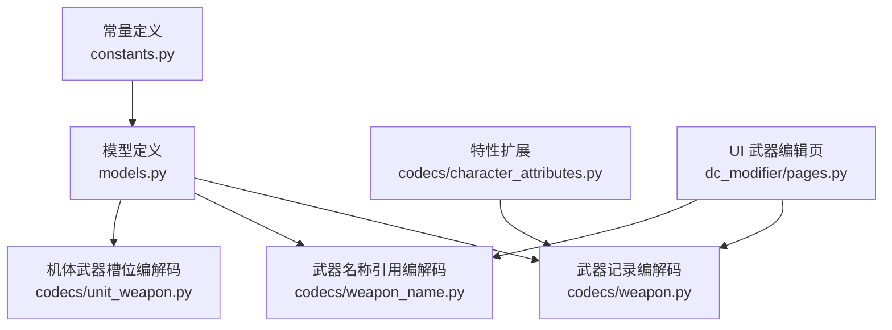
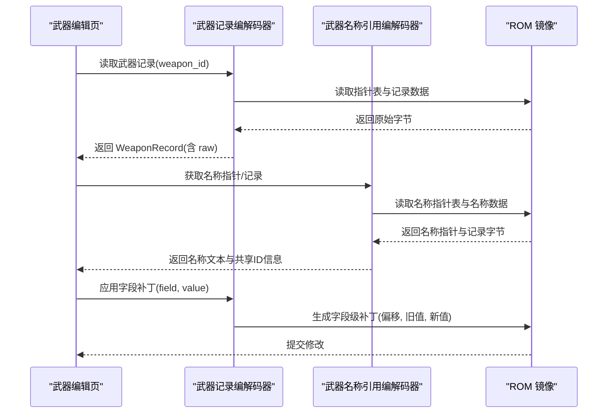
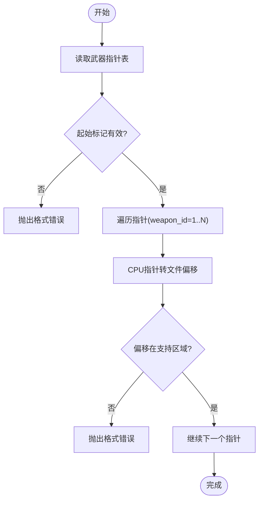
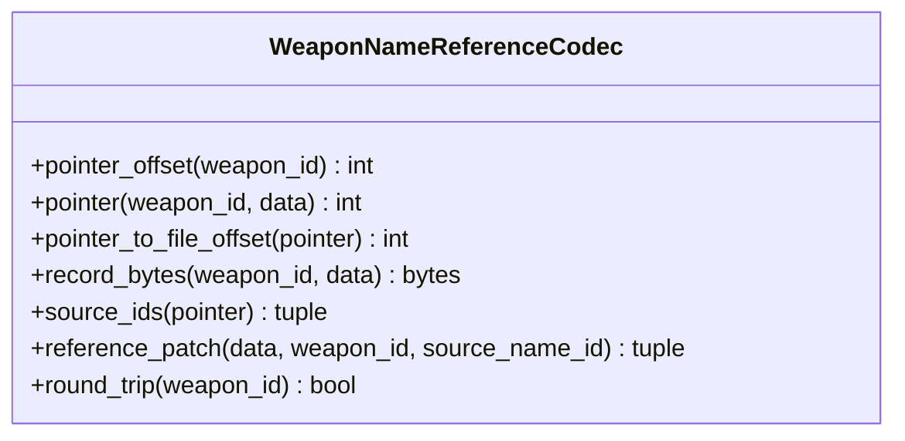
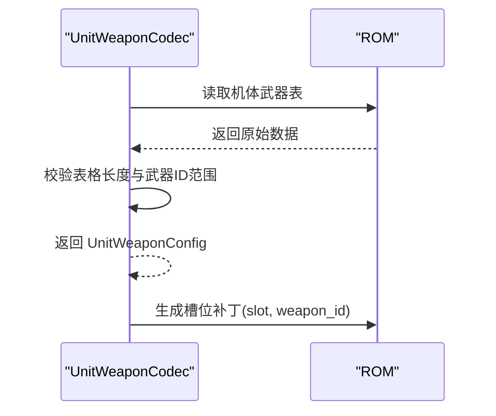
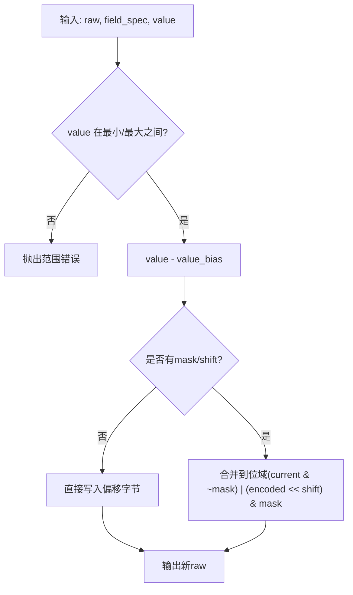
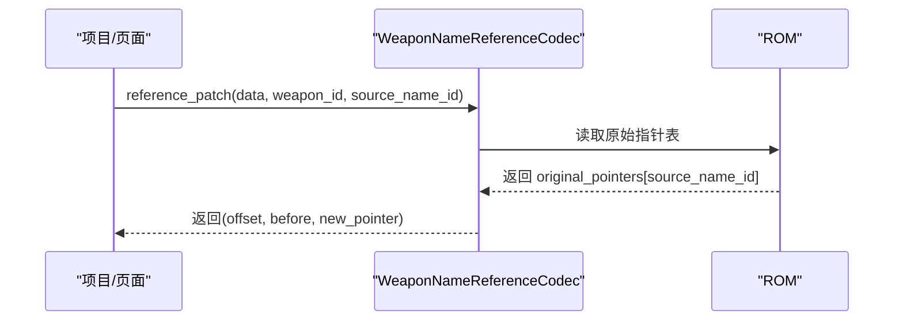
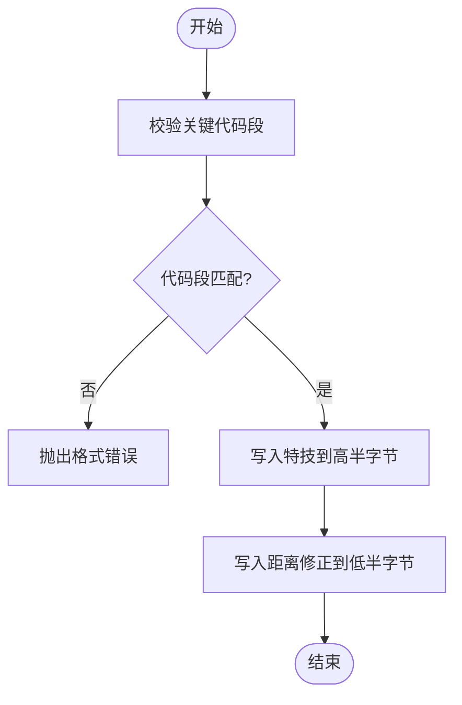
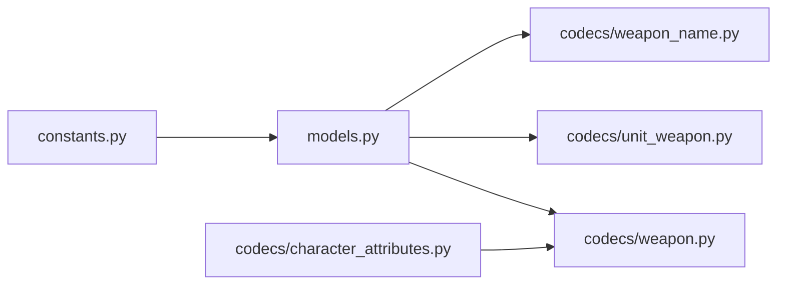

# 武器编解码器

<cite>
**本文引用的文件**
- [src/fc_editor/codecs/weapon.py](file://src/fc_editor/codecs/weapon.py)
- [src/fc_editor/codecs/weapon_name.py](file://src/fc_editor/codecs/weapon_name.py)
- [src/fc_editor/codecs/unit_weapon.py](file://src/fc_editor/codecs/unit_weapon.py)
- [src/fc_editor/models.py](file://src/fc_editor/models.py)
- [src/fc_editor/constants.py](file://src/fc_editor/constants.py)
- [src/fc_editor/codecs/character_attributes.py](file://src/fc_editor/codecs/character_attributes.py)
- [src/dc_modifier/pages.py](file://src/dc_modifier/pages.py)
</cite>

## 目录
1. [简介](#简介)
2. [项目结构](#项目结构)
3. [核心组件](#核心组件)
4. [架构总览](#架构总览)
5. [详细组件分析](#详细组件分析)
6. [依赖关系分析](#依赖关系分析)
7. [性能考虑](#性能考虑)
8. [故障排查指南](#故障排查指南)
9. [结论](#结论)
10. [附录](#附录)

## 简介
本技术文档围绕“武器(Weapon)编解码器”展开，系统阐述武器数据的二进制格式、字段编码规则、数值范围验证机制，以及武器名称引用与关联数据索引管理。同时给出内存布局、伤害计算相关参数的数据表示、特效参数编码方式、具体数据格式示例、解析流程与完整性校验方法，并提供性能优化建议。读者无需深入底层即可理解并安全地编辑武器数据。

## 项目结构
武器相关能力由以下模块协同实现：
- 常量定义：武器记录大小、指针表偏移、PRG Bank 等
- 模型定义：武器记录结构、字段规格（含掩码、位移、偏置）
- 编解码器：武器记录编解码、武器名称引用编解码、机体武器槽位编解码
- 特性扩展：武器特技与距离修正的读取与补丁
- UI 页面：武器编辑页面对接上述能力，提供可视化编辑与状态提示

图表来源
- [src/fc_editor/constants.py:17-23](file://src/fc_editor/constants.py#L17-L23)
- [src/fc_editor/models.py:185-285](file://src/fc_editor/models.py#L185-L285)
- [src/fc_editor/codecs/weapon.py:13-90](file://src/fc_editor/codecs/weapon.py#L13-L90)
- [src/fc_editor/codecs/weapon_name.py:9-120](file://src/fc_editor/codecs/weapon_name.py#L9-L120)
- [src/fc_editor/codecs/unit_weapon.py:11-79](file://src/fc_editor/codecs/unit_weapon.py#L11-L79)
- [src/fc_editor/codecs/character_attributes.py:239-258](file://src/fc_editor/codecs/character_attributes.py#L239-L258)
- [src/dc_modifier/pages.py:1216-1399](file://src/dc_modifier/pages.py#L1216-L1399)

章节来源
- [src/fc_editor/constants.py:17-23](file://src/fc_editor/constants.py#L17-L23)
- [src/fc_editor/models.py:185-285](file://src/fc_editor/models.py#L185-L285)
- [src/fc_editor/codecs/weapon.py:13-90](file://src/fc_editor/codecs/weapon.py#L13-L90)
- [src/fc_editor/codecs/weapon_name.py:9-120](file://src/fc_editor/codecs/weapon_name.py#L9-L120)
- [src/fc_editor/codecs/unit_weapon.py:11-79](file://src/fc_editor/codecs/unit_weapon.py#L11-L79)
- [src/fc_editor/codecs/character_attributes.py:239-258](file://src/fc_editor/codecs/character_attributes.py#L239-L258)
- [src/dc_modifier/pages.py:1216-1399](file://src/dc_modifier/pages.py#L1216-L1399)

## 核心组件
- 武器记录编解码器：负责从 ROM 中按指针表定位武器记录，进行无损读取与写回；支持单字段补丁与往返一致性检查。
- 武器名称引用编解码器：通过复用已验证的名称记录指针，安全地共享或切换武器名称文本，避免越界与非法指针。
- 机体武器槽位编解码器：为每个机体维护两个直接武器 ID 槽位，并进行范围校验与补丁。
- 武器字段模型：以 WeaponFieldSpec 描述每个字段的内存偏移、掩码、位移、偏置、取值范围与说明，统一编解码逻辑。
- 特性扩展：读取/写入武器特技与距离命中修正，附带代码段校验以确保 ROM 版本兼容。

章节来源
- [src/fc_editor/codecs/weapon.py:13-90](file://src/fc_editor/codecs/weapon.py#L13-L90)
- [src/fc_editor/codecs/weapon_name.py:9-120](file://src/fc_editor/codecs/weapon_name.py#L9-L120)
- [src/fc_editor/codecs/unit_weapon.py:11-79](file://src/fc_editor/codecs/unit_weapon.py#L11-L79)
- [src/fc_editor/models.py:185-285](file://src/fc_editor/models.py#L185-L285)
- [src/fc_editor/codecs/character_attributes.py:239-258](file://src/fc_editor/codecs/character_attributes.py#L239-L258)

## 架构总览
武器数据在 ROM 中的组织分为三层：
- 指针表层：武器指针表指向各武器的属性记录所在 PRG Bank 偏移；名称指针表指向可复用的名称记录。
- 记录层：每条武器属性记录固定长度，包含射程、命中、地形攻击值等；名称记录为变长文本。
- 关联层：每个机体有两个武器槽位，直接引用武器 ID；部分特性（特技、距离修正）嵌入到武器记录的特定字节位。

图表来源
- [src/fc_editor/codecs/weapon.py:13-90](file://src/fc_editor/codecs/weapon.py#L13-L90)
- [src/fc_editor/codecs/weapon_name.py:9-120](file://src/fc_editor/codecs/weapon_name.py#L9-L120)
- [src/dc_modifier/pages.py:1216-1399](file://src/dc_modifier/pages.py#L1216-L1399)

## 详细组件分析

### 武器记录编解码器(WeaponCodec)
- 功能要点
  - 初始化时读取武器指针表，校验起始标记与指针有效性，并将 CPU 指针转换为文件偏移。
  - 根据 weapon_id 定位记录偏移，读取固定长度的原始字节，构造 WeaponRecord。
  - 提供 encode_record 保持原始字节不变，field_patch 针对单个字段生成补丁元组。
  - round_trip_record 用于往返一致性校验。
- 关键约束
  - 指针必须指向受支持的武器数据区，且记录不能越界。
  - 记录长度必须等于 WEAPON_RECORD_SIZE。

图表来源
- [src/fc_editor/codecs/weapon.py:20-39](file://src/fc_editor/codecs/weapon.py#L20-L39)

章节来源
- [src/fc_editor/codecs/weapon.py:13-90](file://src/fc_editor/codecs/weapon.py#L13-L90)
- [src/fc_editor/constants.py:17-20](file://src/fc_editor/constants.py#L17-L20)

### 武器名称引用编解码器(WeaponNameReferenceCodec)
- 功能要点
  - 初始化时读取名称指针表，校验起始标记与所有指针是否位于已验证的数据区间。
  - 构建 pointer -> weapon_ids 映射，计算每个唯一指针的记录容量。
  - 提供 pointer_offset、pointer、record_bytes、reference_patch 等方法，确保名称引用安全。
- 关键约束
  - 名称指针必须在已验证的首尾指针范围内。
  - 容量必须为正，防止重叠或无效命名空间。

图表来源
- [src/fc_editor/codecs/weapon_name.py:9-120](file://src/fc_editor/codecs/weapon_name.py#L9-L120)

章节来源
- [src/fc_editor/codecs/weapon_name.py:9-120](file://src/fc_editor/codecs/weapon_name.py#L9-L120)

### 机体武器槽位编解码器(UnitWeaponCodec)
- 功能要点
  - 每个机体拥有两个武器槽位，存储武器 ID。
  - 初始化时校验表格长度与每个槽位的武器 ID 是否在合法范围。
  - decode 返回 UnitWeaponConfig，encode 将配置写回字节序列，slot_patch 生成单槽位补丁。
- 关键约束
  - 武器 ID 必须小于当前 ROM 的武器总数。
  - 槽位索引仅允许 0 或 1。

图表来源
- [src/fc_editor/codecs/unit_weapon.py:11-79](file://src/fc_editor/codecs/unit_weapon.py#L11-L79)

章节来源
- [src/fc_editor/codecs/unit_weapon.py:11-79](file://src/fc_editor/codecs/unit_weapon.py#L11-L79)
- [src/fc_editor/constants.py:22-23](file://src/fc_editor/constants.py#L22-L23)

### 武器字段模型与内存布局
- 字段定义
  - 最大射程：偏移 0x00，低半字节，取值 1—16，内部存储为 (值-1)。
  - 命中：偏移 0x01，取值 0—255。
  - 对空攻击：偏移 0x03，取值 0—255。
  - 对陆攻击：偏移 0x04，取值 0—255。
  - 对海攻击：偏移 0x05，取值 0—255。
- 候选字段（待进一步验证）
  - 攻击类型标志：偏移 0x00 高半字节，取值 0—15。
  - 近程修正代码：偏移 0x02 低半字节，取值 0—15。
- 编解码规则
  - 解码：读取对应字节，若带 mask/shift 则先掩码再右移，最后加 value_bias。
  - 编码：先减 value_bias，再按 mask/shift 写入目标位，未使用位保持不变。

图表来源
- [src/fc_editor/models.py:205-242](file://src/fc_editor/models.py#L205-L242)
- [src/fc_editor/models.py:245-285](file://src/fc_editor/models.py#L245-L285)

章节来源
- [src/fc_editor/models.py:185-285](file://src/fc_editor/models.py#L185-L285)

### 武器名称引用机制与索引管理
- 名称指针表：每个武器 ID 对应一个 2 字节指针，指向可复用的名称记录。
- 共享与容量：多个武器可共享同一名称指针；系统计算每个唯一指针的容量，确保写入不越界。
- 安全引用：reference_patch 允许将一个武器的名称引用替换为另一个已有名称记录的指针，避免创建非法指针。

图表来源
- [src/fc_editor/codecs/weapon_name.py:98-112](file://src/fc_editor/codecs/weapon_name.py#L98-L112)

章节来源
- [src/fc_editor/codecs/weapon_name.py:9-120](file://src/fc_editor/codecs/weapon_name.py#L9-L120)

### 伤害计算公式的数据表示与特效参数编码
- 伤害相关参数
  - 命中(hit)：直接进入战斗命中率计算。
  - 地形攻击值(power_air/power_land/power_sea)：根据目标位置选择对应攻击值参与伤害计算。
  - 最大射程(max_range)：限制目标距离上限，间接影响命中与伤害判定。
- 特效参数
  - 武器特技(skill)：占用武器记录第 1 字节的高半字节，取值 0—15。
  - 距离命中修正(distance)：占用第 3 字节的低半字节，取值 0—3，选择命中修正表。
- 代码段校验
  - 在写入特技与距离修正前，会校验关键代码段是否与预期一致，防止 ROM 版本不兼容导致误改。

图表来源
- [src/fc_editor/codecs/character_attributes.py:239-258](file://src/fc_editor/codecs/character_attributes.py#L239-L258)

章节来源
- [src/fc_editor/codecs/character_attributes.py:239-258](file://src/fc_editor/codecs/character_attributes.py#L239-L258)

### 具体数据格式示例与解析流程
- 武器属性记录（6 字节）
  - 偏移 0x00：最大射程（低半字节，值-1），可选攻击类型标志（高半字节）。
  - 偏移 0x01：命中。
  - 偏移 0x02：近程修正代码（候选字段，低半字节）。
  - 偏移 0x03：对空攻击。
  - 偏移 0x04：对陆攻击。
  - 偏移 0x05：对海攻击。
- 名称记录
  - 变长 DC 文本，长度由指针表容量决定，可通过 record_bytes 读取。
- 解析流程
  - 通过武器 ID 查指针表得到记录偏移，读取 6 字节 raw。
  - 按字段规格解码各字段，显示与编辑。
  - 如需修改名称，通过名称引用指针切换到已有名称记录。

章节来源
- [src/fc_editor/models.py:245-285](file://src/fc_editor/models.py#L245-L285)
- [src/fc_editor/codecs/weapon_name.py:85-89](file://src/fc_editor/codecs/weapon_name.py#L85-L89)

### 解析代码片段路径
- 武器记录读取与构造：[src/fc_editor/codecs/weapon.py:55-66](file://src/fc_editor/codecs/weapon.py#L55-L66)
- 字段补丁生成：[src/fc_editor/codecs/weapon.py:72-85](file://src/fc_editor/codecs/weapon.py#L72-L85)
- 名称指针读取与转换：[src/fc_editor/codecs/weapon_name.py:59-83](file://src/fc_editor/codecs/weapon_name.py#L59-L83)
- 名称记录字节读取：[src/fc_editor/codecs/weapon_name.py:85-89](file://src/fc_editor/codecs/weapon_name.py#L85-L89)
- 机体武器槽位读取与补丁：[src/fc_editor/codecs/unit_weapon.py:50-79](file://src/fc_editor/codecs/unit_weapon.py#L50-L79)
- 特技与距离修正补丁：[src/fc_editor/codecs/character_attributes.py:244-258](file://src/fc_editor/codecs/character_attributes.py#L244-L258)

## 依赖关系分析
- 常量依赖：武器记录大小、指针表偏移、PRG Bank 等常量被编解码器与模型使用。
- 模型依赖：WeaponRecord 与 WeaponFieldSpec 提供数据结构与编解码规则。
- 编解码器耦合：
  - WeaponCodec 依赖 models 与 constants，负责指针表与记录读写。
  - WeaponNameReferenceCodec 独立于武器记录，但依赖 ROM profile 提供的名称表信息。
  - UnitWeaponCodec 依赖 constants 与 models，负责机体武器槽位。
  - character_attributes 扩展武器特技与距离修正，依赖 WeaponCodec 的定位能力。

图表来源
- [src/fc_editor/constants.py:17-23](file://src/fc_editor/constants.py#L17-L23)
- [src/fc_editor/models.py:185-285](file://src/fc_editor/models.py#L185-L285)
- [src/fc_editor/codecs/weapon.py:13-90](file://src/fc_editor/codecs/weapon.py#L13-L90)
- [src/fc_editor/codecs/unit_weapon.py:11-79](file://src/fc_editor/codecs/unit_weapon.py#L11-L79)
- [src/fc_editor/codecs/weapon_name.py:9-120](file://src/fc_editor/codecs/weapon_name.py#L9-L120)
- [src/fc_editor/codecs/character_attributes.py:239-258](file://src/fc_editor/codecs/character_attributes.py#L239-L258)

章节来源
- [src/fc_editor/constants.py:17-23](file://src/fc_editor/constants.py#L17-L23)
- [src/fc_editor/models.py:185-285](file://src/fc_editor/models.py#L185-L285)
- [src/fc_editor/codecs/weapon.py:13-90](file://src/fc_editor/codecs/weapon.py#L13-L90)
- [src/fc_editor/codecs/unit_weapon.py:11-79](file://src/fc_editor/codecs/unit_weapon.py#L11-L79)
- [src/fc_editor/codecs/weapon_name.py:9-120](file://src/fc_editor/codecs/weapon_name.py#L9-L120)
- [src/fc_editor/codecs/character_attributes.py:239-258](file://src/fc_editor/codecs/character_attributes.py#L239-L258)

## 性能考虑
- 批量读取与缓存
  - 指针表一次性读取并缓存，避免重复 I/O。
  - 名称指针表与容量信息在初始化时构建，减少运行时计算。
- 字段级补丁
  - 使用 field_patch 与 slot_patch 仅修改必要字节，降低写放大。
- 往返一致性检查
  - round_trip_record 与 round_trip 可用于快速验证编解码正确性，适合自动化测试。
- 代码段校验
  - 在写入特技与距离修正前校验关键代码段，避免版本不兼容导致的额外修复成本。

## 故障排查指南
- 常见错误
  - 指针表起始标记不正确：检查武器/名称指针表首项是否为约定标记。
  - 指针超出支持区域：确认指针指向的 PRG Bank 与窗口基址是否正确。
  - 记录不完整：确认读取长度等于 WEAPON_RECORD_SIZE。
  - 武器 ID 无效：确认 weapon_id 在 01—FF 范围内，且小于 ROM 武器总数。
  - 名称指针无效：确认名称指针在已验证的首尾指针范围内。
  - 特技/距离修正代码变化：当关键代码段不一致时，拒绝写入并提示版本差异。
- 排查步骤
  - 使用 round_trip 检查编解码一致性。
  - 打印指针与文件偏移，核对 ROM 布局。
  - 检查字段取值范围与掩码/位移设置是否符合预期。
  - 对于名称引用，确认 source_name_id 对应的指针存在且容量足够。

章节来源
- [src/fc_editor/codecs/weapon.py:20-39](file://src/fc_editor/codecs/weapon.py#L20-L39)
- [src/fc_editor/codecs/weapon_name.py:23-38](file://src/fc_editor/codecs/weapon_name.py#L23-L38)
- [src/fc_editor/codecs/unit_weapon.py:37-48](file://src/fc_editor/codecs/unit_weapon.py#L37-L48)
- [src/fc_editor/codecs/character_attributes.py:244-258](file://src/fc_editor/codecs/character_attributes.py#L244-L258)

## 结论
武器编解码器通过严格的指针表校验、固定长度记录与字段规格化，提供了安全、可验证的武器数据编辑能力。名称引用机制确保文本资源复用与边界安全；机体武器槽位与特性扩展进一步完善了武器系统的编辑面。结合往返一致性检查与代码段校验，可在保证数据完整性的前提下高效完成武器数据修改。

## 附录
- 武器属性字段速查
  - 最大射程：偏移 0x00 低半字节，取值 1—16，内部存储为值-1。
  - 命中：偏移 0x01，取值 0—255。
  - 对空/对陆/对海攻击：偏移 0x03/0x04/0x05，取值 0—255。
  - 候选字段：攻击类型标志（0x00 高半字节）、近程修正代码（0x02 低半字节）。
- 名称引用
  - 通过名称指针表复用已有名称记录，避免越界与非法指针。
- 特性参数
  - 特技：0x00 高半字节，取值 0—15。
  - 距离修正：0x02 低半字节，取值 0—3。