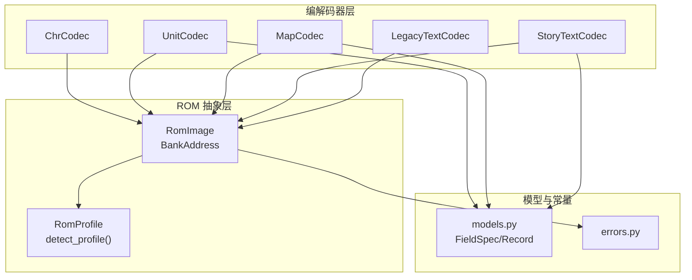
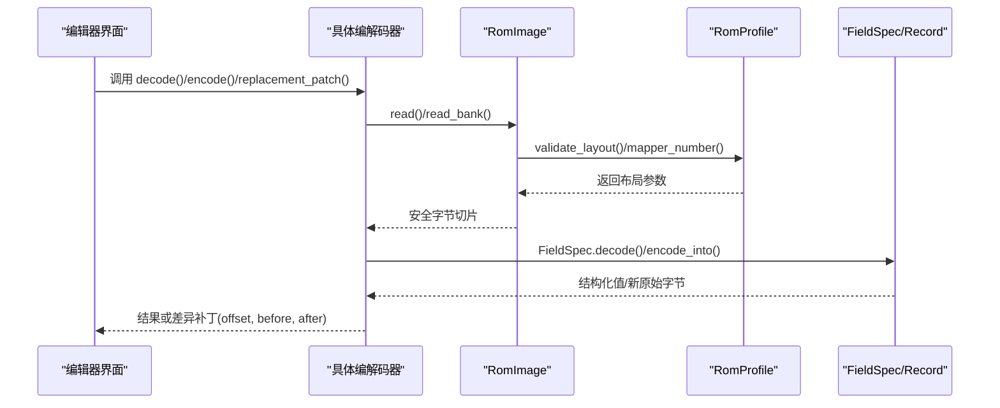
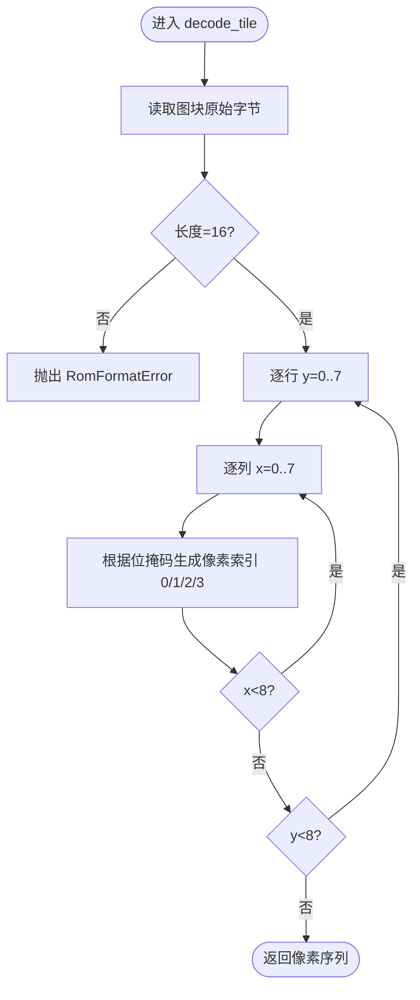
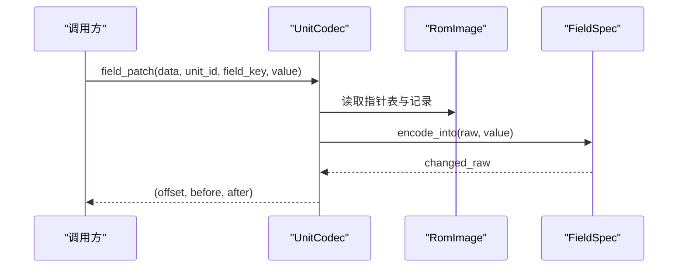
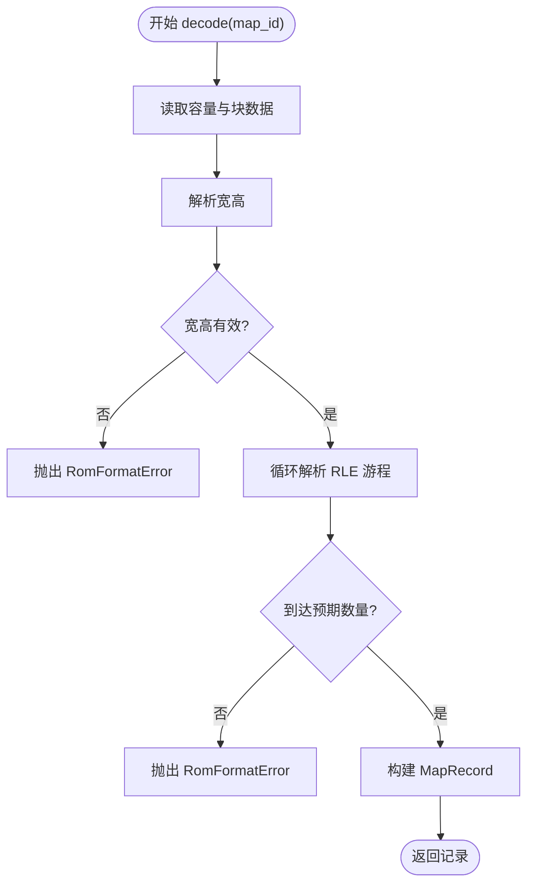
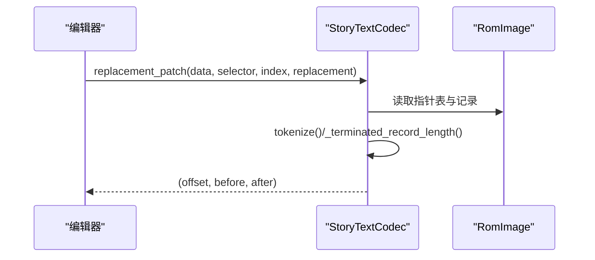
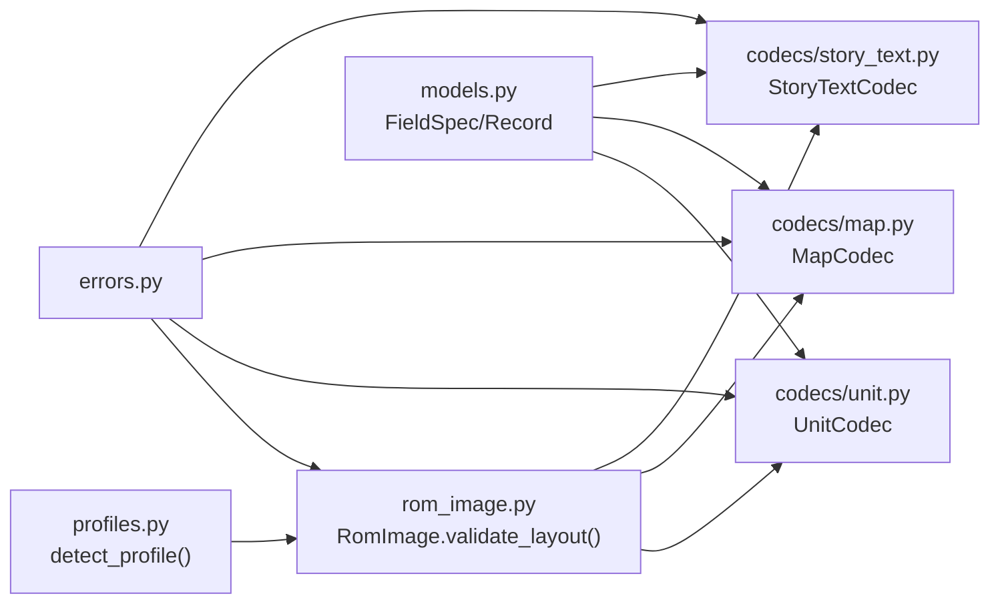

# 编解码器接口设计

<cite>
**本文引用的文件**
- [src/fc_editor/codecs/__init__.py](file://src/fc_editor/codecs/__init__.py)
- [src/fc_editor/codecs/chr.py](file://src/fc_editor/codecs/chr.py)
- [src/fc_editor/codecs/unit.py](file://src/fc_editor/codecs/unit.py)
- [src/fc_editor/codecs/map.py](file://src/fc_editor/codecs/map.py)
- [src/fc_editor/codecs/story_text.py](file://src/fc_editor/codecs/story_text.py)
- [src/fc_editor/codecs/legacy_text.py](file://src/fc_editor/codecs/legacy_text.py)
- [src/fc_editor/rom_image.py](file://src/fc_editor/rom_image.py)
- [src/fc_editor/models.py](file://src/fc_editor/models.py)
- [src/fc_editor/profiles.py](file://src/fc_editor/profiles.py)
- [src/fc_editor/errors.py](file://src/fc_editor/errors.py)
</cite>

## 目录
1. [简介](#简介)
2. [项目结构](#项目结构)
3. [核心组件](#核心组件)
4. [架构总览](#架构总览)
5. [详细组件分析](#详细组件分析)
6. [依赖关系分析](#依赖关系分析)
7. [性能考量](#性能考量)
8. [故障排查指南](#故障排查指南)
9. [结论](#结论)
10. [附录：扩展与最佳实践](#附录：扩展与最佳实践)

## 简介
本技术文档围绕 FC 游戏修改器中的“编解码器”子系统，系统化阐述其接口设计、数据格式规范、注册与生命周期管理、错误处理策略，以及多 ROM 布局兼容性、数据验证规则与性能优化技巧。通过代码级分析与图示，帮助读者理解如何继承基类实现自定义编解码器、处理复杂数据结构并集成到编辑系统中。

## 项目结构
该子系统的核心位于 src/fc_editor 下：
- 编解码器实现集中在 src/fc_editor/codecs，按数据类型划分（如 CHR、地图、剧情文本、旧版文本等）。
- 通用 ROM 访问与校验在 rom_image.py。
- 领域模型与字段规格定义在 models.py。
- ROM 布局与版本特征在 profiles.py。
- 统一异常类型在 errors.py。
- codecs/__init__.py 作为模块出口，集中导出各编解码器。

**图表来源**
- [src/fc_editor/codecs/chr.py:11-94](file://src/fc_editor/codecs/chr.py#L11-L94)
- [src/fc_editor/codecs/unit.py:14-120](file://src/fc_editor/codecs/unit.py#L14-L120)
- [src/fc_editor/codecs/map.py:16-228](file://src/fc_editor/codecs/map.py#L16-L228)
- [src/fc_editor/codecs/story_text.py:17-259](file://src/fc_editor/codecs/story_text.py#L17-L259)
- [src/fc_editor/codecs/legacy_text.py:60-190](file://src/fc_editor/codecs/legacy_text.py#L60-L190)
- [src/fc_editor/rom_image.py:50-125](file://src/fc_editor/rom_image.py#L50-L125)
- [src/fc_editor/models.py:13-60](file://src/fc_editor/models.py#L13-L60)
- [src/fc_editor/profiles.py:276-334](file://src/fc_editor/profiles.py#L276-L334)
- [src/fc_editor/errors.py:1-11](file://src/fc_editor/errors.py#L1-L11)

**章节来源**
- [src/fc_editor/codecs/__init__.py:1-47](file://src/fc_editor/codecs/__init__.py#L1-L47)
- [src/fc_editor/rom_image.py:50-125](file://src/fc_editor/rom_image.py#L50-L125)
- [src/fc_editor/models.py:13-60](file://src/fc_editor/models.py#L13-L60)
- [src/fc_editor/profiles.py:276-334](file://src/fc_editor/profiles.py#L276-L334)
- [src/fc_editor/errors.py:1-11](file://src/fc_editor/errors.py#L1-L11)

## 核心组件
- RomImage：提供只读、可校验的 ROM 字节视图，封装 iNES 头解析、布局校验、Mapper 检测、安全读取与 Bank 地址转换。
- RomProfile：描述不同 ROM 版本的布局、指针表位置、存储区范围、受保护区域、自由区域等元信息，并通过 detect_profile 自动识别。
- FieldSpec/Record：以声明式方式定义字段宽度、端序、掩码、取值范围、证据等级等，并提供 decode/encode_into 能力；记录对象封装原始字节与便捷读写方法。
- 编解码器族：
  - ChrCodec：无损处理 CHR-ROM 2bpp 图块流，支持像素与字节互转、范围读取。
  - UnitCodec：读取机体指针表与记录，支持字段级 patch、往返校验。
  - MapCodec：解码/编码 4-bit 地形 RLE 地图，支持容量受限写入与语义摘要。
  - StoryTextCodec：对本地化剧情文本进行无损视图与定长写入，保留未知 token。
  - LegacyTextCodec：对旧版指针表与文本池进行验证与替换，保持控制码与结束码不变。

**章节来源**
- [src/fc_editor/rom_image.py:50-125](file://src/fc_editor/rom_image.py#L50-L125)
- [src/fc_editor/profiles.py:276-334](file://src/fc_editor/profiles.py#L276-L334)
- [src/fc_editor/models.py:13-60](file://src/fc_editor/models.py#L13-L60)
- [src/fc_editor/codecs/chr.py:11-94](file://src/fc_editor/codecs/chr.py#L11-L94)
- [src/fc_editor/codecs/unit.py:14-120](file://src/fc_editor/codecs/unit.py#L14-L120)
- [src/fc_editor/codecs/map.py:16-228](file://src/fc_editor/codecs/map.py#L16-L228)
- [src/fc_editor/codecs/story_text.py:17-259](file://src/fc_editor/codecs/story_text.py#L17-L259)
- [src/fc_editor/codecs/legacy_text.py:60-190](file://src/fc_editor/codecs/legacy_text.py#L60-L190)

## 架构总览
编解码器采用“统一抽象 + 具体实现”的模式：所有编解码器均基于 RomImage 提供的安全读取能力，结合 RomProfile 描述的布局信息进行定位与校验；同时使用 models.py 中的 FieldSpec/Record 完成结构化字段的编解码。错误通过统一的异常类型向上抛出，便于上层编辑系统捕获与提示。

**图表来源**
- [src/fc_editor/rom_image.py:79-125](file://src/fc_editor/rom_image.py#L79-L125)
- [src/fc_editor/profiles.py:699-759](file://src/fc_editor/profiles.py#L699-L759)
- [src/fc_editor/models.py:37-58](file://src/fc_editor/models.py#L37-L58)
- [src/fc_editor/codecs/map.py:136-173](file://src/fc_editor/codecs/map.py#L136-L173)
- [src/fc_editor/codecs/unit.py:86-115](file://src/fc_editor/codecs/unit.py#L86-L115)
- [src/fc_editor/codecs/story_text.py:156-179](file://src/fc_editor/codecs/story_text.py#L156-L179)

## 详细组件分析

### ChrCodec：无损 CHR 图块编解码
- 职责：定位 CHR-ROM 区域，按 16 字节图块进行无损读取与像素级编解码，支持范围读取。
- 关键流程：
  - 构造时校验 CHR 区域大小与对齐。
  - tile_offset 计算绝对偏移。
  - decode_tile 将 2bpp 行低/高字节展开为 8×8 像素索引。
  - encode_tile 将像素索引压缩回 2bpp 字节。
- 复杂度：单图块 O(1)，范围读取 O(N)。
- 错误处理：越界、不完整数据抛出 RomFormatError。

**图表来源**
- [src/fc_editor/codecs/chr.py:42-57](file://src/fc_editor/codecs/chr.py#L42-L57)

**章节来源**
- [src/fc_editor/codecs/chr.py:11-94](file://src/fc_editor/codecs/chr.py#L11-L94)

### UnitCodec：机体指针表与记录编解码
- 职责：读取 128 项机体指针表，定位记录，支持字段级 patch 与往返校验。
- 关键点：
  - 指针表起始标记校验与越界检查。
  - record_offset_from_pointer 支持扩展 Bank 对映射。
  - field_patch 利用 FieldSpec 进行带范围校验的字段写入，返回差异补丁。
- 复杂度：指针表读取 O(N)，字段 patch O(1)。
- 错误处理：指针无效、记录不完整、ID 越界等抛出 RomFormatError/IndexError。

**图表来源**
- [src/fc_editor/codecs/unit.py:100-115](file://src/fc_editor/codecs/unit.py#L100-L115)
- [src/fc_editor/models.py:46-58](file://src/fc_editor/models.py#L46-L58)

**章节来源**
- [src/fc_editor/codecs/unit.py:14-120](file://src/fc_editor/codecs/unit.py#L14-L120)
- [src/fc_editor/models.py:165-183](file://src/fc_editor/models.py#L165-L183)

### MapCodec：4-bit 地形 RLE 地图编解码
- 职责：解码/编码地图数据，支持容量受限写入与语义摘要。
- 关键点：
  - 指针表与 Bank 目录读取，容量计算。
  - decode 解析 RLE 游程，构建 MapRecord。
  - encode 生成紧凑 RLE 编码。
  - replacement_patch 保证编码后不超出容量，返回差异补丁。
- 复杂度：decode/encode 均为 O(W×H)。
- 错误处理：尺寸越界、RLE 游程越界、容量不足等抛出 RomFormatError/ValueError。

**图表来源**
- [src/fc_editor/codecs/map.py:136-173](file://src/fc_editor/codecs/map.py#L136-L173)

**章节来源**
- [src/fc_editor/codecs/map.py:16-228](file://src/fc_editor/codecs/map.py#L16-L228)

### StoryTextCodec：剧情文本无损视图与定长写入
- 职责：按组选择器读取指针表，计算每条记录的容量，提供 token 化与定长替换。
- 关键点：
  - GLYPH_LEADS 限定中文字形双字节边界，避免误判控制码。
  - _terminated_record_length 扫描至 FF 结束码，确保记录边界正确。
  - replacement_patch 要求输入与容量严格相等，保证不可变布局。
- 复杂度：tokenize/terminated_record_length 为 O(L)。
- 错误处理：指针越界、记录不完整、缺少结束码等抛出 RomFormatError。

**图表来源**
- [src/fc_editor/codecs/story_text.py:156-179](file://src/fc_editor/codecs/story_text.py#L156-L179)
- [src/fc_editor/codecs/story_text.py:228-245](file://src/fc_editor/codecs/story_text.py#L228-L245)

**章节来源**
- [src/fc_editor/codecs/story_text.py:17-259](file://src/fc_editor/codecs/story_text.py#L17-L259)

### LegacyTextCodec：旧版文本指针表与池验证
- 职责：验证旧版文本指针表与池边界，支持随机对话变体与受保护 token 保留。
- 关键点：
  - 指针表入口校验与池边界限制。
  - 随机对话 F8 变体指针链验证。
  - protected_tokens 提取控制码与参数，确保替换时不被破坏。
- 错误处理：越界指针、缺少结束码、容量不匹配等抛出 RomFormatError/ValueError。

**章节来源**
- [src/fc_editor/codecs/legacy_text.py:60-190](file://src/fc_editor/codecs/legacy_text.py#L60-L190)

## 依赖关系分析
- RomImage 依赖 profiles.detect_profile 进行 ROM 布局识别与校验。
- 各编解码器依赖 RomImage 的安全读取与 Bank 地址转换。
- UnitCodec/MapCodec/StoryTextCodec 依赖 models.py 的 FieldSpec/Record 进行字段级操作。
- 所有编解码器统一使用 errors.py 的异常类型，便于上层捕获。

**图表来源**
- [src/fc_editor/profiles.py:699-759](file://src/fc_editor/profiles.py#L699-L759)
- [src/fc_editor/rom_image.py:79-125](file://src/fc_editor/rom_image.py#L79-L125)
- [src/fc_editor/codecs/unit.py:14-120](file://src/fc_editor/codecs/unit.py#L14-L120)
- [src/fc_editor/codecs/map.py:16-228](file://src/fc_editor/codecs/map.py#L16-L228)
- [src/fc_editor/codecs/story_text.py:17-259](file://src/fc_editor/codecs/story_text.py#L17-L259)
- [src/fc_editor/models.py:13-60](file://src/fc_editor/models.py#L13-L60)
- [src/fc_editor/errors.py:1-11](file://src/fc_editor/errors.py#L1-L11)

**章节来源**
- [src/fc_editor/profiles.py:276-334](file://src/fc_editor/profiles.py#L276-L334)
- [src/fc_editor/rom_image.py:50-125](file://src/fc_editor/rom_image.py#L50-L125)
- [src/fc_editor/models.py:13-60](file://src/fc_editor/models.py#L13-L60)
- [src/fc_editor/errors.py:1-11](file://src/fc_editor/errors.py#L1-L11)

## 性能考量
- 批量读取：优先使用 range_bytes 或一次性读取大块数据，减少多次 I/O 与切片开销。
- 内存占用：编解码器尽量以只读视图工作，避免复制大对象；仅在必要时创建 bytearray。
- 算法复杂度：地图 RLE 编解码为线性时间；CHR 图块处理为常数时间。
- 缓存策略：对频繁访问的指针表或容量信息可在编解码器实例内缓存。
- 校验成本：仅在初始化或关键路径执行布局校验与签名验证，避免重复计算。

[本节为通用指导，无需特定文件引用]

## 故障排查指南
- ROM 头或布局不符：检查 RomImage.validate_layout 抛出的 RomFormatError，确认 iNES 头、大小、Mapper 与 profile 匹配。
- 指针越界或无效：检查各编解码器的指针表读取逻辑与范围校验，确保指针位于允许的窗口或扩展 Bank。
- 记录不完整或缺少结束码：检查 StoryTextCodec/LegacyTextCodec 的终止符扫描与容量计算。
- 容量不足导致写入失败：MapCodec.replacement_patch 与 StoryTextCodec.replacement_patch 要求编码后不超过原容量。
- 冲突写入：若多个编辑模块尝试重叠写入，可能触发 ChangeConflictError，需合并或序列化变更。

**章节来源**
- [src/fc_editor/rom_image.py:79-125](file://src/fc_editor/rom_image.py#L79-L125)
- [src/fc_editor/codecs/story_text.py:97-120](file://src/fc_editor/codecs/story_text.py#L97-L120)
- [src/fc_editor/codecs/legacy_text.py:126-141](file://src/fc_editor/codecs/legacy_text.py#L126-L141)
- [src/fc_editor/codecs/map.py:203-223](file://src/fc_editor/codecs/map.py#L203-L223)
- [src/fc_editor/errors.py:1-11](file://src/fc_editor/errors.py#L1-L11)

## 结论
该编解码器子系统通过 RomImage 与 RomProfile 提供稳定、可验证的 ROM 访问能力，配合 models.py 的声明式字段定义，实现了高度一致的数据格式规范与安全的编解码流程。各编解码器遵循统一接口约定，支持无损读写、容量受限替换与差异补丁输出，便于编辑系统集成与变更追踪。通过严格的错误处理与性能优化策略，系统在多 ROM 布局兼容性与可扩展性方面具备良好基础。

[本节为总结性内容，无需特定文件引用]

## 附录：扩展与最佳实践
- 继承与实现建议：
  - 新建编解码器应基于 RomImage 的安全读取，结合 RomProfile 获取布局参数。
  - 使用 FieldSpec/Record 定义字段规格，确保范围、掩码、端序与证据等级明确。
  - 提供 decode/encode/replacement_patch 方法，返回 (offset, before, after) 以便上层应用合并变更。
- 数据格式规范：
  - 明确记录容量与边界，禁止跨 Bank 或越界写入。
  - 对于含控制码/参数的文本，必须保留受保护 token 与结束码。
- 注册机制与生命周期：
  - 通过 codecs/__init__.py 集中导出，便于上层按需导入。
  - 编解码器实例通常绑定到一次 RomImage 生命周期，避免跨实例共享可变状态。
- 兼容性处理：
  - 针对不同 ROM 布局，优先使用 RomProfile 描述而非硬编码偏移。
  - 对扩展 Bank 或重定位场景，提供可选参数覆盖默认行为。
- 错误处理策略：
  - 使用 RomFormatError/ProjectFormatError/ChangeConflictError 区分错误类型。
  - 在关键路径进行前置校验，尽早失败，减少后续处理成本。
- 性能优化技巧：
  - 批量读取与缓存热点数据。
  - 避免不必要的字节复制，优先使用切片与只读视图。
  - 对大对象（如地图）采用增量更新与差异补丁。
- 常见问题解决方案：
  - 指针表起始标记不正确：检查 profile 配置与 ROM 版本是否匹配。
  - 文本记录缺少结束码：检查 token 边界与控制码解析逻辑。
  - 地图 RLE 游程越界：检查宽高与游程长度计算。

**章节来源**
- [src/fc_editor/codecs/__init__.py:1-47](file://src/fc_editor/codecs/__init__.py#L1-L47)
- [src/fc_editor/profiles.py:276-334](file://src/fc_editor/profiles.py#L276-L334)
- [src/fc_editor/models.py:13-60](file://src/fc_editor/models.py#L13-L60)
- [src/fc_editor/errors.py:1-11](file://src/fc_editor/errors.py#L1-L11)