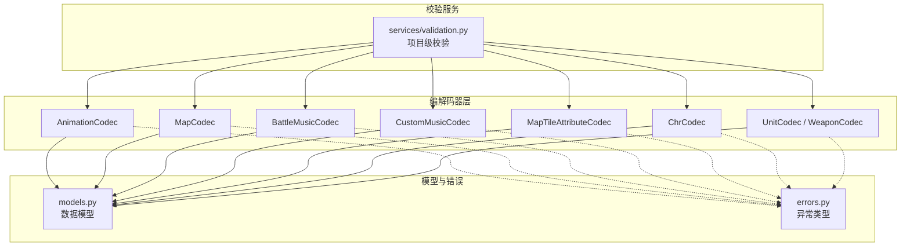
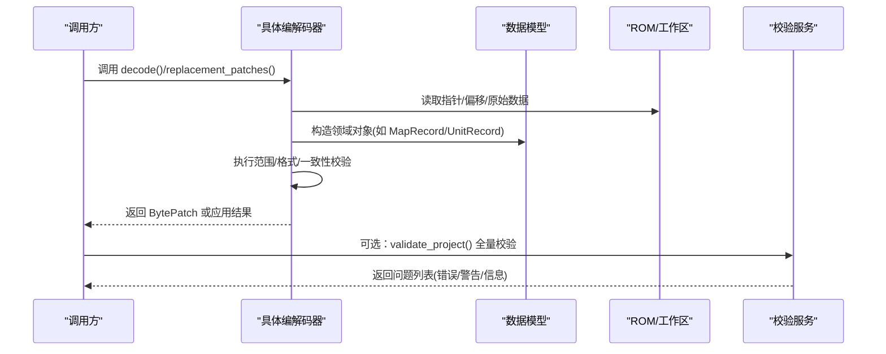
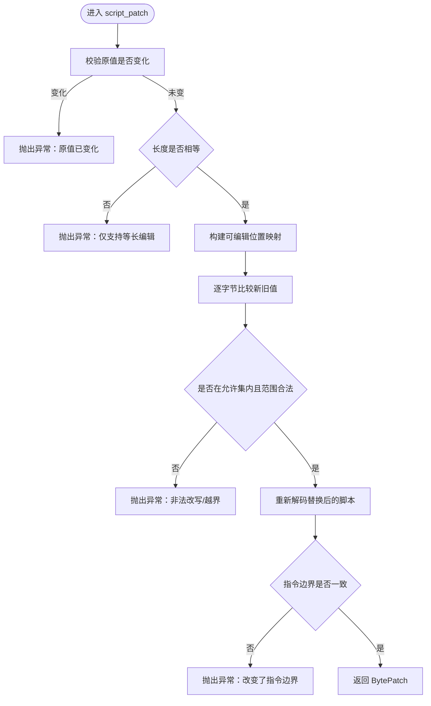
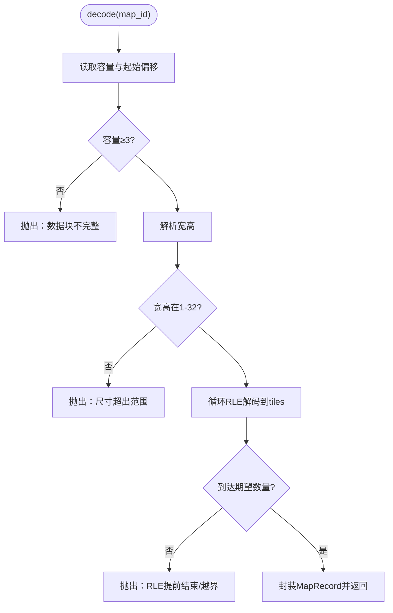
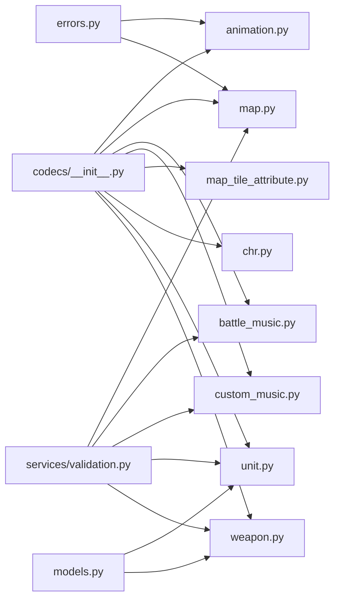

# 编解码器系统

<cite>
**本文引用的文件**
- [src/fc_editor/codecs/__init__.py](file://src/fc_editor/codecs/__init__.py)
- [src/fc_editor/codecs/animation.py](file://src/fc_editor/codecs/animation.py)
- [src/fc_editor/codecs/map.py](file://src/fc_editor/codecs/map.py)
- [src/fc_editor/codecs/battle_music.py](file://src/fc_editor/codecs/battle_music.py)
- [src/fc_editor/codecs/custom_music.py](file://src/fc_editor/codecs/custom_music.py)
- [src/fc_editor/codecs/map_tile_attribute.py](file://src/fc_editor/codecs/map_tile_attribute.py)
- [src/fc_editor/codecs/chr.py](file://src/fc_editor/codecs/chr.py)
- [src/fc_editor/models.py](file://src/fc_editor/models.py)
- [src/fc_editor/errors.py](file://src/fc_editor/errors.py)
- [src/fc_editor/services/validation.py](file://src/fc_editor/services/validation.py)
</cite>

## 目录
1. [简介](#简介)
2. [项目结构](#项目结构)
3. [核心组件](#核心组件)
4. [架构总览](#架构总览)
5. [详细组件分析](#详细组件分析)
6. [依赖关系分析](#依赖关系分析)
7. [性能考虑](#性能考虑)
8. [故障排查指南](#故障排查指南)
9. [结论](#结论)
10. [附录：扩展与最佳实践](#附录：扩展与最佳实践)

## 简介
本技术文档围绕 FC 扩容 MMC3 项目的“编解码器系统”展开，系统性说明 Codec 接口设计模式、数据格式规范、扩展开发指南，并深入解析动画、地图、音乐、图块属性等关键编解码器的实现原理。文档同时覆盖数据验证机制、错误处理策略与性能优化技巧，提供注册新编解码器、处理复杂数据结构、实现自定义格式支持的具体步骤与最佳实践，帮助开发者安全、高效地扩展修改器能力。

## 项目结构
本项目将编解码器统一放置在 src/fc_editor/codecs 目录下，每个资源类型对应一个 codec 模块；公共模型定义在 models.py，错误类型集中在 errors.py，全局校验逻辑位于 services/validation.py。codecs/__init__.py 集中导出所有公开编解码器，便于上层模块按需导入。

图表来源
- [src/fc_editor/codecs/__init__.py:1-47](file://src/fc_editor/codecs/__init__.py#L1-L47)
- [src/fc_editor/services/validation.py:142-683](file://src/fc_editor/services/validation.py#L142-L683)

章节来源
- [src/fc_editor/codecs/__init__.py:1-47](file://src/fc_editor/codecs/__init__.py#L1-L47)

## 核心组件
- 动画编解码器（AnimationCodec）：对当前 DC ROM 的动画资源进行有界解码与安全补丁，严格校验指令边界与控制流完整性。
- 地图编解码器（MapCodec）：解码/编码 4-bit 地形 RLE 地图，支持容量受限替换与语义摘要。
- 战斗音乐编解码器（BattleMusicCodec）：解码/替换攻击方/防守方战斗主题表项，命令受配置约束。
- 自定义音乐编解码器（CustomMusicCodec）：固定大小 FamiStudio 音乐 Bank，含完整头与指针校验。
- 地图图块属性编解码器（MapTileAttributeCodec）：已验证的 A-G 图库图块属性记录，颜色、移动补正等字段强校验。
- CHR 编解码器（ChrCodec）：无损 iNES CHR-ROM 2bpp 图块流编解码。
- 机体/武器编解码器（UnitCodec/WeaponCodec）：读取指针表与记录，按 FieldSpec 进行字段级读写。

章节来源
- [src/fc_editor/codecs/animation.py:145-328](file://src/fc_editor/codecs/animation.py#L145-L328)
- [src/fc_editor/codecs/map.py:16-228](file://src/fc_editor/codecs/map.py#L16-L228)
- [src/fc_editor/codecs/battle_music.py:20-100](file://src/fc_editor/codecs/battle_music.py#L20-L100)
- [src/fc_editor/codecs/custom_music.py:10-66](file://src/fc_editor/codecs/custom_music.py#L10-L66)
- [src/fc_editor/codecs/map_tile_attribute.py:28-143](file://src/fc_editor/codecs/map_tile_attribute.py#L28-L143)
- [src/fc_editor/codecs/chr.py:11-94](file://src/fc_editor/codecs/chr.py#L11-L94)
- [src/fc_editor/codecs/unit.py:14-120](file://src/fc_editor/codecs/unit.py#L14-L120)
- [src/fc_editor/codecs/weapon.py:13-90](file://src/fc_editor/codecs/weapon.py#L13-L90)

## 架构总览
编解码器遵循统一的“读原值—校验—生成补丁”的模式：
- 输入：ROM 或工作区字节序列、资源 ID/选择器、目标值。
- 过程：定位指针/偏移，解码为领域模型，执行范围/格式/一致性校验。
- 输出：返回 BytePatch（偏移、原值、新值）或直接写入工作区（带事务保护）。

图表来源
- [src/fc_editor/codecs/map.py:136-228](file://src/fc_editor/codecs/map.py#L136-L228)
- [src/fc_editor/codecs/animation.py:199-328](file://src/fc_editor/codecs/animation.py#L199-L328)
- [src/fc_editor/services/validation.py:142-683](file://src/fc_editor/services/validation.py#L142-L683)

## 详细组件分析

### 动画编解码器（AnimationCodec）
- 设计要点
  - 基于 ROM 签名与描述符校验，确保解释器与资源布局一致。
  - 解析脚本指令，仅允许标记为可编辑的参数位被改写，控制流保持不变。
  - 提供 script_patch/rule_patch/call_patch 三类补丁方法，分别针对脚本、规律、调用点。
- 数据流
  - 从 TABLES 中获取各类型动画表的目录与指针范围，计算每条记录的 raw 与 instructions。
  - 对 movement/sprite 等特殊规律，进一步限制可编辑字节集合。
- 复杂度
  - 指令解析线性于记录长度；movement 可编辑性分析亦为线性。
- 错误处理
  - 越界指针、未验证指令、不等长替换、参数范围越界均抛出明确异常。

图表来源
- [src/fc_editor/codecs/animation.py:199-221](file://src/fc_editor/codecs/animation.py#L199-L221)

章节来源
- [src/fc_editor/codecs/animation.py:16-328](file://src/fc_editor/codecs/animation.py#L16-L328)

### 地图编解码器（MapCodec）
- 设计要点
  - 支持两种存储模式：内置存储区与扩展 Bank 表；自动计算容量与偏移。
  - 使用 4-bit 地形 RLE 压缩，decode/encode 保证往返一致。
  - replacement_patch 在容量限制下生成最小补丁。
- 数据流
  - 读取指针表→计算偏移→读取容量→RLE 解码为 tiles→封装 MapRecord。
- 复杂度
  - 解码/编码均为 O(W×H)，W/H≤32。
- 错误处理
  - 指针越界、容量无效、RLE 游程越界等均抛出 RomFormatError。

图表来源
- [src/fc_editor/codecs/map.py:136-173](file://src/fc_editor/codecs/map.py#L136-L173)

章节来源
- [src/fc_editor/codecs/map.py:16-228](file://src/fc_editor/codecs/map.py#L16-L228)
- [src/fc_editor/models.py:309-342](file://src/fc_editor/models.py#L309-L342)

### 战斗音乐编解码器（BattleMusicCodec）
- 设计要点
  - 依据 profile 中的 BattleMusicSpec 确定选择器数量与命令集合。
  - offsets/decode/replacement_patches 提供只读与写操作。
- 数据流
  - 根据 selector 计算攻击方/防守方命令偏移，读取并格式化显示。
- 错误处理
  - 选择器越界、命令不受支持时抛出异常。

章节来源
- [src/fc_editor/codecs/battle_music.py:20-100](file://src/fc_editor/codecs/battle_music.py#L20-L100)

### 自定义音乐编解码器（CustomMusicCodec）
- 设计要点
  - 固定 8192 字节 Bank，FamiStudio 格式包含曲目数与多段指针。
  - validate_bank 校验歌曲数、头部完整性及指针范围 $8000–$9FFF。
- 数据流
  - 通过命令映射到 slot，读取对应 Bank 字节并计算 SHA256 摘要。
- 错误处理
  - 命令重复、Bank 大小不符、指针越界等抛出异常。

章节来源
- [src/fc_editor/codecs/custom_music.py:10-66](file://src/fc_editor/codecs/custom_music.py#L10-L66)

### 地图图块属性编解码器（MapTileAttributeCodec）
- 设计要点
  - 固定记录起始地址与大小，A-G 图库图形选择器必须匹配预期。
  - 颜色表、防御、海陆空移动补正均有严格范围校验。
- 数据流
  - decode 解析颜色、属性与移动组；patches 生成逐字节差异补丁。
- 错误处理
  - 记录越界、颜色/移动值非法、图形选择器不可改等抛出异常。

章节来源
- [src/fc_editor/codecs/map_tile_attribute.py:28-143](file://src/fc_editor/codecs/map_tile_attribute.py#L28-L143)

### CHR 编解码器（ChrCodec）
- 设计要点
  - 基于 iNES 头定位 CHR-ROM 区域，按 16 字节图块访问。
  - decode_tile/encode_tile 实现 2bpp 像素与字节流的无损转换。
- 错误处理
  - CHR 区域不可用、图块索引越界、像素值非法等抛出异常。

章节来源
- [src/fc_editor/codecs/chr.py:11-94](file://src/fc_editor/codecs/chr.py#L11-L94)

### 机体/武器编解码器（UnitCodec / WeaponCodec）
- 设计要点
  - 读取指针表，校验记录偏移与长度，按 FieldSpec 进行字段级读写。
  - UnitCodec 支持 pair_first_bank 扩展场景；WeaponCodec 为只读为主。
- 错误处理
  - 指针表不完整、记录越界、字段范围越界等抛出异常。

章节来源
- [src/fc_editor/codecs/unit.py:14-120](file://src/fc_editor/codecs/unit.py#L14-L120)
- [src/fc_editor/codecs/weapon.py:13-90](file://src/fc_editor/codecs/weapon.py#L13-L90)
- [src/fc_editor/models.py:13-161](file://src/fc_editor/models.py#L13-L161)

## 依赖关系分析
- codecs/__init__.py 集中导出所有编解码器，形成统一入口。
- 各编解码器依赖 models.py 的数据结构与 errors.py 的异常类型。
- services/validation.py 聚合多个编解码器能力，执行项目级一致性检查。

图表来源
- [src/fc_editor/codecs/__init__.py:1-47](file://src/fc_editor/codecs/__init__.py#L1-L47)
- [src/fc_editor/services/validation.py:142-683](file://src/fc_editor/services/validation.py#L142-L683)

章节来源
- [src/fc_editor/codecs/__init__.py:1-47](file://src/fc_editor/codecs/__init__.py#L1-L47)
- [src/fc_editor/services/validation.py:142-683](file://src/fc_editor/services/validation.py#L142-L683)

## 性能考虑
- 地图 RLE 编解码为线性时间，适合小地图（最大 32×32）。
- 动画脚本解析与 movement 可编辑性分析均为线性，避免二次扫描。
- CustomMusicCodec.validate_bank 仅一次遍历校验指针与头部，开销可控。
- 建议批量生成补丁后一次性提交，减少多次 I/O 与校验成本。

## 故障排查指南
- 常见错误类型
  - RomFormatError：ROM 布局不匹配（如指针表不完整、记录越界）。
  - ProjectFormatError：项目文件格式错误或目标 ROM 不一致。
  - ChangeConflictError：多个编辑器模块尝试重叠写入冲突。
- 典型问题定位
  - 地图容量不足：检查 replacement_patch 返回值与 capacity。
  - 动画指令边界改变：确认仅改写标记为 editable 的字节。
  - 音乐命令不支持：核对 BattleMusicSpec.tracks 与 CustomMusicCodec.slots。
  - 图块属性非法：检查颜色表、移动补正范围与图形选择器。
- 调试建议
  - 使用 round_trip_record/round_trip 等方法验证编解码一致性。
  - 借助 validation 输出的 ValidationIssue 快速定位问题模块与信息。

章节来源
- [src/fc_editor/errors.py:1-11](file://src/fc_editor/errors.py#L1-L11)
- [src/fc_editor/services/validation.py:142-683](file://src/fc_editor/services/validation.py#L142-L683)

## 结论
该编解码器系统以严格的格式校验与有界编辑为核心，确保对 ROM 的安全修改。通过统一的模型与错误体系、集中的校验服务，实现了可扩展、可维护的资源处理能力。开发者可据此快速扩展新的编解码器，并在项目中集成自动化校验，保障修改质量与稳定性。

## 附录：扩展与最佳实践
- 注册新编解码器
  - 在 codecs/<your_codec>.py 中实现类，提供 decode/replacement_patches 等方法。
  - 在 codecs/__init__.py 的 __all__ 中添加导出名称。
- 处理复杂数据结构
  - 使用 dataclass 建模（参考 models.py），在构造函数中进行必要校验。
  - 对指针/偏移进行范围检查，避免越界访问。
- 实现自定义格式支持
  - 参照 CustomMusicCodec 的 validate_bank，定义格式头与指针校验规则。
  - 为 UI 提供 format_* 方法，便于展示人类可读信息。
- 最佳实践
  - 始终返回 BytePatch，由上层事务统一提交，避免并发写入冲突。
  - 保持控制流与边界不变（尤其是动画脚本）。
  - 充分利用 validation 服务进行端到端检查。
- 常见问题解决方案
  - 容量不足：拆分资源或使用扩展 Bank，调整容量规划。
  - 指令越界：仅修改标记为可编辑的字节，必要时重构脚本。
  - 指针异常：检查 profile 配置与 ROM 版本兼容性。