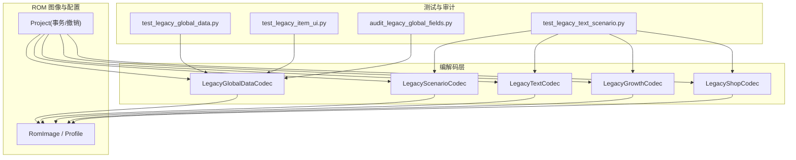
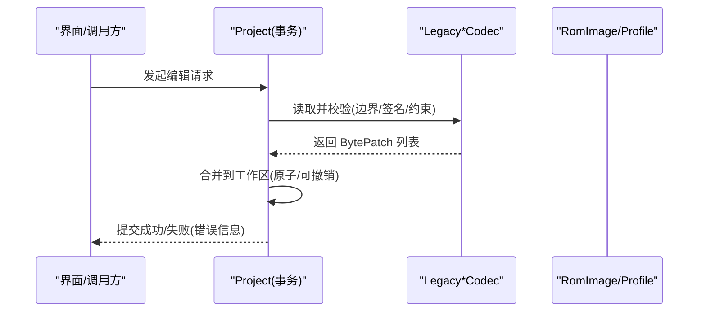
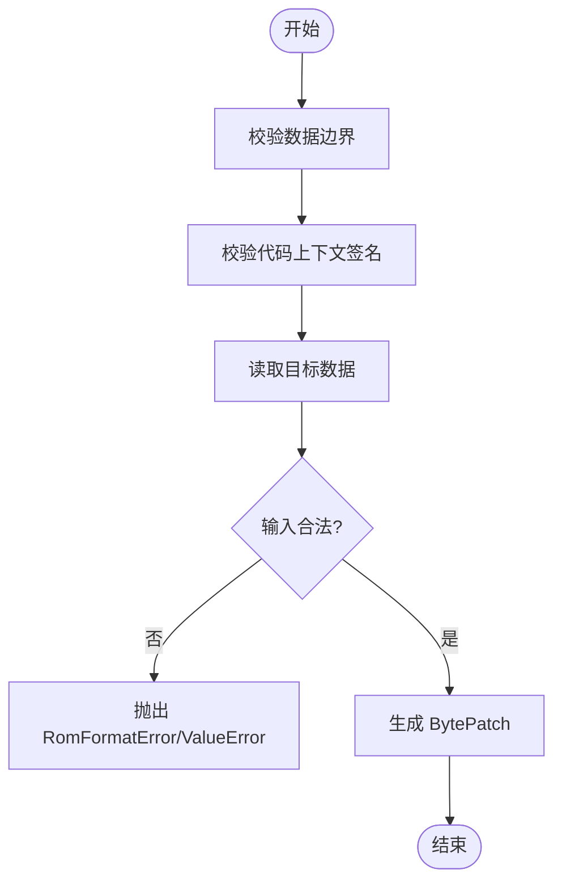
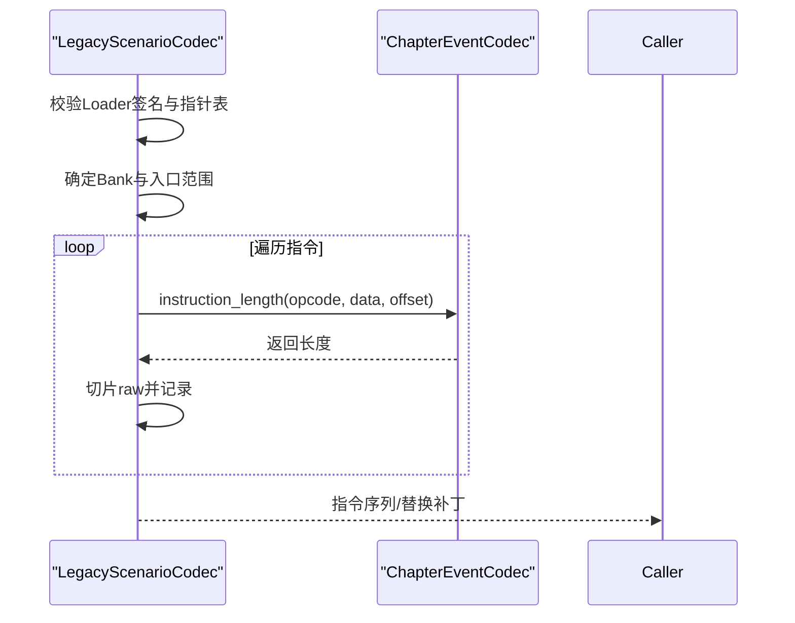
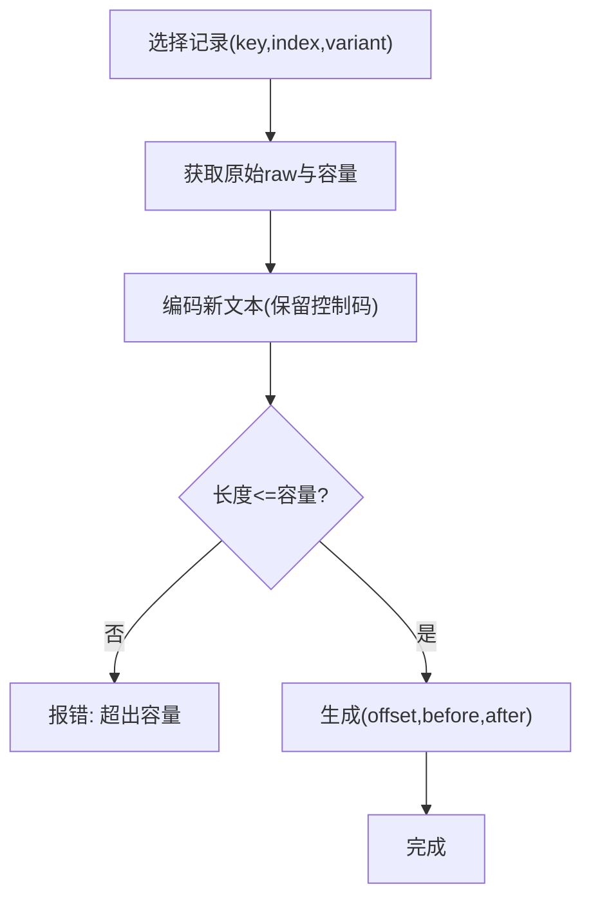
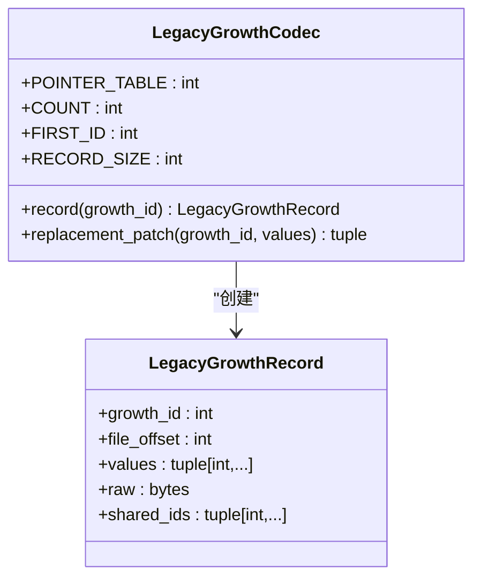
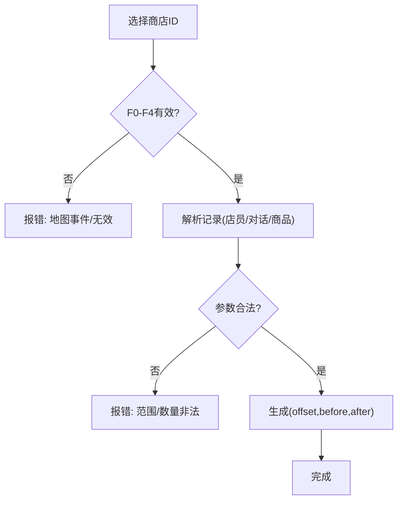
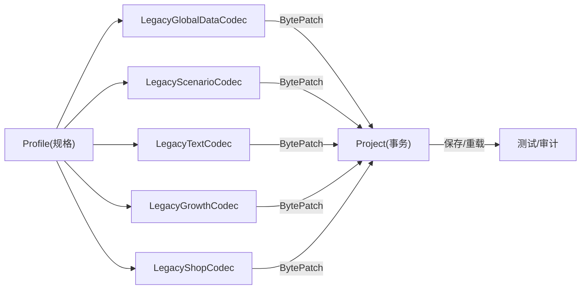

# 遗留数据编解码器

<cite>
**本文引用的文件**
- [src/fc_editor/codecs/legacy_global_data.py](file://src/fc_editor/codecs/legacy_global_data.py)
- [src/fc_editor/codecs/legacy_scenario.py](file://src/fc_editor/codecs/legacy_scenario.py)
- [src/fc_editor/codecs/legacy_text.py](file://src/fc_editor/codecs/legacy_text.py)
- [src/fc_editor/codecs/legacy_text_growth.py](file://src/fc_editor/codecs/legacy_text_growth.py)
- [src/fc_editor/codecs/legacy_text_shop.py](file://src/fc_editor/codecs/legacy_text_shop.py)
- [tests/test_legacy_global_data.py](file://tests/test_legacy_global_data.py)
- [tests/test_legacy_text_scenario.py](file://tests/test_legacy_text_scenario.py)
- [tests/test_legacy_item_ui.py](file://tests/test_legacy_item_ui.py)
- [tools/audit_legacy_global_fields.py](file://tools/audit_legacy_global_fields.py)
</cite>

## 目录
1. [简介](#简介)
2. [项目结构](#项目结构)
3. [核心组件](#核心组件)
4. [架构总览](#架构总览)
5. [详细组件分析](#详细组件分析)
6. [依赖关系分析](#依赖关系分析)
7. [性能考虑](#性能考虑)
8. [故障排除指南](#故障排除指南)
9. [结论](#结论)
10. [附录](#附录)

## 简介
本技术文档聚焦于“第二次机器人大战”FC ROM 的遗留数据编解码能力，覆盖全局数据、剧本事件、文本、成长曲线与商店等历史格式。其目标是：
- 在已验证的 ROM 布局基础上，安全地读取与回写旧版修改器数据；
- 通过代码上下文签名、边界校验与严格的数据约束，确保只修改受信任偏移；
- 提供可逆的补丁（BytePatch）机制，支持撤销/重做与精确还原；
- 将遗留系统与新架构集成，形成统一的工程化工作流与测试体系。

## 项目结构
围绕遗留数据编解码的核心位于 `src/fc_editor/codecs/`，每个历史数据域对应一个 Codec：
- 全局数据：双击命中、伤害公式、命中阈值、道具效果、初始阵容、距离命中修正表、累计经验、道具名称与价格
- 剧本事件：按 Bank 调度、指针表解析、指令长度计算与替换
- 文本：多组指针表、随机对话变体、控制码保护与容量限制
- 成长曲线：固定记录大小、共享记录、最后填充字节保留
- 商店：固定目录指针、店员/对话/商品数量与范围校验

**图表来源**
- [src/fc_editor/codecs/legacy_global_data.py:1-701](file://src/fc_editor/codecs/legacy_global_data.py#L1-L701)
- [src/fc_editor/codecs/legacy_scenario.py:1-86](file://src/fc_editor/codecs/legacy_scenario.py#L1-L86)
- [src/fc_editor/codecs/legacy_text.py:1-190](file://src/fc_editor/codecs/legacy_text.py#L1-L190)
- [src/fc_editor/codecs/legacy_text_growth.py:1-50](file://src/fc_editor/codecs/legacy_text_growth.py#L1-L50)
- [src/fc_editor/codecs/legacy_text_shop.py:1-55](file://src/fc_editor/codecs/legacy_text_shop.py#L1-L55)
- [tests/test_legacy_global_data.py:1-571](file://tests/test_legacy_global_data.py#L1-L571)
- [tests/test_legacy_text_scenario.py:1-268](file://tests/test_legacy_text_scenario.py#L1-L268)
- [tests/test_legacy_item_ui.py:1-178](file://tests/test_legacy_item_ui.py#L1-L178)
- [tools/audit_legacy_global_fields.py:1-329](file://tools/audit_legacy_global_fields.py#L1-L329)

**章节来源**
- [src/fc_editor/codecs/legacy_global_data.py:1-701](file://src/fc_editor/codecs/legacy_global_data.py#L1-L701)
- [src/fc_editor/codecs/legacy_scenario.py:1-86](file://src/fc_editor/codecs/legacy_scenario.py#L1-L86)
- [src/fc_editor/codecs/legacy_text.py:1-190](file://src/fc_editor/codecs/legacy_text.py#L1-L190)
- [src/fc_editor/codecs/legacy_text_growth.py:1-50](file://src/fc_editor/codecs/legacy_text_growth.py#L1-L50)
- [src/fc_editor/codecs/legacy_text_shop.py:1-55](file://src/fc_editor/codecs/legacy_text_shop.py#L1-L55)

## 核心组件
- LegacyGlobalDataCodec：以“代码上下文签名 + 边界校验”为核心，仅允许修改受信任的操作数与数据表，返回 BytePatch 元组用于原子写入。
- LegacyScenarioCodec：基于 Bank 调度与指针表，解析关卡脚本指令，保证替换不越界且保持指令长度一致。
- LegacyTextCodec：维护多组文字指针表与池边界，支持随机对话变体、控制码保护与容量限制，禁止重排文本池。
- LegacyGrowthCodec：固定 50 字节记录、99 个成长值（半字节对），保留末尾填充位，支持共享记录。
- LegacyShopCodec：固定目录指针表，校验店员、窗口、对话索引与商品数量/范围，拒绝非法写入。

**章节来源**
- [src/fc_editor/codecs/legacy_global_data.py:17-701](file://src/fc_editor/codecs/legacy_global_data.py#L17-L701)
- [src/fc_editor/codecs/legacy_scenario.py:28-86](file://src/fc_editor/codecs/legacy_scenario.py#L28-L86)
- [src/fc_editor/codecs/legacy_text.py:60-190](file://src/fc_editor/codecs/legacy_text.py#L60-L190)
- [src/fc_editor/codecs/legacy_text_growth.py:17-50](file://src/fc_editor/codecs/legacy_text_growth.py#L17-L50)
- [src/fc_editor/codecs/legacy_text_shop.py:18-55](file://src/fc_editor/codecs/legacy_text_shop.py#L18-L55)

## 架构总览
整体流程遵循“读校验 → 生成补丁 → 事务应用 → 可撤销”的模式：
- 初始化时进行 ROM 布局与代码签名校验，失败即关闭（fail-closed）；
- 所有写操作均返回 (offset, before, after) 形式的 BytePatch；
- 上层 Project 负责合并、事务与撤销/重做；
- 测试与审计工具覆盖默认值、异常路径、保存再加载一致性、UI 交互与单字段影响面。

**图表来源**
- [src/fc_editor/codecs/legacy_global_data.py:101-118](file://src/fc_editor/codecs/legacy_global_data.py#L101-L118)
- [src/fc_editor/codecs/legacy_scenario.py:40-56](file://src/fc_editor/codecs/legacy_scenario.py#L40-L56)
- [src/fc_editor/codecs/legacy_text.py:67-105](file://src/fc_editor/codecs/legacy_text.py#L67-L105)
- [tests/test_legacy_global_data.py:468-505](file://tests/test_legacy_global_data.py#L468-L505)

## 详细组件分析

### 全局数据编解码（LegacyGlobalDataCodec）
- 设计要点
  - 使用“操作数 + 前后固定字节”的代码上下文签名，确保只匹配已验证版本；
  - 镜像操作数一致性检查（如双击公式的多处镜像）；
  - 严格边界校验与类型/范围校验（U8/U16、非零索引等）；
  - 文本池与指针表分离：名称记录不可重排，重置时精确恢复原始布局。
- 关键流程
  - 初始化：校验边界 → 校验全部代码上下文 → 读取各项数据；
  - 写操作：规范化输入 → 校验边界与上下文 → 生成补丁；
  - 文本名称：指针表严格递增、无重复、终止符 $FF、池容量限制；
  - 初始阵容：人物/机体 ID 范围校验，末尾哨兵 $FF 校验。

**图表来源**
- [src/fc_editor/codecs/legacy_global_data.py:132-269](file://src/fc_editor/codecs/legacy_global_data.py#L132-L269)
- [src/fc_editor/codecs/legacy_global_data.py:309-402](file://src/fc_editor/codecs/legacy_global_data.py#L309-L402)
- [src/fc_editor/codecs/legacy_global_data.py:417-521](file://src/fc_editor/codecs/legacy_global_data.py#L417-L521)
- [src/fc_editor/codecs/legacy_global_data.py:577-633](file://src/fc_editor/codecs/legacy_global_data.py#L577-L633)

**章节来源**
- [src/fc_editor/codecs/legacy_global_data.py:17-701](file://src/fc_editor/codecs/legacy_global_data.py#L17-L701)
- [tests/test_legacy_global_data.py:83-571](file://tests/test_legacy_global_data.py#L83-L571)

### 剧本事件编解码（LegacyScenarioCodec）
- 设计要点
  - 通过 Loader 签名确认 Bank 调度代码未篡改；
  - 三阶段（界面/回合/即时）× 32 关的指针表解析；
  - 指令长度由 ChapterEventCodec 计算，确保替换不越界且长度一致。
- 关键流程
  - 构造：校验签名 → 构建指针表 → 收集各 Bank 入口集合；
  - 解析：从入口到下一入口或 Bank 结尾逐条解析指令；
  - 替换：要求 raw 完全匹配，长度不变，操作码参数长度合法。

**图表来源**
- [src/fc_editor/codecs/legacy_scenario.py:40-86](file://src/fc_editor/codecs/legacy_scenario.py#L40-L86)

**章节来源**
- [src/fc_editor/codecs/legacy_scenario.py:28-86](file://src/fc_editor/codecs/legacy_scenario.py#L28-L86)
- [tests/test_legacy_text_scenario.py:77-101](file://tests/test_legacy_text_scenario.py#L77-L101)

### 文本编解码（LegacyTextCodec）
- 设计要点
  - 多组文字表（战斗对话、系统文字、道具说明等），含 F8 随机对话间接寻址；
  - 控制码与参数字节受保护，替换时必须保留；
  - 文本池不重排，仅在原记录容量内写入，不足则报错；
  - 支持容量基线对比，防止指针漂移导致沿用错误空间。
- 关键流程
  - 构造：校验各组指针表与池边界，解析随机变体；
  - 读取：按边界与终止符 $FF 提取原始记录；
  - 替换：编码后比较受保护 token，容量校验，追加填充字节。

**图表来源**
- [src/fc_editor/codecs/legacy_text.py:67-105](file://src/fc_editor/codecs/legacy_text.py#L67-L105)
- [src/fc_editor/codecs/legacy_text.py:126-152](file://src/fc_editor/codecs/legacy_text.py#L126-L152)
- [src/fc_editor/codecs/legacy_text.py:170-190](file://src/fc_editor/codecs/legacy_text.py#L170-L190)

**章节来源**
- [src/fc_editor/codecs/legacy_text.py:10-190](file://src/fc_editor/codecs/legacy_text.py#L10-L190)
- [tests/test_legacy_text_scenario.py:29-76](file://tests/test_legacy_text_scenario.py#L29-L76)

### 成长曲线编解码（LegacyGrowthCodec）
- 设计要点
  - 固定记录大小 50 字节，存储 99 个成长值（每字节拆为两个半字节）；
  - 读取程序与入口签名校验，指针必须在已验证数据区；
  - 支持共享记录（多个 growth_id 指向同一偏移）；
  - 末尾填充位必须保留。
- 关键流程
  - 构造：校验入口与读取程序 → 解析指针表 → 校验偏移范围；
  - 读取：按 growth_id 映射偏移，解包 values；
  - 替换：校验 99 个 0–15 的值，重新打包字节，保留末位。

**图表来源**
- [src/fc_editor/codecs/legacy_text_growth.py:8-50](file://src/fc_editor/codecs/legacy_text_growth.py#L8-L50)

**章节来源**
- [src/fc_editor/codecs/legacy_text_growth.py:17-50](file://src/fc_editor/codecs/legacy_text_growth.py#L17-L50)
- [tests/test_legacy_text_scenario.py:102-118](file://tests/test_legacy_text_scenario.py#L102-L118)

### 商店物品编解码（LegacyShopCodec）
- 设计要点
  - 固定目录指针表，前 5 项有效，后续 10 项指向地图事件；
  - 记录包含店员、窗口、对话起始编号、商品数量与商品列表；
  - 严格校验范围：店员 ≤ C7，对话 < 221，商品编号 1–24。
- 关键流程
  - 构造：校验目录指针表 → 预解析有效商店记录；
  - 读取：按 shop_id 解析记录，拒绝无效区间；
  - 替换：保持商品数量不变，逐项校验并生成补丁。

**图表来源**
- [src/fc_editor/codecs/legacy_text_shop.py:18-55](file://src/fc_editor/codecs/legacy_text_shop.py#L18-L55)

**章节来源**
- [src/fc_editor/codecs/legacy_text_shop.py:18-55](file://src/fc_editor/codecs/legacy_text_shop.py#L18-L55)
- [tests/test_legacy_text_scenario.py:119-134](file://tests/test_legacy_text_scenario.py#L119-L134)

## 依赖关系分析
- 编解码器之间低耦合，各自维护独立的 ROM 区域与校验规则；
- 统一通过 RomImage/Profile 暴露 ROM 布局与规格；
- Project 作为编排层，聚合多个 Codec 的 BytePatch，提供事务与撤销；
- 测试覆盖默认值、异常路径、保存再加载、UI 交互与单字段影响面。

**图表来源**
- [src/fc_editor/codecs/legacy_global_data.py:101-118](file://src/fc_editor/codecs/legacy_global_data.py#L101-L118)
- [tests/test_legacy_global_data.py:468-505](file://tests/test_legacy_global_data.py#L468-L505)

**章节来源**
- [tests/test_legacy_global_data.py:83-571](file://tests/test_legacy_global_data.py#L83-L571)
- [tests/test_legacy_text_scenario.py:1-268](file://tests/test_legacy_text_scenario.py#L1-L268)
- [tests/test_legacy_item_ui.py:1-178](file://tests/test_legacy_item_ui.py#L1-L178)

## 性能考虑
- 最小化 ROM 读写：所有写操作以 BytePatch 形式批量生成，避免多次 I/O；
- 快速失败：初始化阶段集中执行边界与签名校验，尽早发现损坏或不兼容 ROM；
- 文本池不重排：避免昂贵的内存重分配与指针更新，降低出错风险；
- 指令长度计算复用：事件解析统一通过 instruction_length，减少重复逻辑；
- 单元测试与审计脚本并行覆盖：确保改动不影响其他字段与布局。

[本节为通用指导，无需具体文件来源]

## 故障排除指南
- 常见错误类型
  - RomFormatError：ROM 布局/签名不匹配、指针越界、缺少终止符、目录不匹配等；
  - ValueError：输入数值范围非法、记录数量不符、控制码被破坏、容量不足等；
  - IndexError：关卡/阶段编号越界。
- 定位方法
  - 查看异常消息中的偏移与标签，对照相应 Codec 的校验点；
  - 使用测试用例中“预期偏移集”核对实际变更是否落在受信任区域；
  - 通过保存再加载回归测试，确认数据持久化一致性。
- 恢复策略
  - 使用 Project 的 undo/redo 回滚；
  - 对于文本与商店，优先尝试“缩短内容”以适配原容量；
  - 全局数据重置会精确恢复指针表与文本池布局。

**章节来源**
- [src/fc_editor/codecs/legacy_global_data.py:120-269](file://src/fc_editor/codecs/legacy_global_data.py#L120-L269)
- [src/fc_editor/codecs/legacy_text.py:116-190](file://src/fc_editor/codecs/legacy_text.py#L116-L190)
- [src/fc_editor/codecs/legacy_text_shop.py:23-55](file://src/fc_editor/codecs/legacy_text_shop.py#L23-L55)
- [tests/test_legacy_global_data.py:146-206](file://tests/test_legacy_global_data.py#L146-L206)
- [tests/test_legacy_text_scenario.py:70-101](file://tests/test_legacy_text_scenario.py#L70-L101)

## 结论
该遗留数据编解码体系以“强校验 + 窄通道写”为核心原则，确保在复杂 ROM 布局下仍能安全地读取与修改历史数据。通过代码上下文签名、边界与范围校验、容量保护以及可撤销的 BytePatch 机制，实现了高可靠性的数据迁移与编辑体验。配套的测试与审计脚本覆盖了默认值、异常路径、保存再加载与 UI 交互，为持续演进提供了坚实基础。

[本节为总结性内容，无需具体文件来源]

## 附录

### 数据迁移示例与兼容性测试方法
- 全局数据迁移
  - 示例：修改双击命中、伤害公式、命中阈值、道具效果、初始阵容、距离命中修正表、累计经验、道具名称与价格；
  - 测试：断言默认值、校验代码上下文签名在三份 ROM 上一致、验证仅修改受信任偏移、保存再加载一致性。
- 文本迁移
  - 示例：编辑战斗对话、系统文字、道具说明，保留控制码与结束码；
  - 测试：随机对话变体解析、控制码保护、容量限制、共享空槽保留。
- 事件迁移
  - 示例：替换首关事件指令，保持长度与 Bank 范围；
  - 测试：指令长度校验、Bank 调度签名、入口范围校验。
- 成长与商店迁移
  - 示例：调整成长值、修改商店商品与对话；
  - 测试：共享记录、末尾填充保留、商品范围与数量校验。

**章节来源**
- [tests/test_legacy_global_data.py:107-134](file://tests/test_legacy_global_data.py#L107-L134)
- [tests/test_legacy_global_data.py:238-311](file://tests/test_legacy_global_data.py#L238-L311)
- [tests/test_legacy_global_data.py:468-505](file://tests/test_legacy_global_data.py#L468-L505)
- [tests/test_legacy_text_scenario.py:29-76](file://tests/test_legacy_text_scenario.py#L29-L76)
- [tests/test_legacy_text_scenario.py:102-134](file://tests/test_legacy_text_scenario.py#L102-L134)
- [tests/test_legacy_item_ui.py:42-81](file://tests/test_legacy_item_ui.py#L42-L81)

### 单字段影响面审计
- 使用审计脚本对每个全局字段进行“一次改一字段”的实验，输出差异偏移集，验证是否仅影响预期偏移或允许的归一化偏移；
- 支持增量运行与结果重分类，便于回归分析。

**章节来源**
- [tools/audit_legacy_global_fields.py:17-48](file://tools/audit_legacy_global_fields.py#L17-L48)
- [tools/audit_legacy_global_fields.py:159-324](file://tools/audit_legacy_global_fields.py#L159-L324)