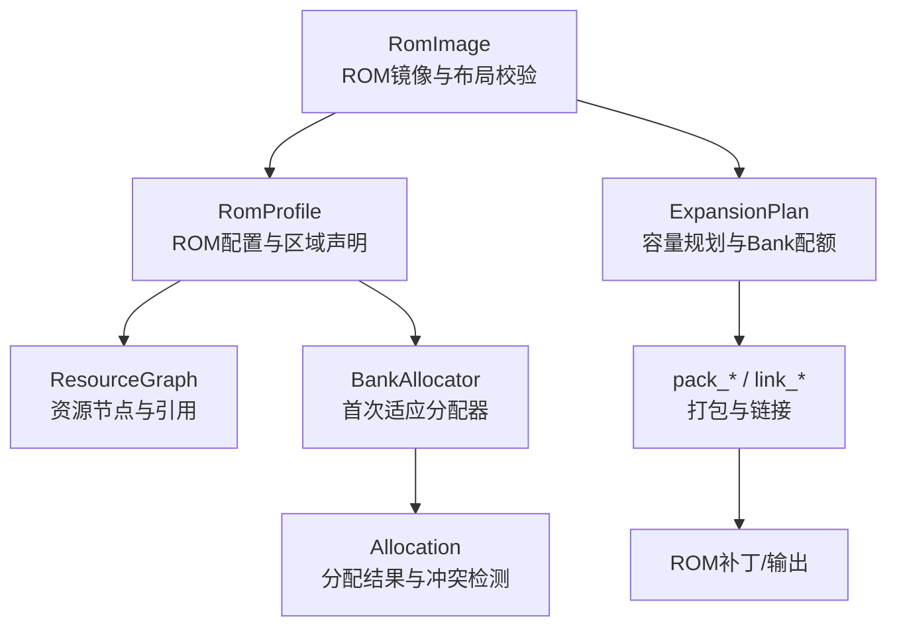
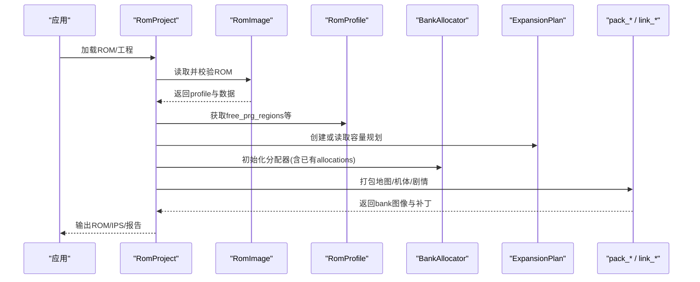
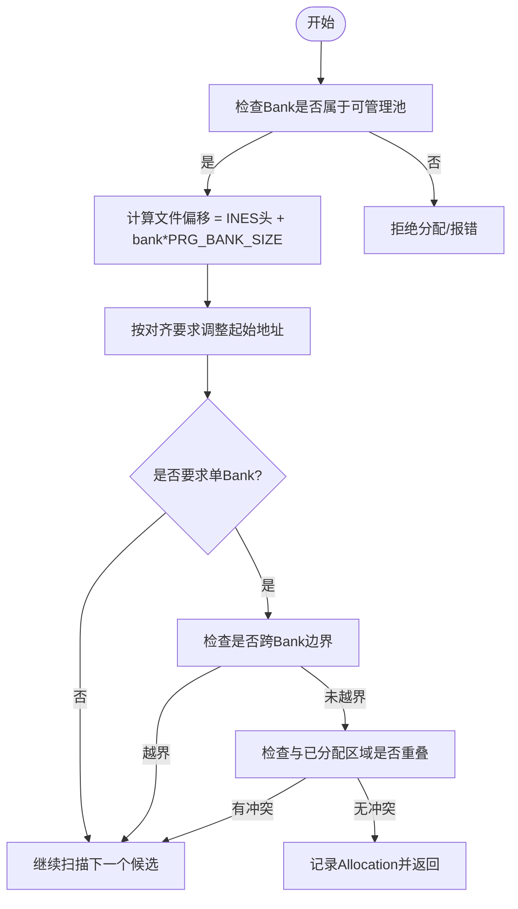
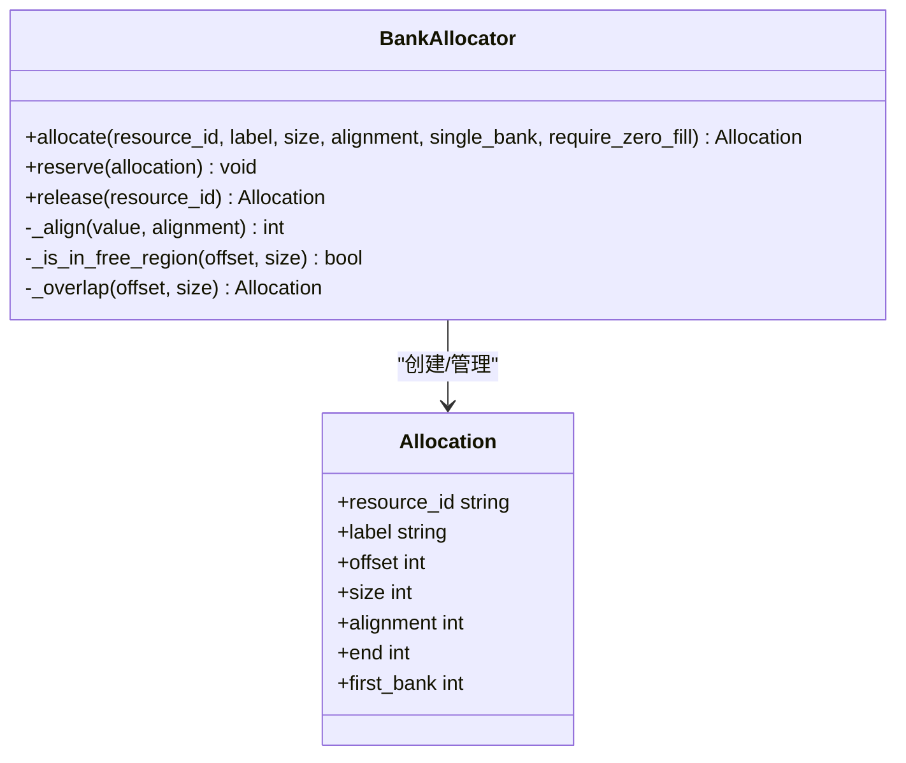
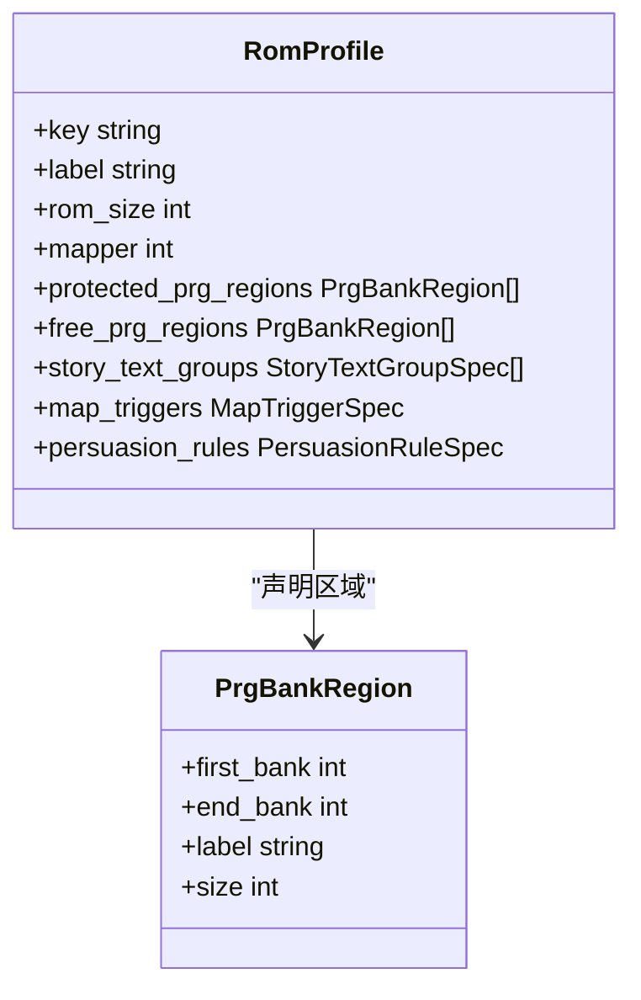
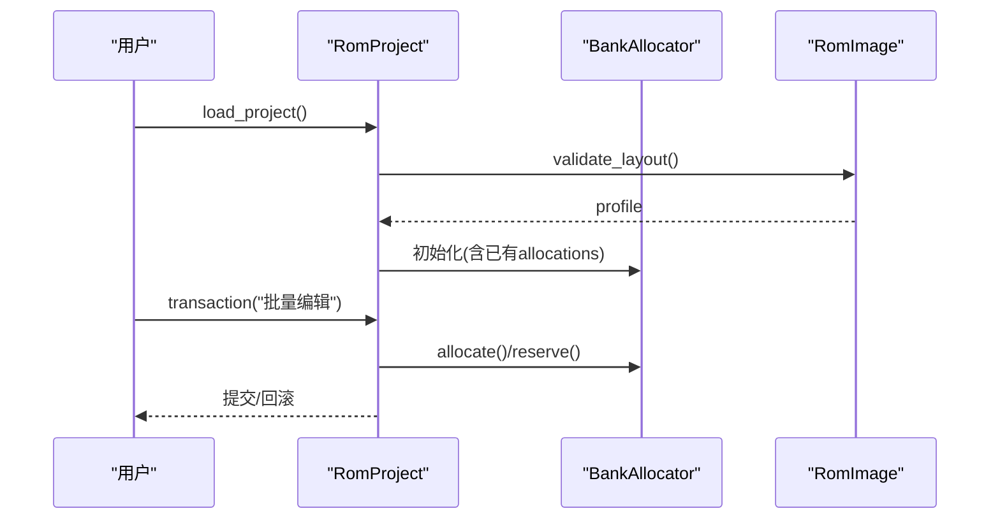
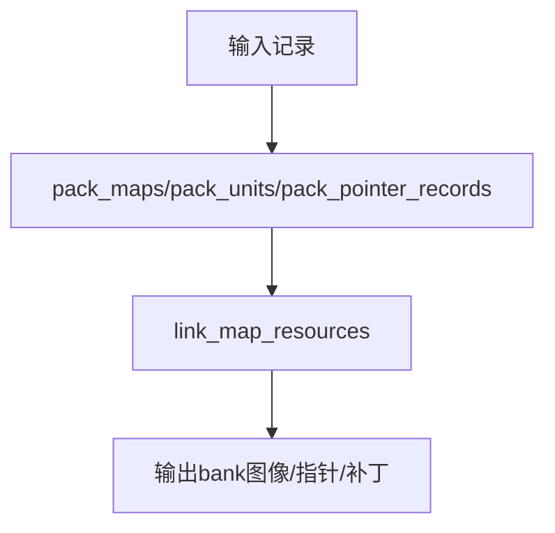
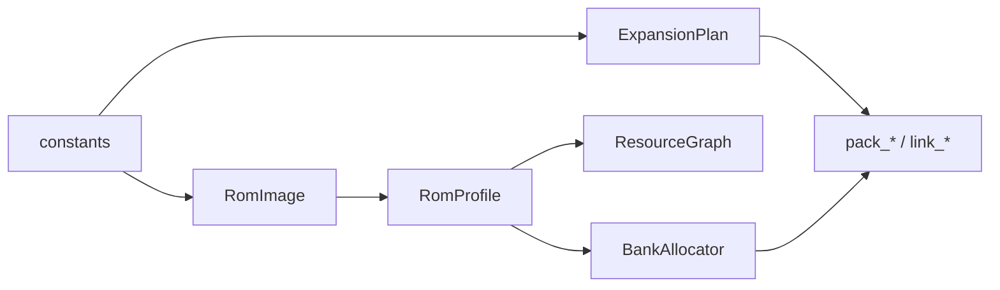

# 资源分配器

<cite>
**本文引用的文件**
- [src/fc_rom_editor_core.py](file://src/fc_rom_editor_core.py)
- [src/fc_editor/resources.py](file://src/fc_editor/resources.py)
- [src/fc_editor/expansion.py](file://src/fc_editor/expansion.py)
- [src/fc_editor/profiles.py](file://src/fc_editor/profiles.py)
- [src/fc_editor/rom_image.py](file://src/fc_editor/rom_image.py)
- [src/fc_editor/constants.py](file://src/fc_editor/constants.py)
- [tests/test_expansion_linker.py](file://tests/test_expansion_linker.py)
- [tests/test_expansion_map.py](file://tests/test_expansion_map.py)
</cite>

## 目录
1. [简介](#简介)
2. [项目结构](#项目结构)
3. [核心组件](#核心组件)
4. [架构总览](#架构总览)
5. [详细组件分析](#详细组件分析)
6. [依赖关系分析](#依赖关系分析)
7. [性能考虑](#性能考虑)
8. [故障排查指南](#故障排查指南)
9. [结论](#结论)
10. [附录](#附录)

## 简介
本技术文档围绕“资源分配器”展开，聚焦于 MMC3（Mapper 194）扩容 ROM 的资源管理策略与实现。内容涵盖：
- Bank 管理策略与 MMC3 映射器工作原理、Bank 切换机制、内存地址计算
- 内存分配算法（首次适应等）的实现与选择标准
- 冲突检测机制（地址重叠、依赖关系、循环依赖处理）
- 资源配置文件格式、Profile 管理机制、动态加载支持
- 具体使用示例（资源分配、内存碎片处理、ROM 布局优化）
- 性能调优建议与内存使用监控方法

## 项目结构
本项目将资源分配与 MMC3 扩展能力解耦为多个模块：
- 常量与基础类型：定义 iNES 头大小、PRG Bank 大小、CPU 窗口基址等
- Profile 系统：描述 ROM 布局、受保护区域、可自由分配区域、故事文本组、地图触发器等
- ROM 镜像与地址转换：提供 Bank 到文件偏移的转换、校验与只读访问
- 资源图与分配器：构建资源节点与引用关系，并在可用 PRG 区域进行确定性分配
- 扩展规划与打包：对地图、机体、剧情等资源进行打包与链接，生成 ROM 补丁
- 顶层工程编排：协调各模块完成加载、编辑、回滚、导出等操作

**图表来源**
- [src/fc_editor/rom_image.py:50-105](file://src/fc_editor/rom_image.py#L50-L105)
- [src/fc_editor/profiles.py:276-328](file://src/fc_editor/profiles.py#L276-L328)
- [src/fc_editor/resources.py:47-260](file://src/fc_editor/resources.py#L47-L260)
- [src/fc_editor/resources.py:280-413](file://src/fc_editor/resources.py#L280-L413)
- [src/fc_editor/expansion.py:84-319](file://src/fc_editor/expansion.py#L84-L319)

**章节来源**
- [src/fc_editor/constants.py:1-69](file://src/fc_editor/constants.py#L1-L69)
- [src/fc_editor/rom_image.py:50-105](file://src/fc_editor/rom_image.py#L50-L105)
- [src/fc_editor/profiles.py:276-328](file://src/fc_editor/profiles.py#L276-L328)
- [src/fc_editor/resources.py:47-260](file://src/fc_editor/resources.py#L47-L260)
- [src/fc_editor/expansion.py:84-319](file://src/fc_editor/expansion.py#L84-L319)

## 核心组件
- RomImage：封装 ROM 数据，校验 iNES 头、Mapper、容量，并提供 BankAddress 到文件偏移的转换
- RomProfile：声明 ROM 布局、受保护区域、自由区域、故事文本组、地图触发器等
- ResourceGraph：从 Profile 构建资源节点与引用，用于编辑器模块间的资源发现与约束
- BankAllocator：在 Profile 声明的自由 PRG 区域内执行确定性首次适应分配，支持对齐、单 Bank 限制、零填充检查
- ExpansionPlan：对 464 KiB 可管理池进行非重叠拆分，限定地图、机体、剧情配额及绑定关系
- pack_* / link_*：将地图、机体、指针记录等打包进指定 Bank，并生成必要的跳转与目录补丁

**章节来源**
- [src/fc_editor/rom_image.py:50-125](file://src/fc_editor/rom_image.py#L50-L125)
- [src/fc_editor/profiles.py:276-328](file://src/fc_editor/profiles.py#L276-L328)
- [src/fc_editor/resources.py:47-260](file://src/fc_editor/resources.py#L47-L260)
- [src/fc_editor/resources.py:280-413](file://src/fc_editor/resources.py#L280-L413)
- [src/fc_editor/expansion.py:84-319](file://src/fc_editor/expansion.py#L84-L319)

## 架构总览
下图展示资源分配器与 MMC3 扩展能力的整体交互：
- 顶层工程对象加载 ROM，解析 Profile，初始化资源图与分配器
- 通过 ExpansionPlan 划分可管理池（地图、机体、剧情），确保不越界且满足对齐与配对要求
- 使用 BankAllocator 在 free_prg_regions 中按首次适应策略分配资源，避免与已分配区域重叠
- 打包阶段将资源写入指定 Bank，更新指针表与调度代码，生成 ROM 补丁

**图表来源**
- [src/fc_rom_editor_core.py:463-618](file://src/fc_rom_editor_core.py#L463-L618)
- [src/fc_editor/rom_image.py:50-105](file://src/fc_editor/rom_image.py#L50-L105)
- [src/fc_editor/expansion.py:84-319](file://src/fc_editor/expansion.py#L84-L319)
- [src/fc_editor/resources.py:280-413](file://src/fc_editor/resources.py#L280-L413)

## 详细组件分析

### MMC3（Mapper 194）映射器与Bank管理策略
- Mapper 194 暴露 8 KiB PRG Bank；其中 $61-$64 为音频专用，$7E-$7F 为固定代码，不得进入编辑器管理的分配池
- 可管理池由 AVAILABLE_EXPANSION_BANKS 定义，排除上述保留区
- 地址计算：
  - Bank 到文件偏移：INES_HEADER_SIZE + bank * PRG_BANK_SIZE
  - CPU 窗口地址到文件偏移：BankAddress.to_file_offset() 基于 window_base 与 bank_size
- 资源描述符表位于固定 Bank $7F 的可变位置，用于运行时选择资源

**图表来源**
- [src/fc_editor/expansion.py:11-31](file://src/fc_editor/expansion.py#L11-L31)
- [src/fc_editor/rom_image.py:22-48](file://src/fc_editor/rom_image.py#L22-L48)
- [src/fc_editor/resources.py:368-413](file://src/fc_editor/resources.py#L368-L413)

**章节来源**
- [src/fc_editor/expansion.py:11-31](file://src/fc_editor/expansion.py#L11-L31)
- [src/fc_editor/rom_image.py:22-48](file://src/fc_editor/rom_image.py#L22-L48)
- [src/fc_editor/resources.py:368-413](file://src/fc_editor/resources.py#L368-L413)

### 内存分配算法：首次适应、最佳适应、最坏适应
- 当前实现采用“首次适应”策略：按 Profile 声明的 free_prg_regions 顺序扫描，找到第一个满足 size、alignment、单 Bank 限制的连续空间即分配
- 选择标准：
  - 对齐要求：起始地址必须满足 alignment
  - 单 Bank 限制：可选 single_bank=True，禁止跨 Bank
  - 零填充检查：可选 require_zero_fill，跳过非零区域以减少破坏
  - 冲突检测：与已有 Allocation 范围重叠则跳过
- 最佳适应/最坏适应：
  - 未在现有代码中实现；如需引入，可在 allocate() 中维护候选列表并按剩余空间排序选择

**图表来源**
- [src/fc_editor/resources.py:263-413](file://src/fc_editor/resources.py#L263-L413)

**章节来源**
- [src/fc_editor/resources.py:280-413](file://src/fc_editor/resources.py#L280-L413)

### 冲突检测机制：地址重叠、依赖关系、循环依赖
- 地址重叠检测：
  - reserve()/allocate() 调用 _overlap() 检查新范围是否与已有 Allocation 重叠
  - 若重叠，抛出包含冲突资源 ID 的错误信息
- 依赖关系分析：
  - ResourceGraph 维护 nodes 与 references，可用于识别资源间引用关系
  - 通过 references_to(target_id) 获取指向某资源的引用集合
- 循环依赖解决：
  - 当前未显式检测循环；建议在构建 ResourceGraph 后运行拓扑排序，发现环时提示用户调整资源布局或拆分引用

**图表来源**
- [src/fc_editor/resources.py:323-354](file://src/fc_editor/resources.py#L323-L354)
- [src/fc_editor/resources.py:47-79](file://src/fc_editor/resources.py#L47-L79)

**章节来源**
- [src/fc_editor/resources.py:47-79](file://src/fc_editor/resources.py#L47-L79)
- [src/fc_editor/resources.py:323-354](file://src/fc_editor/resources.py#L323-L354)

### 资源配置文件格式与Profile管理机制
- Profile 描述 ROM 布局、受保护区域、自由区域、故事文本组、地图触发器、劝降规则等
- 支持多版本 Profile（原版、MMC5、扩容 MMC3 v1/v2），通过 detect_profile() 自动匹配
- 扩容 MMC3 v2 提供 464 KiB 资源池，回收了原音频驱动占用的 Bank，仅保留必要受保护区域
- 动态加载：
  - RomImage.validate_layout() 根据 ROM 大小与签名验证选择对应 Profile
  - 工程加载时可注入已有 allocations，恢复历史分配状态

**图表来源**
- [src/fc_editor/profiles.py:256-328](file://src/fc_editor/profiles.py#L256-L328)
- [src/fc_editor/profiles.py:699-759](file://src/fc_editor/profiles.py#L699-L759)

**章节来源**
- [src/fc_editor/profiles.py:256-328](file://src/fc_editor/profiles.py#L256-L328)
- [src/fc_editor/profiles.py:699-759](file://src/fc_editor/profiles.py#L699-L759)

### 动态加载支持与工程编排
- RomProject 在构造时：
  - 加载 RomImage，解析初始 ExpansionPlan
  - 初始化各类 Codec（机体、武器、地图、剧情等）
  - 初始化 BankAllocator，并根据计划预留分区与重开守卫
- 事务与撤销：
  - transaction() 包裹批量修改，异常时回滚 ROM 与分配器状态
  - undo()/redo() 基于 EditHistoryEntry 恢复 patches 与 allocations

**图表来源**
- [src/fc_rom_editor_core.py:463-618](file://src/fc_rom_editor_core.py#L463-L618)
- [src/fc_rom_editor_core.py:714-785](file://src/fc_rom_editor_core.py#L714-L785)

**章节来源**
- [src/fc_rom_editor_core.py:463-618](file://src/fc_rom_editor_core.py#L463-L618)
- [src/fc_rom_editor_core.py:714-785](file://src/fc_rom_editor_core.py#L714-L785)

### 打包与链接：地图、机体、剧情
- 地图打包：
  - pack_maps() 将地图记录顺序写入指定 Bank，生成指针表与目录
  - 超出容量时报错，需扩大配额或拆分资源
- 机体打包：
  - pack_units() 在单 Bank 内构建指针表与数据段，保证每条记录长度一致
- 指针记录打包：
  - pack_pointer_records() 构建标准目录与指针表，支持去重以节省空间
- 链接与补丁：
  - link_map_resources() 将地图、场景、触发器整合，生成跳转与调度代码补丁

**图表来源**
- [src/fc_editor/expansion.py:329-432](file://src/fc_editor/expansion.py#L329-L432)

**章节来源**
- [src/fc_editor/expansion.py:329-432](file://src/fc_editor/expansion.py#L329-L432)

## 依赖关系分析
- RomImage 依赖 constants 与 profiles，负责 ROM 校验与布局解析
- RomProfile 定义区域与规格，被 ResourceGraph 与 BankAllocator 引用
- ResourceGraph 依赖 RomProfile 构建资源节点与引用
- BankAllocator 依赖 RomProfile 的 free_prg_regions 进行分配
- ExpansionPlan 依赖 constants 与 AVAILABLE_EXPANSION_BANKS 进行配额管理
- 测试用例验证打包与链接的正确性，包括 Hook 点与容量限制

**图表来源**
- [src/fc_editor/constants.py:1-69](file://src/fc_editor/constants.py#L1-L69)
- [src/fc_editor/rom_image.py:50-105](file://src/fc_editor/rom_image.py#L50-L105)
- [src/fc_editor/profiles.py:276-328](file://src/fc_editor/profiles.py#L276-L328)
- [src/fc_editor/expansion.py:84-319](file://src/fc_editor/expansion.py#L84-L319)

**章节来源**
- [src/fc_editor/constants.py:1-69](file://src/fc_editor/constants.py#L1-L69)
- [src/fc_editor/rom_image.py:50-105](file://src/fc_editor/rom_image.py#L50-L105)
- [src/fc_editor/profiles.py:276-328](file://src/fc_editor/profiles.py#L276-L328)
- [src/fc_editor/expansion.py:84-319](file://src/fc_editor/expansion.py#L84-L319)

## 性能考虑
- 分配器复杂度：
  - 首次适应：每次分配需遍历已分配列表检测重叠，时间复杂度 O(n)，n 为 Allocation 数量
  - 可通过维护空闲链表或区间树优化查找速度
- 对齐与单 Bank 限制：
  - 频繁对齐与边界检查会增加开销；建议批量预对齐减少重复计算
- 零填充检查：
  - require_zero_fill=True 会扫描字节，适合初次分配；后续可关闭以提升性能
- 打包阶段：
  - pack_* 函数在写入前进行容量校验，避免无效操作；合理拆分资源可减少失败重试

[本节为通用指导，无需特定文件来源]

## 故障排查指南
- 常见错误与定位：
  - “分配范围不在可用 PRG 区域内”：检查 Profile 的 free_prg_regions 是否正确声明
  - “分配与资源 X 重叠”：查看已有 Allocation 列表，调整资源布局或释放冲突资源
  - “没有足够的单 Bank 空闲 PRG 空间”：增大配额或允许跨 Bank
  - “扩展容量表校验失败”：检查 ExpansionPlan 序列化/反序列化的 CRC 校验
- 调试建议：
  - 使用 RomImage.read_bank() 读取目标 Bank 内容，确认指针与数据位置
  - 通过 ResourceGraph.references_to() 分析依赖关系，定位循环或误引用
  - 利用单元测试中的断言模式（如测试用例中对 used_bytes、used_bank_count 的检查）验证打包结果

**章节来源**
- [src/fc_editor/resources.py:334-413](file://src/fc_editor/resources.py#L334-L413)
- [tests/test_expansion_linker.py:72-118](file://tests/test_expansion_linker.py#L72-L118)
- [tests/test_expansion_map.py:101-195](file://tests/test_expansion_map.py#L101-L195)

## 结论
本资源分配器基于 MMC3（Mapper 194）扩容 ROM 的特性，提供了：
- 明确的 Bank 管理与地址计算模型
- 确定性的首次适应分配算法，支持对齐、单 Bank 限制与零填充检查
- 完善的冲突检测与依赖关系分析能力
- 灵活的 Profile 系统与动态加载支持
- 完整的打包与链接流程，确保 ROM 布局正确性与可移植性

通过合理配置 Profile、优化资源布局与监控内存使用，可在保证稳定性的前提下最大化利用可用空间。

[本节为总结性内容，无需特定文件来源]

## 附录

### 使用示例路径（不含代码内容）
- 资源分配：
  - [src/fc_editor/resources.py:368-413](file://src/fc_editor/resources.py#L368-L413)
- 内存碎片处理：
  - 通过多次 allocate() 与 release() 组合，结合对齐与单 Bank 限制，逐步重组布局
  - 参考测试用例中的容量断言：[tests/test_expansion_linker.py:72-118](file://tests/test_expansion_linker.py#L72-L118)
- ROM 布局优化：
  - 使用 ExpansionPlan 划分地图、机体、剧情配额，确保不越界且满足配对要求
  - 参考打包函数：[src/fc_editor/expansion.py:329-432](file://src/fc_editor/expansion.py#L329-L432)

### 性能调优建议
- 减少 allocate() 调用次数，批量准备资源后再统一分配
- 关闭 require_zero_fill 在非关键路径上的分配，提升速度
- 使用 ResourceGraph 提前分析依赖，避免运行时动态重排

### 内存使用监控方法
- 监控 BankAllocator.used 与 capacity，评估剩余空间
- 通过 ExpansionPlan.unassigned_kib 观察未分配配额
- 利用测试用例中的 used_bytes、used_bank_count 断言验证实际占用

[本节为补充说明，无需特定文件来源]