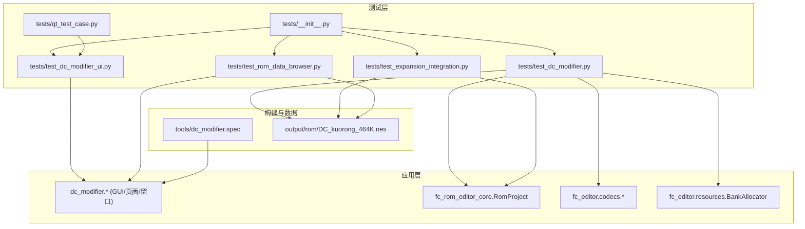
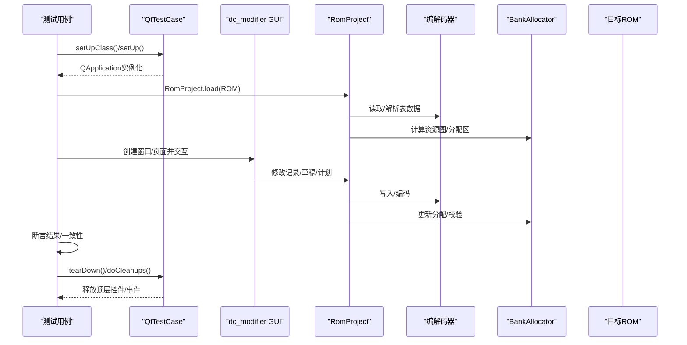
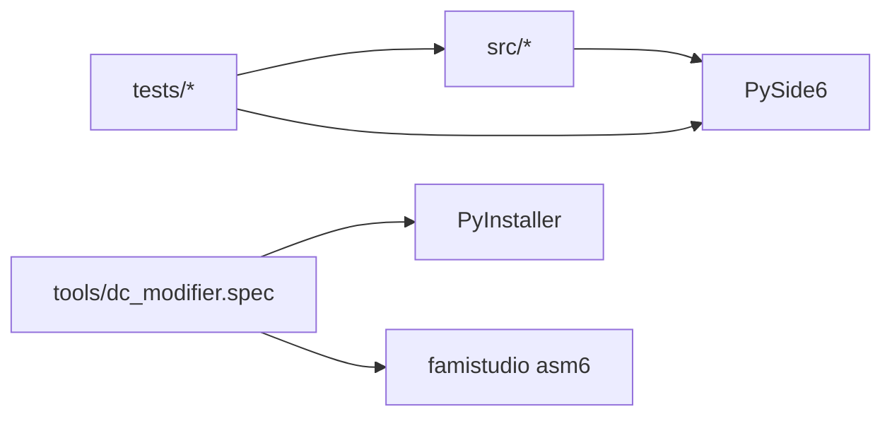

# 测试策略

<cite>
**本文引用的文件**
- [pyproject.toml](file://pyproject.toml)
- [requirements-dev.txt](file://requirements-dev.txt)
- [tests/__init__.py](file://tests/__init__.py)
- [tests/qt_test_case.py](file://tests/qt_test_case.py)
- [tests/test_dc_modifier.py](file://tests/test_dc_modifier.py)
- [tests/test_dc_modifier_ui.py](file://tests/test_dc_modifier_ui.py)
- [tests/test_expansion_integration.py](file://tests/test_expansion_integration.py)
- [tests/test_rom_data_browser.py](file://tests/test_rom_data_browser.py)
- [tools/dc_modifier.spec](file://tools/dc_modifier.spec)
</cite>

## 目录
1. [简介](#简介)
2. [项目结构](#项目结构)
3. [核心组件](#核心组件)
4. [架构总览](#架构总览)
5. [详细组件分析](#详细组件分析)
6. [依赖关系分析](#依赖关系分析)
7. [性能考量](#性能考量)
8. [故障排除指南](#故障排除指南)
9. [结论](#结论)
10. [附录](#附录)

## 简介
本测试策略面向DC修改器（FC超级机器人大战2扩容MMC3版）的桌面端ROM编辑器，覆盖单元测试、集成测试、GUI自动化测试、测试数据与环境管理、覆盖率与持续集成、调试与故障排除。目标是为开发者提供可执行的测试方案与最佳实践，确保ROM编解码、资源分配、工程打包、UI交互等关键路径稳定可靠。

## 项目结构
仓库采用src/tests/tools分层组织：
- src：应用源码（PySide6 GUI、ROM编辑核心、编解码器、资源分配器等）
- tests：基于unittest的测试套件，包含Qt基类、ROM/工程逻辑测试、UI冒烟与交互测试、扩展容量集成测试、ROM数据浏览器测试
- tools：打包配置（PyInstaller spec）、构建脚本、审计工具
- references/output：参考ROM与输出产物（测试数据）

图表来源
- [tests/__init__.py:1-12](file://tests/__init__.py#L1-L12)
- [tests/qt_test_case.py:1-29](file://tests/qt_test_case.py#L1-L29)
- [tests/test_dc_modifier.py:1-800](file://tests/test_dc_modifier.py#L1-L800)
- [tests/test_dc_modifier_ui.py:1-800](file://tests/test_dc_modifier_ui.py#L1-L800)
- [tests/test_expansion_integration.py:1-449](file://tests/test_expansion_integration.py#L1-L449)
- [tests/test_rom_data_browser.py:1-96](file://tests/test_rom_data_browser.py#L1-L96)
- [tools/dc_modifier.spec:1-63](file://tools/dc_modifier.spec#L1-L63)

章节来源
- [pyproject.toml:1-31](file://pyproject.toml#L1-L31)
- [requirements-dev.txt:1-5](file://requirements-dev.txt#L1-L5)
- [tests/__init__.py:1-12](file://tests/__init__.py#L1-L12)

## 核心组件
- 测试启动与路径注入：tests/__init__.py将src加入sys.path，使测试可直接导入应用模块。
- Qt测试基类：tests/qt_test_case.py提供QtTestCase，确保QApplication生命周期与顶层控件释放确定性，避免测试间状态污染。
- ROM与工程测试：tests/test_dc_modifier.py覆盖编解码器往返、文本表、资源图、BankAllocator、工程保存/重开、IPS构建、单位包导入/撤销等。
- GUI自动化测试：tests/test_dc_modifier_ui.py在offscreen模式下进行界面冒烟、菜单/快捷键校验、页面导航、资源页计划与导入、地图草稿与撤销/重做保护、验证对话框等。
- 扩展容量集成测试：tests/test_expansion_integration.py验证推荐配额拆分、链接后语义保持、运行时代码镜像校验、直接输出保护、构建报告等。
- ROM数据浏览器测试：tests/test_rom_data_browser.py验证各表索引、原始字节展示、数据库与属性计算器打开行为。

章节来源
- [tests/__init__.py:1-12](file://tests/__init__.py#L1-L12)
- [tests/qt_test_case.py:1-29](file://tests/qt_test_case.py#L1-L29)
- [tests/test_dc_modifier.py:1-800](file://tests/test_dc_modifier.py#L1-L800)
- [tests/test_dc_modifier_ui.py:1-800](file://tests/test_dc_modifier_ui.py#L1-L800)
- [tests/test_expansion_integration.py:1-449](file://tests/test_expansion_integration.py#L1-L449)
- [tests/test_rom_data_browser.py:1-96](file://tests/test_rom_data_browser.py#L1-L96)

## 架构总览
测试驱动的核心流程如下：
- 测试入口通过unittest加载用例；Qt测试通过QtTestCase初始化/清理QApplication与顶层控件。
- 用例加载目标ROM（output/rom/DC_kuorong_464K.nes），构造RomProject，调用编解码器、资源分配器、页面/窗口对象执行操作。
- 断言覆盖：ROM标识、编解码往返、资源分配区间、工程保存/重开一致性、GUI菜单/快捷键/页面导航、扩展容量配额与校验、构建产物一致性。

图表来源
- [tests/qt_test_case.py:1-29](file://tests/qt_test_case.py#L1-L29)
- [tests/test_dc_modifier.py:1-800](file://tests/test_dc_modifier.py#L1-L800)
- [tests/test_dc_modifier_ui.py:1-800](file://tests/test_dc_modifier_ui.py#L1-L800)
- [tests/test_expansion_integration.py:1-449](file://tests/test_expansion_integration.py#L1-L449)

## 详细组件分析

### 单元测试框架与最佳实践
- 测试框架：Python unittest；所有用例继承unittest.TestCase或QtTestCase。
- 环境准备：
  - tests/__init__.py自动将src加入sys.path，保证import稳定。
  - Qt测试统一设置QT_QPA_PLATFORM=offscreen，避免图形界面阻塞。
- 模拟对象：
  - 使用unittest.mock.patch对系统调用/对话框进行模拟（如QFileDialog.getOpenFileName、QMessageBox.warning）。
- 断言最佳实践：
  - 使用assertEqual/assertIs/assertGreater/assertRegex等精确断言。
  - 对ROM哈希、编解码往返、工程保存/重开一致性进行强断言。
  - 对错误路径使用assertRaises/assertRaisesRegex捕获异常信息。
- 资源隔离：
  - 使用tempfile.TemporaryDirectory生成临时工程/输出，避免污染工作目录。
  - 对只读参考目录进行保护性断言，防止误写。

章节来源
- [tests/__init__.py:1-12](file://tests/__init__.py#L1-L12)
- [tests/qt_test_case.py:1-29](file://tests/qt_test_case.py#L1-L29)
- [tests/test_dc_modifier_ui.py:1-800](file://tests/test_dc_modifier_ui.py#L1-L800)
- [tests/test_dc_modifier.py:1-800](file://tests/test_dc_modifier.py#L1-L800)

### 集成测试：端到端、模拟器集成、性能测试
- 端到端测试：
  - 以目标ROM为基准，完成“配置扩展配额→链接→编辑→保存工程→重开工程→构建发布”的完整链路，断言working一致性与无错误。
  - 验证构建产物（ROM/IPS/报告）与工程状态一致。
- 模拟器集成测试：
  - 当前仓库未包含FCEUX等模拟器集成测试；可通过后续扩展引入命令行回放与状态快照对比。
- 性能测试方法：
  - 针对大表编解码、地图RLE编码、批量资源导入等场景，建议增加耗时统计与阈值断言（例如单次编解码时间上限）。
  - 利用unittest的子测试（subTest）对不同配额组合进行回归。

章节来源
- [tests/test_expansion_integration.py:1-449](file://tests/test_expansion_integration.py#L1-L449)
- [tests/test_dc_modifier.py:1-800](file://tests/test_dc_modifier.py#L1-L800)

### GUI自动化测试：UI定位、交互模拟、截图对比
- UI元素定位：
  - 通过findChild/QLabel.objectName等定位标题、按钮、表格项等。
  - 使用page_index映射键到具体页面实例，验证页面类型与布局。
- 用户交互模拟：
  - 通过setValue/click/setCurrentRow等方法模拟输入与选择。
  - 使用processEvents推进事件循环，确保异步刷新生效。
- 截图对比测试：
  - 当前测试未实现像素级截图对比；可在后续引入QImage渲染与图像差异度量（如SSIM）进行视觉回归。
- 安全与健壮性：
  - 对无效草稿/越界输入，断言撤销/重做被阻止，并保持working不变。
  - 对只读参考目录导出进行拦截断言。

章节来源
- [tests/test_dc_modifier_ui.py:1-800](file://tests/test_dc_modifier_ui.py#L1-L800)
- [tests/test_rom_data_browser.py:1-96](file://tests/test_rom_data_browser.py#L1-L96)

### 测试数据准备与管理
- 目标ROM：
  - output/rom/DC_kuorong_464K.nes作为基准ROM，用于SHA256校验与功能测试。
- 参考ROM：
  - references/rom/baselines/DC_kuorong.nes用于兼容旧版ROM路径与行为验证。
- 工程与产物：
  - 使用临时目录存放.dcmod工程、.ips补丁、构建报告，避免污染仓库。
- 构建产物：
  - tools/dc_modifier.spec定义PyInstaller打包配置，确保运行环境与依赖正确。

章节来源
- [tests/test_dc_modifier.py:1-800](file://tests/test_dc_modifier.py#L1-L800)
- [tests/test_expansion_integration.py:1-449](file://tests/test_expansion_integration.py#L1-L449)
- [tests/test_rom_data_browser.py:1-96](file://tests/test_rom_data_browser.py#L1-L96)
- [tools/dc_modifier.spec:1-63](file://tools/dc_modifier.spec#L1-L63)

## 依赖关系分析
- 测试与应用的耦合点：
  - 通过tests/__init__.py注入src路径，测试直接依赖dc_modifier与fc_rom_editor_core。
  - Qt测试依赖PySide6，并在offscreen模式运行。
- 外部依赖：
  - PySide6用于GUI；可选依赖py65/reportlab用于开发工具链。
- 打包依赖：
  - PyInstaller spec中显式包含asm6_fixed.exe，确保音乐汇编可用。

图表来源
- [tests/__init__.py:1-12](file://tests/__init__.py#L1-L12)
- [pyproject.toml:1-31](file://pyproject.toml#L1-L31)
- [requirements-dev.txt:1-5](file://requirements-dev.txt#L1-L5)
- [tools/dc_modifier.spec:1-63](file://tools/dc_modifier.spec#L1-L63)

章节来源
- [pyproject.toml:1-31](file://pyproject.toml#L1-L31)
- [requirements-dev.txt:1-5](file://requirements-dev.txt#L1-L5)
- [tools/dc_modifier.spec:1-63](file://tools/dc_modifier.spec#L1-L63)

## 性能考量
- 编解码与大表处理：
  - 地图RLE编码、故事文本分组、单位/武器名称解析等应控制单次处理时间，建议在集成测试中加入耗时断言。
- 资源分配与规划：
  - BankAllocator在不同配额组合下的分配稳定性需重点验证，避免碎片化导致后续导入失败。
- GUI交互：
  - offscreen模式下减少不必要的processEvents调用，避免测试抖动。
- 构建与打包：
  - PyInstaller构建时排除冲突ICU二进制，避免运行时符号查找失败。

[本节为通用指导，不直接分析具体文件]

## 故障排除指南
- Qt相关：
  - 若测试卡住或崩溃，检查是否遗漏QApplication实例化或顶层控件释放；确保doCleanups执行。
  - 使用QT_QPA_PLATFORM=offscreen避免X服务器依赖问题。
- ROM与工程：
  - 若保存/重开后不一致，检查工程是否处于dirty状态、是否存在未提交草稿。
  - 对只读参考目录导出失败，确认路径未被误判为references。
- 扩展容量：
  - 配额不足或空间重叠会抛出ValueError；根据错误消息调整map/unit/story配额。
  - 运行时代码镜像损坏或主体拼图指针异常会在validate阶段报错，修复后再构建。
- 构建与打包：
  - 若GUI启动报找不到过程，检查spec中是否排除了错误的icu库版本。

章节来源
- [tests/qt_test_case.py:1-29](file://tests/qt_test_case.py#L1-L29)
- [tests/test_dc_modifier_ui.py:1-800](file://tests/test_dc_modifier_ui.py#L1-L800)
- [tests/test_expansion_integration.py:1-449](file://tests/test_expansion_integration.py#L1-L449)
- [tools/dc_modifier.spec:1-63](file://tools/dc_modifier.spec#L1-L63)

## 结论
本测试策略围绕ROM编辑器的核心能力建立分层测试体系：单元层保障编解码与资源分配的正确性；集成层验证配额规划、链接与构建产物的端到端一致性；GUI层覆盖主要交互路径与边界条件。结合严格的断言与错误路径覆盖，可有效提升DC修改器的稳定性与可维护性。后续可扩展模拟器集成测试与截图对比测试，进一步完善质量保障体系。

## 附录
- 运行方式：
  - 使用python -m unittest discover -s tests -p test_*.py执行全部用例。
  - 指定单文件：python -m unittest tests.test_dc_modifier。
- 环境变量：
  - QT_QPA_PLATFORM=offscreen（已在部分测试中设置）。
- 关键路径：
  - 目标ROM：output/rom/DC_kuorong_464K.nes
  - 参考ROM：references/rom/baselines/DC_kuorong.nes
  - 打包配置：tools/dc_modifier.spec

[本节为补充说明，不直接分析具体文件]