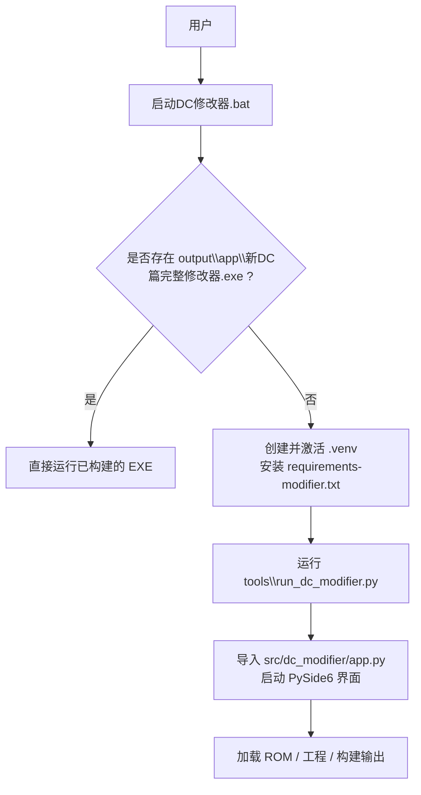
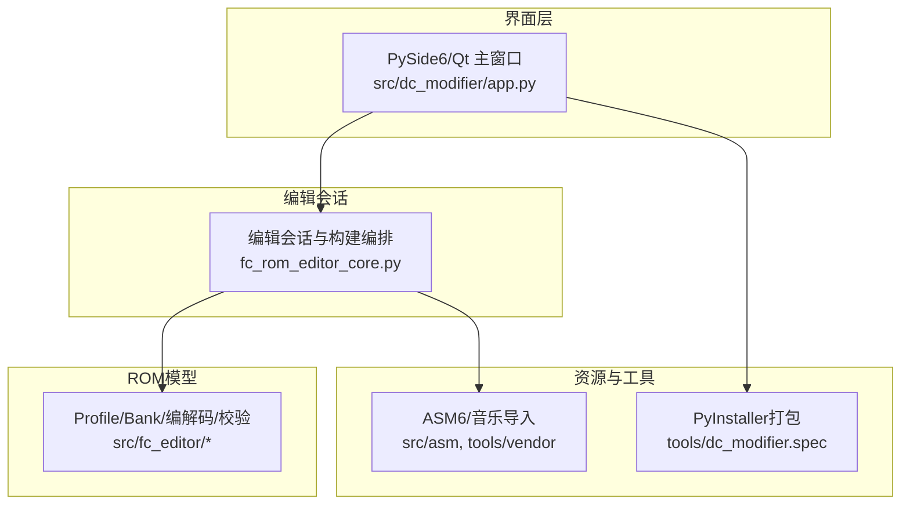
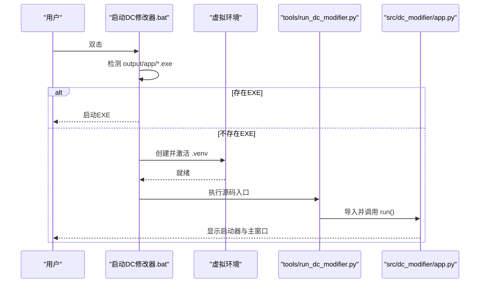
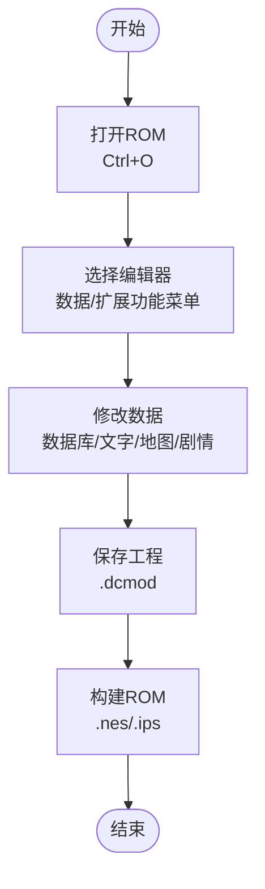
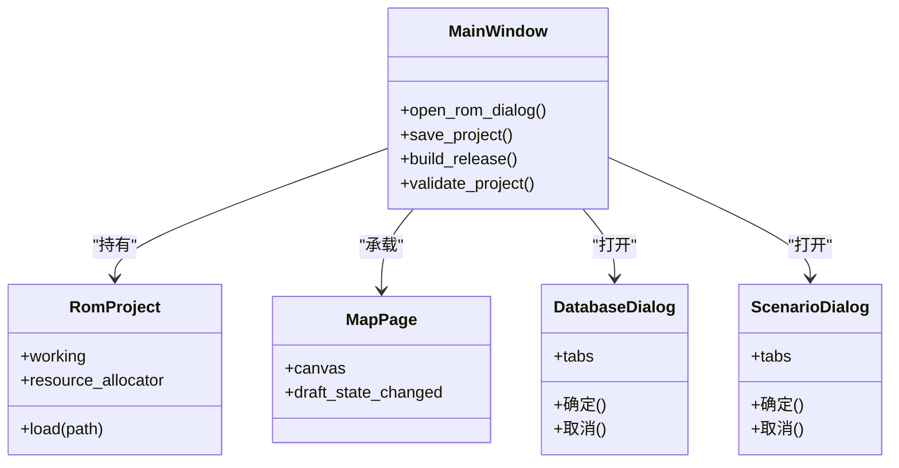

# 快速开始

<cite>
**本文引用的文件**
- [启动DC修改器.bat](file://启动DC修改器.bat)
- [requirements-modifier.txt](file://requirements-modifier.txt)
- [pyproject.toml](file://pyproject.toml)
- [tools/run_dc_modifier.py](file://tools/run_dc_modifier.py)
- [tools/dc_modifier.spec](file://tools/dc_modifier.spec)
- [README.md](file://README.md)
- [docs/DC修改器使用说明.md](file://docs/DC修改器使用说明.md)
- [src/dc_modifier/app.py](file://src/dc_modifier/app.py)
- [src/dc_modifier/workspace.py](file://src/dc_modifier/workspace.py)
</cite>

## 目录
1. [简介](#简介)
2. [项目结构](#项目结构)
3. [核心组件](#核心组件)
4. [架构总览](#架构总览)
5. [详细组件分析](#详细组件分析)
6. [依赖分析](#依赖分析)
7. [性能考虑](#性能考虑)
8. [故障排除指南](#故障排除指南)
9. [结论](#结论)
10. [附录：30分钟上手清单](#附录30分钟上手清单)

## 简介
本快速开始指南面向首次接触“新DC篇完整修改器”的用户，目标是在30分钟内完成环境准备、安装依赖、克隆仓库、运行修改器，并完成一次完整的ROM编辑流程（打开ROM、选择编辑器、修改数据、保存工程、构建ROM）。文档同时提供两种运行方式：直接双击批处理文件，或通过命令行启动。文末附带常见问题与排错建议。

## 项目结构
仓库采用“源码、工具、测试、输出、文档、参考输入”的清晰分层：
- src：产品源码与运行资源（GUI、ROM模型、编辑会话）
- tools：启动、构建、打包、研究脚本与第三方工具
- tests：单元、集成、GUI与模拟器验证
- output：所有可再生成或交付产物（EXE、ROM、报告等）
- docs：使用说明、设计与实现方案、交接文档等
- references：只读原始输入与历史参考素材

图表来源
- [启动DC修改器.bat:1-16](file://启动DC修改器.bat#L1-L16)
- [tools/run_dc_modifier.py:1-30](file://tools/run_dc_modifier.py#L1-L30)
- [src/dc_modifier/app.py:1-120](file://src/dc_modifier/app.py#L1-L120)

章节来源
- [README.md:59-112](file://README.md#L59-L112)
- [启动DC修改器.bat:1-16](file://启动DC修改器.bat#L1-L16)

## 核心组件
- 启动入口与引导
  - 批处理文件负责检测已构建的EXE，若不存在则提示创建虚拟环境并调用源码入口。
  - 源码入口将项目根目录加入Python路径后，调用应用模块的启动函数。
- 桌面应用主窗口
  - 基于PySide6/Qt 6构建，包含地图、数据库、剧情、容量规划、工程管理等页面。
  - 支持打开ROM、保存工程、导出IPS、一键构建、撤销/重做与完整检查。
- 工作区与默认路径
  - 自动定位工作区根目录与推荐ROM路径，限制向references写入，确保只读安全。

章节来源
- [启动DC修改器.bat:1-16](file://启动DC修改器.bat#L1-L16)
- [tools/run_dc_modifier.py:1-30](file://tools/run_dc_modifier.py#L1-L30)
- [src/dc_modifier/app.py:236-340](file://src/dc_modifier/app.py#L236-L340)
- [src/dc_modifier/workspace.py:7-43](file://src/dc_modifier/workspace.py#L7-L43)

## 架构总览
修改器为离线桌面应用，不依赖数据库或Web后端。整体由“界面层 + 编辑会话 + ROM模型 + 汇编与资源 + 发布工具”组成。

图表来源
- [README.md:43-57](file://README.md#L43-L57)
- [tools/dc_modifier.spec:1-63](file://tools/dc_modifier.spec#L1-L63)

## 详细组件分析

### 启动流程与运行方式
- 方式一：双击批处理文件
  - 若存在已构建的EXE，直接启动；否则提示创建虚拟环境并安装依赖后通过源码入口运行。
- 方式二：命令行启动
  - 使用Python解释器直接执行源码入口，适合开发调试。

图表来源
- [启动DC修改器.bat:1-16](file://启动DC修改器.bat#L1-L16)
- [tools/run_dc_modifier.py:1-30](file://tools/run_dc_modifier.py#L1-L30)
- [src/dc_modifier/app.py:236-340](file://src/dc_modifier/app.py#L236-L340)

章节来源
- [启动DC修改器.bat:1-16](file://启动DC修改器.bat#L1-L16)
- [tools/run_dc_modifier.py:1-30](file://tools/run_dc_modifier.py#L1-L30)
- [README.md:114-139](file://README.md#L114-L139)

### 首次运行配置选项
- 推荐基线ROM
  - 推荐使用 output/rom/DC_kuorong_464K.nes，具备464 KiB托管扩展空间。
- 安全原则
  - 修改器仅在内存中编辑，要求保存为派生ROM或工程文件；不会覆盖原ROM。
- 默认工作区与输出
  - 自动定位工作区根目录，默认导出到 output/exports；禁止写入 references。

章节来源
- [docs/DC修改器使用说明.md:17-41](file://docs/DC修改器使用说明.md#L17-L41)
- [src/dc_modifier/workspace.py:7-43](file://src/dc_modifier/workspace.py#L7-L43)

### 基本ROM编辑流程演示
- 打开ROM
  - 按 Ctrl+O 或菜单“文件 → 打开”，选择推荐ROM。
- 选择编辑器
  - 在“数据”菜单中选择数据库、文字库、地图动画、剧情事件等独立窗口。
- 修改数据
  - 在对应窗口中进行字段编辑、文本替换、地图绘制与部署调整。
- 保存工程
  - 使用“工程 → 保存工程”生成 .dcmod 可重放工程。
- 构建ROM
  - 使用“工程 → 一键构建…”输出新的 .nes/.ips 与构建报告。

图表来源
- [docs/DC修改器使用说明.md:17-41](file://docs/DC修改器使用说明.md#L17-L41)
- [docs/DC修改器使用说明.md:71-194](file://docs/DC修改器使用说明.md#L71-L194)

章节来源
- [docs/DC修改器使用说明.md:17-41](file://docs/DC修改器使用说明.md#L17-L41)
- [docs/DC修改器使用说明.md:71-194](file://docs/DC修改器使用说明.md#L71-L194)

### 面向对象组件关系（GUI与核心）

图表来源
- [src/dc_modifier/app.py:276-365](file://src/dc_modifier/app.py#L276-L365)
- [src/dc_modifier/app.py:511-581](file://src/dc_modifier/app.py#L511-L581)

章节来源
- [src/dc_modifier/app.py:276-365](file://src/dc_modifier/app.py#L276-L365)
- [src/dc_modifier/app.py:511-581](file://src/dc_modifier/app.py#L511-L581)

## 依赖分析
- Python版本
  - 要求 Python >= 3.10。
- 运行时依赖
  - PySide6（>=6.8,<7）用于GUI。
- 构建与发布依赖
  - pyinstaller（>=6.10,<7）用于打包单文件EXE。
- 可选开发依赖
  - 其他工具链与报告生成依赖可通过 requirements-dev.txt 安装。

图表来源
- [pyproject.toml:5-20](file://pyproject.toml#L5-L20)
- [requirements-modifier.txt:1-3](file://requirements-modifier.txt#L1-L3)
- [tools/dc_modifier.spec:45-62](file://tools/dc_modifier.spec#L45-L62)

章节来源
- [pyproject.toml:5-20](file://pyproject.toml#L5-L20)
- [requirements-modifier.txt:1-3](file://requirements-modifier.txt#L1-L3)
- [tools/dc_modifier.spec:45-62](file://tools/dc_modifier.spec#L45-L62)

## 性能考虑
- 首次启动与依赖安装
  - 建议使用虚拟环境隔离依赖，避免系统级冲突。
- 大文件与资源
  - 大型地图与多页签刷新时，尽量先保存草稿再切换，减少重复渲染。
- 构建优化
  - 使用UPX压缩与无控制台模式提升分发体验（已在spec中启用）。

[本节为通用指导，无需特定文件引用]

## 故障排除指南
- 未找到Python或虚拟环境
  - 现象：批处理提示尚未创建虚拟环境。
  - 解决：在项目根目录执行 python -m venv .venv，然后安装 requirements-modifier.txt。
- 依赖缺失或版本冲突
  - 现象：启动时报错缺少PySide6或pyinstaller。
  - 解决：确认Python版本>=3.10，重新安装 requirements-modifier.txt。
- 无法写入输出目录
  - 现象：尝试保存到 references/ 被拒绝。
  - 解决：将输出路径改为 output/ 或其子目录；程序会强制阻止写入 references。
- 构建EXE失败或运行时报错
  - 现象：打包失败或运行时报找不到动态库。
  - 解决：检查 tools/dc_modifier.spec 中的二进制与排除项；清理缓存后重试构建。
- 权限问题
  - 现象：无法写入 output 或无法读取 ROM。
  - 解决：以管理员权限运行终端或批处理；确保对 output 目录有读写权限。

章节来源
- [启动DC修改器.bat:8-15](file://启动DC修改器.bat#L8-L15)
- [src/dc_modifier/workspace.py:37-43](file://src/dc_modifier/workspace.py#L37-L43)
- [tools/dc_modifier.spec:35-41](file://tools/dc_modifier.spec#L35-L41)

## 结论
通过本指南，你可以在30分钟内完成环境准备、依赖安装、运行修改器并完成一次完整的ROM编辑流程。建议在后续使用中遵循安全原则：始终保存工程与派生ROM，不要覆盖只读参考ROM；遇到问题优先检查虚拟环境、依赖版本与输出路径权限。

## 附录：30分钟上手清单
- 环境准备
  - 安装 Python 3.10+。
  - 在项目根目录创建虚拟环境：python -m venv .venv。
  - 安装依赖：.\.venv\Scripts\python.exe -m pip install -r requirements-modifier.txt。
- 运行修改器
  - 方式一：双击 启动DC修改器.bat。
  - 方式二：.\.venv\Scripts\python.exe tools\run_dc_modifier.py。
- 首次打开ROM
  - 按 Ctrl+O 打开 output/rom/DC_kuorong_464K.nes。
- 编辑与保存
  - 在“数据”菜单选择编辑器进行修改。
  - 保存工程：工程 → 保存工程（.dcmod）。
- 构建与验证
  - 一键构建：工程 → 一键构建…（输出 .nes/.ips）。
  - 完整检查：按 F7 运行结构校验。

章节来源
- [README.md:114-139](file://README.md#L114-L139)
- [docs/DC修改器使用说明.md:17-41](file://docs/DC修改器使用说明.md#L17-L41)
- [启动DC修改器.bat:1-16](file://启动DC修改器.bat#L1-L16)
- [tools/run_dc_modifier.py:1-30](file://tools/run_dc_modifier.py#L1-L30)