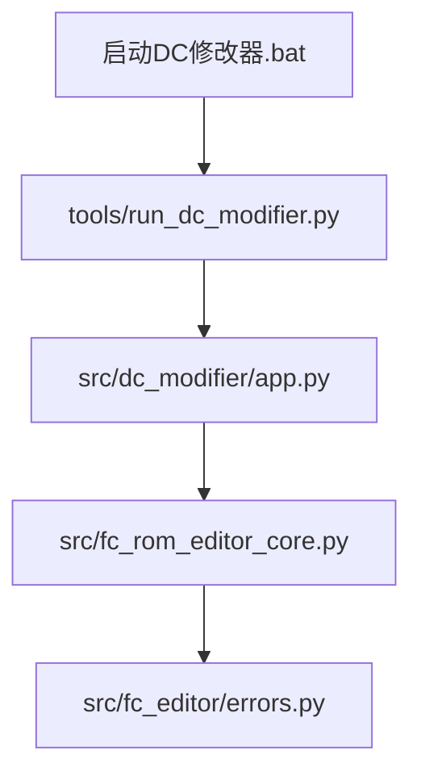
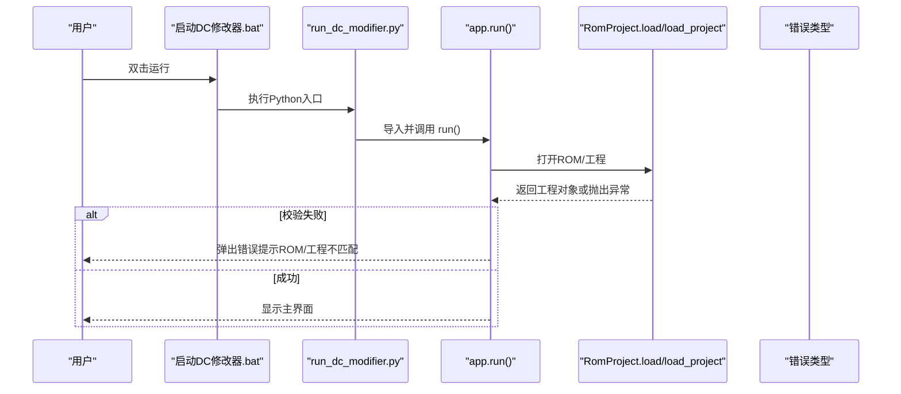
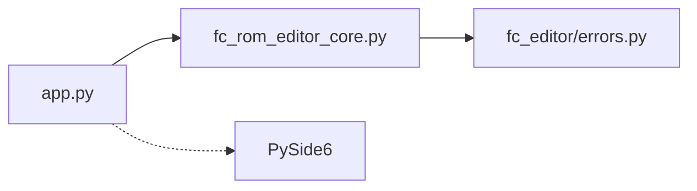
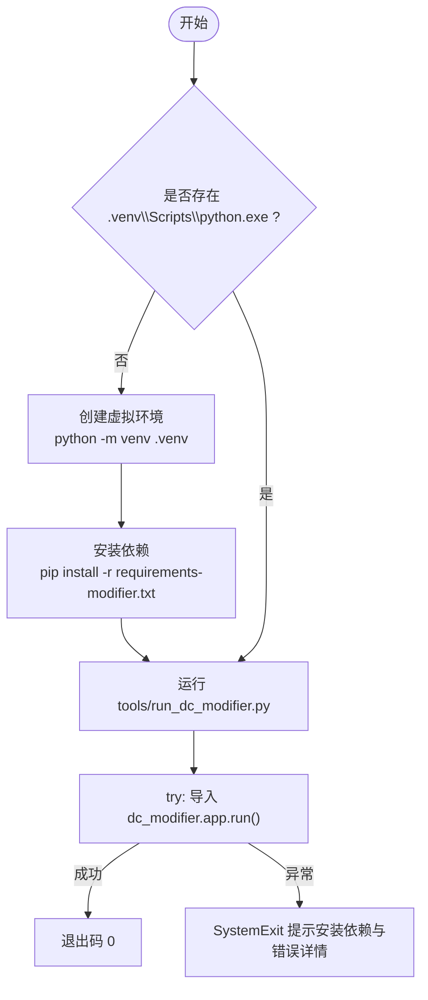

# 故障排除

<cite>
**本文引用的文件**
- [启动DC修改器.bat](file://启动DC修改器.bat)
- [pyproject.toml](file://pyproject.toml)
- [requirements-modifier.txt](file://requirements-modifier.txt)
- [tools/run_dc_modifier.py](file://tools/run_dc_modifier.py)
- [src/dc_modifier/app.py](file://src/dc_modifier/app.py)
- [src/fc_rom_editor_core.py](file://src/fc_rom_editor_core.py)
- [src/fc_editor/errors.py](file://src/fc_editor/errors.py)
</cite>

## 目录
1. [简介](#简介)
2. [项目结构](#项目结构)
3. [核心组件](#核心组件)
4. [架构总览](#架构总览)
5. [详细组件分析](#详细组件分析)
6. [依赖关系分析](#依赖关系分析)
7. [性能注意事项](#性能注意事项)
8. [故障排除指南](#故障排除指南)
9. [结论](#结论)
10. [附录](#附录)

## 简介
本指南面向使用“新DC篇完整修改器”的用户与开发者，聚焦环境、ROM兼容、性能与内存溢出等常见问题，提供可操作的诊断步骤、日志分析方法、错误信息解读与修复方案。目标是帮助你快速定位并解决问题，提升使用体验。

## 项目结构
- 启动入口：Windows批处理脚本负责检测虚拟环境与构建产物；源码模式通过Python入口加载应用。
- 应用主程序：PySide6桌面应用，负责ROM/工程载入、页面导航、导出与构建流程。
- ROM工程核心：封装ROM镜像、扩展容量规划、数据编解码、撤销重做与完整性校验。
- 错误类型：统一抛出ROM格式、工程格式与变更冲突三类异常，便于上层捕获与提示。

图表来源
- [启动DC修改器.bat:1-16](file://启动DC修改器.bat#L1-L16)
- [tools/run_dc_modifier.py:1-30](file://tools/run_dc_modifier.py#L1-L30)
- [src/dc_modifier/app.py:1-120](file://src/dc_modifier/app.py#L1-L120)
- [src/fc_rom_editor_core.py:463-674](file://src/fc_rom_editor_core.py#L463-L674)
- [src/fc_editor/errors.py:1-11](file://src/fc_editor/errors.py#L1-L11)

章节来源
- [启动DC修改器.bat:1-16](file://启动DC修改器.bat#L1-L16)
- [tools/run_dc_modifier.py:1-30](file://tools/run_dc_modifier.py#L1-L30)
- [src/dc_modifier/app.py:236-340](file://src/dc_modifier/app.py#L236-L340)
- [src/fc_rom_editor_core.py:463-674](file://src/fc_rom_editor_core.py#L463-L674)
- [src/fc_editor/errors.py:1-11](file://src/fc_editor/errors.py#L1-L11)

## 核心组件
- 启动器与窗口：LauncherWindow/MainWindow 管理菜单、工具对话框、状态栏与页面切换。
- 工程与ROM：RomProject 负责ROM载入、扩展计划、资源分配、撤销/重做、完整性校验与输出。
- 错误体系：RomFormatError、ProjectFormatError、ChangeConflictError 用于规范错误上报。

章节来源
- [src/dc_modifier/app.py:236-340](file://src/dc_modifier/app.py#L236-L340)
- [src/fc_rom_editor_core.py:463-674](file://src/fc_rom_editor_core.py#L463-L674)
- [src/fc_editor/errors.py:1-11](file://src/fc_editor/errors.py#L1-L11)

## 架构总览
下图展示从双击到应用运行的关键调用链，以及ROM/工程载入时的校验点。

图表来源
- [启动DC修改器.bat:1-16](file://启动DC修改器.bat#L1-L16)
- [tools/run_dc_modifier.py:13-25](file://tools/run_dc_modifier.py#L13-L25)
- [src/dc_modifier/app.py:794-811](file://src/dc_modifier/app.py#L794-L811)
- [src/fc_rom_editor_core.py:638-674](file://src/fc_rom_editor_core.py#L638-L674)
- [src/fc_editor/errors.py:1-11](file://src/fc_editor/errors.py#L1-L11)

## 详细组件分析

### 启动与环境问题
- 现象
  - 双击后无响应或闪退
  - 提示未创建虚拟环境
  - 直接运行已打包EXE时报错
- 诊断步骤
  - 检查是否存在 output\app\新DC篇完整修改器.exe；若不存在则走源码模式。
  - 确认 .venv\Scripts\python.exe 存在；否则按提示创建虚拟环境。
  - 在源码模式下，确认 requirements-modifier.txt 已安装。
  - 使用 --self-test 参数运行入口脚本进行自检。
- 常见原因与修复
  - 缺少虚拟环境：执行 python -m venv .venv 后重新运行。
  - 依赖缺失：pip install -r requirements-modifier.txt。
  - 路径或权限问题：确保以当前用户有读写权限的目录运行。
- 相关实现参考
  - 批处理脚本对EXE与虚拟环境的判断逻辑
  - Python入口的错误捕获与提示信息

章节来源
- [启动DC修改器.bat:1-16](file://启动DC修改器.bat#L1-L16)
- [requirements-modifier.txt:1-3](file://requirements-modifier.txt#L1-L3)
- [tools/run_dc_modifier.py:13-25](file://tools/run_dc_modifier.py#L13-L25)

### ROM兼容性问题
- 现象
  - 打开ROM时报错“不是基准哈希”或“布局兼容但非目标基准”
  - 工程文件与ROM不匹配
  - 扩展容量规划缺失或不一致
- 诊断步骤
  - 确认使用的ROM是否为受支持的基准版本（由profile与期望哈希决定）。
  - 若为工程模式，检查工程是否包含自动分区且ROM中无容量规划表。
  - 查看“工程概览/变更与验证”页面的校验结果。
- 常见原因与修复
  - 使用了非官方或二次改动的ROM：请替换为官方基准ROM。
  - 工程与ROM版本不一致：重新用对应ROM生成工程或更新工程。
  - 扩展容量规划未设置：进入“扩展功能→扩展容量规划”完成规划后再保存。
- 相关实现参考
  - ROM载入时的基准哈希校验与扩展计划检查
  - 工程载入时对自动分区的约束校验

章节来源
- [src/dc_modifier/app.py:794-811](file://src/dc_modifier/app.py#L794-L811)
- [src/fc_rom_editor_core.py:638-674](file://src/fc_rom_editor_core.py#L638-L674)

### 性能问题
- 现象
  - 打开大工程或大量地图时卡顿
  - 导出头像/机体包耗时较长
  - 长时间编辑后内存占用升高
- 诊断步骤
  - 观察“工程概览”中的容量与变更统计，避免一次性加载超大内容。
  - 分批编辑：先处理小范围改动，再逐步扩大。
  - 关闭不必要的工具对话框，减少UI线程压力。
- 优化建议
  - 优先使用“工程”工作流，利用撤销/重做与事务机制降低回滚成本。
  - 导出前清理草稿与未提交变更，减少临时数据。
  - 在低配机器上避免同时开启多个大型编辑器页面。

章节来源
- [src/dc_modifier/app.py:352-364](file://src/dc_modifier/app.py#L352-L364)
- [src/fc_rom_editor_core.py:714-785](file://src/fc_rom_editor_core.py#L714-L785)

### 内存溢出与崩溃
- 现象
  - 编辑过程中出现“内存不足”或进程被系统终止
  - 导出头像/批量操作时崩溃
- 诊断步骤
  - 检查是否导出了超大资源或未释放的临时文件。
  - 尝试重启应用并仅打开最小必要页面。
  - 将输出路径指向非只读目录，避免写入冲突导致的异常堆积。
- 常见原因与修复
  - 单次导出过多图像或音频：分批导出。
  - 输出路径位于只读参考目录：改用 writable_output_path 生成的路径。
  - 系统可用内存不足：关闭其他占用内存的程序。

章节来源
- [src/dc_modifier/app.py:687-729](file://src/dc_modifier/app.py#L687-L729)
- [src/dc_modifier/app.py:756-772](file://src/dc_modifier/app.py#L756-L772)

### 已知问题与限制
- 硬件/系统要求
  - 需要Python >= 3.10（源码模式）
  - 依赖PySide6 6.8+（源码模式）
  - 已打包EXE需Windows环境运行
- 功能限制
  - 非基准ROM无法直接载入
  - 工程含自动分区但ROM无容量规划表时会拒绝载入
  - 某些扩展能力需在完成容量规划后方可使用

章节来源
- [pyproject.toml:5-13](file://pyproject.toml#L5-L13)
- [src/fc_rom_editor_core.py:638-674](file://src/fc_rom_editor_core.py#L638-L674)
- [src/dc_modifier/app.py:788-792](file://src/dc_modifier/app.py#L788-L792)

## 依赖关系分析
- 运行时依赖
  - PySide6：GUI框架
  - Python解释器：源码模式必需
- 构建依赖
  - pyinstaller：打包EXE
- 模块耦合
  - app.py 依赖 fc_rom_editor_core 提供的工程与ROM能力
  - 错误类型集中在 fc_editor.errors，供上层统一捕获

图表来源
- [src/dc_modifier/app.py:1-35](file://src/dc_modifier/app.py#L1-L35)
- [src/fc_rom_editor_core.py:1-105](file://src/fc_rom_editor_core.py#L1-L105)
- [src/fc_editor/errors.py:1-11](file://src/fc_editor/errors.py#L1-L11)

章节来源
- [pyproject.toml:5-20](file://pyproject.toml#L5-L20)
- [requirements-modifier.txt:1-3](file://requirements-modifier.txt#L1-L3)

## 性能注意事项
- 合理使用工程与事务：利用撤销/重做与事务边界，减少无效计算。
- 控制单次操作规模：大批量导入/导出时拆分任务。
- 避免重复加载：尽量复用已打开的工程会话。
- 关注输出路径：确保写入路径可写且不在只读参考目录内。

[本节为通用指导，无需具体文件引用]

## 故障排除指南

### 一、环境问题
- 症状
  - 双击无反应/闪退
  - 提示未创建虚拟环境
  - 源码模式报错依赖缺失
- 排查清单
  - 是否存在 output\app\新DC篇完整修改器.exe？若无则走源码模式。
  - .venv\Scripts\python.exe 是否存在？不存在则创建虚拟环境。
  - 是否已安装 requirements-modifier.txt 中的依赖？
  - 使用 --self-test 运行入口脚本进行自检。
- 解决方案
  - 创建虚拟环境：python -m venv .venv
  - 安装依赖：pip install -r requirements-modifier.txt
  - 修正路径与权限：确保当前用户对运行目录有读写权限
- 参考位置
  - 启动脚本与入口脚本的错误提示与自检逻辑

章节来源
- [启动DC修改器.bat:1-16](file://启动DC修改器.bat#L1-L16)
- [tools/run_dc_modifier.py:13-25](file://tools/run_dc_modifier.py#L13-L25)
- [requirements-modifier.txt:1-3](file://requirements-modifier.txt#L1-L3)

### 二、ROM兼容性问题
- 症状
  - 打开ROM时报错非基准哈希
  - 工程与ROM不匹配
  - 扩展容量规划缺失
- 排查清单
  - 确认ROM是否为受支持基准版本
  - 工程是否包含自动分区而ROM无容量规划表
  - “工程概览/变更与验证”是否有错误项
- 解决方案
  - 更换为官方基准ROM
  - 重新用正确ROM生成工程
  - 在“扩展功能→扩展容量规划”中完成规划后再保存
- 参考位置
  - ROM载入与工程载入的校验逻辑

章节来源
- [src/dc_modifier/app.py:794-811](file://src/dc_modifier/app.py#L794-L811)
- [src/fc_rom_editor_core.py:638-674](file://src/fc_rom_editor_core.py#L638-L674)

### 三、性能问题
- 症状
  - 大工程卡顿
  - 导出耗时过长
  - 长时间编辑后内存偏高
- 排查清单
  - 是否一次性加载过大内容
  - 是否同时开启多个大型编辑器
  - 是否存在未提交的草稿与临时数据
- 解决方案
  - 分批编辑与导出
  - 使用工程事务与撤销/重做
  - 清理草稿与未提交变更
- 参考位置
  - 页面注册与事务/撤销重做机制

章节来源
- [src/dc_modifier/app.py:352-364](file://src/dc_modifier/app.py#L352-L364)
- [src/fc_rom_editor_core.py:714-785](file://src/fc_rom_editor_core.py#L714-L785)

### 四、内存溢出
- 症状
  - 导出/批量操作时崩溃
  - 提示内存不足或被系统终止
- 排查清单
  - 是否导出超大资源
  - 输出路径是否在只读参考目录
  - 是否同时运行多个重型任务
- 解决方案
  - 分批导出，避免一次性处理全部资源
  - 使用 writable_output_path 指定可写输出目录
  - 关闭无关程序释放内存
- 参考位置
  - 头像/机体导出与输出路径保护

章节来源
- [src/dc_modifier/app.py:687-729](file://src/dc_modifier/app.py#L687-L729)
- [src/dc_modifier/app.py:756-772](file://src/dc_modifier/app.py#L756-L772)

### 五、日志分析与错误信息解读
- 日志来源
  - 控制台输出（源码模式）
  - 应用状态栏提示（如“尚未载入ROM”“扩展容量尚未规划”）
  - 弹窗错误消息（如导出失败、覆盖确认）
- 分析方法
  - 重现问题并记录完整错误消息
  - 区分是ROM格式、工程格式还是变更冲突导致
  - 结合“工程概览/变更与验证”的校验结果定位
- 常见错误映射
  - RomFormatError：ROM布局不匹配或非基准版本
  - ProjectFormatError：工程文件损坏或目标ROM不一致
  - ChangeConflictError：多模块写入冲突
- 参考位置
  - 错误类型定义与应用层捕获

章节来源
- [src/fc_editor/errors.py:1-11](file://src/fc_editor/errors.py#L1-L11)
- [src/dc_modifier/app.py:794-811](file://src/dc_modifier/app.py#L794-L811)

### 六、调试工具使用
- 自检模式
  - 使用 --self-test 运行入口脚本，便于自动化测试与回归
- 可视化辅助
  - “完整ROM数据读取”“字体库”“地图动画”“文字转换”“属性计算器”“存档修改器”“其他设置”等工具帮助定位数据问题
- 参考位置
  - 主菜单与工具对话框入口

章节来源
- [tools/run_dc_modifier.py:13-25](file://tools/run_dc_modifier.py#L13-L25)
- [src/dc_modifier/app.py:400-488](file://src/dc_modifier/app.py#L400-L488)

### 七、社区支持与反馈
- 问题报告模板
  - 环境信息：操作系统、是否使用EXE或源码模式、Python版本
  - 复现步骤：打开ROM/工程的具体操作
  - 错误信息：完整复制控制台或弹窗内容
  - 附件：工程文件、ROM哈希、截图
- 反馈渠道
  - 通过仓库Issue或讨论区提交
  - 附上上述模板信息，便于快速定位
- 版本更新通知
  - 关注发布说明与依赖更新（如PySide6、pyinstaller）

[本节为通用指导，无需具体文件引用]

## 结论
通过规范的启动流程、严格的ROM/工程校验、完善的错误分类与可视化工具，大多数问题可在几分钟内定位并解决。遇到复杂问题时，建议按本指南的排查清单逐项核对，并结合“工程概览/变更与验证”的结果进行收敛。

## 附录

### 启动流程图（源码模式）

图表来源
- [启动DC修改器.bat:1-16](file://启动DC修改器.bat#L1-L16)
- [tools/run_dc_modifier.py:13-25](file://tools/run_dc_modifier.py#L13-L25)