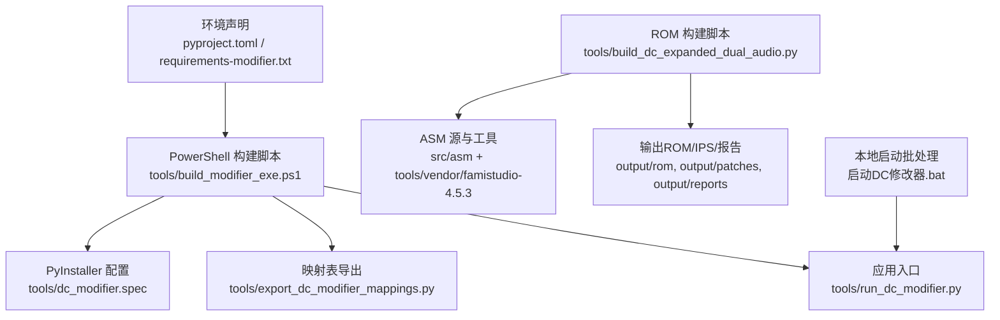
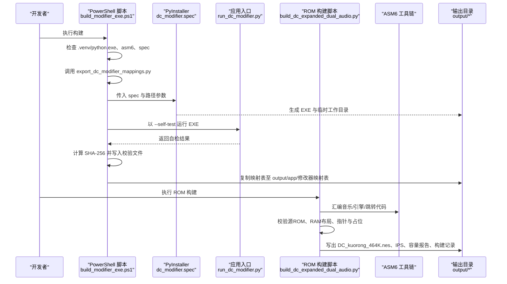
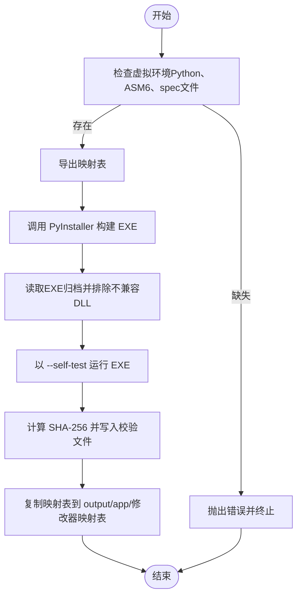
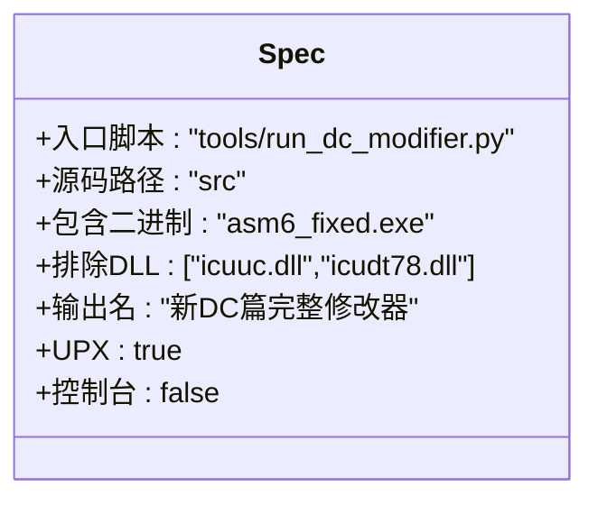
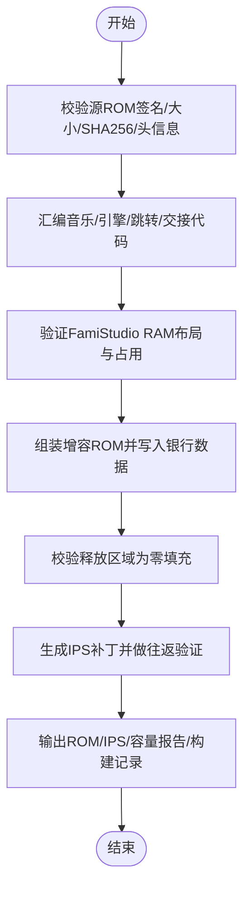
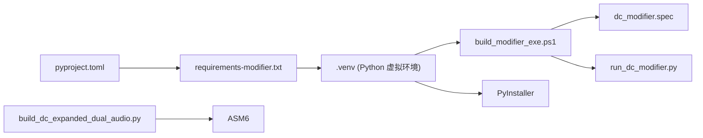

# 发布构建

<cite>
**本文引用的文件**
- [build_modifier_exe.ps1](file://tools/build_modifier_exe.ps1)
- [dc_modifier.spec](file://tools/dc_modifier.spec)
- [run_dc_modifier.py](file://tools/run_dc_modifier.py)
- [export_dc_modifier_mappings.py](file://tools/export_dc_modifier_mappings.py)
- [build_dc_expanded_dual_audio.py](file://tools/build_dc_expanded_dual_audio.py)
- [pyproject.toml](file://pyproject.toml)
- [requirements-modifier.txt](file://requirements-modifier.txt)
- [启动DC修改器.bat](file://启动DC修改器.bat)
</cite>

## 目录
1. [简介](#简介)
2. [项目结构](#项目结构)
3. [核心组件](#核心组件)
4. [架构总览](#架构总览)
5. [详细组件分析](#详细组件分析)
6. [依赖关系分析](#依赖关系分析)
7. [性能与可重复性](#性能与可重复性)
8. [故障排查指南](#故障排查指南)
9. [结论](#结论)
10. [附录：发布清单与签名建议](#附录发布清单与签名建议)

## 简介
本指南面向需要从零开始生成“新DC篇完整修改器”可分发安装包与双引擎增容ROM的团队成员。内容覆盖：
- PowerShell 构建脚本 build_modifier_exe.ps1 的使用、参数与环境要求、输出管理
- PyInstaller 打包配置 dc_modifier.spec 的定制要点（资源、图标、二进制排除）
- 双引擎ROM构建流程：ASM 汇编、增容ROM生成、IPS补丁与容量报告
- 签名与完整性校验：SHA-256 校验、版本控制建议、数字签名集成位置
- 分发准备：安装包制作、文档打包、更新机制配置建议
- 确保构建可重复、产物一致，支持团队协作与版本发布

## 项目结构
仓库采用分层组织：源码在 src，工具与脚本在 tools，参考素材在 references，构建产物在 output。关键构建入口包括：
- 应用打包：tools/build_modifier_exe.ps1
- ROM 构建：tools/build_dc_expanded_dual_audio.py
- 映射表导出：tools/export_dc_modifier_mappings.py
- 运行入口：tools/run_dc_modifier.py
- 打包配置：tools/dc_modifier.spec
- 环境声明：pyproject.toml、requirements-modifier.txt
- 本地快捷启动：启动DC修改器.bat

图表来源
- [build_modifier_exe.ps1:1-61](file://tools/build_modifier_exe.ps1#L1-L61)
- [dc_modifier.spec:1-63](file://tools/dc_modifier.spec#L1-L63)
- [build_dc_expanded_dual_audio.py:1-725](file://tools/build_dc_expanded_dual_audio.py#L1-L725)
- [run_dc_modifier.py:1-30](file://tools/run_dc_modifier.py#L1-L30)
- [pyproject.toml:1-31](file://pyproject.toml#L1-L31)
- [requirements-modifier.txt:1-3](file://requirements-modifier.txt#L1-L3)
- [启动DC修改器.bat:1-16](file://启动DC修改器.bat#L1-L16)

章节来源
- [build_modifier_exe.ps1:1-61](file://tools/build_modifier_exe.ps1#L1-L61)
- [dc_modifier.spec:1-63](file://tools/dc_modifier.spec#L1-L63)
- [build_dc_expanded_dual_audio.py:1-725](file://tools/build_dc_expanded_dual_audio.py#L1-L725)
- [run_dc_modifier.py:1-30](file://tools/run_dc_modifier.py#L1-L30)
- [pyproject.toml:1-31](file://pyproject.toml#L1-L31)
- [requirements-modifier.txt:1-3](file://requirements-modifier.txt#L1-L3)
- [启动DC修改器.bat:1-16](file://启动DC修改器.bat#L1-L16)

## 核心组件
- 应用打包流水线：由 PowerShell 脚本驱动，先导出映射表，再调用 PyInstaller 使用 spec 构建 EXE，随后执行自检、计算哈希并复制映射表到输出目录。
- ROM 构建流水线：基于固定源ROM与ASM源，编译音乐/引擎/跳转代码，组装增容ROM，生成IPS补丁与容量报告，并进行多项一致性校验。
- 环境与依赖：通过 pyproject.toml 与 requirements-modifier.txt 声明运行时与开发依赖；虚拟环境位于 .venv。
- 运行入口：run_dc_modifier.py 负责导入主程序并处理 --self-test 模式，便于自动化验证。

章节来源
- [build_modifier_exe.ps1:1-61](file://tools/build_modifier_exe.ps1#L1-L61)
- [build_dc_expanded_dual_audio.py:1-725](file://tools/build_dc_expanded_dual_audio.py#L1-L725)
- [pyproject.toml:1-31](file://pyproject.toml#L1-L31)
- [requirements-modifier.txt:1-3](file://requirements-modifier.txt#L1-L3)
- [run_dc_modifier.py:1-30](file://tools/run_dc_modifier.py#L1-L30)

## 架构总览
下图展示了从源码到最终产物的端到端构建流程，包括应用打包与ROM构建两条主线，以及共享的环境与工具链。

图表来源
- [build_modifier_exe.ps1:1-61](file://tools/build_modifier_exe.ps1#L1-L61)
- [dc_modifier.spec:1-63](file://tools/dc_modifier.spec#L1-L63)
- [build_dc_expanded_dual_audio.py:1-725](file://tools/build_dc_expanded_dual_audio.py#L1-L725)
- [run_dc_modifier.py:1-30](file://tools/run_dc_modifier.py#L1-L30)

## 详细组件分析

### 应用打包：PowerShell 构建脚本 build_modifier_exe.ps1
- 作用
  - 校验运行环境：虚拟环境 Python、ASM6 工具、PyInstaller 配置文件
  - 生成映射表：调用 export_dc_modifier_mappings.py，将ROM名称、表地址、码表等导出到 output/mappings
  - 调用 PyInstaller：使用 clean、noconfirm、指定 dist 与 work 路径，按 dc_modifier.spec 构建
  - 产物自检：读取EXE归档列表，排除不兼容的 ICU DLL；以 --self-test 启动EXE进行基本功能自检
  - 完整性校验：计算并保存 SHA-256 校验文件
  - 输出整理：将映射表复制到 output/app/修改器映射表
- 关键路径与产物
  - 输入：tools/dc_modifier.spec、tools/export_dc_modifier_mappings.py、.venv/Scripts/python.exe
  - 输出：output/app/新DC篇完整修改器.exe、output/app/新DC篇完整修改器.exe.sha256.txt、output/app/修改器映射表/*
- 注意事项
  - 若缺少任一前置条件会直接抛出错误，保证失败即停
  - 自检失败或检测到不兼容DLL时立即中止，避免污染发布包

图表来源
- [build_modifier_exe.ps1:1-61](file://tools/build_modifier_exe.ps1#L1-L61)

章节来源
- [build_modifier_exe.ps1:1-61](file://tools/build_modifier_exe.ps1#L1-L61)

### 打包配置：PyInstaller 规范 dc_modifier.spec
- 入口与路径
  - 入口脚本：tools/run_dc_modifier.py
  - 源码路径：src（作为 pathex）
- 二进制与数据
  - 包含 ASM6 工具：tools/vendor/famistudio-4.5.3/Tools/asm6_fixed.exe，放入 tools/vendor/famistudio-4.5.3/Tools 子目录
  - datas 为空，无需额外数据文件
- 隐藏导入与钩子
  - hiddenimports、hookspath、hooksconfig 均为空，保持最小化
- 兼容性处理
  - 显式排除 icuuc.dll 与 icudt78.dll，避免 Qt6Core 因系统PATH中的Poppler ICU导致 ERROR_PROC_NOT_FOUND
- 输出设置
  - 输出名：新DC篇完整修改器
  - 关闭控制台窗口，启用 UPX 压缩，禁用调试符号
  - 未配置代码签名字段（codesign_identity），可在后续扩展

图表来源
- [dc_modifier.spec:1-63](file://tools/dc_modifier.spec#L1-L63)

章节来源
- [dc_modifier.spec:1-63](file://tools/dc_modifier.spec#L1-L63)

### 运行入口：tools/run_dc_modifier.py
- 作用
  - 将 src 加入 sys.path，以便导入 dc_modifier.app
  - 支持 --self-test 模式：成功返回0，异常返回90，便于CI或构建脚本验证
- 错误处理
  - 非 self-test 模式下抛出带提示的系统退出信息，便于用户定位问题

章节来源
- [run_dc_modifier.py:1-30](file://tools/run_dc_modifier.py#L1-L30)

### 映射表导出：tools/export_dc_modifier_mappings.py
- 作用
  - 基于当前基准ROM与默认配置，生成：
    - 新DC完整码表.tbl
    - 新DC字模地址映射.csv
    - 旧修改器配置名称索引.json
    - 新DC_ROM名称与表地址映射.json
    - README.md（说明生成方式与ROM哈希）
- 输出位置
  - output/mappings/*
- 用途
  - 供修改器与编辑器在运行时加载名称、事件、地图、武器、角色等映射信息，确保界面显示与ROM结构一致

章节来源
- [export_dc_modifier_mappings.py:1-329](file://tools/export_dc_modifier_mappings.py#L1-L329)

### 双引擎ROM构建：tools/build_dc_expanded_dual_audio.py
- 目标
  - 基于固定的源ROM（新DC.nes）与ASM源，生成增容ROM（Mapper 194，PRG扩至1 MiB）、IPS补丁与容量报告
- 主要步骤
  - 校验源ROM大小、签名、SHA-256、头信息与音频指针
  - 汇编音乐数据、双引擎、跳转与交接代码（ASM6）
  - 验证FamiStudio RAM布局与占用范围，确保与旧音频驱动安全共存
  - 构建增容ROM：替换/插入引擎与音乐，保留原20首音乐与音效，释放多余空间
  - 生成IPS补丁并做往返验证（apply_ips(source, ips) == output）
  - 输出ROM、IPS、容量报告JSON与构建记录Markdown
- 关键常量与约束
  - Mapper 194、PRG/CHR尺寸、固定银行偏移、游戏内战斗音乐绑定等
  - 严格校验新增/替换区域为零填充或精确匹配，防止破坏原有行为
- 产物
  - output/rom/DC_kuorong_464K.nes
  - output/patches/DC_FamiStudio_增容双引擎_464K_测试.ips
  - output/reports/rom-build/DC_FamiStudio_增容双引擎_464K_容量报告.json
  - output/reports/rom-build/DC_FamiStudio_增容双引擎_464K_构建记录.md

图表来源
- [build_dc_expanded_dual_audio.py:1-725](file://tools/build_dc_expanded_dual_audio.py#L1-L725)

章节来源
- [build_dc_expanded_dual_audio.py:1-725](file://tools/build_dc_expanded_dual_audio.py#L1-L725)

### 本地启动：启动DC修改器.bat
- 作用
  - 优先尝试直接运行已构建的EXE
  - 若不存在，则提示创建虚拟环境并以 run_dc_modifier.py 运行源码版
- 适用场景
  - 日常开发与快速验证

章节来源
- [启动DC修改器.bat:1-16](file://启动DC修改器.bat#L1-L16)

## 依赖关系分析
- 运行时依赖
  - PySide6：UI框架
- 构建期依赖
  - PyInstaller：应用打包
  - ASM6：FamiStudio 工具链中的汇编器
- 环境管理
  - pyproject.toml 定义项目元数据与可选依赖
  - requirements-modifier.txt 锁定运行时与打包依赖
  - 虚拟环境 .venv 隔离依赖

图表来源
- [pyproject.toml:1-31](file://pyproject.toml#L1-L31)
- [requirements-modifier.txt:1-3](file://requirements-modifier.txt#L1-L3)
- [build_modifier_exe.ps1:1-61](file://tools/build_modifier_exe.ps1#L1-L61)
- [dc_modifier.spec:1-63](file://tools/dc_modifier.spec#L1-L63)
- [build_dc_expanded_dual_audio.py:1-725](file://tools/build_dc_expanded_dual_audio.py#L1-L725)

章节来源
- [pyproject.toml:1-31](file://pyproject.toml#L1-L31)
- [requirements-modifier.txt:1-3](file://requirements-modifier.txt#L1-L3)
- [build_modifier_exe.ps1:1-61](file://tools/build_modifier_exe.ps1#L1-L61)
- [dc_modifier.spec:1-63](file://tools/dc_modifier.spec#L1-L63)
- [build_dc_expanded_dual_audio.py:1-725](file://tools/build_dc_expanded_dual_audio.py#L1-L725)

## 性能与可重复性
- 可重复性保障
  - 源ROM固定SHA-256与尺寸校验，确保构建基线一致
  - ASM 输出经严格长度与入口表校验，避免漂移
  - IPS 往返验证保证补丁正确性
  - EXE 自检与归档扫描避免引入不兼容依赖
- 性能优化
  - 使用 UPX 压缩减小EXE体积
  - 仅包含必要二进制（ASM6），减少冗余
  - 清理构建缓存（--clean）提升稳定性
- 团队建议
  - 统一使用 .venv 与相同依赖版本
  - 将 output 纳入忽略规则，仅提交源码与脚本
  - 在CI中执行 PowerShell 构建与ROM构建，并上传产物与校验文件

[本节为通用指导，不直接分析具体文件]

## 故障排查指南
- 常见错误与处理
  - 未找到虚拟环境 Python：请确认 .venv 已创建且包含 python.exe
  - 未找到 ASM6：请确认 tools/vendor/famistudio-4.5.3/Tools/asm6_fixed.exe 存在
  - 未找到 PyInstaller 配置：请确认 dc_modifier.spec 存在
  - 映射表生成失败：检查 ROM 路径与依赖是否就绪
  - PyInstaller 构建失败：查看构建日志，确认无模块缺失或路径错误
  - EXE 自检失败：检查依赖库与Qt/Poppler冲突，确认未包含不兼容DLL
  - 源ROM校验失败：确认 source ROM 大小、签名、SHA-256 与头信息符合预期
  - RAM布局不一致：检查 ASM 源与标签地址，确保与预期一致
  - IPS 往返验证失败：检查补丁生成逻辑与ROM差异
- 建议诊断步骤
  - 逐步执行：先运行映射表导出，再执行 PyInstaller，最后运行ROM构建
  - 检查输出目录：确认 output/app、output/rom、output/patches、output/reports 下产物齐全
  - 对比哈希：核对 EXE 与 ROM 的 SHA-256 是否与上次发布一致

章节来源
- [build_modifier_exe.ps1:1-61](file://tools/build_modifier_exe.ps1#L1-L61)
- [build_dc_expanded_dual_audio.py:1-725](file://tools/build_dc_expanded_dual_audio.py#L1-L725)
- [run_dc_modifier.py:1-30](file://tools/run_dc_modifier.py#L1-L30)

## 结论
本构建体系通过严格的源基线校验、ASM 输出验证、PyInstaller 配置隔离与EXE自检，确保了应用与ROM构建的可重复性与一致性。配合映射表导出与容量报告，团队可以在不同机器上复现相同的发布产物，并为后续的数字签名与分发提供可靠基础。

[本节为总结性内容，不直接分析具体文件]

## 附录：发布清单与签名建议
- 发布产物清单
  - 应用
    - output/app/新DC篇完整修改器.exe
    - output/app/新DC篇完整修改器.exe.sha256.txt
    - output/app/修改器映射表/*（含码表、CSV、JSON与README）
  - ROM与补丁
    - output/rom/DC_kuorong_464K.nes
    - output/patches/DC_FamiStudio_增容双引擎_464K_测试.ips
  - 报告与记录
    - output/reports/rom-build/DC_FamiStudio_增容双引擎_464K_容量报告.json
    - output/reports/rom-build/DC_FamiStudio_增容双引擎_464K_构建记录.md
- 数字签名建议
  - 在 PyInstaller 配置中启用 codesign_identity（Windows 可使用 signtool 或第三方签名服务）
  - 对最终EXE与ROM分别签名，并在发布页附带签名证书指纹
  - 建议在CI中自动执行签名与完整性校验，并将签名结果与哈希一同归档
- 更新机制建议
  - 基于IPS补丁的增量更新：客户端校验源ROM哈希后应用IPS
  - 全量更新：直接下载新的增容ROM与EXE，并校验SHA-256
  - 版本控制：在容量报告与README中标注版本号与构建时间，便于追踪

[本节为通用建议，不直接分析具体文件]