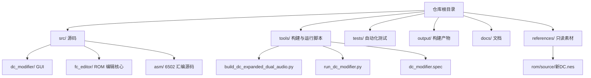
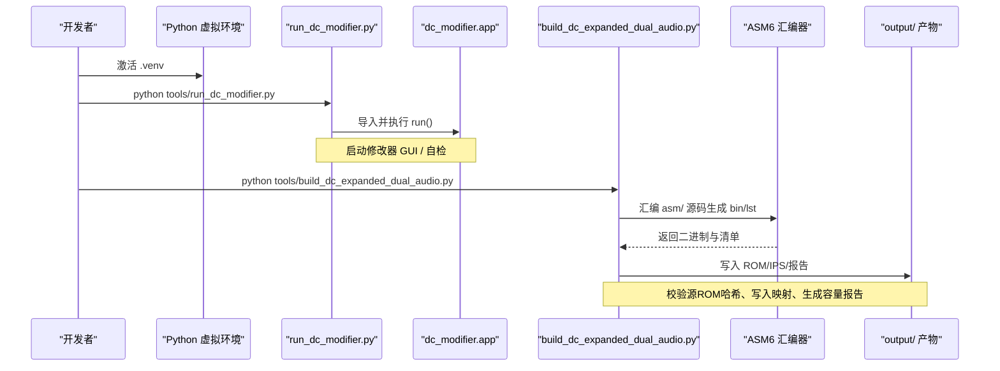
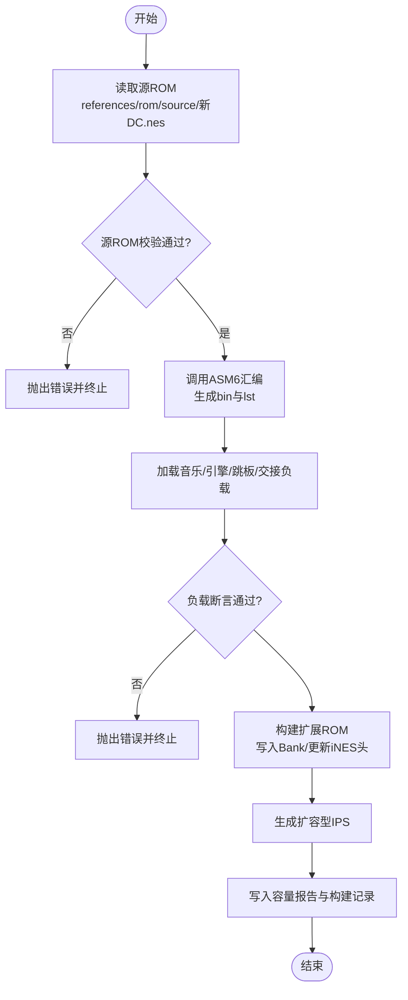
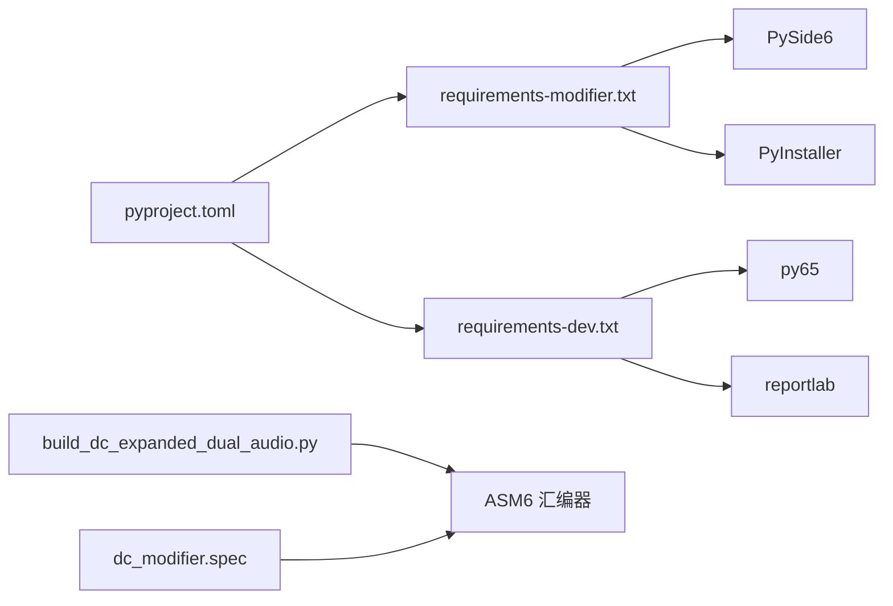

# 开发环境构建

<cite>
**本文引用的文件**
- [build_dc_expanded_dual_audio.py](file://tools/build_dc_expanded_dual_audio.py)
- [AGENTS.md](file://AGENTS.md)
- [pyproject.toml](file://pyproject.toml)
- [requirements-modifier.txt](file://requirements-modifier.txt)
- [requirements-dev.txt](file://requirements-dev.txt)
- [run_dc_modifier.py](file://tools/run_dc_modifier.py)
- [启动DC修改器.bat](file://启动DC修改器.bat)
- [dc_modifier.spec](file://tools/dc_modifier.spec)
- [交接文档.md](file://docs/交接文档.md)
</cite>

## 目录
1. [简介](#简介)
2. [项目结构](#项目结构)
3. [核心组件](#核心组件)
4. [架构总览](#架构总览)
5. [详细组件分析](#详细组件分析)
6. [依赖关系分析](#依赖关系分析)
7. [性能与构建优化](#性能与构建优化)
8. [故障排查指南](#故障排查指南)
9. [结论](#结论)
10. [附录：快速上手命令](#附录快速上手命令)

## 简介
本指南面向需要在本地搭建可工作的 DC 修改器与 ROM 构建环境的开发者。内容涵盖 Python 环境与虚拟环境配置、依赖安装、ROM 构建脚本使用（含 ASM6 汇编器配置与源 ROM 校验）、调试与日志、以及常见问题定位与解决。目标是让开发者在最短时间完成“源码运行 + 构建测试”的闭环，支持日常开发与测试工作流。

## 项目结构
仓库采用清晰的分层组织：
- src：产品源码（GUI、ROM 编辑核心、ASM 源码、默认配置）
- tools：构建、打包、运行与第三方工具入口
- tests：自动化测试
- output：构建产物（ROM、IPS、报告、应用包等）
- docs：用户与维护文档
- references：只读素材（源 ROM、基线 ROM、音频资源、研究资料）

图表来源
- [AGENTS.md:9-20](file://AGENTS.md#L9-L20)
- [交接文档.md:185-200](file://docs/交接文档.md#L185-L200)

章节来源
- [AGENTS.md:9-20](file://AGENTS.md#L9-L20)
- [交接文档.md:185-200](file://docs/交接文档.md#L185-L200)

## 核心组件
- Python 工程配置：通过 pyproject.toml 声明 Python 版本要求、依赖与可编辑安装方式；提供命令行入口 dc-modifier。
- 运行入口：tools/run_dc_modifier.py 将 src 加入导入路径并调用 dc_modifier.app.run。
- ROM 构建：tools/build_dc_expanded_dual_audio.py 负责源 ROM 校验、ASM6 汇编、双引擎注入、输出 ROM/IPS/报告。
- 打包配置：tools/dc_modifier.spec 定义 PyInstaller 打包行为，并将 ASM6 作为二进制嵌入。
- 启动批处理：启动DC修改器.bat 检测虚拟环境并调用运行脚本。

章节来源
- [pyproject.toml:1-31](file://pyproject.toml#L1-L31)
- [run_dc_modifier.py:1-30](file://tools/run_dc_modifier.py#L1-L30)
- [build_dc_expanded_dual_audio.py:1-725](file://tools/build_dc_expanded_dual_audio.py#L1-L725)
- [dc_modifier.spec:1-63](file://tools/dc_modifier.spec#L1-L63)
- [启动DC修改器.bat:1-16](file://启动DC修改器.bat#L1-L16)

## 架构总览
下图展示从源码到可运行修改器与 ROM 产物的整体流程：Python 环境准备 → 运行修改器 → 构建 ROM（含 ASM6 汇编）→ 生成 IPS 与报告 → 打包为独立 EXE。

图表来源
- [run_dc_modifier.py:13-25](file://tools/run_dc_modifier.py#L13-L25)
- [build_dc_expanded_dual_audio.py:132-165](file://tools/build_dc_expanded_dual_audio.py#L132-L165)
- [build_dc_expanded_dual_audio.py:681-725](file://tools/build_dc_expanded_dual_audio.py#L681-L725)

## 详细组件分析

### Python 环境与依赖
- Python 版本：要求 >= 3.10（由 pyproject.toml 指定）。
- 虚拟环境：建议使用 venv 创建 .venv，并在其中安装依赖。
- 依赖分层：
  - 运行时依赖：PySide6（GUI 框架）
  - 构建/打包依赖：PyInstaller（打包 EXE）
  - 开发依赖：py65（6502 模拟器辅助）、reportlab（PDF 报告）
- 安装建议：
  - 先创建并激活 .venv
  - 安装 requirements-modifier.txt 获取运行时依赖
  - 安装 requirements-dev.txt 或 pyproject 的 dev 可选依赖以启用测试与打包能力

章节来源
- [pyproject.toml:5-20](file://pyproject.toml#L5-L20)
- [requirements-modifier.txt:1-3](file://requirements-modifier.txt#L1-L3)
- [requirements-dev.txt:1-5](file://requirements-dev.txt#L1-L5)

### 运行修改器（源码版）
- 推荐方式：在项目根目录执行 AGENTS.md 中列出的命令，或使用启动批处理。
- 启动逻辑：
  - 启动DC修改器.bat 会检查 .venv\Scripts\python.exe 是否存在，不存在则提示创建虚拟环境
  - 存在则调用 tools/run_dc_modifier.py
  - run_dc_modifier.py 将 src 加入 sys.path 后调用 dc_modifier.app.run
- 自测模式：可通过 --self-test 参数触发内部自检并返回特定退出码

章节来源
- [启动DC修改器.bat:1-16](file://启动DC修改器.bat#L1-L16)
- [run_dc_modifier.py:13-25](file://tools/run_dc_modifier.py#L13-L25)
- [AGENTS.md:26-39](file://AGENTS.md#L26-L39)

### ROM 构建脚本 build_dc_expanded_dual_audio.py
该脚本是构建“增容双引擎”ROM 的核心，包含以下关键阶段：
- 源 ROM 验证：
  - 读取 references/rom/source/新DC.nes
  - 校验 iNES 签名、文件大小、SHA-256、PRG/CHR 大小与 Mapper 编号
  - 校验原音频 Bank $18 指针与预留空洞区域为空
  - 校验固定 Bank $E000 中的音频操作数指向原音频 Bank
- ASM6 汇编：
  - 调用 tools/vendor/famistudio-4.5.3/Tools/asm6_fixed.exe
  - 汇编音乐数据、双引擎、跳板与交接代码，生成 bin 与 lst 清单
- 负载加载与断言：
  - 校验音乐 Bank 大小、引擎入口表、跳板与交接代码头部指令
- ROM 构建：
  - 基于源 ROM 扩展 PRG 至 1 MiB，保留 CHR
  - 在原 Bank $18 的空洞中写入调度与同帧切换代码
  - 写入三首新曲与第二套 FamiStudio 引擎及桥接
  - 更新 iNES 头 PRG 大小与 Mapper
  - 生成输出 ROM 与扩容型 IPS
- 报告与日志：
  - 输出容量报告 JSON 与构建记录 Markdown
  - 记录各 Bank 用途、已用/剩余字节、兼容性与注意事项

图表来源
- [build_dc_expanded_dual_audio.py:21-61](file://tools/build_dc_expanded_dual_audio.py#L21-L61)
- [build_dc_expanded_dual_audio.py:132-165](file://tools/build_dc_expanded_dual_audio.py#L132-L165)
- [build_dc_expanded_dual_audio.py:339-365](file://tools/build_dc_expanded_dual_audio.py#L339-L365)
- [build_dc_expanded_dual_audio.py:410-467](file://tools/build_dc_expanded_dual_audio.py#L410-L467)
- [build_dc_expanded_dual_audio.py:681-725](file://tools/build_dc_expanded_dual_audio.py#L681-L725)

章节来源
- [build_dc_expanded_dual_audio.py:21-61](file://tools/build_dc_expanded_dual_audio.py#L21-L61)
- [build_dc_expanded_dual_audio.py:132-165](file://tools/build_dc_expanded_dual_audio.py#L132-L165)
- [build_dc_expanded_dual_audio.py:339-365](file://tools/build_dc_expanded_dual_audio.py#L339-L365)
- [build_dc_expanded_dual_audio.py:410-467](file://tools/build_dc_expanded_dual_audio.py#L410-L467)
- [build_dc_expanded_dual_audio.py:681-725](file://tools/build_dc_expanded_dual_audio.py#L681-L725)

### ASM6 汇编器配置
- 位置：tools/vendor/famistudio-4.5.3/Tools/asm6_fixed.exe
- 调用方式：构建脚本以相对路径在工作目录下执行 asm6_fixed.exe，传入源文件名、输出 bin 与 lst 的相对路径
- 产物：每个汇编目标均生成对应的 .bin 与 .lst 清单，供后续地址解析与断言使用
- 打包集成：PyInstaller spec 将 asm6_fixed.exe 作为二进制嵌入，确保打包后的 EXE 仍可调用

章节来源
- [build_dc_expanded_dual_audio.py:39-46](file://tools/build_dc_expanded_dual_audio.py#L39-L46)
- [build_dc_expanded_dual_audio.py:132-165](file://tools/build_dc_expanded_dual_audio.py#L132-L165)
- [dc_modifier.spec:6-24](file://tools/dc_modifier.spec#L6-L24)

### 源 ROM 验证要点
- 必须使用只读源 references/rom/source/新DC.nes，禁止原地修改
- 校验项包括：
  - iNES 签名与文件大小
  - SHA-256 与预期值一致
  - PRG/CHR 大小与 Mapper 编号正确
  - 原音频 Bank $18 的指针与预留空洞区域为空
  - 固定 Bank $E000 的音频操作数指向原音频 Bank
- 若任一校验失败，构建将立即中止并抛出错误

章节来源
- [build_dc_expanded_dual_audio.py:339-365](file://tools/build_dc_expanded_dual_audio.py#L339-L365)
- [交接文档.md:5-11](file://docs/交接文档.md#L5-L11)

### 调试与日志
- 修改器启动：
  - 使用 run_dc_modifier.py 的 --self-test 可触发内置自检并返回特定退出码，便于 CI 或自动化检查
- 构建日志：
  - 构建完成后会在 output/reports/rom-build/ 下生成构建记录 Markdown 与容量报告 JSON
  - 报告中包含源/输出 ROM 的 SHA-256、Mapper、PRG/CHR 大小、各 Bank 用途、兼容性说明等
- 性能分析：
  - 可在 Python 层使用标准 profiling 工具对构建脚本进行剖析（例如 cProfile），重点关注 ASM6 调用与 ROM 写入阶段
  - 对于 ROM 行为验证，可使用仓库提供的 Mesen 自动检查脚本进行长时运行与帧级比对

章节来源
- [run_dc_modifier.py:13-25](file://tools/run_dc_modifier.py#L13-L25)
- [build_dc_expanded_dual_audio.py:489-678](file://tools/build_dc_expanded_dual_audio.py#L489-L678)
- [AGENTS.md:47-49](file://AGENTS.md#L47-L49)

### 打包为独立 EXE
- 使用 PyInstaller 与 dc_modifier.spec 将修改器打包为 Windows 可执行文件
- spec 中将 ASM6 作为二进制嵌入，避免运行时缺失
- 排除系统 ICU 冲突 DLL，避免 Qt6Core 报找不到导出函数
- 打包产物位于 output/app/新DC篇完整修改器.exe

章节来源
- [dc_modifier.spec:6-63](file://tools/dc_modifier.spec#L6-L63)
- [AGENTS.md:26-39](file://AGENTS.md#L26-L39)

## 依赖关系分析
- Python 依赖：
  - 运行时：PySide6
  - 构建：PyInstaller
  - 开发：py65、reportlab
- 外部工具：
  - ASM6 汇编器（famistudio 工具链）
  - Mesen/FCEUX（用于运行时验证，FCEUX 2.6.6 不兼容当前 Mapper 194 1 MiB PRG 方案）
- 模块耦合：
  - run_dc_modifier.py 仅负责路径注入与入口调用，低耦合
  - build_dc_expanded_dual_audio.py 集中了 ROM 构建逻辑，强内聚
  - dc_modifier.spec 与构建脚本共同依赖 vendor 下的 ASM6

图表来源
- [pyproject.toml:5-20](file://pyproject.toml#L5-L20)
- [requirements-modifier.txt:1-3](file://requirements-modifier.txt#L1-L3)
- [requirements-dev.txt:1-5](file://requirements-dev.txt#L1-L5)
- [build_dc_expanded_dual_audio.py:39-46](file://tools/build_dc_expanded_dual_audio.py#L39-L46)
- [dc_modifier.spec:6-24](file://tools/dc_modifier.spec#L6-L24)

章节来源
- [pyproject.toml:5-20](file://pyproject.toml#L5-L20)
- [requirements-modifier.txt:1-3](file://requirements-modifier.txt#L1-L3)
- [requirements-dev.txt:1-5](file://requirements-dev.txt#L1-L5)
- [build_dc_expanded_dual_audio.py:39-46](file://tools/build_dc_expanded_dual_audio.py#L39-L46)
- [dc_modifier.spec:6-24](file://tools/dc_modifier.spec#L6-L24)

## 性能与构建优化
- 并行化建议：
  - 多个 ASM 目标的汇编可并行执行（需自行封装任务调度），减少等待时间
- I/O 优化：
  - 大文件写入（ROM/IPS）建议在内存中构造后再一次性落盘，减少碎片写
- 缓存策略：
  - 对未变更的 ASM 源可跳过重新汇编，依据时间戳或哈希判断
- 模拟器验证：
  - 使用 Mesen 进行长时运行与帧级比对，结合 Lua 脚本采集 APU/PPU 指标
  - 注意 FCEUX 2.6.6 对 Mapper 194 的 PRG 限制，避免误判

[本节为通用指导，不直接分析具体文件]

## 故障排查指南
- 依赖冲突或版本不匹配
  - 现象：导入错误或运行时异常
  - 处理：确认 Python >= 3.10；在 .venv 中按顺序安装 requirements-modifier.txt 与 requirements-dev.txt；必要时锁定版本范围
- 虚拟环境未创建或路径错误
  - 现象：启动批处理提示尚未创建虚拟环境
  - 处理：在项目根目录执行 python -m venv .venv 并激活；再运行启动脚本或 AGENTS.md 中的命令
- ASM6 未找到或权限不足
  - 现象：构建时报找不到 asm6_fixed.exe 或执行失败
  - 处理：确认 tools/vendor/famistudio-4.5.3/Tools/asm6_fixed.exe 存在且可执行；Windows 上以管理员权限运行终端或调整文件夹权限
- 源 ROM 校验失败
  - 现象：SHA-256 或大小不匹配、iNES 签名错误、Bank $18 空洞非空
  - 处理：确保使用只读源 references/rom/source/新DC.nes；不要覆盖或修改；重新下载或替换为正确的源文件
- 路径配置问题
  - 现象：构建或运行时报找不到 src、output 或 vendor 路径
  - 处理：确保在项目根目录执行命令；脚本使用相对路径，不要在子目录中运行
- 打包后运行报错（Qt/ICU）
  - 现象：打包的 EXE 启动时报找不到导出函数
  - 处理：确认 dc_modifier.spec 已排除 icuuc.dll/icudt78.dll；避免系统 PATH 中的冲突 ICU 被误引入
- 模拟器兼容性
  - 现象：在 FCEUX 2.6.6 中无法访问 >512 KiB PRG
  - 处理：使用 Mesen 0.9.9 进行验证；如需实机，需额外验证硬件对 1 MiB PRG 的支持

章节来源
- [启动DC修改器.bat:8-14](file://启动DC修改器.bat#L8-L14)
- [build_dc_expanded_dual_audio.py:339-365](file://tools/build_dc_expanded_dual_audio.py#L339-L365)
- [dc_modifier.spec:35-41](file://tools/dc_modifier.spec#L35-L41)
- [交接文档.md:178-183](file://docs/交接文档.md#L178-L183)

## 结论
通过本指南，开发者可以快速完成 Python 环境、依赖、ROM 构建与修改器运行的全套搭建。构建脚本提供了严格的源 ROM 校验与详尽的报告输出，配合 AGENTS.md 的命令与测试规范，能够稳定支撑日常开发与测试。遇到依赖、路径或权限问题时，可参考故障排查部分逐项定位。最终产出包括可运行的修改器、增容 ROM、IPS 补丁与构建报告，便于协作与回溯。

## 附录：快速上手命令
- 创建并激活虚拟环境
  - python -m venv .venv
  - 激活：Windows 下执行 .venv\Scripts\activate
- 安装依赖
  - pip install -r requirements-modifier.txt
  - pip install -r requirements-dev.txt
- 运行修改器（源码版）
  - python tools/run_dc_modifier.py
  - 或直接双击 启动DC修改器.bat
- 构建 ROM
  - python tools/build_dc_expanded_dual_audio.py
- 运行测试
  - python -m unittest discover -s tests -t . -p "test_*.py"
- 打包 EXE
  - python -m PyInstaller tools/dc_modifier.spec
  - 产物位于 output/app/新DC篇完整修改器.exe

章节来源
- [AGENTS.md:26-39](file://AGENTS.md#L26-L39)
- [启动DC修改器.bat:1-16](file://启动DC修改器.bat#L1-L16)
- [build_dc_expanded_dual_audio.py:681-725](file://tools/build_dc_expanded_dual_audio.py#L681-L725)
- [dc_modifier.spec:45-63](file://tools/dc_modifier.spec#L45-L63)