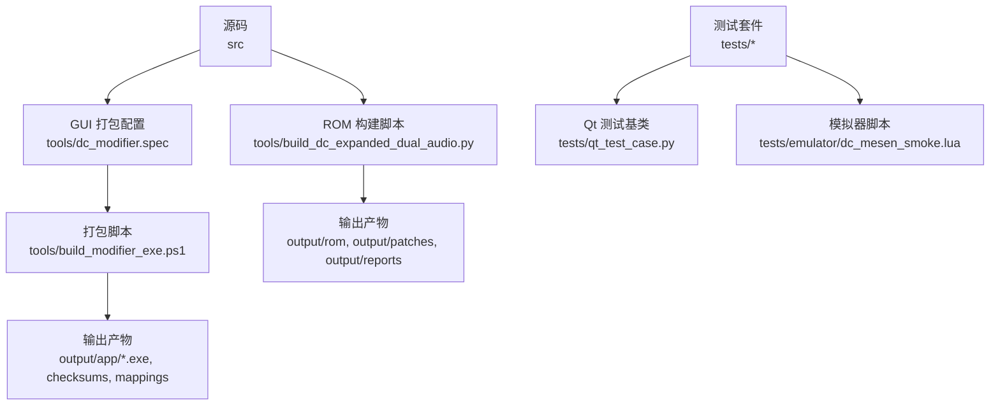
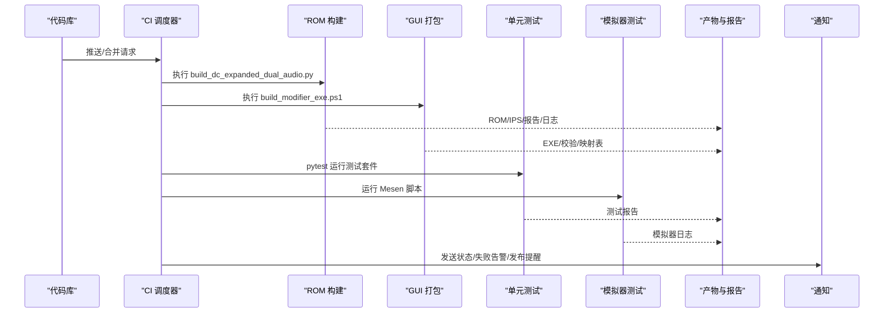
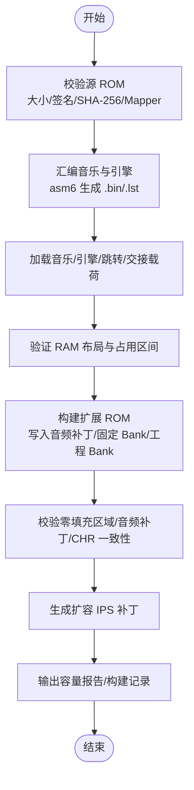
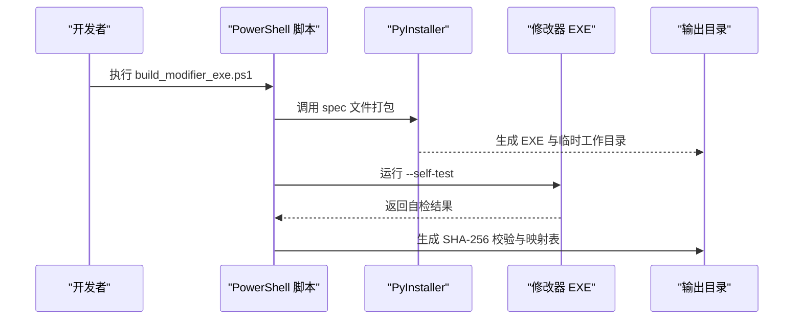
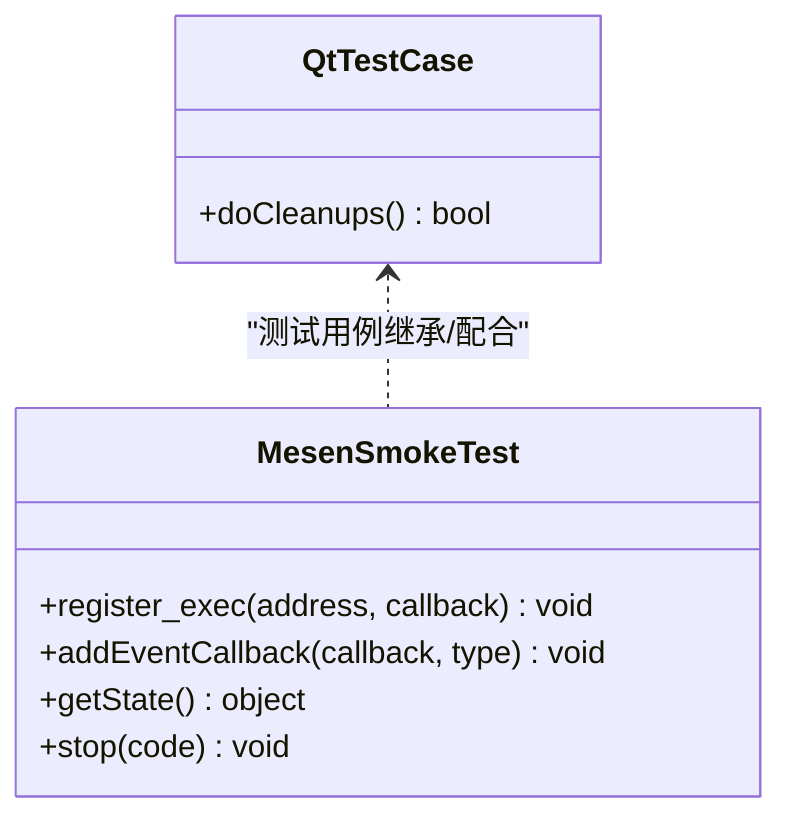
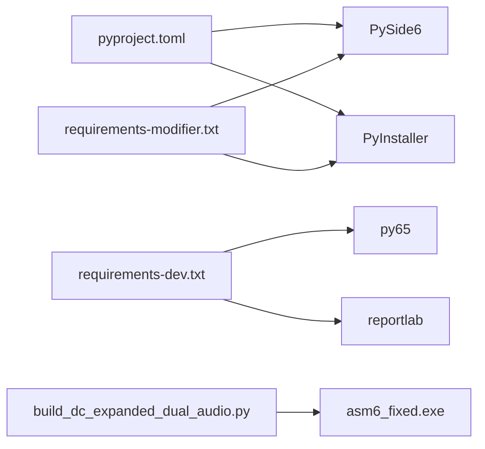
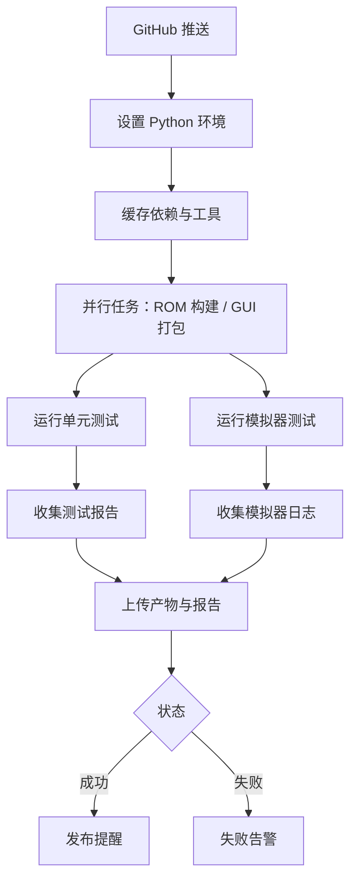

# 持续集成

<cite>
**本文引用的文件**
- [pyproject.toml](file://pyproject.toml)
- [requirements-modifier.txt](file://requirements-modifier.txt)
- [requirements-dev.txt](file://requirements-dev.txt)
- [tools/build_dc_expanded_dual_audio.py](file://tools/build_dc_expanded_dual_audio.py)
- [tools/dc_modifier.spec](file://tools/dc_modifier.spec)
- [tools/build_modifier_exe.ps1](file://tools/build_modifier_exe.ps1)
- [tests/qt_test_case.py](file://tests/qt_test_case.py)
- [tests/emulator/dc_mesen_smoke.lua](file://tests/emulator/dc_mesen_smoke.lua)
</cite>

## 目录
1. [简介](#简介)
2. [项目结构](#项目结构)
3. [核心组件](#核心组件)
4. [架构总览](#架构总览)
5. [详细组件分析](#详细组件分析)
6. [依赖关系分析](#依赖关系分析)
7. [性能与缓存优化](#性能与缓存优化)
8. [故障排查指南](#故障排查指南)
9. [结论](#结论)
10. [附录：CI/CD 配置模板](#附录cicd-配置模板)

## 简介
本指南面向“FC 扩容 MMC3”项目的持续集成（CI）与持续交付（CD），目标是建立自动化构建、测试、质量检查与产物归档流水线，覆盖 ROM 增容构建、PySide6 GUI 应用打包、单元测试与模拟器集成测试，并配套通知机制与发布提醒。通过标准化流水线，提升团队开发效率与代码可靠性。

## 项目结构
仓库采用分层组织：源码位于 src，工具脚本位于 tools，测试位于 tests，构建产物与报告输出到 output，依赖与构建元数据在 pyproject.toml 与各 requirements 文件中定义。关键构建入口包括：
- ROM 增容构建：tools/build_dc_expanded_dual_audio.py
- GUI 应用打包：tools/dc_modifier.spec + tools/build_modifier_exe.ps1
- 测试基类与模拟器脚本：tests/qt_test_case.py、tests/emulator/dc_mesen_smoke.lua

**图示来源**
- [tools/build_dc_expanded_dual_audio.py:1-725](file://tools/build_dc_expanded_dual_audio.py#L1-L725)
- [tools/dc_modifier.spec:1-63](file://tools/dc_modifier.spec#L1-L63)
- [tools/build_modifier_exe.ps1:1-61](file://tools/build_modifier_exe.ps1#L1-L61)
- [tests/qt_test_case.py:1-29](file://tests/qt_test_case.py#L1-L29)
- [tests/emulator/dc_mesen_smoke.lua:1-377](file://tests/emulator/dc_mesen_smoke.lua#L1-L377)

**章节来源**
- [pyproject.toml:1-31](file://pyproject.toml#L1-L31)
- [requirements-modifier.txt:1-3](file://requirements-modifier.txt#L1-L3)
- [requirements-dev.txt:1-5](file://requirements-dev.txt#L1-L5)

## 核心组件
- ROM 增容构建器：负责汇编音乐与引擎二进制、校验源 ROM、生成扩容量 ROM 与 IPS 补丁、输出容量报告与构建日志。
- GUI 打包器：基于 PyInstaller 将修改器打包为 Windows 可执行文件，排除不兼容的 ICU DLL，执行自检并生成 SHA-256 校验。
- 测试基础设施：提供 Qt 窗口生命周期管理基类，确保无 QApplication.exec() 下的确定性清理；提供 Mesen 模拟器脚本进行运行时验证。
- 依赖与构建元数据：Python 版本、依赖包范围、可选开发依赖、入口点等。

**章节来源**
- [tools/build_dc_expanded_dual_audio.py:1-725](file://tools/build_dc_expanded_dual_audio.py#L1-L725)
- [tools/dc_modifier.spec:1-63](file://tools/dc_modifier.spec#L1-L63)
- [tools/build_modifier_exe.ps1:1-61](file://tools/build_modifier_exe.ps1#L1-L61)
- [tests/qt_test_case.py:1-29](file://tests/qt_test_case.py#L1-L29)
- [tests/emulator/dc_mesen_smoke.lua:1-377](file://tests/emulator/dc_mesen_smoke.lua#L1-L377)
- [pyproject.toml:1-31](file://pyproject.toml#L1-L31)

## 架构总览
下图展示 CI 流水线的阶段划分与交互：拉取代码后并行执行 ROM 构建与 GUI 打包，随后运行单元测试与模拟器集成测试，最后收集产物与报告并触发通知。

**图示来源**
- [tools/build_dc_expanded_dual_audio.py:1-725](file://tools/build_dc_expanded_dual_audio.py#L1-L725)
- [tools/build_modifier_exe.ps1:1-61](file://tools/build_modifier_exe.ps1#L1-L61)
- [tests/emulator/dc_mesen_smoke.lua:1-377](file://tests/emulator/dc_mesen_smoke.lua#L1-L377)

## 详细组件分析

### ROM 增容构建流程
该流程包含源 ROM 校验、ASM 汇编、负载加载、RAM 布局验证、ROM 拼接、IPS 生成与报告输出。

**图示来源**
- [tools/build_dc_expanded_dual_audio.py:132-165](file://tools/build_dc_expanded_dual_audio.py#L132-L165)
- [tools/build_dc_expanded_dual_audio.py:167-181](file://tools/build_dc_expanded_dual_audio.py#L167-L181)
- [tools/build_dc_expanded_dual_audio.py:184-312](file://tools/build_dc_expanded_dual_audio.py#L184-L312)
- [tools/build_dc_expanded_dual_audio.py:315-366](file://tools/build_dc_expanded_dual_audio.py#L315-L366)
- [tools/build_dc_expanded_dual_audio.py:367-467](file://tools/build_dc_expanded_dual_audio.py#L367-L467)
- [tools/build_dc_expanded_dual_audio.py:489-678](file://tools/build_dc_expanded_dual_audio.py#L489-L678)
- [tools/build_dc_expanded_dual_audio.py:681-725](file://tools/build_dc_expanded_dual_audio.py#L681-L725)

**章节来源**
- [tools/build_dc_expanded_dual_audio.py:1-725](file://tools/build_dc_expanded_dual_audio.py#L1-L725)

### GUI 应用打包流程
使用 PyInstaller 将修改器打包为独立 EXE，排除不兼容的 ICU DLL，执行主窗口自检，生成 SHA-256 校验与映射表。

**图示来源**
- [tools/build_modifier_exe.ps1:1-61](file://tools/build_modifier_exe.ps1#L1-L61)
- [tools/dc_modifier.spec:1-63](file://tools/dc_modifier.spec#L1-L63)

**章节来源**
- [tools/build_modifier_exe.ps1:1-61](file://tools/build_modifier_exe.ps1#L1-L61)
- [tools/dc_modifier.spec:1-63](file://tools/dc_modifier.spec#L1-L63)

### 测试基础设施与模拟器集成测试
- Qt 测试基类：在无事件循环环境下安全销毁顶层窗口，避免跨测试污染。
- Mesen 脚本：对 1 MiB Mapper 194 双引擎 ROM 进行运行时验证，检查 PRG-ROM 偏移、引擎入口、歌曲映射与 APU 输出。

**图示来源**
- [tests/qt_test_case.py:1-29](file://tests/qt_test_case.py#L1-L29)
- [tests/emulator/dc_mesen_smoke.lua:1-377](file://tests/emulator/dc_mesen_smoke.lua#L1-L377)

**章节来源**
- [tests/qt_test_case.py:1-29](file://tests/qt_test_case.py#L1-L29)
- [tests/emulator/dc_mesen_smoke.lua:1-377](file://tests/emulator/dc_mesen_smoke.lua#L1-L377)

## 依赖关系分析
- Python 与 GUI 依赖：PySide6 用于桌面界面；PyInstaller 用于打包。
- 开发依赖：py65、reportlab 用于测试与文档生成。
- 构建工具：asm6_fixed.exe（FamiStudio 工具链）用于汇编音乐与引擎。

**图示来源**
- [pyproject.toml:1-31](file://pyproject.toml#L1-L31)
- [requirements-modifier.txt:1-3](file://requirements-modifier.txt#L1-L3)
- [requirements-dev.txt:1-5](file://requirements-dev.txt#L1-L5)
- [tools/build_dc_expanded_dual_audio.py:39-46](file://tools/build_dc_expanded_dual_audio.py#L39-L46)

**章节来源**
- [pyproject.toml:1-31](file://pyproject.toml#L1-L31)
- [requirements-modifier.txt:1-3](file://requirements-modifier.txt#L1-L3)
- [requirements-dev.txt:1-5](file://requirements-dev.txt#L1-L5)

## 性能与缓存优化
- 构建缓存策略：
  - 缓存 Python 虚拟环境与 pip 包索引，减少依赖安装时间。
  - 缓存 asm6 工具与 vendor 资源，避免重复下载。
  - 缓存 PyInstaller 工作目录与中间产物，加速增量打包。
- 并行化：
  - ROM 构建与 GUI 打包可并行执行，缩短整体流水线时长。
  - 单元测试按模块分组并行执行，提高覆盖率与速度。
- 增量构建：
  - 仅当 ASM 或 Python 源码变更时重新汇编与打包。
  - 利用哈希或时间戳判断是否需要重建 ROM 与 EXE。

[本节为通用指导，无需特定文件引用]

## 故障排查指南
- ROM 构建失败：
  - 检查源 ROM 大小、iNES 签名、SHA-256 与 Mapper 设置是否匹配预期。
  - 确认 asm6 路径正确且可执行。
  - 查看生成的 .lst 列表文件定位标签解析错误。
- GUI 打包失败：
  - 确认虚拟环境 Python 存在且版本满足要求。
  - 检查 PyInstaller spec 中排除的 ICU DLL 是否正确。
  - 运行 EXE 自检失败时，检查 Qt 运行时与系统 ICU 冲突。
- 测试失败：
  - Qt 测试：确保顶层窗口被正确销毁，避免事件循环残留。
  - 模拟器测试：检查 Mesen 脚本输出的 RESULT 行与失败名称列表。

**章节来源**
- [tools/build_dc_expanded_dual_audio.py:132-165](file://tools/build_dc_expanded_dual_audio.py#L132-L165)
- [tools/build_dc_expanded_dual_audio.py:339-366](file://tools/build_dc_expanded_dual_audio.py#L339-L366)
- [tools/build_modifier_exe.ps1:10-49](file://tools/build_modifier_exe.ps1#L10-L49)
- [tests/qt_test_case.py:11-29](file://tests/qt_test_case.py#L11-L29)
- [tests/emulator/dc_mesen_smoke.lua:243-257](file://tests/emulator/dc_mesen_smoke.lua#L243-L257)

## 结论
通过本指南配置的 CI/CD 流水线，可实现 ROM 增容构建、GUI 应用打包、单元与模拟器测试的自动化执行，并产出可追溯的构建产物与报告。结合缓存与并行策略，显著提升构建速度与稳定性；通过质量检查与通知机制，保障代码质量与发布可靠性。

[本节为总结性内容，无需特定文件引用]

## 附录：CI/CD 配置模板

### GitHub Actions 示例
- 触发条件：push 与 pull_request 事件。
- 作业矩阵：
  - 构建 ROM：安装 Python 与依赖，执行 ROM 构建脚本，上传产物与报告。
  - 打包 GUI：安装 Python 与依赖，执行 PowerShell 打包脚本，上传 EXE 与校验。
  - 运行测试：执行 pytest，收集 XML 报告；运行 Mesen 模拟器脚本，收集日志。
- 缓存：
  - Python 包缓存（pip cache）。
  - asm6 与 vendor 资源缓存。
  - PyInstaller 工作目录缓存。
- 通知：
  - 成功：发布提醒（如创建 Release 或更新制品链接）。
  - 失败：失败告警（邮件、企业微信、Slack 等）。

[此图为概念流程图，不直接映射具体代码文件，故无图示来源]

### GitLab CI 示例
- 管道阶段：
  - 准备：安装依赖、缓存。
  - 构建：ROM 构建与 GUI 打包。
  - 测试：单元测试与模拟器测试。
  - 归档：上传产物与报告。
  - 通知：根据结果发送通知。
- 缓存键：
  - 基于 Python 版本与依赖哈希。
  - 基于工具与 vendor 资源哈希。
- 产物：
  - ROM、IPS、报告、EXE、校验、映射表、测试报告、模拟器日志。

[此图为概念流程图，不直接映射具体代码文件，故无图示来源]

### 质量检查建议
- 代码风格：
  - 使用 flake8/black/isort 对 Python 代码进行检查与格式化。
- 静态分析：
  - 使用 mypy/pylint 进行类型检查与复杂度分析。
- 依赖漏洞扫描：
  - 使用 safety 或 pip-audit 扫描已知漏洞。
- 集成方式：
  - 在 CI 中作为独立作业执行，失败则阻断合并。

[本节为通用指导，无需特定文件引用]

### 构建产物管理
- ROM 与 IPS：
  - 输出路径：output/rom、output/patches。
  - 归档：保留每次构建的 ROM 与 IPS，附带 SHA-256。
- 测试报告：
  - 单元测试：pytest XML/HTML 报告。
  - 模拟器测试：Mesen 脚本输出日志。
- 构建日志：
  - ROM 构建日志：output/reports/rom-build。
  - GUI 打包日志：PyInstaller 输出与 PowerShell 日志。

**章节来源**
- [tools/build_dc_expanded_dual_audio.py:21-31](file://tools/build_dc_expanded_dual_audio.py#L21-L31)
- [tools/build_dc_expanded_dual_audio.py:489-678](file://tools/build_dc_expanded_dual_audio.py#L489-L678)
- [tools/build_modifier_exe.ps1:35-61](file://tools/build_modifier_exe.ps1#L35-L61)

### 通知机制
- 构建状态通知：
  - 成功：发布提醒（制品链接、版本号）。
  - 失败：失败告警（责任人、失败阶段、日志链接）。
- 渠道：
  - 邮件、企业微信、Slack、钉钉等。
- 触发规则：
  - 所有阶段完成后统一汇总。
  - 关键阶段失败立即中断并告警。

[本节为通用指导，无需特定文件引用]