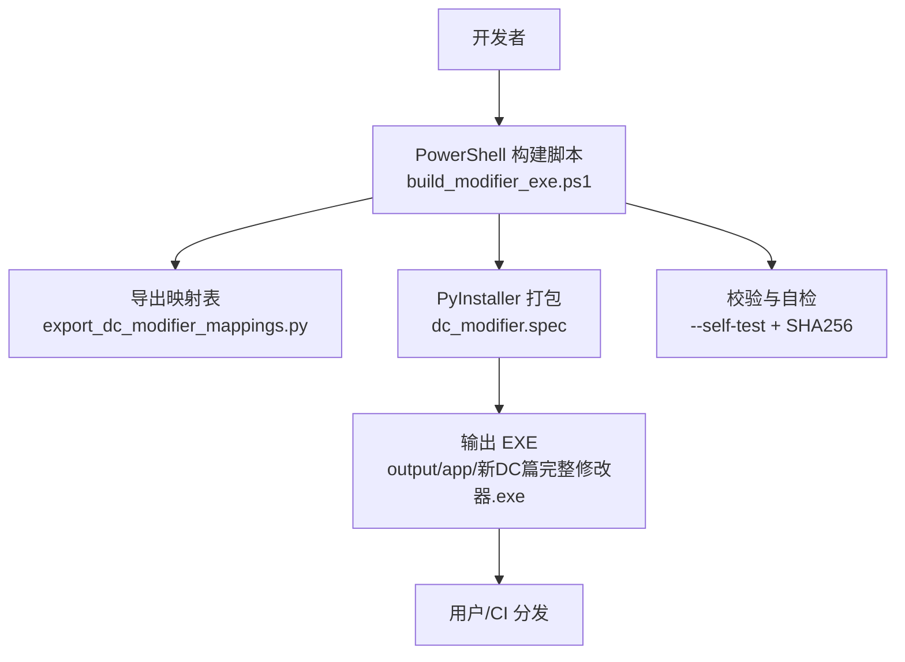
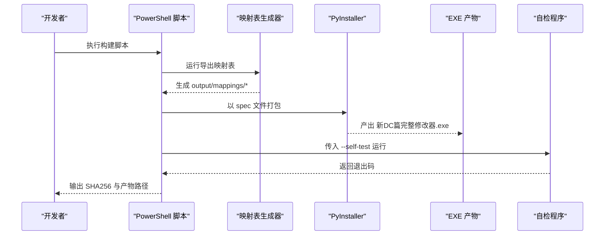
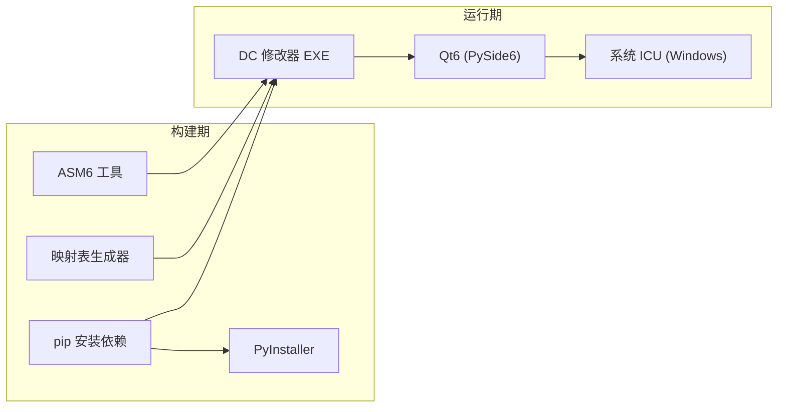

# 构建与部署

<cite>
**本文引用的文件**
- [tools/build_modifier_exe.ps1](file://tools/build_modifier_exe.ps1)
- [tools/dc_modifier.spec](file://tools/dc_modifier.spec)
- [pyproject.toml](file://pyproject.toml)
- [requirements-modifier.txt](file://requirements-modifier.txt)
- [requirements-dev.txt](file://requirements-dev.txt)
- [启动DC修改器.bat](file://启动DC修改器.bat)
- [tools/run_dc_modifier.py](file://tools/run_dc_modifier.py)
- [tools/export_dc_modifier_mappings.py](file://tools/export_dc_modifier_mappings.py)
- [AGENTS.md](file://AGENTS.md)
</cite>

## 目录
1. [简介](#简介)
2. [项目结构](#项目结构)
3. [核心组件](#核心组件)
4. [架构总览](#架构总览)
5. [详细组件分析](#详细组件分析)
6. [依赖分析](#依赖分析)
7. [性能考虑](#性能考虑)
8. [故障排查指南](#故障排查指南)
9. [结论](#结论)
10. [附录](#附录)

## 简介
本指南面向需要从零开始构建 DC 修改器可执行文件的开发者与维护者，覆盖开发环境构建、发布构建、脚本使用、持续集成建议、跨平台注意事项以及部署策略。目标是确保构建过程可重复、可靠，并支持团队协作。

## 项目结构
仓库采用“源码在 src、工具在 tools、产物在 output”的清晰分层：
- 源码入口与打包入口
  - 运行入口：tools/run_dc_modifier.py
  - 打包配置：tools/dc_modifier.spec（PyInstaller）
  - 构建脚本：tools/build_modifier_exe.ps1（PowerShell）
- 依赖与元数据
  - pyproject.toml（包名、版本、Python 版本要求、可选依赖）
  - requirements-modifier.txt / requirements-dev.txt（运行时与开发依赖）
- 辅助生成
  - tools/export_dc_modifier_mappings.py（从基准 ROM 和默认配置生成映射表）
- 快速启动
  - 启动DC修改器.bat（Windows 快捷启动，优先运行已构建 EXE，否则回退到源码运行）

图表来源
- [tools/build_modifier_exe.ps1:1-61](file://tools/build_modifier_exe.ps1#L1-L61)
- [tools/dc_modifier.spec:1-63](file://tools/dc_modifier.spec#L1-L63)
- [tools/export_dc_modifier_mappings.py:1-329](file://tools/export_dc_modifier_mappings.py#L1-L329)

章节来源
- [AGENTS.md:26-39](file://AGENTS.md#L26-L39)

## 核心组件
- 构建脚本（PowerShell）
  - 负责检查虚拟环境与必要工具、生成映射表、调用 PyInstaller、验证产物、计算哈希、复制映射表至输出目录。
- PyInstaller Spec 文件
  - 指定入口脚本、附加二进制（ASM6）、排除特定 ICU DLL、设置输出名称与 UPX 压缩等。
- 运行入口（Python）
  - 将 src 加入导入路径，调用 dc_modifier.app.run；支持 --self-test 模式用于构建后自检。
- 映射表生成器
  - 基于基准 ROM 与默认配置，生成码表、字模地址映射、ROM 名称与表地址映射等，供编辑器与文档使用。
- 依赖管理
  - pyproject.toml 定义包元数据与可选依赖；requirements 文件用于锁定运行时与开发依赖。

章节来源
- [tools/build_modifier_exe.ps1:1-61](file://tools/build_modifier_exe.ps1#L1-L61)
- [tools/dc_modifier.spec:1-63](file://tools/dc_modifier.spec#L1-L63)
- [tools/run_dc_modifier.py:1-30](file://tools/run_dc_modifier.py#L1-L30)
- [tools/export_dc_modifier_mappings.py:1-329](file://tools/export_dc_modifier_mappings.py#L1-L329)
- [pyproject.toml:1-31](file://pyproject.toml#L1-L31)
- [requirements-modifier.txt:1-3](file://requirements-modifier.txt#L1-L3)
- [requirements-dev.txt:1-5](file://requirements-dev.txt#L1-L5)

## 架构总览
下图展示了从源码到可执行文件的完整构建流程，包括前置准备、依赖解析、资源生成、打包与校验。

图表来源
- [tools/build_modifier_exe.ps1:1-61](file://tools/build_modifier_exe.ps1#L1-L61)
- [tools/dc_modifier.spec:1-63](file://tools/dc_modifier.spec#L1-L63)
- [tools/run_dc_modifier.py:1-30](file://tools/run_dc_modifier.py#L1-L30)
- [tools/export_dc_modifier_mappings.py:1-329](file://tools/export_dc_modifier_mappings.py#L1-L329)

## 详细组件分析

### 构建脚本（PowerShell）
职责与流程
- 环境检查：确认虚拟环境 Python、ASM6 工具、Spec 文件存在。
- 生成映射表：调用导出脚本，失败则中止。
- 打包：调用 PyInstaller，指定 distpath、workpath 与 spec。
- 产物校验：检查预期 EXE 是否存在，读取归档内容，排除不兼容的 ICU DLL。
- 自检：以 --self-test 启动 EXE，非零退出码视为失败。
- 签名与分发准备：计算 SHA256 并写入 .sha256.txt；复制映射表至输出目录。

关键要点
- 严格错误处理：任一环节失败立即抛出异常，便于 CI 中断。
- 可重复性：clean 模式与固定路径，避免历史缓存干扰。
- 质量门禁：包含归档内容与自检步骤，防止运行时缺失依赖或崩溃。

章节来源
- [tools/build_modifier_exe.ps1:1-61](file://tools/build_modifier_exe.ps1#L1-L61)

### PyInstaller Spec 定制
作用
- 指定入口脚本为 run_dc_modifier.py，并将 src 加入搜索路径。
- 嵌入 ASM6 二进制到指定子目录，供音乐导入等功能使用。
- 排除可能导致 Qt6Core 加载错误的 ICU DLL（icuuc.dll、icudt78.dll）。
- 设置输出名称、关闭控制台、启用 UPX 压缩、保留调试信息以便定位问题。

优化点
- 若需调试，可将 debug=True 临时开启，但发布应关闭。
- 如需签名，可在 EXE 节点添加 codesign_identity 与 entitlements_file（当前未启用）。

章节来源
- [tools/dc_modifier.spec:1-63](file://tools/dc_modifier.spec#L1-L63)

### 运行入口与自检
行为
- 将 src 目录加入 sys.path，确保模块可被正确导入。
- 调用 dc_modifier.app.run 启动应用。
- 支持 --self-test：若启动失败返回特定退出码，便于自动化检测。

用途
- 本地快速启动（通过批处理或命令行）。
- 构建后自检，验证 UI 初始化与基础功能可用。

章节来源
- [tools/run_dc_modifier.py:1-30](file://tools/run_dc_modifier.py#L1-L30)

### 映射表生成器
功能
- 从默认配置与基准 ROM 生成：
  - 码表与字模地址映射（.tbl/.csv）
  - 旧修改器配置名称索引（.json）
  - ROM 名称与表地址映射（.json），包含单位、武器、人物、地图、战斗音乐选择器等
- 输出 README 说明与源 ROM 哈希，保证可追溯性。

约束
- 依赖固定的基准 ROM 路径与默认配置目录。
- 所有输出均为 UTF-8，便于跨平台协作。

章节来源
- [tools/export_dc_modifier_mappings.py:1-329](file://tools/export_dc_modifier_mappings.py#L1-L329)

### 依赖管理与元数据
- pyproject.toml
  - 定义包名、版本、Python 版本要求、GUI 框架依赖（PySide6）。
  - 提供可选依赖 dev，包含 PyInstaller、报告生成等工具。
  - 暴露可执行脚本入口 dc-modifier。
- requirements 文件
  - requirements-modifier.txt：运行时与打包所需依赖。
  - requirements-dev.txt：在基础上扩展测试与文档工具依赖。

章节来源
- [pyproject.toml:1-31](file://pyproject.toml#L1-L31)
- [requirements-modifier.txt:1-3](file://requirements-modifier.txt#L1-L3)
- [requirements-dev.txt:1-5](file://requirements-dev.txt#L1-L5)

## 依赖分析
构建期与运行期的依赖关系如下：

图表来源
- [tools/dc_modifier.spec:1-63](file://tools/dc_modifier.spec#L1-L63)
- [pyproject.toml:1-31](file://pyproject.toml#L1-L31)
- [tools/build_modifier_exe.ps1:1-61](file://tools/build_modifier_exe.ps1#L1-L61)

章节来源
- [pyproject.toml:1-31](file://pyproject.toml#L1-L31)
- [tools/dc_modifier.spec:1-63](file://tools/dc_modifier.spec#L1-L63)
- [tools/build_modifier_exe.ps1:1-61](file://tools/build_modifier_exe.ps1#L1-L61)

## 性能考虑
- 构建速度
  - 使用 clean 模式减少缓存污染；必要时可复用 .venv 与 PyInstaller 缓存。
  - 仅当变更影响 GUI 或资源时才重新生成映射表，避免不必要的 I/O。
- 产物体积
  - 已启用 UPX 压缩；若需进一步瘦身，可评估剥离无用二进制与数据。
- 运行性能
  - 首次启动可能较慢（UI 初始化、字体加载）；后续启动通常较快。
  - 避免在 EXE 中携带冗余大文件，保持只必要的资源。

[本节为通用指导，无需具体文件引用]

## 故障排查指南
常见问题与解决思路
- 未找到虚拟环境 Python
  - 现象：构建脚本报错提示未找到虚拟环境。
  - 处理：在项目根目录创建并激活虚拟环境，再重试构建。
- 未找到 ASM6 工具
  - 现象：构建脚本提示缺少音乐导入所需的 ASM6。
  - 处理：确保 vendor 目录下存在对应工具路径。
- 未找到 PyInstaller 配置
  - 现象：构建脚本提示找不到 spec 文件。
  - 处理：确认 spec 文件位于 tools/ 目录且未被误删。
- 映射表生成失败
  - 现象：导出脚本返回非零退出码。
  - 处理：检查基准 ROM 路径与默认配置是否完整；必要时重新生成 ROM 后再试。
- PyInstaller 构建失败
  - 现象：打包阶段报错。
  - 处理：查看日志，确认依赖与 spec 配置；清理 workpath 后重试。
- 产物不包含预期文件
  - 现象：构建完成但未生成 EXE。
  - 处理：检查 spec 中的 name 与输出目录；确认无权限问题。
- EXE 自检失败
  - 现象：--self-test 返回非零退出码。
  - 处理：定位异常堆栈，修复 UI 初始化或依赖问题；必要时降低依赖版本对齐。
- Qt6Core 加载错误（PROC_NOT_FOUND）
  - 现象：运行时报找不到函数。
  - 处理：确认 spec 已排除不兼容 ICU DLL；确保系统 ICU 可用。

章节来源
- [tools/build_modifier_exe.ps1:1-61](file://tools/build_modifier_exe.ps1#L1-L61)
- [tools/dc_modifier.spec:1-63](file://tools/dc_modifier.spec#L1-L63)
- [tools/run_dc_modifier.py:1-30](file://tools/run_dc_modifier.py#L1-L30)

## 结论
本项目提供了清晰的构建与打包流程：通过 PowerShell 脚本统一编排依赖检查、映射表生成、PyInstaller 打包与产物校验；Spec 文件精确控制打包内容与兼容性；运行入口支持自检，便于自动化验证。遵循本指南可稳定复现构建结果，并为团队开发与持续集成奠定基础。

[本节为总结，无需具体文件引用]

## 附录

### 开发环境构建（本地）
- 准备环境
  - 安装 Python（>=3.10），在项目根目录创建虚拟环境。
  - 安装依赖：使用 requirements-modifier.txt 或 pyproject 的可选依赖。
- 运行与调试
  - 直接运行：启动DC修改器.bat 或 python tools/run_dc_modifier.py。
  - 调试：在 Spec 中临时开启 debug，或使用 IDE 断点调试入口脚本。
- 日志与诊断
  - 构建日志：关注 PowerShell 输出与 PyInstaller 日志。
  - 运行日志：根据应用内部日志机制收集；自检失败时记录退出码。

章节来源
- [启动DC修改器.bat:1-16](file://启动DC修改器.bat#L1-L16)
- [tools/run_dc_modifier.py:1-30](file://tools/run_dc_modifier.py#L1-L30)
- [AGENTS.md:26-39](file://AGENTS.md#L26-L39)

### 发布构建（打包、签名、分发、版本）
- 打包配置
  - 使用 build_modifier_exe.ps1 一键构建；产物位于 output/app。
  - Spec 已配置输出名称、UPX 压缩与必要二进制嵌入。
- 签名验证
  - 当前 Spec 未启用代码签名；可在 CI 中接入签名步骤（codesign_identity）。
  - 构建脚本会生成 SHA256 校验文件，便于发布前完整性校验。
- 分发准备
  - 将 EXE 与 output/mappings 目录一并打包分发。
  - 附带 .sha256.txt 以供下载方校验。
- 版本管理
  - 版本号由 pyproject.toml 维护；发布前更新版本并记录变更。

章节来源
- [tools/build_modifier_exe.ps1:1-61](file://tools/build_modifier_exe.ps1#L1-L61)
- [tools/dc_modifier.spec:1-63](file://tools/dc_modifier.spec#L1-L63)
- [pyproject.toml:1-31](file://pyproject.toml#L1-L31)

### 构建脚本使用
- PowerShell 脚本
  - 执行：在仓库根目录运行 tools/build_modifier_exe.ps1。
  - 参数：脚本内嵌路径与选项，无需额外参数。
- PyInstaller 配置
  - 入口：tools/dc_modifier.spec。
  - 自定义：按需调整 binaries、datas、EXE 节点选项。
- 映射表生成
  - 自动执行：构建脚本会先运行导出脚本。
  - 手动执行：python tools/export_dc_modifier_mappings.py。

章节来源
- [tools/build_modifier_exe.ps1:1-61](file://tools/build_modifier_exe.ps1#L1-L61)
- [tools/dc_modifier.spec:1-63](file://tools/dc_modifier.spec#L1-L63)
- [tools/export_dc_modifier_mappings.py:1-329](file://tools/export_dc_modifier_mappings.py#L1-L329)

### 持续集成（CI/CD）建议
- 流水线步骤
  - 安装 Python 与依赖（requirements）。
  - 运行单元测试：unittest discover。
  - 构建 EXE：执行 PowerShell 脚本。
  - 上传工件：EXE、SHA256、映射表。
- 质量检查
  - 构建失败即中断；自检失败视为质量门禁未通过。
  - 可引入静态检查与覆盖率统计（可选）。
- 触发条件
  - 推送主分支或合并请求时触发；发布标签时触发签名与归档。

[本节为通用实践，无需具体文件引用]

### 跨平台构建注意事项
- Windows
  - 推荐平台：脚本与依赖针对 Windows 设计。
  - 注意：Qt6 使用系统 ICU，已通过 Spec 排除冲突 DLL。
- Linux/macOS
  - 当前 Spec 与脚本面向 Windows；跨平台需调整路径与二进制嵌入。
  - 建议在目标平台单独构建并验证。

章节来源
- [tools/dc_modifier.spec:1-63](file://tools/dc_modifier.spec#L1-L63)
- [tools/build_modifier_exe.ps1:1-61](file://tools/build_modifier_exe.ps1#L1-L61)

### 部署指南（安装包、分发、更新）
- 安装包制作
  - 可使用 Inno Setup、NSIS 等工具将 EXE 与映射表打包为安装程序。
  - 在安装程序中放置 .sha256.txt 并提供校验提示。
- 分发策略
  - 通过网站或私有仓库分发；提供版本与变更说明。
  - 对重要版本进行签名与哈希校验。
- 更新机制
  - 简单方案：提供新版本下载链接，用户手动替换。
  - 进阶方案：在应用中实现自更新检查与下载（需网络与安全策略）。

[本节为通用实践，无需具体文件引用]