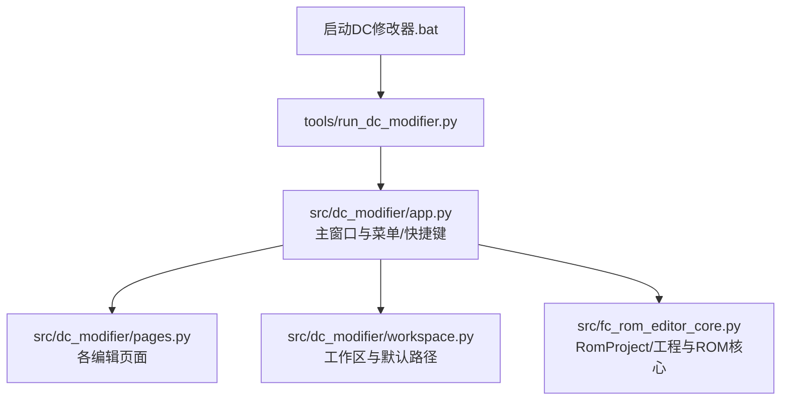
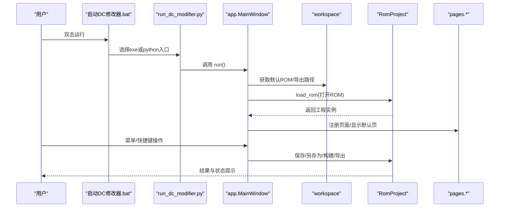
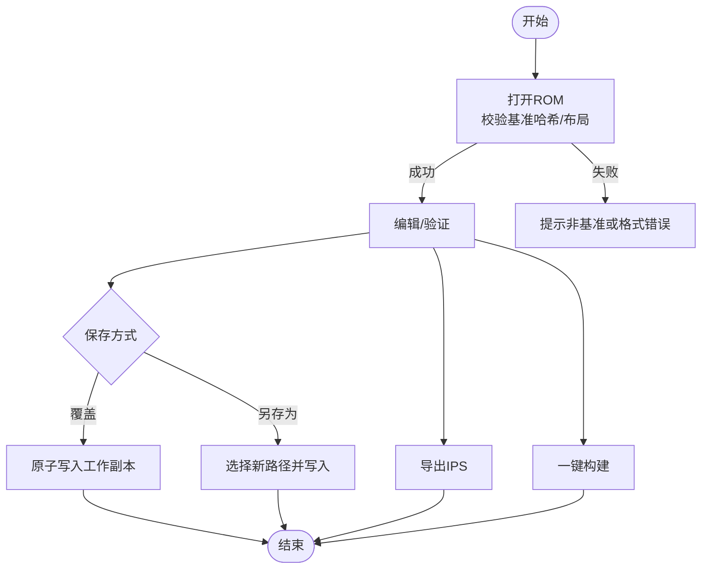
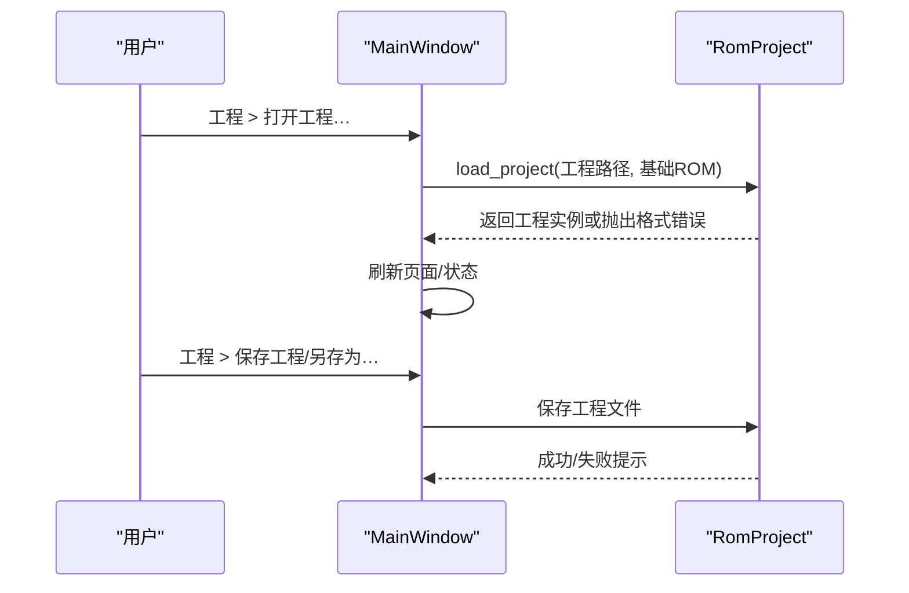
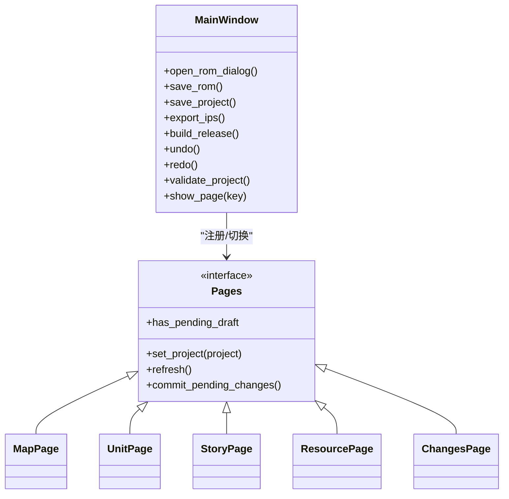
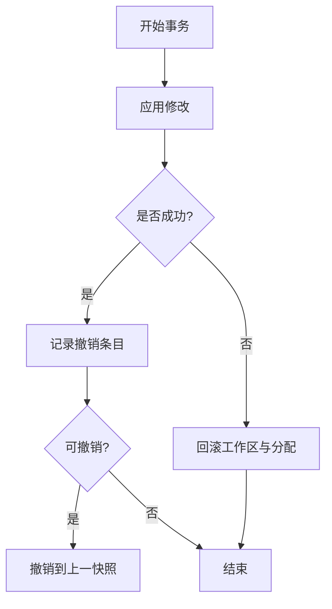
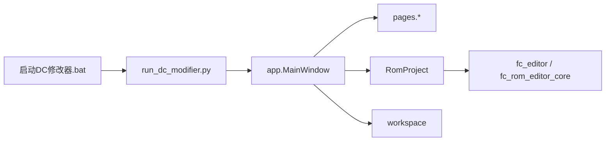

# 基本操作

<cite>
**本文引用的文件**
- [启动DC修改器.bat](file://启动DC修改器.bat)
- [tools/run_dc_modifier.py](file://tools/run_dc_modifier.py)
- [src/dc_modifier/app.py](file://src/dc_modifier/app.py)
- [src/dc_modifier/workspace.py](file://src/dc_modifier/workspace.py)
- [src/dc_modifier/pages.py](file://src/dc_modifier/pages.py)
- [src/fc_rom_editor_core.py](file://src/fc_rom_editor_core.py)
</cite>

## 目录
1. [简介](#简介)
2. [项目结构](#项目结构)
3. [核心组件](#核心组件)
4. [架构总览](#架构总览)
5. [详细组件分析](#详细组件分析)
6. [依赖关系分析](#依赖关系分析)
7. [性能与稳定性建议](#性能与稳定性建议)
8. [故障排查指南](#故障排查指南)
9. [结论](#结论)
10. [附录：快捷键与高效技巧](#附录快捷键与高效技巧)

## 简介
本章节面向首次或日常使用“新DC篇完整修改器”的用户，系统讲解如何打开/保存/导出ROM、新建/加载/保存工程、在界面中导航（页面切换、菜单与工具栏）、管理工作区与输出路径、以及备份与撤销重做等实用功能。文档同时给出常见错误提示与数据校验说明，帮助你安全高效地完成日常编辑任务。

## 项目结构
- 启动入口
  - Windows批处理脚本负责检测虚拟环境与可执行产物；若未构建则回退到源码运行模式。
  - Python启动脚本将源码根加入路径并调用应用入口函数。
- 应用主窗口
  - 提供菜单栏、状态栏、工作区（多页签）与扩展对话框。
  - 内置“战场地图”作为默认主页，其他编辑以独立对话框或扩展页形式打开。
- 工作区与路径
  - 自动定位工作区根目录与默认ROM路径；默认导出目录为 output/exports。
  - 禁止向 references/ 目录输出，避免覆盖参考基准。
- 工程与ROM核心
  - 工程对象封装了ROM镜像、原始数据与工作副本、资源分配与编解码器。
  - 支持事务化编辑、撤销/重做、完整性校验、IPS生成与应用。

**图表来源**
- [启动DC修改器.bat:1-16](file://启动DC修改器.bat#L1-L16)
- [tools/run_dc_modifier.py:1-30](file://tools/run_dc_modifier.py#L1-L30)
- [src/dc_modifier/app.py:276-488](file://src/dc_modifier/app.py#L276-L488)
- [src/dc_modifier/workspace.py:7-43](file://src/dc_modifier/workspace.py#L7-L43)
- [src/fc_rom_editor_core.py:463-785](file://src/fc_rom_editor_core.py#L463-L785)

**章节来源**
- [启动DC修改器.bat:1-16](file://启动DC修改器.bat#L1-L16)
- [tools/run_dc_modifier.py:1-30](file://tools/run_dc_modifier.py#L1-L30)
- [src/dc_modifier/app.py:276-488](file://src/dc_modifier/app.py#L276-L488)
- [src/dc_modifier/workspace.py:7-43](file://src/dc_modifier/workspace.py#L7-L43)
- [src/fc_rom_editor_core.py:463-785](file://src/fc_rom_editor_core.py#L463-L785)

## 核心组件
- 主窗口 MainWindow
  - 管理工程实例、ROM输出路径、未保存变更检测、页面注册与导航、菜单与动作绑定、状态栏信息更新。
  - 通过“工程”菜单完成工程与ROM的打开/保存/另存为/构建/导出等操作。
- 工作区 workspace
  - 计算工作区根目录、默认ROM路径、默认导出路径，并提供只读保护（references/）。
- 工程 RomProject
  - 封装ROM读取、工作副本、资源分配、编解码器、事务与撤销重做、完整性校验、IPS生成与应用。
- 页面 pages
  - 提供统一的 ProjectPage 基类与各具体编辑页（机体、人物、武器、剧情文本、事件、劝降条件、音乐、容量规划、变更与验证等）。
  - 支持搜索、复制/粘贴记录、还原、导出等通用交互。

**章节来源**
- [src/dc_modifier/app.py:276-488](file://src/dc_modifier/app.py#L276-L488)
- [src/dc_modifier/workspace.py:7-43](file://src/dc_modifier/workspace.py#L7-L43)
- [src/fc_rom_editor_core.py:463-785](file://src/fc_rom_editor_core.py#L463-L785)
- [src/dc_modifier/pages.py:103-152](file://src/dc_modifier/pages.py#L103-L152)

## 架构总览
下图展示了从启动到打开ROM、进入工程、进行编辑与保存/导出的整体流程。

**图表来源**
- [启动DC修改器.bat:1-16](file://启动DC修改器.bat#L1-L16)
- [tools/run_dc_modifier.py:13-25](file://tools/run_dc_modifier.py#L13-L25)
- [src/dc_modifier/app.py:276-488](file://src/dc_modifier/app.py#L276-L488)
- [src/dc_modifier/workspace.py:7-43](file://src/dc_modifier/workspace.py#L7-L43)
- [src/fc_rom_editor_core.py:638-674](file://src/fc_rom_editor_core.py#L638-L674)

## 详细组件分析

### ROM文件管理（打开、保存、导出）
- 打开ROM
  - 通过“文件 > 打开”或快捷键 Ctrl+O 打开ROM。
  - 程序会校验ROM是否为受支持的基准版本；若非基准哈希但布局兼容，会提示需先进行容量规划。
- 保存ROM
  - “文件 > 保存”直接覆盖当前工作副本；“工程 > ROM另存为…”用于另存为新文件。
  - 所有写盘均通过原子写入实现，降低损坏风险。
- 导出IPS
  - “工程 > 导出IPS…”可将差异生成标准IPS补丁，便于分发与回滚。
- 一键构建
  - “工程 > 一键构建…”会在保证音频引擎、固定银行与CHR区域不被覆盖的前提下，输出最终ROM与相关制品。

**图表来源**
- [src/dc_modifier/app.py:399-428](file://src/dc_modifier/app.py#L399-L428)
- [src/dc_modifier/app.py:794-800](file://src/dc_modifier/app.py#L794-L800)
- [src/fc_rom_editor_core.py:436-461](file://src/fc_rom_editor_core.py#L436-L461)
- [src/fc_rom_editor_core.py:386-433](file://src/fc_rom_editor_core.py#L386-L433)

**章节来源**
- [src/dc_modifier/app.py:399-428](file://src/dc_modifier/app.py#L399-L428)
- [src/dc_modifier/app.py:794-800](file://src/dc_modifier/app.py#L794-L800)
- [src/fc_rom_editor_core.py:436-461](file://src/fc_rom_editor_core.py#L436-L461)
- [src/fc_rom_editor_core.py:386-433](file://src/fc_rom_editor_core.py#L386-L433)

### 工程文件操作（新建、加载、保存工程）
- 新建工程
  - 通常先打开ROM，再进行容量规划（扩展功能 > 扩展容量规划），随后即可开始编辑。
- 加载工程
  - “工程 > 打开工程…”加载工程文件，会自动恢复资源分配与已应用的修改。
  - 加载后会进行完整性检查，若存在错误会阻止继续。
- 保存工程
  - “工程 > 保存工程”覆盖当前工程；“工程 > 工程另存为…”用于创建新版本。
  - 工程保存包含资源分配与ROM材料化后的快照，便于后续复用。

**图表来源**
- [src/fc_rom_editor_core.py:644-674](file://src/fc_rom_editor_core.py#L644-L674)
- [src/dc_modifier/app.py:416-421](file://src/dc_modifier/app.py#L416-L421)

**章节来源**
- [src/fc_rom_editor_core.py:644-674](file://src/fc_rom_editor_core.py#L644-L674)
- [src/dc_modifier/app.py:416-421](file://src/dc_modifier/app.py#L416-L421)

### 界面导航（页面切换、菜单操作、工具栏使用）
- 页面切换
  - 左侧导航列表与顶部工作区共同控制页面显示；也可通过“扩展功能”菜单快速跳转至特定页面。
  - 地图页为默认首页；其他编辑多以独立对话框形式打开，确保事务隔离。
- 菜单操作
  - 文件：打开/保存/退出。
  - 数据：数据库、ROM数据读取、字体库、地图动画、文字转换、剧情事件、导出机体/头像、属性计算器、存档修改器、其他设置。
  - 扩展功能：战斗背景音乐、机体导入与图像、容量规划、工程概览、变更与验证。
  - 工程：打开/保存工程、ROM另存为、导出IPS、一键构建、撤销/重做、完整检查。
  - 帮助：关于与安全说明。
- 工具栏/状态栏
  - 状态栏显示坐标、模块名称、字节修改数等关键信息；重要消息会常驻显示一段时间。

**图表来源**
- [src/dc_modifier/app.py:342-385](file://src/dc_modifier/app.py#L342-L385)
- [src/dc_modifier/app.py:443-488](file://src/dc_modifier/app.py#L443-L488)
- [src/dc_modifier/pages.py:103-152](file://src/dc_modifier/pages.py#L103-L152)

**章节来源**
- [src/dc_modifier/app.py:342-385](file://src/dc_modifier/app.py#L342-L385)
- [src/dc_modifier/app.py:443-488](file://src/dc_modifier/app.py#L443-L488)
- [src/dc_modifier/pages.py:103-152](file://src/dc_modifier/pages.py#L103-L152)

### 工作区管理与路径设置
- 工作区根目录
  - 自动根据运行环境（打包/源码）推断，优先查找 output/rom 下的默认ROM。
- 默认ROM
  - 优先使用 expanded ROM（output/rom/DC_kuorong_464K.nes），不存在则回退到 legacy ROM（references/rom/baselines/DC_kuorong.nes）。
- 默认导出路径
  - 统一位于 output/exports，文件名不得包含路径前缀。
- 只读保护
  - references/ 目录被标记为只读参考目录，任何输出目标都会拒绝写入该目录及其子目录。

**章节来源**
- [src/dc_modifier/workspace.py:7-43](file://src/dc_modifier/workspace.py#L7-L43)

### 备份机制与撤销/重做
- 事务化编辑
  - 每次提交表单或批量操作都在事务中进行；异常时自动回滚工作区与资源分配。
- 撤销/重做
  - 基于差异补丁与分配快照，支持跨页面的撤销/重做；可通过“工程 > 撤销/重做”或快捷键触发。
- 原子写入
  - 所有落盘采用临时文件+替换的方式，避免部分写入导致的文件损坏。

**图表来源**
- [src/fc_rom_editor_core.py:676-785](file://src/fc_rom_editor_core.py#L676-L785)
- [src/fc_rom_editor_core.py:436-461](file://src/fc_rom_editor_core.py#L436-L461)

**章节来源**
- [src/fc_rom_editor_core.py:676-785](file://src/fc_rom_editor_core.py#L676-L785)
- [src/fc_rom_editor_core.py:436-461](file://src/fc_rom_editor_core.py#L436-L461)

### 数据验证与错误处理
- 完整性检查
  - 打开工程时会进行完整性校验，发现错误会阻止继续并提示具体问题。
- 输入校验
  - ID范围、十六进制/十进制解析、共享名称修改确认等均有明确提示。
- 常见错误
  - 非基准ROM：提示需先进行容量规划。
  - 工程格式错误：提示缺失容量规划表或字段不合法。
  - 输出路径非法：拒绝写入 references/ 或只读参考目录。

**章节来源**
- [src/fc_rom_editor_core.py:644-674](file://src/fc_rom_editor_core.py#L644-L674)
- [src/dc_modifier/pages.py:66-100](file://src/dc_modifier/pages.py#L66-L100)
- [src/dc_modifier/workspace.py:37-43](file://src/dc_modifier/workspace.py#L37-L43)

## 依赖关系分析
- 启动链
  - 批处理 → Python入口 → 应用入口 → 主窗口 → 页面/工程核心。
- 模块耦合
  - 主窗口依赖页面与工程核心；页面依赖工程核心提供的编解码器与模型；工作区提供路径常量与保护规则。
- 外部依赖
  - PySide6用于UI；fc_editor与fc_rom_editor_core提供ROM解析、资源分配、校验与IPS能力。

**图表来源**
- [启动DC修改器.bat:1-16](file://启动DC修改器.bat#L1-L16)
- [tools/run_dc_modifier.py:13-25](file://tools/run_dc_modifier.py#L13-L25)
- [src/dc_modifier/app.py:276-488](file://src/dc_modifier/app.py#L276-L488)
- [src/fc_rom_editor_core.py:463-785](file://src/fc_rom_editor_core.py#L463-L785)

**章节来源**
- [启动DC修改器.bat:1-16](file://启动DC修改器.bat#L1-L16)
- [tools/run_dc_modifier.py:13-25](file://tools/run_dc_modifier.py#L13-L25)
- [src/dc_modifier/app.py:276-488](file://src/dc_modifier/app.py#L276-L488)
- [src/fc_rom_editor_core.py:463-785](file://src/fc_rom_editor_core.py#L463-L785)

## 性能与稳定性建议
- 大工程编辑
  - 尽量分批提交表单，减少单次事务规模；利用“完整检查”提前发现潜在问题。
- 频繁切换页面
  - 页面会缓存草稿状态；切换前会尝试应用待提交的更改，避免误改。
- 输出路径
  - 始终使用“另存为”与“导出”功能，避免覆盖基准ROM或参考目录。
- 构建与导出
  - 构建前建议先运行“完整检查”，确保资源分配与引用一致。

[本节为通用建议，无需代码来源]

## 故障排查指南
- 无法打开ROM
  - 检查是否为受支持的基准版本；如布局兼容但非基准哈希，请先进行容量规划。
- 工程加载失败
  - 查看完整性检查错误提示；常见原因为缺少容量规划表或字段不合法。
- 输出失败
  - 确认目标路径不在 references/ 下；使用 writable_output_path 生成的路径。
- 撤销/重做无效
  - 确认当前处于事务边界内；某些操作可能不会记录撤销条目（如无实际变更）。

**章节来源**
- [src/dc_modifier/app.py:794-800](file://src/dc_modifier/app.py#L794-L800)
- [src/fc_rom_editor_core.py:644-674](file://src/fc_rom_editor_core.py#L644-L674)
- [src/dc_modifier/workspace.py:37-43](file://src/dc_modifier/workspace.py#L37-L43)

## 结论
通过“打开ROM → 容量规划 → 编辑与验证 → 保存工程/构建/导出”的标准流程，配合事务化编辑、撤销/重做与完整性检查，你可以安全高效地完成FC游戏ROM的日常修改。遵循只读保护与原子写入规则，能最大程度避免数据丢失与文件损坏。

[本节为总结性内容，无需代码来源]

## 附录：快捷键与高效技巧
- 常用快捷键
  - 打开ROM：Ctrl+O
  - 保存ROM：Ctrl+S
  - 打开工程：Ctrl+Shift+O
  - 保存工程：Ctrl+Shift+S
  - ROM另存为：Ctrl+Alt+S
  - 导出IPS：无默认快捷键（通过菜单）
  - 一键构建：Ctrl+B
  - 撤销：Ctrl+Alt+Z
  - 重做：Ctrl+Alt+Y
  - 完整检查：F7
  - 数据库：Ctrl+D
  - 字体库：Ctrl+W
  - 地图动画：Ctrl+M
  - 文字转换：Ctrl+Z（注意与撤销冲突，使用工程级撤销快捷键）
  - 剧情事件：Ctrl+J
  - 导出机体：Ctrl+F
  - 导出头像：Ctrl+L
  - 其他设置：Ctrl+T
- 高效技巧
  - 使用“工程概览”快速跳转到常用编辑页。
  - 在记录列表中用搜索框按名称或ID过滤，结合上一条/下一条按钮快速浏览。
  - 对共享名称/属性的修改，留意弹窗确认，避免影响多个ID。
  - 导出与构建前务必运行“完整检查”。

**章节来源**
- [src/dc_modifier/app.py:399-428](file://src/dc_modifier/app.py#L399-L428)
- [src/dc_modifier/pages.py:243-279](file://src/dc_modifier/pages.py#L243-L279)