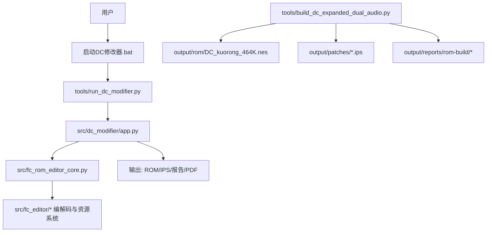
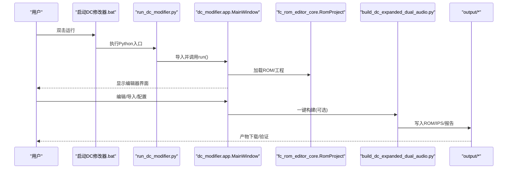
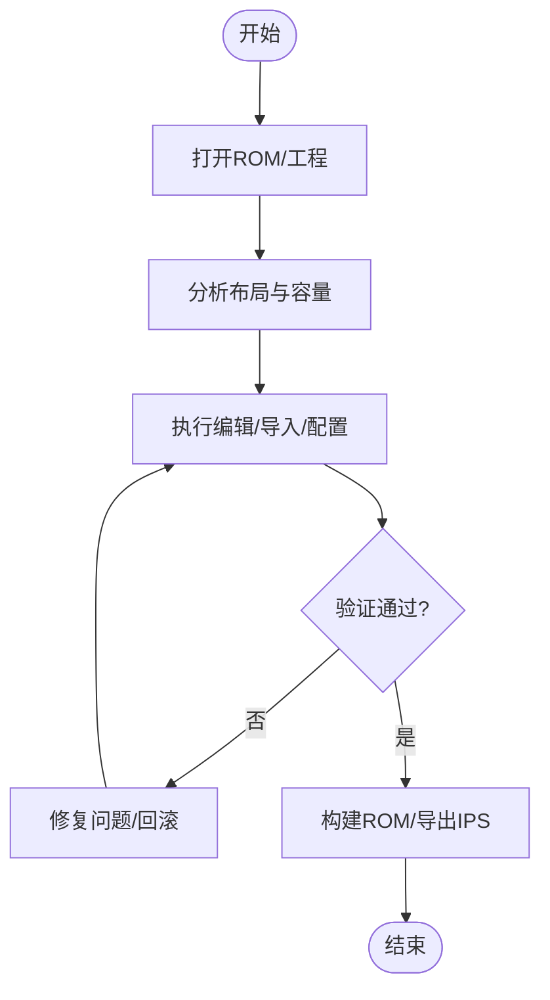
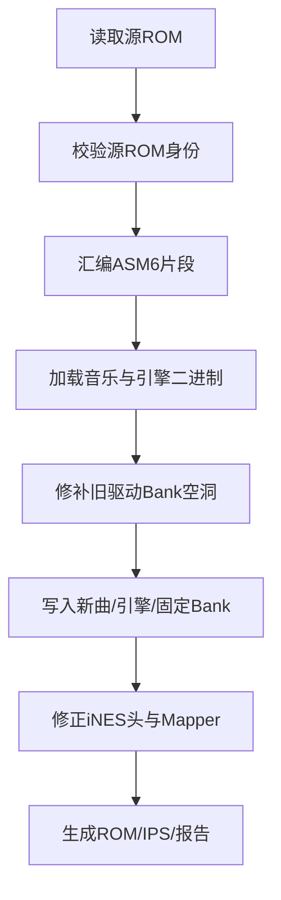
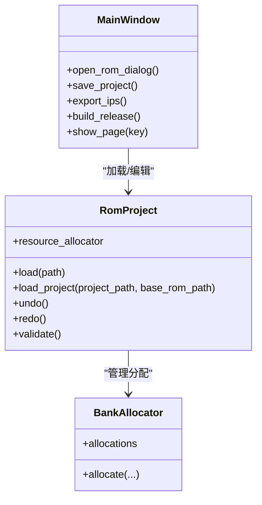
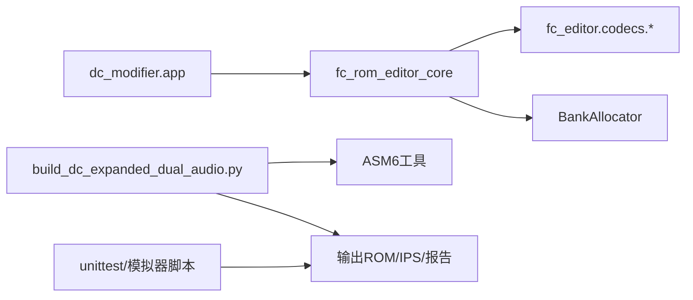

# 工作流程指南

<cite>
**本文引用的文件**
- [启动DC修改器.bat](file://启动DC修改器.bat)
- [pyproject.toml](file://pyproject.toml)
- [requirements-modifier.txt](file://requirements-modifier.txt)
- [AGENTS.md](file://AGENTS.md)
- [交接文档.md](file://docs/交接文档.md)
- [tools/run_dc_modifier.py](file://tools/run_dc_modifier.py)
- [tools/build_dc_expanded_dual_audio.py](file://tools/build_dc_expanded_dual_audio.py)
- [src/dc_modifier/app.py](file://src/dc_modifier/app.py)
- [src/fc_rom_editor_core.py](file://src/fc_rom_editor_core.py)
</cite>

## 目录
1. [简介](#简介)
2. [项目结构](#项目结构)
3. [核心组件](#核心组件)
4. [架构总览](#架构总览)
5. [详细组件分析](#详细组件分析)
6. [依赖关系分析](#依赖关系分析)
7. [性能与容量优化](#性能与容量优化)
8. [故障排除指南](#故障排除指南)
9. [结论](#结论)
10. [附录：标准化操作流程](#附录标准化操作流程)

## 简介
本指南面向使用“新DC篇完整修改器”进行FC《第二次机器人大战》扩容MMC3版本ROM编辑的工程师与内容创作者，覆盖从打开ROM、分析布局、执行编辑、验证构建到发布的全流程；同时给出内容创作工作流（素材准备→导入→配置→测试）与团队协作流程（版本控制→合并→发布）的最佳实践。文档基于仓库中的构建脚本、修改器入口、工程模型与交接文档整理而成，确保每一步都有可追溯的实现依据。

## 项目结构
仓库采用“源码-工具-测试-产物-文档-参考”的分层组织方式：
- src：产品源码，包含GUI修改器、ROM编解码、工程编排与ASM6源码
- tools：构建、打包、验证与辅助脚本
- tests：自动化测试与模拟器冒烟脚本
- output：构建产物、报告、IPS、PDF等
- docs：使用说明、设计文档、研究笔记与截图
- references：只读源ROM、基线、音频与历史证据

图表来源
- [启动DC修改器.bat:1-16](file://启动DC修改器.bat#L1-L16)
- [tools/run_dc_modifier.py:1-30](file://tools/run_dc_modifier.py#L1-L30)
- [src/dc_modifier/app.py:1-120](file://src/dc_modifier/app.py#L1-L120)
- [src/fc_rom_editor_core.py:463-625](file://src/fc_rom_editor_core.py#L463-L625)
- [tools/build_dc_expanded_dual_audio.py:1-725](file://tools/build_dc_expanded_dual_audio.py#L1-L725)

章节来源
- [AGENTS.md:9-24](file://AGENTS.md#L9-L24)
- [交接文档.md:185-231](file://docs/交接文档.md#L185-L231)

## 核心组件
- 修改器应用入口与主窗口：负责菜单、页面导航、工程加载、导出与一键构建
- ROM工程模型：封装ROM镜像、扩展计划、编解码器、撤销重做、事务与校验
- 构建脚本：将源ROM扩至1MiB PRG，注入双引擎与三首新曲，生成ROM/IPS/报告
- 启动脚本：检测虚拟环境与可执行，或运行源码版修改器

关键职责与交互
- 修改器通过RomProject加载ROM并维护working内存，所有编辑在事务中提交
- 构建脚本严格校验源ROM身份、Bank布局与RAM占用，输出可复现产物
- 启动脚本统一入口，屏蔽环境差异

章节来源
- [src/dc_modifier/app.py:276-488](file://src/dc_modifier/app.py#L276-L488)
- [src/fc_rom_editor_core.py:463-785](file://src/fc_rom_editor_core.py#L463-L785)
- [tools/build_dc_expanded_dual_audio.py:339-467](file://tools/build_dc_expanded_dual_audio.py#L339-L467)
- [tools/run_dc_modifier.py:13-29](file://tools/run_dc_modifier.py#L13-L29)

## 架构总览
下图展示从启动到构建产物的端到端调用链与数据流向。

图表来源
- [启动DC修改器.bat:1-16](file://启动DC修改器.bat#L1-L16)
- [tools/run_dc_modifier.py:13-29](file://tools/run_dc_modifier.py#L13-L29)
- [src/dc_modifier/app.py:399-488](file://src/dc_modifier/app.py#L399-L488)
- [src/fc_rom_editor_core.py:638-674](file://src/fc_rom_editor_core.py#L638-L674)
- [tools/build_dc_expanded_dual_audio.py:681-725](file://tools/build_dc_expanded_dual_audio.py#L681-L725)

## 详细组件分析

### ROM编辑标准流程（打开→分析→编辑→验证→构建）
- 打开
  - 通过启动脚本进入修改器，自动尝试载入默认ROM；也可手动打开工程或ROM
  - 工程加载时校验ROM布局与基准哈希，防止误用非基准ROM
- 分析
  - 使用“工程概览”“容量规划”“变更与验证”查看当前分配、未用空间与潜在冲突
  - 借助“数据库”“剧情事件”“战场地图”等页面定位目标数据
- 编辑
  - 所有修改在事务中进行，支持撤销/重做；重要操作建议分组命名
  - 导入素材（如机体包、头像、音乐）后需检查指针与Bank归属
- 验证
  - 使用“完整检查”进行静态校验；必要时运行单元测试与模拟器冒烟
  - 对涉及音频/地图/剧情的改动，进行场景回放与截图对比
- 构建
  - 一键构建生成ROM/IPS/报告；若仅做小改，可导出IPS供分发
  - 构建前确认已保存工程与资源分配，避免遗漏

章节来源
- [src/dc_modifier/app.py:399-488](file://src/dc_modifier/app.py#L399-L488)
- [src/fc_rom_editor_core.py:638-785](file://src/fc_rom_editor_core.py#L638-L785)
- [AGENTS.md:26-39](file://AGENTS.md#L26-L39)

### 内容创作工作流（素材准备→导入→配置→测试）
- 素材准备
  - 音频：遵循FamiStudio规范，注意命令集与Bank边界
  - 图像：按角色/机体规格导出位图，命名规范一致
  - 文本：保持编码与表项对齐，避免越界
- 导入
  - 使用对应页面或对话框导入；导入后检查指针、Bank与容量
  - 对于跨区资源，优先使用“容量规划”自动分配或显式绑定
- 配置
  - 为战斗音乐、剧情事件、劝降条件等设置正确命令或选择器
  - 注意保留现有绑定，增量修改并记录变更
- 测试
  - 在模拟器中播放曲目、触发事件、切换地图，观察画面与声音
  - 使用Mesen日志与截图比对，确保帧级一致性

章节来源
- [tools/build_dc_expanded_dual_audio.py:63-99](file://tools/build_dc_expanded_dual_audio.py#L63-L99)
- [交接文档.md:105-124](file://docs/交接文档.md#L105-L124)
- [src/dc_modifier/app.py:654-729](file://src/dc_modifier/app.py#L654-L729)

### 团队协作流程（版本控制→合并→发布）
- 版本控制
  - 每次改动附带影响范围说明（Bank/指针/大小/哈希）
  - 新增功能同步更新使用说明与截图
- 合并
  - 本地先运行构建与全量测试，再提交PR
  - 评审关注：ROM布局安全、RAM不重叠、模拟器兼容性
- 发布
  - 产出推荐ROM、IPS、容量报告、构建记录与验证记录
  - 对外优先分发IPS与报告，避免直接传播版权ROM

章节来源
- [AGENTS.md:53-55](file://AGENTS.md#L53-L55)
- [交接文档.md:235-259](file://docs/交接文档.md#L235-L259)

### 构建与产物管理
- 构建输入
  - 只读源ROM位于references/rom/source/新DC.nes，禁止原地修改
  - 构建器会校验源ROM大小、iNES头与SHA-256
- 构建过程
  - 编译ASM6片段，组装三首新曲与双引擎Bank
  - 在旧驱动Bank的空洞中插入调度跳板与同帧交接代码
  - 复制固定Bank，调整iNES头PRG容量与Mapper信息
- 构建输出
  - 推荐ROM：output/rom/DC_kuorong_464K.nes
  - IPS：output/patches/DC_FamiStudio_增容双引擎_464K_测试.ips
  - 报告：output/reports/rom-build/容量报告、构建记录、验证记录
  - 中间产物：output/build/asm/*.bin/*.lst

图表来源
- [tools/build_dc_expanded_dual_audio.py:339-467](file://tools/build_dc_expanded_dual_audio.py#L339-L467)
- [tools/build_dc_expanded_dual_audio.py:489-678](file://tools/build_dc_expanded_dual_audio.py#L489-L678)
- [tools/build_dc_expanded_dual_audio.py:681-725](file://tools/build_dc_expanded_dual_audio.py#L681-L725)

章节来源
- [交接文档.md:61-88](file://docs/交接文档.md#L61-L88)
- [交接文档.md:235-259](file://docs/交接文档.md#L235-L259)

### GUI与工程模型交互
- 主窗口提供文件、数据、扩展功能、工程与帮助菜单
- 各页面通过ProjectPage接口与RomProject交互，提交变更并刷新视图
- 资源分配由BankAllocator统一管理，避免越界与冲突
- 导出功能支持机体包、头像位图等，路径强制落盘到可写输出目录

图表来源
- [src/dc_modifier/app.py:276-488](file://src/dc_modifier/app.py#L276-L488)
- [src/fc_rom_editor_core.py:463-625](file://src/fc_rom_editor_core.py#L463-L625)

章节来源
- [src/dc_modifier/app.py:399-488](file://src/dc_modifier/app.py#L399-L488)
- [src/fc_rom_editor_core.py:638-785](file://src/fc_rom_editor_core.py#L638-L785)

## 依赖关系分析
- 运行时依赖
  - PySide6用于GUI
  - ASM6用于汇编新曲与引擎片段
  - Mesen用于运行时验证（FCEUX不兼容本扩容版）
- 模块耦合
  - 修改器依赖工程模型与编解码器，解耦良好
  - 构建脚本独立于GUI，可离线执行
- 外部集成点
  - 模拟器状态与Lua脚本用于冒烟测试
  - 产物清单与哈希用于交付完整性校验

图表来源
- [pyproject.toml:5-23](file://pyproject.toml#L5-L23)
- [requirements-modifier.txt:1-3](file://requirements-modifier.txt#L1-L3)
- [tools/build_dc_expanded_dual_audio.py:39-46](file://tools/build_dc_expanded_dual_audio.py#L39-L46)
- [交接文档.md:178-183](file://docs/交接文档.md#L178-L183)

章节来源
- [pyproject.toml:5-23](file://pyproject.toml#L5-L23)
- [requirements-modifier.txt:1-3](file://requirements-modifier.txt#L1-L3)
- [交接文档.md:178-183](file://docs/交接文档.md#L178-L183)

## 性能与容量优化
- 容量规划
  - 优先使用托管扩展区（Bank $40-$60、$65-$7D），避免侵入受保护区域
  - 利用“容量规划”页面查看剩余空间与碎片，尽量连续分配
- 音频优化
  - 新曲与SFX共享同一引擎Bank，减少重复代码
  - 音效迁移后逐场景试听，必要时裁剪冗余段落
- 运行时性能
  - 两套引擎不会在同一帧并发更新APU；切回旧驱动在同一NMI内复位并重放
  - 使用Mesen日志核对APU写入次数与引擎更新频率，排查异常热点

章节来源
- [交接文档.md:88-103](file://docs/交接文档.md#L88-L103)
- [交接文档.md:105-124](file://docs/交接文档.md#L105-L124)
- [tools/build_dc_expanded_dual_audio.py:184-312](file://tools/build_dc_expanded_dual_audio.py#L184-L312)

## 故障排除指南
- 启动失败
  - 检查是否已创建虚拟环境并安装依赖；或使用已打包EXE
  - 源码版错误会提示缺失依赖，按提示安装requirements-modifier.txt
- 构建失败
  - 源ROM不匹配会被拒绝；请确认使用正确的只读源ROM
  - ASM6汇编失败时查看对应.lst与错误输出，修正地址或符号
- 运行时异常
  - FCEUX 2.6.6不兼容本扩容版，请使用Mesen 0.9.9
  - 若出现画面损坏或音频异常，检查Bank映射与固定Bank副本是否正确
- 数据不一致
  - 使用“完整检查”与单元测试快速定位问题
  - 对比源ROM与派生ROM的截图与日志，定位帧级差异

章节来源
- [启动DC修改器.bat:1-16](file://启动DC修改器.bat#L1-L16)
- [tools/run_dc_modifier.py:13-29](file://tools/run_dc_modifier.py#L13-L29)
- [tools/build_dc_expanded_dual_audio.py:339-365](file://tools/build_dc_expanded_dual_audio.py#L339-L365)
- [交接文档.md:178-183](file://docs/交接文档.md#L178-L183)

## 结论
本指南将修改器使用、构建流程与团队协作方法整合为一套可操作的标准化流程。通过严格的源ROM校验、安全的Bank与RAM布局约束、完善的报告与验证体系，确保编辑任务高效且可追溯。建议在每次重大变更前备份工程与产物，并在团队内同步变更说明与验证结果。

## 附录：标准化操作流程

### 一、ROM编辑标准流程
- 打开
  - 双击“启动DC修改器.bat”，或运行源码入口
  - 打开工程或ROM，确认基准哈希与布局
- 分析
  - 使用“工程概览”“容量规划”“变更与验证”了解现状
- 编辑
  - 在事务中执行修改，命名清晰，便于撤销/重做
- 验证
  - 运行“完整检查”与单元测试；必要时进行模拟器回放
- 构建
  - 一键构建生成ROM/IPS/报告；导出IPS用于分发

章节来源
- [启动DC修改器.bat:1-16](file://启动DC修改器.bat#L1-L16)
- [tools/run_dc_modifier.py:13-29](file://tools/run_dc_modifier.py#L13-L29)
- [src/dc_modifier/app.py:399-488](file://src/dc_modifier/app.py#L399-L488)
- [tools/build_dc_expanded_dual_audio.py:681-725](file://tools/build_dc_expanded_dual_audio.py#L681-L725)

### 二、内容创作工作流
- 素材准备
  - 音频按FamiStudio规范准备；图像按角色/机体规格导出
- 导入
  - 使用对应页面导入，检查指针与Bank归属
- 配置
  - 为事件/音乐/劝降条件设置正确命令或选择器
- 测试
  - 模拟器回放，核对画面与声音；记录日志与截图

章节来源
- [tools/build_dc_expanded_dual_audio.py:63-99](file://tools/build_dc_expanded_dual_audio.py#L63-L99)
- [交接文档.md:105-124](file://docs/交接文档.md#L105-L124)
- [src/dc_modifier/app.py:654-729](file://src/dc_modifier/app.py#L654-L729)

### 三、团队协作流程
- 版本控制
  - 提交说明包含影响范围、验证命令与产物哈希
- 合并
  - 本地构建与测试通过后提交PR；评审关注安全性与兼容性
- 发布
  - 输出推荐ROM、IPS、报告与清单；对外优先分发IPS与源码

章节来源
- [AGENTS.md:53-55](file://AGENTS.md#L53-L55)
- [交接文档.md:235-259](file://docs/交接文档.md#L235-L259)

### 四、质量检查清单
- 源ROM身份与哈希正确
- 托管扩展区未被污染
- 受保护Bank未被覆盖
- 音频命令与Bank绑定正确
- 模拟器回放无画面/声音异常
- 构建产物与报告一致

章节来源
- [tools/build_dc_expanded_dual_audio.py:339-467](file://tools/build_dc_expanded_dual_audio.py#L339-L467)
- [交接文档.md:147-176](file://docs/交接文档.md#L147-L176)