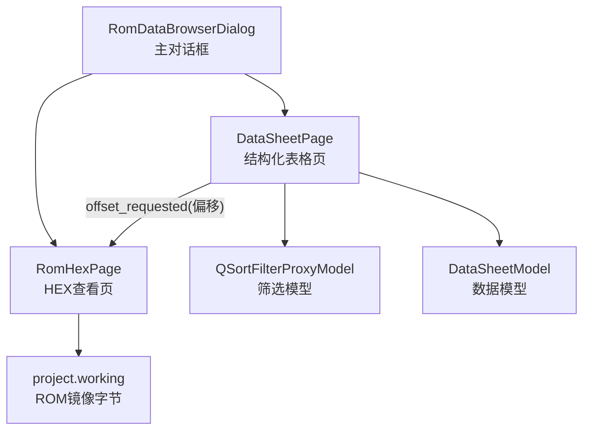
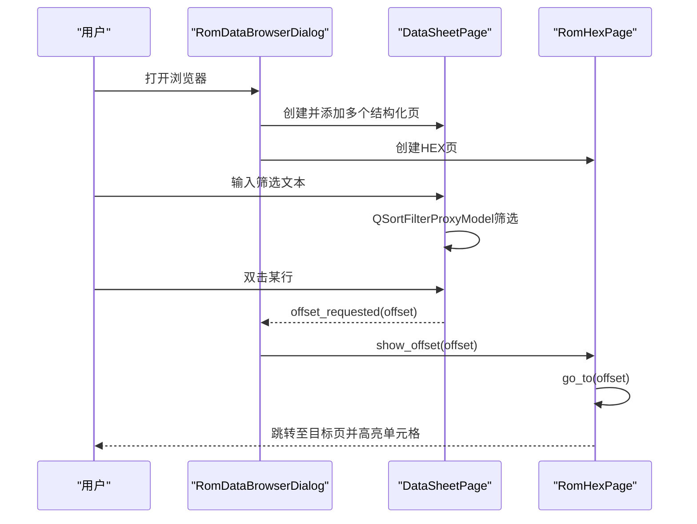
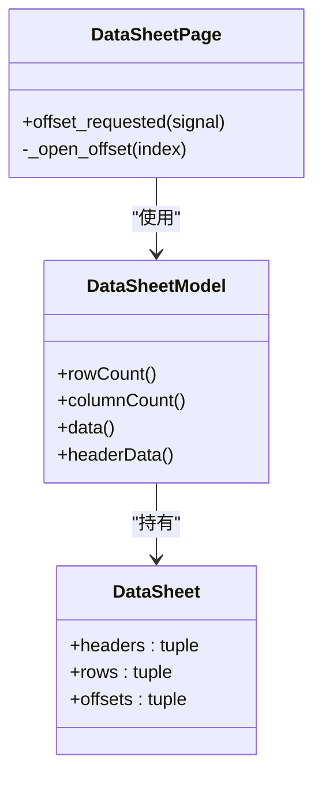
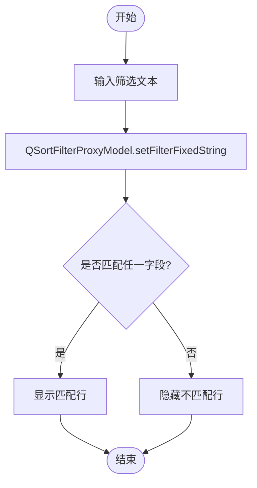
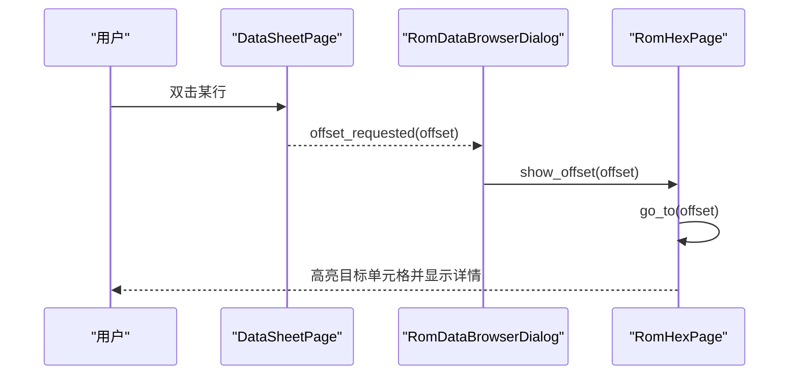
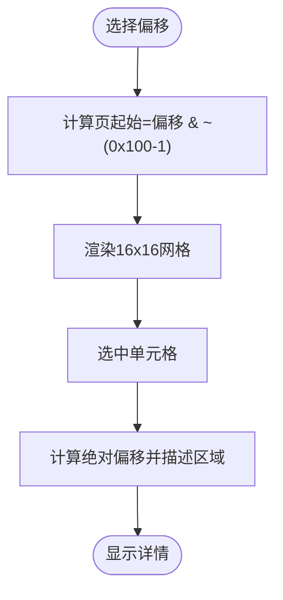
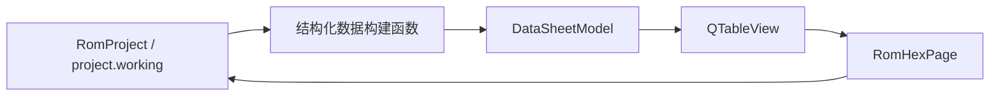

# ROM数据浏览器

<cite>
**本文引用的文件**
- [rom_data_browser.py](file://src/dc_modifier/rom_data_browser.py)
- [test_rom_data_browser.py](file://tests/test_rom_data_browser.py)
- [fc_rom_editor_core.py](file://src/fc_rom_editor_core.py)
- [交接文档.md](file://docs/交接文档.md)
</cite>

## 目录
1. [简介](#简介)
2. [项目结构](#项目结构)
3. [核心组件](#核心组件)
4. [架构总览](#架构总览)
5. [详细组件分析](#详细组件分析)
6. [依赖关系分析](#依赖关系分析)
7. [性能与优化建议](#性能与优化建议)
8. [故障诊断与排错](#故障诊断与排错)
9. [结论](#结论)
10. [附录：使用场景与高级技巧](#附录使用场景与高级技巧)

## 简介
ROM数据浏览器用于在修改器工程中以“结构化视图 + 原始HEX视图”的方式浏览FC游戏ROM的全部已知数据结构，并支持快速跳转到任意字节位置进行定位与核对。它提供以下能力：
- 内存地址查看：通过十六进制页面按页显示PRG/CHR区域，附带区域说明（iNES头、PRG Bank、CHR Bank等）。
- 数据搜索与过滤：对结构化表格（机体、人物、武器、地图、文字、动画、关卡事件）进行全文本筛选，支持大小写不敏感匹配。
- 十六进制编辑：当前实现为只读展示；双击行可跳转到完整HEX页对应偏移处，便于人工核对与调试。
- 数据类型查看：HEX页以单字节为单位展示，结合工具提示可理解其在PRG/CHR中的语义区域；结构化页将多字段解析为人类可读信息（如名称指针、原始字节、属性值等），间接支持字节/字/双字级别的观察。
- 地址导航：通过结构化页的“偏移量”列或双击行，自动跳转至HEX页指定偏移，并高亮对应单元格。

该工具适用于游戏机制研究、数据关系探索与故障诊断等场景，尤其适合在确认某条记录后，直接下钻到原始字节层面进行验证。

## 项目结构
ROM数据浏览器位于修改器GUI模块中，作为独立对话框集成到工程界面。其核心由“结构化数据表构建函数 + 通用表格页 + HEX查看页 + 主对话框”组成，并通过信号机制与HEX页联动。

图表来源
- [rom_data_browser.py:493-535](file://src/dc_modifier/rom_data_browser.py#L493-L535)
- [rom_data_browser.py:320-384](file://src/dc_modifier/rom_data_browser.py#L320-L384)
- [rom_data_browser.py:410-491](file://src/dc_modifier/rom_data_browser.py#L410-L491)

章节来源
- [rom_data_browser.py:493-535](file://src/dc_modifier/rom_data_browser.py#L493-L535)
- [test_rom_data_browser.py:30-71](file://tests/test_rom_data_browser.py#L30-L71)

## 核心组件
- 结构化数据表构建器：针对机体、人物、武器、地图、文字、动画、关卡事件等，生成包含标题、行数据与偏移量的数据表。
- 数据表模型与筛选：基于QAbstractTableModel与QSortFilterProxyModel实现可排序、可筛选的表格展示。
- HEX查看页：固定每页0x100字节，支持输入十进制或十六进制偏移跳转，并在底部显示选中单元格的详细信息（含PRG/CHR区域说明）。
- 主对话框：聚合所有结构化页与HEX页，提供统一入口与关闭按钮。

章节来源
- [rom_data_browser.py:54-318](file://src/dc_modifier/rom_data_browser.py#L54-L318)
- [rom_data_browser.py:320-384](file://src/dc_modifier/rom_data_browser.py#L320-L384)
- [rom_data_browser.py:410-491](file://src/dc_modifier/rom_data_browser.py#L410-L491)
- [rom_data_browser.py:493-535](file://src/dc_modifier/rom_data_browser.py#L493-L535)

## 架构总览
ROM数据浏览器采用“数据构建层 + UI展示层 + 底层ROM镜像”的分层设计：
- 数据构建层：调用工程接口读取各类型记录的原始字节与解析后的字段，组装成DataSheet。
- UI展示层：DataSheetPage负责表格渲染与筛选；RomHexPage负责HEX网格渲染与详情展示。
- 底层ROM镜像：通过project.working访问当前工程的ROM字节序列，保证所见即所得。

图表来源
- [rom_data_browser.py:493-535](file://src/dc_modifier/rom_data_browser.py#L493-L535)
- [rom_data_browser.py:348-384](file://src/dc_modifier/rom_data_browser.py#L348-L384)
- [rom_data_browser.py:410-491](file://src/dc_modifier/rom_data_browser.py#L410-L491)

## 详细组件分析

### 结构化数据表（DataSheet与构建函数）
- DataSheet：保存表格标题、行数据与每行对应的文件偏移量，用于后续跳转与筛选。
- 构建函数：分别针对机体、人物、武器、地图、文字、动画、关卡事件，从工程对象读取记录与原始字节，并以人类可读形式呈现（如名称指针、原始字节、属性值、动画地址/长度等）。
- 特点：
  - 所有结构化页均包含“原始字节”列，便于对照HEX页。
  - 部分记录可能无有效偏移（例如未配置项），此时偏移列为空，避免误跳。
  - 文本页会列出共享项，便于追踪复用关系。

图表来源
- [rom_data_browser.py:33-44](file://src/dc_modifier/rom_data_browser.py#L33-L44)
- [rom_data_browser.py:320-346](file://src/dc_modifier/rom_data_browser.py#L320-L346)
- [rom_data_browser.py:348-384](file://src/dc_modifier/rom_data_browser.py#L348-L384)

章节来源
- [rom_data_browser.py:54-318](file://src/dc_modifier/rom_data_browser.py#L54-L318)
- [rom_data_browser.py:320-384](file://src/dc_modifier/rom_data_browser.py#L320-L384)

### 筛选与搜索（字符串搜索）
- 筛选范围：覆盖当前表的所有可见字段（名称、编号、地址、正文、原始字节等）。
- 行为：大小写不敏感；实时响应输入框变化；支持清空筛选。
- 适用场景：快速定位特定记录（如某角色名、某地图ID、某段文本内容）。

图表来源
- [rom_data_browser.py:348-377](file://src/dc_modifier/rom_data_browser.py#L348-L377)

章节来源
- [rom_data_browser.py:348-377](file://src/dc_modifier/rom_data_browser.py#L348-L377)

### 数值查找（通过偏移跳转）
- 虽然结构化页不提供“数值范围”搜索，但可通过“偏移量”列或双击行跳转到HEX页指定偏移，再配合HEX页的“文件偏移”输入框进行精确跳转。
- 支持十进制与十六进制输入，自动对齐到页边界（每页0x100字节）。

图表来源
- [rom_data_browser.py:379-384](file://src/dc_modifier/rom_data_browser.py#L379-L384)
- [rom_data_browser.py:442-448](file://src/dc_modifier/rom_data_browser.py#L442-L448)
- [rom_data_browser.py:532-535](file://src/dc_modifier/rom_data_browser.py#L532-L535)

章节来源
- [rom_data_browser.py:379-384](file://src/dc_modifier/rom_data_browser.py#L379-L384)
- [rom_data_browser.py:442-448](file://src/dc_modifier/rom_data_browser.py#L442-L448)
- [rom_data_browser.py:532-535](file://src/dc_modifier/rom_data_browser.py#L532-L535)

### 十六进制查看（HEX页）
- 布局：16×16网格，每页固定显示0x100字节；左侧行号显示页内偏移。
- 功能：
  - 输入框支持十进制或0x前缀的十六进制地址，自动对齐到页边界。
  - 选中单元格时，底部显示详细信息：文件偏移、字节值、所在区域（iNES头、PRG Bank、CHR Bank及图块索引）。
  - 工具提示显示相同信息，便于鼠标悬停快速查看。
- 数据类型观察：以单字节粒度展示；结合区域说明可推断字/双字数据的起始位置与含义。

图表来源
- [rom_data_browser.py:410-491](file://src/dc_modifier/rom_data_browser.py#L410-L491)

章节来源
- [rom_data_browser.py:410-491](file://src/dc_modifier/rom_data_browser.py#L410-L491)

### 主对话框与页面组织
- 主对话框汇总所有结构化页与HEX页，提供统计信息与关闭操作。
- 每个结构化页都带有筛选框与状态标签，双击行触发跳转。
- 测试覆盖了结构化页数量、HEX跳转与详情显示的正确性。

章节来源
- [rom_data_browser.py:493-535](file://src/dc_modifier/rom_data_browser.py#L493-L535)
- [test_rom_data_browser.py:30-71](file://tests/test_rom_data_browser.py#L30-L71)

## 依赖关系分析
- 工程对象：通过project.working获取ROM镜像字节；通过各类codec与project方法读取结构化数据（单位、人物、武器、地图、文本、动画、事件）。
- Qt模型：使用QAbstractTableModel承载数据，QSortFilterProxyModel实现筛选，QTableView负责展示。
- 编解码器：来自fc_editor.codecs包，用于解析不同资源类型的记录与原始字节。

图表来源
- [rom_data_browser.py:54-318](file://src/dc_modifier/rom_data_browser.py#L54-L318)
- [rom_data_browser.py:320-384](file://src/dc_modifier/rom_data_browser.py#L320-L384)
- [rom_data_browser.py:410-491](file://src/dc_modifier/rom_data_browser.py#L410-L491)

章节来源
- [rom_data_browser.py:54-318](file://src/dc_modifier/rom_data_browser.py#L54-L318)
- [rom_data_browser.py:320-384](file://src/dc_modifier/rom_data_browser.py#L320-L384)
- [rom_data_browser.py:410-491](file://src/dc_modifier/rom_data_browser.py#L410-L491)

## 性能与优化建议
- 筛选性能：当前筛选基于QSortFilterProxyModel的全表匹配，适合中等规模数据；若未来行数显著增长，可考虑：
  - 预索引关键字段（如ID、名称、地址）以提升匹配速度。
  - 延迟加载或分页显示，减少初始渲染压力。
- 渲染性能：HEX页固定每页0x100字节，已控制单次渲染量；如需更大范围浏览，可考虑虚拟滚动或按需加载。
- 跳转性能：go_to仅调整页与选中单元格，复杂度低；确保偏移计算正确即可。
- 内存占用：project.working为整个ROM镜像，注意工程生命周期管理，避免重复加载。

[本节为通用指导，不直接分析具体文件]

## 故障诊断与排错
- 无法跳转到预期偏移：
  - 检查结构化页该行是否包含有效偏移（偏移列为空表示无有效记录）。
  - 确认输入地址格式正确（支持十进制或0x前缀十六进制）。
- 筛选无结果：
  - 确认筛选文本拼写正确；当前筛选为大小写不敏感。
  - 尝试清空筛选框恢复全表。
- HEX页详情异常：
  - 若超出ROM末尾，详情会提示“ROM 末尾之外”；请检查偏移是否越界。
  - 区域说明错误通常意味着工程镜像或Bank布局异常，需核对project.working与工程配置。

章节来源
- [rom_data_browser.py:379-384](file://src/dc_modifier/rom_data_browser.py#L379-L384)
- [rom_data_browser.py:442-448](file://src/dc_modifier/rom_data_browser.py#L442-L448)
- [rom_data_browser.py:469-491](file://src/dc_modifier/rom_data_browser.py#L469-L491)
- [test_rom_data_browser.py:57-71](file://tests/test_rom_data_browser.py#L57-L71)

## 结论
ROM数据浏览器提供了“结构化记录 + 原始HEX”的双重视图，既能快速浏览和筛选关键数据，又能下钻到字节级别进行精确核对。其设计简洁、职责清晰，适合在游戏机制研究、数据关系探索与故障诊断中使用。对于大规模数据或更高性能的筛选需求，可在现有基础上引入索引与分页优化。

[本节为总结性内容，不直接分析具体文件]

## 附录：使用场景与高级技巧

- 游戏机制研究
  - 通过“机体/人物/武器”页快速定位某单位的属性与原始字节，结合HEX页核对编码细节。
  - 利用“地图与部署”页查看地形与部署布局的原始字节，辅助理解关卡构造。
- 数据关系探索
  - “文字”页显示共享项，便于追踪文本复用与多语言分支。
  - “动画”页列出指令摘要与原始字节，帮助理解动画播放流程。
- 故障诊断
  - 当某功能异常时，先在结构化页找到相关记录，再跳转HEX页核对关键字节是否与预期一致。
  - 若发现偏移为空或区域说明异常，优先检查工程镜像与Bank布局是否正确。

- 高级搜索技巧
  - 组合关键词：在筛选框中输入“名称+ID+地址片段”，缩小匹配范围。
  - 借助原始字节列：输入常见模式（如连续零、特定标志位）快速定位特殊记录。
  - 先定位ID再跳转：通过ID列筛选，然后双击行跳转到HEX页，精确定位原始数据。

- 性能优化建议
  - 分步筛选：先按大类（如“地图”）再按关键字段（如“地图ID”）逐步缩小范围。
  - 避免全表重绘：尽量使用已有筛选结果继续细化，而非频繁清空重建。
  - 合理使用HEX页：仅在必要时跳转至具体偏移，避免频繁切换页面造成UI抖动。

[本节为概念性指导，不直接分析具体文件]