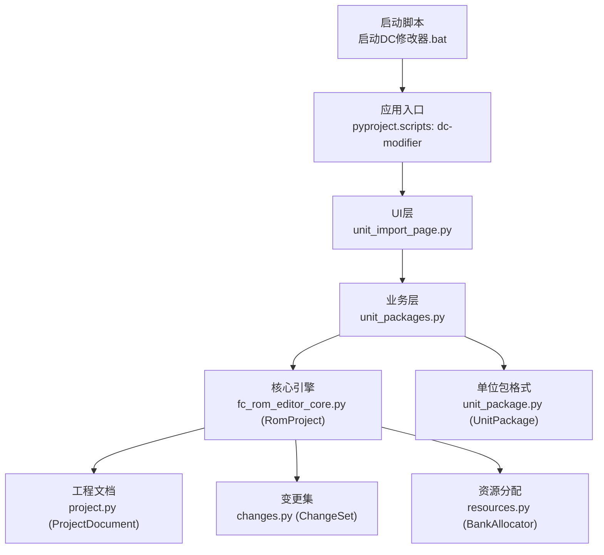
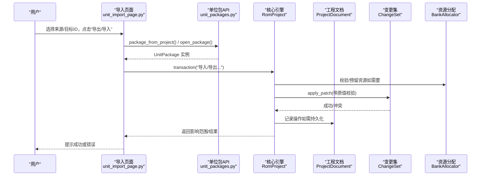
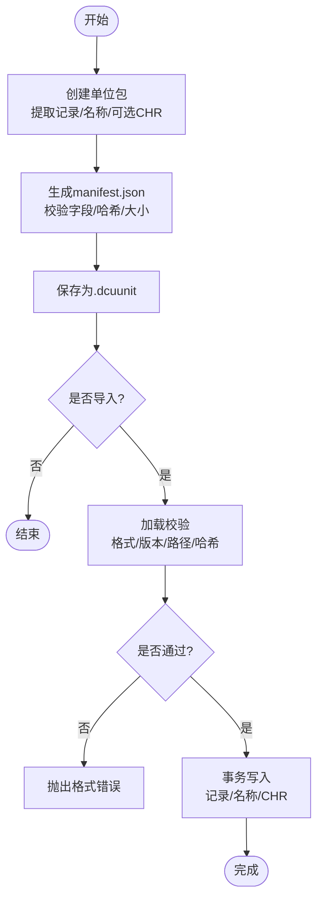
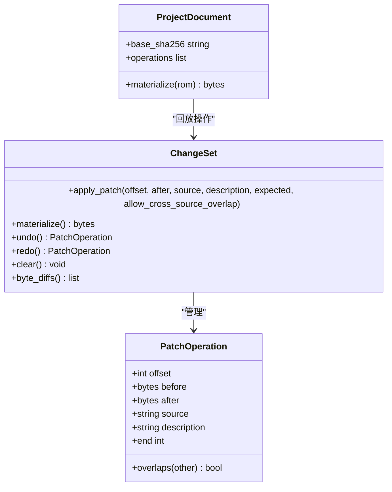
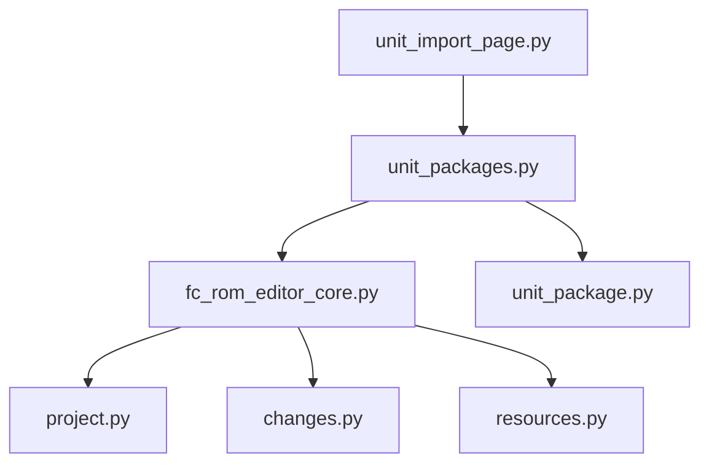

# 单位包管理

<cite>
**本文引用的文件**
- [src/fc_rom_editor_core.py](file://src/fc_rom_editor_core.py)
- [src/fc_editor/unit_package.py](file://src/fc_editor/unit_package.py)
- [src/dc_modifier/unit_packages.py](file://src/dc_modifier/unit_packages.py)
- [src/dc_modifier/unit_import_page.py](file://src/dc_modifier/unit_import_page.py)
- [src/fc_editor/project.py](file://src/fc_editor/project.py)
- [src/fc_editor/changes.py](file://src/fc_editor/changes.py)
- [src/fc_editor/resources.py](file://src/fc_editor/resources.py)
- [pyproject.toml](file://pyproject.toml)
- [启动DC修改器.bat](file://启动DC修改器.bat)
</cite>

## 目录
1. [简介](#简介)
2. [项目结构](#项目结构)
3. [核心组件](#核心组件)
4. [架构总览](#架构总览)
5. [详细组件分析](#详细组件分析)
6. [依赖关系分析](#依赖关系分析)
7. [性能与容量规划](#性能与容量规划)
8. [故障排查指南](#故障排查指南)
9. [结论](#结论)
10. [附录：数据格式与生命周期](#附录数据格式与生命周期)

## 简介
本系统围绕“单位包”提供完整的数据包导入导出、版本控制、依赖管理与冲突解决能力，覆盖从创建、验证、发布到更新的全生命周期。它支持以 .dcunit 为载体的可移植单位数据包，内置校验、哈希校验与安全限制；通过工程文档（JSON）记录操作序列，实现跨会话的版本化变更与合并冲突检测；在运行时提供撤销/重做事务、资源分配与冲突保护，确保批量操作与自动化脚本的安全执行。

## 项目结构
- 入口与运行
  - 桌面应用入口由 pyproject 的脚本定义，启动后进入 dc_modifier 应用。
  - Windows 快捷启动脚本会优先调用打包后的 exe，否则回退到虚拟环境中的 Python 脚本。
- 核心模块
  - RomProject：ROM 工程对象，封装 ROM 镜像、编解码器、资源分配器、撤销/重做事务、构建产物等。
  - UnitPackage：单位包数据结构与序列化（ZIP + manifest.json），包含来源信息、机体记录、名称引用与附加资源。
  - unit_packages：将当前工程状态打包为 .dcunit，或将 .dcunit 安全应用到目标工程。
  - unit_import_page：UI 页面，提供选择来源/目标、预览影响范围、打开/导出 .dcunit、提交导入等操作。
  - ProjectDocument：工程文档（JSON），记录基准 ROM、工具版本与一系列原子操作，用于版本化与回放。
  - ChangeSet：字节级补丁集合，提供重叠检测、原值校验、撤销/重做与差异输出。
  - BankAllocator：PRG 空闲区域分配器，保证对齐、不重叠、零填充策略与容量上限。
- 其他
  - 资源图 ResourceGraph：描述 ROM 中各资源节点及引用关系，供编辑器模块使用。
  - 常量与错误：UNIT_RECORD_SIZE、PRG_BANK_SIZE、ProjectFormatError、RomFormatError、ChangeConflictError 等。

**图表来源**
- [启动DC修改器.bat:1-16](file://启动DC修改器.bat#L1-L16)
- [pyproject.toml:22-27](file://pyproject.toml#L22-L27)
- [src/dc_modifier/unit_import_page.py:30-128](file://src/dc_modifier/unit_import_page.py#L30-L128)
- [src/dc_modifier/unit_packages.py:7-98](file://src/dc_modifier/unit_packages.py#L7-L98)
- [src/fc_rom_editor_core.py:463-785](file://src/fc_rom_editor_core.py#L463-L785)
- [src/fc_editor/project.py:48-121](file://src/fc_editor/project.py#L48-L121)
- [src/fc_editor/changes.py:8-121](file://src/fc_editor/changes.py#L8-L121)
- [src/fc_editor/resources.py:280-413](file://src/fc_editor/resources.py#L280-L413)
- [src/fc_editor/unit_package.py:17-258](file://src/fc_editor/unit_package.py#L17-L258)

**章节来源**
- [启动DC修改器.bat:1-16](file://启动DC修改器.bat#L1-L16)
- [pyproject.toml:1-31](file://pyproject.toml#L1-L31)
- [src/dc_modifier/unit_import_page.py:30-128](file://src/dc_modifier/unit_import_page.py#L30-L128)
- [src/dc_modifier/unit_packages.py:7-98](file://src/dc_modifier/unit_packages.py#L7-L98)
- [src/fc_rom_editor_core.py:463-785](file://src/fc_rom_editor_core.py#L463-L785)
- [src/fc_editor/project.py:48-121](file://src/fc_editor/project.py#L48-L121)
- [src/fc_editor/changes.py:8-121](file://src/fc_editor/changes.py#L8-L121)
- [src/fc_editor/resources.py:280-413](file://src/fc_editor/resources.py#L280-L413)
- [src/fc_editor/unit_package.py:17-258](file://src/fc_editor/unit_package.py#L17-L258)

## 核心组件
- RomProject
  - 负责加载 ROM、初始化各类编解码器（机体、武器、地图、剧情文本等）、维护工作镜像与原始镜像、资源分配器、撤销/重做栈、只读输出根目录保护、构建产物（ROM/IPS/工程/报告）。
  - 提供事务性写入（transaction），在异常时回滚到快照，并记录历史条目以便撤销/重做。
- UnitPackage
  - 定义单位包格式（newdc.unit v1），包含 label、source_profile、source_rom_sha256、source_unit_id、unit_record、name_source_id 与 assets。
  - 提供 to_manifest、to_bytes/save/load 等方法，严格校验路径安全、大小上限、哈希一致性与字段类型。
- unit_packages
  - package_from_project：从当前工程状态生成 .dcunit（含可选 CHR 图块范围）。
  - apply_unit_package：校验来源配置、资源种类、CHR 元数据与长度，按目标 ID 写入记录与名称引用，并以事务方式提交。
- unit_import_page
  - 提供 UI 流程：选择来源/目标、预览共享记录影响范围、打开/导出 .dcunit、确认导入并一次性提交。
- ProjectDocument
  - 工程文档 JSON，记录 base（sha256/mapper/size）、tool_version 与 operations（原子操作列表）。
  - materialize：回放操作序列，对每条操作进行原值校验与冲突检测，生成最终 ROM 镜像。
- ChangeSet
  - 有序可逆的字节补丁集合，支持 apply_patch 的原值校验、重叠冲突检测、undo/redo、byte_diffs 输出。
- BankAllocator
  - PRG 空闲区域分配器，支持 reserve/allocate/release，强制对齐、单 Bank 或连续分配、零填充检查与容量上限。

**章节来源**
- [src/fc_rom_editor_core.py:112-141](file://src/fc_rom_editor_core.py#L112-L141)
- [src/fc_rom_editor_core.py:463-785](file://src/fc_rom_editor_core.py#L463-L785)
- [src/fc_editor/unit_package.py:17-258](file://src/fc_editor/unit_package.py#L17-L258)
- [src/dc_modifier/unit_packages.py:7-98](file://src/dc_modifier/unit_packages.py#L7-L98)
- [src/dc_modifier/unit_import_page.py:30-359](file://src/dc_modifier/unit_import_page.py#L30-L359)
- [src/fc_editor/project.py:48-121](file://src/fc_editor/project.py#L48-L121)
- [src/fc_editor/project.py:434-800](file://src/fc_editor/project.py#L434-L800)
- [src/fc_editor/changes.py:8-121](file://src/fc_editor/changes.py#L8-L121)
- [src/fc_editor/resources.py:280-413](file://src/fc_editor/resources.py#L280-L413)

## 架构总览
下图展示单位包从创建到应用的端到端流程，以及关键组件之间的交互。

**图表来源**
- [src/dc_modifier/unit_import_page.py:286-359](file://src/dc_modifier/unit_import_page.py#L286-L359)
- [src/dc_modifier/unit_packages.py:7-98](file://src/dc_modifier/unit_packages.py#L7-L98)
- [src/fc_rom_editor_core.py:714-785](file://src/fc_rom_editor_core.py#L714-L785)
- [src/fc_editor/project.py:534-800](file://src/fc_editor/project.py#L534-L800)
- [src/fc_editor/changes.py:62-108](file://src/fc_editor/changes.py#L62-L108)
- [src/fc_editor/resources.py:368-413](file://src/fc_editor/resources.py#L368-L413)

## 详细组件分析

### 单位包格式与生命周期
- 创建
  - 从当前工程状态提取 16 字节机体记录与名称引用，可选择携带连续 CHR 图块范围。
  - 生成 manifest.json（压缩存储），校验资产 ID/文件名唯一性、路径安全、大小上限与哈希一致性。
- 验证
  - 加载时校验 format/version/source/unit/assets 字段类型与取值范围，解压后校验总大小与重复文件。
  - 资源项校验 bytes/sha256 与 path 约束（assets 单层相对路径）。
- 发布
  - 保存为 .dcunit 文件，默认后缀自动补全，输出路径受只读根目录保护。
- 更新
  - 导入时校验 source_profile 匹配，拒绝未接通的资源种类（例如非 chr_tiles），避免不完整导入。
  - 以事务方式写入目标 ID 的记录与名称引用，并写回对应 CHR 范围。

**图表来源**
- [src/fc_editor/unit_package.py:85-141](file://src/fc_editor/unit_package.py#L85-L141)
- [src/fc_editor/unit_package.py:169-258](file://src/fc_editor/unit_package.py#L169-L258)
- [src/dc_modifier/unit_packages.py:52-98](file://src/dc_modifier/unit_packages.py#L52-L98)
- [src/dc_modifier/unit_import_page.py:286-359](file://src/dc_modifier/unit_import_page.py#L286-L359)

**章节来源**
- [src/fc_editor/unit_package.py:17-258](file://src/fc_editor/unit_package.py#L17-L258)
- [src/dc_modifier/unit_packages.py:7-98](file://src/dc_modifier/unit_packages.py#L7-L98)
- [src/dc_modifier/unit_import_page.py:30-359](file://src/dc_modifier/unit_import_page.py#L30-L359)

### 版本控制与冲突解决
- 工程文档（ProjectDocument）
  - 记录基准 ROM（sha256/mapper/size）与工具版本，以及一系列原子操作（如设置字段、替换地图、绑定战斗音乐等）。
  - materialize 回放操作时，逐条校验原值与语义摘要，遇到不匹配则抛出 ProjectFormatError。
- 变更集（ChangeSet）
  - apply_patch 支持 expected 原值校验与跨源重叠检测，冲突时抛出 ChangeConflictError。
  - undo/redo 基于游标管理，支持 byte_diffs 输出差异。
- 合并冲突处理
  - 当多个来源对同一偏移写入不同内容时，ChangeSet 会检测到重叠并阻止后续写入。
  - 工程文档回放阶段也会因原值不匹配而中止，确保一致性。

**图表来源**
- [src/fc_editor/changes.py:8-121](file://src/fc_editor/changes.py#L8-L121)
- [src/fc_editor/project.py:434-800](file://src/fc_editor/project.py#L434-L800)

**章节来源**
- [src/fc_editor/project.py:48-121](file://src/fc_editor/project.py#L48-L121)
- [src/fc_editor/project.py:534-800](file://src/fc_editor/project.py#L534-L800)
- [src/fc_editor/changes.py:8-121](file://src/fc_editor/changes.py#L8-L121)

### 依赖管理与资源分配
- 资源图（ResourceGraph）
  - 根据 RomProfile 构建 ROM 资源节点（指针表、音频槽、自由区、保护区等）与引用关系，供编辑器模块识别与约束。
- 银行分配器（BankAllocator）
  - allocate/reserve/release 支持对齐、单 Bank/连续模式、零填充要求与容量上限。
  - 防止重叠分配与越界写入，保障扩展内容的稳定性。
- 依赖关系
  - 单位包仅在当前版本允许的资源种类下导入（目前为 chr_tiles），其他种类被拒绝以避免不完整导入。
  - 工程文档回放阶段依赖 Profile 提供的编解码器与布局信息，确保操作正确映射到 ROM 地址。

**图表来源**
- [src/fc_editor/resources.py:47-260](file://src/fc_editor/resources.py#L47-L260)
- [src/fc_editor/resources.py:280-413](file://src/fc_editor/resources.py#L280-L413)
- [src/fc_rom_editor_core.py:612-618](file://src/fc_rom_editor_core.py#L612-L618)
- [src/fc_editor/project.py:434-800](file://src/fc_editor/project.py#L434-L800)

**章节来源**
- [src/fc_editor/resources.py:47-260](file://src/fc_editor/resources.py#L47-L260)
- [src/fc_editor/resources.py:280-413](file://src/fc_editor/resources.py#L280-L413)
- [src/fc_rom_editor_core.py:612-618](file://src/fc_rom_editor_core.py#L612-L618)
- [src/fc_editor/project.py:434-800](file://src/fc_editor/project.py#L434-L800)

### 批量操作与自动化脚本
- 批量导出
  - 在 UI 中选择来源 ID，勾选“包含 CHR”，指定起点与数量，导出为 .dcunit。
  - 可通过脚本循环遍历 ID 列表，调用 package_from_project 与 save 方法批量生成包。
- 批量导入
  - 读取多个 .dcunit，逐一调用 apply_unit_package，并在每个导入前计算 affected_unit_ids 以评估影响范围。
  - 使用 RomProject.transaction 包裹每次导入，确保失败时可撤销。
- 自动化建议
  - 结合 ProjectDocument.operations 记录每一步变更，便于回溯与审计。
  - 在 CI 环境中运行 validate_project 与 materialize，确保工程完整性。

**章节来源**
- [src/dc_modifier/unit_import_page.py:246-309](file://src/dc_modifier/unit_import_page.py#L246-L309)
- [src/dc_modifier/unit_packages.py:7-98](file://src/dc_modifier/unit_packages.py#L7-L98)
- [src/fc_rom_editor_core.py:714-785](file://src/fc_rom_editor_core.py#L714-L785)
- [src/fc_editor/project.py:534-800](file://src/fc_editor/project.py#L534-L800)

### 团队协作最佳实践
- 版本分支策略
  - 以 ProjectDocument 作为协作基线，每个分支维护独立的 operations 列表。
  - 合并前运行 materialize 回放，确保无冲突；若冲突，需调整 expectedOldValue/expectedOldDigest 或拆分变更。
- 变更追踪
  - 每条操作附带 description 与 source，便于审计与定位。
  - 使用 ChangeSet.byte_diffs 输出差异，辅助审查。
- 合并冲突处理
  - 优先拆分冲突区域，避免跨源重叠写入。
  - 对于共享记录的机体，明确影响范围（affected_unit_ids），必要时分别处理。

**章节来源**
- [src/fc_editor/project.py:534-800](file://src/fc_editor/project.py#L534-L800)
- [src/fc_editor/changes.py:62-108](file://src/fc_editor/changes.py#L62-L108)
- [src/dc_modifier/unit_packages.py:43-49](file://src/dc_modifier/unit_packages.py#L43-L49)

## 依赖关系分析
- 组件耦合
  - RomProject 依赖多种 Codec（单位、武器、地图、剧情等）与 BankAllocator，形成高内聚的核心引擎。
  - UnitPackage 与 unit_packages 解耦于具体 ROM 结构，通过 profile/key 与 sha256 保证兼容性。
- 外部依赖
  - PySide6 用于 UI；可选依赖包括 pyinstaller、reportlab 等用于构建与文档。
- 潜在循环依赖
  - 当前结构清晰分层，未见明显循环导入；UI→业务→核心→文档/变更集/资源分配，单向依赖。

**图表来源**
- [src/dc_modifier/unit_import_page.py:30-128](file://src/dc_modifier/unit_import_page.py#L30-L128)
- [src/dc_modifier/unit_packages.py:7-98](file://src/dc_modifier/unit_packages.py#L7-L98)
- [src/fc_rom_editor_core.py:463-785](file://src/fc_rom_editor_core.py#L463-L785)
- [src/fc_editor/project.py:48-121](file://src/fc_editor/project.py#L48-L121)
- [src/fc_editor/changes.py:8-121](file://src/fc_editor/changes.py#L8-L121)
- [src/fc_editor/resources.py:280-413](file://src/fc_editor/resources.py#L280-L413)
- [src/fc_editor/unit_package.py:17-258](file://src/fc_editor/unit_package.py#L17-L258)

**章节来源**
- [pyproject.toml:11-20](file://pyproject.toml#L11-L20)
- [src/dc_modifier/unit_import_page.py:30-128](file://src/dc_modifier/unit_import_page.py#L30-L128)
- [src/dc_modifier/unit_packages.py:7-98](file://src/dc_modifier/unit_packages.py#L7-L98)
- [src/fc_rom_editor_core.py:463-785](file://src/fc_rom_editor_core.py#L463-L785)
- [src/fc_editor/project.py:48-121](file://src/fc_editor/project.py#L48-L121)
- [src/fc_editor/changes.py:8-121](file://src/fc_editor/changes.py#L8-L121)
- [src/fc_editor/resources.py:280-413](file://src/fc_editor/resources.py#L280-L413)
- [src/fc_editor/unit_package.py:17-258](file://src/fc_editor/unit_package.py#L17-L258)

## 性能与容量规划
- 容量上限
  - 单位包最大 32 MiB（含压缩包与解压后总和），防止恶意或意外的大包导致内存压力。
  - BankAllocator 基于 Profile 的自由 PRG 区域分配，确保不溢出且满足对齐与零填充要求。
- 性能优化
  - 使用 ZIP_DEFLATED 压缩资产，提高传输效率。
  - ChangeSet 仅在必要时 materialize，减少中间拷贝。
  - 批量操作时尽量合并为单次事务，降低撤销/重做栈开销。
- 调优建议
  - 合理划分 CHR 图块范围，避免过大连续块导致分配失败。
  - 在 CI 中启用验证与回放，提前发现容量不足与冲突。

**章节来源**
- [src/fc_editor/unit_package.py:17-19](file://src/fc_editor/unit_package.py#L17-L19)
- [src/fc_editor/unit_package.py:119-141](file://src/fc_editor/unit_package.py#L119-L141)
- [src/fc_editor/resources.py:368-413](file://src/fc_editor/resources.py#L368-L413)
- [src/fc_editor/changes.py:56-60](file://src/fc_editor/changes.py#L56-L60)

## 故障排查指南
- 常见错误
  - “无法读取机体包”：manifest 字段无效、路径不安全、重复文件、解压后超限。
  - “资源长度不匹配/哈希不匹配”：资产数据损坏或篡改。
  - “原值不匹配/重叠冲突”：工程文档回放或变更集写入时发生冲突。
  - “没有足够的空闲 PRG 空间”：容量不足或对齐不满足。
- 排查步骤
  - 检查 source_profile 与 ROM 哈希是否匹配。
  - 使用 ChangeSet.byte_diffs 查看差异，定位冲突偏移。
  - 重新运行 validate_project 与 materialize，获取详细错误信息。
  - 调整资源分配或拆分变更，避免重叠写入。

**章节来源**
- [src/fc_editor/unit_package.py:169-258](file://src/fc_editor/unit_package.py#L169-L258)
- [src/fc_editor/changes.py:62-108](file://src/fc_editor/changes.py#L62-L108)
- [src/fc_editor/resources.py:368-413](file://src/fc_editor/resources.py#L368-L413)
- [src/fc_editor/project.py:534-800](file://src/fc_editor/project.py#L534-L800)

## 结论
本系统通过单位包（.dcunit）实现了可移植、可验证的单位数据交换，结合工程文档与变更集提供了强大的版本控制与冲突解决能力。资源分配器确保扩展内容的稳定写入，事务机制保障批量操作的安全性。遵循本文的最佳实践与排障指南，可有效提升团队协作效率与系统可靠性。

## 附录：数据格式与生命周期
- 单位包清单（manifest.json）关键字段
  - format: "newdc.unit"
  - version: 1
  - label: 包标签
  - source.profile: 来源配置键
  - source.romSha256: 来源 ROM 哈希
  - source.unitId: 来源机体 ID
  - unit.record: 16 字节机体记录（十六进制）
  - unit.nameSourceId: 名称来源 ID（可选）
  - assets[].id/kind/path/bytes/sha256/metadata: 资源项
- 生命周期
  - 创建：从工程状态提取记录与名称，可选携带 CHR 图块范围。
  - 验证：加载时校验格式、版本、路径、大小、哈希与字段类型。
  - 发布：保存为 .dcunit，受只读根目录保护。
  - 更新：导入时校验来源配置与资源种类，事务写入目标 ID。

**章节来源**
- [src/fc_editor/unit_package.py:85-141](file://src/fc_editor/unit_package.py#L85-L141)
- [src/fc_editor/unit_package.py:169-258](file://src/fc_editor/unit_package.py#L169-L258)
- [src/dc_modifier/unit_packages.py:52-98](file://src/dc_modifier/unit_packages.py#L52-L98)
- [src/dc_modifier/unit_import_page.py:286-359](file://src/dc_modifier/unit_import_page.py#L286-L359)