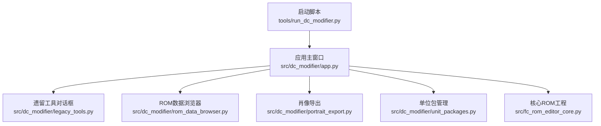
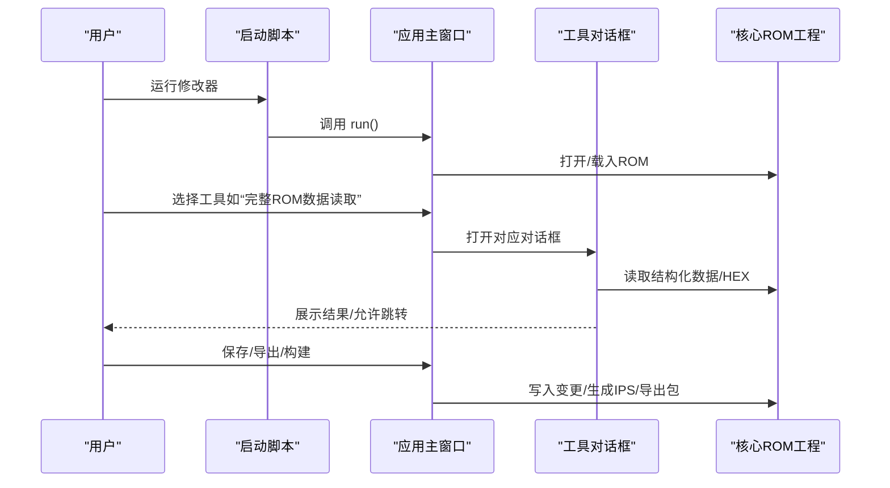
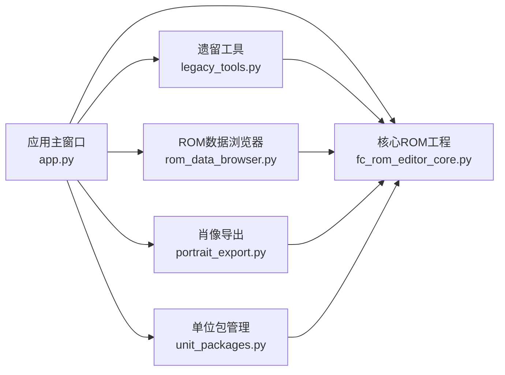

# 工具和实用程序

<cite>
**本文引用的文件**
- [run_dc_modifier.py](file://tools/run_dc_modifier.py)
- [app.py](file://src/dc_modifier/app.py)
- [legacy_tools.py](file://src/dc_modifier/legacy_tools.py)
- [rom_data_browser.py](file://src/dc_modifier/rom_data_browser.py)
- [portrait_export.py](file://src/dc_modifier/portrait_export.py)
- [unit_packages.py](file://src/dc_modifier/unit_packages.py)
- [fc_rom_editor_core.py](file://src/fc_rom_editor_core.py)
</cite>

## 目录
1. [简介](#简介)
2. [项目结构](#项目结构)
3. [核心组件](#核心组件)
4. [架构总览](#架构总览)
5. [详细组件分析](#详细组件分析)
6. [依赖关系分析](#依赖关系分析)
7. [性能考虑](#性能考虑)
8. [故障排查指南](#故障排查指南)
9. [结论](#结论)
10. [附录](#附录)

## 简介
本章节面向DC修改器提供的各类工具与实用程序，覆盖以下能力：
- 遗留工具（兼容性支持、数据转换）：字库浏览与预览、文字双向转换、战斗属性计算器、存档编辑器外壳等。
- 肖像导出工具：将ROM内人物头像提取为BMP图片，支持按人物ID导出前后两幅图像。
- ROM数据浏览器：以结构化表格展示机体、人物、武器、地图、文本、动画、事件等记录，并提供完整HEX查看与地址跳转。
- 单位包管理：从工程导出可移植的“机体包”，并安全导入到目标工程，包含资源校验与版本控制提示。
- 自动化与批处理：提供启动脚本、构建脚本与审计脚本，便于批量执行与持续集成。

## 项目结构
DC修改器采用“应用入口 + 页面/对话框 + 核心ROM工程”的分层组织：
- 应用入口：负责菜单、窗口、工具对话框的编排与生命周期管理。
- 工具对话框：实现具体功能（如字库、文字转换、属性计算、存档编辑）。
- 核心ROM工程：封装ROM镜像读写、编解码、事务与撤销重做、IPS生成等。
- 工具脚本：位于 tools 目录，用于打包、构建、审计与自动化任务。

图表来源
- [run_dc_modifier.py:13-25](file://tools/run_dc_modifier.py#L13-L25)
- [app.py:276-488](file://src/dc_modifier/app.py#L276-L488)
- [legacy_tools.py:109-385](file://src/dc_modifier/legacy_tools.py#L109-L385)
- [rom_data_browser.py:493-535](file://src/dc_modifier/rom_data_browser.py#L493-L535)
- [portrait_export.py:75-93](file://src/dc_modifier/portrait_export.py#L75-L93)
- [unit_packages.py:7-98](file://src/dc_modifier/unit_packages.py#L7-L98)
- [fc_rom_editor_core.py:463-800](file://src/fc_rom_editor_core.py#L463-L800)

章节来源
- [run_dc_modifier.py:13-25](file://tools/run_dc_modifier.py#L13-L25)
- [app.py:276-488](file://src/dc_modifier/app.py#L276-L488)

## 核心组件
- 应用主窗口与菜单：集中暴露“数据库”“完整ROM数据读取”“文字库”“文字转换”“剧情事件”“导出机体/头像”“属性计算器”“存档修改器”“其他设置”等功能入口。
- 遗留工具：提供只读或受限写入的字库浏览、文字编码/解码、战斗属性估算、存档读取与保护性提示。
- ROM数据浏览器：结构化展示所有已验证的数据表，并支持跳转到任意偏移进行HEX查看。
- 肖像导出：按人物ID导出前后两张BMP，路径命名安全化，原子写入临时文件后替换。
- 单位包管理：导出当前内存中的机体状态为可移植包；导入时进行版本与资源校验，并在事务中应用变更。
- 核心ROM工程：提供ROM加载、编解码、事务/撤销重做、IPS生成、只读输出根保护等基础能力。

章节来源
- [app.py:399-488](file://src/dc_modifier/app.py#L399-L488)
- [legacy_tools.py:109-385](file://src/dc_modifier/legacy_tools.py#L109-L385)
- [rom_data_browser.py:320-535](file://src/dc_modifier/rom_data_browser.py#L320-L535)
- [portrait_export.py:24-93](file://src/dc_modifier/portrait_export.py#L24-L93)
- [unit_packages.py:7-98](file://src/dc_modifier/unit_packages.py#L7-L98)
- [fc_rom_editor_core.py:386-461](file://src/fc_rom_editor_core.py#L386-L461)

## 架构总览
下图展示了从启动到各工具调用的整体流程，以及工具与核心ROM工程的交互关系。

图表来源
- [run_dc_modifier.py:13-25](file://tools/run_dc_modifier.py#L13-L25)
- [app.py:511-580](file://src/dc_modifier/app.py#L511-L580)
- [rom_data_browser.py:493-535](file://src/dc_modifier/rom_data_browser.py#L493-L535)
- [fc_rom_editor_core.py:638-674](file://src/fc_rom_editor_core.py#L638-L674)

## 详细组件分析

### 遗留工具（兼容性支持与数据转换）
- 字库编辑对话框：以16x16网格显示字形，支持页选择、原始字形预览、替换字符预览；在尚未完成差分验证的结构上保持只读提示。
- 文字转换对话框：基于内置Token表进行“文字↔代码”的双向无损转换，支持多种十六进制格式输入。
- 战斗属性计算器：非破坏性估算命中率与伤害，提供最低命中速度参考，明确标注公式为估算而非已验证游戏公式。
- 存档编辑器外壳：限制最大文件大小，仅读取并显示SHA-256摘要；因编解码未验证，写入与保存默认禁用。

使用场景
- 快速核对字模位置与内容，辅助定位异常字符。
- 将策划文档中的中文文本转换为ROM可用的Token序列，或将ROM字节还原为可读文本。
- 预估战斗数值变化对命中率与伤害的影响，辅助平衡调整。
- 检查存档大小与完整性，避免误写未验证的存档格式。

操作步骤（概要）
- 字库：选择页→点击单元格→查看原始字形与地址→如需可配合外部字体画布进行替换预览。
- 文字转换：在上方文本框输入中文或Token，点击“文字转代码”；或在下方代码框输入Hex，点击“代码转文字”。
- 属性计算：选择我方/敌方的人物、机体、武器与等级，点击“开始计算”查看估算结果。
- 存档编辑：打开存档文件→点击“读取存档”查看信息；写入与保存保持禁用直至编解码通过验证。

输出格式
- 字库：界面预览与地址信息。
- 文字转换：上方文本框显示解码结果，下方代码框显示编码后的十六进制字节串。
- 属性计算：表格显示命中率、最低命中速度、估算伤害、命中后HP。
- 存档编辑器：状态栏显示文件大小与SHA-256摘要。

章节来源
- [legacy_tools.py:109-385](file://src/dc_modifier/legacy_tools.py#L109-L385)
- [legacy_tools.py:553-729](file://src/dc_modifier/legacy_tools.py#L553-L729)

### 肖像导出工具（图片格式转换与批量处理）
- 功能：根据人物ID导出前后两张BMP，文件名固定为“[背面].bmp”和“[正面].bmp”，目录名使用“十进制ID：名称”的安全命名。
- 像素渲染：按4x4图块拼接32x32像素，使用旧版素材调色板映射RGB。
- 写入策略：先写入临时文件再原子替换，避免部分写入导致损坏。

使用场景
- 将ROM内头像提取为可编辑的位图，供美术替换或二次加工。
- 批量导出多个人物的头像，统一目录结构便于后续处理。

操作步骤（概要）
- 在主窗口选择“导出头像”→选择根目录→选择人物→确认覆盖提示→等待导出完成。
- 输出目录结构示例：根目录/“ID：名称”/[背面].bmp, [正面].bmp。

输出格式
- BMP位图（24位），尺寸32x32像素，使用旧版调色板。

章节来源
- [app.py:687-729](file://src/dc_modifier/app.py#L687-L729)
- [portrait_export.py:24-93](file://src/dc_modifier/portrait_export.py#L24-L93)

### ROM数据浏览器（内存查看与数据搜索）
- 结构化表格：机体、人物、武器、地图与部署、文字、动画、关卡事件等，每行附带原始字节与地址信息。
- 筛选与排序：支持全文本过滤（名称、编号、地址、正文、原始字节），可排序与双击跳转至HEX页指定偏移。
- HEX查看：固定页大小0x100字节，支持十进制或十六进制地址输入，显示PRG/CHR区域上下文。

使用场景
- 快速定位某条记录的ROM地址与原始字节，辅助调试与比对。
- 批量审查数据结构完整性，发现异常指针或长度问题。
- 结合导出工具进行“查改一体”的工作流。

操作步骤（概要）
- 打开“完整ROM数据读取”→选择标签页→输入关键词筛选→双击行跳转到HEX页指定偏移。
- 在HEX页输入偏移值或滚动查看相邻页，查看工具提示的区域说明。

输出格式
- 表格列包含ID、名称、地址、原始字节、解码正文等；HEX页显示每字节值与区域描述。

章节来源
- [rom_data_browser.py:54-318](file://src/dc_modifier/rom_data_browser.py#L54-L318)
- [rom_data_browser.py:320-535](file://src/dc_modifier/rom_data_browser.py#L320-L535)

### 单位包管理（数据包导入导出与版本控制）
- 导出：从当前工程内存状态创建可移植的“机体包”，包含单位记录、名称引用与可选CHR图块资源。
- 导入：校验源配置与目标配置一致；拒绝未接通的资源类型；校验CHR资源长度与元数据；在事务中应用变更。
- 版本控制：包中标注源ROM哈希、源配置键、源单位ID，便于追踪来源与回滚。

使用场景
- 跨工程共享或备份特定机体的完整状态（含图形资源）。
- 在团队工作流中统一导入/导出标准，防止不兼容资源污染工程。

操作步骤（概要）
- 导出：选择“导出机体”→选择单位→保存到“.dcunit”文件。
- 导入：在工程中加载包→系统自动校验版本与资源→确认后写入变更。

输出格式
- .dcunit包：包含单位记录、名称引用、CHR资源及元数据（首图块索引、图块数量）。

章节来源
- [app.py:654-686](file://src/dc_modifier/app.py#L654-L686)
- [unit_packages.py:7-98](file://src/dc_modifier/unit_packages.py#L7-L98)

### 自动化脚本与批处理操作
- 启动脚本：添加源码路径并调用应用入口，支持自检模式返回码。
- 构建脚本：PowerShell脚本用于打包修改器可执行文件。
- 审计脚本：针对全局字段、初始阵容、物品价格、等级上限等进行一致性检查。
- 捕获与导出：截图引导、导出映射、准备反馈验证等。

使用场景
- CI/CD流水线中自动构建与测试。
- 批量审计ROM数据，确保修改一致性。
- 自动化生成手册与截图，减少重复劳动。

章节来源
- [run_dc_modifier.py:13-25](file://tools/run_dc_modifier.py#L13-L25)
- [build_modifier_exe.ps1](file://tools/build_modifier_exe.ps1)
- [audit_legacy_global_fields.py](file://tools/audit_legacy_global_fields.py)
- [capture_dc_modifier_guide.py](file://tools/capture_dc_modifier_guide.py)

## 依赖关系分析
- 应用主窗口依赖核心ROM工程进行数据读写与事务管理。
- 工具对话框通过应用主窗口暴露的接口访问项目实例。
- 肖像导出依赖字符属性编解码与旧版位图编码器。
- ROM数据浏览器依赖多个编解码器（动画、角色、文本、地图、事件等）。
- 单位包管理依赖核心ROM工程的事务机制与编解码器，确保导入过程可撤销且安全。

图表来源
- [app.py:399-488](file://src/dc_modifier/app.py#L399-L488)
- [fc_rom_editor_core.py:463-800](file://src/fc_rom_editor_core.py#L463-L800)
- [legacy_tools.py:109-385](file://src/dc_modifier/legacy_tools.py#L109-L385)
- [rom_data_browser.py:493-535](file://src/dc_modifier/rom_data_browser.py#L493-L535)
- [portrait_export.py:75-93](file://src/dc_modifier/portrait_export.py#L75-L93)
- [unit_packages.py:7-98](file://src/dc_modifier/unit_packages.py#L7-L98)

章节来源
- [app.py:399-488](file://src/dc_modifier/app.py#L399-L488)
- [fc_rom_editor_core.py:463-800](file://src/fc_rom_editor_core.py#L463-L800)

## 性能考虑
- 结构化表格懒加载：仅在需要时构建数据表，避免一次性解析全部ROM数据造成卡顿。
- 分页HEX查看：固定页大小0x100字节，降低UI刷新开销。
- 原子写入：肖像导出与核心工程写入均采用临时文件+替换策略，提升可靠性。
- 事务与快照：单位包导入与核心工程变更使用事务与撤销重做，避免中间状态影响性能与稳定性。

## 故障排查指南
- 启动失败：检查是否安装requirements-modifier.txt依赖；自检模式下返回码90表示异常。
- 只读提示：字库与存档编辑器在未验证结构上保持只读，需等待编解码验证通过后启用写入。
- 版本不匹配：导入单位包时报错“不同ROM配置”，需确保源与目标工程配置一致。
- 资源不完整：导入包中包含未接通资源类型会被拒绝，需更新包或等待功能接入。
- 地址越界：HEX页超出ROM范围会显示“ROM末尾之外”，请检查输入偏移是否正确。

章节来源
- [run_dc_modifier.py:13-25](file://tools/run_dc_modifier.py#L13-L25)
- [legacy_tools.py:46-47](file://src/dc_modifier/legacy_tools.py#L46-L47)
- [unit_packages.py:64-86](file://src/dc_modifier/unit_packages.py#L64-L86)
- [rom_data_browser.py:474-490](file://src/dc_modifier/rom_data_browser.py#L474-L490)

## 结论
DC修改器的工具集围绕“安全、可追溯、可自动化”的原则设计：
- 遗留工具提供兼容性支持与便捷的数据转换能力。
- 肖像导出与ROM数据浏览器形成“查改一体”的高效工作流。
- 单位包管理确保跨工程共享与版本控制的安全性。
- 自动化脚本支持批量构建与审计，便于团队协作与持续集成。

## 附录
- 常用快捷键（示例）：Ctrl+O打开ROM、Ctrl+S保存、Ctrl+B一键构建、F7完整检查等。
- 输出路径建议：导出文件默认写入工程外部的可写目录，避免覆盖参考ROM。
- 最佳实践：
  - 在导入单位包前，先通过ROM数据浏览器核对目标单位地址与资源占用。
  - 使用事务与撤销重做进行高风险操作，必要时回滚。
  - 利用审计脚本定期校验全局字段与初始阵容的一致性。