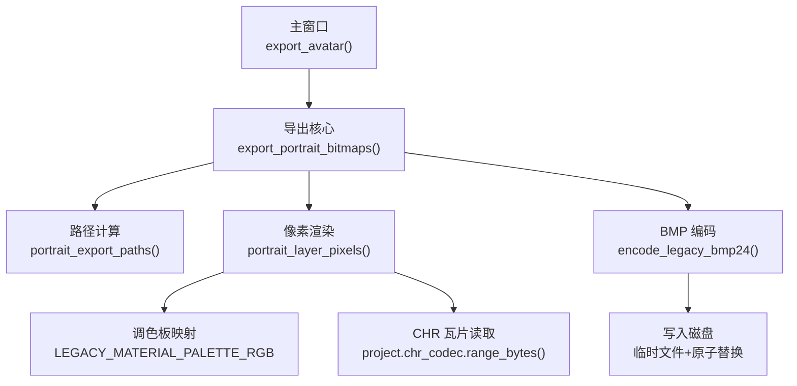
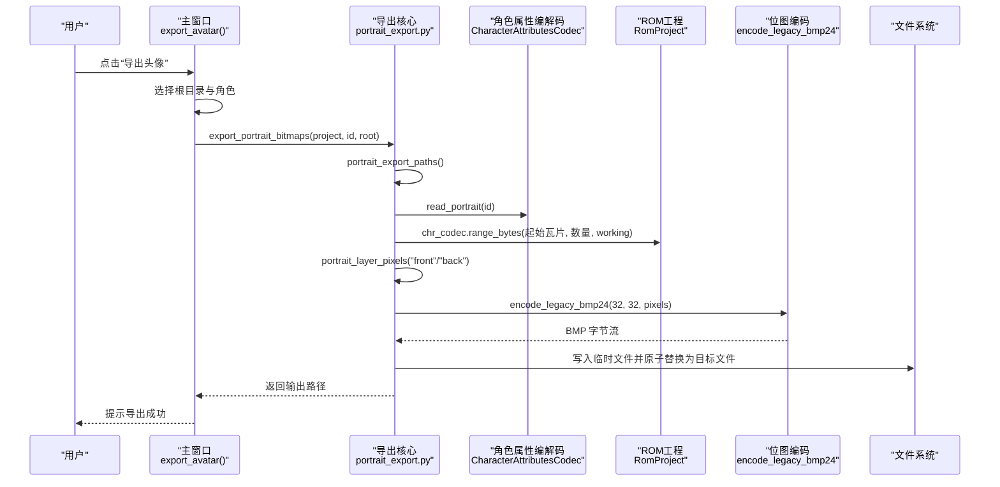
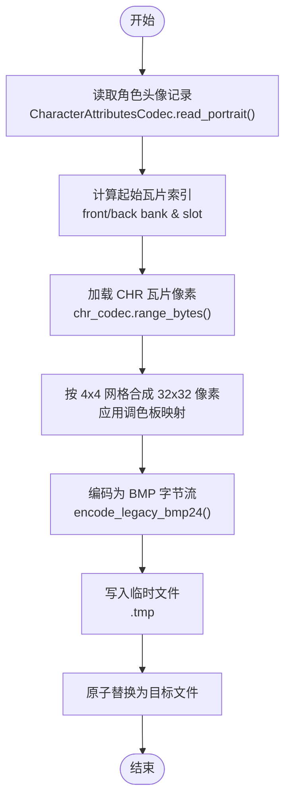
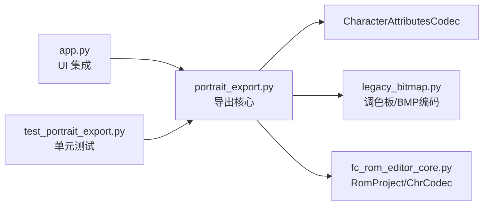

# 肖像导出工具

<cite>
**本文引用的文件**
- [portrait_export.py](file://src/dc_modifier/portrait_export.py)
- [app.py](file://src/dc_modifier/app.py)
- [database_records.py](file://src/dc_modifier/database_records.py)
- [test_portrait_export.py](file://tests/test_portrait_export.py)
- [legacy_bitmap.py](file://src/fc_editor/legacy_bitmap.py)
- [fc_rom_editor_core.py](file://src/fc_rom_editor_core.py)
</cite>

## 目录
1. [简介](#简介)
2. [项目结构](#项目结构)
3. [核心组件](#核心组件)
4. [架构总览](#架构总览)
5. [详细组件分析](#详细组件分析)
6. [依赖关系分析](#依赖关系分析)
7. [性能考虑](#性能考虑)
8. [故障排查指南](#故障排查指南)
9. [结论](#结论)
10. [附录](#附录)

## 简介
本工具用于从 FC（NES）ROM 中提取角色肖像数据，并以位图格式输出。当前实现支持：
- 按角色 ID 导出正面与背面两张 32×32 像素的 BMP 图像
- 使用游戏内“旧材质调色板”进行颜色映射，确保视觉一致性
- 通过 UI 菜单选择单个角色进行导出；数据库记录页也提供快捷导出入口
- 自动创建以“数字ID：角色名”命名的子目录，并对文件名进行安全化处理，避免非法字符与保留名冲突

注意：当前版本仅输出 BMP 格式，未直接提供 JPG/PNG 等其它格式的转换选项。分辨率固定为 32×32，未提供动态调整能力。

## 项目结构
与肖像导出相关的代码主要分布在以下位置：
- 导出核心逻辑：src/dc_modifier/portrait_export.py
- 主程序 UI 集成：src/dc_modifier/app.py
- 数据库记录页集成：src/dc_modifier/database_records.py
- 位图编码与调色板：src/fc_editor/legacy_bitmap.py
- ROM 工程与 CHR 访问：src/fc_rom_editor_core.py
- 单元测试覆盖：tests/test_portrait_export.py

图表来源
- [app.py:687-729](file://src/dc_modifier/app.py#L687-L729)
- [portrait_export.py:33-92](file://src/dc_modifier/portrait_export.py#L33-L92)
- [legacy_bitmap.py:28-...](file://src/fc_editor/legacy_bitmap.py#L28-L...)
- [fc_rom_editor_core.py:462-...](file://src/fc_rom_editor_core.py#L462-L...)

章节来源
- [portrait_export.py:1-93](file://src/dc_modifier/portrait_export.py#L1-L93)
- [app.py:687-729](file://src/dc_modifier/app.py#L687-L729)
- [database_records.py:160-175](file://src/dc_modifier/database_records.py#L160-L175)
- [test_portrait_export.py:29-77](file://tests/test_portrait_export.py#L29-L77)

## 核心组件
- 路径与命名
  - safe_portrait_directory_name：生成“数字ID：角色名”的安全目录名，过滤非法字符并规避 Windows 保留名
  - portrait_export_paths：根据角色 ID 和根目录计算输出路径，返回背面与正面两个 BMP 的路径
- 像素渲染
  - portrait_layer_pixels：将 4×4 个 8×8 的 CHR 瓦片拼成 32×32 像素矩阵，并使用旧材质调色板映射颜色
  - 通过 CharacterAttributesCodec 读取角色头像的银行与槽位信息，定位起始瓦片索引
- 位图编码与导出
  - portrait_bitmap_bytes：调用 encode_legacy_bmp24 将像素序列编码为 BMP 字节流
  - export_portrait_bitmaps：先计算路径，再分别渲染正、背面像素并写入磁盘；采用临时文件 + replace 的原子写入策略，避免部分写入导致损坏

章节来源
- [portrait_export.py:24-92](file://src/dc_modifier/portrait_export.py#L24-L92)
- [legacy_bitmap.py:28-...](file://src/fc_editor/legacy_bitmap.py#L28-L...)

## 架构总览
下图展示了从用户触发到最终落盘的完整流程，包括 UI 层、导出核心、ROM 数据读取与位图编码。

图表来源
- [app.py:687-729](file://src/dc_modifier/app.py#L687-L729)
- [portrait_export.py:33-92](file://src/dc_modifier/portrait_export.py#L33-L92)
- [fc_rom_editor_core.py:462-...](file://src/fc_rom_editor_core.py#L462-L...)

## 详细组件分析

### 导出核心模块（portrait_export.py）
- 关键常量与配置
  - PORTRAIT_SIZE = 32，PORTRAIT_TILE_COUNT = 16，表示 32×32 像素由 16 个 8×8 瓦片组成
  - PORTRAIT_FILENAMES 定义输出文件名：“[背面].bmp”、“[正面].bmp”
- 安全命名
  - safe_portrait_directory_name：清理非法字符，处理 Windows 保留名（如 CON、PRN 等），保证目录名合法
- 路径计算
  - portrait_export_paths：基于角色显示名与安全规则生成目录，并返回正、背面 BMP 的绝对路径
- 像素渲染
  - portrait_layer_pixels：依据角色记录的 front/back bank 与 slot 计算起始瓦片，读取 CHR 瓦片像素，按 4×4 网格布局合成 32×32 像素矩阵，并通过 LEGACY_MATERIAL_PALETTE_RGB 映射颜色
- 位图编码与导出
  - portrait_bitmap_bytes：封装 encode_legacy_bmp24，生成标准 BMP 字节流
  - export_portrait_bitmaps：批量渲染正、背面，创建目录，使用临时文件写入后原子替换，返回输出路径

图表来源
- [portrait_export.py:42-92](file://src/dc_modifier/portrait_export.py#L42-L92)
- [legacy_bitmap.py:28-...](file://src/fc_editor/legacy_bitmap.py#L28-L...)

章节来源
- [portrait_export.py:1-93](file://src/dc_modifier/portrait_export.py#L1-L93)

### 主程序 UI 集成（app.py）
- 菜单入口：在“数据”菜单中注册“导出头像(&L)”动作
- 交互流程：
  - 弹出目录选择对话框，默认导出路径位于工程目录下的“头像导出”子目录
  - 弹出角色选择列表，格式为“三位编号 · 角色名”，范围来自 project.profile.character_name_count
  - 若目标目录已存在同名文件，会提示是否覆盖
  - 调用 export_portrait_bitmaps 完成导出，并在状态栏提示结果
- 错误处理：捕获异常并通过消息框提示失败原因

章节来源
- [app.py:410-459](file://src/dc_modifier/app.py#L410-L459)
- [app.py:687-729](file://src/dc_modifier/app.py#L687-L729)

### 数据库记录页集成（database_records.py）
- 在人物记录页提供“导出头像”按钮，便于在编辑人物时快速导出当前角色的肖像
- 流程：
  - 选择导出根目录
  - 提交待处理的修改（commit_pending_changes）
  - 调用 export_portrait_bitmaps 导出当前 current_id 的正、背面 BMP
  - 在记录控件上显示导出的文件名作为提示

章节来源
- [database_records.py:160-175](file://src/dc_modifier/database_records.py#L160-L175)

### 位图与调色板（legacy_bitmap.py）
- 提供旧材质调色板 LEGACY_MATERIAL_PALETTE_RGB，确保导出图像的色值与游戏内一致
- encode_legacy_bmp24：将像素元组编码为标准 24 位 BMP 字节流

章节来源
- [legacy_bitmap.py:28-...](file://src/fc_editor/legacy_bitmap.py#L28-L...)

### ROM 工程与 CHR 访问（fc_rom_editor_core.py）
- RomProject 提供对 ROM 工作内存的只读访问与资源分配管理
- 通过 chr_codec.range_bytes 批量读取指定范围的 CHR 瓦片数据，供头像渲染使用

章节来源
- [fc_rom_editor_core.py:462-...](file://src/fc_rom_editor_core.py#L462-L...)

## 依赖关系分析
- 导出核心依赖：
  - CharacterAttributesCodec：读取角色头像的银行与槽位信息
  - legacy_bitmap：调色板与 BMP 编码
  - RomProject/ChrCodec：读取 CHR 瓦片像素
- UI 层依赖：
  - QFileDialog/QInputDialog：选择目录与角色
  - QMessageBox：覆盖确认与错误提示
- 测试覆盖：
  - 验证路径命名、像素渲染正确性、BMP 头信息与尺寸、不修改 ROM 工作内存等

图表来源
- [app.py:687-729](file://src/dc_modifier/app.py#L687-L729)
- [portrait_export.py:1-93](file://src/dc_modifier/portrait_export.py#L1-L93)
- [test_portrait_export.py:29-77](file://tests/test_portrait_export.py#L29-L77)

章节来源
- [test_portrait_export.py:29-77](file://tests/test_portrait_export.py#L29-L77)

## 性能考虑
- 渲染复杂度：每张头像渲染 16 个 8×8 瓦片，像素操作次数约为 32×32=1024，时间复杂度 O(1)，开销极低
- I/O 优化：采用临时文件 + 原子替换，避免部分写入导致的文件损坏；批量写入正、背面两张图
- 内存占用：像素数组与 BMP 字节流均为小对象，内存占用可忽略
- 建议：
  - 如需批量导出多角色，可在 UI 层扩展循环调用 export_portrait_bitmaps，或自行编写脚本遍历角色 ID 范围
  - 若需提升吞吐，可将多次导出合并为一次批处理，减少目录创建与 I/O 同步次数

## 故障排查指南
- 无法打开 ROM 或工程
  - 现象：启动时报错或无法载入
  - 排查：确认 ROM 是否为兼容的基准哈希；检查工程文件是否有效
  - 参考：app.py 中的 load_rom/open_project_dialog 错误处理
- 导出失败
  - 现象：弹出“导出头像失败”
  - 排查：检查目标目录是否存在写权限；确认选择的角色 ID 是否在有效范围内
  - 参考：app.py:687-729 的 try/except 包裹
- 输出文件被覆盖
  - 现象：提示是否覆盖已有头像文件
  - 处理：选择“是”则覆盖，“否”则取消导出
  - 参考：app.py:712-721 的覆盖确认逻辑
- 像素颜色不正确
  - 现象：导出图像颜色与游戏内不一致
  - 排查：确认使用了 LEGACY_MATERIAL_PALETTE_RGB 进行映射；检查 CHR 瓦片是否正确加载
  - 参考：portrait_export.py:42-64 的渲染逻辑与 legacy_bitmap.py 的调色板
- 文件名或目录名异常
  - 现象：目录名包含非法字符或被系统拒绝
  - 排查：safe_portrait_directory_name 已过滤非法字符并规避保留名；检查输入的角色名是否含特殊符号
  - 参考：portrait_export.py:24-30

章节来源
- [app.py:687-729](file://src/dc_modifier/app.py#L687-L729)
- [portrait_export.py:24-64](file://src/dc_modifier/portrait_export.py#L24-L64)
- [legacy_bitmap.py:28-...](file://src/fc_editor/legacy_bitmap.py#L28-L...)

## 结论
该肖像导出工具提供了稳定、安全的单角色头像导出能力，能够准确还原游戏内的像素与配色，并以 BMP 格式输出。当前版本聚焦于单角色导出与基础命名安全化，尚未提供批量导出、格式转换与分辨率调整等功能。若需扩展，可在 UI 层增加批量选择与循环导出，或在导出核心中接入其他图像编码器以实现 JPG/PNG 输出。

## 附录
- 使用步骤（单角色导出）
  - 在主窗口中选择“数据 → 导出头像”
  - 选择导出根目录（默认位于工程下的“头像导出”）
  - 在角色列表中选择目标角色（格式为“编号 · 名称”）
  - 若目标目录已有同名文件，确认是否覆盖
  - 等待导出完成，状态栏提示“头像已导出：目录名（2 个 BMP）”
- 输出结构示例
  - 根目录/“数字ID：角色名”/[背面].bmp
  - 根目录/“数字ID：角色名”/[正面].bmp
- 相关测试要点
  - 路径命名符合预期且仅清理组件部分
  - 像素渲染遵循 4×4 瓦片绑定与调色板映射
  - 导出的 BMP 文件大小、头部信息与尺寸正确
  - 导出过程不修改 ROM 工作内存

章节来源
- [test_portrait_export.py:33-77](file://tests/test_portrait_export.py#L33-L77)
- [portrait_export.py:12-15](file://src/dc_modifier/portrait_export.py#L12-L15)