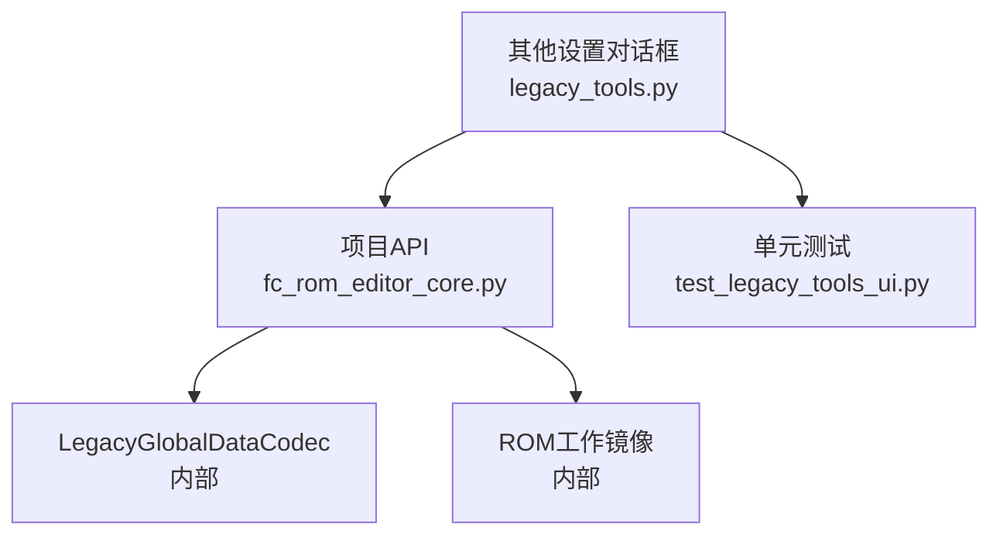
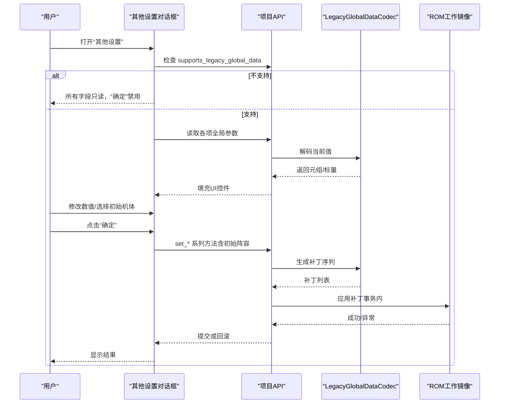
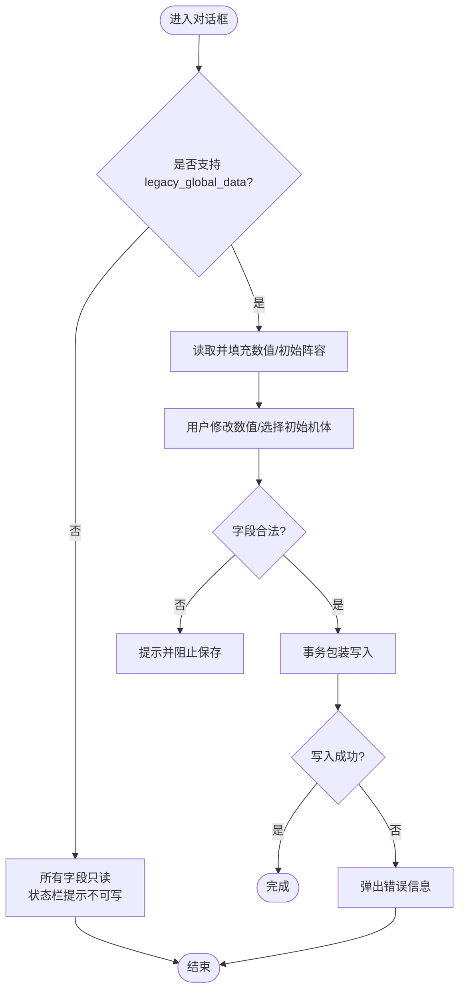
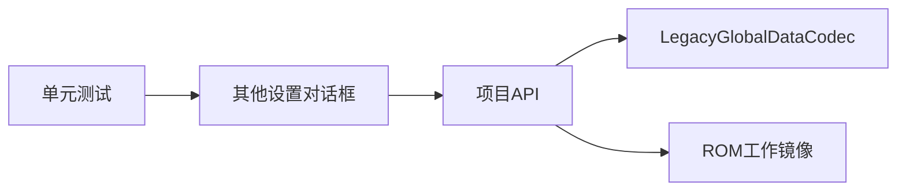

# 其他设置对话框

<cite>
**本文引用的文件**
- [legacy_tools.py](file://src/dc_modifier/legacy_tools.py)
- [fc_rom_editor_core.py](file://src/fc_rom_editor_core.py)
- [test_legacy_tools_ui.py](file://tests/test_legacy_tools_ui.py)
</cite>

## 目录
1. [简介](#简介)
2. [项目结构](#项目结构)
3. [核心组件](#核心组件)
4. [架构总览](#架构总览)
5. [详细组件分析](#详细组件分析)
6. [依赖关系分析](#依赖关系分析)
7. [性能考虑](#性能考虑)
8. [故障排查指南](#故障排查指南)
9. [结论](#结论)
10. [附录：操作步骤与参数说明](#附录：操作步骤与参数说明)

## 简介
本章节面向“其他设置对话框”的全局参数编辑功能，重点说明以下能力：
- 双击公式、伤害计算公式、命中计算公式的参数配置界面与数值输入框布局、验证机制。
- 道具相关修改功能，尤其是“超合金Z防御增加”等11项道具效果参数的设置。
- 初始机体配置的展示与管理方式（人物ID与机体ID的配对）。
- 只读模式的实现：当项目不支持 legacy_global_data 时，所有编辑字段置为只读，且“确定”按钮禁用。
- 参数验证规则与错误处理机制。
- 与游戏引擎的集成方式（通过项目对象的编解码器生成ROM补丁并应用）。
- 性能考量与最佳实践建议。

## 项目结构
“其他设置对话框”位于 dc_modifier 模块中，负责UI构建与用户交互；全局参数读写由 fc_rom_editor_core 提供统一接口，底层通过 LegacyGlobalDataCodec 将数值转换为ROM补丁并安全写入工作镜像。测试用例覆盖事务描述与撤销语义。

图表来源
- [legacy_tools.py:750-960](file://src/dc_modifier/legacy_tools.py#L750-L960)
- [fc_rom_editor_core.py:960-1159](file://src/fc_rom_editor_core.py#L960-L1159)
- [test_legacy_tools_ui.py:295-297](file://tests/test_legacy_tools_ui.py#L295-L297)

章节来源
- [legacy_tools.py:750-960](file://src/dc_modifier/legacy_tools.py#L750-L960)
- [fc_rom_editor_core.py:960-1159](file://src/fc_rom_editor_core.py#L960-L1159)
- [test_legacy_tools_ui.py:295-297](file://tests/test_legacy_tools_ui.py#L295-L297)

## 核心组件
- 对话框类：负责创建分组、数值输入控件、下拉选择控件、状态提示与按钮行为。
- 项目API：提供读取/写入全局参数的方法，并在支持时才允许写入。
- 编解码器：将高层参数映射到ROM偏移与补丁序列，确保可逆与一致性校验。

关键职责划分：
- UI层：仅负责展示与收集用户输入，不直接操作ROM。
- 项目层：封装数据访问与补丁生成，保证事务性与一致性。
- 编码层：定义具体字段的偏移与格式，是“与引擎集成”的关键点。

章节来源
- [legacy_tools.py:750-960](file://src/dc_modifier/legacy_tools.py#L750-L960)
- [fc_rom_editor_core.py:960-1159](file://src/fc_rom_editor_core.py#L960-L1159)

## 架构总览
下图展示了从用户操作到ROM写入的完整流程，包括只读模式判断、参数收集、事务包装与补丁应用。

图表来源
- [legacy_tools.py:775-960](file://src/dc_modifier/legacy_tools.py#L775-L960)
- [fc_rom_editor_core.py:960-1159](file://src/fc_rom_editor_core.py#L960-L1159)

## 详细组件分析

### 全局参数编辑对话框
- 布局与分组
  - 双击公式：包含3个数值输入框（我方双击判定常量、敌方双击判定常量、双击速度差常量）。
  - 伤害计算公式：包含5个数值输入框（强度系数、武器火力系数、攻击合计除数、防御系数、防御除数），其中“攻击合计除数”和“防御除数”最小值为1，避免除以0。
  - 命中计算公式：包含1个数值输入框（命中判定阈值）。
  - 道具相关修改·超合金Z防御增加：包含11个数值输入框，分别对应不同道具的效果增量或消耗调整，如“超合金Z：防御增加”“磁性涂层：速度增加”“传感器：强度增加”“超合金C：HP增加”“超合金W：防御增加”“推进器：机动增加”“传感器2：强度增加”“M合金：速度增加”“电子护盾：HP增加”“正义：SP消耗”“治疗：SP消耗”。
  - 初始机体：6行×2列的组合框，偶数列为人物ID，奇数列为机体ID，默认值来自配置。
- 数值输入框与验证
  - 数值范围：默认0~0xFF，部分字段最小值设为1以避免非法计算。
  - 工具提示：每个字段均附带中文说明，便于理解其作用。
  - 只读模式：当项目不支持 legacy_global_data 时，所有输入框强制只读，状态栏提示“当前ROM配置没有已验证的全局参数地址”，“确定”按钮禁用。
- 保存与事务
  - 点击“确定”后，将所有数值与初始阵容打包，使用项目事务“其他全局参数”一次性写入，失败则弹出错误提示并中止。
  - 事务化写入确保多字段变更原子性，便于撤销与回滚。

图表来源
- [legacy_tools.py:775-960](file://src/dc_modifier/legacy_tools.py#L775-L960)
- [fc_rom_editor_core.py:960-1159](file://src/fc_rom_editor_core.py#L960-L1159)

章节来源
- [legacy_tools.py:750-960](file://src/dc_modifier/legacy_tools.py#L750-L960)
- [fc_rom_editor_core.py:960-1159](file://src/fc_rom_editor_core.py#L960-L1159)

### 只读模式实现
- 判断依据：项目对象暴露 supports_legacy_global_data 属性，若为False，则视为不支持。
- 表现：
  - 所有数值输入框与初始机体组合框设置为只读。
  - 状态栏显示只读提示，明确告知不会写入ROM。
  - “确定”按钮禁用，防止误操作。
- 目的：在未完成单变量差分验证前保护ROM不被意外修改。

章节来源
- [legacy_tools.py:775-795](file://src/dc_modifier/legacy_tools.py#L775-L795)
- [fc_rom_editor_core.py:960-966](file://src/fc_rom_editor_core.py#L960-L966)

### 初始机体配置展示与管理
- 展示：每行一对（人物ID、机体ID），共6行；偶数列为人物ID，奇数列为机体ID。
- 数据来源：从项目读取初始阵容，若ID不在当前配置范围内，会抛出错误提示。
- 管理：支持模式下，组合框启用并可更改；只读模式下禁用。

章节来源
- [legacy_tools.py:848-865](file://src/dc_modifier/legacy_tools.py#L848-L865)
- [legacy_tools.py:898-930](file://src/dc_modifier/legacy_tools.py#L898-L930)

### 与游戏引擎的集成方式
- 项目API提供统一的 get_* / set_* 方法，内部调用 LegacyGlobalDataCodec 进行编解码。
- 写入路径：set_* → 生成补丁序列 → 事务包装 → 应用到工作镜像。
- 读取路径：get_* → 从原始或工作镜像解码 → 返回给UI。
- 关键点：所有写入均在事务中进行，保证一致性与可撤销。

章节来源
- [fc_rom_editor_core.py:982-1159](file://src/fc_rom_editor_core.py#L982-L1159)

## 依赖关系分析
- UI层依赖项目API获取/设置全局参数。
- 项目API依赖LegacyGlobalDataCodec进行具体字段编解码。
- 测试覆盖事务描述与撤销语义，确保“其他全局参数”作为单一事务被记录。

图表来源
- [legacy_tools.py:750-960](file://src/dc_modifier/legacy_tools.py#L750-L960)
- [fc_rom_editor_core.py:960-1159](file://src/fc_rom_editor_core.py#L960-L1159)
- [test_legacy_tools_ui.py:295-297](file://tests/test_legacy_tools_ui.py#L295-L297)

章节来源
- [legacy_tools.py:750-960](file://src/dc_modifier/legacy_tools.py#L750-L960)
- [fc_rom_editor_core.py:960-1159](file://src/fc_rom_editor_core.py#L960-L1159)
- [test_legacy_tools_ui.py:295-297](file://tests/test_legacy_tools_ui.py#L295-L297)

## 性能考虑
- 批量写入：通过事务一次性应用多个补丁，减少多次I/O与校验开销。
- 最小化UI重绘：仅在加载与保存时刷新状态栏与控件状态。
- 只读模式：在未验证前禁止写入，避免不必要的计算与潜在错误。
- 建议：
  - 保持字段范围校验在UI层尽早拦截，减少无效请求。
  - 对大表（如距离命中修正表）采用分页或懒加载策略（若未来扩展）。
  - 在只读模式下仅做展示，不触发任何写路径。

[本节为通用指导，无需特定文件引用]

## 故障排查指南
- 现象：所有字段只读且无法保存
  - 原因：项目不支持 legacy_global_data（未通过验证）。
  - 处理：确认ROM已通过全局参数验证；或在支持后再尝试修改。
- 现象：保存时报错“无法应用全局参数”
  - 可能原因：字段值非法（如除数为0）、ROM内容变化导致补丁校验失败。
  - 处理：检查除数字段最小值是否为1；重新加载ROM或恢复原配置。
- 现象：初始机体ID不在范围内
  - 原因：选择的ID超出当前配置范围。
  - 处理：重新选择有效的人物/机体ID。

章节来源
- [legacy_tools.py:775-960](file://src/dc_modifier/legacy_tools.py#L775-L960)
- [fc_rom_editor_core.py:960-980](file://src/fc_rom_editor_core.py#L960-L980)

## 结论
“其他设置对话框”提供了直观的全局参数编辑界面，涵盖双击、伤害、命中公式以及道具效果与初始阵容配置。通过只读模式与事务化写入，既保障了ROM安全，又提升了用户体验。与引擎的集成通过项目API与编解码器解耦，便于维护与扩展。建议在后续迭代中继续完善字段校验提示与错误定位，以提升易用性与稳定性。

[本节为总结性内容，无需特定文件引用]

## 附录：操作步骤与参数说明

### 操作步骤
- 选择项目：确保已加载目标ROM并处于支持 legacy_global_data 的状态。
- 查看全局参数：打开“其他设置”对话框，查看各分组中的当前值。
- 修改数值（如支持）：在双击、伤害、命中公式及道具效果中输入新值；选择初始人物/机体ID。
- 保存配置：点击“确定”，系统将以“其他全局参数”为事务名称写入；取消则不修改ROM。

章节来源
- [legacy_tools.py:750-960](file://src/dc_modifier/legacy_tools.py#L750-L960)
- [test_legacy_tools_ui.py:295-297](file://tests/test_legacy_tools_ui.py#L295-L297)

### 参数含义与作用机制
- 双击公式
  - 我方双击判定常量：影响我方单位触发双击的条件。
  - 敌方双击判定常量：影响敌方单位触发双击的条件。
  - 双击速度差常量：基于速度差判定双击的阈值。
- 伤害计算公式
  - 强度系数：武器强度对伤害的贡献权重。
  - 武器火力系数：武器火力对伤害的贡献权重。
  - 攻击合计除数：攻击合计的除数，必须大于0。
  - 防御系数：防御对伤害减免的权重。
  - 防御除数：防御的除数，必须大于0。
- 命中计算公式
  - 命中判定阈值：决定命中与否的基准值。
- 道具相关修改·超合金Z防御增加（11项）
  - 超合金Z：防御增加
  - 磁性涂层：速度增加
  - 传感器：强度增加
  - 超合金C：HP增加
  - 超合金W：防御增加
  - 推进器：机动增加
  - 传感器2：强度增加
  - M合金：速度增加
  - 电子护盾：HP增加
  - 正义：SP消耗
  - 治疗：SP消耗
- 初始机体配置
  - 每行包含一个“人物ID + 机体ID”的配对，用于开局出击配置。

章节来源
- [legacy_tools.py:811-842](file://src/dc_modifier/legacy_tools.py#L811-L842)
- [legacy_tools.py:898-930](file://src/dc_modifier/legacy_tools.py#L898-L930)

### 与引擎集成的关键点
- 读取：通过项目API的 get_* 方法从原始或工作镜像解码。
- 写入：通过 set_* 方法生成补丁序列，并在事务中应用到工作镜像。
- 校验：写入前检查ROM内容是否变化，避免覆盖不一致的数据。

章节来源
- [fc_rom_editor_core.py:982-1159](file://src/fc_rom_editor_core.py#L982-L1159)