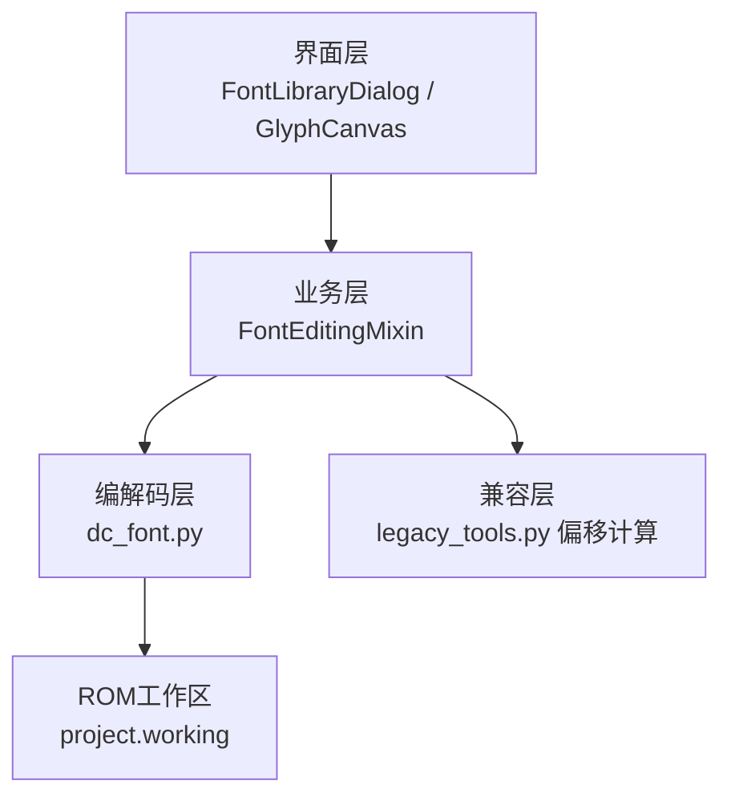
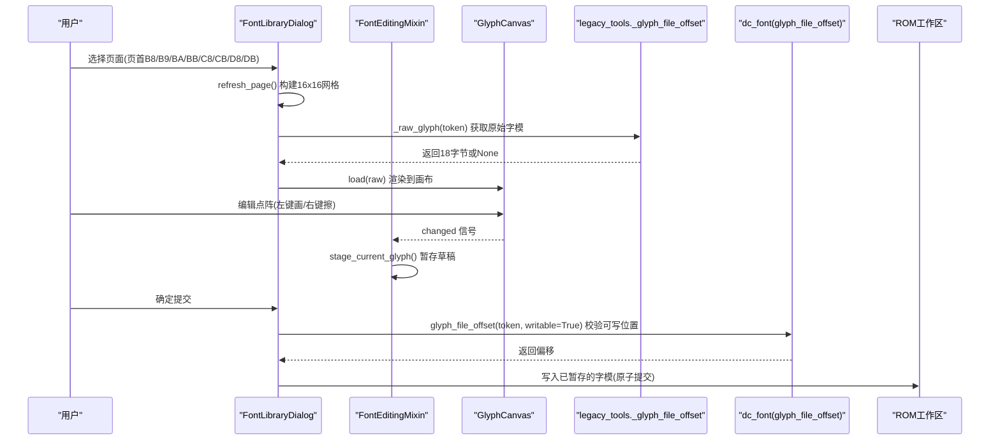
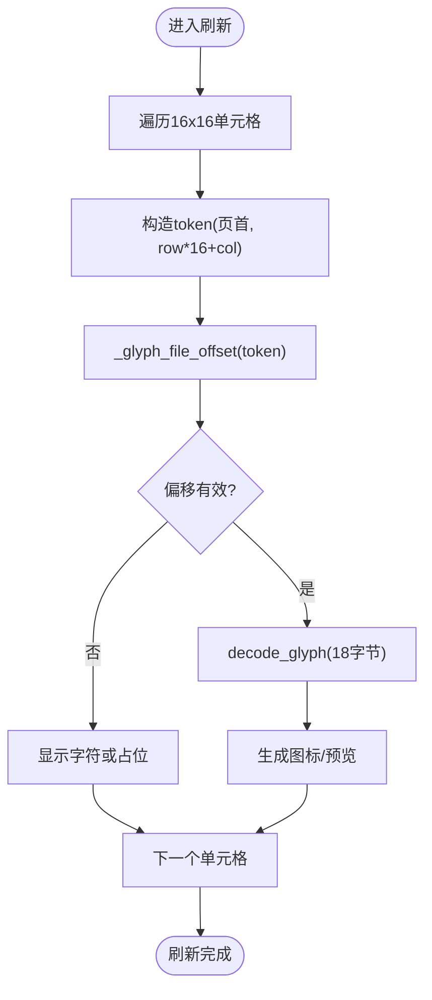
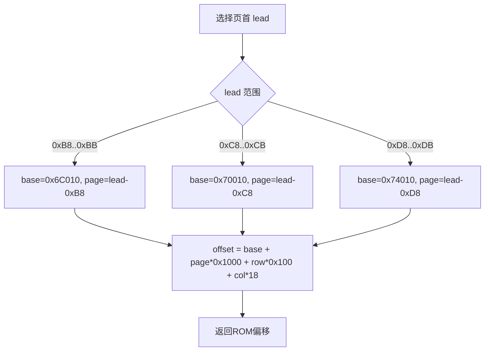
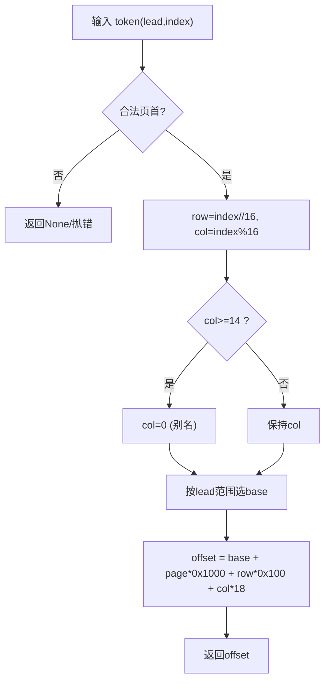
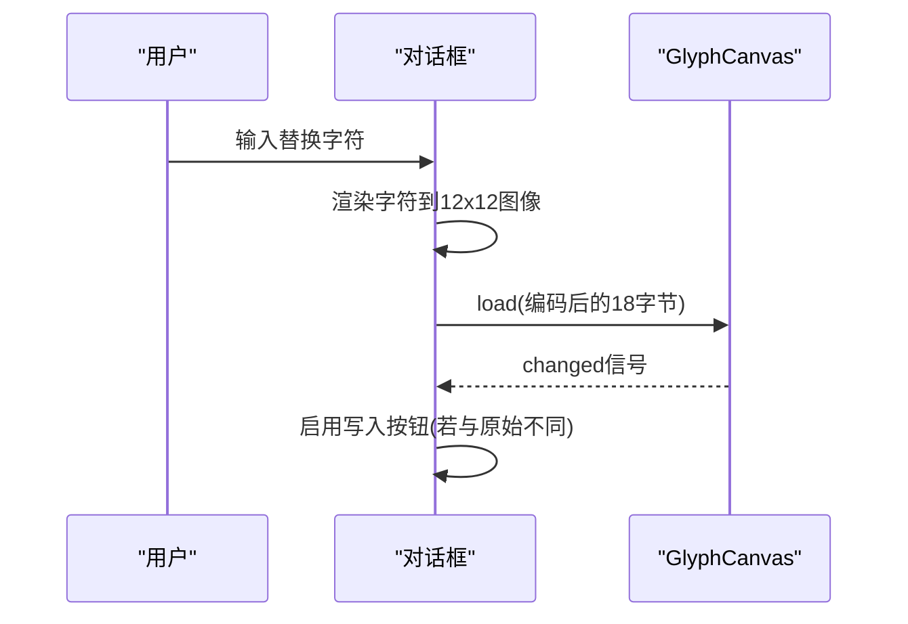
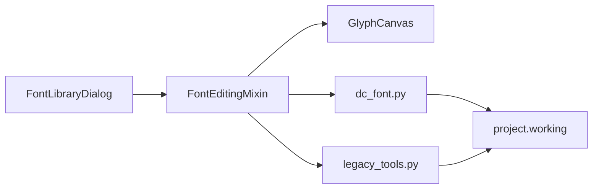

# 字库编辑对话框

<cite>
**本文引用的文件**
- [font_edit.py](file://src/dc_modifier/font_edit.py)
- [legacy_tools.py](file://src/dc_modifier/legacy_tools.py)
- [dc_font.py](file://src/fc_editor/codecs/dc_font.py)
</cite>

## 目录
1. [简介](#简介)
2. [项目结构](#项目结构)
3. [核心组件](#核心组件)
4. [架构总览](#架构总览)
5. [详细组件分析](#详细组件分析)
6. [依赖关系分析](#依赖关系分析)
7. [性能考虑](#性能考虑)
8. [故障排查指南](#故障排查指南)
9. [结论](#结论)
10. [附录：操作步骤](#附录操作步骤)

## 简介
本文件面向“字库编辑对话框”的实现与使用，聚焦以下要点：
- 16x16字体预览网格的显示逻辑（读取、渲染、显示）
- GLYPH_PAGE_LEADS 页面选择器的作用及页面对应的ROM地址范围（0xB8–0xBB、0xC8–0xCB、0xD8–0xDB）
- 字形文件偏移计算算法（_glyph_file_offset/glyph_file_offset），包括页码计算、行列定位与字节偏移
- 原始字形与替换字形的对比显示机制
- 字符代码与地址信息的实时显示
- 只读模式的安全限制与写入验证状态提示
- 具体操作步骤：选择页面→点击字形单元格→查看原始字形→输入替换字符→预览效果

## 项目结构
该功能由三层组成：
- 界面层：基于Qt的对话框与控件（表格、画布、按钮、状态栏等）
- 业务层：字形数据读写、草稿暂存、批量提交与校验
- 编解码层：固定大小12×12字模的编码/解码与页内布局规则

图表来源
- [font_edit.py:14-125](file://src/dc_modifier/font_edit.py#L14-L125)
- [legacy_tools.py:72-106](file://src/dc_modifier/legacy_tools.py#L72-L106)
- [dc_font.py:1-51](file://src/fc_editor/codecs/dc_font.py#L1-L51)

章节来源
- [font_edit.py:14-125](file://src/dc_modifier/font_edit.py#L14-L125)
- [legacy_tools.py:72-106](file://src/dc_modifier/legacy_tools.py#L72-L106)
- [dc_font.py:1-51](file://src/fc_editor/codecs/dc_font.py#L1-L51)

## 核心组件
- 字形画布 GlyphCanvas：12×12点阵编辑与绘制，支持左键画点、右键擦除，拖动连续编辑；将像素矩阵编码为18字节原始字模。
- 字体编辑混入 FontEditingMixin：负责初始化编辑UI、加载当前字模、暂存修改、批量提交与冲突检测、导入导出单页点阵。
- 字库对话框 FontLibraryDialog：16×16网格预览、页面选择器、原始/替换字形对比、字符代码与地址信息展示、只读/可写状态控制。
- 偏移计算与编解码：legacy_tools._glyph_file_offset 与 dc_font.glyph_file_offset 提供ROM偏移计算；decode_glyph/encode_glyph 完成点阵与二进制转换。

章节来源
- [font_edit.py:14-125](file://src/dc_modifier/font_edit.py#L14-L125)
- [font_edit.py:131-185](file://src/dc_modifier/font_edit.py#L131-L185)
- [font_edit.py:187-273](file://src/dc_modifier/font_edit.py#L187-L273)
- [legacy_tools.py:72-106](file://src/dc_modifier/legacy_tools.py#L72-L106)
- [dc_font.py:16-51](file://src/fc_editor/codecs/dc_font.py#L16-L51)

## 架构总览

图表来源
- [legacy_tools.py:72-90](file://src/dc_modifier/legacy_tools.py#L72-L90)
- [dc_font.py:16-30](file://src/fc_editor/codecs/dc_font.py#L16-L30)
- [font_edit.py:113-185](file://src/dc_modifier/font_edit.py#L113-L185)
- [font_edit.py:251-264](file://src/dc_modifier/font_edit.py#L251-L264)

## 详细组件分析

### 16x16字体预览网格：读取、渲染与显示
- 网格模型：16行×16列，每格对应一个双字节token（页首+索引）。E/F列（索引≥14）为第0列别名，不可独立编辑。
- 读取流程：根据当前页面页首与行列计算token，调用偏移函数得到ROM偏移，从project.working中读取18字节原始字模。
- 渲染流程：将18字节解码为12×12像素矩阵，生成图标或绘制到画布；同时显示字符映射（若有）。
- 显示信息：每个单元格tooltip包含token十六进制与字符映射；右侧表单实时显示“文字/文字代码/文字地址”。

图表来源
- [legacy_tools.py:72-90](file://src/dc_modifier/legacy_tools.py#L72-L90)
- [dc_font.py:33-37](file://src/fc_editor/codecs/dc_font.py#L33-L37)
- [font_edit.py:244-262](file://src/dc_modifier/font_edit.py#L244-L262)

章节来源
- [legacy_tools.py:72-90](file://src/dc_modifier/legacy_tools.py#L72-L90)
- [dc_font.py:33-37](file://src/fc_editor/codecs/dc_font.py#L33-L37)
- [font_edit.py:244-262](file://src/dc_modifier/font_edit.py#L244-L262)

### GLYPH_PAGE_LEADS 页面选择器与ROM地址范围
- 支持的页首集合：0xB8、0xB9、0xBA、0xBB、0xC8、0xC9、0xCA、0xCB、0xD8、0xD9、0xDA、0xDB。
- 页面对应ROM基址：
  - 0xB8–0xBB → 基址 0x6C010
  - 0xC8–0xCB → 基址 0x70010
  - 0xD8–0xDB → 基址 0x74010
- 页内布局：每页16行×14个有效字模（E/F列为第0列别名），每个字模18字节。

图表来源
- [legacy_tools.py:72-90](file://src/dc_modifier/legacy_tools.py#L72-L90)
- [dc_font.py:16-24](file://src/fc_editor/codecs/dc_font.py#L16-L24)

章节来源
- [legacy_tools.py:72-90](file://src/dc_modifier/legacy_tools.py#L72-L90)
- [dc_font.py:16-24](file://src/fc_editor/codecs/dc_font.py#L16-L24)

### 字形文件偏移计算算法（_glyph_file_offset / glyph_file_offset）
- 输入：双字节token（页首+索引）
- 步骤：
  1) 校验token长度与页首是否在GLYPH_PAGE_LEADS范围内
  2) 计算页号page与行列(row, column)
  3) 若column≥14（E/F列），视为第0列别名（只读/不独立编辑）
  4) 根据页首范围选择基址base
  5) 计算最终偏移：base + page*0x1000 + row*0x100 + (column<14?column:0)*18
- 输出：ROM文件偏移；非法输入返回None或抛出异常（可写模式下对E/F列有额外保护）

图表来源
- [legacy_tools.py:72-90](file://src/dc_modifier/legacy_tools.py#L72-L90)
- [dc_font.py:16-24](file://src/fc_editor/codecs/dc_font.py#L16-L24)

章节来源
- [legacy_tools.py:72-90](file://src/dc_modifier/legacy_tools.py#L72-L90)
- [dc_font.py:16-24](file://src/fc_editor/codecs/dc_font.py#L16-L24)

### 原始字形与替换字形的对比显示
- 原始字形：从ROM读取18字节并解码为12×12点阵，在左侧预览。
- 替换字形：通过系统字体渲染单个字符到12×12图像，再编码为18字节，在右侧预览。
- 交互：输入替换字符后即时更新右侧预览；当画布编辑完成后，写入按钮可用；确认后才暂存到草稿。

图表来源
- [font_edit.py:131-153](file://src/dc_modifier/font_edit.py#L131-L153)
- [font_edit.py:127-130](file://src/dc_modifier/font_edit.py#L127-L130)

章节来源
- [font_edit.py:131-153](file://src/dc_modifier/font_edit.py#L131-L153)
- [font_edit.py:127-130](file://src/dc_modifier/font_edit.py#L127-L130)

### 字符代码与地址信息的实时显示
- 字符代码：当前token的十六进制表示，随单元格选择实时更新。
- 文字地址：通过偏移函数计算的ROM偏移，以十六进制形式显示。
- 文本映射：若token在文本表中存在映射，则显示对应字符；否则显示“未映射”。

章节来源
- [legacy_tools.py:196-210](file://src/dc_modifier/legacy_tools.py#L196-L210)
- [legacy_tools.py:228-242](file://src/dc_modifier/legacy_tools.py#L228-L242)
- [font_edit.py:244-262](file://src/dc_modifier/font_edit.py#L244-L262)

### 只读模式的安全限制与写入验证状态提示
- 只读模式：当工程配置未经验证或不在支持列表中时，所有写入相关按钮禁用，状态栏提示“仅预览”。
- 可写模式：仅在支持的项目配置下启用；打开对话框时会预读本页所有字模作为期望值，提交时进行冲突检测，避免覆盖他人修改。
- 状态提示：状态栏会显示“已暂存X个字模”、“E/F列引用同一行0列，请在0列编辑”或“当前ROM的字模写入布局未经验证，仅预览”。

章节来源
- [font_edit.py:61-125](file://src/dc_modifier/font_edit.py#L61-L125)
- [font_edit.py:251-264](file://src/dc_modifier/font_edit.py#L251-L264)
- [legacy_tools.py:186-210](file://src/dc_modifier/legacy_tools.py#L186-L210)

## 依赖关系分析
- 界面与业务耦合：FontLibraryDialog组合FontEditingMixin，复用通用编辑能力；GlyphCanvas提供点阵编辑与渲染。
- 业务与底层：FontEditingMixin依赖dc_font的编解码与偏移计算；兼容层legacy_tools提供历史偏移实现。
- 外部依赖：PySide6用于UI与绘图；项目对象project.working提供ROM工作区。

图表来源
- [font_edit.py:14-125](file://src/dc_modifier/font_edit.py#L14-L125)
- [legacy_tools.py:72-106](file://src/dc_modifier/legacy_tools.py#L72-L106)
- [dc_font.py:16-51](file://src/fc_editor/codecs/dc_font.py#L16-L51)

章节来源
- [font_edit.py:14-125](file://src/dc_modifier/font_edit.py#L14-L125)
- [legacy_tools.py:72-106](file://src/dc_modifier/legacy_tools.py#L72-L106)
- [dc_font.py:16-51](file://src/fc_editor/codecs/dc_font.py#L16-L51)

## 性能考虑
- 渲染优化：12×12小图标的生成与缓存可减少重绘开销；网格刷新时使用信号屏蔽减少事件风暴。
- 批量操作：导入/导出整页点阵时按页处理，避免逐字模频繁I/O。
- 内存占用：每次刷新仅加载当前页可见区域，避免全量加载。

[本节为通用指导，不直接分析具体文件]

## 故障排查指南
- 无法写入：检查是否处于只读模式（不支持的配置或未经验证）；确认当前列不是E/F别名列。
- 提交失败：可能与其他编辑器并发修改冲突；需重新打开对话框以避免覆盖新数据。
- 预览异常：确认所选字体包含该字符；否则回退到点阵编辑。
- 偏移错误：确认token页首在GLYPH_PAGE_LEADS范围内；E/F列需编辑第0列。

章节来源
- [font_edit.py:155-162](file://src/dc_modifier/font_edit.py#L155-L162)
- [font_edit.py:251-264](file://src/dc_modifier/font_edit.py#L251-L264)
- [dc_font.py:16-24](file://src/fc_editor/codecs/dc_font.py#L16-L24)

## 结论
字库编辑对话框通过清晰的三层架构实现了安全、直观的字形编辑体验：界面层提供16×16网格与对比预览；业务层管理草稿与提交；编解码层确保12×12字模的正确格式与ROM布局。页面选择器与偏移计算保证了跨页访问的准确性，只读模式与冲突检测保障了ROM数据安全。

[本节为总结性内容，不直接分析具体文件]

## 附录：操作步骤
- 选择页面：在“字段选择”下拉框中选择目标页首（如0xC8）。
- 点击字形单元格：在16×16网格中点击目标单元格，右侧显示原始字形与字符代码/地址。
- 查看原始字形：左侧预览显示ROM中的原始12×12点阵。
- 输入替换字符：在“替换字符”框输入单字符，右侧即时预览系统字体生成的字形。
- 预览效果：确认无误后点击“写入文字”暂存；如需批量替换或清空，可使用相应按钮；最后点击“确定”提交，取消则丢弃草稿。

章节来源
- [legacy_tools.py:156-210](file://src/dc_modifier/legacy_tools.py#L156-L210)
- [font_edit.py:131-185](file://src/dc_modifier/font_edit.py#L131-L185)
- [font_edit.py:251-264](file://src/dc_modifier/font_edit.py#L251-L264)