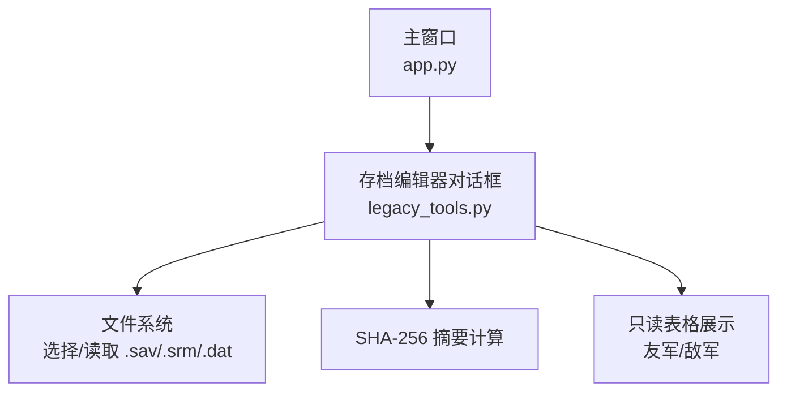
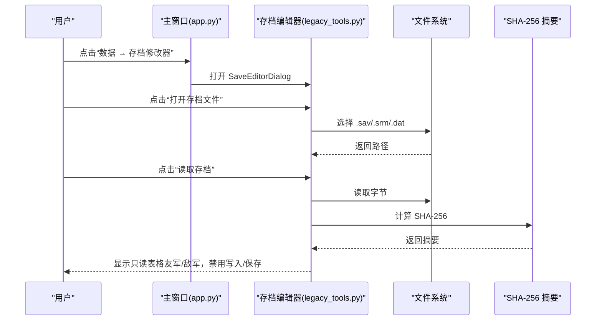
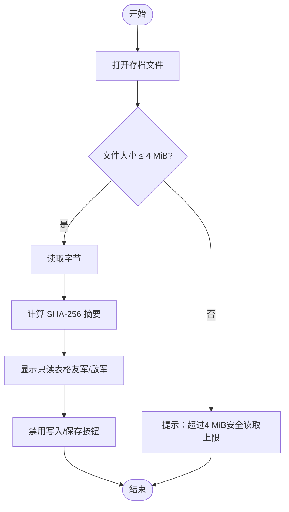
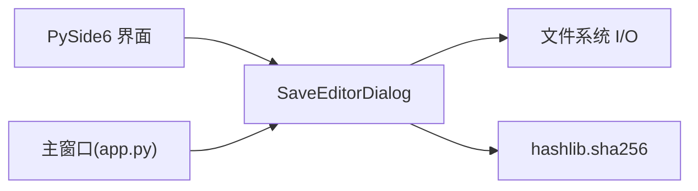

# 存档编辑器

<cite>
**本文引用的文件**
- [src/dc_modifier/legacy_tools.py](file://src/dc_modifier/legacy_tools.py)
- [src/dc_modifier/app.py](file://src/dc_modifier/app.py)
- [src/fc_rom_editor_core.py](file://src/fc_rom_editor_core.py)
</cite>

## 目录
1. [简介](#简介)
2. [项目结构](#项目结构)
3. [核心组件](#核心组件)
4. [架构总览](#架构总览)
5. [详细组件分析](#详细组件分析)
6. [依赖关系分析](#依赖关系分析)
7. [性能与安全考虑](#性能与安全考虑)
8. [故障排查指南](#故障排查指南)
9. [结论](#结论)
10. [附录：文件格式与调试建议](#附录文件格式与调试建议)

## 简介
本文件面向“存档编辑器”的完整生命周期管理与安全限制，聚焦以下目标：
- 说明存档文件的打开、读取、写入流程，明确文件大小限制（4 MiB）与 SHA-256 校验机制。
- 解释只读模式的实现原因：由于存档编解码器尚未验证，写入和保存功能保持禁用。
- 详细说明友军与敌军表格的数据结构与字段定义（序号、人物、机体、等级、机动、强度、防御、速度、HP、EXP/金钱、双击速度）。
- 解释关卡选择器的作用与存档槽位管理。
- 给出完整操作流程：选择存档文件→点击“读取存档”→查看数据→（受限）尝试修改。
- 强调数据安全保护措施与错误处理机制。
- 提供存档文件格式分析与调试方法，以及未来扩展规划建议。

## 项目结构
与存档编辑器直接相关的代码主要位于 dc_modifier 模块中，并通过主程序入口暴露为工具对话框：
- 存档编辑器对话框：SaveEditorDialog（只读预览、安全限制、SHA-256 摘要显示）
- 主窗口菜单项：通过 app.py 暴露“存档修改器”入口
- ROM 工程核心：RomProject（用于其他编辑能力；存档编辑器当前不依赖其写入能力）

图表来源
- [src/dc_modifier/app.py:400-485](file://src/dc_modifier/app.py#L400-L485)
- [src/dc_modifier/legacy_tools.py:637-728](file://src/dc_modifier/legacy_tools.py#L637-L728)

章节来源
- [src/dc_modifier/app.py:400-485](file://src/dc_modifier/app.py#L400-L485)
- [src/dc_modifier/legacy_tools.py:637-728](file://src/dc_modifier/legacy_tools.py#L637-L728)

## 核心组件
- SaveEditorDialog：实现“打开存档文件”“读取存档”“写入/保存”按钮的状态控制与只读提示，内置 4 MiB 大小限制与 SHA-256 摘要计算。
- MainWindow（app.py）：在“数据”菜单中提供“存档修改器”入口，调用 SaveEditorDialog。
- RomProject（fc_rom_editor_core.py）：ROM 工程对象，提供 ROM 加载、校验、事务与撤销重做等能力；当前存档编辑器仅作为独立工具使用，不直接写入存档。

章节来源
- [src/dc_modifier/legacy_tools.py:637-728](file://src/dc_modifier/legacy_tools.py#L637-L728)
- [src/dc_modifier/app.py:400-485](file://src/dc_modifier/app.py#L400-L485)
- [src/fc_rom_editor_core.py:463-785](file://src/fc_rom_editor_core.py#L463-L785)

## 架构总览
下图展示了从主窗口进入存档编辑器，到打开并读取存档文件的交互流程，以及只读模式下的状态约束。

图表来源
- [src/dc_modifier/app.py:400-485](file://src/dc_modifier/app.py#L400-L485)
- [src/dc_modifier/legacy_tools.py:637-728](file://src/dc_modifier/legacy_tools.py#L637-L728)

## 详细组件分析

### 存档编辑器对话框（SaveEditorDialog）
- 文件生命周期
  - 打开：通过 QFileDialog 选择 .sav/.srm/.dat 文件，记录路径。
  - 读取：读取文件字节，进行 4 MiB 安全上限检查，计算 SHA-256 摘要并在状态栏显示前缀。
  - 写入/保存：默认禁用，tooltip 提示“存档编解码器尚未验证，禁止写入”。
- 只读模式实现
  - 所有输入控件（数值框）设置为只读。
  - 友军/敌军表格设置为不可编辑（NoEditTriggers）。
  - 写入与保存按钮初始禁用，且 tooltip 明确说明原因。
- 关卡选择器与槽位管理
  - 槽位下拉：固定 3 个槽位（1/2/3），用于标识不同存档位置。
  - 关卡下拉：1–32 关，便于后续扩展时按关卡筛选或定位数据。
- 数据结构（表格列）
  - 友军表头：序号、人物、机体、等级、机动、强度、防御、速度、HP、EXP、双击速度
  - 敌军表头：序号、人物、机体、等级、机动、强度、防御、速度、HP、金钱、双击速度
- 错误处理
  - 超过 4 MiB：抛出异常并提示“存档文件超过4 MiB安全读取上限”。
  - 未选择文件：读取操作直接返回，避免空指针。
  - 状态栏持续提示只读原因与当前进度。

图表来源
- [src/dc_modifier/legacy_tools.py:637-728](file://src/dc_modifier/legacy_tools.py#L637-L728)

章节来源
- [src/dc_modifier/legacy_tools.py:637-728](file://src/dc_modifier/legacy_tools.py#L637-L728)

### 主窗口入口（MainWindow）
- 在“数据”菜单中提供“存档修改器”入口，调用 SaveEditorDialog。
- 确保在主窗口已载入 ROM 的前提下才允许打开该工具（防止无上下文环境）。

章节来源
- [src/dc_modifier/app.py:400-485](file://src/dc_modifier/app.py#L400-L485)

### ROM 工程核心（RomProject）
- 提供 ROM 加载、校验、事务与撤销重做能力，保障 ROM 编辑安全。
- 虽然存档编辑器当前不直接写入存档，但工程对象的安全模型（原子写入、事务回滚）可作为未来扩展的参考。

章节来源
- [src/fc_rom_editor_core.py:463-785](file://src/fc_rom_editor_core.py#L463-L785)

## 依赖关系分析
- 界面层：PySide6 控件（QDialog、QTableWidget、QComboBox、QFileDialog 等）
- 业务层：SaveEditorDialog 负责文件生命周期、大小限制、SHA-256 摘要、只读展示
- 系统层：文件系统 I/O、hashlib 摘要计算
- 集成点：主窗口菜单将 SaveEditorDialog 暴露给用户

图表来源
- [src/dc_modifier/legacy_tools.py:637-728](file://src/dc_modifier/legacy_tools.py#L637-L728)
- [src/dc_modifier/app.py:400-485](file://src/dc_modifier/app.py#L400-L485)

章节来源
- [src/dc_modifier/legacy_tools.py:637-728](file://src/dc_modifier/legacy_tools.py#L637-L728)
- [src/dc_modifier/app.py:400-485](file://src/dc_modifier/app.py#L400-L485)

## 性能与安全考虑
- 文件大小限制：4 MiB 安全上限，避免大文件导致内存占用过高或解析耗时过长。
- 只读模式：在编解码器完成验证前，严格禁止写入与保存，降低误改风险。
- 摘要校验：读取后计算 SHA-256 摘要，便于后续版本对比与完整性确认。
- 资源释放：对话框关闭后自动清理，避免残留引用。
- 错误提示：状态栏与消息框清晰反馈错误原因，提升可诊断性。

[本节为通用指导，无需特定文件来源]

## 故障排查指南
- 无法读取存档
  - 检查是否选择了有效的 .sav/.srm/.dat 文件。
  - 确认文件大小不超过 4 MiB。
- 写入/保存按钮不可用
  - 这是预期行为：存档编解码器尚未验证，写入与保存被禁用。
- 状态栏提示只读
  - 表示当前处于预览模式，不会修改任何数据。
- 需要进一步调试
  - 观察状态栏显示的 SHA-256 摘要前缀，用于比对同一存档的不同读取结果。
  - 若未来启用编解码器，可在读取成功后逐步填充表格并开启受控写入。

章节来源
- [src/dc_modifier/legacy_tools.py:637-728](file://src/dc_modifier/legacy_tools.py#L637-L728)

## 结论
存档编辑器在当前阶段以“安全优先”的设计原则运行：
- 通过 4 MiB 大小限制与 SHA-256 摘要确保读取过程可控、可追踪。
- 通过严格的只读模式防止在未验证编解码器下发生数据损坏。
- 提供清晰的 UI 与状态提示，帮助用户理解当前能力边界。
未来在编解码器验证完成后，可逐步开放受控写入与保存能力，并引入更完善的校验与回滚机制。

[本节为总结，无需特定文件来源]

## 附录：文件格式与调试建议
- 文件格式分析
  - 当前不支持解析具体二进制格式，仅读取原始字节并计算摘要。
  - 建议在编解码器开发完成后，增加字段级解析与可视化。
- 调试方法
  - 使用状态栏 SHA-256 摘要区分不同存档实例。
  - 在读取失败时检查文件路径与权限。
  - 如需扩展，可先实现最小可用编解码器，逐步启用只写或读写能力。
- 未来扩展规划
  - 实现基于已知偏移的存档解析，填充友军/敌军表格。
  - 引入事务与撤销重做，保证写入安全。
  - 增加关卡与槽位的联动过滤，支持按关卡快速定位数据。
  - 添加导出/导入功能，便于备份与协作。

[本节为概念性内容，无需特定文件来源]