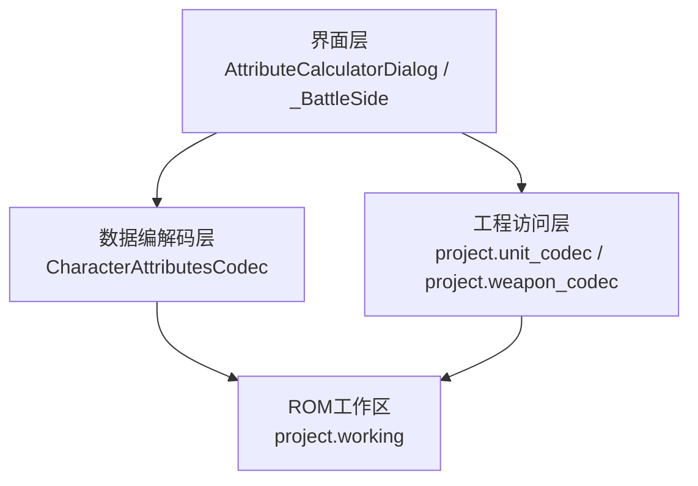
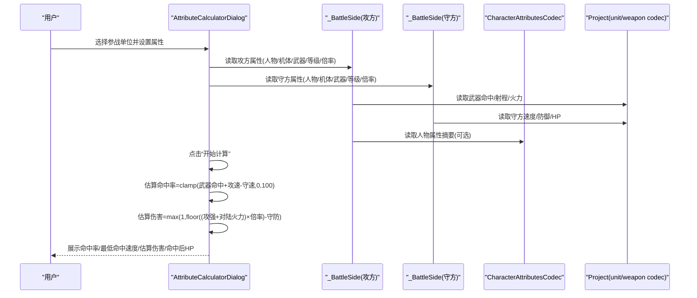
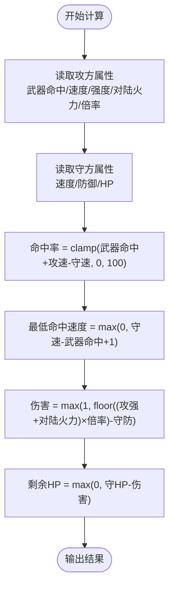
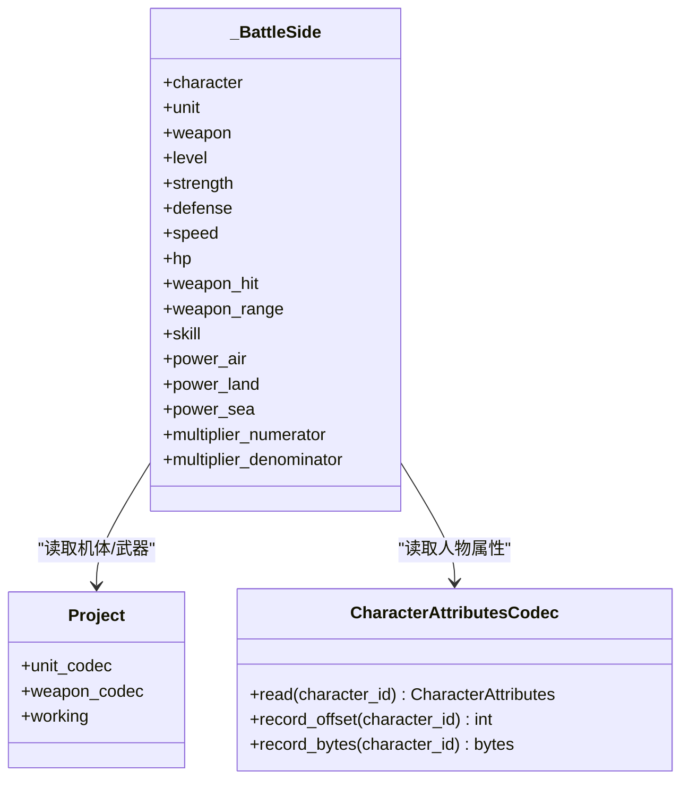
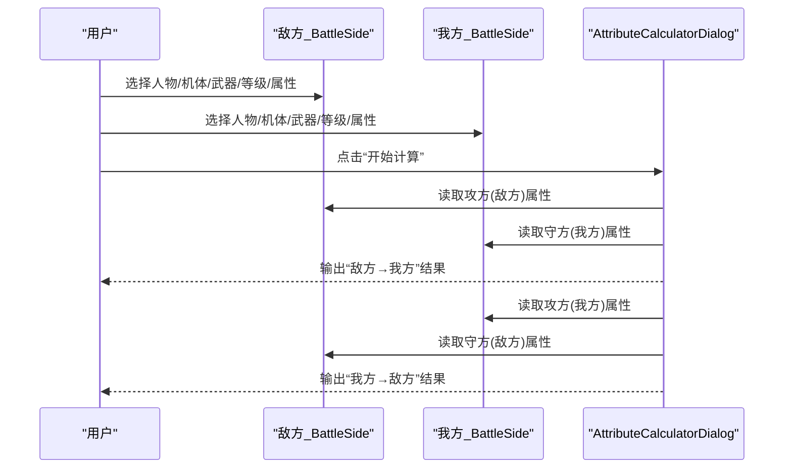
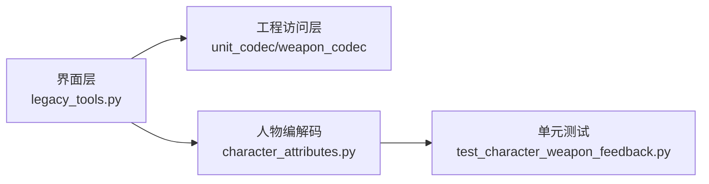

# 战斗属性计算器

<cite>
**本文引用的文件**
- [legacy_tools.py](file://src/dc_modifier/legacy_tools.py)
- [character_attributes.py](file://src/fc_editor/codecs/character_attributes.py)
- [test_character_weapon_feedback.py](file://tests/test_character_weapon_feedback.py)
</cite>

## 目录
1. [简介](#简介)
2. [项目结构](#项目结构)
3. [核心组件](#核心组件)
4. [架构总览](#架构总览)
5. [详细组件分析](#详细组件分析)
6. [依赖关系分析](#依赖关系分析)
7. [性能考虑](#性能考虑)
8. [故障排查指南](#故障排查指南)
9. [结论](#结论)
10. [附录](#附录)

## 简介
本文件围绕“战斗属性计算器”的估算公式与伤害计算逻辑进行系统化说明，覆盖敌方与我方两个战斗侧面的数据输入界面（人物、机体、武器、等级、属性值等），并解释估算命中率与伤害的计算流程。同时说明属性数据来源：人物属性来自 CharacterAttributesCodec，机体属性来自 unit_codec，武器属性来自 weapon_codec；并解释武器特技与距离补正表的作用机制。最后给出估算公式与游戏实际公式的差异说明、黄金样本验证的重要性、性能优化建议与常见问题解决方案。

## 项目结构
本项目将“战斗属性计算器”作为独立对话框嵌入到修改器工具中，主要涉及以下模块：
- 界面与交互：位于 legacy_tools.py 中的 _BattleSide 与 AttributeCalculatorDialog，提供敌我双方输入与结果展示。
- 数据编解码：位于 character_attributes.py 中的 CharacterAttributesCodec，负责读取人物属性、头像与武器额外字段（武器特技、距离补正）。
- 单元测试：位于 test_character_weapon_feedback.py，用于验证人物与武器相关编解码及补丁回放的正确性。

图表来源
- [legacy_tools.py:388-635](file://src/dc_modifier/legacy_tools.py#L388-L635)
- [character_attributes.py:78-186](file://src/fc_editor/codecs/character_attributes.py#L78-L186)

章节来源
- [legacy_tools.py:388-635](file://src/dc_modifier/legacy_tools.py#L388-L635)
- [character_attributes.py:78-186](file://src/fc_editor/codecs/character_attributes.py#L78-L186)

## 核心组件
- 敌方/我方输入面板（_BattleSide）
  - 字段包括：人物、机体、武器、等级、强度、防御、速度、HP、武器命中、武器射程、机体特技、火力·空/陆/海、伤害倍率（分子/分母）。
  - 选择人物后显示人物属性摘要（含原始字节、精神、成长、修正项、精神列表）。
  - 选择机体后自动填充强度、防御、速度、HP、机体特技。
  - 选择武器后自动填充武器命中、射程、空/陆/海火力，并解析武器特技与距离补正表。
- 计算器主窗口（AttributeCalculatorDialog）
  - 提供“开始计算”按钮，触发双向攻击估算（敌方→我方、我方→敌方）。
  - 结果表格包含：攻击方、目标、命中率、最低命中速度、估算伤害、命中后HP。
  - 提示“最低命中速度表示按当前估算公式达到 1% 命中所需的攻方速度”。

章节来源
- [legacy_tools.py:388-635](file://src/dc_modifier/legacy_tools.py#L388-L635)

## 架构总览
计算器的数据流从用户输入出发，经界面层读取工程数据，调用估算公式生成结果并展示。

图表来源
- [legacy_tools.py:553-635](file://src/dc_modifier/legacy_tools.py#L553-L635)
- [character_attributes.py:78-186](file://src/fc_editor/codecs/character_attributes.py#L78-L186)

## 详细组件分析

### 估算公式与伤害计算
- 命中率估算
  - 公式：命中率 = clamp(武器命中 + 攻方速度 - 守方速度, 0, 100)
  - 最低命中速度：为使命中率达到至少 1%，所需的最小攻方速度为：max(0, 守方速度 - 武器命中 + 1)
- 伤害估算
  - 公式：伤害 = max(1, floor((攻方强度 + 对陆火力) × 倍率 - 守方防御))
  - 倍率以分数形式输入：分子/分母，内部执行整除运算
- 命中后HP
  - 剩余HP = max(0, 守方HP - 估算伤害)

上述逻辑在“开始计算”时分别对“敌方→我方”和“我方→敌方”两种方向执行，并将结果填入表格。

图表来源
- [legacy_tools.py:599-612](file://src/dc_modifier/legacy_tools.py#L599-L612)

章节来源
- [legacy_tools.py:599-612](file://src/dc_modifier/legacy_tools.py#L599-L612)

### 数据输入界面与数据来源
- 人物属性
  - 通过 CharacterAttributesCodec.read(character_id) 读取，包含精神、成长、精神掩码、修正项（机动/强度/防御/速度/HP）等。
  - 界面会显示人物属性的原始字节与关键信息摘要。
- 机体属性
  - 通过 project.unit_codec.decode_record 获取，包含强度、防御、速度、HP、特技等。
- 武器属性
  - 通过 project.weapon_codec.decode_record 获取，包含命中、最大射程、空/陆/海火力等。
  - 武器特技与距离补正表通过 weapon_extra_values(project, weapon_id) 解析，返回 (武器特技, 距离补正表索引)。

图表来源
- [legacy_tools.py:485-546](file://src/dc_modifier/legacy_tools.py#L485-L546)
- [character_attributes.py:78-186](file://src/fc_editor/codecs/character_attributes.py#L78-L186)

章节来源
- [legacy_tools.py:485-546](file://src/dc_modifier/legacy_tools.py#L485-L546)
- [character_attributes.py:78-186](file://src/fc_editor/codecs/character_attributes.py#L78-L186)

### 武器特技与距离补正表
- 武器特技
  - 从武器记录的特定偏移处提取，范围 0–15，对应不同效果（如加固定火力、地图炮类型等）。
- 距离补正表
  - 从武器记录的另一字段提取，范围 0–3，表示不同的距离命中修正表。
- 作用机制
  - 在游戏实际战斗中，武器特技会影响攻击行为或伤害结算；距离补正表影响命中或伤害随距离的变化。
  - 计算器当前仅读取并展示这些值，不直接参与估算公式；但它们是理解实际战斗差异的重要参数。

章节来源
- [character_attributes.py:238-258](file://src/fc_editor/codecs/character_attributes.py#L238-L258)
- [legacy_tools.py:535-546](file://src/dc_modifier/legacy_tools.py#L535-L546)

### 完整计算流程
1. 选择参战单位：在敌方与我方面板分别选择人物、机体、武器与等级。
2. 设置属性值：界面会自动填充部分属性，也可手动调整强度、防御、速度、HP、武器命中、射程、火力与倍率。
3. 点击“开始计算”：系统分别计算“敌方→我方”与“我方→敌方”的命中率、最低命中速度、估算伤害与命中后HP。
4. 查看结果：结果表格展示双方攻击的估算情况，便于对比与策略分析。

图表来源
- [legacy_tools.py:553-635](file://src/dc_modifier/legacy_tools.py#L553-L635)

章节来源
- [legacy_tools.py:553-635](file://src/dc_modifier/legacy_tools.py#L553-L635)

## 依赖关系分析
- 界面层依赖工程访问层以读取机体与武器数据。
- 人物属性通过 CharacterAttributesCodec 读取，确保数据格式与ROM布局一致。
- 武器特技与距离补正表由 weapon_extra_values 解析，依赖 weapon_codec 的记录布局。
- 测试用例验证了人物与武器相关编解码、补丁回放与保存重开的正确性。

图表来源
- [legacy_tools.py:388-635](file://src/dc_modifier/legacy_tools.py#L388-L635)
- [character_attributes.py:78-186](file://src/fc_editor/codecs/character_attributes.py#L78-L186)
- [test_character_weapon_feedback.py:1-200](file://tests/test_character_weapon_feedback.py#L1-L200)

章节来源
- [legacy_tools.py:388-635](file://src/dc_modifier/legacy_tools.py#L388-L635)
- [character_attributes.py:78-186](file://src/fc_editor/codecs/character_attributes.py#L78-L186)
- [test_character_weapon_feedback.py:1-200](file://tests/test_character_weapon_feedback.py#L1-L200)

## 性能考虑
- 界面刷新与数据加载
  - 选择人物/机体/武器时进行一次性读取与展示，避免重复IO。
  - 结果表格仅在“开始计算”时更新，减少频繁重绘。
- 估算计算复杂度
  - 每次计算仅进行常数次算术操作，时间复杂度 O(1)，空间复杂度 O(1)。
- 批量计算建议
  - 若需对多组单位进行估算，可封装循环并在外部缓存已读取的属性，避免重复解码。
- 内存与I/O
  - 尽量复用 project.working 与 codec 实例，减少对象创建开销。

[本节为通用性能建议，不直接分析具体文件]

## 故障排查指南
- 常见错误与处理
  - 人物/武器格式校验失败：当ROM布局与预期不一致时，CharacterAttributesCodec 会抛出异常，提示加载代码或指针表变化。
  - 武器特技/距离补正越界：超出 0–15 或 0–3 范围时会报错，需检查输入或ROM配置。
  - 数据池容量不足：当尝试写入共享记录导致溢出时，应减少修正字段或启用共享模式。
- 调试建议
  - 使用单元测试验证编解码与补丁回放是否正确。
  - 在界面中查看人物/武器的原始字节与地址，确认数据源是否匹配。
  - 逐步缩小问题范围：先验证武器特技与距离补正，再验证人物属性与机体属性。

章节来源
- [character_attributes.py:97-111](file://src/fc_editor/codecs/character_attributes.py#L97-L111)
- [character_attributes.py:238-258](file://src/fc_editor/codecs/character_attributes.py#L238-L258)
- [test_character_weapon_feedback.py:88-113](file://tests/test_character_weapon_feedback.py#L88-L113)

## 结论
“战斗属性计算器”提供了安全、直观的估算功能，帮助玩家与策划快速评估命中率与伤害。其估算公式简洁明确，适合用于前期平衡分析与策略规划。需要注意的是，该估算公式并非已验证的游戏实际公式，真正的战斗结算可能受武器特技、距离补正表、随机波动等多重因素影响。因此，建议使用黄金样本进行验证，以确保估算与实际一致。

[本节为总结性内容，不直接分析具体文件]

## 附录
- 估算公式与游戏实际公式的差异
  - 估算命中率未考虑随机波动、技能加成、地形与状态等复杂因素。
  - 估算伤害未考虑武器特技带来的额外修正、距离衰减、属性克制等。
- 黄金样本验证的重要性
  - 通过大量实战样本比对估算结果与实际结果，发现偏差并修正公式。
  - 有助于定位武器特技与距离补正表的具体影响，完善估算模型。
- 最佳实践
  - 在估算前确认武器特技与距离补正表的选择，必要时加入经验修正系数。
  - 对极端场景（极低命中、极高防御）进行边界测试，确保估算合理。

[本节为补充说明，不直接分析具体文件]