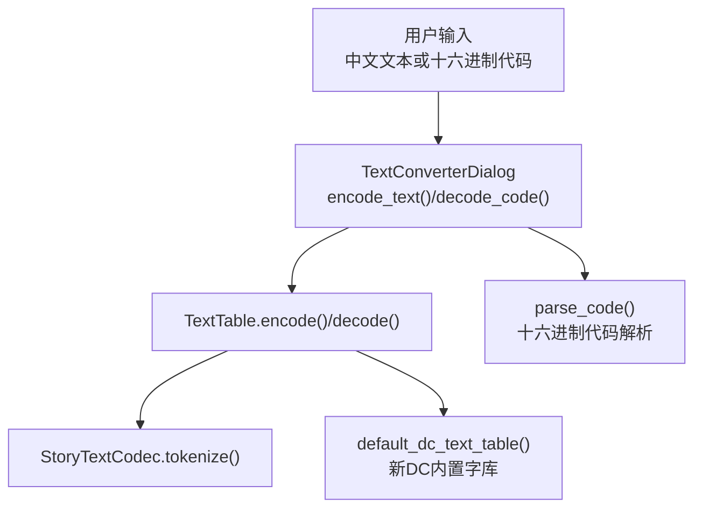
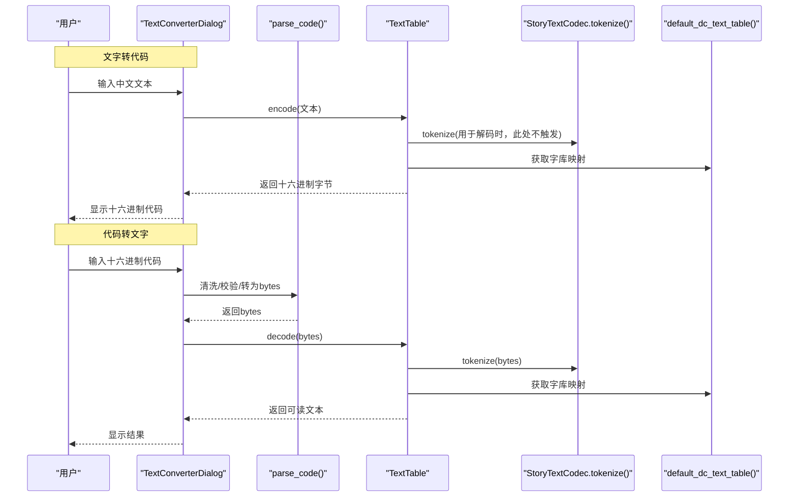
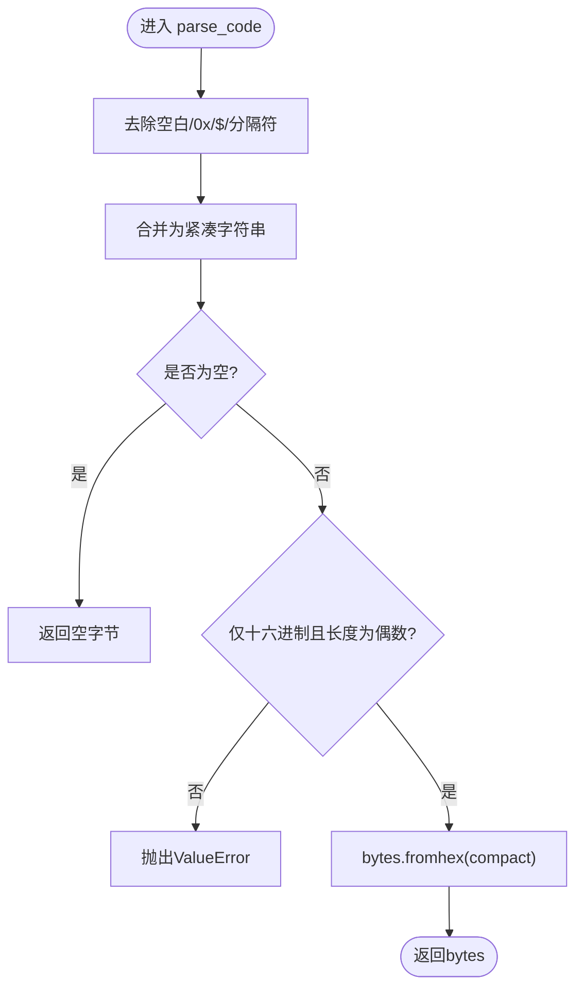
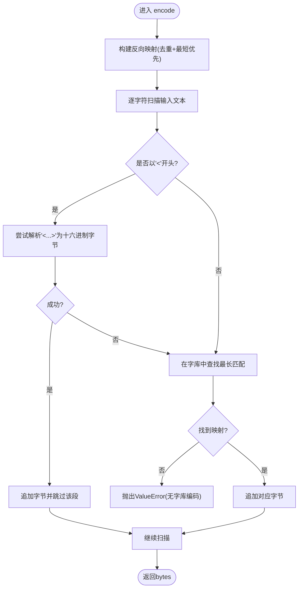
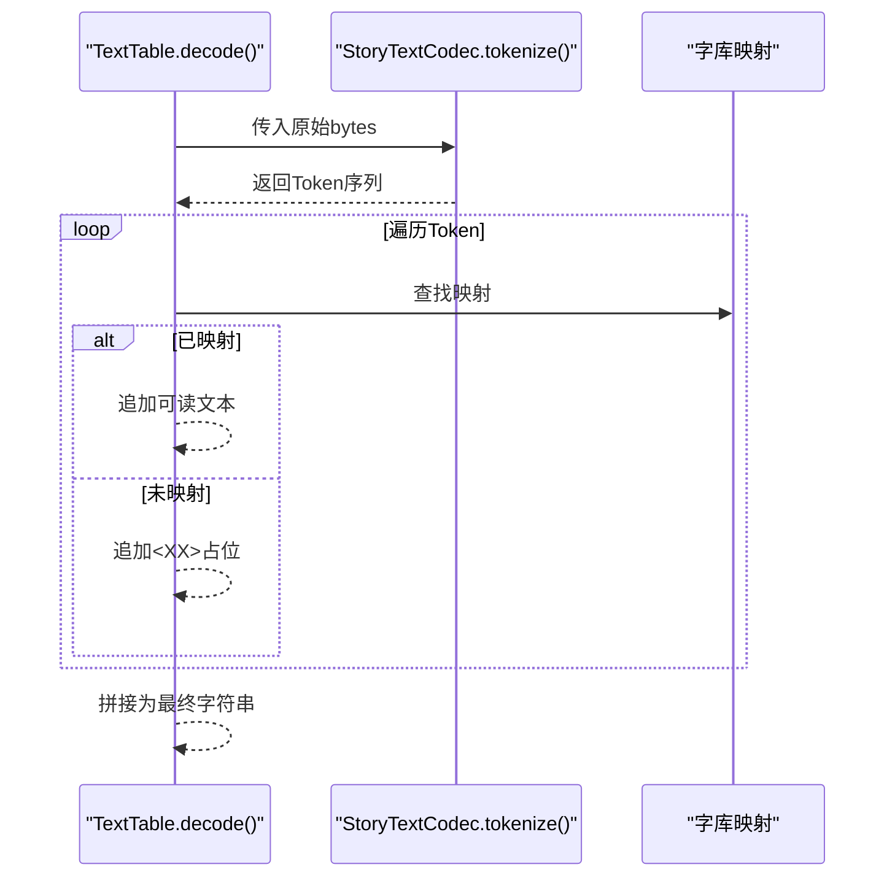
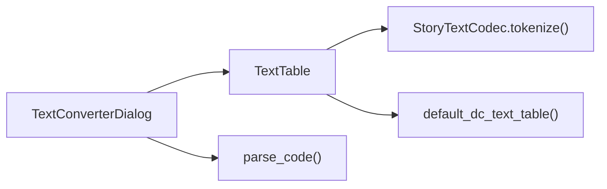

# 文字转换工具

<cite>
**本文引用的文件**
- [text_table.py](file://src/fc_editor/text_table.py)
- [dc_text.py](file://src/fc_editor/dc_text.py)
- [story_text.py](file://src/fc_editor/codecs/story_text.py)
- [legacy_text.py](file://src/fc_editor/codecs/legacy_text.py)
- [legacy_tools.py](file://src/dc_modifier/legacy_tools.py)
</cite>

## 目录
1. [简介](#简介)
2. [项目结构](#项目结构)
3. [核心组件](#核心组件)
4. [架构总览](#架构总览)
5. [详细组件分析](#详细组件分析)
6. [依赖关系分析](#依赖关系分析)
7. [性能考量](#性能考量)
8. [故障排查指南](#故障排查指南)
9. [结论](#结论)
10. [附录](#附录)

## 简介
本文件聚焦“文字转换工具”的编码与解码能力，围绕双向转换流程展开：
- 文字转代码：调用 TextTable.encode()，将用户输入的中文文本与控制码名称转换为十六进制字节序列。
- 代码转文字：调用 TextTable.decode()，将十六进制代码解析为可读文本，并保留控制码语义。

重点说明十六进制代码解析器 parse_code() 的处理逻辑（支持 0x 前缀、$ 符号、多种分隔符）、格式验证与错误处理；解释支持的 Token 格式与新 DC 内置 Token 字库的使用；给出完整操作流程与常见错误调试方法。

## 项目结构
与文字转换相关的核心模块位于 fc_editor 与 dc_modifier 中：
- 字库与编解码接口：TextTable（定义 encode/decode/token 映射）
- 默认字库加载：default_dc_text_table()（内嵌新 DC 字库表，含控制码映射）
- 词法分词：StoryTextCodec.tokenize()（按字形引导、控制码、结束码等规则切分 Token）
- 旧版文本兼容：LegacyTextCodec / decode_legacy_text()（用于历史数据场景）
- UI 入口：TextConverterDialog（提供“文字转代码/代码转文字”按钮与状态提示）

图表来源
- [legacy_tools.py:304-385](file://src/dc_modifier/legacy_tools.py#L304-L385)
- [text_table.py:61-93](file://src/fc_editor/text_table.py#L61-L93)
- [story_text.py:181-207](file://src/fc_editor/codecs/story_text.py#L181-L207)
- [dc_text.py:372-396](file://src/fc_editor/dc_text.py#L372-L396)

章节来源
- [legacy_tools.py:304-385](file://src/dc_modifier/legacy_tools.py#L304-L385)
- [text_table.py:61-93](file://src/fc_editor/text_table.py#L61-L93)
- [story_text.py:181-207](file://src/fc_editor/codecs/story_text.py#L181-L207)
- [dc_text.py:372-396](file://src/fc_editor/dc_text.py#L372-L396)

## 核心组件
- TextTable：维护字节到文本的双向映射，提供 encode(text)->bytes、decode(bytes)->str，以及 preserve-token 编辑模式。
- StoryTextCodec：负责将原始字节流切分为 Token（字形、控制码、结束码等），供 TextTable.decode 使用。
- default_dc_text_table：加载内嵌的新 DC 字库表，补充控制码映射（如换行、结束标记），并为未映射的单字节 Token 提供稳定占位表示。
- TextConverterDialog.parse_code：对十六进制代码进行清洗、校验与转换，支持多种书写习惯。

章节来源
- [text_table.py:9-93](file://src/fc_editor/text_table.py#L9-L93)
- [story_text.py:17-31,181-207:17-31](file://src/fc_editor/codecs/story_text.py#L17-L31)
- [dc_text.py:372-396](file://src/fc_editor/dc_text.py#L372-L396)
- [legacy_tools.py:356-385](file://src/dc_modifier/legacy_tools.py#L356-L385)

## 架构总览
下图展示从用户输入到输出结果的完整调用链，包括两种方向：

图表来源
- [legacy_tools.py:304-385](file://src/dc_modifier/legacy_tools.py#L304-L385)
- [text_table.py:61-93](file://src/fc_editor/text_table.py#L61-L93)
- [story_text.py:181-207](file://src/fc_editor/codecs/story_text.py#L181-L207)
- [dc_text.py:372-396](file://src/fc_editor/dc_text.py#L372-L396)

## 详细组件分析

### 十六进制代码解析器 parse_code()
作用：将用户输入的多种格式的十六进制字符串统一规范化为 bytes，供 decode 使用。

处理要点
- 去除空白与无关字符：strip() 后移除 0x 前缀、$ 符号，并将多种分隔符（尖括号、花括号、方括号、逗号、中文逗号、分号、冒号、下划线、连字符等）替换为空格，再合并为紧凑字符串。
- 格式校验：要求紧凑字符串仅由十六进制字符组成，且长度为偶数（保证是完整的字节）。
- 转换：使用 bytes.fromhex() 生成字节序列。
- 空输入：若清理后为空，返回空字节串。

错误处理
- 当包含非法字符或非偶数长度时，抛出 ValueError，并在 UI 中以红色状态提示“转换失败”。

图表来源
- [legacy_tools.py:356-367](file://src/dc_modifier/legacy_tools.py#L356-L367)

章节来源
- [legacy_tools.py:356-367](file://src/dc_modifier/legacy_tools.py#L356-L367)

### 文字转代码：TextTable.encode()
作用：将用户输入的 Unicode 文本（含控制码名称或 <FF> 形式的原始 Token）编码为 ROM 可识别的字节序列。

工作原理
- 反向映射构建：根据字库表构建 text_to_byte，优先选择最短编码以避免因重复字形导致不必要的膨胀。
- 扫描与匹配：从左到右扫描输入文本，遇到 <...> 包裹的十六进制片段则尝试直接解析为字节；否则在字库表中查找最长匹配的文本片段，写入对应字节。
- 未知字符：若无法找到映射，抛出 ValueError，提示“没有字库编码”，便于定位缺失字符。

图表来源
- [text_table.py:67-93](file://src/fc_editor/text_table.py#L67-L93)

章节来源
- [text_table.py:67-93](file://src/fc_editor/text_table.py#L67-L93)

### 代码转文字：TextTable.decode()
作用：将字节序列解码为可读文本，同时保留控制码语义。

工作原理
- 分词：通过 StoryTextCodec.tokenize() 将原始字节切分为 Token（字形、控制码、扩展控制字节、结束码等）。
- 映射：对每个 Token，优先用字库表映射为人类可读文本；若未映射，则以 <XX> 形式保留原始字节，确保可逆与可诊断。
- 拼接：将所有片段拼接为最终字符串。

图表来源
- [text_table.py:61-65](file://src/fc_editor/text_table.py#L61-L65)
- [story_text.py:181-207](file://src/fc_editor/codecs/story_text.py#L181-L207)

章节来源
- [text_table.py:61-65](file://src/fc_editor/text_table.py#L61-L65)
- [story_text.py:181-207](file://src/fc_editor/codecs/story_text.py#L181-L207)

### 新 DC 内置 Token 字库与 Token 格式
- 字库来源：default_dc_text_table() 加载内嵌压缩的字库表，并按行解析为字节到文本的映射。
- 控制码补充：显式设置换行符（F2）与结束符（FF）的显示名称，便于用户识别与保留。
- 单字节 Token：对于未映射的单字节值，统一以“⟦原始字节 $XX⟧”的形式呈现，避免歧义。
- Token 分类（来自 StoryTextCodec）：
  - 中文字形码：两位字形引导范围（B8-BC、C8-CC、D8-DC）构成的两字节 Token。
  - 尾随字形导字节：字形引导后缺少第二字节时的异常片段。
  - 控制码：高字节区域（≥F0）的单字节控制码。
  - 扩展控制字节：EE-FE 范围的扩展控制字节。
  - 文本结束：FF 作为记录终止符。
  - 单字节字形/参数：其余单字节内容。

章节来源
- [dc_text.py:372-396](file://src/fc_editor/dc_text.py#L372-L396)
- [story_text.py:17-31,181-207:17-31](file://src/fc_editor/codecs/story_text.py#L17-L31)

### 控制码名称识别与处理机制
- 在 encode 过程中，若用户输入 <FF> 形式的原始 Token，会被直接解析为字节并写入，从而保留控制码原样。
- 在 decode 过程中，控制码会依据字库映射显示为易读名称（如换行、结束标记），未映射的控制码将以 <XX> 形式保留。
- 对于需要严格保留控制码的场景（如补丁写入），可使用 encode_preserving_tokens() 保持未修改部分的原始 Token 不变。

章节来源
- [text_table.py:67-93](file://src/fc_editor/text_table.py#L67-L93)
- [text_table.py:95-145](file://src/fc_editor/text_table.py#L95-L145)
- [dc_text.py:372-396](file://src/fc_editor/dc_text.py#L372-L396)

### 完整操作流程
- 文字转代码：
  1) 在“文字”输入框输入中文文本（可包含控制码名称或 <FF> 形式的原始 Token）。
  2) 点击“文字转代码”。
  3) 系统调用 TextTable.encode()，输出十六进制代码至“代码”框，并显示成功状态。
- 代码转文字：
  1) 在“代码”输入框粘贴十六进制代码（支持 0x、$、多种分隔符）。
  2) 点击“代码转文字”。
  3) 系统调用 parse_code() 清洗校验，再调用 TextTable.decode()，输出可读文本至“文字”框，并显示成功状态。

章节来源
- [legacy_tools.py:304-385](file://src/dc_modifier/legacy_tools.py#L304-L385)

## 依赖关系分析
- TextConverterDialog 依赖 TextTable 与 parse_code()。
- TextTable 依赖 StoryTextCodec.tokenize() 与 default_dc_text_table()。
- StoryTextCodec 定义字形引导范围与 Token 分类，保障边界正确性。
- default_dc_text_table() 提供新 DC 字库与控制码映射，确保解码可读性与可诊断性。

图表来源
- [legacy_tools.py:304-385](file://src/dc_modifier/legacy_tools.py#L304-L385)
- [text_table.py:61-93](file://src/fc_editor/text_table.py#L61-L93)
- [story_text.py:181-207](file://src/fc_editor/codecs/story_text.py#L181-L207)
- [dc_text.py:372-396](file://src/fc_editor/dc_text.py#L372-L396)

章节来源
- [legacy_tools.py:304-385](file://src/dc_modifier/legacy_tools.py#L304-L385)
- [text_table.py:61-93](file://src/fc_editor/text_table.py#L61-L93)
- [story_text.py:181-207](file://src/fc_editor/codecs/story_text.py#L181-L207)
- [dc_text.py:372-396](file://src/fc_editor/dc_text.py#L372-L396)

## 性能考量
- 反向映射构建：encode 时基于字库表构建 text_to_byte，采用“最短优先”策略减少冗余，提升匹配效率。
- 分词开销：decode 依赖 StoryTextCodec.tokenize()，按固定规则线性扫描，时间复杂度 O(n)，适合大文本。
- 字库加载：default_dc_text_table() 使用缓存（lru_cache），避免重复解压与解析开销。
- 建议：批量转换时可复用 TextTable 实例，减少对象创建成本。

[本节为通用性能讨论，不直接分析具体文件]

## 故障排查指南
常见问题与解决思路
- 格式错误（十六进制代码）：
  - 现象：parse_code() 抛出 ValueError，UI 显示“转换失败”。
  - 原因：包含非十六进制字符、长度不为偶数、或分隔符混用不当。
  - 处理：清理输入，确保仅保留十六进制数字与允许的分隔符；必要时去掉 0x/$ 前缀。
- 不支持的字符（文字转代码）：
  - 现象：encode() 抛出 ValueError，提示“没有字库编码”。
  - 原因：输入字符未在字库表中映射。
  - 处理：检查并替换为字库中存在的字符；或使用 <XX> 形式插入原始字节。
- 控制码丢失或误改：
  - 现象：解码后控制码显示异常或被替换。
  - 原因：字库映射覆盖或手动编辑破坏了控制码。
  - 处理：使用 <FF> 等原始 Token 形式显式保留控制码；或在高级编辑中使用 encode_preserving_tokens() 保持未变部分。
- 字形引导不完整：
  - 现象：出现“尾随字形导字节”或“末记录字形码不完整”的错误。
  - 原因：两字节字形码缺少第二字节。
  - 处理：补全字形码的第二字节，或修正输入。

章节来源
- [legacy_tools.py:356-385](file://src/dc_modifier/legacy_tools.py#L356-L385)
- [text_table.py:67-93](file://src/fc_editor/text_table.py#L67-L93)
- [story_text.py:97-120](file://src/fc_editor/codecs/story_text.py#L97-L120)

## 结论
文字转换工具通过 TextTable 与 StoryTextCodec 的配合，实现了稳健的双向转换：
- 文字转代码：支持 Unicode 文本与 <FF> 原始 Token，自动映射为十六进制字节。
- 代码转文字：支持多种十六进制书写格式，解析为可读文本并保留控制码语义。
- 新 DC 内置字库提供完整控制码映射与稳定的未映射占位，便于调试与回退。
- parse_code() 提供友好的输入容错与严格的格式校验，降低用户出错概率。

[本节为总结性内容，不直接分析具体文件]

## 附录
- 常用 Token 示例（来自 StoryTextCodec 分类）：
  - 中文字形码：两字节，首字节属于 B8-BC、C8-CC、D8-DC。
  - 控制码：≥F0 的单字节控制码。
  - 扩展控制字节：EE-FE 范围的扩展控制字节。
  - 文本结束：FF 作为记录终止符。
  - 单字节字形/参数：其余单字节内容。
- 操作建议：
  - 在需要精确保留控制码时，使用 <FF> 形式插入原始字节。
  - 批量转换时复用 TextTable 实例以提升性能。
  - 遇到未知字符时，先确认字库映射，再决定替换或保留原始字节。

[本节为概念性附录，不直接分析具体文件]