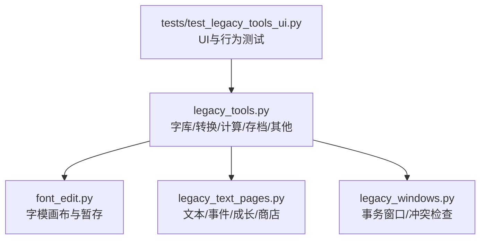
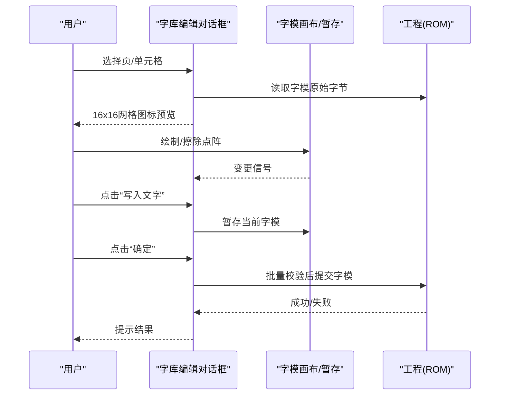
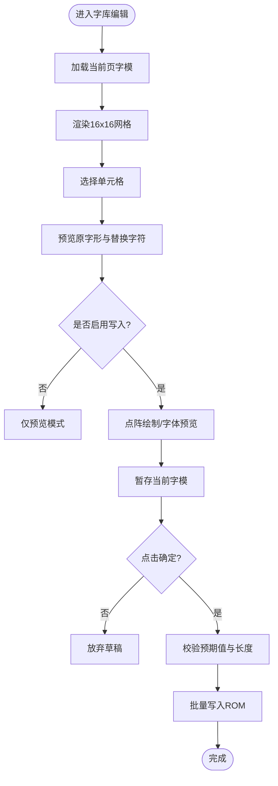
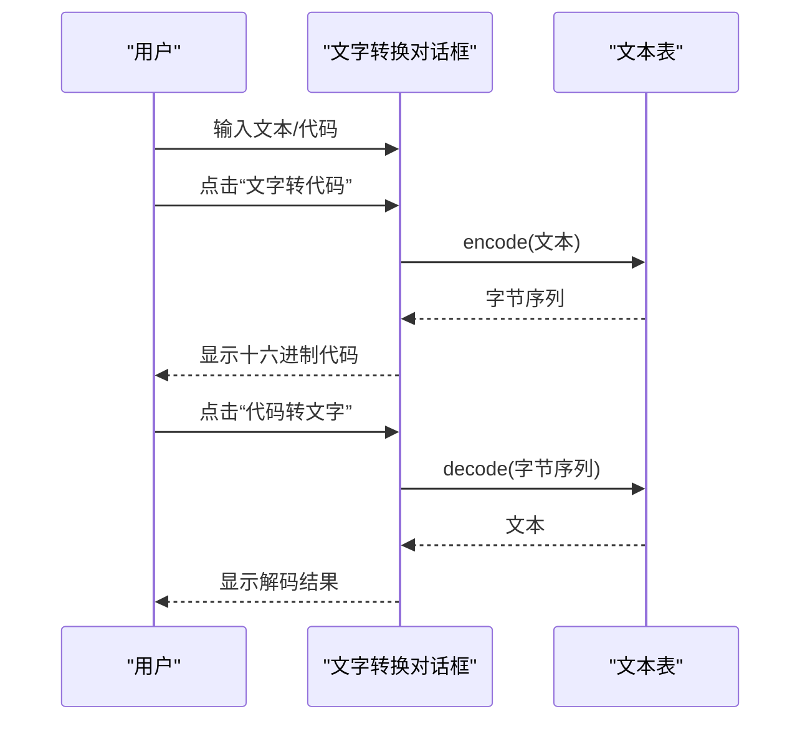
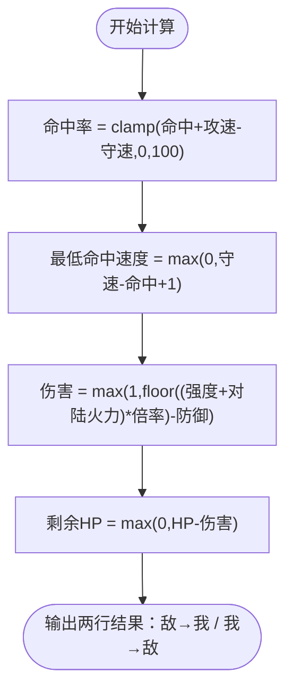
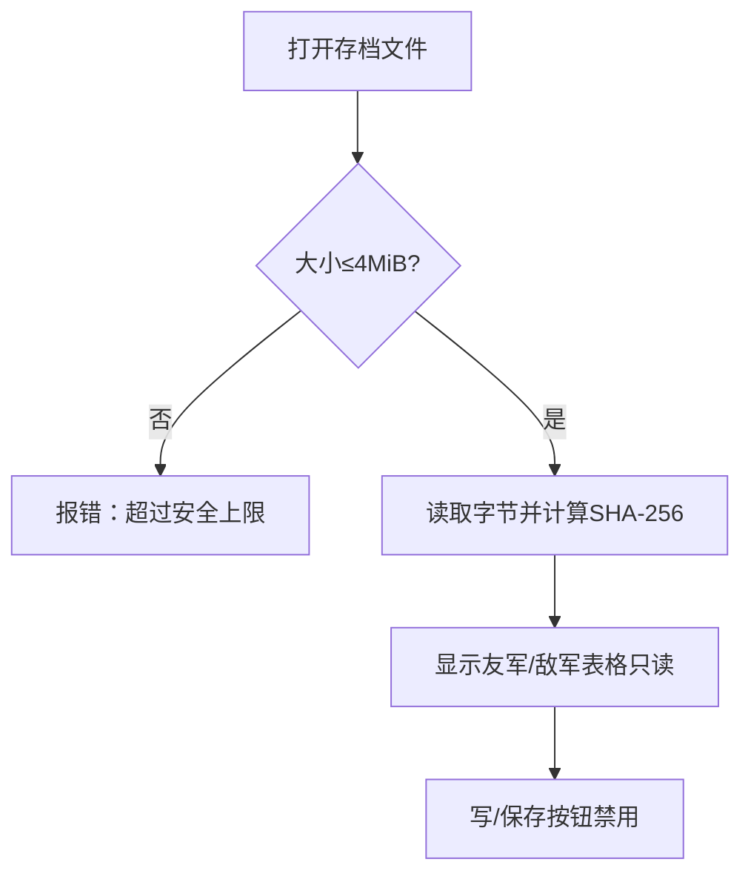
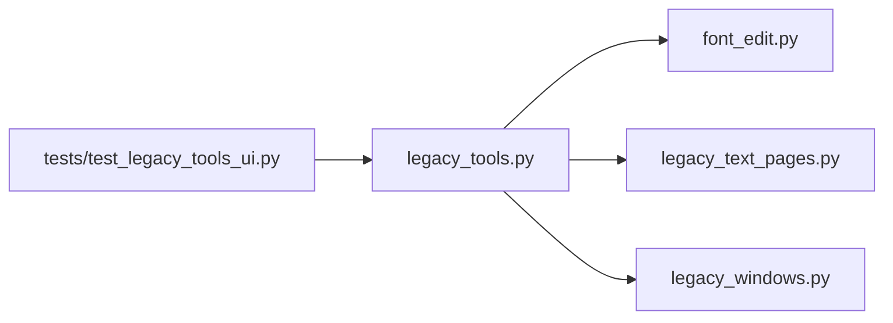

# 遗留工具

<cite>
**本文引用的文件**
- [src/dc_modifier/legacy_tools.py](file://src/dc_modifier/legacy_tools.py)
- [src/dc_modifier/font_edit.py](file://src/dc_modifier/font_edit.py)
- [src/dc_modifier/legacy_windows.py](file://src/dc_modifier/legacy_windows.py)
- [src/dc_modifier/legacy_text_pages.py](file://src/dc_modifier/legacy_text_pages.py)
- [tests/test_legacy_tools_ui.py](file://tests/test_legacy_tools_ui.py)
</cite>

## 目录
1. [简介](#简介)
2. [项目结构](#项目结构)
3. [核心组件](#核心组件)
4. [架构总览](#架构总览)
5. [详细组件分析](#详细组件分析)
6. [依赖关系分析](#依赖关系分析)
7. [性能与使用建议](#性能与使用建议)
8. [故障排查指南](#故障排查指南)
9. [结论](#结论)
10. [附录：操作步骤与常见问题](#附录：操作步骤与常见问题)

## 简介
本章节面向DC修改器中的“遗留工具”模块，聚焦以下子工具：字库编辑对话框、文字转换工具、战斗属性计算器、存档编辑器和其他设置工具。文档将说明每个工具的用途、界面操作方式、数据处理流程与安全限制（以只读或受控写入为主），并重点展开字库编辑器的16x16字体预览与修改能力、文字转换器的双向编码解码能力，以及战斗属性计算器的估算公式与伤害计算逻辑。同时提供具体操作步骤和常见问题解决方案，帮助使用者安全高效地完成ROM数据查看与有限度的修改工作。

## 项目结构
遗留工具主要分布在dc_modifier包中，围绕PySide6构建UI，并通过fc_editor提供的编解码器访问ROM数据。关键文件职责如下：
- legacy_tools.py：集中实现字库编辑、文字转换、战斗属性计算器、存档编辑器、其他设置等对话框。
- font_edit.py：提供字库编辑的画布控件与事务化暂存机制，确保批量提交与撤销一致性。
- legacy_windows.py：提供事务性窗口封装与页面冲突检测，保障多页编辑时的资源一致性。
- legacy_text_pages.py：提供文本、剧情事件、成长表、商店对话等页面的编辑与暂存能力。
- tests/test_legacy_tools_ui.py：覆盖各工具的基本交互、尺寸、截图渲染与核心行为断言。

图表来源
- [src/dc_modifier/legacy_tools.py:109-386](file://src/dc_modifier/legacy_tools.py#L109-L386)
- [src/dc_modifier/font_edit.py:14-273](file://src/dc_modifier/font_edit.py#L14-L273)
- [src/dc_modifier/legacy_text_pages.py:20-772](file://src/dc_modifier/legacy_text_pages.py#L20-L772)
- [src/dc_modifier/legacy_windows.py:71-259](file://src/dc_modifier/legacy_windows.py#L71-L259)
- [tests/test_legacy_tools_ui.py:35-393](file://tests/test_legacy_tools_ui.py#L35-L393)

章节来源
- [src/dc_modifier/legacy_tools.py:109-386](file://src/dc_modifier/legacy_tools.py#L109-L386)
- [src/dc_modifier/font_edit.py:14-273](file://src/dc_modifier/font_edit.py#L14-L273)
- [src/dc_modifier/legacy_text_pages.py:20-772](file://src/dc_modifier/legacy_text_pages.py#L20-L772)
- [src/dc_modifier/legacy_windows.py:71-259](file://src/dc_modifier/legacy_windows.py#L71-L259)
- [tests/test_legacy_tools_ui.py:35-393](file://tests/test_legacy_tools_ui.py#L35-L393)

## 核心组件
- 字库编辑对话框：基于16x16网格展示字库，支持选择页、预览字形、点阵绘制与批量替换；在已验证布局下可安全写入固定字模。
- 文字转换工具：基于统一文本表进行“中文/控制码↔原始Token”的双向无损转换，不修改ROM。
- 战斗属性计算器：读取人物/机体/武器属性，按文档化估算公式计算命中率、最低命中速度、伤害与剩余HP。
- 存档编辑器：打开并读取存档文件，显示友军/敌军表格；因编解码未验证，写人与保存功能禁用。
- 其他设置工具：展示双击公式、伤害公式、命中阈值、道具相关数值与初始机体列表；在未验证时只读，验证后可一次性提交为单个撤销事务。

章节来源
- [src/dc_modifier/legacy_tools.py:109-386](file://src/dc_modifier/legacy_tools.py#L109-L386)
- [src/dc_modifier/legacy_tools.py:553-635](file://src/dc_modifier/legacy_tools.py#L553-L635)
- [src/dc_modifier/legacy_tools.py:637-730](file://src/dc_modifier/legacy_tools.py#L637-L730)
- [src/dc_modifier/legacy_tools.py:732-800](file://src/dc_modifier/legacy_tools.py#L732-L800)
- [src/dc_modifier/font_edit.py:61-273](file://src/dc_modifier/font_edit.py#L61-L273)

## 架构总览
遗留工具采用“对话框+编解码器+事务窗口”的分层设计：
- UI层：PySide6对话框承载用户交互，提供网格、画布、表单与按钮。
- 数据层：通过fc_editor的文本表、字库编解码、角色/武器/单位编解码读取ROM数据。
- 事务层：legacy_windows提供窗口级快照与回滚，保证取消时恢复ROM状态与分配器历史。

图表来源
- [src/dc_modifier/legacy_tools.py:109-295](file://src/dc_modifier/legacy_tools.py#L109-L295)
- [src/dc_modifier/font_edit.py:61-273](file://src/dc_modifier/font_edit.py#L61-L273)
- [src/dc_modifier/legacy_windows.py:71-259](file://src/dc_modifier/legacy_windows.py#L71-L259)

## 详细组件分析

### 字库编辑器（16x16预览与修改）
- 界面与操作
  - 左侧16x16网格展示当前页的字形图标，行/列头为十六进制索引。
  - 右侧面板提供页选择、原字形与替换字形预览、替换字符输入、写入/清空/替换全部/导入导出等按钮。
  - 底部显示当前字元的文字、代码与地址信息。
- 数据处理
  - 根据令牌映射到ROM偏移，读取18字节字模数据并渲染为图标。
  - 支持从系统字体生成12x12点阵预览，并在已验证布局下将点阵写入对应偏移。
  - 批量暂存与提交：仅在“确定”时提交，取消则丢弃所有草稿。
- 安全限制
  - 若ROM布局未经验证，所有写按钮禁用，仅预览。
  - 即使可写，也仅允许修改固定字模位置，不新增字符编码。
  - 提交前校验预期值，避免并发修改覆盖。

图表来源
- [src/dc_modifier/legacy_tools.py:109-295](file://src/dc_modifier/legacy_tools.py#L109-L295)
- [src/dc_modifier/font_edit.py:61-273](file://src/dc_modifier/font_edit.py#L61-L273)

章节来源
- [src/dc_modifier/legacy_tools.py:109-295](file://src/dc_modifier/legacy_tools.py#L109-L295)
- [src/dc_modifier/font_edit.py:61-273](file://src/dc_modifier/font_edit.py#L61-L273)
- [tests/test_legacy_tools_ui.py:56-90](file://tests/test_legacy_tools_ui.py#L56-L90)

### 文字转换器（双向编码解码）
- 界面与操作
  - 上方文本框输入中文或控制码名称，下方代码框显示原始Token。
  - “文字转代码”将文本编码为十六进制字节序列；“代码转文字”将合法十六进制序列解码为文本。
- 数据处理
  - 使用与故事文本相同的文本表进行编解码，保持控制码与结束码。
  - 解析器支持多种十六进制格式（含前缀、分隔符等）。
- 安全限制
  - 本工具不修改ROM，仅做转换与预览。
  - 非法输入会返回错误提示。

图表来源
- [src/dc_modifier/legacy_tools.py:304-386](file://src/dc_modifier/legacy_tools.py#L304-L386)

章节来源
- [src/dc_modifier/legacy_tools.py:304-386](file://src/dc_modifier/legacy_tools.py#L304-L386)
- [tests/test_legacy_tools_ui.py:114-131](file://tests/test_legacy_tools_ui.py#L114-L131)

### 战斗属性计算器（估算公式与伤害逻辑）
- 界面与操作
  - 左右两侧分别配置敌方与我方：人物、机体、武器、等级、强度/防御/速度/HP、武器命中/射程、特技、火力（空/陆/海）、伤害倍数（分子/分母）。
  - 点击“开始计算”输出攻击方对目标方的命中率、最低命中速度、估算伤害与命中后剩余HP。
- 数据处理与公式
  - 命中率 = clamp(武器命中 + 攻方速度 - 守方速度, 0, 100)。
  - 最低命中速度 = max(0, 守方速度 - 武器命中 + 1)。
  - 伤害 = max(1, floor((攻方强度 + 对陆火力) × 倍率) - 守方防御)。
  - 剩余HP = max(0, 守方HP - 伤害)。
- 安全限制
  - 非已验证游戏公式，仅供估算参考。
  - 不修改ROM，仅读取属性并计算。

图表来源
- [src/dc_modifier/legacy_tools.py:553-635](file://src/dc_modifier/legacy_tools.py#L553-L635)

章节来源
- [src/dc_modifier/legacy_tools.py:553-635](file://src/dc_modifier/legacy_tools.py#L553-L635)
- [tests/test_legacy_tools_ui.py:133-177](file://tests/test_legacy_tools_ui.py#L133-L177)
- [tests/test_legacy_tools_ui.py:374-388](file://tests/test_legacy_tools_ui.py#L374-L388)

### 存档编辑器（只读读取）
- 界面与操作
  - 选择槽位与关卡，打开存档文件，点击“读取存档”加载数据。
  - 显示友军与敌军表格（只读），状态栏显示文件大小与SHA-256摘要。
- 数据处理
  - 读取完整存档字节，限制最大大小（4 MiB），计算摘要用于标识。
- 安全限制
  - 因编解码器尚未验证，“写入存档”和“保存存档文件”按钮禁用，防止误写。
  - 仅用于查看与核对存档内容。

图表来源
- [src/dc_modifier/legacy_tools.py:637-730](file://src/dc_modifier/legacy_tools.py#L637-L730)

章节来源
- [src/dc_modifier/legacy_tools.py:637-730](file://src/dc_modifier/legacy_tools.py#L637-L730)
- [tests/test_legacy_tools_ui.py:179-196](file://tests/test_legacy_tools_ui.py#L179-L196)

### 其他设置工具（全局参数与初始机体）
- 界面与操作
  - 分组展示双击公式、伤害计算公式、命中计算公式、道具相关修改与初始机体列表。
  - 在未验证时所有字段只读；在支持的全局参数地址可用时，可编辑并一次性提交。
- 数据处理
  - 读取/写入全局参数与初始机体列表，提交时作为单个撤销事务，便于回滚。
- 安全限制
  - 默认只读，避免误改未验证参数。
  - 接受时执行批量写入，取消时完全回滚。

章节来源
- [src/dc_modifier/legacy_tools.py:732-800](file://src/dc_modifier/legacy_tools.py#L732-L800)
- [tests/test_legacy_tools_ui.py:198-316](file://tests/test_legacy_tools_ui.py#L198-L316)

### 文本/事件/成长/商店页面（补充）
- 文本页面：支持对话段/文字记录的分组浏览、变体编辑、搜索过滤与暂存应用。
- 事件页面：列出指令并允许编辑原始字节，提交时生成替换补丁。
- 成长页面：编辑每级成长数值，支持还原与冲突检测。
- 商店页面：编辑商品、店员、对话起始编号及七段对话文本，合并文本与商店元数据提交。

章节来源
- [src/dc_modifier/legacy_text_pages.py:20-772](file://src/dc_modifier/legacy_text_pages.py#L20-L772)

## 依赖关系分析
- UI与数据解耦：对话框通过fc_editor的编解码器访问ROM数据，避免直接操作底层字节。
- 事务与冲突：legacy_windows提供窗口级快照与冲突检查，确保多页编辑的一致性。
- 测试驱动：test_legacy_tools_ui.py覆盖各工具的关键路径，包括界面几何、截图渲染、核心算法与只读约束。

图表来源
- [src/dc_modifier/legacy_tools.py:109-800](file://src/dc_modifier/legacy_tools.py#L109-L800)
- [src/dc_modifier/font_edit.py:14-273](file://src/dc_modifier/font_edit.py#L14-L273)
- [src/dc_modifier/legacy_text_pages.py:20-772](file://src/dc_modifier/legacy_text_pages.py#L20-L772)
- [src/dc_modifier/legacy_windows.py:71-259](file://src/dc_modifier/legacy_windows.py#L71-L259)
- [tests/test_legacy_tools_ui.py:35-393](file://tests/test_legacy_tools_ui.py#L35-L393)

章节来源
- [src/dc_modifier/legacy_tools.py:109-800](file://src/dc_modifier/legacy_tools.py#L109-L800)
- [src/dc_modifier/font_edit.py:14-273](file://src/dc_modifier/font_edit.py#L14-L273)
- [src/dc_modifier/legacy_text_pages.py:20-772](file://src/dc_modifier/legacy_text_pages.py#L20-L772)
- [src/dc_modifier/legacy_windows.py:71-259](file://src/dc_modifier/legacy_windows.py#L71-L259)
- [tests/test_legacy_tools_ui.py:35-393](file://tests/test_legacy_tools_ui.py#L35-L393)

## 性能与使用建议
- 字库编辑：批量暂存后再提交，减少频繁写入开销；优先使用“替换本页”快速对齐字体风格。
- 文字转换：大量文本建议分批处理，避免单次输入过长导致解析失败。
- 战斗计算器：调整倍率与火力时注意整数除法与取整规则，合理设置最小伤害下限。
- 存档编辑器：仅用于查看与核对，避免尝试写入未验证的编解码逻辑。
- 其他设置：在支持的全局参数地址可用时再修改，并使用“取消”回滚试错。

## 故障排查指南
- 字库写入无效
  - 现象：写按钮不可用或提交失败。
  - 原因：ROM布局未经验证或并发修改导致预期值不一致。
  - 解决：确认当前ROM支持字模写入；重新打开对话框以避免覆盖新数据。
- 文字转换报错
  - 现象：状态栏提示“转换失败”。
  - 原因：输入不是完整十六进制字节或包含非法字符。
  - 解决：清理分隔符与前缀，确保偶数字节数。
- 计算器结果异常
  - 现象：命中率或伤害不符合预期。
  - 原因：输入参数不在有效范围或倍率设置不当。
  - 解决：检查武器命中、速度与防御的相对关系，调整倍率分子/分母。
- 存档无法写入
  - 现象：写/保存按钮禁用。
  - 原因：编解码器尚未验证，禁止写入。
  - 解决：仅读取存档；如需修改，等待后续验证版本。
- 其他设置未生效
  - 现象：修改后关闭对话框未保留。
  - 原因：未点击“确定”，或在只读模式下修改。
  - 解决：确认ROM支持全局参数地址后，点击“确定”提交；或使用“取消”回滚。

章节来源
- [src/dc_modifier/font_edit.py:61-273](file://src/dc_modifier/font_edit.py#L61-L273)
- [src/dc_modifier/legacy_tools.py:304-386](file://src/dc_modifier/legacy_tools.py#L304-L386)
- [src/dc_modifier/legacy_tools.py:553-635](file://src/dc_modifier/legacy_tools.py#L553-L635)
- [src/dc_modifier/legacy_tools.py:637-730](file://src/dc_modifier/legacy_tools.py#L637-L730)
- [src/dc_modifier/legacy_tools.py:732-800](file://src/dc_modifier/legacy_tools.py#L732-L800)

## 结论
遗留工具模块在确保安全的前提下，提供了字库预览与有限修改、文本双向转换、战斗属性估算、存档查看与全局参数参考等实用能力。通过事务化窗口与冲突检测，用户在多页编辑时可放心试错并一键回滚。对于未验证的写入路径，工具严格限制为只读或受控提交，最大限度保护ROM完整性。建议在具备验证条件时使用写功能，并结合测试用例与状态提示进行排障。

## 附录：操作步骤与常见问题

### 字库编辑器操作步骤
- 打开字库编辑对话框，选择页与单元格。
- 在右侧输入替换字符或直接在画布上绘制点阵。
- 点击“写入文字”暂存，确认后批量提交；取消则丢弃所有更改。
- 可使用“导入/导出本页点阵”进行批量交换。

常见问题
- 写按钮不可用：当前ROM布局未经验证，仅预览。
- 提交失败：字模已被其他编辑修改，需重新打开对话框。

章节来源
- [src/dc_modifier/legacy_tools.py:109-295](file://src/dc_modifier/legacy_tools.py#L109-L295)
- [src/dc_modifier/font_edit.py:61-273](file://src/dc_modifier/font_edit.py#L61-L273)

### 文字转换器操作步骤
- 在上方输入中文或控制码名称，点击“文字转代码”查看十六进制。
- 在下方输入十六进制代码，点击“代码转文字”获取可读文本。
- 支持多种十六进制格式，自动清理分隔符与前缀。

常见问题
- 转换失败：检查是否为完整十六进制字节序列。

章节来源
- [src/dc_modifier/legacy_tools.py:304-386](file://src/dc_modifier/legacy_tools.py#L304-L386)
- [tests/test_legacy_tools_ui.py:114-131](file://tests/test_legacy_tools_ui.py#L114-L131)

### 战斗属性计算器操作步骤
- 配置敌方与我方的人物、机体、武器、等级与各项属性。
- 点击“开始计算”，查看命中率、最低命中速度、估算伤害与剩余HP。
- 调整倍率与火力以评估不同装备组合的效果。

常见问题
- 命中率过低：提高武器命中或攻方速度，降低守方速度。
- 伤害不足：提升强度或对陆火力，降低守方防御，或提高倍率。

章节来源
- [src/dc_modifier/legacy_tools.py:553-635](file://src/dc_modifier/legacy_tools.py#L553-L635)
- [tests/test_legacy_tools_ui.py:133-177](file://tests/test_legacy_tools_ui.py#L133-L177)
- [tests/test_legacy_tools_ui.py:374-388](file://tests/test_legacy_tools_ui.py#L374-L388)

### 存档编辑器操作步骤
- 选择槽位与关卡，点击“打开存档文件”选择.sav/.srm/.dat。
- 点击“读取存档”查看友军与敌军表格。
- 写/保存按钮禁用，仅用于查看与核对。

常见问题
- 无法写入：编解码器未验证，禁止写入。
- 文件过大：超过4 MiB将被拒绝读取。

章节来源
- [src/dc_modifier/legacy_tools.py:637-730](file://src/dc_modifier/legacy_tools.py#L637-L730)
- [tests/test_legacy_tools_ui.py:179-196](file://tests/test_legacy_tools_ui.py#L179-L196)

### 其他设置工具操作步骤
- 查看双击公式、伤害公式、命中阈值、道具相关数值与初始机体列表。
- 在未验证时仅只读；在支持时编辑并点击“确定”一次性提交。
- 使用“取消”回滚所有更改。

常见问题
- 修改未生效：未在支持模式下点击“确定”，或处于只读模式。
- 回滚成功：取消后工程状态与撤销栈恢复至打开前。

章节来源
- [src/dc_modifier/legacy_tools.py:732-800](file://src/dc_modifier/legacy_tools.py#L732-L800)
- [tests/test_legacy_tools_ui.py:198-316](file://tests/test_legacy_tools_ui.py#L198-L316)