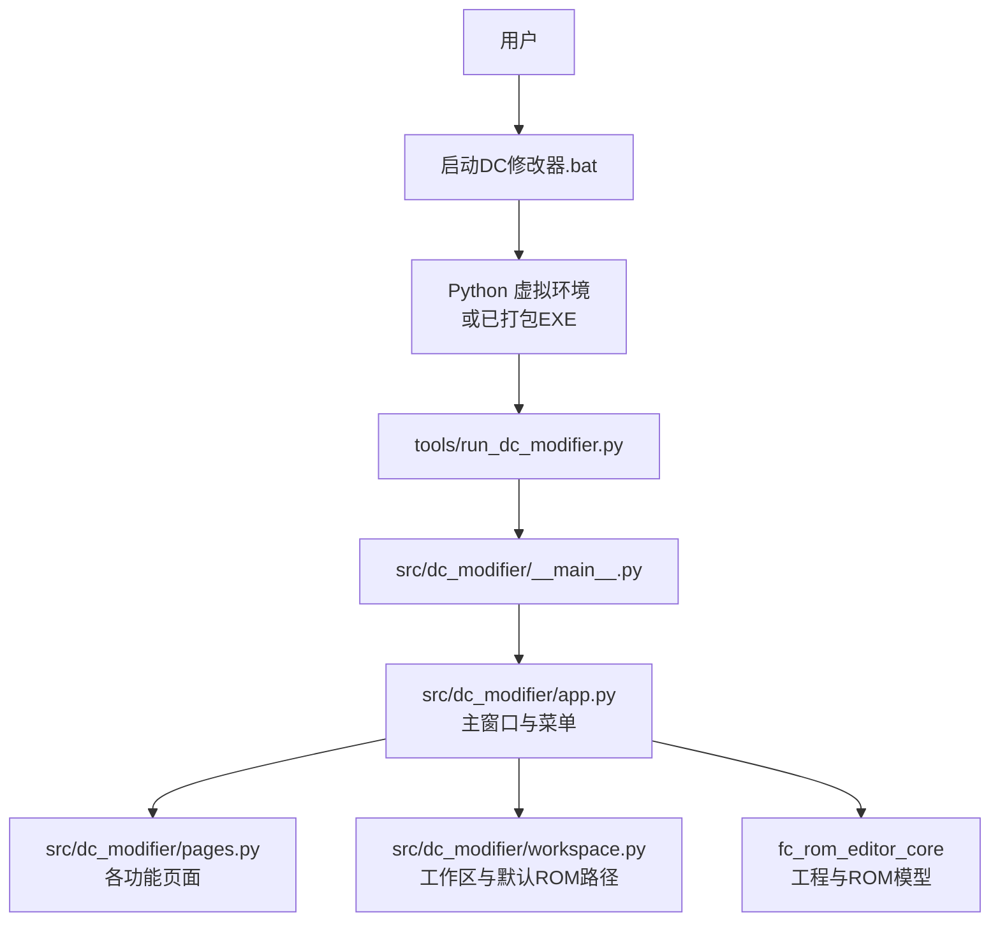
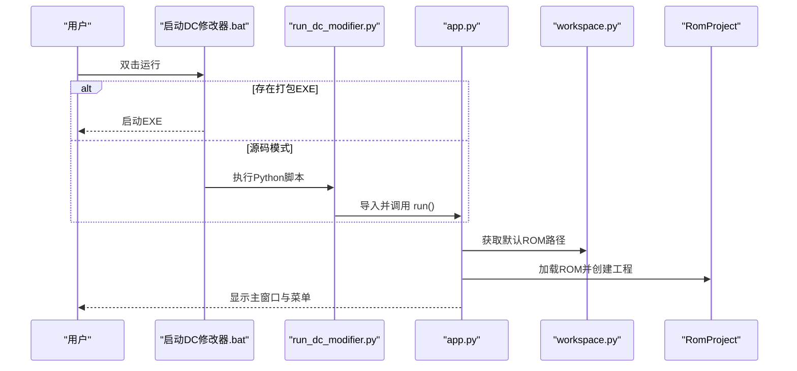
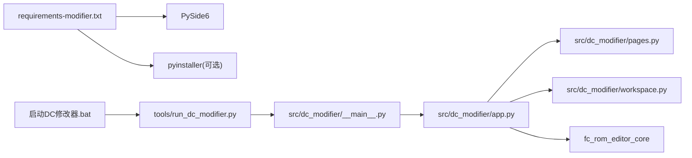

# 快速开始

<cite>
**本文引用的文件**
- [启动DC修改器.bat](file://启动DC修改器.bat)
- [pyproject.toml](file://pyproject.toml)
- [requirements-modifier.txt](file://requirements-modifier.txt)
- [tools/run_dc_modifier.py](file://tools/run_dc_modifier.py)
- [src/dc_modifier/__main__.py](file://src/dc_modifier/__main__.py)
- [src/dc_modifier/app.py](file://src/dc_modifier/app.py)
- [src/dc_modifier/workspace.py](file://src/dc_modifier/workspace.py)
- [src/dc_modifier/pages.py](file://src/dc_modifier/pages.py)
- [docs/交接文档.md](file://docs/交接文档.md)
</cite>

## 目录
1. [简介](#简介)
2. [项目结构](#项目结构)
3. [核心组件](#核心组件)
4. [架构总览](#架构总览)
5. [详细组件分析](#详细组件分析)
6. [依赖分析](#依赖分析)
7. [性能注意事项](#性能注意事项)
8. [故障排除指南](#故障排除指南)
9. [结论](#结论)
10. [附录](#附录)

## 简介
本指南面向首次使用“新DC篇完整修改器”的用户，目标是让你在最短时间内完成环境准备、安装与首次运行，并掌握打开ROM、创建/加载工程、基本界面导航与常用操作。文末提供常见问题与排错建议，帮助你顺利完成任务。

## 项目结构
仓库采用标准 Python 包布局：
- src：核心源码（dc_modifier 图形界面、fc_editor ROM 模型与资源系统）
- tools：运行脚本、打包与构建工具
- output：构建产物与导出目录（默认输出路径由工作区决定）
- references：只读参考数据（禁止作为输出目标）
- docs：文档与交接资料

图表来源
- [启动DC修改器.bat:1-16](file://启动DC修改器.bat#L1-L16)
- [tools/run_dc_modifier.py:1-30](file://tools/run_dc_modifier.py#L1-L30)
- [src/dc_modifier/__main__.py:1-6](file://src/dc_modifier/__main__.py#L1-L6)
- [src/dc_modifier/app.py:236-488](file://src/dc_modifier/app.py#L236-L488)
- [src/dc_modifier/workspace.py:1-43](file://src/dc_modifier/workspace.py#L1-L43)

章节来源
- [启动DC修改器.bat:1-16](file://启动DC修改器.bat#L1-L16)
- [pyproject.toml:1-31](file://pyproject.toml#L1-L31)
- [requirements-modifier.txt:1-3](file://requirements-modifier.txt#L1-L3)
- [tools/run_dc_modifier.py:1-30](file://tools/run_dc_modifier.py#L1-L30)
- [src/dc_modifier/__main__.py:1-6](file://src/dc_modifier/__main__.py#L1-L6)
- [src/dc_modifier/app.py:236-488](file://src/dc_modifier/app.py#L236-L488)
- [src/dc_modifier/workspace.py:1-43](file://src/dc_modifier/workspace.py#L1-L43)

## 核心组件
- 启动入口
  - Windows 快捷启动：双击“启动DC修改器.bat”，优先尝试直接运行打包好的 EXE；若不存在则自动进入源码模式，要求存在虚拟环境。
  - 源码入口：通过 Python 执行 tools/run_dc_modifier.py，最终调用 dc_modifier.app.run。
- 主程序与界面
  - app.py 定义启动对话框、主窗口、菜单栏与各类编辑工具入口（数据库、剧情事件、字体库、地图动画、文本转换等）。
  - pages.py 提供工程概览、容量规划、变更与验证等页面，以及通用页面基类与ID解析工具。
- 工作区与默认ROM
  - workspace.py 根据运行方式（打包/源码）定位工作区根目录，确定默认ROM路径与默认导出目录，并限制不可写入 references。
- ROM与工程
  - 通过 fc_rom_editor_core.RomProject 加载ROM、管理工程状态、资源分配与构建检查。

章节来源
- [启动DC修改器.bat:1-16](file://启动DC修改器.bat#L1-L16)
- [tools/run_dc_modifier.py:1-30](file://tools/run_dc_modifier.py#L1-L30)
- [src/dc_modifier/__main__.py:1-6](file://src/dc_modifier/__main__.py#L1-L6)
- [src/dc_modifier/app.py:236-488](file://src/dc_modifier/app.py#L236-L488)
- [src/dc_modifier/pages.py:103-200](file://src/dc_modifier/pages.py#L103-L200)
- [src/dc_modifier/workspace.py:1-43](file://src/dc_modifier/workspace.py#L1-L43)

## 架构总览
下图展示从启动到打开ROM、进入主界面的关键流程。

图表来源
- [启动DC修改器.bat:1-16](file://启动DC修改器.bat#L1-L16)
- [tools/run_dc_modifier.py:1-30](file://tools/run_dc_modifier.py#L1-L30)
- [src/dc_modifier/app.py:236-488](file://src/dc_modifier/app.py#L236-L488)
- [src/dc_modifier/workspace.py:1-43](file://src/dc_modifier/workspace.py#L1-L43)

## 详细组件分析

### 环境与安装
- 系统与环境要求
  - Python 版本：>= 3.10
  - GUI 框架：PySide6 >= 6.8, < 7
  - 可选打包依赖：pyinstaller（用于生成独立EXE）
- 推荐安装步骤
  - 创建虚拟环境：python -m venv .venv
  - 激活虚拟环境后安装依赖：pip install -r requirements-modifier.txt
  - 或直接使用提供的批处理文件启动（会自动检测虚拟环境）
- 首次运行
  - 双击“启动DC修改器.bat”
    - 若检测到 output/app/新DC篇完整修改器.exe，则直接启动该EXE
    - 否则在源码模式下运行 tools/run_dc_modifier.py
  - 首次启动会尝试加载默认ROM（优先 output/rom/DC_kuorong_464K.nes，其次旧兼容基线）

章节来源
- [pyproject.toml:5-23](file://pyproject.toml#L5-L23)
- [requirements-modifier.txt:1-3](file://requirements-modifier.txt#L1-L3)
- [启动DC修改器.bat:1-16](file://启动DC修改器.bat#L1-L16)
- [tools/run_dc_modifier.py:1-30](file://tools/run_dc_modifier.py#L1-L30)
- [src/dc_modifier/workspace.py:7-26](file://src/dc_modifier/workspace.py#L7-L26)

### 打开ROM与创建/加载工程
- 打开ROM
  - 菜单栏“文件”→“打开…”，选择你的NES ROM
  - 或通过拖拽ROM文件到主窗口打开
  - 应用层会在加载时校验ROM身份与扩展计划是否就绪
- 创建/加载工程
  - 菜单栏“工程”→“打开工程…”加载已有工程
  - “保存工程”/“工程另存为…”保存当前修改与配置
  - 工程保存后会记录工作区快照，便于撤销/重做与对比

章节来源
- [src/dc_modifier/app.py:399-488](file://src/dc_modifier/app.py#L399-L488)
- [src/dc_modifier/app.py:756-793](file://src/dc_modifier/app.py#L756-L793)
- [src/dc_modifier/app.py:794-800](file://src/dc_modifier/app.py#L794-L800)

### 基本界面导航与常用操作
- 主窗口左侧导航列表包含：战场地图、机体、人物、武器、剧情文本、战场事件、劝降条件、背景音乐、工程概览、容量规划、变更与验证等
- 顶部菜单栏提供：
  - 文件：打开/保存ROM、退出
  - 数据：数据库、完整ROM数据读取、文字库、地图动画、文字转换、剧情事件、导出机体/头像、属性计算器、存档修改器、其他设置
  - 扩展功能：战斗背景音乐、机体导入与CHR图像、扩展容量规划、工程概览、变更与验证
  - 工程：打开/保存工程、ROM另存为、导出IPS、一键构建、撤销/重做、完整检查、关于与安全说明
- 状态栏显示会话状态、坐标信息、修改字节数等

章节来源
- [src/dc_modifier/app.py:342-488](file://src/dc_modifier/app.py#L342-L488)
- [src/dc_modifier/pages.py:154-200](file://src/dc_modifier/pages.py#L154-L200)

### 简单编辑示例（体验核心功能）
- 修改机体属性
  - 点击“数据”→“数据库”，切换到“机体”页签，调整数值后确认
- 编辑剧情文本
  - 点击“数据”→“剧情事件”，在对应页签中修改文本并确认
- 查看与规划容量
  - 点击“扩展功能”→“扩展容量规划”，查看可用区域与分配情况
- 导出与构建
  - 工程菜单支持“ROM另存为”、“导出IPS”、“一键构建”

章节来源
- [src/dc_modifier/app.py:399-488](file://src/dc_modifier/app.py#L399-L488)
- [src/dc_modifier/pages.py:154-200](file://src/dc_modifier/pages.py#L154-L200)

## 依赖分析
- 运行时依赖
  - PySide6：桌面GUI
  - Python >= 3.10
- 开发/打包依赖
  - pyinstaller：打包为独立EXE
  - 其他工具依赖（如报告生成、模拟器交互）按需启用
- 模块关系
  - 启动脚本 → 运行器 → 应用主模块 → 页面与工具 → ROM工程核心

图表来源
- [requirements-modifier.txt:1-3](file://requirements-modifier.txt#L1-L3)
- [启动DC修改器.bat:1-16](file://启动DC修改器.bat#L1-L16)
- [tools/run_dc_modifier.py:1-30](file://tools/run_dc_modifier.py#L1-L30)
- [src/dc_modifier/__main__.py:1-6](file://src/dc_modifier/__main__.py#L1-L6)
- [src/dc_modifier/app.py:236-488](file://src/dc_modifier/app.py#L236-L488)
- [src/dc_modifier/pages.py:1-46](file://src/dc_modifier/pages.py#L1-L46)
- [src/dc_modifier/workspace.py:1-43](file://src/dc_modifier/workspace.py#L1-L43)

章节来源
- [pyproject.toml:5-23](file://pyproject.toml#L5-L23)
- [requirements-modifier.txt:1-3](file://requirements-modifier.txt#L1-L3)

## 性能注意事项
- 大文件操作
  - 打开/保存ROM与工程时避免同时开启过多编辑器窗口，减少内存占用
- 批量导入
  - 音乐/图像导入建议在“扩展功能”中进行，分批处理更稳定
- 构建与验证
  - 使用“完整检查”与“一键构建”前，确保未进行大量未提交草稿

[本节为通用指导，不直接分析具体文件]

## 故障排除指南
- 无法启动或提示缺少依赖
  - 确认已创建并激活虚拟环境，且安装了 requirements-modifier.txt 中的依赖
  - 若使用源码模式，请确保 Python 版本 >= 3.10
- 找不到默认ROM
  - 检查 output/rom/DC_kuorong_464K.nes 是否存在；若不存在，将回退到旧兼容基线
  - 也可通过“文件”→“打开…”手动选择ROM
- 输出被拒绝
  - 禁止向 references 目录写入；如需导出，请使用 output/exports 或其他自定义目录
- 构建失败或ROM异常
  - 先执行“完整检查”，再尝试“一键构建”
  - 关注状态栏与错误提示，必要时导出日志或截图反馈
- 模拟器兼容性
  - 生成的ROM需使用支持 Mapper 194 的模拟器或设备；已知部分模拟器实现可能不兼容

章节来源
- [启动DC修改器.bat:1-16](file://启动DC修改器.bat#L1-L16)
- [tools/run_dc_modifier.py:13-25](file://tools/run_dc_modifier.py#L13-L25)
- [src/dc_modifier/workspace.py:23-43](file://src/dc_modifier/workspace.py#L23-L43)
- [docs/交接文档.md:178-183](file://docs/交接文档.md#L178-L183)

## 结论
通过本指南，你应能完成环境搭建、首次运行与基础编辑任务。建议后续结合“工程概览”和“扩展容量规划”了解整体资源布局，并使用“变更与验证”保障修改质量。遇到问题可参考故障排除部分，或查阅交接文档获取更多技术细节。

[本节为总结性内容，不直接分析具体文件]

## 附录
- 推荐工作流（来自工程概览页面）
  - 打开 DC_kuorong_464K.nes → 自动规划扩展容量 → 修改并随时验证 → 保存工程并构建ROM/IPS
- 安全规则
  - 不会覆盖当前载入的基准ROM；音频引擎、固定银行和CHR区域由构建检查保护

章节来源
- [src/dc_modifier/pages.py:154-200](file://src/dc_modifier/pages.py#L154-L200)