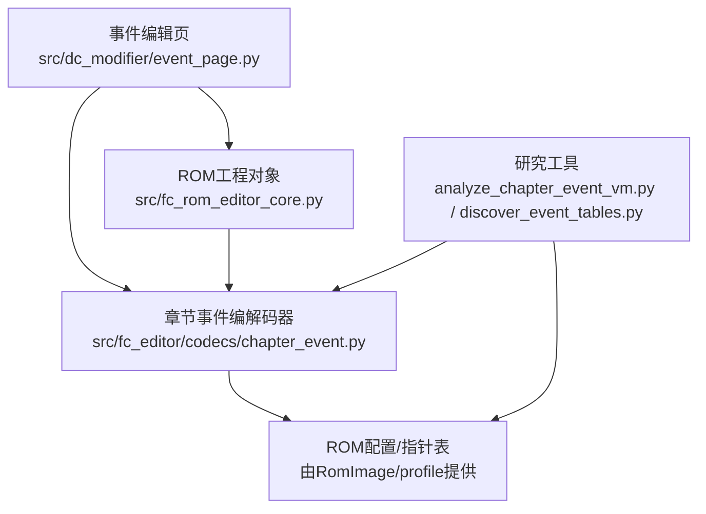
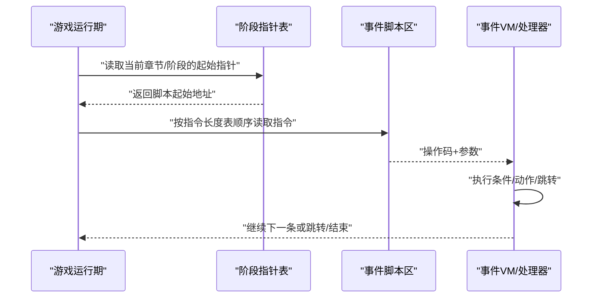
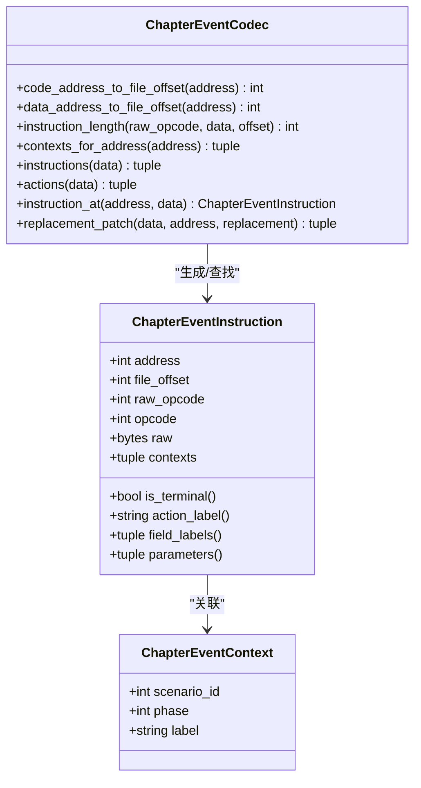
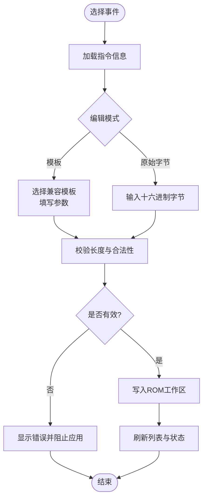
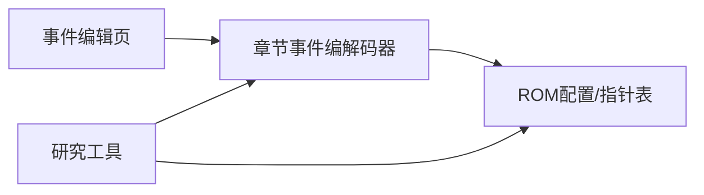

# 事件编辑器

<cite>
**本文引用的文件**
- [event_page.py](file://src/dc_modifier/event_page.py)
- [chapter_event.py](file://src/fc_editor/codecs/chapter_event.py)
- [event.py](file://src/fc_editor/codecs/event.py)
- [analyze_chapter_event_vm.py](file://tools/research/analyze_chapter_event_vm.py)
- [discover_event_tables.py](file://tools/research/discover_event_tables.py)
- [fc_rom_editor_core.py](file://src/fc_rom_editor_core.py)
</cite>

## 目录
1. [简介](#简介)
2. [项目结构](#项目结构)
3. [核心组件](#核心组件)
4. [架构总览](#架构总览)
5. [详细组件分析](#详细组件分析)
6. [依赖关系分析](#依赖关系分析)
7. [性能考量](#性能考量)
8. [故障排查指南](#故障排查指南)
9. [结论](#结论)
10. [附录](#附录)

## 简介
本文件聚焦于FC游戏“事件编辑器”的核心能力与实现原理，覆盖以下主题：
- 事件类型设置：对话、战斗相关判定、物品获取、场景转换等指令的编辑入口与约束。
- 条件判断配置：变量检查、标志位检测、时间/阶段条件等如何以操作码形式表达。
- 执行动作设置：脚本调用、参数传递、返回值处理（在固定长度指令模型下的限制）。
- FC事件系统实现：事件表结构、指令集、执行流程与指针表组织。
- 事件设计模式：常见事件类型的实现方法、性能优化策略与调试技巧。
- 复杂事件案例：交互式剧情与动态游戏逻辑的组合方式。

## 项目结构
围绕事件编辑器的代码主要分布在三层：
- UI层：战场事件编辑页，提供筛选、模板应用、原始字节编辑、复制粘贴等交互。
- 编解码层：章节事件指令解析、长度推断、上下文定位；通用事件脚本解码器。
- ROM工程层：ROM工程对象暴露章节事件编解码器，并提供写入/还原接口。

**图表来源**
- [event_page.py:66-228](file://src/dc_modifier/event_page.py#L66-L228)
- [chapter_event.py:183-328](file://src/fc_editor/codecs/chapter_event.py#L183-L328)
- [fc_rom_editor_core.py:576-600](file://src/fc_rom_editor_core.py#L576-L600)
- [analyze_chapter_event_vm.py:86-104](file://tools/research/analyze_chapter_event_vm.py#L86-L104)
- [discover_event_tables.py:33-72](file://tools/research/discover_event_tables.py#L33-L72)

**章节来源**
- [event_page.py:66-228](file://src/dc_modifier/event_page.py#L66-L228)
- [chapter_event.py:183-328](file://src/fc_editor/codecs/chapter_event.py#L183-L328)
- [fc_rom_editor_core.py:576-600](file://src/fc_rom_editor_core.py#L576-L600)

## 核心组件
- 章节事件编解码器：负责从ROM中读取章节事件指针表、按指令长度表解析指令、为每个指令标注所属章节/阶段/标签，并支持等长替换。
- 事件编辑页：提供UI筛选（章节、阶段、指令组）、模板快速填充、原始字节编辑、状态校验与安全边界提示。
- 通用事件脚本解码器：用于发现/验证视觉事件脚本区域的结构特征（终止符、命令字范围等）。
- ROM工程对象：封装章节事件编解码器实例，暴露更新/还原章节事件指令的方法。

关键职责划分：
- 编解码器专注“不可失真的等长编辑”，保证不破坏后续指令对齐。
- UI层负责“易用性”和“安全提示”，避免用户误改导致脚本越界或错位。
- 研究工具辅助“反汇编/启发式扫描”，帮助确认指令长度表和脚本区域。

**章节来源**
- [chapter_event.py:11-23](file://src/fc_editor/codecs/chapter_event.py#L11-L23)
- [chapter_event.py:150-181](file://src/fc_editor/codecs/chapter_event.py#L150-L181)
- [chapter_event.py:227-328](file://src/fc_editor/codecs/chapter_event.py#L227-L328)
- [event_page.py:31-63](file://src/dc_modifier/event_page.py#L31-L63)
- [event_page.py:238-281](file://src/dc_modifier/event_page.py#L238-L281)
- [event.py:49-109](file://src/fc_editor/codecs/event.py#L49-L109)
- [fc_rom_editor_core.py:576-600](file://src/fc_rom_editor_core.py#L576-L600)

## 架构总览
事件系统在FC游戏中的典型组织方式：
- 指针表：每章多阶段（如我方阶段、敌方阶段）各有一张指针表，指向该阶段的事件脚本起始地址。
- 指令流：脚本区由固定长度的指令序列组成，每条指令包含操作码与若干参数。
- 执行流程：运行时根据当前阶段与指针表加载对应脚本，逐条执行指令，直至结束或跳转。

**图表来源**
- [chapter_event.py:212-220](file://src/fc_editor/codecs/chapter_event.py#L212-L220)
- [chapter_event.py:262-288](file://src/fc_editor/codecs/chapter_event.py#L262-L288)
- [analyze_chapter_event_vm.py:86-104](file://tools/research/analyze_chapter_event_vm.py#L86-L104)

## 详细组件分析

### 章节事件编解码器（ChapterEventCodec）
- 指令长度表：硬编码了已知操作码的长度，特殊指令（如打开文字窗口）根据参数决定长度。
- 上下文标注：通过阶段指针表，将每条指令映射到其所属的章节、阶段与标签。
- 等长替换：只允许用与原指令相同长度的新指令替换，确保不破坏脚本对齐。

**图表来源**
- [chapter_event.py:150-181](file://src/fc_editor/codecs/chapter_event.py#L150-L181)
- [chapter_event.py:183-328](file://src/fc_editor/codecs/chapter_event.py#L183-L328)

**章节来源**
- [chapter_event.py:11-23](file://src/fc_editor/codecs/chapter_event.py#L11-L23)
- [chapter_event.py:212-220](file://src/fc_editor/codecs/chapter_event.py#L212-L220)
- [chapter_event.py:227-328](file://src/fc_editor/codecs/chapter_event.py#L227-L328)

### 事件编辑页（EventPage）
- 筛选与展示：按章节、阶段、指令组过滤，显示地址、上下文、动作、参数与原始字节。
- 模板与原始字节双通道：既可用预定义模板快速填充参数，也可手动输入十六进制字节进行等长替换。
- 安全边界：严格校验新指令长度与原槽一致，防止越界或错位；对未知操作码给出“语义未验证”的提示。

**图表来源**
- [event_page.py:238-281](file://src/dc_modifier/event_page.py#L238-L281)
- [event_page.py:566-636](file://src/dc_modifier/event_page.py#L566-L636)
- [event_page.py:655-700](file://src/dc_modifier/event_page.py#L655-L700)

**章节来源**
- [event_page.py:31-63](file://src/dc_modifier/event_page.py#L31-L63)
- [event_page.py:238-281](file://src/dc_modifier/event_page.py#L238-L281)
- [event_page.py:566-636](file://src/dc_modifier/event_page.py#L566-L636)
- [event_page.py:655-700](file://src/dc_modifier/event_page.py#L655-L700)

### 通用事件脚本解码器（EventScriptCodec）
- 用途：识别视觉事件脚本区域的指令集合，统计终止符与命令字比例，辅助发现脚本表位置。
- 特性：支持变长指令解析，遇到未知操作码时按最小长度处理，便于扫描与评分。

**章节来源**
- [event.py:49-109](file://src/fc_editor/codecs/event.py#L49-L109)

### 研究工具
- 指令长度推断：通过反汇编章节事件处理器，追踪Y寄存器推进路径，推断各操作码长度集合。
- 脚本表发现：扫描PRG Bank中的指针表，评估脚本有效性（终止符、命令字），排序候选区域。

**章节来源**
- [analyze_chapter_event_vm.py:25-83](file://tools/research/analyze_chapter_event_vm.py#L25-L83)
- [analyze_chapter_event_vm.py:86-104](file://tools/research/analyze_chapter_event_vm.py#L86-L104)
- [discover_event_tables.py:25-72](file://tools/research/discover_event_tables.py#L25-L72)

## 依赖关系分析
- UI依赖编解码器：事件编辑页通过章节事件编解码器获取指令列表、上下文与长度校验。
- 编解码器依赖ROM配置：章节事件指针表、数据区范围、阶段标签等来自ROM profile。
- 研究工具反向验证：通过反汇编与扫描结果，校验/修正指令长度表与脚本区域假设。

**图表来源**
- [event_page.py:238-281](file://src/dc_modifier/event_page.py#L238-L281)
- [chapter_event.py:183-220](file://src/fc_editor/codecs/chapter_event.py#L183-L220)
- [analyze_chapter_event_vm.py:86-104](file://tools/research/analyze_chapter_event_vm.py#L86-L104)
- [discover_event_tables.py:33-72](file://tools/research/discover_event_tables.py#L33-L72)

**章节来源**
- [event_page.py:238-281](file://src/dc_modifier/event_page.py#L238-L281)
- [chapter_event.py:183-220](file://src/fc_editor/codecs/chapter_event.py#L183-L220)

## 性能考量
- 等长替换：保持指令长度不变，避免重排脚本区，降低运行时风险与计算开销。
- 批量刷新：UI在筛选变化时批量更新表格，减少重绘次数。
- 指令长度表：使用静态表快速判断长度，仅在特殊指令分支中进行额外参数检查。
- 研究工具：离线反汇编与扫描，不影响运行时性能。

[本节为通用指导，无需具体文件引用]

## 故障排查指南
常见问题与定位方法：
- 未知操作码：当出现未知操作码时，检查指令长度表是否完整，必要时使用研究工具反汇编处理器推导长度。
- 参数越界：确保新指令长度与原槽一致；若提示“参数越过脚本区”，说明替换后超出脚本边界。
- 指针无效：阶段指针表中的地址必须落在脚本区内，否则需修正指针或调整脚本区范围。
- 模板冲突：同时修改模板参数与原始字节会导致冲突，需明确应用其中一种。

**章节来源**
- [chapter_event.py:227-237](file://src/fc_editor/codecs/chapter_event.py#L227-L237)
- [chapter_event.py:262-288](file://src/fc_editor/codecs/chapter_event.py#L262-L288)
- [event_page.py:566-636](file://src/dc_modifier/event_page.py#L566-L636)

## 结论
事件编辑器以“等长替换”为核心原则，结合章节事件指针表与指令长度表，实现对FC游戏事件的安全、直观编辑。UI层提供模板化与原始字节双通道编辑，研究工具辅助验证指令长度与脚本区域。通过严格的长度校验与上下文标注，编辑器能够在不破坏运行时结构的前提下，完成对话、战斗判定、物品获取、场景转换等复杂事件的组合与调试。

[本节为总结，无需具体文件引用]

## 附录

### 事件类型与指令集概览
- 条件类：回合判定、开关判定、人物行动限制、数量判定、持有道具、受伤判定、范围判定、移动/攻击判定等。
- 对白与镜头：无光标对话、光标对话、文字窗口控制、光标移动、等待等。
- 增援与加入：客军/敌军增援、我方出击/加入、说得/正式加入、临时友军/转为敌军、自爆/撤退/移除等。
- 奖励与胜负：获得道具/金钱、直接经验金钱、队友离队、等级提升、关卡胜利/失败、通关等。
- 扩展指令：保留/扩展别名指令，用于兼容不同版本或扩展功能。

**章节来源**
- [chapter_event.py:25-147](file://src/fc_editor/codecs/chapter_event.py#L25-L147)

### 条件判断配置示例（概念性）
- 变量检查：通过“持有道具判定”“人物在队伍/战场/母舰判定”等指令间接访问变量。
- 标志位检测：使用“开关判定”“回合判定”等指令读取标志位。
- 时间条件：利用“等待指定帧数”“立即播放音乐”等指令配合阶段指针表实现时序控制。

[本节为概念性说明，无需具体文件引用]

### 执行动作设置与返回值处理（概念性）
- 参数传递：增援、加入、替换等操作通过参数传递坐标、人物ID、机体ID、等级、AI标志等。
- 返回值处理：在固定长度指令模型下，通常不直接返回数值；可通过设置标志位或变量间接表达结果。
- 跳转控制：无条件跳转、条件成立/不成立跳转用于构建分支逻辑。

[本节为概念性说明，无需具体文件引用]

### 复杂事件案例：交互式剧情与动态逻辑
- 多阶段分支：利用阶段指针表切换不同脚本，实现剧情分支。
- 条件组合：多个条件指令串联，形成复杂判定树。
- 资源管理：增援与离队指令组合，动态管理单位与资源。
- 反馈机制：对白与镜头指令配合，提供玩家反馈与沉浸感。

[本节为概念性说明，无需具体文件引用]