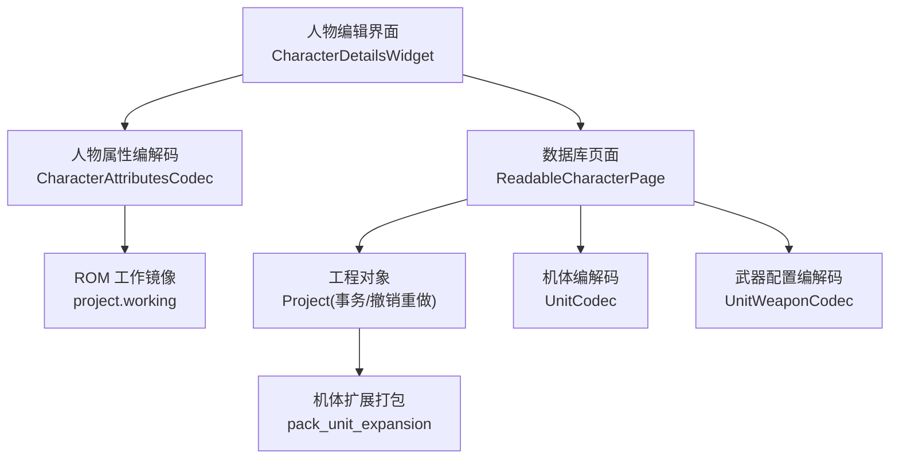
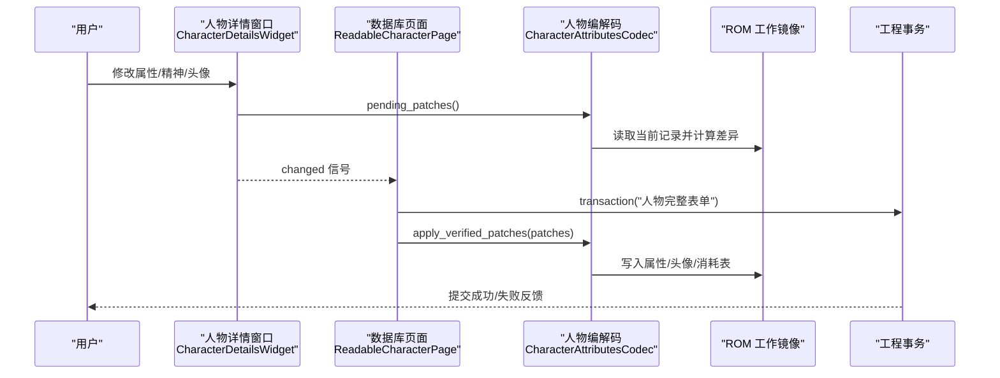
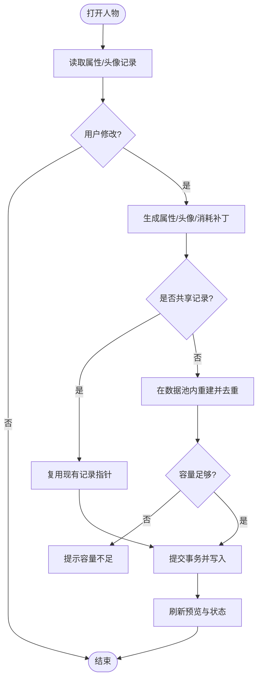
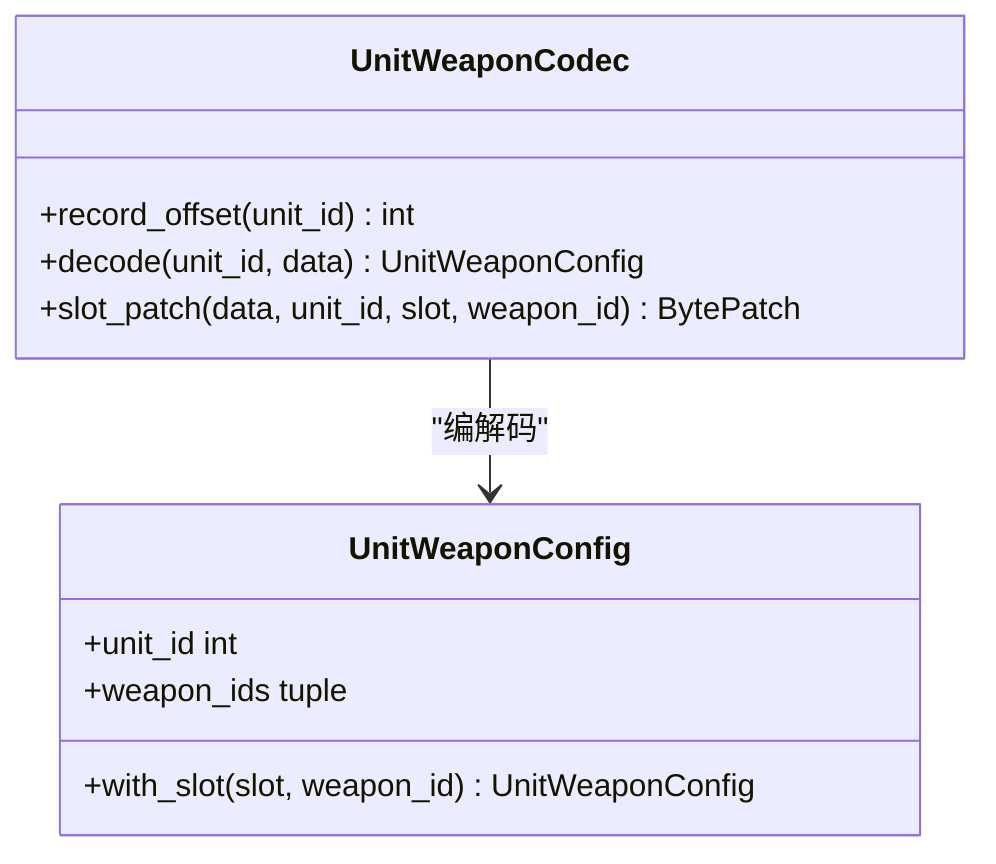
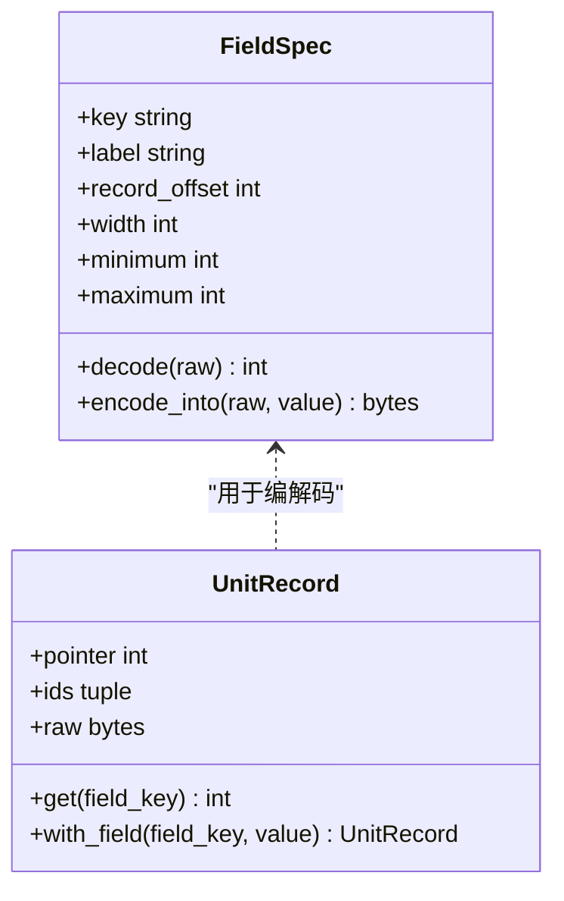
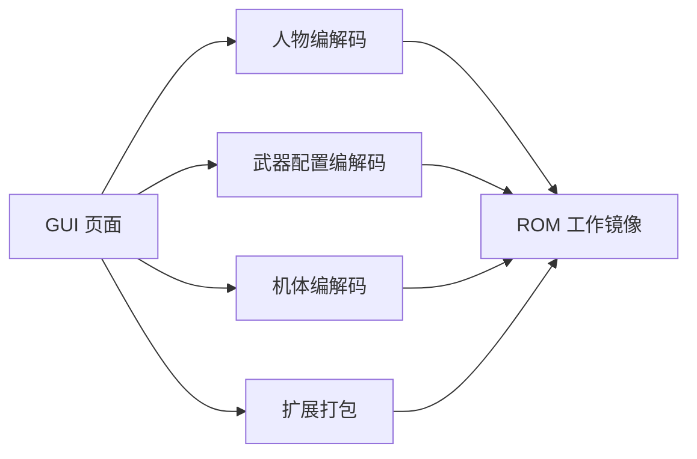

# 人物编辑器

<cite>
**本文引用的文件**
- [character_editor.py](file://src/dc_modifier/character_editor.py)
- [database_records.py](file://src/dc_modifier/database_records.py)
- [character_attributes.py](file://src/fc_editor/codecs/character_attributes.py)
- [unit.py](file://src/fc_editor/codecs/unit.py)
- [unit_weapon.py](file://src/fc_editor/codecs/unit_weapon.py)
- [models.py](file://src/fc_editor/models.py)
- [expansion_unit.py](file://src/fc_editor/expansion_unit.py)
- [README.md](file://README.md)
</cite>

## 目录
1. [简介](#简介)
2. [项目结构](#项目结构)
3. [核心组件](#核心组件)
4. [架构总览](#架构总览)
5. [详细组件分析](#详细组件分析)
6. [依赖关系分析](#依赖关系分析)
7. [性能与容量特性](#性能与容量特性)
8. [故障排查指南](#故障排查指南)
9. [结论](#结论)
10. [附录：ROM存储结构与偏移地址](#附录rom存储结构与偏移地址)

## 简介
本文件面向《第二次机器人大战》新 DC 篇扩容 ROM 的人物编辑器，系统说明人物编辑器的功能边界、数据在 ROM 中的存储结构、以及创建/修改/批量操作的实用技巧与平衡性调整建议。内容基于源码中已验证的编解码器、GUI 页面与构建流程，确保与实际运行行为一致。

## 项目结构
- GUI 层位于 `src/dc_modifier/`，负责人物/武器/地图等可视化编辑与事务提交。
- ROM 模型与编解码位于 `src/fc_editor/`，提供人物属性、头像、武器、机体、扩展 Bank 的安全读写与校验。
- 工程会话与构建编排由 `src/fc_rom_editor_core.py` 管理（本文件不直接引用）。
- 文档与使用说明见仓库根 README。

**图示来源**
- [character_editor.py:17-334](file://src/dc_modifier/character_editor.py#L17-L334)
- [database_records.py:105-267](file://src/dc_modifier/database_records.py#L105-L267)
- [character_attributes.py:78-237](file://src/fc_editor/codecs/character_attributes.py#L78-L237)
- [unit.py:14-120](file://src/fc_editor/codecs/unit.py#L14-L120)
- [unit_weapon.py:11-79](file://src/fc_editor/codecs/unit_weapon.py#L11-L79)
- [expansion_unit.py:540-800](file://src/fc_editor/expansion_unit.py#L540-L800)

**章节来源**
- [README.md:21-57](file://README.md#L21-L57)

## 核心组件
- 人物属性与头像编辑：支持精神值、成长曲线、五项补正、击落不消失、共享记录、头像四色与位置、上传 CHR 图块。
- 武器特技与距离补正：通过武器记录的高半字节与距离表索引进行安全写入。
- 机体武器槽位：每个机体两个武器 ID 槽位，支持读取与单槽替换。
- 机体基础属性与成长曲线：通过字段规范对 16 字节机体记录进行无损编解码。
- 扩展资源打包：将机体名称、属性、战斗外观、主体/碎片脚本安全迁移到托管 Bank 对。

**章节来源**
- [character_editor.py:17-334](file://src/dc_modifier/character_editor.py#L17-L334)
- [character_attributes.py:9-21](file://src/fc_editor/codecs/character_attributes.py#L9-L21)
- [unit.py:61-108](file://src/fc_editor/models.py#L61-L108)
- [unit_weapon.py:11-79](file://src/fc_editor/codecs/unit_weapon.py#L11-L79)
- [expansion_unit.py:130-175](file://src/fc_editor/expansion_unit.py#L130-L175)

## 架构总览
人物编辑从 UI 发起，经页面聚合补丁，调用编解码生成字节级 Patch，最终通过工程事务统一应用。

**图示来源**
- [character_editor.py:219-258](file://src/dc_modifier/character_editor.py#L219-L258)
- [database_records.py:198-220](file://src/dc_modifier/database_records.py#L198-L220)
- [character_attributes.py:193-237](file://src/fc_editor/codecs/character_attributes.py#L193-L237)

## 详细组件分析

### 人物属性与头像编辑
- 可编辑项：精神值、成长曲线（0—200 固定增长；201—250 选择第 0—49 号曲线）、强度/机动/防御/速度/HP 补正、击落不消失标志、24 项精神列表与消耗、头像颜色与图库位置、正面/背景 CHR 图块上传。
- 共享记录机制：若多个人物共用同一记录，勾选“同时修改共用属性记录”会一次性重写所有共享指针指向的记录；否则尝试在数据池内重建以去重。
- 头像预览：实时合成正面与背景，支持上传 32×32 图片并按四色量化写入 CHR。

**图示来源**
- [character_editor.py:165-258](file://src/dc_modifier/character_editor.py#L165-L258)
- [character_attributes.py:193-237](file://src/fc_editor/codecs/character_attributes.py#L193-L237)

**章节来源**
- [character_editor.py:17-334](file://src/dc_modifier/character_editor.py#L17-L334)
- [character_attributes.py:30-76](file://src/fc_editor/codecs/character_attributes.py#L30-L76)

### 武器特技与距离补正
- 武器特技：写入武器记录高半字节，对应内置技能表。
- 距离补正：选择 0—3 号命中修正表，需保证加载代码未变化。
- 使用统计：可列出装备该武器的所有机体及槽位，便于批量影响评估。

**图示来源**
- [unit_weapon.py:11-79](file://src/fc_editor/codecs/unit_weapon.py#L11-L79)
- [models.py:288-306](file://src/fc_editor/models.py#L288-L306)

**章节来源**
- [database_records.py:305-437](file://src/dc_modifier/database_records.py#L305-L437)
- [character_attributes.py:239-258](file://src/fc_editor/codecs/character_attributes.py#L239-L258)
- [unit_weapon.py:11-79](file://src/fc_editor/codecs/unit_weapon.py#L11-L79)

### 机体基础属性与成长曲线
- 字段定义：移动力、速度、强度、防卫、基础 HP、基础经验、特殊技能、地形适应、四项成长曲线 ID（速度/强度/防卫/HP）。
- 编解码：按 FieldSpec 的 record_offset、width、mask/shift 进行无损读写，支持范围校验与证据等级标注。

**图示来源**
- [models.py:13-58](file://src/fc_editor/models.py#L13-L58)
- [models.py:165-183](file://src/fc_editor/models.py#L165-L183)

**章节来源**
- [models.py:61-108](file://src/fc_editor/models.py#L61-L108)
- [unit.py:86-115](file://src/fc_editor/codecs/unit.py#L86-L115)

### 初始装备配置（武器槽）
- 每个机体固定两个武器 ID 槽位，位于独立武器配置表中。
- 支持读取当前配置、单槽替换，并在 GUI 中展示使用该武器的所有机体。

**章节来源**
- [unit_weapon.py:30-79](file://src/fc_editor/codecs/unit_weapon.py#L30-L79)
- [database_records.py:471-536](file://src/dc_modifier/database_records.py#L471-L536)

### 人物创建、修改与批量操作技巧
- 新建人物：优先复制已有角色（名称、音乐、属性、精神、头像），再微调成长曲线与补正。
- 批量修改：利用“共享记录”机制，将多人物指向同一记录，一次修改生效于所有共享者；如需差异化，则启用数据池重建。
- 头像批量替换：上传 CHR 图块前确认目标位置未被其他人物占用，避免重叠冲突。
- 武器批量调整：通过武器使用统计定位所有装备该武器的机体，逐一或批量更换武器槽位。

**章节来源**
- [database_records.py:238-267](file://src/dc_modifier/database_records.py#L238-L267)
- [character_attributes.py:202-237](file://src/fc_editor/codecs/character_attributes.py#L202-L237)
- [database_records.py:471-536](file://src/dc_modifier/database_records.py#L471-L536)

### 平衡性调整最佳实践
- 成长曲线：优先使用 0—200 固定增长实现线性强化；需要非线性时选择 201—250 对应的 50 条曲线之一。
- 补正字段：谨慎提升 HP/强度/防御，避免数值膨胀；机动与速度影响走位与先手，适度调整。
- 武器特技与距离：结合射程与命中修正表，控制远程/近战能力；避免过高的对空/陆/海攻击导致失衡。
- 共享记录：对同阵营同质化单位采用共享记录，减少冗余并便于全局平衡；对特色单位保持独立记录以便精细调参。

**章节来源**
- [character_attributes.py:30-57](file://src/fc_editor/codecs/character_attributes.py#L30-L57)
- [models.py:61-108](file://src/fc_editor/models.py#L61-L108)
- [character_attributes.py:239-258](file://src/fc_editor/codecs/character_attributes.py#L239-L258)

## 依赖关系分析
- GUI 依赖编解码器进行参数校验与补丁生成。
- 编解码器依赖 ROM Profile 与已验证的代码片段，确保格式稳定。
- 扩展打包依赖固定的 Bank 对与选择器描述符，保证运行时资源映射正确。

**图示来源**
- [character_editor.py:17-334](file://src/dc_modifier/character_editor.py#L17-L334)
- [database_records.py:105-267](file://src/dc_modifier/database_records.py#L105-L267)
- [character_attributes.py:78-237](file://src/fc_editor/codecs/character_attributes.py#L78-L237)
- [unit.py:14-120](file://src/fc_editor/codecs/unit.py#L14-L120)
- [unit_weapon.py:11-79](file://src/fc_editor/codecs/unit_weapon.py#L11-L79)
- [expansion_unit.py:540-800](file://src/fc_editor/expansion_unit.py#L540-L800)

**章节来源**
- [README.md:43-57](file://README.md#L43-L57)

## 性能与容量特性
- 数据池容量：人物属性与头像各自有固定数据池，超出容量时会触发重建与去重；若仍不足，需减少修正字段或启用共享记录。
- 扩展 Bank：机体资源可迁移至托管 Bank 对，支持 48/64/80 KiB 三种配额，名称、属性、战斗外观、主体/碎片脚本分别打包。
- 只读保护：部分区域（如字体写入、地图动画、存档写入）在当前版本为只读或未完全验证，避免破坏运行时。

**章节来源**
- [character_attributes.py:202-237](file://src/fc_editor/codecs/character_attributes.py#L202-L237)
- [expansion_unit.py:540-800](file://src/fc_editor/expansion_unit.py#L540-L800)
- [README.md:21-57](file://README.md#L21-L57)

## 故障排查指南
- 指针无效或越界：检查人物/机体记录指针是否在已验证范围内；错误信息会指出具体 ID 与指针值。
- 数据池容量不足：当新增记录导致池溢出时，优先启用共享记录或减少修正字段；必要时重新规划头像位置。
- 代码片段校验失败：若关键加载代码发生变化，编解码器会拒绝写入，需回退或更新 ROM 基线。
- 头像上传冲突：正面与背景 CHR 图块不能重叠且内容不同；请为它们选择不同的图库位置。

**章节来源**
- [unit.py:42-66](file://src/fc_editor/codecs/unit.py#L42-L66)
- [character_attributes.py:103-125](file://src/fc_editor/codecs/character_attributes.py#L103-L125)
- [character_attributes.py:239-258](file://src/fc_editor/codecs/character_attributes.py#L239-L258)
- [character_editor.py:240-253](file://src/dc_modifier/character_editor.py#L240-L253)

## 结论
人物编辑器围绕“已验证编解码 + 安全补丁 + 事务提交”的架构，提供了稳定可靠的人物属性、头像、武器与机体编辑能力。通过共享记录、数据池重建与扩展 Bank 打包，既能满足精细化调参，也能支撑大规模批量修改。遵循容量与校验规则，可有效避免运行时异常，保障 ROM 的可构建性与可维护性。

## 附录：ROM存储结构与偏移地址
- 人物属性表与数据池：
  - 属性指针表起始：$48400
  - 属性数据池：$48592 — $4876F
  - 指针偏置：$40010
  - 头像指针表起始：$AA46
  - 头像数据池：$ABD8 — $ADC9
  - 全局精神消耗表：$39B48（24 项）
- 人物记录格式要点：
  - 首两字节：精神值、成长值
  - 随后三字节：24 位精神掩码
  - 标志字节：低三位保留；高五位指示五项补正是否存在
  - 存在补正的字段依次追加：机动、强度、防御、速度、HP
- 头像记录格式要点：
  - 前三字节：调色板颜色索引
  - 第四、五字节：正面/背景图库寄存器
  - 第六、七字节：正面/背景位置编码（含高位标记）
- 机体武器配置表：
  - 每机体两字节武器 ID 槽位，位于独立表中，按机体 ID 顺序排列
- 机体基础属性记录：
  - 固定 16 字节，包含移动、速度、强度、防卫、HP、经验、特殊技能、地形适应与四项成长曲线 ID

**章节来源**
- [character_attributes.py:81-95](file://src/fc_editor/codecs/character_attributes.py#L81-L95)
- [character_attributes.py:157-185](file://src/fc_editor/codecs/character_attributes.py#L157-L185)
- [unit_weapon.py:30-58](file://src/fc_editor/codecs/unit_weapon.py#L30-L58)
- [models.py:61-108](file://src/fc_editor/models.py#L61-L108)