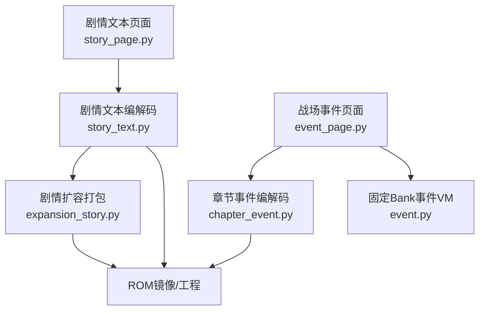
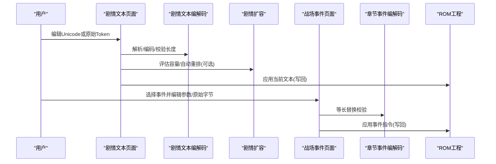
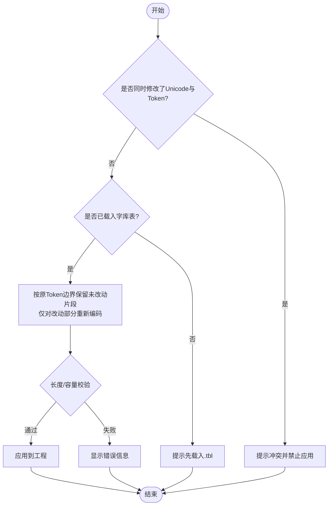
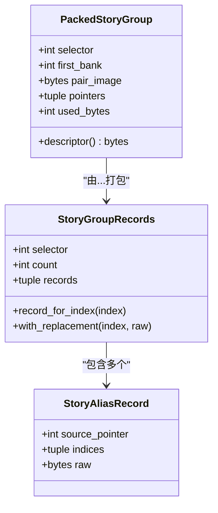
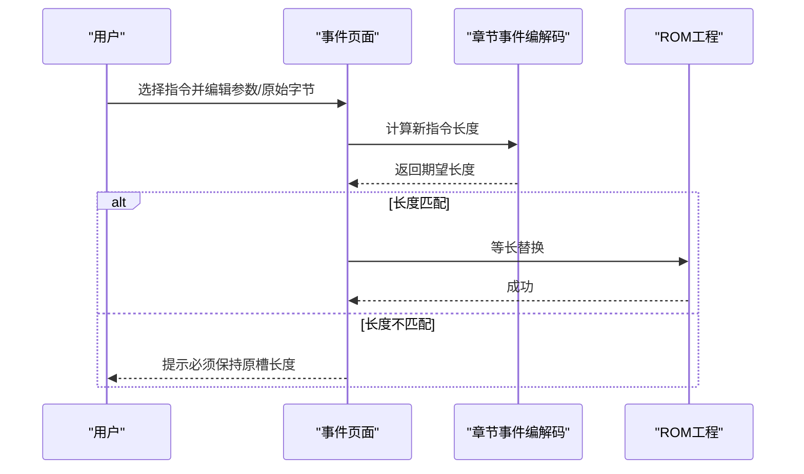
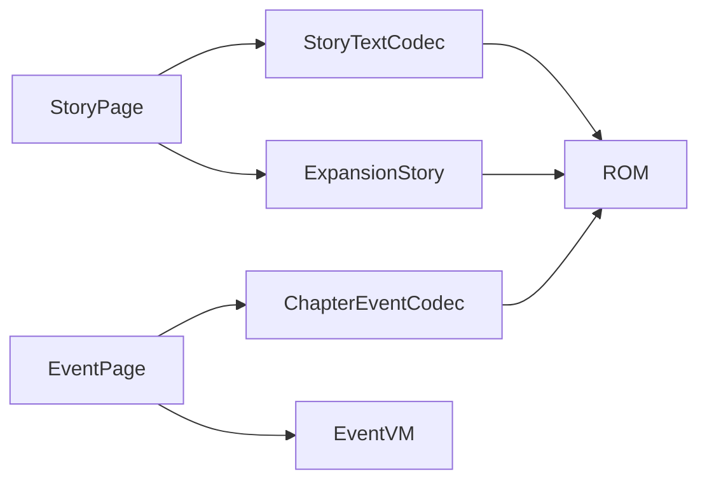
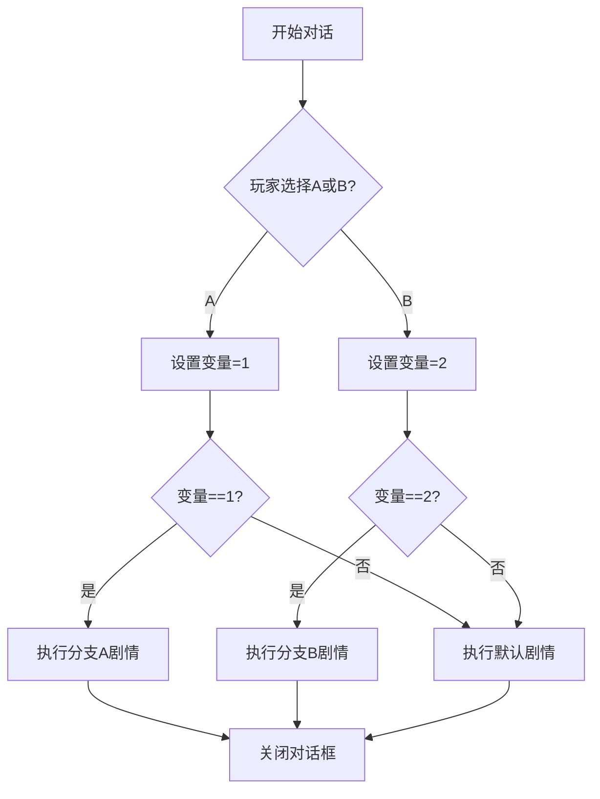

# 剧情文本编辑器

<cite>
**本文引用的文件**
- [story_page.py](file://src/dc_modifier/story_page.py)
- [event_page.py](file://src/dc_modifier/event_page.py)
- [story_text.py](file://src/fc_editor/codecs/story_text.py)
- [expansion_story.py](file://src/fc_editor/expansion_story.py)
- [chapter_event.py](file://src/fc_editor/codecs/chapter_event.py)
- [event.py](file://src/fc_editor/codecs/event.py)
</cite>

## 目录
1. [简介](#简介)
2. [项目结构](#项目结构)
3. [核心组件](#核心组件)
4. [架构总览](#架构总览)
5. [详细组件分析](#详细组件分析)
6. [依赖关系分析](#依赖关系分析)
7. [性能与容量考量](#性能与容量考量)
8. [故障排查指南](#故障排查指南)
9. [结论](#结论)
10. [附录：编写指南与案例](#附录编写指南与案例)

## 简介
本编辑器面向FC游戏“DC”的剧情内容制作，提供两大能力：
- 剧情文本编辑：支持多行文本输入、Unicode与原始Token双向编辑、字库表（.tbl）映射、控制参数可视化与保留。
- 分支剧情设置：通过章节事件指令实现条件分支、跳转逻辑与变量控制；配合剧情文本的显示控制（字体、颜色、速度等）完成完整叙事体验。

文档将说明ROM中剧情文本与事件的存储格式、组织结构，并提供编写指南与复杂分支案例。

## 项目结构
本项目围绕“UI页面 + 编解码器 + ROM工程”的分层组织：
- UI页面层：负责用户交互、筛选、预览与提交修改。
- 编解码层：负责无损解析/生成剧情文本与事件脚本，维护指针表、别名与容量边界。
- ROM工程层：封装工作镜像、扩展规划与写入策略。

**图示来源**
- [story_page.py:35-170](file://src/dc_modifier/story_page.py#L35-L170)
- [story_text.py:17-145](file://src/fc_editor/codecs/story_text.py#L17-L145)
- [expansion_story.py:175-297](file://src/fc_editor/expansion_story.py#L175-L297)
- [event_page.py:66-228](file://src/dc_modifier/event_page.py#L66-L228)
- [chapter_event.py:183-328](file://src/fc_editor/codecs/chapter_event.py#L183-L328)
- [event.py:28-109](file://src/fc_editor/codecs/event.py#L28-L109)

**章节来源**
- [story_page.py:35-170](file://src/dc_modifier/story_page.py#L35-L170)
- [event_page.py:66-228](file://src/dc_modifier/event_page.py#L66-L228)
- [story_text.py:17-145](file://src/fc_editor/codecs/story_text.py#L17-L145)
- [expansion_story.py:175-297](file://src/fc_editor/expansion_story.py#L175-L297)
- [chapter_event.py:183-328](file://src/fc_editor/codecs/chapter_event.py#L183-L328)
- [event.py:28-109](file://src/fc_editor/codecs/event.py#L28-L109)

## 核心组件
- 剧情文本页面（StoryPage）：提供文本组选择、搜索、双视图编辑（Unicode文字 / 原始Token）、码表载入与模板导出、Token解析展示、长度校验与应用。
- 剧情文本编解码（StoryTextCodec）：读取指针表、计算记录容量、按字形导字节与结束符进行无损分词，提供替换补丁与往返校验。
- 剧情扩容（expansion_story）：将一组剧情文本打包到独立16 KiB pair，维护描述符与指针表，支持自动重排与容量估算。
- 章节事件页面（EventPage）：按章节/阶段/类型筛选事件指令，提供模板化参数编辑与等长原始字节编辑，保证不移动脚本指针。
- 章节事件编解码（ChapterEventCodec）：解析固定地址的事件脚本区，提供指令长度计算、上下文定位与等长替换。
- 事件VM规范（event.py）：定义事件操作码集合与长度规则，辅助页面展示与校验。

**章节来源**
- [story_page.py:35-800](file://src/dc_modifier/story_page.py#L35-L800)
- [story_text.py:17-259](file://src/fc_editor/codecs/story_text.py#L17-L259)
- [expansion_story.py:12-297](file://src/fc_editor/expansion_story.py#L12-L297)
- [event_page.py:66-701](file://src/dc_modifier/event_page.py#L66-L701)
- [chapter_event.py:183-328](file://src/fc_editor/codecs/chapter_event.py#L183-L328)
- [event.py:28-109](file://src/fc_editor/codecs/event.py#L28-L109)

## 架构总览
下图展示了从用户编辑到ROM写入的关键流程，包括文本与事件两条主线。

**图示来源**
- [story_page.py:531-646](file://src/dc_modifier/story_page.py#L531-L646)
- [story_text.py:156-245](file://src/fc_editor/codecs/story_text.py#L156-L245)
- [expansion_story.py:232-297](file://src/fc_editor/expansion_story.py#L232-L297)
- [event_page.py:561-690](file://src/dc_modifier/event_page.py#L561-L690)
- [chapter_event.py:227-328](file://src/fc_editor/codecs/chapter_event.py#L227-L328)

## 详细组件分析

### 剧情文本编辑器（StoryPage）
- 功能要点
  - 文本组选择与索引列表：按selector分组，显示指针、容量与预览。
  - 双视图编辑：Unicode文字编辑与原始Token十六进制编辑，互斥草稿状态避免冲突。
  - 字库表（.tbl）：可载入外部映射，导出模板以收集实际使用的Token。
  - Token解析面板：逐条展示记录内偏移、字节与解释，便于定位控制参数。
  - 长度与容量校验：未启用扩容时严格等长；启用扩容后可自动重排并预估占用。
  - 应用与还原：提交前进行冲突检查与合法性验证，失败则阻止切换。

- 关键流程（Unicode→Token编码与保留不变Token）

**图示来源**
- [story_page.py:420-500](file://src/dc_modifier/story_page.py#L420-L500)
- [story_page.py:531-646](file://src/dc_modifier/story_page.py#L531-L646)

**章节来源**
- [story_page.py:35-800](file://src/dc_modifier/story_page.py#L35-L800)

### 剧情文本编解码（StoryTextCodec）
- 数据结构与复杂度
  - 指针表读取：O(N)读取count个2字节指针，校验范围与起始值。
  - 记录容量计算：基于相邻指针或终止符FF确定每条记录的容量，最坏O(M)扫描数据块。
  - 分词（tokenize）：按字形导字节集与结束符划分Token，时间复杂度O(L)，L为记录长度。
- 关键行为
  - 只按确认的指针边界拆分，未知Token原样保留，确保无损。
  - 提供replacement_patch用于精确覆盖指定记录，要求等长。
  - round_trip用于验证编解码一致性。

**章节来源**
- [story_text.py:17-259](file://src/fc_editor/codecs/story_text.py#L17-L259)

### 剧情扩容与存储布局（expansion_story）
- 存储格式
  - 每个selector对应一个16 KiB pair镜像，包含指针表与数据区。
  - 描述符位于固定偏移，首字节为直接描述标志，次字节为首Bank号。
  - 数据区从$8010开始，按记录顺序紧凑排列，记录以独立$FF结束。
- 打包过程
  - 提取现有记录与别名关系，校验终止符与越界。
  - 将记录写入pair镜像，回填指针表，计算used_bytes。
  - 若单pair不足，抛出容量不足错误，需分配更多空间。

**图示来源**
- [expansion_story.py:76-173](file://src/fc_editor/expansion_story.py#L76-L173)
- [expansion_story.py:175-297](file://src/fc_editor/expansion_story.py#L175-L297)

**章节来源**
- [expansion_story.py:12-297](file://src/fc_editor/expansion_story.py#L12-L297)

### 章节事件编辑器（EventPage）
- 功能要点
  - 按章节、阶段、类型筛选事件指令，支持全文检索。
  - 模板化参数编辑：根据指令长度提供预设模板，自动填充字段标签与单位/人物ID注解。
  - 等长原始字节编辑：专家模式可直接粘贴/编辑原始字节，保持槽位长度不变。
  - 安全边界：不插入或删除字节，避免移动脚本指针。

- 指令长度与替换流程

**图示来源**
- [event_page.py:561-690](file://src/dc_modifier/event_page.py#L561-L690)
- [chapter_event.py:227-328](file://src/fc_editor/codecs/chapter_event.py#L227-L328)

**章节来源**
- [event_page.py:66-701](file://src/dc_modifier/event_page.py#L66-L701)
- [chapter_event.py:183-328](file://src/fc_editor/codecs/chapter_event.py#L183-L328)
- [event.py:28-109](file://src/fc_editor/codecs/event.py#L28-L109)

## 依赖关系分析
- 页面与编解码器的耦合
  - StoryPage依赖StoryTextCodec进行分词与容量计算，依赖expansion_story进行扩容打包。
  - EventPage依赖ChapterEventCodec进行指令长度校验与上下文定位，依赖event.py中的操作码规范。
- 外部依赖
  - 字库表（.tbl）：用于Unicode↔Token映射，影响显示与编码结果。
  - ROM工程：提供工作镜像、配置与写入接口。

**图示来源**
- [story_page.py:35-170](file://src/dc_modifier/story_page.py#L35-L170)
- [event_page.py:66-228](file://src/dc_modifier/event_page.py#L66-L228)
- [story_text.py:17-145](file://src/fc_editor/codecs/story_text.py#L17-L145)
- [expansion_story.py:175-297](file://src/fc_editor/expansion_story.py#L175-L297)
- [chapter_event.py:183-328](file://src/fc_editor/codecs/chapter_event.py#L183-L328)
- [event.py:28-109](file://src/fc_editor/codecs/event.py#L28-L109)

**章节来源**
- [story_page.py:35-170](file://src/dc_modifier/story_page.py#L35-L170)
- [event_page.py:66-228](file://src/dc_modifier/event_page.py#L66-L228)
- [story_text.py:17-145](file://src/fc_editor/codecs/story_text.py#L17-L145)
- [expansion_story.py:175-297](file://src/fc_editor/expansion_story.py#L175-L297)
- [chapter_event.py:183-328](file://src/fc_editor/codecs/chapter_event.py#L183-L328)
- [event.py:28-109](file://src/fc_editor/codecs/event.py#L28-L109)

## 性能与容量考量
- 文本分词与编码
  - tokenize为线性扫描，适合短记录；大量记录时建议批量处理。
  - Unicode→Token编码采用“保留未改动Token”的策略，减少不必要重写，提升稳定性。
- 扩容打包
  - 单pair容量有限（约16 KiB减去指针表），超长时需分配额外Bank；打包前会预检容量，避免运行时溢出。
- 事件指令
  - 所有编辑保持等长，避免重排开销；复杂分支通过跳转指令组合实现。

[本节为通用指导，无需特定文件引用]

## 故障排查指南
- 常见错误与处理
  - 同时修改Unicode与Token：编辑器会拒绝应用，需明确保留其中一份。
  - 未载入字库表：无法进行Unicode编码，需先载入.tlb。
  - 长度不匹配：未启用扩容时必须等长；启用扩容后需满足容量上限。
  - 事件指令长度不兼容：新指令必须与原槽长度一致，否则拒绝应用。
- 定位方法
  - 使用Token解析面板查看具体字节与解释。
  - 使用章节事件页面的“复制/粘贴”功能快速比对原始字节。
  - 利用round_trip与容量估算工具验证一致性。

**章节来源**
- [story_page.py:420-500](file://src/dc_modifier/story_page.py#L420-L500)
- [story_page.py:531-646](file://src/dc_modifier/story_page.py#L531-L646)
- [event_page.py:561-690](file://src/dc_modifier/event_page.py#L561-L690)
- [chapter_event.py:227-328](file://src/fc_editor/codecs/chapter_event.py#L227-L328)

## 结论
该编辑器通过“页面+编解码+扩容”的分层设计，实现了剧情文本与事件脚本的高保真编辑。文本侧支持Unicode与Token双向编辑、字库映射与容量管理；事件侧提供模板化参数与等长原始字节编辑，确保脚本指针稳定。结合章节事件的条件与跳转指令，可构建复杂的分支剧情。

[本节为总结性内容，无需特定文件引用]

## 附录：编写指南与案例

### 叙事结构设计
- 使用章节事件指令组织场景：对话窗口打开/关闭、光标移动、等待帧数、音乐播放等。
- 通过条件判定与跳转指令实现分支：例如“否定判定”“条件成立跳转”“无条件跳转”。
- 变量控制：使用“写入事件临时变量”保存状态，后续通过判定读取，驱动不同分支。

**章节来源**
- [chapter_event.py:42-134](file://src/fc_editor/codecs/chapter_event.py#L42-L134)
- [event_page.py:31-43](file://src/dc_modifier/event_page.py#L31-L43)

### 文本优化技巧
- 优先使用Unicode编辑，必要时切换到原始Token微调控制参数。
- 载入合适的字库表以获得准确显示；导出模板收集实际Token，便于统一字库。
- 在未启用扩容时严格控制长度；启用扩容后关注预计占用与自动重排提示。

**章节来源**
- [story_page.py:698-745](file://src/dc_modifier/story_page.py#L698-L745)
- [story_page.py:531-646](file://src/dc_modifier/story_page.py#L531-L646)

### 与游戏系统的交互方法
- 对话显示控制：通过事件指令打开/关闭文字窗口、在窗口显示文本、移动镜头等。
- 角色与机体：增援、加入、转化等操作通过特定操作码与参数实现。
- 奖励与胜负：获得道具/金钱、关卡胜负等指令用于推进流程。

**章节来源**
- [chapter_event.py:42-134](file://src/fc_editor/codecs/chapter_event.py#L42-L134)
- [event_page.py:31-43](file://src/dc_modifier/event_page.py#L31-L43)

### 实际案例：复杂分支剧情
- 目标：根据玩家选择与变量状态，进入不同对话与行动序列。
- 步骤
  1. 使用“打开文字窗口”“在文字窗口显示文本”呈现选项。
  2. 通过“否定判定”“条件成立跳转”判断选择结果。
  3. 使用“写入事件临时变量”记录状态，后续分支读取。
  4. 根据分支执行增援、加入、撤退等操作。
  5. 使用“关闭对白窗口”结束对话，继续主线。

[此图为概念流程图，不直接映射具体源码，故无图示来源]

**章节来源**
- [chapter_event.py:42-134](file://src/fc_editor/codecs/chapter_event.py#L42-L134)
- [event_page.py:31-43](file://src/dc_modifier/event_page.py#L31-L43)