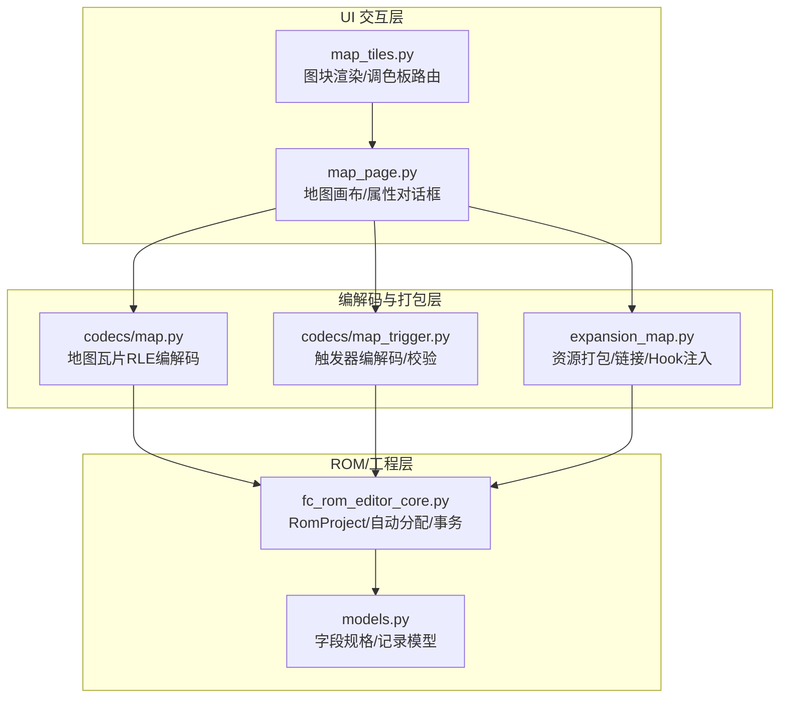
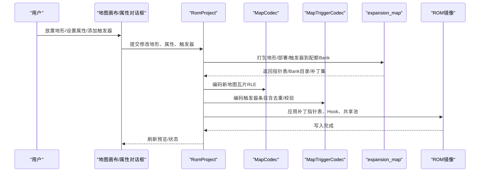
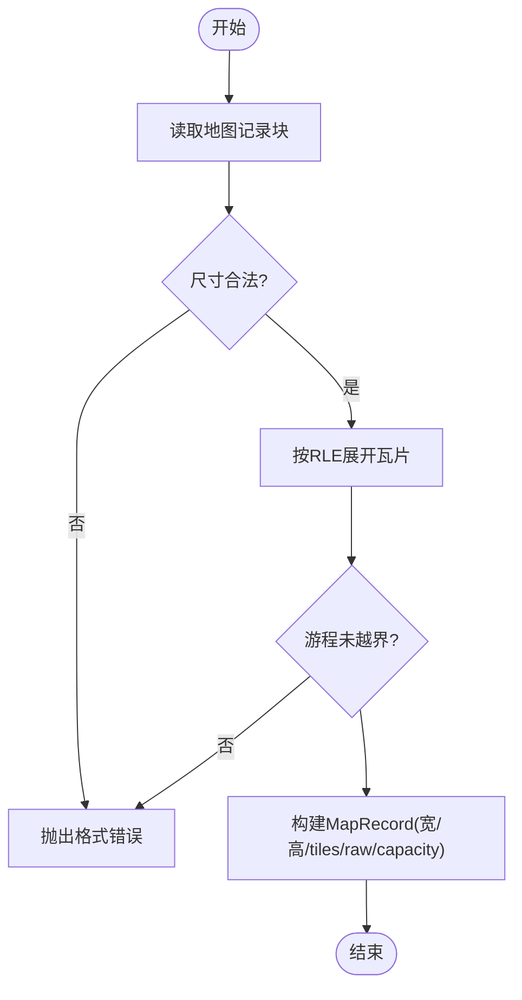
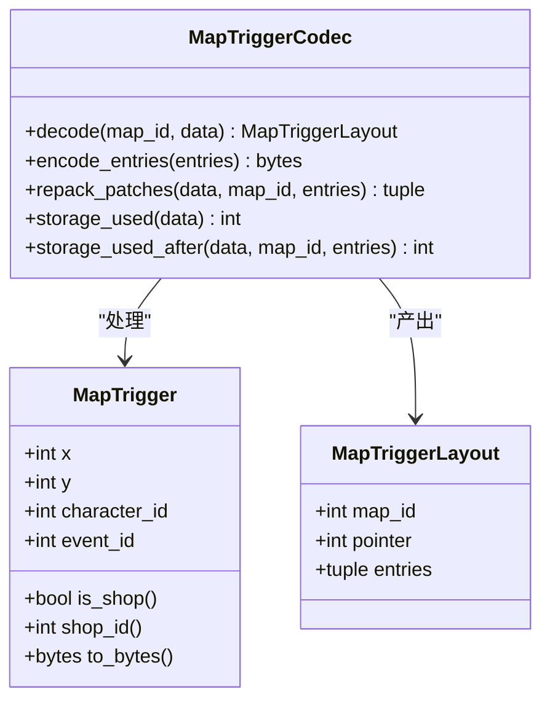
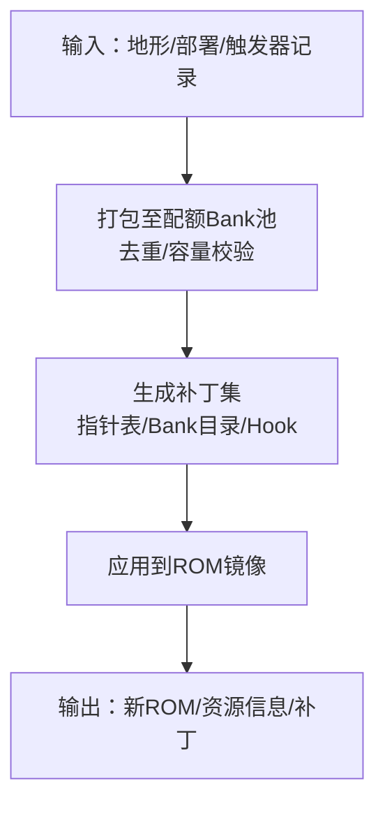
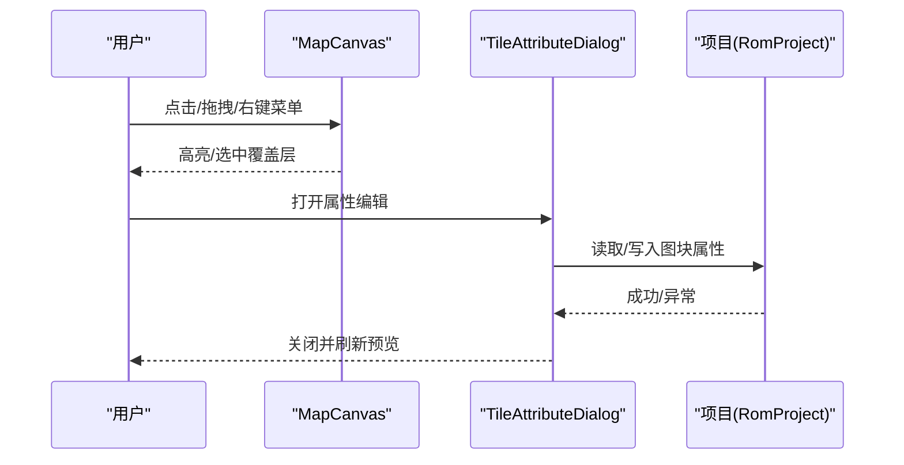
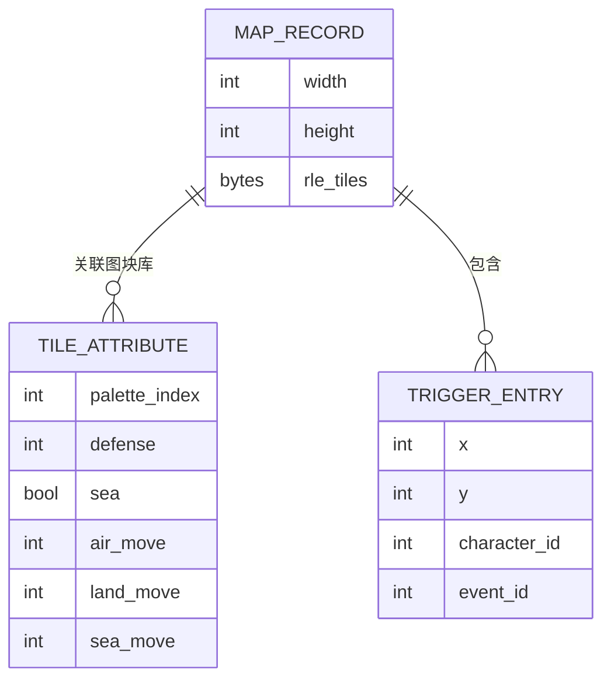
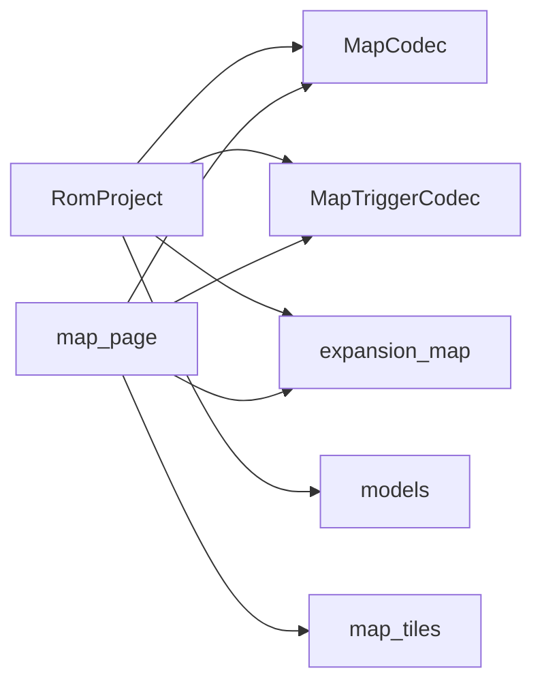

# 地图编辑器

<cite>
**本文引用的文件**
- [src/fc_rom_editor_core.py](file://src/fc_rom_editor_core.py)
- [src/fc_editor/codecs/map.py](file://src/fc_editor/codecs/map.py)
- [src/fc_editor/codecs/map_trigger.py](file://src/fc_editor/codecs/map_trigger.py)
- [src/fc_editor/expansion_map.py](file://src/fc_editor/expansion_map.py)
- [src/dc_modifier/map_page.py](file://src/dc_modifier/map_page.py)
- [src/dc_modifier/map_tiles.py](file://src/dc_modifier/map_tiles.py)
- [src/fc_editor/models.py](file://src/fc_editor/models.py)
</cite>

## 目录
1. [简介](#简介)
2. [项目结构](#项目结构)
3. [核心组件](#核心组件)
4. [架构总览](#架构总览)
5. [详细组件分析](#详细组件分析)
6. [依赖关系分析](#依赖关系分析)
7. [性能考虑](#性能考虑)
8. [故障排查指南](#故障排查指南)
9. [结论](#结论)
10. [附录](#附录)

## 简介
本文件面向地图编辑器使用者与二次开发者，系统阐述地图布局编辑、地形属性设置、事件触发器配置的能力与实现原理；给出地图数据结构（瓦片数据、属性表、触发器表）的组织方式；总结关卡设计原则、性能优化技巧以及与剧情系统的集成方法；并提供从简单场景到复杂关卡的完整制作流程案例。

## 项目结构
本项目将“地图编辑器”能力拆分为三层：
- 运行时/ROM 层：负责读取与写入 ROM 中的地图数据、触发器、扩展布局与指针表。
- 编解码与打包层：提供地图瓦片的 RLE 编解码、触发器条目校验与压缩、以及多资源打包与链接。
- UI 交互层：提供可视化画布、图块调色板、属性编辑对话框、部署与事件覆盖层绘制等。

图表来源
- [src/dc_modifier/map_page.py:595-800](file://src/dc_modifier/map_page.py#L595-L800)
- [src/dc_modifier/map_tiles.py:108-153](file://src/dc_modifier/map_tiles.py#L108-L153)
- [src/fc_editor/codecs/map.py:16-228](file://src/fc_editor/codecs/map.py#L16-L228)
- [src/fc_editor/codecs/map_trigger.py:13-259](file://src/fc_editor/codecs/map_trigger.py#L13-L259)
- [src/fc_editor/expansion_map.py:174-419](file://src/fc_editor/expansion_map.py#L174-L419)
- [src/fc_rom_editor_core.py:463-933](file://src/fc_rom_editor_core.py#L463-L933)
- [src/fc_editor/models.py:13-58](file://src/fc_editor/models.py#L13-L58)

章节来源
- [src/dc_modifier/map_page.py:595-800](file://src/dc_modifier/map_page.py#L595-L800)
- [src/dc_modifier/map_tiles.py:108-153](file://src/dc_modifier/map_tiles.py#L108-L153)
- [src/fc_editor/codecs/map.py:16-228](file://src/fc_editor/codecs/map.py#L16-L228)
- [src/fc_editor/codecs/map_trigger.py:13-259](file://src/fc_editor/codecs/map_trigger.py#L13-L259)
- [src/fc_editor/expansion_map.py:174-419](file://src/fc_editor/expansion_map.py#L174-L419)
- [src/fc_rom_editor_core.py:463-933](file://src/fc_rom_editor_core.py#L463-L933)
- [src/fc_editor/models.py:13-58](file://src/fc_editor/models.py#L13-L58)

## 核心组件
- 地图瓦片编解码（MapCodec）：支持 4-bit 逻辑地形 RLE 编码/解码，容量边界检查，语义哈希对比。
- 地图触发器编解码（MapTriggerCodec）：X/Y/限定人物/事件ID 四元组条目，共享池压缩，FF 终止符解析，坐标/人物重复校验。
- 地图资源打包与链接（pack_map_resources/link_map_resources）：将地形、部署、触发器打包进分配的 Bank 池，生成指针表与 Bank 目录，并注入运行期 Hook。
- RomProject 统一入口：封装地图、部署、触发器的编解码器切换、自动容量规划、事务与撤销重做、只读保护。
- UI 地图画布与属性编辑：Canvas 绘制瓦片与覆盖层（敌/客/我/事/店），TileAttributeDialog 编辑颜色表、防御补正、海属性、空/陆/海移动补正。

章节来源
- [src/fc_editor/codecs/map.py:16-228](file://src/fc_editor/codecs/map.py#L16-L228)
- [src/fc_editor/codecs/map_trigger.py:13-259](file://src/fc_editor/codecs/map_trigger.py#L13-L259)
- [src/fc_editor/expansion_map.py:174-419](file://src/fc_editor/expansion_map.py#L174-L419)
- [src/fc_rom_editor_core.py:463-933](file://src/fc_rom_editor_core.py#L463-L933)
- [src/dc_modifier/map_page.py:310-592](file://src/dc_modifier/map_page.py#L310-L592)

## 架构总览
下图展示从 UI 操作到 ROM 写入的端到端流程，包括自动容量规划与资源链接。

图表来源
- [src/fc_rom_editor_core.py:1274-1434](file://src/fc_rom_editor_core.py#L1274-L1434)
- [src/fc_editor/expansion_map.py:272-419](file://src/fc_editor/expansion_map.py#L272-L419)
- [src/fc_editor/codecs/map.py:136-228](file://src/fc_editor/codecs/map.py#L136-L228)
- [src/fc_editor/codecs/map_trigger.py:119-259](file://src/fc_editor/codecs/map_trigger.py#L119-L259)

## 详细组件分析

### 地图瓦片数据与编解码（MapCodec）
- 数据结构
  - 宽度、高度（首两字节）。
  - 逻辑地形编号（0–15），使用 4-bit RLE 游程编码存储。
  - 容量由指针表或扩展 Bank 目录推导，确保不越界。
- 关键行为
  - decode：按 RLE 展开为 tiles 列表，校验尺寸与游程长度。
  - encode：将 tiles 压缩为 RLE，限制游程最大长度。
  - replacement_patch：在容量限制内生成原地替换补丁。
  - semantic_digest：基于宽高+瓦片序列计算语义哈希，用于一致性比对。

图表来源
- [src/fc_editor/codecs/map.py:136-228](file://src/fc_editor/codecs/map.py#L136-L228)

章节来源
- [src/fc_editor/codecs/map.py:16-228](file://src/fc_editor/codecs/map.py#L16-L228)

### 地图触发器（MapTriggerCodec）
- 数据结构
  - 每条触发器包含：x、y、character_id、event_id。
  - 以 FF 作为列表结束标记。
  - 支持共享池去重压缩，减少占用。
- 关键行为
  - decode：按 FF 终止符解析条目，校验坐标范围、人物 ID、事件 ID，检测重复。
  - encode_entries：校验后拼接条目并以 FF 结尾。
  - repack_patches：将所有关卡触发器重新打包入托管池，更新指针表。
  - storage_used/storage_used_after：统计压缩后占用空间，防止溢出。

图表来源
- [src/fc_editor/codecs/map_trigger.py:13-259](file://src/fc_editor/codecs/map_trigger.py#L13-L259)

章节来源
- [src/fc_editor/codecs/map_trigger.py:13-259](file://src/fc_editor/codecs/map_trigger.py#L13-L259)

### 地图资源打包与链接（Expansion Map）
- 目标
  - 将地形、部署、触发器三种资源打包进分配的 Bank 池，生成各自的指针表与 Bank 目录。
  - 注入运行期 Hook（地形调度、部署解析、事件扫描），使运行时动态选择数据 Bank。
- 关键点
  - pack_map_resources：对部署与触发器进行去重压缩，地形保持独立；单条记录不得跨 Bank。
  - build_map_resource_patches：校验原代码段是否匹配，生成补丁集合（指针表、目录、Hook 代码）。
  - link_map_resources：原子化打包与链接，返回新 ROM 镜像、资源信息与补丁。
  - read_expanded_map_layout/read_expanded_map_payloads：读取已扩展布局与原始载荷，供编辑器回读。

图表来源
- [src/fc_editor/expansion_map.py:174-419](file://src/fc_editor/expansion_map.py#L174-L419)

章节来源
- [src/fc_editor/expansion_map.py:174-419](file://src/fc_editor/expansion_map.py#L174-L419)

### UI 地图画布与属性编辑（map_page / map_tiles）
- 地图画布（MapCanvas）
  - 支持左键绘制地形、右键拾取/绘制、拖拽覆盖层（敌/客/我/事/店）。
  - 显示单位图标（CHR 图块）、边框与选中态。
  - 事件：tile_painted、trigger_context_requested、deployment_context_requested 等。
- 图块渲染（map_tiles）
  - 根据关卡映射到图块库（A–H），按调色板路由渲染 16×16 逻辑图块。
  - 支持从项目获取当前图块属性，实时预览颜色变化。
- 属性编辑（TileAttributeDialog）
  - 编辑颜色表1（NES 色号）、防御补正、海属性、空/陆/海移动补正。
  - 颜色表2/3为公用表，窗口中只读显示真实 NES 色号。
  - 保存时调用项目接口写回属性，失败时弹窗提示。

图表来源
- [src/dc_modifier/map_page.py:595-800](file://src/dc_modifier/map_page.py#L595-L800)
- [src/dc_modifier/map_page.py:310-592](file://src/dc_modifier/map_page.py#L310-L592)
- [src/dc_modifier/map_tiles.py:108-153](file://src/dc_modifier/map_tiles.py#L108-L153)

章节来源
- [src/dc_modifier/map_page.py:310-592](file://src/dc_modifier/map_page.py#L310-L592)
- [src/dc_modifier/map_page.py:595-800](file://src/dc_modifier/map_page.py#L595-L800)
- [src/dc_modifier/map_tiles.py:108-153](file://src/dc_modifier/map_tiles.py#L108-L153)

### 地形属性设置（移动消耗、防御加成、特殊效果）
- 可编辑项
  - 颜色表1（NES 色号）：影响图块三原色。
  - 防御补正：百分比形式，作用于战斗结算。
  - 海属性：布尔开关，决定海上通行性。
  - 移动补正：空中、陆地、海上三类移动修正。
- 实现要点
  - 通过 MapTilesetAttributes 描述一组 16 个图块的属性。
  - 写回时调用项目接口生成补丁，保证差分验证通过。
  - 颜色表2/3为公用表，仅显示真实 NES 色号，不可编辑。

章节来源
- [src/dc_modifier/map_page.py:310-592](file://src/dc_modifier/map_page.py#L310-L592)
- [src/fc_rom_editor_core.py:1088-1116](file://src/fc_rom_editor_core.py#L1088-L1116)

### 事件触发器配置（对话触发、战斗触发、条件判断）
- 触发器类型
  - 通用事件：由 event_id 区分，支持商店（event_id ≥ 0xF0）。
  - 限定人物：character_id 控制仅在特定角色在场时触发。
- 配置流程
  - 在画布上右键进入事件编辑模式，放置 X/Y 坐标。
  - 通过 UI 设置事件编号与限定人物。
  - 保存时触发编码器校验与共享池压缩，更新指针表。
- 约束与校验
  - 坐标必须在地图范围内。
  - 同一坐标+人物组合不可重复。
  - 条目必须以 FF 结尾，且不超过托管池容量。

章节来源
- [src/fc_editor/codecs/map_trigger.py:13-259](file://src/fc_editor/codecs/map_trigger.py#L13-L259)
- [src/dc_modifier/map_page.py:595-800](file://src/dc_modifier/map_page.py#L595-L800)

### 地图数据结构总览
- 瓦片数据
  - 每关一个记录，包含宽高与 RLE 编码的瓦片序列。
  - 指针表指向记录起始位置，容量由相邻指针或 Bank 目录推导。
- 属性表
  - 每个图块库（A–G）拥有 84 字节属性记录，定义颜色表、防御补正、海属性、移动补正。
- 触发器表
  - 每关一个触发器列表，以 FF 结尾，条目为四元组。
  - 扩展模式下，所有关卡触发器被压缩到共享池，指针表指向各自载荷。

图表来源
- [src/fc_editor/codecs/map.py:136-228](file://src/fc_editor/codecs/map.py#L136-L228)
- [src/fc_editor/codecs/map_trigger.py:13-259](file://src/fc_editor/codecs/map_trigger.py#L13-L259)
- [src/dc_modifier/map_page.py:310-592](file://src/dc_modifier/map_page.py#L310-L592)

## 依赖关系分析
- RomProject 作为中枢，根据 ROM 配置与扩展计划动态绑定 MapCodec、ScenarioLayoutCodec、MapTriggerCodec。
- expansion_map 提供资源打包与 Hook 注入，确保运行时能正确选择数据 Bank。
- UI 层依赖 map_tiles 的图块渲染与调色板路由，确保所见即所得。
- models 提供字段规格与记录模型，保障数值范围与偏移安全。

图表来源
- [src/fc_rom_editor_core.py:463-933](file://src/fc_rom_editor_core.py#L463-L933)
- [src/fc_editor/expansion_map.py:174-419](file://src/fc_editor/expansion_map.py#L174-L419)
- [src/dc_modifier/map_page.py:595-800](file://src/dc_modifier/map_page.py#L595-L800)
- [src/dc_modifier/map_tiles.py:108-153](file://src/dc_modifier/map_tiles.py#L108-L153)
- [src/fc_editor/models.py:13-58](file://src/fc_editor/models.py#L13-L58)

章节来源
- [src/fc_rom_editor_core.py:463-933](file://src/fc_rom_editor_core.py#L463-L933)
- [src/fc_editor/expansion_map.py:174-419](file://src/fc_editor/expansion_map.py#L174-L419)
- [src/dc_modifier/map_page.py:595-800](file://src/dc_modifier/map_page.py#L595-L800)
- [src/dc_modifier/map_tiles.py:108-153](file://src/dc_modifier/map_tiles.py#L108-L153)
- [src/fc_editor/models.py:13-58](file://src/fc_editor/models.py#L13-L58)

## 性能考虑
- 使用 RLE 压缩地图瓦片，显著降低存储空间与传输开销。
- 触发器共享池去重，避免重复条目浪费容量。
- 打包过程严格限制单条记录不超过单个 Bank，避免跨 Bank 访问带来的复杂性。
- 运行时通过 Hook 动态选择 Bank，减少不必要的内存切换。
- UI 渲染采用预计算调色板与图块缓存，提升绘制效率。

[本节为通用性能建议，不直接分析具体文件]

## 故障排查指南
- 地图数据不完整或 RLE 游程越界：检查地图宽高与瓦片数量是否一致，确认编码未截断。
- 触发器缺少 FF 结束码或条目不完整：确保每条触发器以 FF 结尾，且条目长度为 4 字节。
- 坐标超出地图范围：调整触发器坐标，使其小于地图宽高。
- 触发器坐标/人物重复：移除重复条目或修改人物限定。
- 属性编辑无效：确认当前 ROM 已启用图块属性支持，且图库 key 属于 A–G。
- 自动分配失败：检查配额是否满足最小要求（地图至少 16 KiB，剧情文本至少 16 KiB，机体需 48/64/80 KiB）。

章节来源
- [src/fc_editor/codecs/map.py:136-228](file://src/fc_editor/codecs/map.py#L136-L228)
- [src/fc_editor/codecs/map_trigger.py:119-259](file://src/fc_editor/codecs/map_trigger.py#L119-L259)
- [src/fc_rom_editor_core.py:1327-1434](file://src/fc_rom_editor_core.py#L1327-L1434)

## 结论
该地图编辑器以“编解码+打包链接+UI可视化”的分层架构，提供了完整的地图布局编辑、地形属性设置与事件触发器配置能力。通过严格的容量与格式校验、共享池压缩与运行期 Hook 机制，既保证了稳定性与性能，又为复杂关卡设计提供了灵活的工具链。结合剧情系统与资源管理器，可实现从简单场景到大型战役的高效制作流程。

[本节为总结性内容，不直接分析具体文件]

## 附录

### 地图设计最佳实践
- 关卡设计原则
  - 明确主路径与分支路径，利用地形属性引导玩家策略。
  - 合理布置触发器，避免坐标冲突与重复。
  - 控制地图尺寸与复杂度，确保 RLE 压缩有效性与运行时性能。
- 性能优化技巧
  - 优先使用重复地形以降低 RLE 压缩率。
  - 复用相同触发器条目，借助共享池减少占用。
  - 避免过度细分的小区域，减少渲染与寻址开销。
- 与剧情系统集成
  - 通过部署记录与触发器联动剧情推进。
  - 使用 RomProject 的事务机制批量提交修改，确保一致性。
  - 利用语义哈希对比地图与触发器变更，便于版本管理与回归测试。

[本节为通用指导，不直接分析具体文件]

### 实际地图制作案例（从简单到复杂）
- 简单场景
  - 新建 8×8 地图，放置基础地形（草地、道路、水域）。
  - 设置少量触发器（对话、商店），校验坐标与人物限定。
  - 应用图块属性（防御补正、移动补正），预览效果。
- 中等关卡
  - 扩大地图至 16×16，增加分支路径与高地地形。
  - 配置多组触发器（战斗触发、条件判断），注意去重与容量。
  - 调整部署记录，平衡敌我兵力分布。
- 复杂关卡
  - 使用 32×32 地图，精细划分区域与通道。
  - 大量触发器与复杂条件，确保共享池容量充足。
  - 与剧情脚本联动，分阶段推进事件，验证整体流程。

[本节为流程示例，不直接分析具体文件]