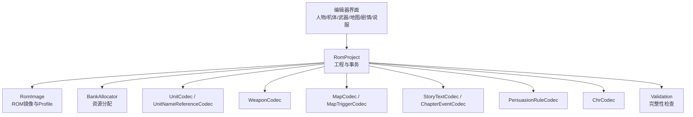
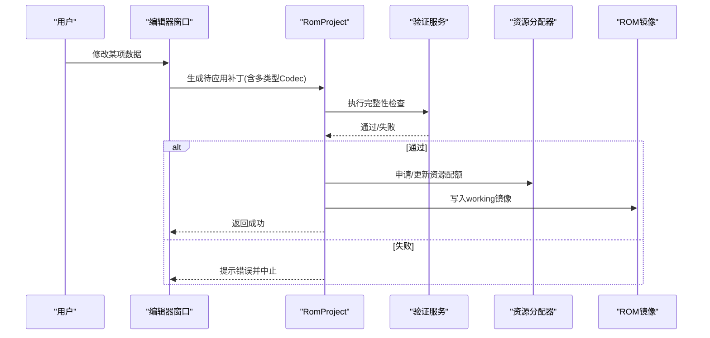
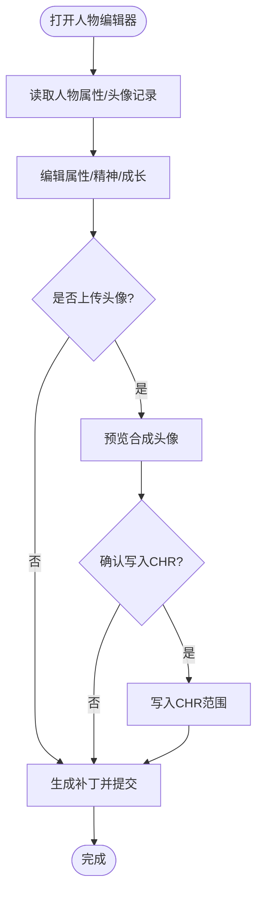
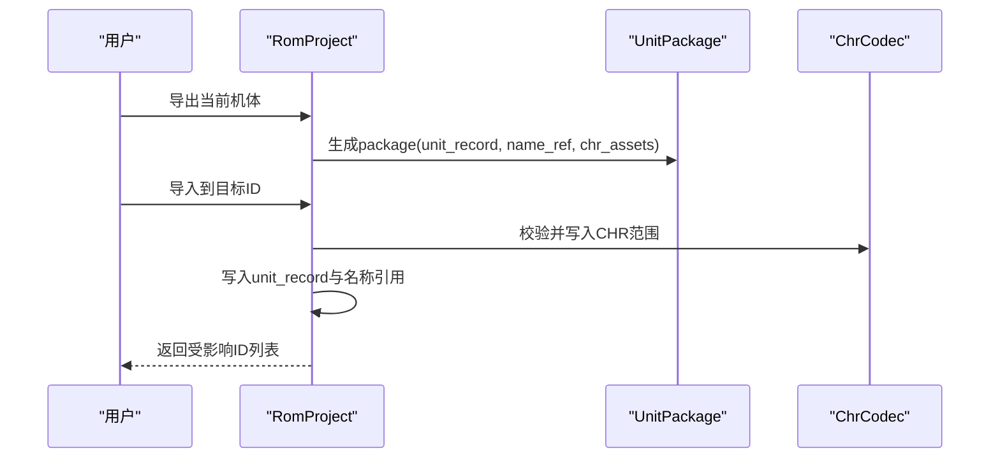
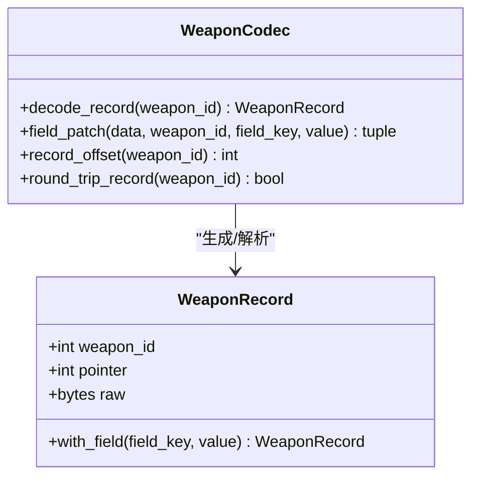
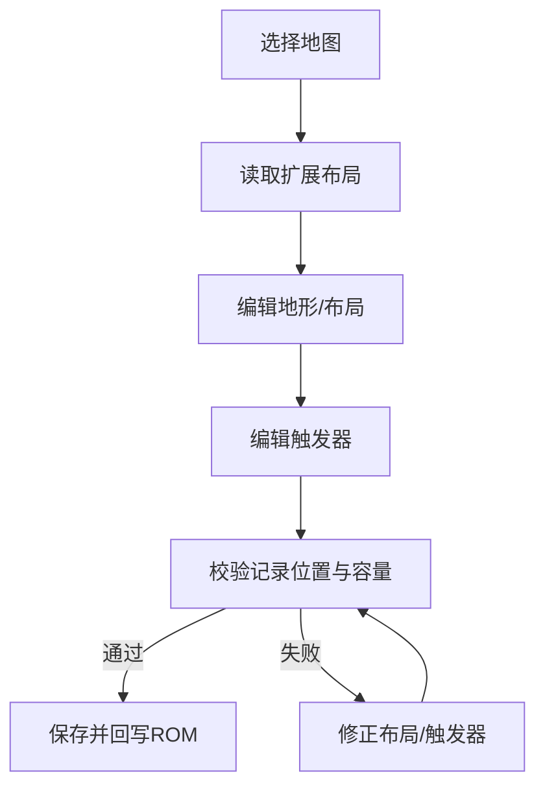
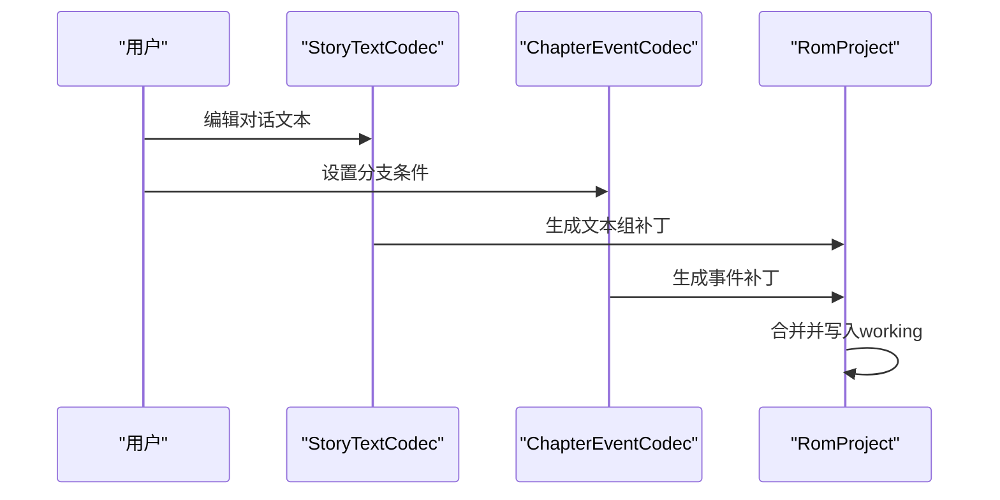
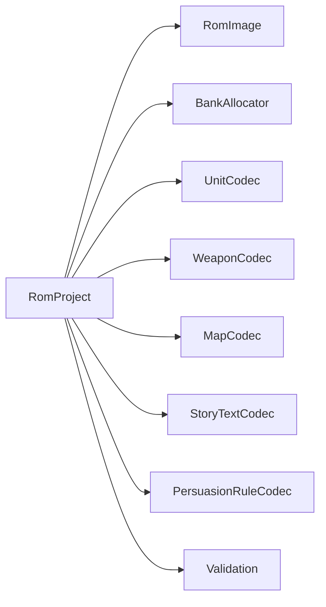

# 数据编辑器

<cite>
**本文引用的文件**
- [src/fc_rom_editor_core.py](file://src/fc_rom_editor_core.py)
- [src/dc_modifier/character_editor.py](file://src/dc_modifier/character_editor.py)
- [src/dc_modifier/unit_packages.py](file://src/dc_modifier/unit_packages.py)
- [src/fc_editor/codecs/weapon.py](file://src/fc_editor/codecs/weapon.py)
- [src/fc_editor/models.py](file://src/fc_editor/models.py)
- [src/fc_editor/constants.py](file://src/fc_editor/constants.py)
- [src/fc_editor/expansion_map.py](file://src/fc_editor/expansion_map.py)
- [src/fc_editor/expansion_story.py](file://src/fc_editor/expansion_story.py)
- [src/fc_editor/expansion_unit.py](file://src/fc_editor/expansion_unit.py)
- [src/fc_editor/project.py](file://src/fc_editor/project.py)
- [src/fc_editor/rom_image.py](file://src/fc_editor/rom_image.py)
- [src/fc_editor/resources.py](file://src/fc_editor/resources.py)
- [src/fc_editor/services/validation.py](file://src/fc_editor/services/validation.py)
</cite>

## 目录
1. [简介](#简介)
2. [项目结构](#项目结构)
3. [核心组件](#核心组件)
4. [架构总览](#架构总览)
5. [详细组件分析](#详细组件分析)
6. [依赖关系分析](#依赖关系分析)
7. [性能注意事项](#性能注意事项)
8. [故障排查指南](#故障排查指南)
9. [结论](#结论)
10. [附录：常用参数与数据格式速查](#附录：常用参数与数据格式速查)

## 简介
本文件面向DC修改器的“数据编辑器”能力，系统梳理并说明以下编辑器的功能、参数含义、数据格式与使用技巧：
- 机体编辑器：属性设置、武器配置、外观调整（CHR图块、名称引用）
- 人物编辑器：角色属性、成长曲线、初始装备、精神列表与消耗、头像设置与上传
- 武器编辑器：伤害计算相关字段、特效与命中修正等
- 地图编辑器：布局编辑、地形设置、事件触发（地图触发器）
- 剧情文本编辑器：对话编辑、分支设置（章节事件、故事组）
- 说服系统编辑器：说服规则配置

文档同时提供实际编辑案例与最佳实践建议，帮助你在保证ROM完整性的前提下高效完成内容创作。

## 项目结构
DC修改器以“工程化”的方式组织数据读写与UI编辑：
- 核心工程对象 RomProject：封装ROM镜像、扩展计划、编解码器集合、资源分配器、撤销/重做事务机制
- 各数据类型的Codec：负责具体数据格式的读/写/校验（如武器、地图、剧情、说服规则等）
- UI编辑器：PySide6界面组件，将用户操作转换为对RomProject的变更，并通过apply_verified_patches提交
- 资源与扩展：按PRG Bank进行资源分配，支持地图、剧情、机体的扩展容量与指针表管理

图表来源
- [src/fc_rom_editor_core.py:463-618](file://src/fc_rom_editor_core.py#L463-L618)
- [src/fc_editor/rom_image.py](file://src/fc_editor/rom_image.py)
- [src/fc_editor/resources.py](file://src/fc_editor/resources.py)

章节来源
- [src/fc_rom_editor_core.py:463-618](file://src/fc_rom_editor_core.py#L463-L618)

## 核心组件
- RomProject：统一入口，维护original/working内存镜像、扩展计划、各类Codec实例、资源分配器、撤销/重做栈、事务上下文
- Codec族：按数据类型实现只读解码或可写补丁生成（武器、地图、剧情、说服规则、CHR等）
- 资源分配器：基于PRG Bank的资源分配与冲突检测
- 验证服务：工程完整性检查，拦截不合法配置

章节来源
- [src/fc_rom_editor_core.py:463-618](file://src/fc_rom_editor_core.py#L463-L618)
- [src/fc_editor/services/validation.py](file://src/fc_editor/services/validation.py)

## 架构总览
下图展示从UI到ROM写入的关键调用链，以及事务与验证如何保障数据安全。

图表来源
- [src/fc_rom_editor_core.py:692-785](file://src/fc_rom_editor_core.py#L692-L785)
- [src/fc_editor/services/validation.py](file://src/fc_editor/services/validation.py)

## 详细组件分析

### 人物编辑器
- 功能特性
  - 人物属性：精神值、成长曲线、强度/机动/防御/速度/HP补正；击落不消失标志；共用属性记录开关
  - 精神列表与消耗：勾选可用精神及对应消耗；游戏内最多显示前6项
  - 头像设置与上传：正面/背景图库寄存器与位置、三色调色板；实时预览；上传32×32图片并量化为四色
  - 批量共享：可同时修改共用属性/头像记录，影响多个ID
- 关键参数与含义
  - 成长：0—200固定增长；201—250使用第0—49号成长曲线
  - 头像：正面/背景分别指定图库寄存器与槽位；颜色索引0—63
  - 共享：共用记录会同时影响所有绑定该记录的ID
- 数据格式与流程
  - 读取CharacterAttributes与PortraitRecord，生成patches后由apply_verified_patches提交
  - 上传图像时先暂存payload，确认后再写入CHR范围
- 使用技巧
  - 优先在“人物属性与精神”页调整数值，再在“头像设置与上传”页替换图形
  - 共用记录修改前确认影响范围，避免误改其他单位
  - 上传图像需严格32×32像素，且目标CHR区域不可与其他单位重叠冲突

图表来源
- [src/dc_modifier/character_editor.py:165-258](file://src/dc_modifier/character_editor.py#L165-L258)
- [src/dc_modifier/character_editor.py:268-334](file://src/dc_modifier/character_editor.py#L268-L334)

章节来源
- [src/dc_modifier/character_editor.py:17-334](file://src/dc_modifier/character_editor.py#L17-L334)

### 机体编辑器
- 功能特性
  - 属性与武器：通过UnitCodec/UnitWeaponCodec读写机体记录与武器槽
  - 外观调整：名称引用、CHR图块范围导入/导出
  - 打包与导入：将当前内存中的机体状态打包为可移植包，支持跨工程复用
- 关键参数与含义
  - CHR范围：first_tile与tile_count决定图块起始与数量
  - 名称源ID：指向名称表的引用ID
- 数据格式与流程
  - package_from_project：提取unit_record、name_source_id与chr资产
  - apply_unit_package：校验版本与资源，写入target unit ID，并在事务中一次性提交
- 使用技巧
  - 导入前确保ROM配置一致，否则拒绝导入
  - 仅支持已接通的资源类型（当前示例为chr_tiles），避免不完整导入
  - 利用affected_unit_ids了解共用记录的影响范围

图表来源
- [src/dc_modifier/unit_packages.py:7-98](file://src/dc_modifier/unit_packages.py#L7-L98)
- [src/fc_rom_editor_core.py:463-618](file://src/fc_rom_editor_core.py#L463-L618)

章节来源
- [src/dc_modifier/unit_packages.py:1-98](file://src/dc_modifier/unit_packages.py#L1-L98)
- [src/fc_rom_editor_core.py:463-618](file://src/fc_rom_editor_core.py#L463-L618)

### 武器编辑器
- 功能特性
  - 读取武器指针表，解析每条武器记录
  - 支持字段级补丁：根据WEAPON_FIELD_BY_KEY定位偏移并生成前后字节对比
- 关键参数与含义
  - 武器ID：1—N（0保留标记）
  - 记录大小：WEAPON_RECORD_SIZE
  - 指针表：profile.weapon_pointer_table_offset与count
- 数据格式与流程
  - decode_record：按指针定位并校验记录长度
  - field_patch：返回(offset, before, after)，供上层合并为patches
- 使用技巧
  - 修改前先round_trip_record验证编码一致性
  - 注意指针有效性，避免越界或重复覆盖

图表来源
- [src/fc_editor/codecs/weapon.py:13-90](file://src/fc_editor/codecs/weapon.py#L13-L90)
- [src/fc_editor/models.py](file://src/fc_editor/models.py)

章节来源
- [src/fc_editor/codecs/weapon.py:13-90](file://src/fc_editor/codecs/weapon.py#L13-L90)
- [src/fc_editor/models.py](file://src/fc_editor/models.py)
- [src/fc_editor/constants.py](file://src/fc_editor/constants.py)

### 地图编辑器
- 功能特性
  - 布局编辑：读取/写入地图布局与地形信息
  - 事件触发：地图触发器（MapTrigger）配置
  - 扩展容量：支持按PRG Bank分配的地图资源与场景布局
- 关键参数与含义
  - TERRAIN_BANK_DIRECTORY_OFFSET：地形银行目录偏移
  - 记录位置：terrain/scenarios/triggers的初始布局
- 数据格式与流程
  - read_expanded_map_layout/read_expanded_map_payloads：读取扩展地图布局与载荷
  - MapCodec/ScenarioLayoutCodec/MapTriggerCodec：分别处理地图、场景布局、触发器
- 使用技巧
  - 修改触发器前确认记录位置与容量规划，避免越界
  - 使用扩展地图时，确保bank表与资源分配一致

图表来源
- [src/fc_editor/expansion_map.py](file://src/fc_editor/expansion_map.py)
- [src/fc_rom_editor_core.py:546-575](file://src/fc_rom_editor_core.py#L546-L575)

章节来源
- [src/fc_rom_editor_core.py:546-575](file://src/fc_rom_editor_core.py#L546-L575)
- [src/fc_editor/expansion_map.py](file://src/fc_editor/expansion_map.py)

### 剧情文本编辑器
- 功能特性
  - 对话编辑：StoryTextCodec读取/写入故事文本组
  - 分支设置：ChapterEventCodec管理章节事件
  - 故事组覆盖：支持按selector覆盖故事组所在bank
- 关键参数与含义
  - STORY_DATA_START/STORY_DATA_CAPACITY：故事数据存储区起始与容量
  - group_bank_overrides：故事组bank覆盖映射
- 数据格式与流程
  - build_story_group/extract_story_group/pack_story_group：组装/拆分故事组
  - StoryTextCodec：结合profile与覆盖映射读写文本
- 使用技巧
  - 修改分支前备份原始故事组，便于回滚
  - 注意story selector与bank映射的一致性

图表来源
- [src/fc_editor/expansion_story.py](file://src/fc_editor/expansion_story.py)
- [src/fc_rom_editor_core.py:586-600](file://src/fc_rom_editor_core.py#L586-L600)

章节来源
- [src/fc_rom_editor_core.py:586-600](file://src/fc_rom_editor_core.py#L586-L600)
- [src/fc_editor/expansion_story.py](file://src/fc_editor/expansion_story.py)

### 说服系统编辑器
- 功能特性
  - PersuasionRuleCodec：读取/写入说服规则，用于剧情或交互中的说服判定
- 关键参数与含义
  - 规则条目：包含条件、结果、影响字段等（具体字段由codec定义）
- 使用技巧
  - 修改规则前确认其与剧情/事件的关联，避免逻辑不一致
  - 结合验证服务检查规则完整性

章节来源
- [src/fc_rom_editor_core.py:581-585](file://src/fc_rom_editor_core.py#L581-L585)

## 依赖关系分析
- RomProject依赖：
  - RomImage：提供ROM镜像与Profile信息
  - BankAllocator：资源分配与冲突检测
  - 各Codec：UnitCodec、WeaponCodec、MapCodec、StoryTextCodec、PersuasionRuleCodec等
  - Validation：工程完整性检查
- 外部依赖：
  - PySide6：UI层（人物编辑器）
  - 标准库：json、hashlib、tempfile等

图表来源
- [src/fc_rom_editor_core.py:463-618](file://src/fc_rom_editor_core.py#L463-L618)
- [src/fc_editor/rom_image.py](file://src/fc_editor/rom_image.py)
- [src/fc_editor/resources.py](file://src/fc_editor/resources.py)
- [src/fc_editor/services/validation.py](file://src/fc_editor/services/validation.py)

章节来源
- [src/fc_rom_editor_core.py:463-618](file://src/fc_rom_editor_core.py#L463-L618)

## 性能注意事项
- 批量操作：尽量使用transaction包裹多次修改，减少中间状态与I/O开销
- 资源分配：避免频繁realloc，集中申请与释放，降低BankAllocator压力
- 预览优化：人物头像预览仅在必要时渲染，避免每帧重绘大图
- 校验成本：完整性检查在提交前执行，建议在大规模修改后集中验证

[本节为通用指导，无需特定文件来源]

## 故障排查指南
- 常见错误
  - 武器指针无效：检查profile.weapon_pointer_table_offset与count，确认记录未越界
  - CHR图块重叠：确保正面/背景上传不指向相同位置或不同内容
  - 工程配置不匹配：导入机体包时若source_profile不同将被拒绝
  - 事务异常：transaction内抛出异常将自动回滚working与资源分配
- 排查步骤
  - 查看raw_details显示的原始记录偏移与十六进制内容
  - 使用undo/redo恢复最近一次有效状态
  - 运行validate()获取详细问题清单

章节来源
- [src/dc_modifier/character_editor.py:165-258](file://src/dc_modifier/character_editor.py#L165-L258)
- [src/fc_rom_editor_core.py:692-785](file://src/fc_rom_editor_core.py#L692-L785)
- [src/fc_editor/codecs/weapon.py:20-39](file://src/fc_editor/codecs/weapon.py#L20-L39)

## 结论
DC修改器的数据编辑器以RomProject为核心，通过Codec族与资源分配器实现对机体、人物、武器、地图、剧情与说服系统的精细化编辑。借助事务机制与完整性校验，可在保证ROM安全的前提下高效完成内容创作。建议遵循“先布局后细节、先校验后提交”的最佳实践，充分利用打包与共享记录能力提升协作效率。

[本节为总结性内容，无需特定文件来源]

## 附录：常用参数与数据格式速查
- 人物属性
  - 成长：0—200固定增长；201—250使用第0—49号成长曲线
  - 精神：位掩码表示可用精神；消耗全局共享
  - 头像：正面/背景分别指定bank与slot；颜色索引0—63
- 武器记录
  - 记录大小：WEAPON_RECORD_SIZE
  - 指针表：profile.weapon_pointer_table_offset与count
- 地图与剧情
  - 地形目录偏移：TERRAIN_BANK_DIRECTORY_OFFSET
  - 故事数据区：STORY_DATA_START与STORY_DATA_CAPACITY
- 事务与撤销
  - transaction(description)：包裹一组修改，异常自动回滚
  - undo()/redo()：基于EditHistoryEntry恢复/重放

章节来源
- [src/dc_modifier/character_editor.py:48-93](file://src/dc_modifier/character_editor.py#L48-L93)
- [src/fc_editor/constants.py](file://src/fc_editor/constants.py)
- [src/fc_editor/expansion_map.py](file://src/fc_editor/expansion_map.py)
- [src/fc_editor/expansion_story.py](file://src/fc_editor/expansion_story.py)
- [src/fc_rom_editor_core.py:714-785](file://src/fc_rom_editor_core.py#L714-L785)