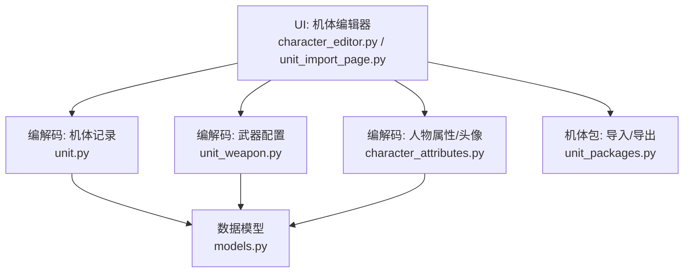
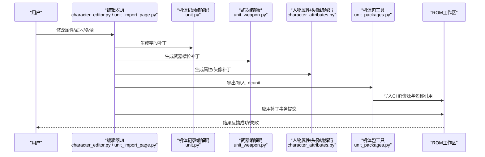
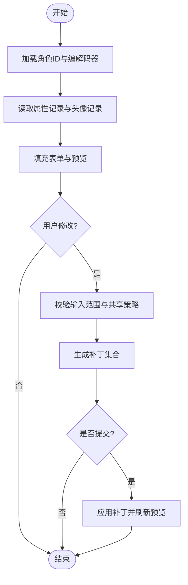
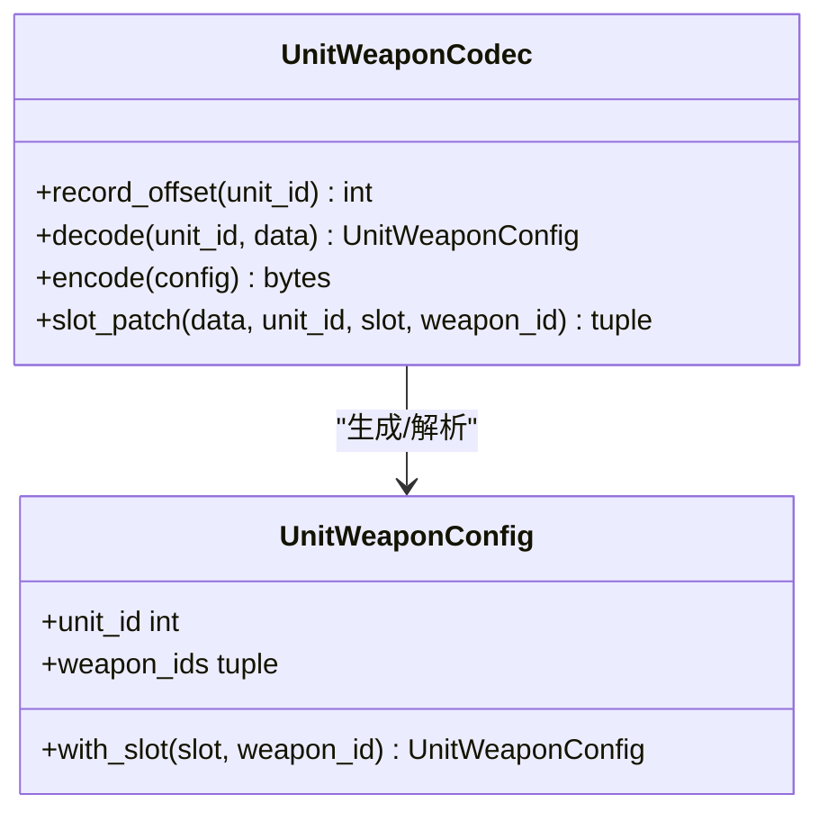
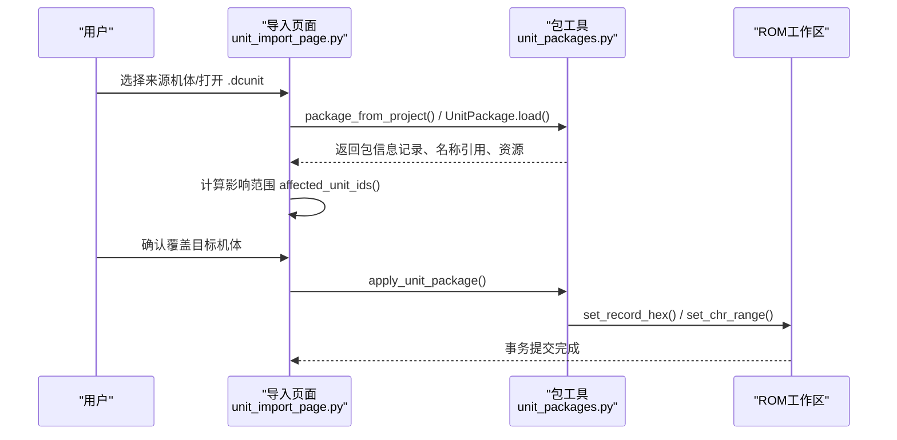
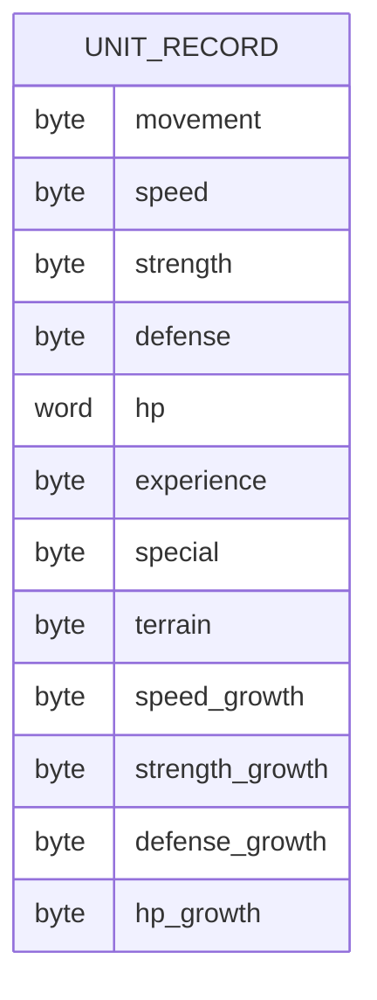
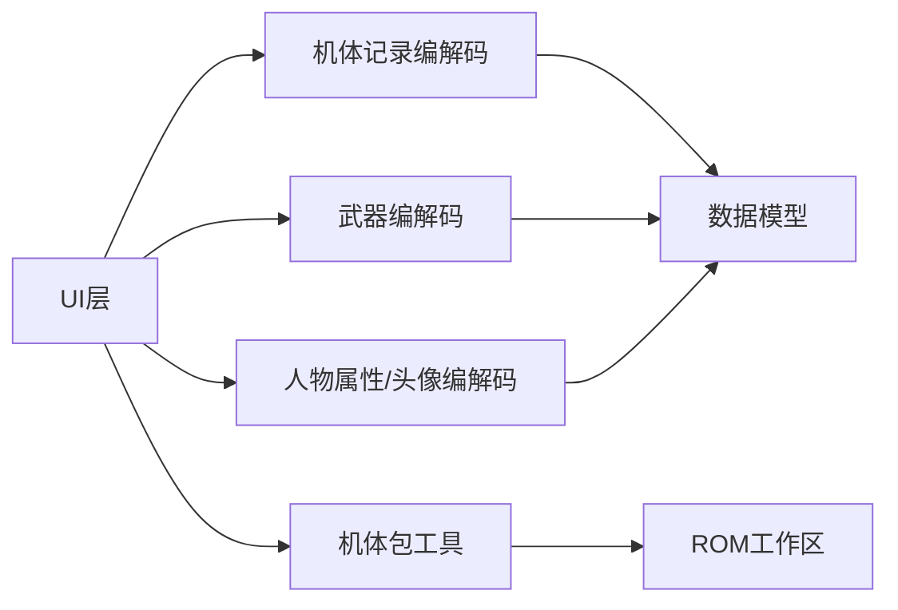

# 机体编辑器

<cite>
**本文引用的文件**
- [character_editor.py](file://src/dc_modifier/character_editor.py)
- [unit_import_page.py](file://src/dc_modifier/unit_import_page.py)
- [unit_packages.py](file://src/dc_modifier/unit_packages.py)
- [unit.py](file://src/fc_editor/codecs/unit.py)
- [unit_weapon.py](file://src/fc_editor/codecs/unit_weapon.py)
- [models.py](file://src/fc_editor/models.py)
- [character_attributes.py](file://src/fc_editor/codecs/character_attributes.py)
</cite>

## 目录
1. [简介](#简介)
2. [项目结构](#项目结构)
3. [核心组件](#核心组件)
4. [架构总览](#架构总览)
5. [详细组件分析](#详细组件分析)
6. [依赖关系分析](#依赖关系分析)
7. [性能与容量考量](#性能与容量考量)
8. [故障排查指南](#故障排查指南)
9. [结论](#结论)
10. [附录：常用编辑案例](#附录常用编辑案例)

## 简介
本文件面向“DC修改器”的机体编辑器功能，系统说明以下能力：
- 机体属性设置：生命值、攻击力、防御力等基础数值与成长曲线。
- 武器配置：主/副武器绑定与武器特技、距离修正等参数。
- 外观调整：精灵图（CHR）选择、调色板设置、头像预览与上传。
- 机体包导入导出：.dcunit 文件格式、资源打包机制、批量复制与影响范围提示。
- 16字节机体记录的数据结构与内存分配原理。
- 实际编辑案例：创建新机体、复制现有机体、配置战斗参数等常用操作。

## 项目结构
围绕机体编辑器的关键代码分布在 UI 层、编解码层与数据模型层：
- UI 层
  - character_editor.py：人物/机体属性与头像编辑界面，提供属性、精神、头像设置与图片上传预览。
  - unit_import_page.py：机体导入与复制页面，支持 .dcunit 包的打开、导出、覆盖写入与影响范围提示。
- 编解码层
  - unit.py：16字节机体记录的指针表解析、记录偏移计算、字段级补丁生成。
  - unit_weapon.py：每个机体的两个武器槽位编解码与校验。
  - character_attributes.py：人物属性与头像记录的可变长度编码、共享记录重排与容量检查。
- 数据模型层
  - models.py：机体字段定义、武器字段定义、UnitRecord/UnitWeaponConfig 等数据结构。

**图示来源**
- [character_editor.py:17-149](file://src/dc_modifier/character_editor.py#L17-L149)
- [unit_import_page.py:30-128](file://src/dc_modifier/unit_import_page.py#L30-L128)
- [unit.py:14-93](file://src/fc_editor/codecs/unit.py#L14-L93)
- [unit_weapon.py:11-79](file://src/fc_editor/codecs/unit_weapon.py#L11-L79)
- [character_attributes.py:78-236](file://src/fc_editor/codecs/character_attributes.py#L78-L236)
- [models.py:61-162](file://src/fc_editor/models.py#L61-L162)

**章节来源**
- [character_editor.py:17-149](file://src/dc_modifier/character_editor.py#L17-L149)
- [unit_import_page.py:30-128](file://src/dc_modifier/unit_import_page.py#L30-L128)
- [unit.py:14-93](file://src/fc_editor/codecs/unit.py#L14-L93)
- [unit_weapon.py:11-79](file://src/fc_editor/codecs/unit_weapon.py#L11-L79)
- [character_attributes.py:78-236](file://src/fc_editor/codecs/character_attributes.py#L78-L236)
- [models.py:61-162](file://src/fc_editor/models.py#L61-L162)

## 核心组件
- 机体属性与头像编辑器（CharacterDetailsWidget）
  - 提供“人物属性与精神”、“头像设置与上传”两个标签页。
  - 支持生命、强度、防卫、速度、机动等补正项；可勾选“击落不消失”。
  - 支持24种精神开关与消耗值编辑。
  - 头像设置包含正面/背景图库寄存器、位置、调色板颜色；实时预览合成效果。
  - 支持上传32×32像素的头像图片，按四色量化并暂存到目标 CHR 图块区域。
- 机体导入与复制（UnitImportPage）
  - 支持从当前工程导出为 .dcunit 包，或从外部 .dcunit 文件导入。
  - 可选携带连续 CHR 图块资源（起点与数量）。
  - 覆盖写入前显示共享记录影响范围，确认后再执行事务性写入。
- 机体记录编解码（UnitCodec）
  - 读取128项指针表，计算每条记录的ROM偏移。
  - 将16字节记录解码为 UnitRecord，并提供字段级 patch 生成。
- 武器配置编解码（UnitWeaponCodec）
  - 每个机体固定两个武器槽位，读写武器ID并进行合法性校验。
- 数据模型（models.py）
  - 定义机体字段（移动、速度、强度、防卫、HP、经验、特殊技能、地形适应、成长曲线等）。
  - 定义武器字段（射程、命中、对空/陆/海攻击等）及候选字段。
  - 提供 UnitRecord、UnitWeaponConfig 等不可变数据对象。

**章节来源**
- [character_editor.py:17-334](file://src/dc_modifier/character_editor.py#L17-L334)
- [unit_import_page.py:30-359](file://src/dc_modifier/unit_import_page.py#L30-L359)
- [unit.py:14-120](file://src/fc_editor/codecs/unit.py#L14-L120)
- [unit_weapon.py:11-79](file://src/fc_editor/codecs/unit_weapon.py#L11-L79)
- [models.py:61-162](file://src/fc_editor/models.py#L61-L162)

## 架构总览
下图展示从用户操作到ROM写入的整体流程，包括属性/武器/外观修改与机体包导入导出的路径。

**图示来源**
- [character_editor.py:219-258](file://src/dc_modifier/character_editor.py#L219-L258)
- [unit_import_page.py:286-359](file://src/dc_modifier/unit_import_page.py#L286-L359)
- [unit.py:86-119](file://src/fc_editor/codecs/unit.py#L86-L119)
- [unit_weapon.py:50-79](file://src/fc_editor/codecs/unit_weapon.py#L50-L79)
- [character_attributes.py:193-236](file://src/fc_editor/codecs/character_attributes.py#L193-L236)
- [unit_packages.py:7-98](file://src/dc_modifier/unit_packages.py#L7-L98)

## 详细组件分析

### 机体属性与头像编辑器（CharacterDetailsWidget）
- 属性与精神
  - 支持“精神值”“精神成长”“强度补正”“机动补正”“防御补正”“HP补正”“速度补正”。
  - 支持24种精神开关与对应消耗值；提示游戏菜单最多显示前6项。
- 头像设置
  - 正面/背景图库寄存器与位置；三色调色板索引。
  - 实时预览：正面、背景、合成图像；支持上传32×32像素图片并按四色量化写入CHR。
- 共享记录与容量保护
  - 若多条机体共用同一属性/头像记录，可选择同时修改共用记录；否则尝试在数据池内重排以避免冲突。
  - 当数据池容量不足时给出明确错误提示。

**图示来源**
- [character_editor.py:165-217](file://src/dc_modifier/character_editor.py#L165-L217)
- [character_editor.py:219-258](file://src/dc_modifier/character_editor.py#L219-L258)
- [character_editor.py:268-334](file://src/dc_modifier/character_editor.py#L268-L334)

**章节来源**
- [character_editor.py:17-334](file://src/dc_modifier/character_editor.py#L17-L334)
- [character_attributes.py:78-236](file://src/fc_editor/codecs/character_attributes.py#L78-L236)

### 武器配置（UnitWeaponCodec）
- 每个机体固定两个武器槽位，分别为主武器与副武器。
- 支持读取、写入单个槽位的武器ID，并进行范围校验。
- 结合 models.py 中的武器字段，可进一步配置射程、命中、对空/陆/海攻击等。

**图示来源**
- [unit_weapon.py:11-79](file://src/fc_editor/codecs/unit_weapon.py#L11-L79)
- [models.py:288-307](file://src/fc_editor/models.py#L288-L307)

**章节来源**
- [unit_weapon.py:11-79](file://src/fc_editor/codecs/unit_weapon.py#L11-L79)
- [models.py:245-307](file://src/fc_editor/models.py#L245-L307)

### 机体包导入导出（UnitImportPage / UnitPackages）
- 导出
  - 从当前工程提取16字节机体记录与名称引用，可选携带连续CHR图块资源。
  - 保存为 .dcunit 文件，文件名后缀强制为 .dcunit。
- 导入
  - 打开 .dcunit 文件后，显示来源配置、来源机体、名称引用、16字节记录与附加资源摘要。
  - 覆盖写入前计算并显示共享记录影响范围，确认后以事务方式写入。
- 资源打包机制
  - 仅支持 chr_tiles 类型资源；其他类型会拒绝导入以防止不完整写入。
  - 校验CHR资源的 firstTile 与 tileCount 一致性，确保长度匹配。

**图示来源**
- [unit_import_page.py:286-359](file://src/dc_modifier/unit_import_page.py#L286-L359)
- [unit_packages.py:7-98](file://src/dc_modifier/unit_packages.py#L7-L98)

**章节来源**
- [unit_import_page.py:30-359](file://src/dc_modifier/unit_import_page.py#L30-L359)
- [unit_packages.py:7-98](file://src/dc_modifier/unit_packages.py#L7-L98)

### 16字节机体记录的数据结构与内存分配
- 记录大小与字段
  - 每条机体记录固定为16字节，包含移动、速度、强度、防卫、基础HP、经验、特殊技能、地形适应、成长曲线等字段。
  - 字段通过 FieldSpec 定义，支持掩码、位移、显示缩放与取值范围校验。
- 指针表与偏移计算
  - 通过指针表定位每条记录的ROM偏移；支持扩展Bank对映射。
  - 解码得到 UnitRecord，并可进行字段级 patch 生成。
- 内存分配与共享
  - 某些记录可能被多个机体ID共享；导入/覆盖时会提示所有受影响ID。
  - 人物属性/头像采用可变长度记录与数据池重排，避免破坏无关资源。

**图示来源**
- [models.py:61-162](file://src/fc_editor/models.py#L61-L162)
- [unit.py:14-93](file://src/fc_editor/codecs/unit.py#L14-L93)

**章节来源**
- [models.py:61-162](file://src/fc_editor/models.py#L61-L162)
- [unit.py:14-93](file://src/fc_editor/codecs/unit.py#L14-L93)

## 依赖关系分析
- UI 层依赖编解码层进行数据读取与补丁生成。
- 编解码层依赖数据模型进行字段校验与编码。
- 机体包工具依赖编解码层与ROM工作区进行资源打包与写入。
- 共享记录机制贯穿属性、头像与机体记录，确保多ID一致性与容量安全。

**图示来源**
- [character_editor.py:17-334](file://src/dc_modifier/character_editor.py#L17-L334)
- [unit_import_page.py:30-359](file://src/dc_modifier/unit_import_page.py#L30-L359)
- [unit.py:14-120](file://src/fc_editor/codecs/unit.py#L14-L120)
- [unit_weapon.py:11-79](file://src/fc_editor/codecs/unit_weapon.py#L11-L79)
- [character_attributes.py:78-236](file://src/fc_editor/codecs/character_attributes.py#L78-L236)
- [models.py:61-162](file://src/fc_editor/models.py#L61-L162)
- [unit_packages.py:7-98](file://src/dc_modifier/unit_packages.py#L7-L98)

**章节来源**
- [character_editor.py:17-334](file://src/dc_modifier/character_editor.py#L17-L334)
- [unit_import_page.py:30-359](file://src/dc_modifier/unit_import_page.py#L30-L359)
- [unit.py:14-120](file://src/fc_editor/codecs/unit.py#L14-L120)
- [unit_weapon.py:11-79](file://src/fc_editor/codecs/unit_weapon.py#L11-L79)
- [character_attributes.py:78-236](file://src/fc_editor/codecs/character_attributes.py#L78-L236)
- [models.py:61-162](file://src/fc_editor/models.py#L61-L162)
- [unit_packages.py:7-98](file://src/dc_modifier/unit_packages.py#L7-L98)

## 性能与容量考量
- 数据池容量限制
  - 人物属性/头像记录采用可变长度编码，写入时会在已验证数据池内进行重排与去重；若容量不足会报错，建议减少修正字段或复用已有记录。
- 资源写入安全
  - 导入 .dcunit 时仅允许已知类型的资源（当前为CHR图块），防止不完整导入导致数据丢失。
- 预览与渲染
  - 头像预览使用当前CHR图块与调色板进行实时合成，避免频繁磁盘IO；上传暂存于工作区，提交时统一写入。

[本节为通用指导，无需具体文件来源]

## 故障排查指南
- 指针表或记录不完整
  - 若指针表起始标记不正确或记录超出支持区域，会抛出格式错误；需检查ROM版本与指针表完整性。
- 武器ID越界
  - 武器ID必须在有效范围内；否则会提示无效武器ID。
- 人物属性/头像记录越界
  - 若记录指针超出已验证数据池或位置编码不在合法范围，会抛出格式错误；需调整寄存器与位置。
- 数据池容量不足
  - 当需要重排属性/头像记录但空间不够时，会提示容量不足；可减少修正字段或勾选“同时修改共用记录”。
- 资源类型不支持
  - 导入 .dcunit 时若包含未接通的资源类型，会拒绝写入；请移除或升级工具链。

**章节来源**
- [unit.py:42-66](file://src/fc_editor/codecs/unit.py#L42-L66)
- [unit_weapon.py:37-48](file://src/fc_editor/codecs/unit_weapon.py#L37-L48)
- [character_attributes.py:103-125](file://src/fc_editor/codecs/character_attributes.py#L103-L125)
- [character_attributes.py:202-236](file://src/fc_editor/codecs/character_attributes.py#L202-L236)
- [unit_packages.py:64-86](file://src/dc_modifier/unit_packages.py#L64-L86)

## 结论
DC修改器的机体编辑器提供了完整的属性、武器与外观编辑能力，并通过 .dcunit 包实现跨工程的机体迁移与批量复制。其底层基于16字节机体记录与指针表机制，配合严格的数据校验与容量保护，确保修改的安全性与一致性。对于复杂场景（如共享记录、数据池重排），编辑器提供了明确的提示与容错机制，便于用户高效完成常见编辑任务。

[本节为总结性内容，无需具体文件来源]

## 附录：常用编辑案例
- 创建新机体
  - 选择一个现有机体作为模板，导出为 .dcunit 包，再导入到新目标ID；或直接复制属性与武器配置。
  - 参考路径：[unit_import_page.py:286-359](file://src/dc_modifier/unit_import_page.py#L286-L359)、[unit_packages.py:7-98](file://src/dc_modifier/unit_packages.py#L7-L98)。
- 复制现有机体
  - 在“机体导入与复制”页面选择来源机体，点击“作为待导入机体”，然后选择目标ID并覆盖写入。
  - 参考路径：[unit_import_page.py:202-210](file://src/dc_modifier/unit_import_page.py#L202-L210)、[unit_import_page.py:326-359](file://src/dc_modifier/unit_import_page.py#L326-L359)。
- 配置战斗参数
  - 在“人物属性与精神”中调整强度、防卫、速度、HP等补正；在“武器配置”中设置主/副武器与射程、命中等。
  - 参考路径：[character_editor.py:45-94](file://src/dc_modifier/character_editor.py#L45-L94)、[unit_weapon.py:50-79](file://src/fc_editor/codecs/unit_weapon.py#L50-L79)、[models.py:61-162](file://src/fc_editor/models.py#L61-L162)。
- 外观调整
  - 设置正面/背景头像的图库寄存器与位置，选择调色板颜色；上传32×32像素图片进行四色量化与预览。
  - 参考路径：[character_editor.py:96-149](file://src/dc_modifier/character_editor.py#L96-L149)、[character_editor.py:302-334](file://src/dc_modifier/character_editor.py#L302-L334)。

**章节来源**
- [unit_import_page.py:202-359](file://src/dc_modifier/unit_import_page.py#L202-L359)
- [unit_packages.py:7-98](file://src/dc_modifier/unit_packages.py#L7-L98)
- [character_editor.py:45-149](file://src/dc_modifier/character_editor.py#L45-L149)
- [unit_weapon.py:50-79](file://src/fc_editor/codecs/unit_weapon.py#L50-L79)
- [models.py:61-162](file://src/fc_editor/models.py#L61-L162)
- [character_editor.py:302-334](file://src/dc_modifier/character_editor.py#L302-L334)