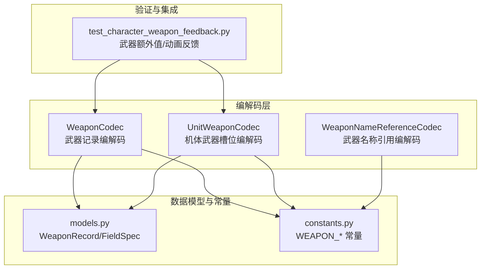
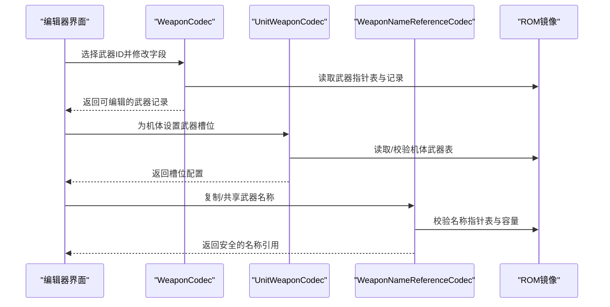
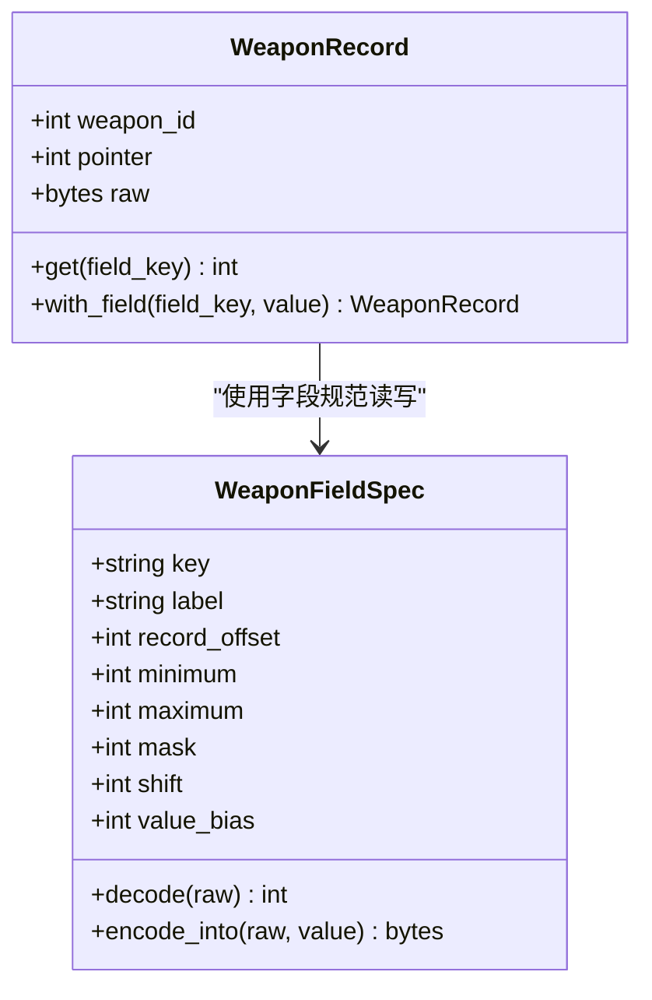
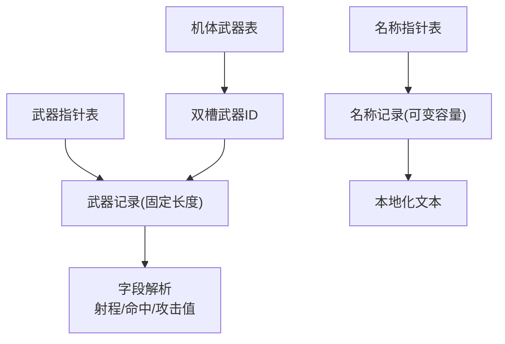
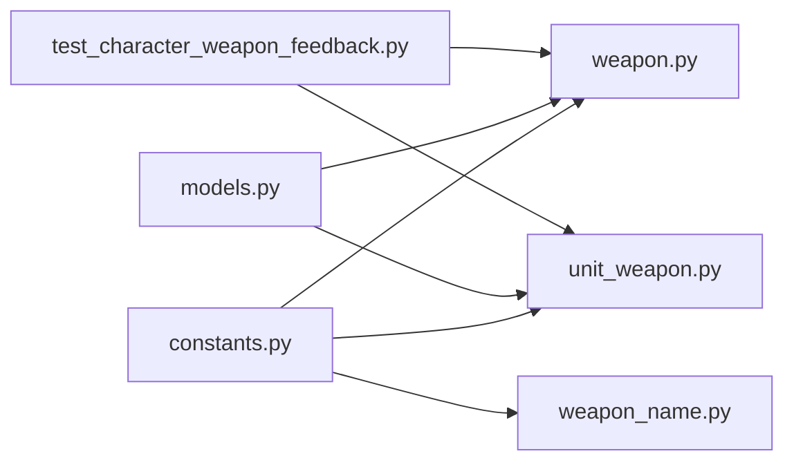

# 武器编辑器

<cite>
**本文引用的文件**
- [src/fc_editor/codecs/weapon.py](file://src/fc_editor/codecs/weapon.py)
- [src/fc_editor/codecs/unit_weapon.py](file://src/fc_editor/codecs/unit_weapon.py)
- [src/fc_editor/codecs/weapon_name.py](file://src/fc_editor/codecs/weapon_name.py)
- [src/fc_editor/models.py](file://src/fc_editor/models.py)
- [src/fc_editor/constants.py](file://src/fc_editor/constants.py)
- [tests/test_character_weapon_feedback.py](file://tests/test_character_weapon_feedback.py)
</cite>

## 目录
1. [简介](#简介)
2. [项目结构](#项目结构)
3. [核心组件](#核心组件)
4. [架构总览](#架构总览)
5. [详细组件分析](#详细组件分析)
6. [依赖关系分析](#依赖关系分析)
7. [性能与平衡性建议](#性能与平衡性建议)
8. [故障排查指南](#故障排查指南)
9. [结论](#结论)
10. [附录：实战案例](#附录：实战案例)

## 简介
本文件面向“武器编辑器”的使用者与二次开发者，系统说明武器的属性定义、伤害计算配置、特效设置、数据结构组织方式，以及武器设计指南与实战案例。内容基于仓库中武器编解码器、模型与常量定义、以及针对角色/武器反馈的测试用例进行归纳与可视化，帮助读者在不深入源码的情况下也能高效完成武器设计与调优。

## 项目结构
武器编辑能力由以下模块协同实现：
- 武器数据编解码：负责读取/写入武器记录、指针表校验、字段级补丁。
- 机体武器绑定：为每个机体分配两个武器槽位，并校验引用合法性。
- 武器名称引用：复用已有本地化名称记录，避免越界与容量问题。
- 数据模型与常量：统一描述武器字段、记录大小、ROM布局等关键信息。
- 行为验证：通过测试用例覆盖武器额外值（如射程修正、技能）与动画代码编辑的交互。

图表来源
- [src/fc_editor/codecs/weapon.py:13-90](file://src/fc_editor/codecs/weapon.py#L13-L90)
- [src/fc_editor/codecs/unit_weapon.py:11-79](file://src/fc_editor/codecs/unit_weapon.py#L11-L79)
- [src/fc_editor/codecs/weapon_name.py:9-120](file://src/fc_editor/codecs/weapon_name.py#L9-L120)
- [src/fc_editor/models.py:185-285](file://src/fc_editor/models.py#L185-L285)
- [src/fc_editor/constants.py:17-23](file://src/fc_editor/constants.py#L17-L23)
- [tests/test_character_weapon_feedback.py:27-37](file://tests/test_character_weapon_feedback.py#L27-L37)

章节来源
- [src/fc_editor/codecs/weapon.py:13-90](file://src/fc_editor/codecs/weapon.py#L13-L90)
- [src/fc_editor/codecs/unit_weapon.py:11-79](file://src/fc_editor/codecs/unit_weapon.py#L11-L79)
- [src/fc_editor/codecs/weapon_name.py:9-120](file://src/fc_editor/codecs/weapon_name.py#L9-L120)
- [src/fc_editor/models.py:185-285](file://src/fc_editor/models.py#L185-L285)
- [src/fc_editor/constants.py:17-23](file://src/fc_editor/constants.py#L17-L23)
- [tests/test_character_weapon_feedback.py:27-37](file://tests/test_character_weapon_feedback.py#L27-L37)

## 核心组件
- 武器记录编解码（WeaponCodec）
  - 读取武器指针表，校验起始标记与范围。
  - 将 CPU 指针转换为文件偏移，按固定长度解析武器记录。
  - 提供字段级 patch 能力，支持只改单个字节或掩码位。
- 机体武器绑定（UnitWeaponCodec）
  - 每机两个武器槽位，按单位 ID 计算记录偏移。
  - 校验槽内武器 ID 是否有效（小于 ROM 武器总数）。
- 武器名称引用（WeaponNameReferenceCodec）
  - 安全地让多个武器共享同一份本地化文本。
  - 校验指针表起始标记、指针范围与容量，防止越界。
- 数据模型（models.py）
  - WeaponRecord：封装武器原始字节与 ID。
  - WeaponFieldSpec：描述武器字段的偏移、掩码、位移、取值范围与显示偏差。
  - UnitWeaponConfig：封装机体与双槽武器 ID。
- 常量（constants.py）
  - 武器指针表偏移、武器数量、记录大小、PRG Bank 等。

章节来源
- [src/fc_editor/codecs/weapon.py:13-90](file://src/fc_editor/codecs/weapon.py#L13-L90)
- [src/fc_editor/codecs/unit_weapon.py:11-79](file://src/fc_editor/codecs/unit_weapon.py#L11-L79)
- [src/fc_editor/codecs/weapon_name.py:9-120](file://src/fc_editor/codecs/weapon_name.py#L9-L120)
- [src/fc_editor/models.py:185-285](file://src/fc_editor/models.py#L185-L285)
- [src/fc_editor/constants.py:17-23](file://src/fc_editor/constants.py#L17-L23)

## 架构总览
武器编辑器的数据流围绕“指针表—记录—字段”三层展开：
- 指针表：武器指针表、武器名称指针表、机体武器表。
- 记录：固定长度的武器记录；名称记录以容量为单位。
- 字段：通过 FieldSpec/WeaponFieldSpec 精确到字节/位，支持掩码与位移。

图表来源
- [src/fc_editor/codecs/weapon.py:20-66](file://src/fc_editor/codecs/weapon.py#L20-L66)
- [src/fc_editor/codecs/unit_weapon.py:30-58](file://src/fc_editor/codecs/unit_weapon.py#L30-L58)
- [src/fc_editor/codecs/weapon_name.py:23-89](file://src/fc_editor/codecs/weapon_name.py#L23-L89)

## 详细组件分析

### 武器属性定义与数据结构
- 武器记录大小与布局
  - 记录大小：固定 6 字节。
  - 关键字段：最大射程（低半字节+1）、命中、对空/对陆/对海攻击值。
  - 候选字段：攻击类型标志（高半字节）、近程修正代码（低半字节），用于距离相关命中修正。
- 字段编码规则
  - 射程字段使用掩码与显示偏差，确保战斗代码直接比较目标距离上限。
  - 命中与攻击值为单字节无符号整数，直接进入命中率/伤害计算流程。
- 数据结构
  - WeaponRecord：包含 weapon_id、pointer、raw。
  - WeaponFieldSpec：描述 key、label、record_offset、mask、shift、value_bias、范围等。

图表来源
- [src/fc_editor/models.py:185-242](file://src/fc_editor/models.py#L185-L242)
- [src/fc_editor/models.py:245-285](file://src/fc_editor/models.py#L245-L285)

章节来源
- [src/fc_editor/models.py:185-285](file://src/fc_editor/models.py#L185-L285)
- [src/fc_editor/constants.py:17-23](file://src/fc_editor/constants.py#L17-L23)

### 伤害计算配置（基础伤害、加成公式、克制关系）
- 基础伤害
  - 由对空/对陆/对海攻击值决定，根据目标位置与单位类型选择对应值。
  - 命中值直接进入命中率计算，影响是否命中。
- 加成与修正
  - 射程字段控制最大射程，超出范围无法攻击。
  - 候选的近程修正代码可能影响近距离命中修正表的选择。
- 克制关系
  - 当前武器记录未直接体现“克制系数”，克制通常由目标类型与地形组合在运行时判定。
  - 若需扩展克制，可在候选字段或外部配置表中增加位标志或索引。

章节来源
- [src/fc_editor/models.py:245-285](file://src/fc_editor/models.py#L245-L285)
- [src/fc_editor/constants.py:17-23](file://src/fc_editor/constants.py#L17-L23)

### 特效设置（命中特效、暴击特效、特殊状态附加）
- 武器动画/特效
  - 武器编辑器允许编辑武器动画指令序列，其中包含可编辑的指令参数。
  - 测试覆盖了动画代码编辑与武器字段修改在同一撤销组中的行为。
- 特殊状态附加
  - 武器记录本身不包含显式的“状态附加”字段；如需附加状态，可通过动画指令或外部逻辑实现。
- 射程与技能联动
  - 武器额外值（如技能、距离修正）通过专用接口写入，并与射程高半字节保留位兼容。

章节来源
- [tests/test_character_weapon_feedback.py:193-212](file://tests/test_character_weapon_feedback.py#L193-L212)
- [tests/test_character_weapon_feedback.py:101-113](file://tests/test_character_weapon_feedback.py#L101-L113)

### 武器数据结构与组织方式
- 武器表
  - 武器指针表：位于固定偏移，条目数为 profile.weapon_pointer_count，首项为哨兵。
  - 每条记录固定大小，按指针定位到 PRG Bank 的数据区。
- 名称表
  - 武器名称指针表：复用已有本地化记录，避免重复存储。
  - 名称数据区有明确的首尾指针与容量限制，确保不越界。
- 特效索引
  - 武器记录本身不含独立“特效索引”字段；特效由动画指令序列承载。
  - 名称引用通过指针表映射到具体文本块，形成“名称索引”。

图表来源
- [src/fc_editor/codecs/weapon.py:20-66](file://src/fc_editor/codecs/weapon.py#L20-L66)
- [src/fc_editor/codecs/weapon_name.py:23-89](file://src/fc_editor/codecs/weapon_name.py#L23-L89)
- [src/fc_editor/codecs/unit_weapon.py:30-58](file://src/fc_editor/codecs/unit_weapon.py#L30-L58)
- [src/fc_editor/constants.py:17-23](file://src/fc_editor/constants.py#L17-L23)

章节来源
- [src/fc_editor/codecs/weapon.py:20-66](file://src/fc_editor/codecs/weapon.py#L20-L66)
- [src/fc_editor/codecs/weapon_name.py:23-89](file://src/fc_editor/codecs/weapon_name.py#L23-L89)
- [src/fc_editor/codecs/unit_weapon.py:30-58](file://src/fc_editor/codecs/unit_weapon.py#L30-L58)
- [src/fc_editor/constants.py:17-23](file://src/fc_editor/constants.py#L17-L23)

### 与机体的绑定方法
- 每个机体拥有两个武器槽位，分别存放武器 ID。
- 绑定过程会校验武器 ID 是否在 ROM 支持的武器范围内。
- 绑定后，战斗阶段根据目标位置与单位类型选择对应的攻击值进行伤害计算。

章节来源
- [src/fc_editor/codecs/unit_weapon.py:30-79](file://src/fc_editor/codecs/unit_weapon.py#L30-L79)
- [src/fc_editor/models.py:288-306](file://src/fc_editor/models.py#L288-L306)

## 依赖关系分析
- 编解码器依赖常量与模型：
  - WeaponCodec 依赖 WEAPON_RECORD_SIZE、武器指针表偏移与 PRG Bank。
  - UnitWeaponCodec 依赖 UNIT_WEAPON_TABLE_OFFSET、UNIT_WEAPON_SLOT_COUNT。
  - WeaponNameReferenceCodec 依赖名称指针表与数据区边界。
- 测试用例依赖编解码器与项目接口：
  - 验证武器额外值（技能、距离修正）与动画编辑的一致性。
  - 验证保存/重加载后补丁回放的正确性。

图表来源
- [src/fc_editor/constants.py:17-23](file://src/fc_editor/constants.py#L17-L23)
- [src/fc_editor/models.py:185-285](file://src/fc_editor/models.py#L185-L285)
- [src/fc_editor/codecs/weapon.py:13-90](file://src/fc_editor/codecs/weapon.py#L13-L90)
- [src/fc_editor/codecs/unit_weapon.py:11-79](file://src/fc_editor/codecs/unit_weapon.py#L11-L79)
- [src/fc_editor/codecs/weapon_name.py:9-120](file://src/fc_editor/codecs/weapon_name.py#L9-L120)
- [tests/test_character_weapon_feedback.py:27-37](file://tests/test_character_weapon_feedback.py#L27-L37)

章节来源
- [src/fc_editor/constants.py:17-23](file://src/fc_editor/constants.py#L17-L23)
- [src/fc_editor/models.py:185-285](file://src/fc_editor/models.py#L185-L285)
- [src/fc_editor/codecs/weapon.py:13-90](file://src/fc_editor/codecs/weapon.py#L13-L90)
- [src/fc_editor/codecs/unit_weapon.py:11-79](file://src/fc_editor/codecs/unit_weapon.py#L11-L79)
- [src/fc_editor/codecs/weapon_name.py:9-120](file://src/fc_editor/codecs/weapon_name.py#L9-L120)
- [tests/test_character_weapon_feedback.py:27-37](file://tests/test_character_weapon_feedback.py#L27-L37)

## 性能与平衡性建议
- 性能优化
  - 尽量复用名称记录，减少重复文本占用与指针表膨胀。
  - 批量修改时优先使用字段级 patch，避免整块重写。
  - 动画指令编辑应最小化变更范围，保持同一撤销组内的原子性。
- 平衡性考虑
  - 射程与命中需配合：高命中但短射程适合近战，长射程但低命中适合远程压制。
  - 对空/对陆/对海攻击值应根据常见目标分布调整，避免单一环境过强。
  - 候选字段（攻击类型标志、近程修正代码）可用于差异化机制，但需谨慎验证兼容性。
- 与机体绑定
  - 为不同机体配置合适的武器组合，发挥其特性（如空中优势、陆地攻坚）。
  - 注意武器槽位数量限制（两槽），合理分配主副武器。

[本节为通用指导，不直接分析具体文件]

## 故障排查指南
- 指针表起始标记不正确
  - 现象：武器指针表首项非预期值。
  - 处理：检查 ROM 版本与配置文件是否匹配。
- 武器记录不完整或越界
  - 现象：记录长度不足或偏移超出支持区域。
  - 处理：确认记录大小与 PRG Bank 窗口基址正确。
- 名称指针越界或容量无效
  - 现象：名称指针不在已验证数据区或容量为负。
  - 处理：核对名称数据首尾指针与容量计算。
- 机体武器槽位引用无效
  - 现象：槽内武器 ID 大于等于武器总数。
  - 处理：检查武器 ID 范围与 ROM 武器数量。
- 动画指令非法导致无法应用
  - 现象：动画代码编辑后无法提交。
  - 处理：修正指令格式，确保在同一撤销组内与其他武器字段一起提交。

章节来源
- [src/fc_editor/codecs/weapon.py:20-39](file://src/fc_editor/codecs/weapon.py#L20-L39)
- [src/fc_editor/codecs/weapon.py:64-66](file://src/fc_editor/codecs/weapon.py#L64-L66)
- [src/fc_editor/codecs/weapon_name.py:23-38](file://src/fc_editor/codecs/weapon_name.py#L23-L38)
- [src/fc_editor/codecs/unit_weapon.py:37-48](file://src/fc_editor/codecs/unit_weapon.py#L37-L48)
- [tests/test_character_weapon_feedback.py:214-223](file://tests/test_character_weapon_feedback.py#L214-L223)

## 结论
武器编辑器通过严格的指针表校验、固定长度记录解析与字段级补丁，提供了安全高效的武器编辑能力。结合机体绑定与名称复用机制，既能满足多样化武器设计，又能保证 ROM 数据的完整性与稳定性。通过测试用例验证了武器额外值与动画编辑的交互一致性，为后续扩展与定制奠定了坚实基础。

[本节为总结性内容，不直接分析具体文件]

## 附录：实战案例

### 案例一：创建强力武器（高命中、多环境高攻击）
- 目标：打造一把全地形高命中武器，适合主力输出。
- 步骤
  - 设置最大射程为适中值，确保能在多数交战距离内命中。
  - 提高命中值，使该武器在常规战斗中稳定命中。
  - 提升对空/对陆/对海攻击值，使其在不同环境下均具备高威胁。
  - 为使用该武器的机体分配两个槽位，主武器为该强力武器，副武器提供辅助效果。
- 验证
  - 使用武器字段 patch 修改后，检查射程与命中是否正确写入。
  - 在战斗场景中测试对不同目标的伤害表现。

章节来源
- [src/fc_editor/models.py:245-260](file://src/fc_editor/models.py#L245-L260)
- [src/fc_editor/codecs/weapon.py:72-85](file://src/fc_editor/codecs/weapon.py#L72-L85)
- [src/fc_editor/codecs/unit_weapon.py:64-79](file://src/fc_editor/codecs/unit_weapon.py#L64-L79)

### 案例二：特殊效果武器（射程修正与技能联动）
- 目标：制造一把具有特殊射程修正与技能联动的武器。
- 步骤
  - 设置射程字段，并通过武器额外值指定技能与距离修正。
  - 利用候选的近程修正代码，调整近距离命中修正表。
  - 编辑武器动画，加入命中/暴击特效指令，增强反馈。
- 验证
  - 使用测试用例中的武器额外值接口，确保射程高半字节保留位不被破坏。
  - 在同一撤销组内提交动画与字段修改，确保回滚一致性。

章节来源
- [tests/test_character_weapon_feedback.py:101-113](file://tests/test_character_weapon_feedback.py#L101-L113)
- [tests/test_character_weapon_feedback.py:193-212](file://tests/test_character_weapon_feedback.py#L193-L212)
- [src/fc_editor/models.py:261-283](file://src/fc_editor/models.py#L261-L283)

### 案例三：名称复用与共享
- 目标：让多个武器共享同一份本地化名称，节省空间。
- 步骤
  - 通过名称引用编解码器，将某武器的名称指针复制到另一武器。
  - 校验指针范围与容量，确保不会越界。
- 验证
  - 使用 round_trip 检查指针与容量是否保持不变。
  - 在编辑器中查看名称显示是否与源武器一致。

章节来源
- [src/fc_editor/codecs/weapon_name.py:98-119](file://src/fc_editor/codecs/weapon_name.py#L98-L119)