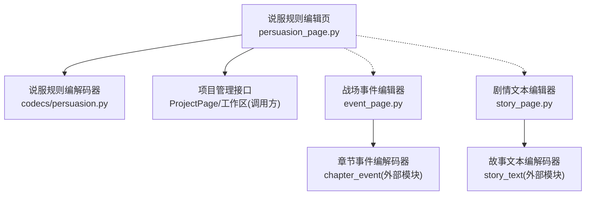
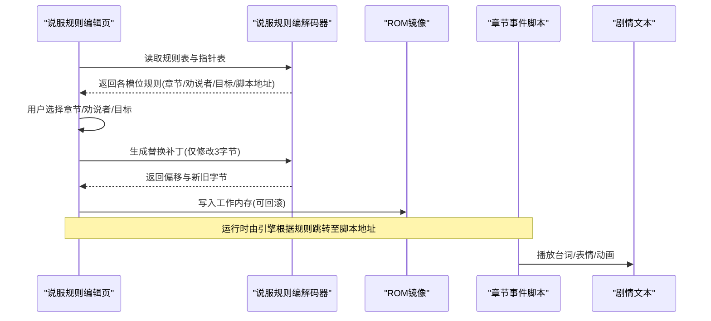
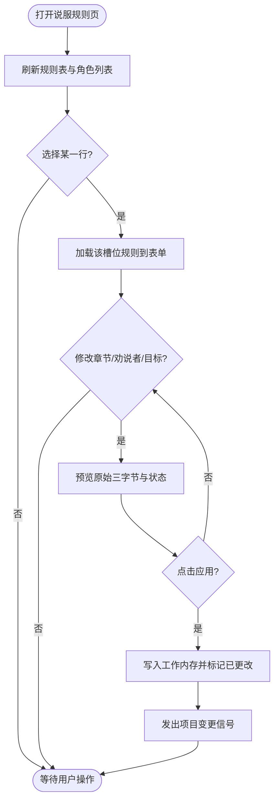
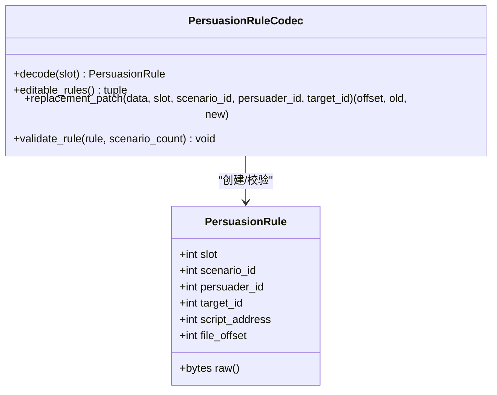
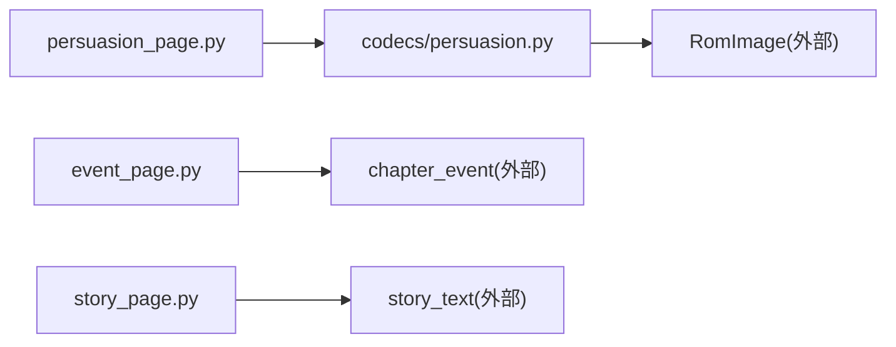

# 说服系统编辑器

<cite>
**本文引用的文件**
- [src/dc_modifier/persuasion_page.py](file://src/dc_modifier/persuasion_page.py)
- [src/fc_editor/codecs/persuasion.py](file://src/fc_editor/codecs/persuasion.py)
- [src/dc_modifier/event_page.py](file://src/dc_modifier/event_page.py)
- [src/dc_modifier/story_page.py](file://src/dc_modifier/story_page.py)
</cite>

## 目录
1. [简介](#简介)
2. [项目结构](#项目结构)
3. [核心组件](#核心组件)
4. [架构总览](#架构总览)
5. [详细组件分析](#详细组件分析)
6. [依赖关系分析](#依赖关系分析)
7. [性能与稳定性](#性能与稳定性)
8. [故障排查指南](#故障排查指南)
9. [结论](#结论)
10. [附录：设计指南与实战案例](#附录：设计指南与实战案例)

## 简介
本编辑器围绕“说服（劝降）”这一游戏内交互机制，提供可视化的规则编辑能力。用户可在指定章节中为“劝说者—目标”组合配置匹配规则，并关联到原ROM中已验证的脚本地址；编辑器保证对原始字节的安全替换、可逆还原与状态一致性。配合战场事件与剧情文本编辑器，可实现从条件判定、结果执行到对话呈现的完整流程。

## 项目结构
- 说服规则编辑页：提供槽位列表、章节/角色选择、原始信息预览与应用/还原操作。
- 说服规则编解码器：负责读取/校验/生成固定长度的规则记录与脚本指针表，确保数据完整性与安全边界。
- 战场事件编辑器：用于编辑与说服相关的触发、行动、奖励等指令，保持等长替换，避免破坏脚本布局。
- 剧情文本编辑器：支持Unicode与原始Token双向编辑，便于编写NPC台词、表情与动画控制参数。

图表来源
- [src/dc_modifier/persuasion_page.py:25-127](file://src/dc_modifier/persuasion_page.py#L25-L127)
- [src/fc_editor/codecs/persuasion.py:24-53](file://src/fc_editor/codecs/persuasion.py#L24-L53)
- [src/dc_modifier/event_page.py:66-110](file://src/dc_modifier/event_page.py#L66-L110)
- [src/dc_modifier/story_page.py:35-57](file://src/dc_modifier/story_page.py#L35-L57)

章节来源
- [src/dc_modifier/persuasion_page.py:25-127](file://src/dc_modifier/persuasion_page.py#L25-L127)
- [src/fc_editor/codecs/persuasion.py:24-53](file://src/fc_editor/codecs/persuasion.py#L24-L53)
- [src/dc_modifier/event_page.py:66-110](file://src/dc_modifier/event_page.py#L66-L110)
- [src/dc_modifier/story_page.py:35-57](file://src/dc_modifier/story_page.py#L35-L57)

## 核心组件
- 说服规则编辑页（UI层）
  - 展示全局劝降规则表，支持按槽位切换、章节/角色下拉选择、原始三字节预览、应用与还原。
  - 通过项目管理接口读写当前工程的工作内存，并在变更时发出项目更新信号。
- 说服规则编解码器（数据层）
  - 解析ROM中的规则表与脚本指针表，校验结束码、范围与指针合法性。
  - 提供只读解码、可编辑范围限制、安全替换补丁生成与规则校验。
- 战场事件编辑器（脚本层）
  - 以模板化方式编辑与说服相关的增援、加入、转化、奖励等动作，严格保持等长。
- 剧情文本编辑器（文本层）
  - 提供Unicode与原始Token的双向编辑，内置DC码表，支持字库导入导出与长度校验。

章节来源
- [src/dc_modifier/persuasion_page.py:25-127](file://src/dc_modifier/persuasion_page.py#L25-L127)
- [src/fc_editor/codecs/persuasion.py:10-53](file://src/fc_editor/codecs/persuasion.py#L10-L53)
- [src/dc_modifier/event_page.py:66-110](file://src/dc_modifier/event_page.py#L66-L110)
- [src/dc_modifier/story_page.py:35-57](file://src/dc_modifier/story_page.py#L35-L57)

## 架构总览
说服系统由“规则匹配—脚本执行—文本呈现”三段组成：
- 规则匹配：在特定章节中，根据“劝说者ID + 目标ID”匹配到对应槽位的规则，并读取其脚本指针。
- 脚本执行：跳转到已验证的脚本地址，执行成功/失败分支、奖励/惩罚、动画与音效等。
- 文本呈现：通过剧情文本编辑器编写或调整台词与控制参数，实现表情变化与演出效果。

图表来源
- [src/dc_modifier/persuasion_page.py:160-246](file://src/dc_modifier/persuasion_page.py#L160-L246)
- [src/fc_editor/codecs/persuasion.py:55-77](file://src/fc_editor/codecs/persuasion.py#L55-L77)
- [src/dc_modifier/event_page.py:655-689](file://src/dc_modifier/event_page.py#L655-L689)
- [src/dc_modifier/story_page.py:768-788](file://src/dc_modifier/story_page.py#L768-L788)

## 详细组件分析

### 说服规则编辑页（UI）
- 功能要点
  - 表格列出所有可编辑槽位，显示章节、劝说者、目标、脚本地址与原始字节。
  - 右侧表单提供章节/劝说者/目标下拉框，实时预览原始三字节与编辑状态。
  - “应用”将新规则写入工作内存，“还原”恢复原始值；高级面板可显示脚本地址与原始字节。
- 关键流程
  - 刷新：加载角色列表、构建表格、选中行联动编辑区。
  - 选择变更：若存在未提交草稿，先尝试提交再切换。
  - 应用/还原：调用项目管理接口完成写入或恢复，并发出项目变更信号。

图表来源
- [src/dc_modifier/persuasion_page.py:160-246](file://src/dc_modifier/persuasion_page.py#L160-L246)
- [src/dc_modifier/persuasion_page.py:273-295](file://src/dc_modifier/persuasion_page.py#L273-L295)

章节来源
- [src/dc_modifier/persuasion_page.py:25-127](file://src/dc_modifier/persuasion_page.py#L25-L127)
- [src/dc_modifier/persuasion_page.py:160-246](file://src/dc_modifier/persuasion_page.py#L160-L246)
- [src/dc_modifier/persuasion_page.py:273-295](file://src/dc_modifier/persuasion_page.py#L273-L295)

### 说服规则编解码器（数据）
- 数据结构
  - PersuasionRule：包含槽位、章节ID、劝说者ID、目标ID、脚本地址、文件偏移。
  - 每条记录固定3字节：[章节ID][劝说者ID][目标ID]。
  - 脚本指针表独立存储，每个槽位一个2字节指针。
- 校验与保护
  - 初始化时检查表尾结束码$FF、指针表范围、指针是否落在已验证脚本区。
  - 仅允许在spec.editable_count范围内的槽位进行替换，防止激活无安全脚本的占位槽。
- 替换策略
  - replacement_patch返回待写偏移与新旧字节，确保仅修改3字节，不移动指针。

图表来源
- [src/fc_editor/codecs/persuasion.py:10-22](file://src/fc_editor/codecs/persuasion.py#L10-L22)
- [src/fc_editor/codecs/persuasion.py:24-53](file://src/fc_editor/codecs/persuasion.py#L24-L53)
- [src/fc_editor/codecs/persuasion.py:102-125](file://src/fc_editor/codecs/persuasion.py#L102-L125)

章节来源
- [src/fc_editor/codecs/persuasion.py:10-22](file://src/fc_editor/codecs/persuasion.py#L10-L22)
- [src/fc_editor/codecs/persuasion.py:24-53](file://src/fc_editor/codecs/persuasion.py#L24-L53)
- [src/fc_editor/codecs/persuasion.py:87-125](file://src/fc_editor/codecs/persuasion.py#L87-L125)

### 战场事件编辑器（脚本）
- 作用
  - 编辑与说服相关的增援、加入、转化、奖励、撤退等指令，保持等长替换，避免破坏脚本布局。
  - 提供模板化参数编辑与原始字节粘贴，支持复制/粘贴指令片段。
- 与说服系统的结合
  - 说服规则指向的脚本地址通常位于章节事件区，可通过此编辑器微调事件动作与参数。

章节来源
- [src/dc_modifier/event_page.py:66-110](file://src/dc_modifier/event_page.py#L66-L110)
- [src/dc_modifier/event_page.py:238-249](file://src/dc_modifier/event_page.py#L238-L249)
- [src/dc_modifier/event_page.py:655-689](file://src/dc_modifier/event_page.py#L655-L689)

### 剧情文本编辑器（文本）
- 作用
  - 提供Unicode与原始Token双向编辑，内置DC码表，支持导入外部.tbl与导出模板。
  - 自动计算长度、提示容量与重排能力，保障文本替换的安全性。
- 与说服系统的结合
  - 说服脚本常调用剧情文本显示NPC台词、表情与动画控制参数；通过此编辑器可精细调整演出内容。

章节来源
- [src/dc_modifier/story_page.py:35-57](file://src/dc_modifier/story_page.py#L35-L57)
- [src/dc_modifier/story_page.py:768-788](file://src/dc_modifier/story_page.py#L768-L788)
- [src/dc_modifier/story_page.py:698-744](file://src/dc_modifier/story_page.py#L698-L744)

## 依赖关系分析
- 编辑页依赖编解码器进行数据读取与校验。
- 编解码器依赖ROM镜像与项目配置（章节数、规则表位置、指针表位置）。
- 战场事件与剧情文本编辑器分别依赖各自的编解码器与项目接口。
- 整体耦合度低、职责清晰：UI层专注交互，数据层专注安全与校验，脚本/文本层专注内容与演出。

图表来源
- [src/dc_modifier/persuasion_page.py:25-127](file://src/dc_modifier/persuasion_page.py#L25-L127)
- [src/fc_editor/codecs/persuasion.py:24-53](file://src/fc_editor/codecs/persuasion.py#L24-L53)
- [src/dc_modifier/event_page.py:66-110](file://src/dc_modifier/event_page.py#L66-L110)
- [src/dc_modifier/story_page.py:35-57](file://src/dc_modifier/story_page.py#L35-L57)

章节来源
- [src/dc_modifier/persuasion_page.py:25-127](file://src/dc_modifier/persuasion_page.py#L25-L127)
- [src/fc_editor/codecs/persuasion.py:24-53](file://src/fc_editor/codecs/persuasion.py#L24-L53)
- [src/dc_modifier/event_page.py:66-110](file://src/dc_modifier/event_page.py#L66-L110)
- [src/dc_modifier/story_page.py:35-57](file://src/dc_modifier/story_page.py#L35-L57)

## 性能与稳定性
- 固定长度记录与指针表：每次替换仅修改3字节，避免大规模重排，降低崩溃风险。
- 严格的范围与指针校验：初始化即检测越界与非法指针，提前暴露问题。
- 等长指令编辑：战场事件编辑器强制等长替换，防止脚本错位。
- 文本长度校验：剧情文本编辑器在未启用扩展空间时要求等长，启用后提供容量预估与重排提示。

[本节为通用指导，无需具体文件引用]

## 故障排查指南
- 无法应用规则
  - 检查是否选择了有效的章节/劝说者/目标，且处于可编辑槽位范围内。
  - 查看原始三字节预览是否为合法值；如无效，修正后再应用。
- 切换页面提示“有未应用改动”
  - 先点击“应用”或“还原”，确保当前编辑状态干净后再切换。
- 剧情文本无法编码
  - 确认已载入正确的.tbl字库表；若同时修改了Unicode与原始Token，需明确保留其中一份。
- 事件指令无法粘贴
  - 粘贴内容必须与原指令等长，且不能包含后续指令；否则会被拒绝。

章节来源
- [src/dc_modifier/persuasion_page.py:248-271](file://src/dc_modifier/persuasion_page.py#L248-L271)
- [src/dc_modifier/persuasion_page.py:273-295](file://src/dc_modifier/persuasion_page.py#L273-L295)
- [src/dc_modifier/event_page.py:250-281](file://src/dc_modifier/event_page.py#L250-L281)
- [src/dc_modifier/story_page.py:420-433](file://src/dc_modifier/story_page.py#L420-L433)
- [src/dc_modifier/story_page.py:698-717](file://src/dc_modifier/story_page.py#L698-L717)

## 结论
说服系统编辑器以“规则表+脚本指针+事件/文本”为核心，提供了安全、直观且可逆的编辑体验。通过严格的校验与等长替换策略，既保证了ROM结构的稳定性，又为剧情与演出留下了充分的创作空间。建议在实际项目中，将说服规则与事件、文本紧密配合，形成完整的互动闭环。

[本节为总结性内容，无需具体文件引用]

## 附录：设计指南与实战案例

### 设计指南
- 难度平衡
  - 通过章节/劝说者/目标的组合控制成功率；高难度关卡提高门槛或减少可用劝说者。
  - 利用事件动作设置失败惩罚（如扣资源、暂时离队），成功奖励（如获得强力单位）。
- 玩家体验优化
  - 使用剧情文本编辑器丰富台词与表情，增强情感反馈。
  - 在事件中插入音乐/等待指令，营造节奏感与戏剧张力。
- 与剧情的有机结合
  - 将说服事件嵌入主线/支线剧情节点，使选择影响后续发展。
  - 通过文本组与事件联动，实现多结局或多分支叙事。

[本节为概念性指导，无需具体文件引用]

### 实战案例：俘虏敌方将领
- 场景设定
  - 第X章，我方“武将A”对敌方“武将B”发起说服。
- 规则配置
  - 在说服规则页选择章节、劝说者A、目标B，应用规则。
- 事件与文本
  - 在事件编辑器中设置“正式加入我方”或“转为临时友军”的动作。
  - 在剧情文本编辑器中编写台词，添加表情与动画控制参数。
- 结果分支
  - 成功：加入我方，给予经验/道具奖励。
  - 失败：敌方士气提升或触发追击事件。

章节来源
- [src/dc_modifier/persuasion_page.py:160-246](file://src/dc_modifier/persuasion_page.py#L160-L246)
- [src/dc_modifier/event_page.py:655-689](file://src/dc_modifier/event_page.py#L655-L689)
- [src/dc_modifier/story_page.py:768-788](file://src/dc_modifier/story_page.py#L768-L788)