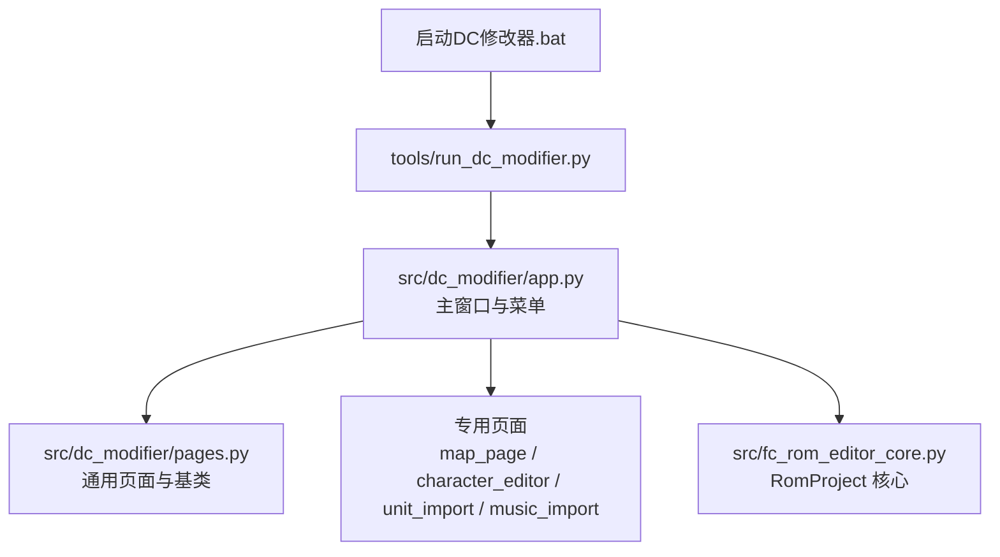
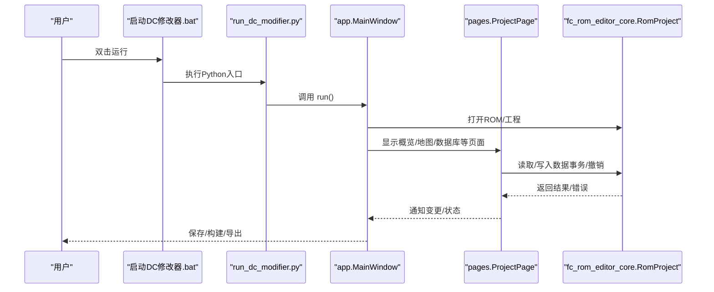
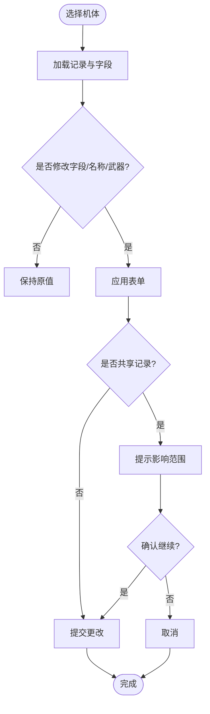
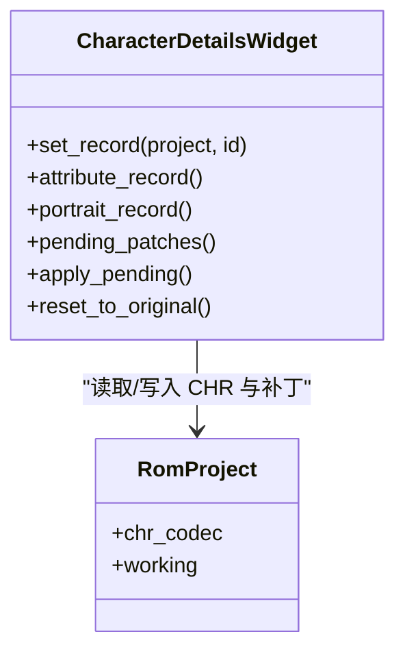
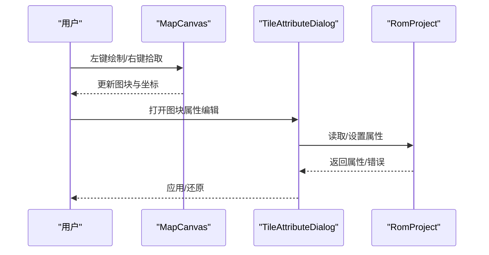
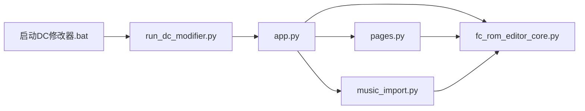

# 用户手册

<cite>
**本文引用的文件**
- [启动DC修改器.bat](file://启动DC修改器.bat)
- [tools/run_dc_modifier.py](file://tools/run_dc_modifier.py)
- [src/dc_modifier/app.py](file://src/dc_modifier/app.py)
- [src/dc_modifier/pages.py](file://src/dc_modifier/pages.py)
- [src/dc_modifier/map_page.py](file://src/dc_modifier/map_page.py)
- [src/dc_modifier/character_editor.py](file://src/dc_modifier/character_editor.py)
- [src/dc_modifier/unit_import_page.py](file://src/dc_modifier/unit_import_page.py)
- [src/dc_modifier/music_import.py](file://src/dc_modifier/music_import.py)
- [src/fc_rom_editor_core.py](file://src/fc_rom_editor_core.py)
</cite>

## 目录
1. [简介](#简介)
2. [项目结构](#项目结构)
3. [核心组件](#核心组件)
4. [架构总览](#架构总览)
5. [详细组件分析](#详细组件分析)
6. [依赖关系分析](#依赖关系分析)
7. [性能注意事项](#性能注意事项)
8. [故障排查指南](#故障排查指南)
9. [结论](#结论)
10. [附录](#附录)

## 简介
本手册面向使用“新DC篇完整修改器”的编辑者，覆盖从ROM与工程管理、界面导航到各编辑器模块（机体、人物、武器、地图、剧情文本等）的完整操作说明，并深入容量规划、Bank空间管理、音乐导入导出、图像资源管理等高级主题。文档既适合初学者入门，也提供有经验用户的深度参考与最佳实践。

## 项目结构
- 启动入口
  - Windows批处理：双击“启动DC修改器.bat”，若未构建则通过虚拟环境运行Python脚本启动修改器。
  - Python入口：tools/run_dc_modifier.py 负责将源码路径加入系统路径并调用 dc_modifier.app.run。
- 主程序与页面
  - src/dc_modifier/app.py：定义主窗口、菜单、工具对话框、扩展功能页（如容量规划、变更与验证）。
  - src/dc_modifier/pages.py：通用页面基类与常用页面（概览、数据库、资源、变更等），以及搜索型记录页面框架。
  - 专用页面：map_page.py（战场地图）、character_editor.py（人物属性与头像）、unit_import_page.py（机体导入与CHR图像）、music_import.py（FamiStudio音乐组装与导入）。
- ROM与工程内核
  - src/fc_rom_editor_core.py：RomProject 封装ROM加载、编解码器装配、事务与撤销重做、IPS生成、容量分配与校验等核心能力。

**图表来源**
- [启动DC修改器.bat:1-16](file://启动DC修改器.bat#L1-L16)
- [tools/run_dc_modifier.py:1-30](file://tools/run_dc_modifier.py#L1-L30)
- [src/dc_modifier/app.py:1-120](file://src/dc_modifier/app.py#L1-L120)
- [src/dc_modifier/pages.py:1-120](file://src/dc_modifier/pages.py#L1-L120)
- [src/fc_rom_editor_core.py:463-620](file://src/fc_rom_editor_core.py#L463-L620)

**章节来源**
- [启动DC修改器.bat:1-16](file://启动DC修改器.bat#L1-L16)
- [tools/run_dc_modifier.py:1-30](file://tools/run_dc_modifier.py#L1-L30)
- [src/dc_modifier/app.py:236-490](file://src/dc_modifier/app.py#L236-L490)
- [src/dc_modifier/pages.py:103-153](file://src/dc_modifier/pages.py#L103-L153)
- [src/fc_rom_editor_core.py:463-620](file://src/fc_rom_editor_core.py#L463-L620)

## 核心组件
- RomProject（ROM工程对象）
  - 负责ROM载入、编解码器装配（机体、武器、人物、地图、剧情、音乐、CHR等）、容量分配器初始化、事务与撤销重做、工程完整性校验、IPS生成与原子写入。
  - 支持扩展计划（ExpansionPlan）与分区预留，确保音频引擎、固定银行和CHR区域安全。
- 主窗口与页面体系
  - MainWindow：统一菜单、状态栏、页面注册与导航、工程/ROM打开保存、一键构建、导出IPS、撤销/重做、验证。
  - ProjectPage：所有编辑页面的基类，提供事务化提交、草稿状态、错误提示、刷新机制。
  - SearchableRecordPage：列表+详情搜索型页面基类，支持复制/粘贴/还原/导出记录。
- 专用编辑器
  - 地图编辑器：图块绘制、地形属性、部署与事件叠加层、调色板预览。
  - 人物编辑器：属性、精神、头像设置与上传、共享记录提示。
  - 机体导入：.dcunit包导入/导出、CHR连续图块携带、影响范围预览。
  - 音乐导入：FamiStudio ASM源组装为8KiB Bank，安全校验与错误提示。

**章节来源**
- [src/fc_rom_editor_core.py:463-620](file://src/fc_rom_editor_core.py#L463-L620)
- [src/dc_modifier/app.py:276-490](file://src/dc_modifier/app.py#L276-L490)
- [src/dc_modifier/pages.py:103-153](file://src/dc_modifier/pages.py#L103-L153)
- [src/dc_modifier/map_page.py:595-800](file://src/dc_modifier/map_page.py#L595-L800)
- [src/dc_modifier/character_editor.py:17-150](file://src/dc_modifier/character_editor.py#L17-L150)
- [src/dc_modifier/unit_import_page.py:30-128](file://src/dc_modifier/unit_import_page.py#L30-L128)
- [src/dc_modifier/music_import.py:31-92](file://src/dc_modifier/music_import.py#L31-L92)

## 架构总览
下图展示从启动到编辑的核心流程：批处理→Python入口→主窗口→页面→RomProject→编解码器与容量分配。

**图表来源**
- [启动DC修改器.bat:1-16](file://启动DC修改器.bat#L1-L16)
- [tools/run_dc_modifier.py:13-25](file://tools/run_dc_modifier.py#L13-L25)
- [src/dc_modifier/app.py:276-490](file://src/dc_modifier/app.py#L276-L490)
- [src/dc_modifier/pages.py:103-153](file://src/dc_modifier/pages.py#L103-L153)
- [src/fc_rom_editor_core.py:463-620](file://src/fc_rom_editor_core.py#L463-L620)

## 详细组件分析

### 基础操作：ROM与工程管理
- 打开ROM
  - 菜单“文件→打开…”，或默认自动加载工作区ROM。
  - 若ROM布局兼容但非基准哈希且无扩展容量规划，会提示先进行容量规划。
- 打开工程
  - 菜单“工程→打开工程…”，加载工程文件并应用资源分配；若工程含自动分区但ROM无容量规划表，将报错。
- 保存与构建
  - 保存ROM/另存为、导出IPS、一键构建（输出ROM/IPS/报告）。
  - 构建过程保护音频引擎、固定银行与CHR区域，避免破坏性写入。
- 撤销/重做与验证
  - 快捷键 Ctrl+Alt+Z/Y 撤销/重做；F7 完整检查。

**章节来源**
- [src/dc_modifier/app.py:399-490](file://src/dc_modifier/app.py#L399-L490)
- [src/dc_modifier/app.py:794-800](file://src/dc_modifier/app.py#L794-L800)
- [src/fc_rom_editor_core.py:638-674](file://src/fc_rom_editor_core.py#L638-L674)

### 界面导航与工作流
- 推荐工作流（工程概览页）
  - 打开 DC_kuorong_464K.nes → 自动规划扩展容量 → 修改并随时验证 → 保存工程并构建ROM/IPS。
- 快速入口
  - 概览页提供快捷按钮直达：扩展容量规划、地图与部署、机体属性、人物数据、武器属性、剧情文字、增援/加入事件、劝降条件、战斗音乐。
- 状态栏
  - 显示当前模块、坐标、修改字节数等，便于定位问题。

**章节来源**
- [src/dc_modifier/pages.py:154-240](file://src/dc_modifier/pages.py#L154-L240)
- [src/dc_modifier/app.py:310-331](file://src/dc_modifier/app.py#L310-L331)

### 机体编辑器
- 功能
  - 编辑已确认的能力字段；名称引用可切换共享指针；支持两格武器槽配置；原始16字节记录查看与写入。
  - 支持复制到其他ID、还原当前机体、导出 .dcunit 数据包。
- 参数与数据格式
  - UNIT_FIELDS 定义了每个字段的标签、范围、描述；名称引用与共享ID由 RomProject 提供。
  - 共享记录会同时影响多个ID，改名或数值复制前会有明确提示。
- 最佳实践
  - 优先使用“名称引用”而非直接修改名称文本，以复用共享名称表。
  - 批量复制时注意共享属性记录的影响范围。

**图表来源**
- [src/dc_modifier/pages.py:514-800](file://src/dc_modifier/pages.py#L514-L800)

**章节来源**
- [src/dc_modifier/pages.py:514-800](file://src/dc_modifier/pages.py#L514-L800)

### 人物编辑器
- 功能
  - 编辑人物属性（精神、成长、强度/机动/防御/速度/HP补正）、击落不消失标志、精神列表与消耗。
  - 头像设置：正面/背景图库寄存器与位置、颜色、预览与上传32×32图片。
  - 共享属性/头像记录提示，避免误改多个人物。
- 数据格式与限制
  - 属性与头像分别编码，成本表全局共用；头像由真实CHR图块预览，上传后需确认写入。
- 最佳实践
  - 上传头像前确认目标CHR位置不与其他人物冲突；必要时为不同人物分配不同图库段。

**图表来源**
- [src/dc_modifier/character_editor.py:17-334](file://src/dc_modifier/character_editor.py#L17-L334)
- [src/fc_rom_editor_core.py:463-620](file://src/fc_rom_editor_core.py#L463-L620)

**章节来源**
- [src/dc_modifier/character_editor.py:17-334](file://src/dc_modifier/character_editor.py#L17-L334)

### 武器编辑器
- 功能
  - 在数据库页中按“武器”标签编辑武器属性；支持名称引用与共享指针。
  - 机体武器槽可直接关联武器ID。
- 数据格式
  - WEAPON_FIELDS 定义字段范围与描述；名称指针表由 RomProject 根据ROM配置装配。
- 最佳实践
  - 使用名称引用复用共享名称表，减少重复存储。

**章节来源**
- [src/dc_modifier/app.py:352-364](file://src/dc_modifier/app.py#L352-L364)
- [src/dc_modifier/pages.py:38-43](file://src/dc_modifier/pages.py#L38-L43)
- [src/fc_rom_editor_core.py:511-530](file://src/fc_rom_editor_core.py#L511-L530)

### 地图编辑器
- 功能
  - 图块绘制与拾取、地形属性编辑（颜色表、防御补正、海属性、空/陆/海移动补正）、部署与事件叠加层、调色板预览。
  - 单位图标渲染与阵营配色，标题字体渲染。
- 数据格式
  - MapTileAttribute/MapTilesetAttributes 表示图块属性；VERIFIED_BATTLEFIELD_PALETTES 提供已验证调色板。
- 最佳实践
  - 使用“颜色表1”自定义局部效果，颜色表2/3为公用只读；移动补正与海属性直接影响关卡玩法。

**图表来源**
- [src/dc_modifier/map_page.py:310-592](file://src/dc_modifier/map_page.py#L310-L592)
- [src/dc_modifier/map_page.py:595-800](file://src/dc_modifier/map_page.py#L595-L800)

**章节来源**
- [src/dc_modifier/map_page.py:55-236](file://src/dc_modifier/map_page.py#L55-L236)
- [src/dc_modifier/map_page.py:310-592](file://src/dc_modifier/map_page.py#L310-L592)
- [src/dc_modifier/map_page.py:595-800](file://src/dc_modifier/map_page.py#L595-L800)

### 剧情文本编辑器
- 功能
  - 内置新DC完整码表，Unicode与原始Token双向编辑；控制参数以“原始字节”标注并可逆保留。
  - 支持搜索、上一条/下一条、导出字库模板、载入外部.tal/.tbl。
- 数据格式
  - TextTable 与 default_dc_text_table 提供映射；StoryTextCodec 负责组内文本打包/解包。
- 最佳实践
  - 优先在“文字编辑”模式修改，复杂控制参数可在“原始Token”模式微调；应用前建议刷新Token解析。

**章节来源**
- [src/dc_modifier/story_page.py:35-170](file://src/dc_modifier/story_page.py#L35-L170)
- [src/fc_rom_editor_core.py:586-600](file://src/fc_rom_editor_core.py#L586-L600)

### 容量规划与Bank空间管理
- 容量规划入口
  - “扩展功能→扩展容量规划”页面，用于规划可用PRG区域与资源分区。
- 安全规则
  - 不会覆盖当前载入的基准ROM；音频引擎、固定银行与CHR区域由构建检查保护。
- 工程与ROM关系
  - 工程含自动分区但ROM无容量规划表时会报错；加载工程后会预留分区与重新打开守卫。

**章节来源**
- [src/dc_modifier/pages.py:154-240](file://src/dc_modifier/pages.py#L154-L240)
- [src/fc_rom_editor_core.py:644-674](file://src/fc_rom_editor_core.py#L644-L674)

### 音乐导入导出
- 导入流程
  - 选择FamiStudio导出的ASM源文件，工具自动包装并调用asm6_fixed.exe组装为8KiB Bank。
  - 安全限制：禁止include/incbin/base/org指令；源文件最大4MiB；超时30秒取消。
- 导出
  - 可通过“战斗背景音乐”页面查看与管理已导入Bank；构建时写入ROM。
- 错误处理
  - 编码错误、缺少标签、汇编失败、未生成输出等均给出明确提示。

**章节来源**
- [src/dc_modifier/music_import.py:31-92](file://src/dc_modifier/music_import.py#L31-L92)

### 图像资源管理（CHR）
- 头像上传
  - 仅接受32×32 PNG/BMP；按四色量化写入CHR图块；预览合成正面与背景。
- 机体导入中的CHR
  - 可选择随包携带连续CHR图块（起点与数量），写入前检查重叠与冲突。
- 最佳实践
  - 为不同人物/机体分配不同CHR段，避免覆盖；上传后务必确认写入。

**章节来源**
- [src/dc_modifier/character_editor.py:302-334](file://src/dc_modifier/character_editor.py#L302-L334)
- [src/dc_modifier/unit_import_page.py:65-80](file://src/dc_modifier/unit_import_page.py#L65-L80)

### 工作流指导
- 新手流程
  - 打开ROM → 概览页确认身份 → 进入“扩展容量规划” → 修改各模块 → 随时验证 → 保存工程 → 构建ROM/IPS。
- 高效技巧
  - 使用搜索框快速定位记录；利用复制/粘贴批量调整；共享记录变更前确认影响范围。
- 团队协作
  - 导出/导入 .dcunit 交换机体；导出字库模板协作本地化；构建产物包含报告便于审计。

**章节来源**
- [src/dc_modifier/pages.py:154-240](file://src/dc_modifier/pages.py#L154-L240)
- [src/dc_modifier/pages.py:243-513](file://src/dc_modifier/pages.py#L243-L513)
- [src/dc_modifier/unit_import_page.py:30-128](file://src/dc_modifier/unit_import_page.py#L30-L128)

## 依赖关系分析
- 启动链
  - 批处理 → Python入口 → app.run → 主窗口 → 页面 → RomProject。
- 页面与核心
  - 页面通过 RomProject 访问编解码器与容量分配器；所有写操作在事务中进行，支持撤销/重做。
- 外部工具
  - FamiStudio asm6_fixed.exe 用于音乐组装；构建阶段可能调用其他工具生成报告。

**图表来源**
- [启动DC修改器.bat:1-16](file://启动DC修改器.bat#L1-L16)
- [tools/run_dc_modifier.py:1-30](file://tools/run_dc_modifier.py#L1-L30)
- [src/dc_modifier/app.py:1-120](file://src/dc_modifier/app.py#L1-L120)
- [src/dc_modifier/pages.py:1-120](file://src/dc_modifier/pages.py#L1-L120)
- [src/dc_modifier/music_import.py:1-92](file://src/dc_modifier/music_import.py#L1-L92)
- [src/fc_rom_editor_core.py:463-620](file://src/fc_rom_editor_core.py#L463-L620)

**章节来源**
- [启动DC修改器.bat:1-16](file://启动DC修改器.bat#L1-L16)
- [tools/run_dc_modifier.py:1-30](file://tools/run_dc_modifier.py#L1-L30)
- [src/dc_modifier/app.py:1-120](file://src/dc_modifier/app.py#L1-L120)
- [src/dc_modifier/pages.py:1-120](file://src/dc_modifier/pages.py#L1-L120)
- [src/dc_modifier/music_import.py:1-92](file://src/dc_modifier/music_import.py#L1-L92)
- [src/fc_rom_editor_core.py:463-620](file://src/fc_rom_editor_core.py#L463-L620)

## 性能注意事项
- 大文件与超时
  - 音乐ASM源超过4MiB会被拒绝；组装超时30秒自动取消，避免卡死。
- 预览与渲染
  - 地图与头像预览按需计算，避免全量重绘；大图块建议使用合适缩放。
- 事务与快照
  - 频繁撤销/重做会产生内存占用；建议分批次提交大型修改。

**章节来源**
- [src/dc_modifier/music_import.py:38-92](file://src/dc_modifier/music_import.py#L38-L92)
- [src/dc_modifier/map_page.py:656-730](file://src/dc_modifier/map_page.py#L656-L730)
- [src/fc_rom_editor_core.py:676-785](file://src/fc_rom_editor_core.py#L676-L785)

## 故障排查指南
- 无法启动
  - 检查是否存在虚拟环境与依赖；批处理会提示创建 .venv。
- 工程加载失败
  - 工程含自动分区但ROM无容量规划表；请先规划容量再加载工程。
- 音乐导入失败
  - 检查ASM源是否包含禁用指令、是否缺少 music_data_* 标签；查看汇编日志。
- 头像上传失败
  - 确认图片尺寸32×32；检查CHR位置是否与其他人物冲突。
- 地图属性未生效
  - 确认图库是否支持属性编辑；颜色表2/3为公用只读，仅颜色表1可改。

**章节来源**
- [启动DC修改器.bat:8-15](file://启动DC修改器.bat#L8-L15)
- [src/fc_rom_editor_core.py:644-674](file://src/fc_rom_editor_core.py#L644-L674)
- [src/dc_modifier/music_import.py:38-92](file://src/dc_modifier/music_import.py#L38-L92)
- [src/dc_modifier/character_editor.py:302-334](file://src/dc_modifier/character_editor.py#L302-L334)
- [src/dc_modifier/map_page.py:445-463](file://src/dc_modifier/map_page.py#L445-L463)

## 结论
本修改器提供了从ROM与工程管理到各编辑器模块的一体化工作流，结合容量规划、安全构建与事务化编辑，既能满足新手快速上手，也能支撑资深编辑者的高效创作。建议遵循推荐工作流，善用搜索与共享记录机制，并在关键步骤进行验证与备份。

## 附录
- 快捷键参考
  - 打开ROM：Ctrl+O；保存ROM：Ctrl+S；退出：Ctrl+X
  - 打开工程：Ctrl+Shift+O；保存工程：Ctrl+Shift+S；工程另存为：Ctrl+Alt+S
  - 导出IPS：无默认快捷键；一键构建：Ctrl+B
  - 撤销：Ctrl+Alt+Z；重做：Ctrl+Alt+Y；完整检查：F7
- 常用页面
  - 概览、地图与部署、机体属性、人物数据、武器属性、剧情文字、增援/加入事件、劝降条件、战斗音乐、扩展容量规划、变更与验证。

**章节来源**
- [src/dc_modifier/app.py:399-490](file://src/dc_modifier/app.py#L399-L490)
- [src/dc_modifier/pages.py:154-240](file://src/dc_modifier/pages.py#L154-L240)