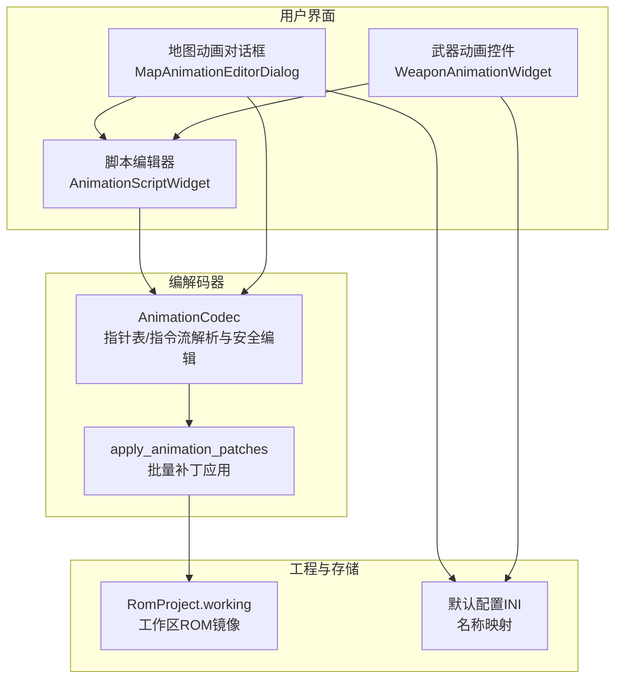
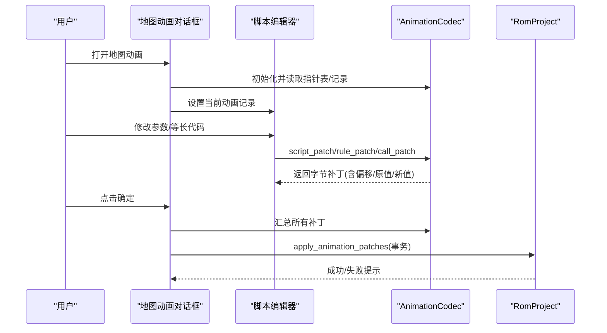
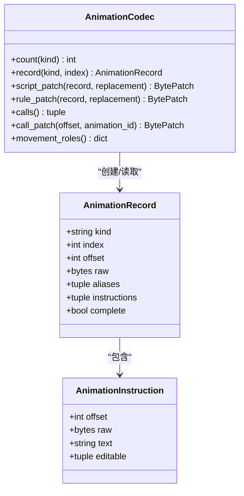
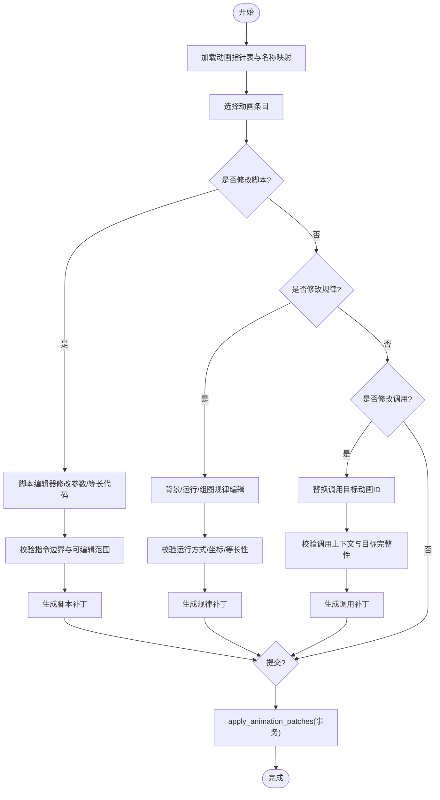
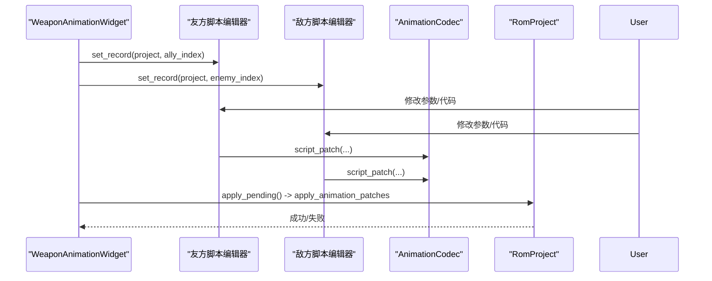
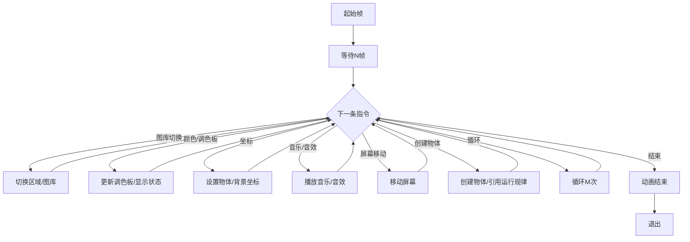
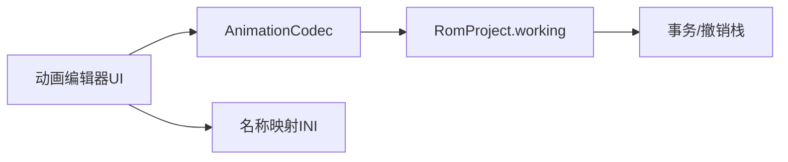

# 动画编辑器

<cite>
**本文引用的文件**
- [animation_editor.py](file://src/dc_modifier/animation_editor.py)
- [animation.py](file://src/fc_editor/codecs/animation.py)
- [test_animation_feedback.py](file://tests/test_animation_feedback.py)
- [地图动画名称.ini](file://src/resources/default_config/地图动画名称.ini)
- [地图动画图片名称.ini](file://src/resources/default_config/地图动画图片名称.ini)
- [地图动画运行规律名称.ini](file://src/resources/default_config/地图动画运行规律名称.ini)
- [fc_rom_editor_core.py](file://src/fc_rom_editor_core.py)
</cite>

## 目录
1. [简介](#简介)
2. [项目结构](#项目结构)
3. [核心组件](#核心组件)
4. [架构总览](#架构总览)
5. [详细组件分析](#详细组件分析)
6. [依赖关系分析](#依赖关系分析)
7. [性能与内存优化](#性能与内存优化)
8. [故障排查指南](#故障排查指南)
9. [结论](#结论)
10. [附录：完整工作流程](#附录完整工作流程)

## 简介
本文档面向FC游戏（DC工程）的动画编辑器，系统说明动画帧序列的组织方式、时间轴控制、播放逻辑，以及创建、编辑、预览与导出的使用方法。同时给出动画压缩与内存优化策略、性能调优建议，并提供从素材准备到最终集成的完整工作流，覆盖复杂场景处理技巧与常见问题解决方案。

## 项目结构
动画编辑器由“UI层”和“编解码层”两部分组成：
- UI层：提供可视化编辑界面，包括地图动画、武器动画、背景/运行/组图规律、动画调用等。
- 编解码层：负责解析ROM中的动画资源表、指令流、指针表，进行安全边界校验与只读参数修改，生成字节补丁并回写到工程工作区。

图表来源
- [animation_editor.py:214-483](file://src/dc_modifier/animation_editor.py#L214-L483)
- [animation.py:145-328](file://src/fc_editor/codecs/animation.py#L145-L328)
- [fc_rom_editor_core.py:463-785](file://src/fc_rom_editor_core.py#L463-L785)

章节来源
- [animation_editor.py:16-483](file://src/dc_modifier/animation_editor.py#L16-L483)
- [animation.py:1-328](file://src/fc_editor/codecs/animation.py#L1-L328)
- [fc_rom_editor_core.py:463-785](file://src/fc_rom_editor_core.py#L463-L785)

## 核心组件
- 动画指令与记录
  - 指令：包含偏移、原始字节、可读文本、可编辑参数范围。
  - 记录：描述某类动画（地图/友方/敌方/背景/运行/组图）的索引、偏移、原始字节、别名共享、指令列表、完整性标志。
- 动画编解码器
  - 校验解释器签名与资源描述符，读取各类型指针表，限制越界访问。
  - 解析脚本指令流，支持等待、图库切换、颜色/调色板、坐标、音乐/音效、屏幕移动、循环、结束等。
  - 提供安全的等长编辑能力：仅允许已验证的可编辑参数位被修改，禁止改变指令边界与控制流。
- UI编辑组件
  - 地图动画对话框：管理动画选择、规律编辑、动画调用；草稿模式暂存修改，确认时一次性写入。
  - 武器动画控件：同时编辑我方/敌方武器动画，统一提交。
  - 脚本编辑器：以十六进制代码视图展示指令，支持按指令行调整参数，实时反汇编显示。
- 工程集成
  - 通过 RomProject.transaction 事务机制，将多个补丁合并为一次撤销/重做步骤，保证一致性。

章节来源
- [animation.py:16-328](file://src/fc_editor/codecs/animation.py#L16-L328)
- [animation_editor.py:29-212](file://src/dc_modifier/animation_editor.py#L29-L212)
- [fc_rom_editor_core.py:714-785](file://src/fc_rom_editor_core.py#L714-L785)

## 架构总览
动画编辑器的数据流遵循“只读解析 + 受控编辑”的原则：
- 解析阶段：加载当前工程的工作镜像，校验解释器与指针表，构建指令流。
- 编辑阶段：在UI中修改可编辑参数或等长代码，生成字节补丁前进行严格合法性检查。
- 提交阶段：使用 apply_animation_patches 在事务中批量应用补丁，更新工程工作镜像。

图表来源
- [animation_editor.py:214-483](file://src/dc_modifier/animation_editor.py#L214-L483)
- [animation.py:199-328](file://src/fc_editor/codecs/animation.py#L199-L328)
- [fc_rom_editor_core.py:714-785](file://src/fc_rom_editor_core.py#L714-L785)

## 详细组件分析

### 动画指令与记录模型
- AnimationInstruction：封装单条指令的偏移、原始字节、人类可读文本、可编辑参数范围。
- AnimationRecord：封装某条动画记录的元信息，包括种类、索引、偏移、原始字节、别名共享、指令列表、完整性。
- 指令解析 decode_script：逐字节识别操作码，计算长度，标注可编辑位置，遇到未验证或截断立即停止并标记不完整。

图表来源
- [animation.py:16-57](file://src/fc_editor/codecs/animation.py#L16-L57)
- [animation.py:61-143](file://src/fc_editor/codecs/animation.py#L61-L143)
- [animation.py:145-328](file://src/fc_editor/codecs/animation.py#L145-L328)

章节来源
- [animation.py:16-143](file://src/fc_editor/codecs/animation.py#L16-L143)

### 地图动画编辑流程
- 选择动画：从指针表列出可用动画，显示名称映射（来自INI）。
- 编辑脚本：在脚本编辑器中查看指令列表与原始字节，支持切换到等长十六进制代码视图，按指令行调整参数。
- 规律编辑：背景/运行/组图三类规律，其中运行规律支持等长代码编辑，需确保运行方式唯一。
- 动画调用：扫描事件脚本中的调用点，提供下拉框替换目标动画编号，但仅在上下文已验证时可写。
- 提交写入：将所有标签页的草稿差异转换为补丁，在事务中一次性应用。

图表来源
- [animation_editor.py:214-483](file://src/dc_modifier/animation_editor.py#L214-L483)
- [animation.py:199-328](file://src/fc_editor/codecs/animation.py#L199-L328)

章节来源
- [animation_editor.py:214-483](file://src/dc_modifier/animation_editor.py#L214-L483)
- [animation.py:199-328](file://src/fc_editor/codecs/animation.py#L199-L328)

### 武器动画编辑
- 同时编辑我方与敌方武器动画，分别绑定到对应指针表。
- 支持等长代码修改与参数微调，提交时合并为单个事务。

图表来源
- [animation_editor.py:177-212](file://src/dc_modifier/animation_editor.py#L177-L212)
- [animation.py:199-328](file://src/fc_editor/codecs/animation.py#L199-L328)

章节来源
- [animation_editor.py:177-212](file://src/dc_modifier/animation_editor.py#L177-L212)

### 动画播放逻辑与时间轴控制
- 时间轴由“等待帧”指令驱动，每条等待指令指定若干帧时长，形成时间轴步进。
- 播放顺序由指令流顺序决定，遇到循环指令会重复执行指定次数。
- 关键控制指令包括：等待、图库切换、颜色/调色板更新、坐标设置、音乐/音效、屏幕移动、物体创建/删除/隐藏/显示、循环、结束。
- 运行规律分为“帧序列”和“坐标位移”两类，前者控制图集帧变化，后者控制X/Y位移与音效、循环次数。

图表来源
- [animation.py:61-143](file://src/fc_editor/codecs/animation.py#L61-L143)

章节来源
- [animation.py:61-143](file://src/fc_editor/codecs/animation.py#L61-L143)

## 依赖关系分析
- UI层依赖编解码器进行解析与校验，不直接读写ROM字节。
- 编解码器依赖工程工作镜像与默认配置INI进行名称映射与资源定位。
- 工程层提供事务与撤销/重做能力，确保多补丁原子提交。

图表来源
- [animation_editor.py:214-483](file://src/dc_modifier/animation_editor.py#L214-L483)
- [animation.py:145-328](file://src/fc_editor/codecs/animation.py#L145-L328)
- [fc_rom_editor_core.py:714-785](file://src/fc_rom_editor_core.py#L714-L785)

章节来源
- [animation_editor.py:214-483](file://src/dc_modifier/animation_editor.py#L214-L483)
- [animation.py:145-328](file://src/fc_editor/codecs/animation.py#L145-L328)
- [fc_rom_editor_core.py:714-785](file://src/fc_rom_editor_core.py#L714-L785)

## 性能与内存优化
- 等长编辑约束：仅允许修改已验证的参数位，避免指令边界变化带来的重新解析开销。
- 指令流完整性校验：遇到未验证指令即停止解码，减少无效解析路径。
- 指针表与解释器签名校验：防止越界与格式不一致导致的崩溃。
- 运行规律角色判定：对运行规律进行“帧序列/坐标位移”角色识别，限制可编辑范围，降低误改风险。
- 批量补丁与事务：将多次修改合并为一次事务提交，减少中间态与回滚成本。
- 名称映射缓存：INI文件按需读取，避免频繁IO。

[本节为通用指导，无需具体文件引用]

## 故障排查指南
- 动画数据已变化：当草稿与原值不一致时，提交会被拒绝，需重新载入后重试。
- 非法参数范围：超出允许范围的参数将被拒绝，需调整至合法区间。
- 指令边界变更：不允许改变指令边界或控制流，否则编辑失败。
- 运行规律非唯一：若运行方式未唯一确认，则保持只读，避免误改。
- 调用上下文未验证：仅识别到调用字节但上下文未验证时，不可改写。
- 解释器/指针表损坏：校验失败将阻止进一步操作，需恢复ROM或修正相关数据。

章节来源
- [animation.py:199-328](file://src/fc_editor/codecs/animation.py#L199-L328)
- [animation_editor.py:279-483](file://src/dc_modifier/animation_editor.py#L279-L483)
- [test_animation_feedback.py:80-128](file://tests/test_animation_feedback.py#L80-L128)

## 结论
该动画编辑器通过严格的边界校验与等长编辑策略，在保证ROM安全性的前提下提供了直观的动画编辑能力。结合事务化提交与完善的错误提示，能够有效支撑从简单到复杂的动画制作需求。配合合理的压缩与内存优化策略，可在FC平台有限的资源下实现流畅的动画播放体验。

[本节为总结，无需具体文件引用]

## 附录：完整工作流程
- 素材准备
  - 准备图集资源与命名清单，确保名称映射INI与实际资源一致。
  - 规划动画指令序列，明确等待帧、图库切换、坐标与音效时机。
- 创建动画
  - 在地图动画对话框中选择空条目或已有条目，编写指令序列。
  - 使用运行规律定义帧序列或坐标位移，确保角色唯一。
- 编辑与预览
  - 在脚本编辑器中调整参数，观察指令列表与原始字节变化。
  - 通过动画调用页快速跳转到目标动画进行预览。
- 导出与集成
  - 点击确定，将草稿差异转换为补丁并在事务中提交。
  - 保存工程，后续可重新加载并继续编辑。
- 复杂场景处理技巧
  - 共享指针复用：多个动画共享同一段指令流，减少冗余。
  - 循环与条件：合理使用循环指令控制重复动作，避免过多分支。
  - 坐标与图层：注意物体坐标与背景参数的优先级与可见性。
- 常见问题解决方案
  - 无法编辑：检查是否为未验证指令或控制流字节。
  - 提交失败：核对原值是否变化，重新载入后再试。
  - 播放异常：确认等待帧与指令顺序是否符合预期。

章节来源
- [animation_editor.py:214-483](file://src/dc_modifier/animation_editor.py#L214-L483)
- [animation.py:199-328](file://src/fc_editor/codecs/animation.py#L199-L328)
- [地图动画名称.ini:1-257](file://src/resources/default_config/地图动画名称.ini#L1-L257)
- [地图动画图片名称.ini:1-257](file://src/resources/default_config/地图动画图片名称.ini#L1-L257)
- [地图动画运行规律名称.ini:1-257](file://src/resources/default_config/地图动画运行规律名称.ini#L1-L257)
- [test_animation_feedback.py:27-128](file://tests/test_animation_feedback.py#L27-L128)