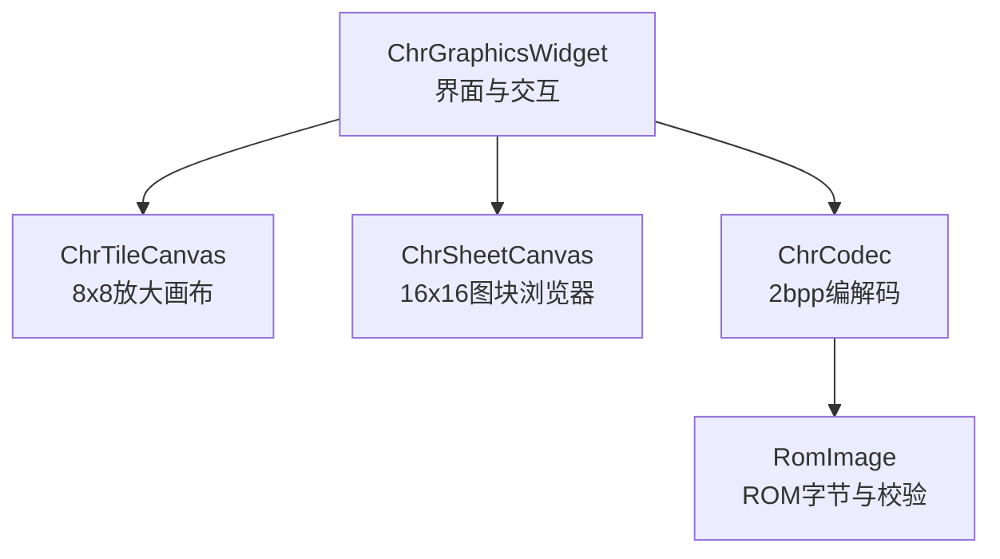
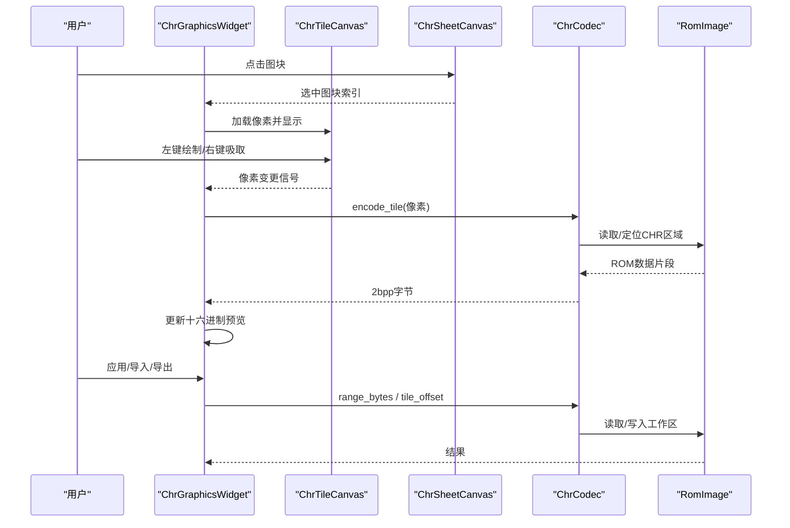
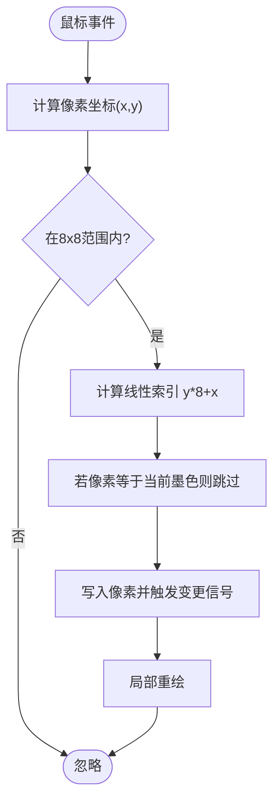
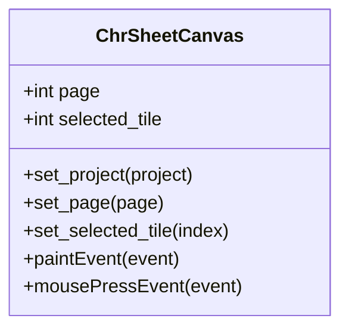
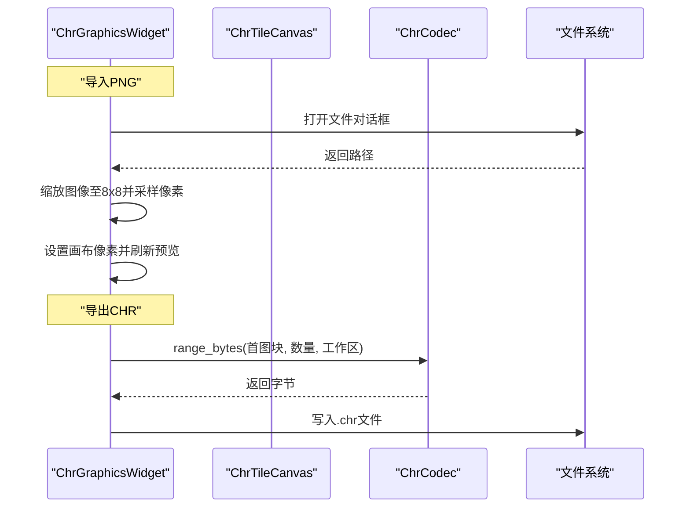
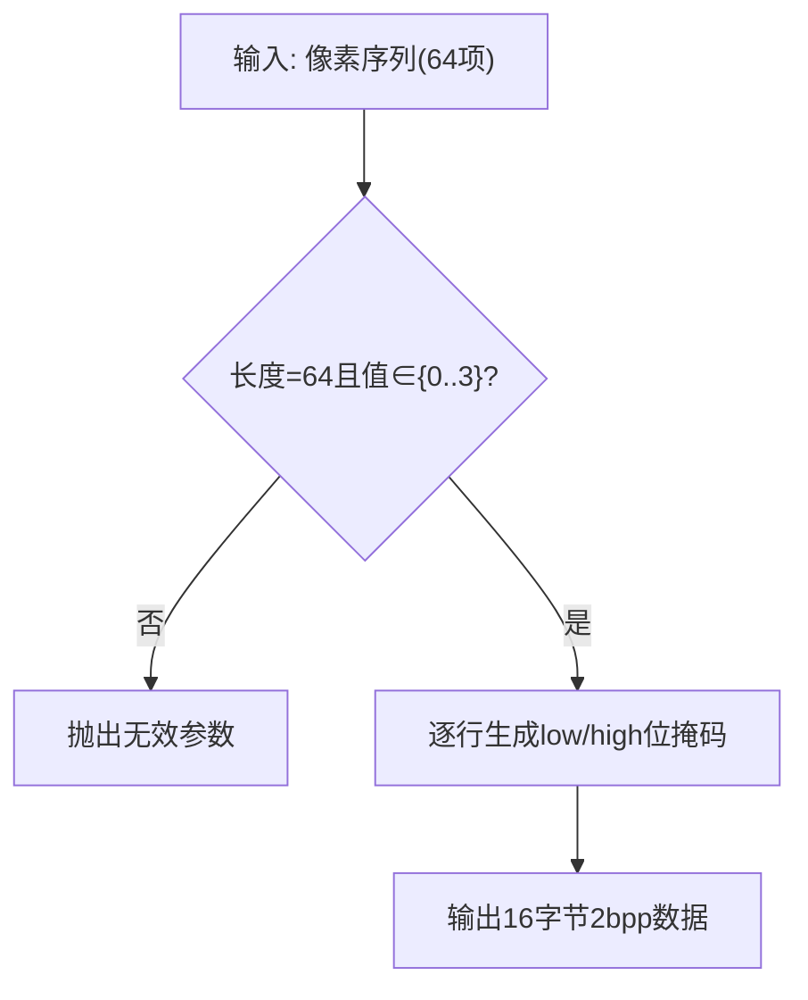
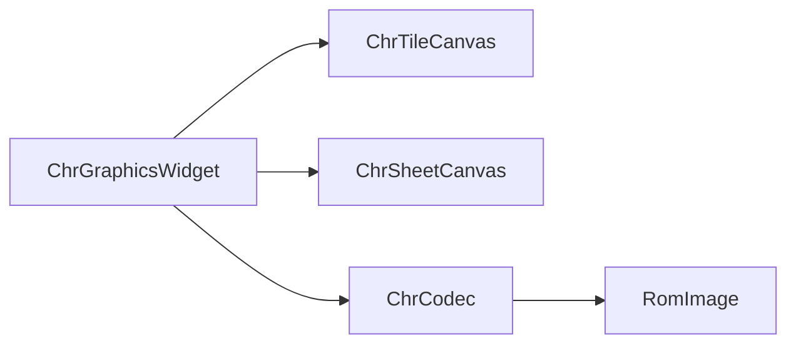

# CHR图块编辑器

<cite>
**本文引用的文件**
- [src/dc_modifier/chr_widget.py](file://src/dc_modifier/chr_widget.py)
- [src/fc_editor/codecs/chr.py](file://src/fc_editor/codecs/chr.py)
- [tests/test_chr_widget_drafts.py](file://tests/test_chr_widget_drafts.py)
- [src/fc_editor/rom_image.py](file://src/fc_editor/rom_image.py)
</cite>

## 目录
1. [简介](#简介)
2. [项目结构](#项目结构)
3. [核心组件](#核心组件)
4. [架构总览](#架构总览)
5. [详细组件分析](#详细组件分析)
6. [依赖关系分析](#依赖关系分析)
7. [性能与内存优化](#性能与内存优化)
8. [故障排查指南](#故障排查指南)
9. [结论](#结论)
10. [附录：工作流与最佳实践](#附录工作流与最佳实践)

## 简介
本章节介绍CHR图块编辑器的目标、能力边界与使用场景。该编辑器面向FC（NES）项目的CHR-ROM资源，提供对8×8像素、2bpp格式图块的可视化编辑、导入导出与批量处理能力；同时提供图块浏览器、放大画布、十六进制预览等交互组件，帮助开发者高效完成图块创建、修改与验证。

## 项目结构
围绕CHR图块编辑的核心代码分布在以下位置：
- 界面与交互逻辑：src/dc_modifier/chr_widget.py
- 数据编解码器：src/fc_editor/codecs/chr.py
- ROM镜像访问：src/fc_editor/rom_image.py
- 行为测试与用例：tests/test_chr_widget_drafts.py

图表来源
- [src/dc_modifier/chr_widget.py:162-273](file://src/dc_modifier/chr_widget.py#L162-L273)
- [src/dc_modifier/chr_widget.py:33-90](file://src/dc_modifier/chr_widget.py#L33-L90)
- [src/dc_modifier/chr_widget.py:92-160](file://src/dc_modifier/chr_widget.py#L92-L160)
- [src/fc_editor/codecs/chr.py:11-94](file://src/fc_editor/codecs/chr.py#L11-L94)
- [src/fc_editor/rom_image.py:50-125](file://src/fc_editor/rom_image.py#L50-L125)

章节来源
- [src/dc_modifier/chr_widget.py:162-273](file://src/dc_modifier/chr_widget.py#L162-L273)
- [src/fc_editor/codecs/chr.py:11-94](file://src/fc_editor/codecs/chr.py#L11-L94)
- [src/fc_editor/rom_image.py:50-125](file://src/fc_editor/rom_image.py#L50-L125)

## 核心组件
- ChrTileCanvas：8×8像素的放大编辑画布，支持左键绘制、右键吸取颜色，实时渲染并触发像素变更信号。
- ChrSheetCanvas：16×16网格的图块浏览器，用于快速定位并选择待编辑的图块。
- ChrGraphicsWidget：页面级容器，整合浏览器、画布、十六进制预览、PNG/CHR导入导出、批量范围操作以及“应用/还原”等控制。
- ChrCodec：负责将8×8像素索引序列与2bpp原始字节进行无损编解码，并提供按图块偏移、范围读取等能力。
- RomImage：封装iNES ROM的加载、校验与只读访问，确保CHR区域可安全定位。

章节来源
- [src/dc_modifier/chr_widget.py:33-90](file://src/dc_modifier/chr_widget.py#L33-L90)
- [src/dc_modifier/chr_widget.py:92-160](file://src/dc_modifier/chr_widget.py#L92-L160)
- [src/dc_modifier/chr_widget.py:162-273](file://src/dc_modifier/chr_widget.py#L162-L273)
- [src/fc_editor/codecs/chr.py:11-94](file://src/fc_editor/codecs/chr.py#L11-L94)
- [src/fc_editor/rom_image.py:50-125](file://src/fc_editor/rom_image.py#L50-L125)

## 架构总览
下图展示了从用户操作到数据落盘的完整调用链：用户在画布或浏览器中编辑图块，界面层通过编码器将像素转换为2bpp字节，最终写入工作区或导出为外部文件。

图表来源
- [src/dc_modifier/chr_widget.py:162-273](file://src/dc_modifier/chr_widget.py#L162-L273)
- [src/dc_modifier/chr_widget.py:33-90](file://src/dc_modifier/chr_widget.py#L33-L90)
- [src/dc_modifier/chr_widget.py:92-160](file://src/dc_modifier/chr_widget.py#L92-L160)
- [src/fc_editor/codecs/chr.py:11-94](file://src/fc_editor/codecs/chr.py#L11-L94)
- [src/fc_editor/rom_image.py:50-125](file://src/fc_editor/rom_image.py#L50-L125)

## 详细组件分析

### 8×8像素图块编辑画布（ChrTileCanvas）
- 功能要点
  - 以固定8×8网格渲染每个像素，单元格大小可配置。
  - 左键绘制当前墨色，右键吸取目标像素作为新墨色。
  - 每次像素变化发出信号，驱动十六进制预览刷新。
- 数据结构与复杂度
  - 像素数组长度为64，时间复杂度O(1)的单点写入，重绘局部矩形。
- 错误处理
  - 越界坐标不执行绘制；仅当像素值改变时才触发更新。

图表来源
- [src/dc_modifier/chr_widget.py:33-90](file://src/dc_modifier/chr_widget.py#L33-L90)

章节来源
- [src/dc_modifier/chr_widget.py:33-90](file://src/dc_modifier/chr_widget.py#L33-L90)

### 图块浏览器（ChrSheetCanvas）
- 功能要点
  - 以16×16网格展示一页256个图块，支持页码切换与选中高亮。
  - 单击图块后发射选中信号，供上层加载对应图块。
- 性能考虑
  - 每图块按8×8小格渲染，像素尺寸根据单元格大小动态缩放，减少绘制开销。

图表来源
- [src/dc_modifier/chr_widget.py:92-160](file://src/dc_modifier/chr_widget.py#L92-L160)

章节来源
- [src/dc_modifier/chr_widget.py:92-160](file://src/dc_modifier/chr_widget.py#L92-L160)

### 页面容器与交互（ChrGraphicsWidget）
- 功能要点
  - 集成浏览器、画布、十六进制预览、单个图块工具（应用/还原）、PNG与CHR导入导出、批量范围操作。
  - 维护“草稿”机制：在未提交前保留可见修改，并在切换图块或关闭时尝试提交有效草稿。
  - 提供“位置”信息，显示当前图块所在Bank与文件偏移。
- 关键流程
  - 导入PNG：缩放到8×8，提取颜色集合；若颜色数≤4则建立映射，否则按明度映射到0–3索引。
  - 导出PNG：将当前像素映射回调色板颜色并保存。
  - 导入/导出CHR：基于范围首图块与数量，读取或写入连续原生CHR数据（每图块16字节）。
  - 批量导出：合并当前有效草稿到范围字节后再写出。

图表来源
- [src/dc_modifier/chr_widget.py:162-273](file://src/dc_modifier/chr_widget.py#L162-L273)
- [src/dc_modifier/chr_widget.py:459-548](file://src/dc_modifier/chr_widget.py#L459-L548)
- [src/dc_modifier/chr_widget.py:549-630](file://src/dc_modifier/chr_widget.py#L549-L630)
- [src/fc_editor/codecs/chr.py:80-94](file://src/fc_editor/codecs/chr.py#L80-L94)

章节来源
- [src/dc_modifier/chr_widget.py:162-273](file://src/dc_modifier/chr_widget.py#L162-L273)
- [src/dc_modifier/chr_widget.py:459-548](file://src/dc_modifier/chr_widget.py#L459-L548)
- [src/dc_modifier/chr_widget.py:549-630](file://src/dc_modifier/chr_widget.py#L549-L630)

### 2bpp编解码器（ChrCodec）
- 功能要点
  - 解析iNES头，定位CHR-ROM起始偏移与大小，校验完整性。
  - decode_tile：将16字节两行低/高位掩码展开为8×8像素索引序列（0–3）。
  - encode_tile：将8×8像素索引压缩为16字节2bpp数据。
  - range_bytes：按图块范围读取连续CHR数据，便于批量导入导出。
- 复杂度
  - 单图块编解码时间复杂度O(64)，空间复杂度O(16)。

图表来源
- [src/fc_editor/codecs/chr.py:42-78](file://src/fc_editor/codecs/chr.py#L42-L78)

章节来源
- [src/fc_editor/codecs/chr.py:11-94](file://src/fc_editor/codecs/chr.py#L11-L94)

### ROM镜像访问（RomImage）
- 功能要点
  - 加载并校验iNES格式，检查Mapper与实际ROM布局一致性。
  - 提供只读读取接口，确保CHR区域访问安全。
- 错误处理
  - 非iNES头、长度不符、Mapper不一致均会抛出格式化错误。

章节来源
- [src/fc_editor/rom_image.py:50-125](file://src/fc_editor/rom_image.py#L50-L125)

## 依赖关系分析
- 界面层（ChrGraphicsWidget）依赖：
  - 画布（ChrTileCanvas）与浏览器（ChrSheetCanvas）实现交互。
  - 编码器（ChrCodec）完成像素与字节转换。
  - ROM镜像（RomImage）提供底层数据源。
- 编码器依赖：
  - RomImage用于定位与读取CHR区域。
- 测试覆盖：
  - 针对草稿提交、范围导入导出、异常路径等进行断言。

图表来源
- [src/dc_modifier/chr_widget.py:162-273](file://src/dc_modifier/chr_widget.py#L162-L273)
- [src/fc_editor/codecs/chr.py:11-94](file://src/fc_editor/codecs/chr.py#L11-L94)
- [src/fc_editor/rom_image.py:50-125](file://src/fc_editor/rom_image.py#L50-L125)

章节来源
- [src/dc_modifier/chr_widget.py:162-273](file://src/dc_modifier/chr_widget.py#L162-L273)
- [src/fc_editor/codecs/chr.py:11-94](file://src/fc_editor/codecs/chr.py#L11-L94)
- [src/fc_editor/rom_image.py:50-125](file://src/fc_editor/rom_image.py#L50-L125)

## 性能与内存优化
- 渲染优化
  - 画布采用局部重绘，仅在像素变化时更新受影响单元格，避免整屏刷新。
  - 浏览器以较小像素尺寸渲染256图块，降低绘制成本。
- 编解码优化
  - 单图块编解码为常数时间与常数空间，适合高频交互。
  - 范围读写一次性获取连续字节，减少多次I/O。
- 内存与缓存
  - 通过工作区缓冲与只读ROM分离，避免直接修改原始ROM。
  - 草稿机制在内存中暂存未提交修改，减少不必要的持久化写入。
- 建议
  - 批量操作时合理设置范围大小，避免过大导致UI卡顿。
  - PNG导入时优先准备4色以内素材，可减少量化步骤。

[本节为通用性能建议，不直接分析具体文件]

## 故障排查指南
- 常见错误与定位
  - 非法像素值：编码器会拒绝非0–3的值，需检查导入PNG的颜色映射或手动编辑。
  - 图块范围越界：批量导入/导出时需确认首图块与数量不超过CHR-ROM上限。
  - 文件格式错误：非iNES头、长度不符或Mapper不一致将阻止加载。
- 调试手段
  - 查看十六进制预览，核对2bpp字节是否符合预期。
  - 使用测试用例思路复现问题：构造有效/无效草稿，验证提交与撤销行为。
- 恢复策略
  - 利用“还原图块”恢复原状。
  - 批量导入前会提示确认，必要时先备份工作区。

章节来源
- [tests/test_chr_widget_drafts.py:48-81](file://tests/test_chr_widget_drafts.py#L48-L81)
- [tests/test_chr_widget_drafts.py:240-358](file://tests/test_chr_widget_drafts.py#L240-L358)
- [src/fc_editor/codecs/chr.py:11-32](file://src/fc_editor/codecs/chr.py#L11-L32)
- [src/fc_editor/rom_image.py:79-105](file://src/fc_editor/rom_image.py#L79-L105)

## 结论
CHR图块编辑器以清晰的界面与稳健的编解码器为核心，提供了从像素编辑到文件导入导出的完整工作流。通过草稿机制、范围操作与严格的ROM校验，既保证了编辑效率，也降低了误操作风险。结合最佳实践与性能优化建议，可在大型项目中稳定高效地管理CHR资源。

## 附录：工作流与最佳实践
- 典型编辑流程
  - 打开项目并载入ROM。
  - 在图块浏览器中选择目标图块，或在画布上直接绘制。
  - 通过十六进制预览验证2bpp字节。
  - 需要时导入PNG或批量导入/导出CHR。
  - 应用更改并保存项目。
- 最佳实践
  - 导入PNG前尽量准备4色以内的素材，以获得更精确的索引映射。
  - 批量操作前先确认范围与数量，避免越界。
  - 频繁使用“还原图块”与撤销功能，保持工作区整洁。
  - 导出时选择合适的文件名与路径，便于后续版本管理。

[本节为概念性指导，不直接分析具体文件]