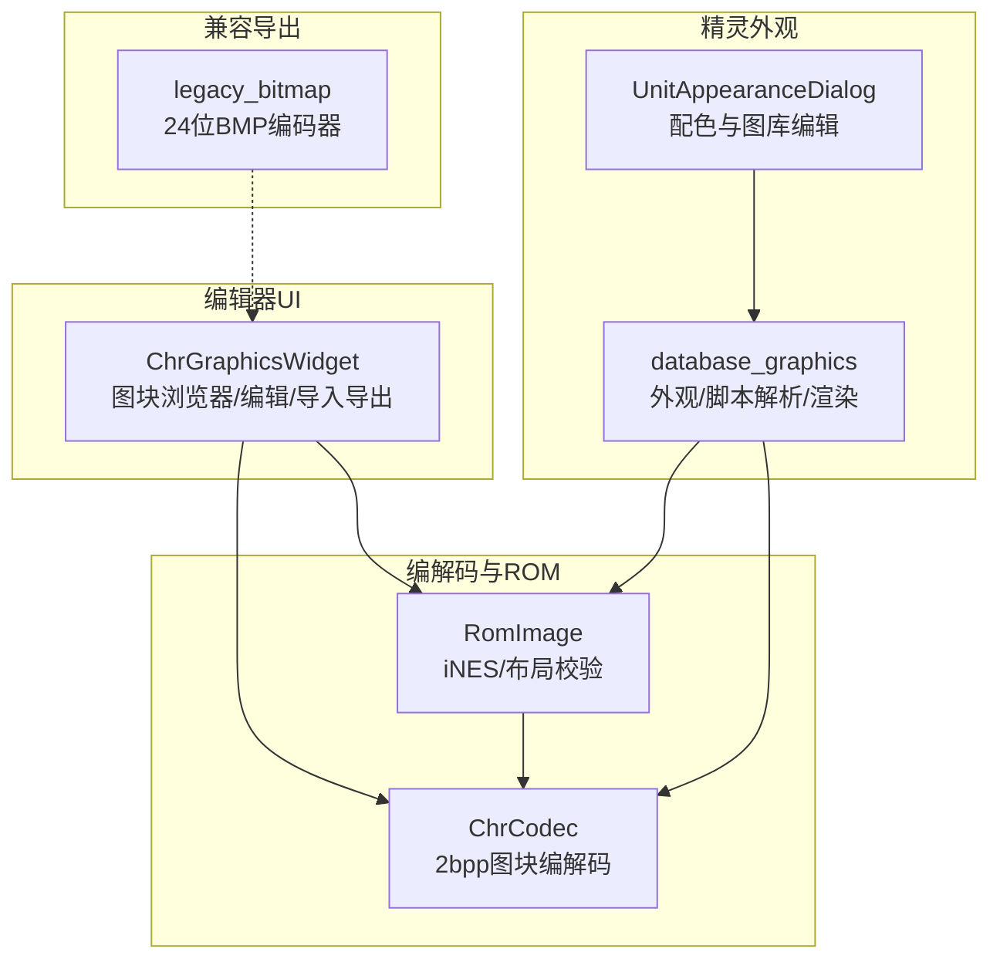
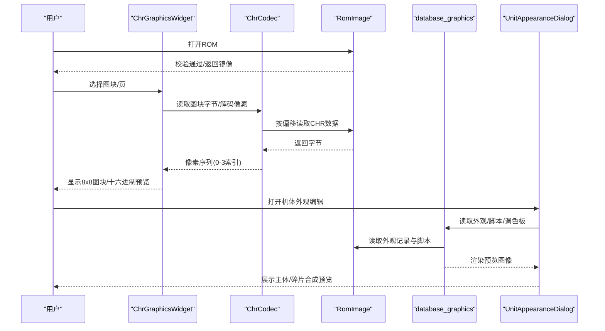
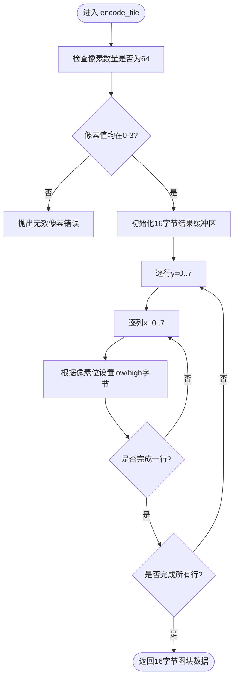
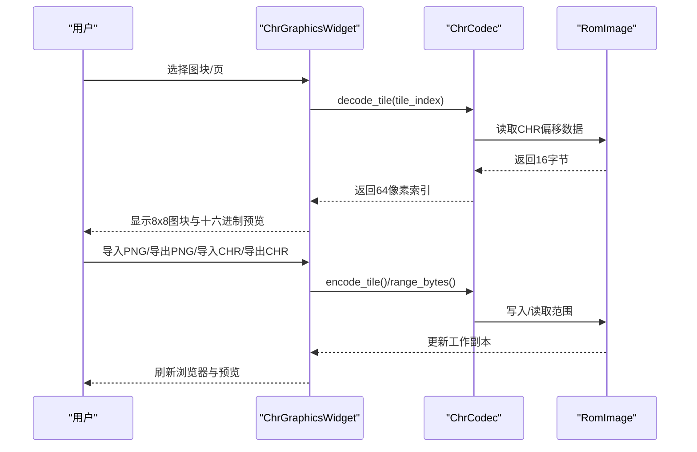
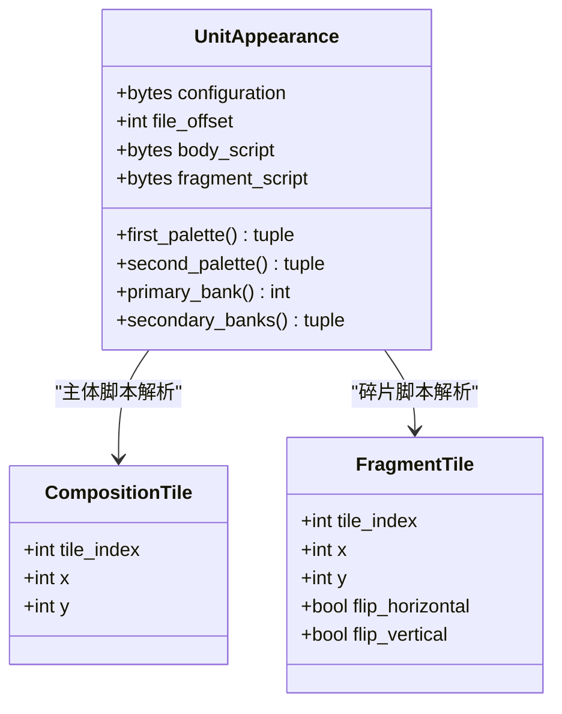
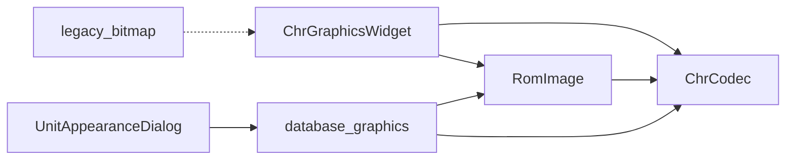

# 图像资源管理

<cite>
**本文引用的文件**
- [src/fc_editor/codecs/chr.py](file://src/fc_editor/codecs/chr.py)
- [src/dc_modifier/chr_widget.py](file://src/dc_modifier/chr_widget.py)
- [src/dc_modifier/database_graphics.py](file://src/dc_modifier/database_graphics.py)
- [src/dc_modifier/unit_appearance_dialog.py](file://src/dc_modifier/unit_appearance_dialog.py)
- [src/fc_editor/rom_image.py](file://src/fc_editor/rom_image.py)
- [src/fc_editor/legacy_bitmap.py](file://src/fc_editor/legacy_bitmap.py)
</cite>

## 目录
1. [简介](#简介)
2. [项目结构](#项目结构)
3. [核心组件](#核心组件)
4. [架构总览](#架构总览)
5. [详细组件分析](#详细组件分析)
6. [依赖关系分析](#依赖关系分析)
7. [性能与内存布局优化](#性能与内存布局优化)
8. [故障排查指南](#故障排查指南)
9. [结论](#结论)
10. [附录：工作流与扩展](#附录工作流与扩展)

## 简介
本文件面向FC（NES）项目的图像资源管理与编辑，重点覆盖CHR图块编辑、精灵（碎片）管理、调色板机制、图块格式规范、导入导出流程、批量处理与自定义格式扩展。内容基于仓库中已实现的代码模块，提供从底层数据编码到UI交互的完整说明，帮助读者理解并高效使用现有工具链进行图形资源制作与集成。

## 项目结构
围绕图像资源管理的核心代码分布在以下位置：
- 编解码层：负责将ROM中的CHR数据与像素图块相互转换，保证无损读写。
- 编辑器UI层：提供图块浏览、单图块绘制、PNG与原生CHR的导入导出、批量操作等。
- 精灵外观层：解析机体外观配置、主体拼图脚本与碎片精灵脚本，渲染战斗预览。
- ROM抽象层：统一读取iNES头、校验布局、定位PRG/CHR区域。
- 兼容导出：为旧版工具链生成确定性BMP输出。

**图表来源**
- [src/fc_editor/codecs/chr.py:11-94](file://src/fc_editor/codecs/chr.py#L11-L94)
- [src/fc_editor/rom_image.py:50-125](file://src/fc_editor/rom_image.py#L50-L125)
- [src/dc_modifier/chr_widget.py:162-630](file://src/dc_modifier/chr_widget.py#L162-L630)
- [src/dc_modifier/database_graphics.py:249-438](file://src/dc_modifier/database_graphics.py#L249-L438)
- [src/dc_modifier/unit_appearance_dialog.py:22-250](file://src/dc_modifier/unit_appearance_dialog.py#L22-L250)
- [src/fc_editor/legacy_bitmap.py:45-122](file://src/fc_editor/legacy_bitmap.py#L45-L122)

**章节来源**
- [src/fc_editor/codecs/chr.py:11-94](file://src/fc_editor/codecs/chr.py#L11-L94)
- [src/fc_editor/rom_image.py:50-125](file://src/fc_editor/rom_image.py#L50-L125)
- [src/dc_modifier/chr_widget.py:162-630](file://src/dc_modifier/chr_widget.py#L162-L630)
- [src/dc_modifier/database_graphics.py:249-438](file://src/dc_modifier/database_graphics.py#L249-L438)
- [src/dc_modifier/unit_appearance_dialog.py:22-250](file://src/dc_modifier/unit_appearance_dialog.py#L22-L250)
- [src/fc_editor/legacy_bitmap.py:45-122](file://src/fc_editor/legacy_bitmap.py#L45-L122)

## 核心组件
- ChrCodec：实现iNES CHR-ROM的2bpp图块无损编解码，提供按图块索引访问、范围读取、字节级写入能力。
- RomImage：封装ROM二进制、校验iNES头、Mapper匹配、安全读取与Bank地址映射。
- ChrGraphicsWidget：提供图块浏览器、8×8放大编辑、PNG导入导出、原生CHR批量导入导出、草稿提交与撤销基线保护。
- database_graphics：解析机体外观配置、主体拼图脚本与碎片精灵脚本；渲染原始图库与战斗合成预览；提供调色板颜色查询。
- UnitAppearanceDialog：以对话框形式编辑机体的配色与图库引用，实时预览主体与碎片组合效果。
- legacy_bitmap：为旧版工具链生成确定性24位BMP，便于素材交换与验证。

**章节来源**
- [src/fc_editor/codecs/chr.py:11-94](file://src/fc_editor/codecs/chr.py#L11-L94)
- [src/fc_editor/rom_image.py:50-125](file://src/fc_editor/rom_image.py#L50-L125)
- [src/dc_modifier/chr_widget.py:162-630](file://src/dc_modifier/chr_widget.py#L162-L630)
- [src/dc_modifier/database_graphics.py:249-438](file://src/dc_modifier/database_graphics.py#L249-L438)
- [src/dc_modifier/unit_appearance_dialog.py:22-250](file://src/dc_modifier/unit_appearance_dialog.py#L22-L250)
- [src/fc_editor/legacy_bitmap.py:45-122](file://src/fc_editor/legacy_bitmap.py#L45-L122)

## 架构总览
下图展示了从ROM加载到图块编辑、再到精灵外观预览的整体数据流与控制流。

**图表来源**
- [src/fc_editor/rom_image.py:50-125](file://src/fc_editor/rom_image.py#L50-L125)
- [src/fc_editor/codecs/chr.py:11-94](file://src/fc_editor/codecs/chr.py#L11-L94)
- [src/dc_modifier/chr_widget.py:162-630](file://src/dc_modifier/chr_widget.py#L162-L630)
- [src/dc_modifier/database_graphics.py:249-438](file://src/dc_modifier/database_graphics.py#L249-L438)
- [src/dc_modifier/unit_appearance_dialog.py:22-250](file://src/dc_modifier/unit_appearance_dialog.py#L22-L250)

## 详细组件分析

### CHR图块编解码与ROM定位
- 图块格式：每个图块固定16字节，对应8×8像素的2bpp数据；每行由两字节组成低/高位平面，像素索引取值0-3。
- 编解码：提供像素到字节的无损编码与反向解码，支持单图块与连续范围读取。
- ROM定位：依据iNES头计算trainer大小与PRG/CHR边界，确保CHR区域可安全定位且大小为16字节整数倍。

**图表来源**
- [src/fc_editor/codecs/chr.py:42-78](file://src/fc_editor/codecs/chr.py#L42-L78)

**章节来源**
- [src/fc_editor/codecs/chr.py:11-94](file://src/fc_editor/codecs/chr.py#L11-L94)
- [src/fc_editor/rom_image.py:50-125](file://src/fc_editor/rom_image.py#L50-L125)

### 图块编辑器与导入导出
- 图块浏览器：以16×16网格显示当前页的256个图块缩略图，点击选中后在右侧放大编辑。
- 单图块编辑：支持左键绘制、右键吸取颜色，实时十六进制预览，支持应用/还原。
- PNG导入导出：导入时自动将最多4色或按明度映射到0-3索引；导出时将像素索引映射回显示颜色并保存PNG。
- 批量CHR导入导出：从当前图块开始读取/写入连续原生CHR数据，长度必须为16字节倍数，支持草稿保护与撤销基线。

**图表来源**
- [src/dc_modifier/chr_widget.py:162-630](file://src/dc_modifier/chr_widget.py#L162-L630)
- [src/fc_editor/codecs/chr.py:11-94](file://src/fc_editor/codecs/chr.py#L11-L94)

**章节来源**
- [src/dc_modifier/chr_widget.py:162-630](file://src/dc_modifier/chr_widget.py#L162-L630)

### 精灵外观与战斗预览
- 外观配置：包含机体与碎片的调色板索引、主/次图库页号；支持小型机（1个主体图库）与大型机（2个主体图库）。
- 主体拼图脚本：命令集包括移动光标、设置行宽、连续图块展开与字面量放置；最终输出8×8图块网格。
- 碎片精灵脚本：首三字节为起始坐标与首个图块，后续指令描述位置增量、翻转与图块切换；支持多种参数长度指令族。
- 渲染预览：将主体与碎片按游戏坐标系叠加至128×128视口，使用FCEUX调色板映射显示颜色。

**图表来源**
- [src/dc_modifier/database_graphics.py:29-72](file://src/dc_modifier/database_graphics.py#L29-L72)
- [src/dc_modifier/database_graphics.py:78-247](file://src/dc_modifier/database_graphics.py#L78-L247)

**章节来源**
- [src/dc_modifier/database_graphics.py:249-438](file://src/dc_modifier/database_graphics.py#L249-L438)
- [src/dc_modifier/unit_appearance_dialog.py:22-250](file://src/dc_modifier/unit_appearance_dialog.py#L22-L250)

### 调色板机制与显示颜色
- 显示调色板：使用FCEUX内置调色板作为确定性的RGB映射，避免直接修改ROM调色板字节。
- 图块颜色：图块仅存储0-3索引，渲染时通过调色板索引获取RGB；背景默认使用索引0x0F。
- 预览一致性：所有预览均基于同一调色板，确保不同页面与窗口显示一致。

**章节来源**
- [src/dc_modifier/database_graphics.py:16-26](file://src/dc_modifier/database_graphics.py#L16-L26)
- [src/dc_modifier/database_graphics.py:284-321](file://src/dc_modifier/database_graphics.py#L284-L321)

### 兼容导出（BMP）
- 目标：为旧版工具链生成确定性24位BMP，采用BITMAPINFOHEADER、正高度、BGR像素顺序与四字节行填充。
- 输入：顶到底的RGB像素序列；输出：符合旧版期望的文件结构。
- 用途：素材交换、历史工具兼容性验证。

**章节来源**
- [src/fc_editor/legacy_bitmap.py:45-122](file://src/fc_editor/legacy_bitmap.py#L45-L122)

## 依赖关系分析
- ChrCodec依赖RomImage进行安全的ROM数据读取与偏移计算。
- ChrGraphicsWidget依赖ChrCodec进行图块编解码，并通过Project工作副本进行批量读写。
- database_graphics依赖RomImage与ChrCodec读取外观记录、脚本与图块，渲染预览。
- UnitAppearanceDialog依赖database_graphics进行外观读取与预览，并在确认时执行事务性写入。
- legacy_bitmap独立于上述模块，用于兼容导出。

**图表来源**
- [src/fc_editor/rom_image.py:50-125](file://src/fc_editor/rom_image.py#L50-L125)
- [src/fc_editor/codecs/chr.py:11-94](file://src/fc_editor/codecs/chr.py#L11-L94)
- [src/dc_modifier/chr_widget.py:162-630](file://src/dc_modifier/chr_widget.py#L162-L630)
- [src/dc_modifier/database_graphics.py:249-438](file://src/dc_modifier/database_graphics.py#L249-L438)
- [src/dc_modifier/unit_appearance_dialog.py:22-250](file://src/dc_modifier/unit_appearance_dialog.py#L22-L250)
- [src/fc_editor/legacy_bitmap.py:45-122](file://src/fc_editor/legacy_bitmap.py#L45-L122)

**章节来源**
- [src/fc_editor/rom_image.py:50-125](file://src/fc_editor/rom_image.py#L50-L125)
- [src/fc_editor/codecs/chr.py:11-94](file://src/fc_editor/codecs/chr.py#L11-L94)
- [src/dc_modifier/chr_widget.py:162-630](file://src/dc_modifier/chr_widget.py#L162-L630)
- [src/dc_modifier/database_graphics.py:249-438](file://src/dc_modifier/database_graphics.py#L249-L438)
- [src/dc_modifier/unit_appearance_dialog.py:22-250](file://src/dc_modifier/unit_appearance_dialog.py#L22-L250)
- [src/fc_editor/legacy_bitmap.py:45-122](file://src/fc_editor/legacy_bitmap.py#L45-L122)

## 性能与内存布局优化
- 图块压缩：2bpp格式将8×8像素压缩为16字节，空间效率较高；编解码过程为线性时间复杂度O(N)，N为像素数。
- 批量操作：通过range_bytes一次性读取/写入连续图块，减少多次I/O开销；导入/导出前进行草稿保护，避免中间状态污染。
- 预览渲染：使用QImage按行填充像素，结合调色板映射，避免频繁颜色查找；网格辅助线仅在预览时绘制。
- 内存布局：依据iNES头与Mapper信息定位CHR区域，确保图块索引与文件偏移一一对应，避免越界与跨Bank误写。

[本节为通用性能讨论，不直接分析具体文件]

## 故障排查指南
- ROM格式错误：当iNES头不完整、声明大小与实际不符或Mapper不匹配时，会抛出ROM格式错误；需检查ROM来源与完整性。
- CHR范围错误：图块索引超出有效CHR-ROM范围或范围长度非法时会报错；请确认当前图块起点与数量。
- 图块数据不完整：读取到的图块不足16字节会触发错误；检查ROM布局与偏移计算。
- 像素值非法：导入PNG时若像素索引不在0-3范围内，或PNG无法解码，会提示错误；调整素材颜色数量或透明度。
- 外观记录校验失败：外观记录与已验证格式不一致时停止资源预览；需确保ROM版本与预期一致。
- 脚本解析错误：主体/碎片脚本缺少结束码、参数不完整或包含未验证指令时会报错；检查脚本内容与长度。

**章节来源**
- [src/fc_editor/rom_image.py:79-105](file://src/fc_editor/rom_image.py#L79-L105)
- [src/fc_editor/codecs/chr.py:25-40](file://src/fc_editor/codecs/chr.py#L25-L40)
- [src/dc_modifier/chr_widget.py:459-521](file://src/dc_modifier/chr_widget.py#L459-L521)
- [src/dc_modifier/database_graphics.py:78-157](file://src/dc_modifier/database_graphics.py#L78-L157)
- [src/dc_modifier/database_graphics.py:159-247](file://src/dc_modifier/database_graphics.py#L159-L247)

## 结论
本项目实现了完整的FC图块与精灵资源管理链路：从ROM层面的CHR编解码、到UI层的图块编辑与导入导出、再到精灵外观的配置与预览。通过严格的格式校验、批量操作与草稿保护机制，保证了编辑的安全性与效率。配合确定的调色板映射与兼容BMP导出，能够无缝对接新旧工具链，满足从素材准备到最终集成的全流程需求。

[本节为总结性内容，不直接分析具体文件]

## 附录：工作流与扩展

### 图像处理工作流程（从素材到集成）
- 素材准备：准备8×8 PNG素材，控制颜色数量不超过4种；透明像素将映射为背景索引。
- 导入图块：在“导入PNG”中将素材转换为2bpp图块，查看十六进制预览确认编码正确。
- 批量导入：如需批量替换，选择起点图块与数量，导入原生CHR文件；系统将自动校验长度与范围。
- 外观配置：在“机体拼图与配色”中调整调色板索引与图库页号，实时预览主体与碎片合成效果。
- 导出与集成：导出PNG用于审阅或存档；导出CHR用于外部工具或备份；确认无误后提交更改。

**章节来源**
- [src/dc_modifier/chr_widget.py:511-630](file://src/dc_modifier/chr_widget.py#L511-L630)
- [src/dc_modifier/unit_appearance_dialog.py:181-250](file://src/dc_modifier/unit_appearance_dialog.py#L181-L250)

### 批量处理工具使用方法
- 选择起点图块与数量：在“批量CHR图块”区域设置导出数量，或使用导入功能批量写入。
- 草稿保护：导入前会提交当前草稿作为撤销基线，避免覆盖未保存的编辑。
- 范围校验：系统会校验导入范围是否超出有效CHR-ROM，防止越界写入。

**章节来源**
- [src/dc_modifier/chr_widget.py:329-351](file://src/dc_modifier/chr_widget.py#L329-L351)
- [src/dc_modifier/chr_widget.py:549-595](file://src/dc_modifier/chr_widget.py#L549-L595)

### 自定义图形格式扩展方法
- 新增图块格式：可在ChrCodec基础上扩展新的像素排列或压缩算法，保持16字节对齐与索引范围约束。
- 新增导入器：在ChrGraphicsWidget中添加新的导入按钮与处理逻辑，复用现有的像素映射与预览机制。
- 兼容导出：如需适配其他旧工具，可参考legacy_bitmap的实现，生成确定性文件结构。

**章节来源**
- [src/fc_editor/codecs/chr.py:42-78](file://src/fc_editor/codecs/chr.py#L42-L78)
- [src/dc_modifier/chr_widget.py:221-261](file://src/dc_modifier/chr_widget.py#L221-L261)
- [src/fc_editor/legacy_bitmap.py:45-122](file://src/fc_editor/legacy_bitmap.py#L45-L122)