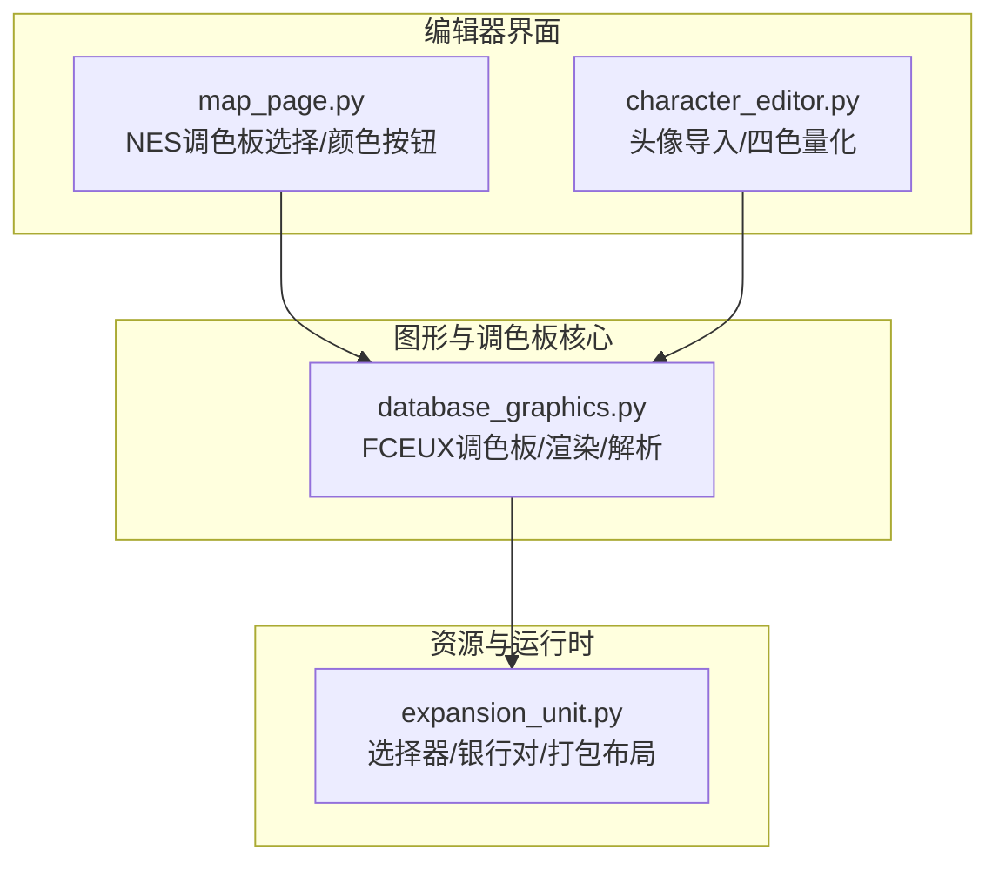
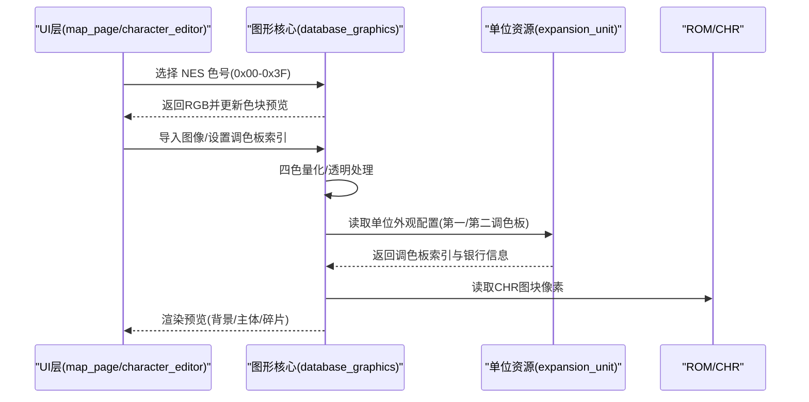
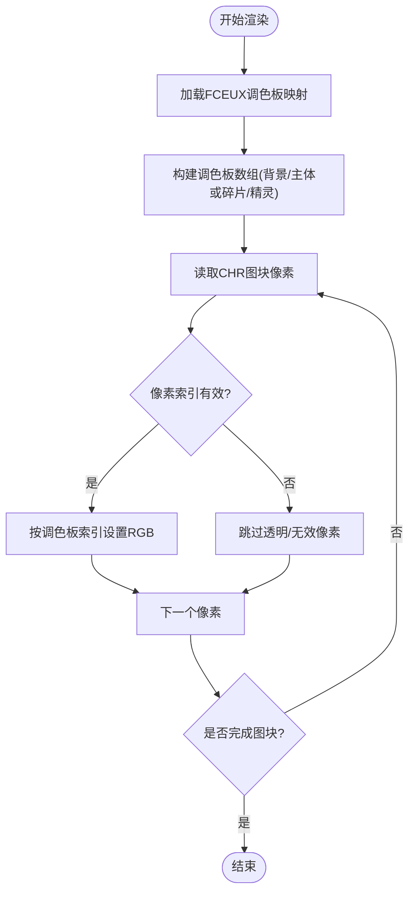
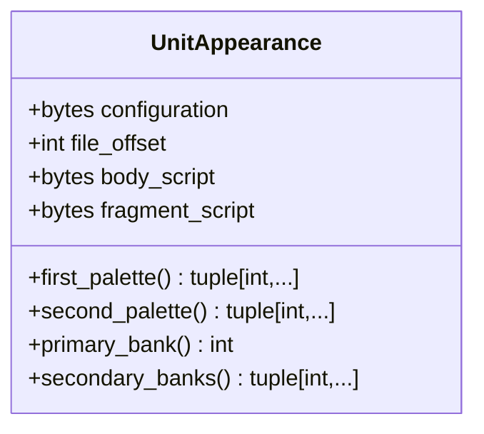
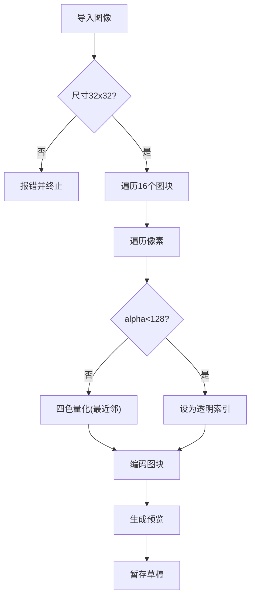
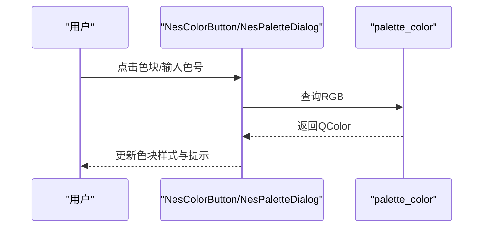
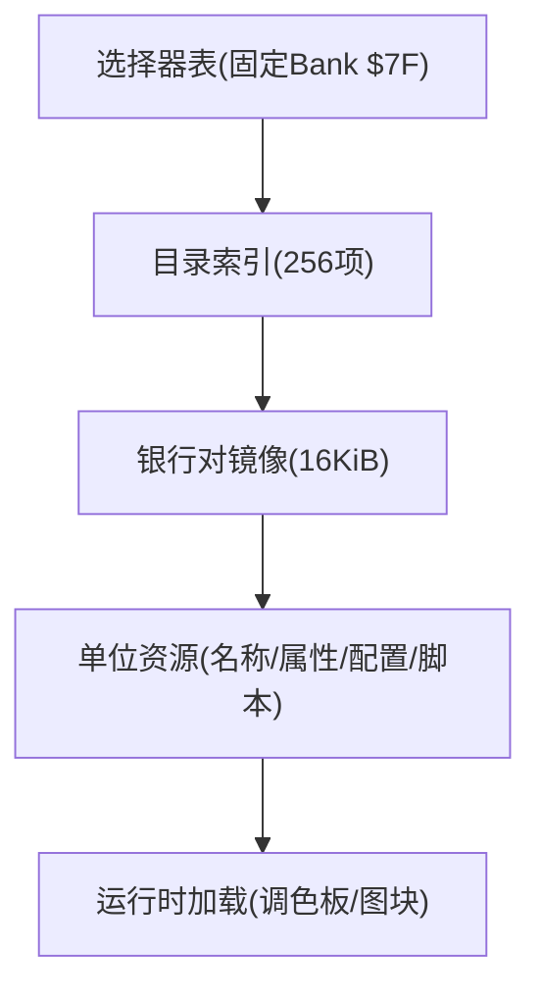
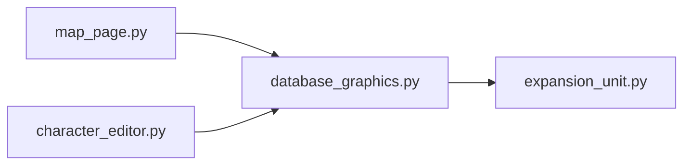

# 调色板管理

<cite>
**本文引用的文件**
- [database_graphics.py](file://src/dc_modifier/database_graphics.py)
- [character_editor.py](file://src/dc_modifier/character_editor.py)
- [map_page.py](file://src/dc_modifier/map_page.py)
- [expansion_unit.py](file://src/fc_editor/expansion_unit.py)
</cite>

## 目录
1. [简介](#简介)
2. [项目结构](#项目结构)
3. [核心组件](#核心组件)
4. [架构总览](#架构总览)
5. [详细组件分析](#详细组件分析)
6. [依赖关系分析](#依赖关系分析)
7. [性能考虑](#性能考虑)
8. [故障排查指南](#故障排查指南)
9. [结论](#结论)
10. [附录](#附录)

## 简介
本文件围绕 NES/FC 的调色板系统与管理工具，系统性说明 NES 调色板的硬件限制、颜色索引机制、调色板切换技术，并结合仓库中的实现，解释调色板的创建、编辑、优化与验证流程。重点覆盖：
- NES 调色板限制与颜色索引：NES 每图块最多使用 4 色（含透明），全局调色板为 64 色；显示时通过固定 FCEUX.pal 映射到 RGB。
- 调色板切换技术：背景/主体使用第一调色板，碎片/精灵使用第二调色板；可通过配置位控制敌我侧布局与原点偏移。
- 创建/编辑/优化/验证：提供四色量化、透明度处理、预览渲染、运行时一致性校验等能力。
- 压缩与内存优化：结合单位资源打包、选择器表与银行对镜像，减少重复数据并降低 ROM 占用。
- 设计原则与视觉一致性：统一显示调色板、严格边界检查、可复现的预览与导出。

## 项目结构
本项目在 dc_modifier 模块中实现了 NES 调色板相关的可视化与编辑能力，并通过 fc_editor.expansion_unit 提供单位资源的打包与运行时布局支持。关键文件职责如下：
- database_graphics.py：定义 NES 显示调色板、解析单位外观配置、渲染 CHR 图集与战斗预览、将调色板索引映射为 QColor。
- character_editor.py：头像导入时的四色量化与透明处理，基于当前调色板生成预览与草稿写入。
- map_page.py：提供 NES 调色板选择对话框与颜色按钮，用于地图地形属性与图标颜色的可视化编辑。
- expansion_unit.py：定义单位资源的选择器、银行对镜像、打包布局与容量约束，支撑调色板与图块的运行时加载。

图表来源
- [map_page.py:238-307](file://src/dc_modifier/map_page.py#L238-L307)
- [character_editor.py:280-334](file://src/dc_modifier/character_editor.py#L280-L334)
- [database_graphics.py:16-26](file://src/dc_modifier/database_graphics.py#L16-L26)
- [expansion_unit.py:19-33](file://src/fc_editor/expansion_unit.py#L19-L33)

章节来源
- [database_graphics.py:16-26](file://src/dc_modifier/database_graphics.py#L16-L26)
- [map_page.py:238-307](file://src/dc_modifier/map_page.py#L238-L307)
- [character_editor.py:280-334](file://src/dc_modifier/character_editor.py#L280-L334)
- [expansion_unit.py:19-33](file://src/fc_editor/expansion_unit.py#L19-L33)

## 核心组件
- NES 显示调色板映射：以 FCEUX.pal 作为唯一显示源，确保预览与游戏内显示一致且不修改 ROM 调色板字节。
- 单位外观配置解析：从配置记录中提取第一/第二调色板索引、主/次银行、以及敌我侧标志位。
- 渲染管线：将 CHR 图块像素按调色板索引映射为 RGB，输出 QImage 供 UI 展示。
- 四色量化与透明处理：导入图像时按当前调色板进行最近邻量化，并对低透明度像素视为透明。
- 调色板选择与编辑：提供 64 色网格选择器与实时色块控件，绑定数值输入与预览更新。
- 资源打包与选择器：通过选择器表与银行对镜像组织单位资源，保证运行时正确加载调色板与图块。

章节来源
- [database_graphics.py:28-55](file://src/dc_modifier/database_graphics.py#L28-L55)
- [database_graphics.py:284-438](file://src/dc_modifier/database_graphics.py#L284-L438)
- [character_editor.py:280-334](file://src/dc_modifier/character_editor.py#L280-L334)
- [map_page.py:238-307](file://src/dc_modifier/map_page.py#L238-L307)
- [expansion_unit.py:19-33](file://src/fc_editor/expansion_unit.py#L19-L33)

## 架构总览
下图展示了 NES 调色板系统在编辑器与运行时的交互关系：UI 层通过调色板选择器与颜色控件获取 NES 色号；图形核心将色号映射为 RGB 并渲染预览；单位外观解析出第一/第二调色板索引，分别用于背景/主体与碎片/精灵；资源打包模块确保运行时能正确加载对应银行与选择器。

图表来源
- [map_page.py:238-307](file://src/dc_modifier/map_page.py#L238-L307)
- [character_editor.py:280-334](file://src/dc_modifier/character_editor.py#L280-L334)
- [database_graphics.py:28-55](file://src/dc_modifier/database_graphics.py#L28-L55)
- [database_graphics.py:284-438](file://src/dc_modifier/database_graphics.py#L284-L438)
- [expansion_unit.py:19-33](file://src/fc_editor/expansion_unit.py#L19-L33)

## 详细组件分析

### 组件A：NES 调色板映射与渲染
- 功能要点
  - 使用内置 FCEUX.pal 作为显示调色板，确保预览与游戏内显示一致。
  - 将调色板索引映射为 QColor，并在渲染时将图块像素索引替换为 RGB。
  - 支持背景/主体与碎片/精灵两套调色板，分别对应第一/第二调色板索引。
- 复杂度与优化
  - 渲染过程逐像素遍历 8x8 图块，时间复杂度 O(W*H)，空间复杂度 O(W*H)。
  - 通过预构建调色板数组减少重复计算。
- 错误处理
  - 越界检查：CHR 图块索引、调色板索引范围、渲染区域边界。
  - 脚本解析失败时抛出明确错误，避免无效渲染。

图表来源
- [database_graphics.py:16-26](file://src/dc_modifier/database_graphics.py#L16-L26)
- [database_graphics.py:284-438](file://src/dc_modifier/database_graphics.py#L284-L438)

章节来源
- [database_graphics.py:16-26](file://src/dc_modifier/database_graphics.py#L16-L26)
- [database_graphics.py:284-438](file://src/dc_modifier/database_graphics.py#L284-L438)

### 组件B：单位外观配置与调色板切换
- 功能要点
  - 从配置记录提取第一/第二调色板索引、主/次银行、以及敌我侧标志位。
  - 根据标志位调整背景原点与精灵 X 坐标，实现敌我侧布局切换。
- 数据结构
  - UnitAppearance：包含配置字节、偏移、主体/碎片脚本、以及 first_palette/second_palette 属性。
- 运行时一致性
  - 校验加载代码与已验证格式一致，防止运行时行为漂移。

图表来源
- [database_graphics.py:28-55](file://src/dc_modifier/database_graphics.py#L28-L55)

章节来源
- [database_graphics.py:28-55](file://src/dc_modifier/database_graphics.py#L28-L55)

### 组件C：头像导入与四色量化
- 功能要点
  - 导入 32x32 头像图片，按当前调色板进行四色量化。
  - 低透明度像素视为透明，量化时使用最近邻距离最小化误差。
  - 生成预览并暂存草稿，确认后再写入 CHR。
- 算法细节
  - 透明度阈值：alpha < 128 视为透明。
  - 量化策略：对每个像素计算与调色板中四个颜色的欧氏距离，选择最近者。

图表来源
- [character_editor.py:280-334](file://src/dc_modifier/character_editor.py#L280-L334)

章节来源
- [character_editor.py:280-334](file://src/dc_modifier/character_editor.py#L280-L334)

### 组件D：NES 调色板选择与编辑
- 功能要点
  - 提供 64 色网格选择器，显示 NES 色号与 RGB 值。
  - 颜色按钮实时更新样式与提示，支持直接输入十六进制色号。
  - 与数值输入控件双向绑定，确保 UI 与数据一致。
- 用户体验
  - 色块边框高亮当前选中项，文本颜色根据亮度自动切换以保证可读性。

图表来源
- [map_page.py:238-307](file://src/dc_modifier/map_page.py#L238-L307)
- [database_graphics.py:284-286](file://src/dc_modifier/database_graphics.py#L284-L286)

章节来源
- [map_page.py:238-307](file://src/dc_modifier/map_page.py#L238-L307)
- [database_graphics.py:284-286](file://src/dc_modifier/database_graphics.py#L284-L286)

### 组件E：资源打包与选择器
- 功能要点
  - 定义选择器表与银行对镜像，组织单位资源（名称、属性、配置、拼图脚本）。
  - 校验指针表与记录大小，确保运行时能正确定位资源。
  - 支持多对银行镜像，提升容量与灵活性。
- 内存优化
  - 通过 BankPairImage 将两个连续银行合并为 16 KiB 镜像，减少分散存储。
  - 使用 ResourceLayout 描述资源布局与容量，便于编辑器进行打包与验证。

图表来源
- [expansion_unit.py:19-33](file://src/fc_editor/expansion_unit.py#L19-L33)
- [expansion_unit.py:68-120](file://src/fc_editor/expansion_unit.py#L68-L120)

章节来源
- [expansion_unit.py:68-120](file://src/fc_editor/expansion_unit.py#L68-L120)

## 依赖关系分析
- 模块耦合
  - map_page.py 与 character_editor.py 依赖 database_graphics.py 的 palette_color 与渲染函数。
  - database_graphics.py 依赖 expansion_unit.py 的单位外观解析与资源布局。
- 外部依赖
  - PySide6 用于 UI 与图像处理。
  - FCEUX.pal 作为显示调色板，确保跨平台显示一致性。
- 潜在循环依赖
  - 当前结构无循环依赖，UI 层仅调用核心模块，核心模块不反向依赖 UI。

图表来源
- [map_page.py:238-307](file://src/dc_modifier/map_page.py#L238-L307)
- [character_editor.py:280-334](file://src/dc_modifier/character_editor.py#L280-L334)
- [database_graphics.py:28-55](file://src/dc_modifier/database_graphics.py#L28-L55)
- [expansion_unit.py:19-33](file://src/fc_editor/expansion_unit.py#L19-L33)

章节来源
- [map_page.py:238-307](file://src/dc_modifier/map_page.py#L238-L307)
- [character_editor.py:280-334](file://src/dc_modifier/character_editor.py#L280-L334)
- [database_graphics.py:28-55](file://src/dc_modifier/database_graphics.py#L28-L55)
- [expansion_unit.py:19-33](file://src/fc_editor/expansion_unit.py#L19-L33)

## 性能考虑
- 渲染性能
  - 逐像素操作在 128x128 视口下可接受，但应避免频繁重建 QImage。
  - 建议缓存已渲染的图块与调色板数组，减少重复计算。
- 内存占用
  - 使用 BankPairImage 将资源打包为 16 KiB 镜像，减少碎片化。
  - 限制 CHR 图块访问范围，避免越界导致的额外开销。
- 量化效率
  - 四色量化采用最近邻搜索，可在小图块上快速完成；大图块建议批量处理。

[本节为通用指导，无需特定文件引用]

## 故障排查指南
- 常见错误
  - 调色板索引越界：确保索引在 0x00-0x3F 范围内。
  - CHR 图块越界：检查 bank 与 tile 索引是否在活动 CHR 范围内。
  - 脚本解析失败：确认主体/碎片脚本以 0xFF 结尾且指令参数完整。
- 调试建议
  - 使用预览功能验证调色板与图块组合效果。
  - 检查单位外观配置是否与运行时加载代码一致。
  - 对于导入图像，确认尺寸为 32x32 且透明度阈值合理。

章节来源
- [database_graphics.py:249-281](file://src/dc_modifier/database_graphics.py#L249-L281)
- [character_editor.py:302-334](file://src/dc_modifier/character_editor.py#L302-L334)

## 结论
本项目实现了完整的 NES 调色板管理系统，涵盖调色板映射、单位外观解析、四色量化、预览渲染与资源打包。通过统一的显示调色板与严格的边界检查，确保了预览与游戏内显示的一致性。结合选择器表与银行对镜像，有效优化了内存占用与运行时加载效率。建议在后续开发中继续完善缓存机制与批量处理，以提升大规模资源编辑的性能。

[本节为总结性内容，无需特定文件引用]

## 附录
- NES 调色板限制
  - 每图块最多 4 色（含透明），全局调色板 64 色。
  - 背景/主体使用第一调色板，碎片/精灵使用第二调色板。
- 颜色索引机制
  - 索引 0x00-0x3F 对应 FCEUX.pal 中的 RGB 值。
  - 透明色通常使用索引 0x0F 或显式 alpha 处理。
- 调色板切换技术
  - 通过配置位控制敌我侧布局与原点偏移。
  - 运行时根据标志位调整背景与精灵坐标。
- 设计原则
  - 统一显示调色板，避免 ROM 调色板字节修改。
  - 严格边界检查与错误提示，确保稳定性。
- 视觉一致性保证
  - 使用固定 FCEUX.pal 进行映射，确保跨平台一致。
  - 预览与导出结果与游戏内显示对齐。

[本节为概念性内容，无需特定文件引用]