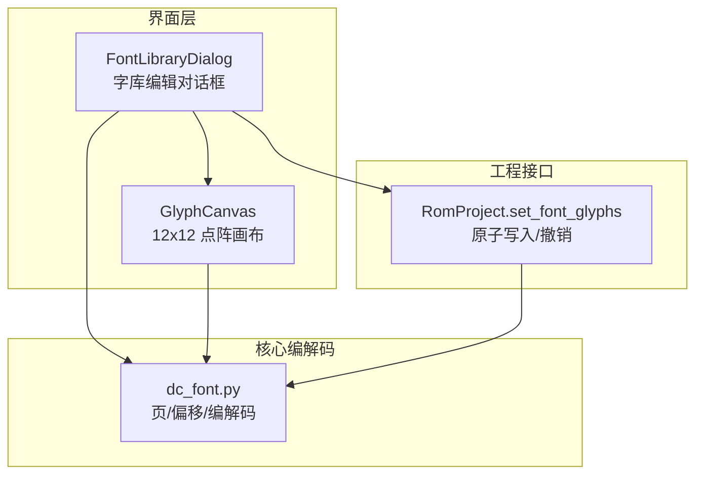
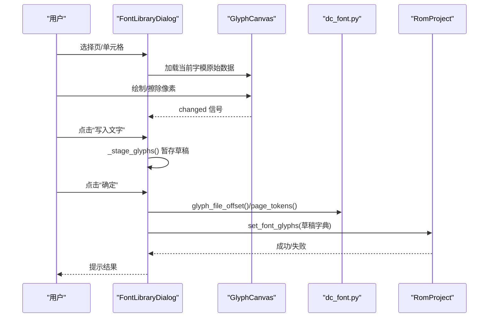
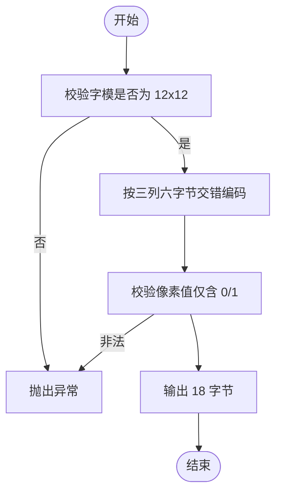
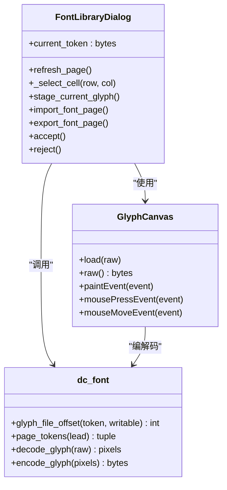
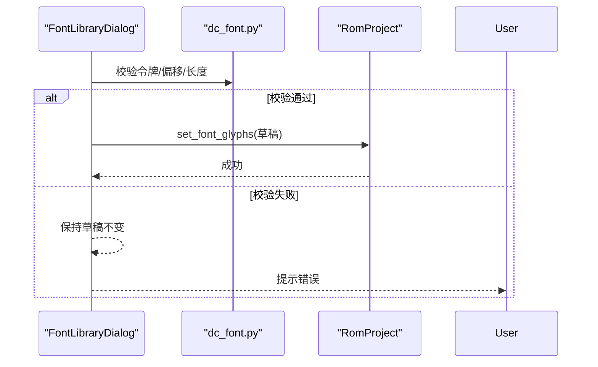
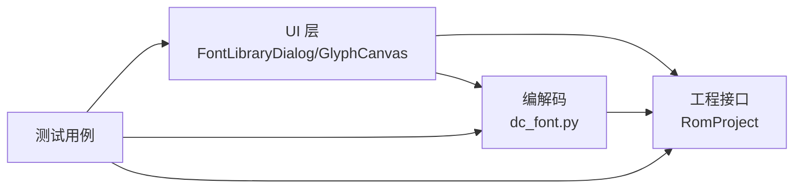

# 字体库管理系统

<cite>
**本文引用的文件**
- [src/dc_modifier/font_edit.py](file://src/dc_modifier/font_edit.py)
- [src/fc_editor/codecs/dc_font.py](file://src/fc_editor/codecs/dc_font.py)
- [src/dc_modifier/legacy_tools.py](file://src/dc_modifier/legacy_tools.py)
- [src/fc_rom_editor_core.py](file://src/fc_rom_editor_core.py)
- [tests/test_feedback_font_and_performance.py](file://tests/test_feedback_font_and_performance.py)
- [tests/test_font_edit_transactions.py](file://tests/test_font_edit_transactions.py)
</cite>

## 目录
1. [简介](#简介)
2. [项目结构](#项目结构)
3. [核心组件](#核心组件)
4. [架构总览](#架构总览)
5. [详细组件分析](#详细组件分析)
6. [依赖关系分析](#依赖关系分析)
7. [性能与内存优化](#性能与内存优化)
8. [故障排查指南](#故障排查指南)
9. [结论](#结论)
10. [附录](#附录)

## 简介
本文件系统性地介绍 DC 修改器的字体库管理能力，聚焦 FC 游戏字体的编码方式、字符集定义、显示渲染机制，以及字体的导入导出、字符映射、字形编辑流程。同时说明字体压缩存储格式、内存与事务性写入策略、多语言支持方案，并给出自定义字体创建流程与兼容性处理方法，帮助在有限 ROM 空间下高效管理与替换字体资源。

## 项目结构
DC 字体库管理由“UI 编辑层”和“编解码与工程层”两部分组成：
- UI 编辑层：提供网格预览、点阵编辑器、页面选择、导入导出等交互能力。
- 编解码与工程层：定义 12×12 字模的紧凑二进制格式、页内布局、偏移计算、校验与原子提交。

**图表来源**
- [src/dc_modifier/legacy_tools.py:109-200](file://src/dc_modifier/legacy_tools.py#L109-L200)
- [src/dc_modifier/font_edit.py:14-112](file://src/dc_modifier/font_edit.py#L14-L112)
- [src/fc_editor/codecs/dc_font.py:1-51](file://src/fc_editor/codecs/dc_font.py#L1-L51)
- [src/fc_rom_editor_core.py:1514-1520](file://src/fc_rom_editor_core.py#L1514-L1520)

**章节来源**
- [src/dc_modifier/legacy_tools.py:109-200](file://src/dc_modifier/legacy_tools.py#L109-L200)
- [src/dc_modifier/font_edit.py:14-112](file://src/dc_modifier/font_edit.py#L14-L112)
- [src/fc_editor/codecs/dc_font.py:1-51](file://src/fc_editor/codecs/dc_font.py#L1-L51)
- [src/fc_rom_editor_core.py:1514-1520](file://src/fc_rom_editor_core.py#L1514-L1520)

## 核心组件
- 字模编解码器：定义 12×12 字模的 18 字节紧凑格式、页头集合、页载荷大小、受支持的工程配置，并提供 token→ROM 偏移计算与行列别名保护。
- 字库编辑对话框：基于 16×16 网格展示当前页的字模，支持逐格选择、实时预览、批量暂存与确认提交。
- 点阵画布：提供 12×12 像素级绘制、左键画点、右键擦除、拖动绘制，并将像素矩阵与 18 字节格式互转。
- 工程写入接口：以原子方式将暂存的字模写入工作区，支持撤销/重做，并在提交前进行一致性校验。

**章节来源**
- [src/fc_editor/codecs/dc_font.py:1-51](file://src/fc_editor/codecs/dc_font.py#L1-L51)
- [src/dc_modifier/legacy_tools.py:109-200](file://src/dc_modifier/legacy_tools.py#L109-L200)
- [src/dc_modifier/font_edit.py:14-112](file://src/dc_modifier/font_edit.py#L14-L112)
- [src/fc_rom_editor_core.py:1514-1520](file://src/fc_rom_editor_core.py#L1514-L1520)

## 架构总览
下图展示了从用户操作到 ROM 数据变更的完整调用链：用户在网格中选择单元格，编辑点阵或选择系统字体生成新字形；点击“写入文字”后暂存至草稿；确认提交时进行批量校验与原子写入；失败则回滚并保持原状。

**图表来源**
- [src/dc_modifier/font_edit.py:163-264](file://src/dc_modifier/font_edit.py#L163-L264)
- [src/fc_editor/codecs/dc_font.py:16-30](file://src/fc_editor/codecs/dc_font.py#L16-L30)
- [src/fc_rom_editor_core.py:1514-1520](file://src/fc_rom_editor_core.py#L1514-L1520)

## 详细组件分析

### 字模编码与存储格式（dc_font.py）
- 固定尺寸：每个字模为 12×12 像素，占用 18 字节。
- 位布局：每行 12 像素按三个 4×12 垂直条组织，每条 6 字节；偶数行与奇数行的半字节交错存放，零表示墨迹。
- 页与令牌：页头集合限定为若干页段；每个字模用双字节令牌标识（页头+索引），E/F 列（14/15）为 0 列别名，不可独立写入。
- 偏移计算：根据页头与行列计算 ROM 中起始地址，确保对齐与边界安全。
- 编解码函数：decode_glyph/encode_glyph 保证输入输出一致性与合法性校验。

**图表来源**
- [src/fc_editor/codecs/dc_font.py:33-50](file://src/fc_editor/codecs/dc_font.py#L33-L50)

**章节来源**
- [src/fc_editor/codecs/dc_font.py:1-51](file://src/fc_editor/codecs/dc_font.py#L1-L51)

### 字库编辑对话框与点阵画布（legacy_tools.py + font_edit.py）
- 网格预览：16×16 表格展示当前页所有字模，支持键盘导航与单元格选择。
- 点阵画布：12×12 像素网格，左键画点、右键擦除，支持拖动；绘制完成后通过 encode_glyph 转换为 18 字节。
- 字体替换：可选择系统字体生成 12×12 字形预览，仅改变字形不改变码表；批量替换时需确认。
- 导入导出：支持导入/导出单页点阵（.dcfont），严格校验页文件大小（224 个 18 字节字模，不含 E/F 别名与保留字节）。
- 事务暂存：所有修改先放入草稿字典，确认提交时统一校验并写入；取消时清空草稿且不污染工作区。

**图表来源**
- [src/dc_modifier/legacy_tools.py:109-200](file://src/dc_modifier/legacy_tools.py#L109-L200)
- [src/dc_modifier/font_edit.py:14-112](file://src/dc_modifier/font_edit.py#L14-L112)
- [src/fc_editor/codecs/dc_font.py:16-50](file://src/fc_editor/codecs/dc_font.py#L16-L50)

**章节来源**
- [src/dc_modifier/legacy_tools.py:109-200](file://src/dc_modifier/legacy_tools.py#L109-L200)
- [src/dc_modifier/font_edit.py:14-112](file://src/dc_modifier/font_edit.py#L14-L112)

### 原子写入与一致性校验（RomProject.set_font_glyphs）
- 原子性：提交前对全部草稿进行批量校验（令牌合法、长度正确、偏移可写），任一失败则整体拒绝，避免部分写入。
- 并发保护：提交时再次比对预期原始值，若已被其他编辑修改则拒绝，防止覆盖新数据。
- 撤销支持：写入后纳入工程变更历史，支持 undo/redo。

**图表来源**
- [src/dc_modifier/font_edit.py:163-182](file://src/dc_modifier/font_edit.py#L163-L182)
- [src/fc_rom_editor_core.py:1514-1520](file://src/fc_rom_editor_core.py#L1514-L1520)

**章节来源**
- [src/dc_modifier/font_edit.py:163-182](file://src/dc_modifier/font_edit.py#L163-L182)
- [src/fc_rom_editor_core.py:1514-1520](file://src/fc_rom_editor_core.py#L1514-L1520)

### 字符集与映射
- 页头集合：限定为若干页段，用于划分字库区域。
- 令牌范围：每个字模用双字节令牌标识，包含页头与索引；E/F 列为 0 列别名，不可独立写入。
- 文本表：默认 DC 文本表提供字符到令牌的映射，便于在 UI 中显示与替换。

**章节来源**
- [src/fc_editor/codecs/dc_font.py:10-30](file://src/fc_editor/codecs/dc_font.py#L10-L30)
- [src/dc_modifier/legacy_tools.py:35-47](file://src/dc_modifier/legacy_tools.py#L35-L47)

### 显示与渲染机制
- 点阵渲染：将 18 字节解码为 12×12 像素矩阵，在画布上以黑白像素显示。
- 字体生成：使用系统字体在 12×12 画布上居中绘制单个字符，关闭抗锯齿以保证像素对齐，再编码为 18 字节。
- 预览对比：同时显示原始字模与替换预览，便于直观比较。

**章节来源**
- [src/dc_modifier/font_edit.py:131-153](file://src/dc_modifier/font_edit.py#L131-L153)
- [src/dc_modifier/legacy_tools.py:93-106](file://src/dc_modifier/legacy_tools.py#L93-L106)

## 依赖关系分析
- UI 层依赖编解码模块进行字模解析与生成。
- 编解码模块提供页头、令牌、偏移、编解码等基础能力。
- 工程接口负责原子写入与变更历史管理。
- 测试用例验证编解码往返、偏移边界、别名保护、事务提交与撤销等行为。

**图表来源**
- [src/dc_modifier/legacy_tools.py:109-200](file://src/dc_modifier/legacy_tools.py#L109-L200)
- [src/dc_modifier/font_edit.py:14-112](file://src/dc_modifier/font_edit.py#L14-L112)
- [src/fc_editor/codecs/dc_font.py:1-51](file://src/fc_editor/codecs/dc_font.py#L1-L51)
- [src/fc_rom_editor_core.py:1514-1520](file://src/fc_rom_editor_core.py#L1514-L1520)
- [tests/test_feedback_font_and_performance.py:36-77](file://tests/test_feedback_font_and_performance.py#L36-L77)
- [tests/test_font_edit_transactions.py:52-119](file://tests/test_font_edit_transactions.py#L52-L119)

**章节来源**
- [tests/test_feedback_font_and_performance.py:36-77](file://tests/test_feedback_font_and_performance.py#L36-L77)
- [tests/test_font_edit_transactions.py:52-119](file://tests/test_font_edit_transactions.py#L52-L119)

## 性能与内存优化
- 紧凑存储：12×12 字模仅占 18 字节，采用位交错压缩，显著降低 ROM 占用。
- 页内布局：每页 16 行 × 14 字模，末尾保留 4 字节，避免跨页访问开销。
- 只读保护：E/F 列为别名，禁止直接写入，减少冗余与冲突。
- 原子提交：批量校验后再写入，避免多次 I/O 与中间状态。
- 撤销/重做：基于工程变更历史，支持快速回退与恢复。
- 渲染优化：禁用抗锯齿，固定像素尺寸，确保字形稳定且渲染快速。

[本节为通用指导，无需特定文件引用]

## 故障排查指南
- 令牌无效：当令牌不在允许页头范围内或长度不正确时，会抛出异常；请检查页头与索引组合。
- 别名写入：尝试写入 E/F 列会被拒绝；请在 0 列编辑。
- 字模尺寸：必须为 18 字节；导入/导出时需确保 .dcfont 文件大小正确。
- 并发冲突：提交时发现原始数据被其他编辑修改，需取消并重试。
- 字体缺失：所选系统字体不包含该字符时无法生成字形；请更换字体或直接编辑点阵。

**章节来源**
- [src/fc_editor/codecs/dc_font.py:16-24](file://src/fc_editor/codecs/dc_font.py#L16-L24)
- [src/dc_modifier/font_edit.py:131-153](file://src/dc_modifier/font_edit.py#L131-L153)
- [src/dc_modifier/font_edit.py:212-249](file://src/dc_modifier/font_edit.py#L212-L249)
- [src/dc_modifier/font_edit.py:251-264](file://src/dc_modifier/font_edit.py#L251-L264)

## 结论
DC 修改器的字体库管理系统以紧凑的 12×12 字模格式为核心，结合严格的页头与令牌约束、别名保护与原子写入机制，实现了高效、安全的字体编辑与替换。通过点阵画布与系统字体生成，用户可在 UI 中直观地设计与管理字形；导入导出功能便于团队协作与版本管理。配合工程层的撤销/重做与一致性校验，系统在有限 ROM 空间下提供了可靠的字体管理能力。

[本节为总结性内容，无需特定文件引用]

## 附录

### 自定义字体创建流程
- 准备素材：选择或设计 12×12 像素的字形，确保仅使用黑白两色。
- 生成点阵：使用系统字体在 12×12 画布上居中绘制字符，关闭抗锯齿，再编码为 18 字节。
- 导入页面：将 224 个 18 字节字模打包为 .dcfont 文件，导入对应页。
- 替换与预览：在 UI 中选择目标字符，预览替换效果，确认后提交。
- 验证与回退：提交后检查 ROM 中的偏移与显示效果；如需回退，使用撤销功能。

**章节来源**
- [src/dc_modifier/font_edit.py:131-153](file://src/dc_modifier/font_edit.py#L131-L153)
- [src/dc_modifier/font_edit.py:212-249](file://src/dc_modifier/font_edit.py#L212-L249)
- [src/fc_editor/codecs/dc_font.py:33-50](file://src/fc_editor/codecs/dc_font.py#L33-L50)

### 兼容性处理
- 受支持配置：仅在受支持的工程配置下启用可写字库功能。
- 页头限制：仅允许在预定义的页头范围内编辑字模。
- 别名保护：E/F 列为 0 列别名，禁止独立写入，避免重复与冲突。
- 文本表兼容：使用默认 DC 文本表进行字符到令牌的映射，确保显示与编辑一致。

**章节来源**
- [src/fc_editor/codecs/dc_font.py:10-24](file://src/fc_editor/codecs/dc_font.py#L10-L24)
- [src/dc_modifier/legacy_tools.py:35-47](file://src/dc_modifier/legacy_tools.py#L35-L47)