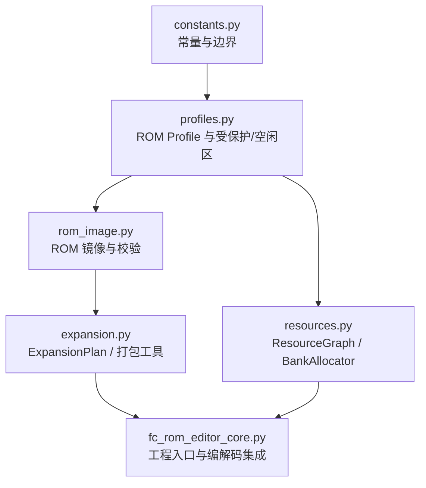
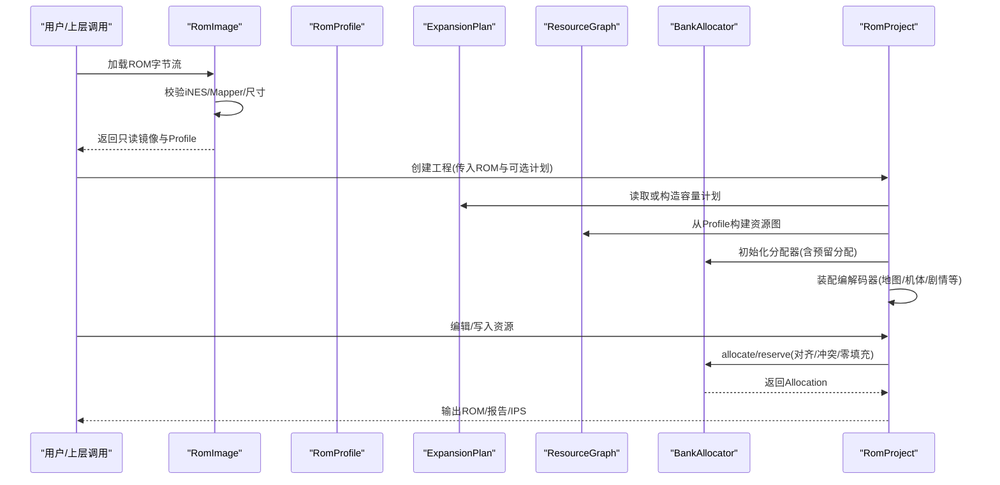
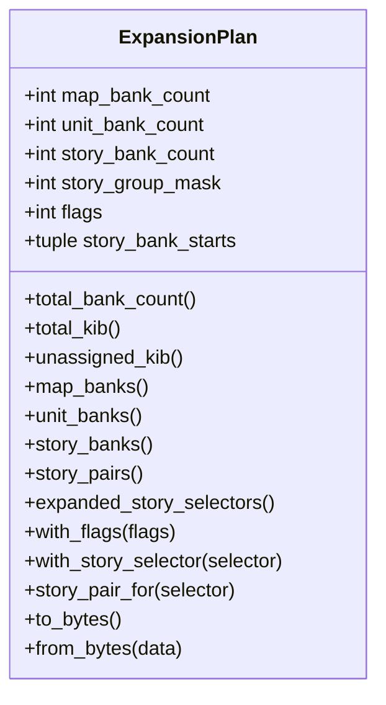
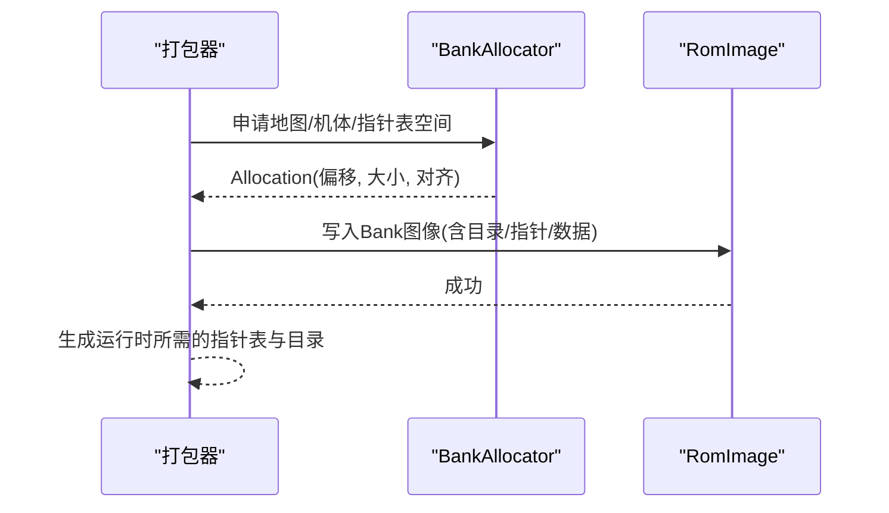
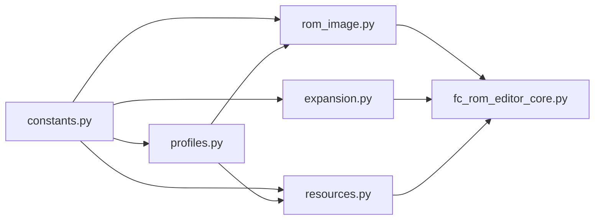

# 容量规划与Bank管理

<cite>
**本文引用的文件**
- [src/fc_rom_editor_core.py](file://src/fc_rom_editor_core.py)
- [src/fc_editor/expansion.py](file://src/fc_editor/expansion.py)
- [src/fc_editor/resources.py](file://src/fc_editor/resources.py)
- [src/fc_editor/rom_image.py](file://src/fc_editor/rom_image.py)
- [src/fc_editor/constants.py](file://src/fc_editor/constants.py)
- [src/fc_editor/profiles.py](file://src/fc_editor/profiles.py)
</cite>

## 目录
1. [简介](#简介)
2. [项目结构](#项目结构)
3. [核心组件](#核心组件)
4. [架构总览](#架构总览)
5. [详细组件分析](#详细组件分析)
6. [依赖关系分析](#依赖关系分析)
7. [性能考量](#性能考量)
8. [故障排查指南](#故障排查指南)
9. [结论](#结论)
10. [附录](#附录)

## 简介
本文件面向FC游戏ROM修改器中的“容量规划与Bank空间管理系统”，围绕MMC3（Mapper 194）扩展布局，系统阐述：
- FC ROM的Bank概念与MMC3映射器在扩容工程中的作用
- 如何以“配额化”的方式划分地图、机体、剧情等资源的PRG Bank池
- 资源冲突检测、对齐约束与零填充策略
- 监控ROM使用率、识别内存热点、进行容量分析的方法
- 在有限空间内最大化内容容量的实践：数据压缩、共享资源、动态加载

## 项目结构
本项目将容量规划与Bank管理拆分为多个职责清晰的模块：
- 常量与配置：定义iNES头、PRG Bank大小、CPU窗口基址、受保护Bank等
- ROM镜像与Profile：校验ROM合法性、识别目标布局与可用区域
- 容量规划：定义ExpansionPlan，对464 KiB可管理池进行不重叠分配
- 资源图与分配器：构建资源引用图，提供确定性First-Fit分配与冲突检测
- 打包与链接：将地图、机体、指针表等按Bank边界打包并生成运行时所需结构

**图示来源**
- [src/fc_editor/constants.py:1-69](file://src/fc_editor/constants.py#L1-L69)
- [src/fc_editor/profiles.py:276-687](file://src/fc_editor/profiles.py#L276-L687)
- [src/fc_editor/rom_image.py:50-125](file://src/fc_editor/rom_image.py#L50-L125)
- [src/fc_editor/expansion.py:84-318](file://src/fc_editor/expansion.py#L84-L318)
- [src/fc_editor/resources.py:47-413](file://src/fc_editor/resources.py#L47-L413)
- [src/fc_rom_editor_core.py:463-618](file://src/fc_rom_editor_core.py#L463-L618)

**章节来源**
- [src/fc_editor/constants.py:1-69](file://src/fc_editor/constants.py#L1-L69)
- [src/fc_editor/profiles.py:276-687](file://src/fc_editor/profiles.py#L276-L687)
- [src/fc_editor/rom_image.py:50-125](file://src/fc_editor/rom_image.py#L50-L125)
- [src/fc_editor/expansion.py:84-318](file://src/fc_editor/expansion.py#L84-L318)
- [src/fc_editor/resources.py:47-413](file://src/fc_editor/resources.py#L47-L413)
- [src/fc_rom_editor_core.py:463-618](file://src/fc_rom_editor_core.py#L463-L618)

## 核心组件
- 常量层：定义INES头长度、PRG Bank大小、CPU窗口基址、受保护Bank范围、参考SHA256等
- Profile层：声明ROM尺寸、Mapper、各资源指针表位置、受保护与空闲PRG区域
- ROM镜像层：校验iNES头、Mapper、尺寸一致性，并提供只读访问
- 容量规划层：ExpansionPlan对地图、机体、剧情三类资源进行配额化、不重叠分配，支持剧情组绑定与标志位
- 资源图与分配器：ResourceGraph描述资源节点与引用；BankAllocator在Profile声明的空闲区执行First-Fit分配，强制对齐、单Bank约束、零填充检查与冲突检测
- 工程集成层：RomProject装配各类编解码器，基于ExpansionPlan与BankAllocator完成资源装载、写入与回滚事务

**章节来源**
- [src/fc_editor/constants.py:1-69](file://src/fc_editor/constants.py#L1-L69)
- [src/fc_editor/profiles.py:276-687](file://src/fc_editor/profiles.py#L276-L687)
- [src/fc_editor/rom_image.py:50-125](file://src/fc_editor/rom_image.py#L50-L125)
- [src/fc_editor/expansion.py:84-318](file://src/fc_editor/expansion.py#L84-L318)
- [src/fc_editor/resources.py:47-413](file://src/fc_editor/resources.py#L47-L413)
- [src/fc_rom_editor_core.py:463-618](file://src/fc_rom_editor_core.py#L463-L618)

## 架构总览
下图展示从ROM载入到容量规划与资源分配的完整流程，以及关键对象之间的交互。

**图示来源**
- [src/fc_editor/rom_image.py:50-125](file://src/fc_editor/rom_image.py#L50-L125)
- [src/fc_editor/profiles.py:276-687](file://src/fc_editor/profiles.py#L276-L687)
- [src/fc_editor/expansion.py:84-318](file://src/fc_editor/expansion.py#L84-L318)
- [src/fc_editor/resources.py:47-413](file://src/fc_editor/resources.py#L47-L413)
- [src/fc_rom_editor_core.py:463-618](file://src/fc_rom_editor_core.py#L463-L618)

## 详细组件分析

### MMC3（Mapper 194）与Bank概念
- PRG Bank：每个Bank为8 KiB，CPU通过窗口映射访问；本项目中常用窗口基址为0xA000
- iNES头与Mapper：通过头信息解析Mapper编号，确保与Profile一致
- 受保护Bank：如$64、$7E、$7F等固定代码区不可被编辑器随意改写，需通过认证签名保障稳定性
- 资源选择器：在固定Bank中维护资源描述符表，用于运行时切换不同资源块

**章节来源**
- [src/fc_editor/constants.py:1-69](file://src/fc_editor/constants.py#L1-L69)
- [src/fc_editor/rom_image.py:16-105](file://src/fc_editor/rom_image.py#L16-L105)
- [src/fc_editor/profiles.py:23-54](file://src/fc_editor/profiles.py#L23-L54)
- [src/fc_editor/expansion.py:11-34](file://src/fc_editor/expansion.py#L11-L34)

### 容量规划：ExpansionPlan
- 可管理池：AVAILABLE_EXPANSION_BANKS定义了可用于编辑器的Bank集合，排除音频与固定代码占用的Bank
- 配额维度：map_bank_count、unit_bank_count、story_bank_count三者之和不得超过可用池大小
- 约束校验：单位配额必须为8 KiB整数倍，剧情配额为16 KiB整数倍，且最多支持7个已验证文本组
- 剧情绑定：story_bank_starts记录每个剧情组的起始Bank对，with_story_selector可按需启用并自动分配
- 序列化：to_bytes/from_bytes实现容量表的持久化与校验（CRC32）

**图示来源**
- [src/fc_editor/expansion.py:84-318](file://src/fc_editor/expansion.py#L84-L318)

**章节来源**
- [src/fc_editor/expansion.py:84-318](file://src/fc_editor/expansion.py#L84-L318)

### 资源图与Bank分配器：ResourceGraph 与 BankAllocator
- ResourceGraph：从Profile构建资源节点（表、数据、代码、音频、图形、自由区、元数据），并维护跨资源引用
- BankAllocator：
  - 仅能在Profile声明的free_prg_regions内进行分配
  - 支持对齐约束、单Bank限制、零填充检查、冲突检测
  - 提供reserve（保留）、allocate（申请）、release（释放）接口
  - 暴露capacity/used/available统计，便于容量监控

**图示来源**
- [src/fc_editor/resources.py:280-413](file://src/fc_editor/resources.py#L280-L413)

**章节来源**
- [src/fc_editor/resources.py:47-413](file://src/fc_editor/resources.py#L47-L413)

### 打包与链接：地图、机体与指针表
- 地图打包：pack_maps将多条地图记录顺序装入分配的Bank序列，生成指针表与目录，越界时提示所需最小配额
- 机体打包：pack_units将255条机体记录写入单Bank，附带指针表与数据段
- 通用指针表打包：pack_pointer_records生成标准目录+指针表+紧凑数据，支持去重与双Bank配对

**图示来源**
- [src/fc_editor/expansion.py:329-432](file://src/fc_editor/expansion.py#L329-L432)
- [src/fc_editor/resources.py:368-413](file://src/fc_editor/resources.py#L368-L413)

**章节来源**
- [src/fc_editor/expansion.py:329-432](file://src/fc_editor/expansion.py#L329-L432)
- [src/fc_editor/resources.py:368-413](file://src/fc_editor/resources.py#L368-L413)

### 工程集成：RomProject与编解码器装配
- RomProject负责：
  - 加载ROM与初始ExpansionPlan
  - 根据计划预留分区与守卫区
  - 装配Unit/Weapon/Map/Scenario/Story等编解码器
  - 提供撤销/重做事务，保证原子性
  - 统一资源分配器与动态刷新机制

**章节来源**
- [src/fc_rom_editor_core.py:463-618](file://src/fc_rom_editor_core.py#L463-L618)

## 依赖关系分析
- constants.py为所有模块提供基础常量（Bank大小、窗口基址、受保护Bank等）
- profiles.py基于constants定义具体ROM的Profile，声明protected/free区域
- rom_image.py依赖profiles进行ROM校验与Profile识别
- expansion.py依赖constants与profiles，实现容量计划与打包
- resources.py依赖profiles与constants，实现资源图与分配器
- fc_rom_editor_core.py聚合上述模块，驱动工程级操作

**图示来源**
- [src/fc_editor/constants.py:1-69](file://src/fc_editor/constants.py#L1-L69)
- [src/fc_editor/profiles.py:276-687](file://src/fc_editor/profiles.py#L276-L687)
- [src/fc_editor/rom_image.py:50-125](file://src/fc_editor/rom_image.py#L50-L125)
- [src/fc_editor/expansion.py:84-318](file://src/fc_editor/expansion.py#L84-L318)
- [src/fc_editor/resources.py:47-413](file://src/fc_editor/resources.py#L47-L413)
- [src/fc_rom_editor_core.py:463-618](file://src/fc_rom_editor_core.py#L463-L618)

**章节来源**
- [src/fc_editor/constants.py:1-69](file://src/fc_editor/constants.py#L1-L69)
- [src/fc_editor/profiles.py:276-687](file://src/fc_editor/profiles.py#L276-L687)
- [src/fc_editor/rom_image.py:50-125](file://src/fc_editor/rom_image.py#L50-L125)
- [src/fc_editor/expansion.py:84-318](file://src/fc_editor/expansion.py#L84-L318)
- [src/fc_editor/resources.py:47-413](file://src/fc_editor/resources.py#L47-L413)
- [src/fc_rom_editor_core.py:463-618](file://src/fc_rom_editor_core.py#L463-L618)

## 性能考量
- 分配器采用First-Fit策略，时间复杂度近似O(n)，n为当前分配数量；建议控制分配粒度与合并相邻小块
- 单Bank约束避免跨Bank读写带来的复杂性与潜在错误，但可能增加碎片；可通过批量打包减少碎片
- 零填充检查在require_zero_fill=True时会扫描目标区域，建议在大规模写入前预清理或关闭该检查以提升速度
- 打包阶段尽量将相关数据连续存放，减少指针表规模与跳转开销

[本节为通用指导，不直接分析具体文件]

## 故障排查指南
- ROM格式错误：iNES头无效、Mapper不匹配、尺寸不符
  - 定位：rom_image.validate_layout
- 容量表校验失败：ExpansionPlan CRC32不匹配或版本字段异常
  - 定位：expansion.ExpansionPlan.from_bytes
- 分配冲突：资源ID重复、范围重叠、未满足对齐、超出空闲区
  - 定位：resources.BankAllocator.allocate/reserve
- 打包越界：地图/指针表超过单Bank或容器容量不足
  - 定位：expansion.pack_maps/pack_pointer_records
- 受保护区域篡改：固定Bank或iNES头签名不匹配
  - 定位：profiles.dc_expanded_mmc3_protected_signature_is_valid

**章节来源**
- [src/fc_editor/rom_image.py:79-105](file://src/fc_editor/rom_image.py#L79-L105)
- [src/fc_editor/expansion.py:277-318](file://src/fc_editor/expansion.py#L277-L318)
- [src/fc_editor/resources.py:334-413](file://src/fc_editor/resources.py#L334-L413)
- [src/fc_editor/expansion.py:329-432](file://src/fc_editor/expansion.py#L329-L432)
- [src/fc_editor/profiles.py:23-54](file://src/fc_editor/profiles.py#L23-L54)

## 结论
本项目通过“Profile + ExpansionPlan + ResourceGraph + BankAllocator”的分层设计，实现了在MMC3（Mapper 194）扩容ROM中对PRG空间的精细化容量规划与资源管理。借助严格的配额校验、对齐与冲突检测，结合打包与指针表生成，能够在有限的464 KiB资源池中高效容纳地图、机体与剧情等资源。配合工程级的撤销/重做与事务机制，保证了编辑过程的安全性与可追溯性。

[本节为总结性内容，不直接分析具体文件]

## 附录

### 监控ROM使用率与容量分析
- 使用BankAllocator的capacity/used/available属性统计空闲区占用情况
- 通过ExpansionPlan.total_kib与unassigned_kib了解已用与剩余配额
- 利用consecutive_bank_segments识别连续Bank段，辅助发现碎片
- 在打包阶段收集used_bytes，评估实际数据密度

**章节来源**
- [src/fc_editor/resources.py:295-313](file://src/fc_editor/resources.py#L295-L313)
- [src/fc_editor/expansion.py:177-213](file://src/fc_editor/expansion.py#L177-L213)
- [src/fc_editor/expansion.py:71-82](file://src/fc_editor/expansion.py#L71-L82)
- [src/fc_editor/expansion.py:329-368](file://src/fc_editor/expansion.py#L329-L368)

### 实战案例：在有限空间内最大化容量
- 数据压缩：优先对重复数据进行去重（pack_pointer_records支持deduplicate），减少指针表与数据冗余
- 共享资源：将多处引用的相同数据合并存储，仅保留一份实例并通过指针复用
- 动态加载：利用剧情组绑定与资源选择器，在不同场景切换不同Bank对，降低同时驻留的数据量
- 配额优化：合理调整map/unit/story配额，使高频资源获得更大Bank池，低频资源按需分配

**章节来源**
- [src/fc_editor/expansion.py:393-432](file://src/fc_editor/expansion.py#L393-L432)
- [src/fc_editor/expansion.py:239-275](file://src/fc_editor/expansion.py#L239-L275)
- [src/fc_editor/expansion.py:84-175](file://src/fc_editor/expansion.py#L84-L175)