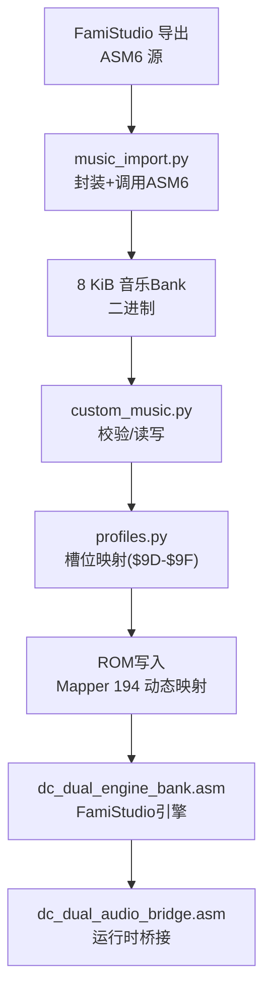
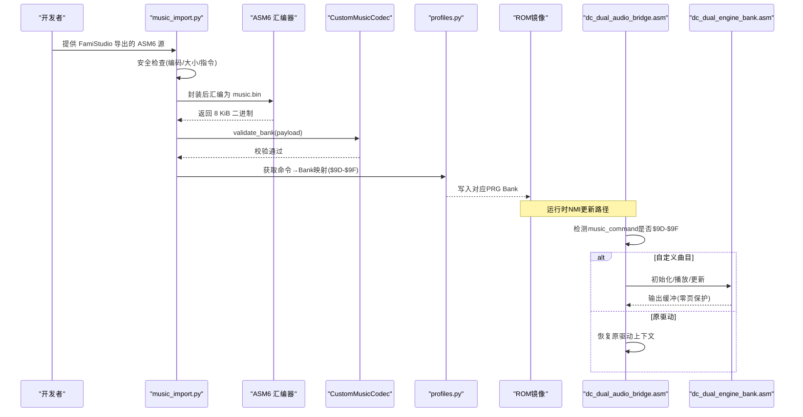
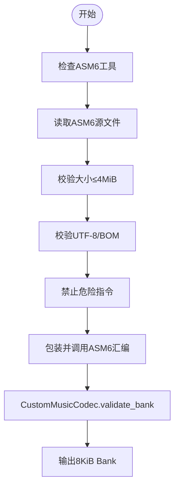
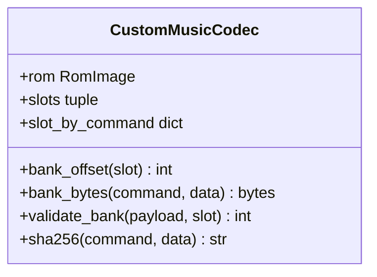
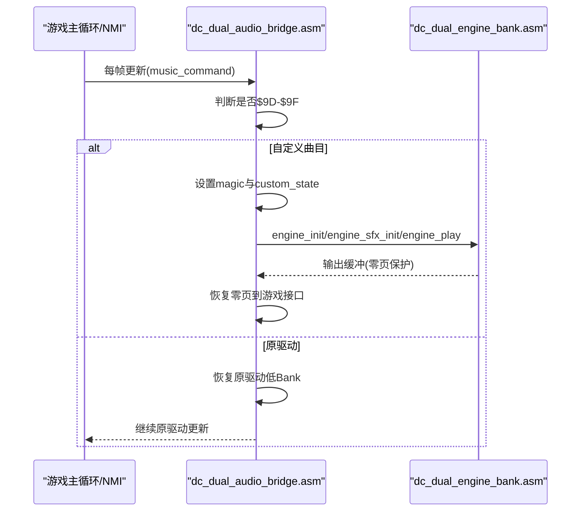

# 音乐导入导出系统

<cite>
**本文引用的文件**
- [music_import.py](file://src/dc_modifier/music_import.py)
- [custom_music.py](file://src/fc_editor/codecs/custom_music.py)
- [profiles.py](file://src/fc_editor/profiles.py)
- [dc_dual_engine_bank.asm](file://src/asm/dc_dual_engine_bank.asm)
- [dc_dual_audio_bridge.asm](file://src/asm/dc_dual_audio_bridge.asm)
- [dark_knight_famistudio_asm6.asm](file://src/asm/dark_knight_famistudio_asm6.asm)
- [dark_prison_famistudio_asm6.asm](file://src/asm/dark_prison_famistudio_asm6.asm)
- [test_dc_expanded_dual_audio.py](file://tests/test_dc_expanded_dual_audio.py)
</cite>

## 目录
1. [简介](#简介)
2. [项目结构](#项目结构)
3. [核心组件](#核心组件)
4. [架构总览](#架构总览)
5. [详细组件分析](#详细组件分析)
6. [依赖关系分析](#依赖关系分析)
7. [性能与容量优化](#性能与容量优化)
8. [故障排查指南](#故障排查指南)
9. [结论](#结论)
10. [附录：完整工作流与命令映射](#附录完整工作流与命令映射)

## 简介
本系统为 FC（NES）游戏“第二次机器人大战新DC篇·扩容 MMC3”提供 FamiStudio 音乐集成能力。其目标是将 FamiStudio 导出的 ASM6 源文件，通过内置的汇编流程打包成固定大小的音乐 Bank，并写入 ROM 中预留的可替换槽位；运行时由双音频引擎桥接器在“原驱动”和“FamiStudio 引擎”之间切换，实现多首扩展曲目与音效的统一调度。

该方案的关键点包括：
- 使用 ASM6 将 FamiStudio 导出的数据汇编为 8 KiB 的 Bank，并进行严格校验。
- 通过自定义编解码器对 Bank 格式进行验证、读取与写入。
- 以命令 $9D–$9F 选择三首可替换曲目，配合 Mapper 194 动态映射 PRG Bank。
- 运行时桥接器保护原驱动共享零页状态，避免帧内冲突，并在需要时恢复原驱动上下文。

## 项目结构
围绕音乐导入导出，主要涉及以下模块与文件：
- 导入与组装：music_import.py 负责调用 ASM6 将 FamiStudio 导出的 ASM6 源文件封装并汇编为 8 KiB 二进制。
- 编解码与ROM布局：custom_music.py 定义 Music Bank 的数据格式、校验规则及 ROM 偏移计算。
- 配置与槽位声明：profiles.py 声明了三个可替换音乐槽（$9D/$9E/$9F）及其对应的 PRG Bank。
- 运行时代码：dc_dual_engine_bank.asm 与 dc_dual_audio_bridge.asm 构成第二套 FamiStudio 引擎与桥接逻辑。
- 示例数据：dark_knight_famistudio_asm6.asm、dark_prison_famistudio_asm6.asm 等是 FamiStudio 导出的音乐数据样例。
- 测试用例：test_dc_expanded_dual_audio.py 验证构建产物、Bank 内容、引擎哈希与兼容性信息。

图表来源
- [music_import.py:38-91](file://src/dc_modifier/music_import.py#L38-L91)
- [custom_music.py:24-65](file://src/fc_editor/codecs/custom_music.py#L24-L65)
- [profiles.py:627-631](file://src/fc_editor/profiles.py#L627-L631)
- [dc_dual_engine_bank.asm:20-44](file://src/asm/dc_dual_engine_bank.asm#L20-L44)
- [dc_dual_audio_bridge.asm:44-103](file://src/asm/dc_dual_audio_bridge.asm#L44-L103)

章节来源
- [music_import.py:31-91](file://src/dc_modifier/music_import.py#L31-L91)
- [custom_music.py:10-65](file://src/fc_editor/codecs/custom_music.py#L10-L65)
- [profiles.py:627-631](file://src/fc_editor/profiles.py#L627-L631)
- [dc_dual_engine_bank.asm:1-57](file://src/asm/dc_dual_engine_bank.asm#L1-L57)
- [dc_dual_audio_bridge.asm:1-234](file://src/asm/dc_dual_audio_bridge.asm#L1-L234)

## 核心组件
- 音乐导入与汇编器
  - 功能：读取 FamiStudio 导出的 ASM6 源文件，添加基址与结束标签，调用 ASM6 生成 8 KiB 二进制，并执行格式校验。
  - 安全限制：禁止 include/incbin/base/org 等指令，限制源文件大小，强制 UTF-8 编码，超时保护。
- 自定义音乐编解码器
  - 功能：定义 Music Bank 的头部与指针范围约束，按命令索引定位对应 PRG Bank，计算偏移并提取/写入字节。
  - 校验要点：Bank 大小必须为 8192 字节；曲目数 1–32；所有指针位于 $8000–$9FFF 区间。
- 槽位与ROM配置
  - 功能：声明 $9D/$9E/$9F 三个命令分别映射到 PRG Bank $61/$62/$63，供运行时动态切换。
- 双音频引擎与桥接器
  - 功能：在 NMI 更新路径中判断当前命令是否属于自定义曲目；若是则切换到 FamiStudio 引擎，否则走原驱动；同时保存/恢复关键零页区域，避免冲突。

章节来源
- [music_import.py:38-91](file://src/dc_modifier/music_import.py#L38-L91)
- [custom_music.py:24-65](file://src/fc_editor/codecs/custom_music.py#L24-L65)
- [profiles.py:627-631](file://src/fc_editor/profiles.py#L627-L631)
- [dc_dual_audio_bridge.asm:44-103](file://src/asm/dc_dual_audio_bridge.asm#L44-L103)

## 架构总览
下图展示了从 FamiStudio 工程到最终 ROM 集成的端到端流程，以及运行时的切换机制。

图表来源
- [music_import.py:38-91](file://src/dc_modifier/music_import.py#L38-L91)
- [custom_music.py:24-65](file://src/fc_editor/codecs/custom_music.py#L24-L65)
- [profiles.py:627-631](file://src/fc_editor/profiles.py#L627-L631)
- [dc_dual_audio_bridge.asm:44-103](file://src/asm/dc_dual_audio_bridge.asm#L44-L103)
- [dc_dual_engine_bank.asm:20-44](file://src/asm/dc_dual_engine_bank.asm#L20-L44)

## 详细组件分析

### 音乐导入与汇编流程（music_import.py）
- 输入：FamiStudio 导出的 ASM6 源文件（包含 music_data_* 标签）。
- 处理：
  - 检查 ASM6 工具是否存在。
  - 限制源文件大小（≤4 MiB），强制 UTF-8/UTF-8 BOM 编码。
  - 禁止危险指令（include/incbin/base/org），确保可复现与安全。
  - 自动包装 .base $8000 与结束标签，调用 ASM6 生成 music.bin。
  - 调用 CustomMusicCodec.validate_bank 进行二次校验。
- 输出：8 KiB 的二进制 Bank，可直接写入 ROM 指定槽位。

图表来源
- [music_import.py:38-91](file://src/dc_modifier/music_import.py#L38-L91)

章节来源
- [music_import.py:38-91](file://src/dc_modifier/music_import.py#L38-L91)

### 自定义音乐编解码器（custom_music.py）
- 数据结构与约束：
  - Bank 固定 8192 字节。
  - 首字节为曲目数量（1–32）。
  - 每个曲目条目占 14 字节，包含多个相对偏移字段。
  - 所有指针必须在 $8000–$9FFF 范围内，保证 CPU 窗口可见性。
- 接口：
  - bank_offset(slot): 根据槽位计算 ROM 中的起始偏移。
  - bank_bytes(command, data=None): 读取或写入对应 Bank 的字节。
  - validate_bank(payload, slot=None): 校验 Bank 格式并返回曲目数。
  - sha256(command, data=None): 计算 Bank 的哈希用于一致性校验。

图表来源
- [custom_music.py:10-65](file://src/fc_editor/codecs/custom_music.py#L10-L65)

章节来源
- [custom_music.py:10-65](file://src/fc_editor/codecs/custom_music.py#L10-L65)

### 槽位与ROM配置（profiles.py）
- 声明三个可替换音乐槽：
  - $9D → PRG Bank $61（Ash to Ash）
  - $9E → PRG Bank $62（Dark Knight）
  - $9F → PRG Bank $63（Dark Prison）
- 这些槽位被运行时桥接器识别，用于动态切换曲目。

章节来源
- [profiles.py:627-631](file://src/fc_editor/profiles.py#L627-L631)

### 双音频引擎与桥接器（dc_dual_engine_bank.asm / dc_dual_audio_bridge.asm）
- 引擎入口：
  - dc_dual_init/play/stop/update/sfx_init/sfx_play 直接跳转到 FamiStudio 对应函数。
  - 配置外部代码段、NTSC 支持、SFX 流等宏。
  - 数据表 dc_dual_data_banks 列出三首曲目的 PRG Bank 编号。
- 桥接器职责：
  - 当 music_command ∈ {$9D,$9E,$9F} 时，切换到 FamiStudio 引擎。
  - 在切换前设置魔法值（bridge_magic_a/b/c）与 custom_state，确保状态一致。
  - 保存/恢复游戏面向的零页接口（$4C–$56），避免与紧凑引擎的输出缓冲冲突。
  - 若检测到 SFX 流结束，重置 limit 并回到原驱动。
  - 对于低命令（$00–$37），在自定义曲目激活时使用迁移后的音效集，保持单一 APU 所有者。

图表来源
- [dc_dual_audio_bridge.asm:44-103](file://src/asm/dc_dual_audio_bridge.asm#L44-L103)
- [dc_dual_engine_bank.asm:20-44](file://src/asm/dc_dual_engine_bank.asm#L20-L44)

章节来源
- [dc_dual_audio_bridge.asm:44-103](file://src/asm/dc_dual_audio_bridge.asm#L44-L103)
- [dc_dual_engine_bank.asm:20-44](file://src/asm/dc_dual_engine_bank.asm#L20-L44)

### 音乐数据格式与限制条件
- 数据头：
  - 第0字节：曲目数量（1–32）。
  - 后续为各曲目的指针与参数，共 14 字节/条。
- 指针约束：
  - 所有指针必须位于 $8000–$9FFF，确保在 CPU 窗口内可访问。
- 容量与时间：
  - 单首曲目需适配 8 KiB Bank；过大或过多会导致校验失败。
  - 汇编过程有 30 秒超时保护，防止卡死。

章节来源
- [custom_music.py:37-62](file://src/fc_editor/codecs/custom_music.py#L37-L62)
- [music_import.py:44-82](file://src/dc_modifier/music_import.py#L44-L82)

## 依赖关系分析
- 模块耦合：
  - music_import.py 依赖 CustomMusicCodec 进行 Bank 校验。
  - CustomMusicCodec 依赖 profiles.py 提供的槽位信息与常量。
  - 运行时桥接器依赖引擎入口与数据表，确保正确映射 PRG Bank。
- 外部依赖：
  - ASM6 汇编器（随项目附带的 asm6_fixed.exe）。
- 潜在风险：
  - 若 ROM 非受支持的布局或签名不匹配，将无法安全修改。
  - 若 Bank 指针越界或格式错误，将导致运行时崩溃或无声。

图表来源
- [music_import.py:38-91](file://src/dc_modifier/music_import.py#L38-L91)
- [custom_music.py:10-65](file://src/fc_editor/codecs/custom_music.py#L10-L65)
- [profiles.py:627-631](file://src/fc_editor/profiles.py#L627-L631)
- [dc_dual_audio_bridge.asm:44-103](file://src/asm/dc_dual_audio_bridge.asm#L44-L103)
- [dc_dual_engine_bank.asm:20-44](file://src/asm/dc_dual_engine_bank.asm#L20-L44)

章节来源
- [music_import.py:38-91](file://src/dc_modifier/music_import.py#L38-L91)
- [custom_music.py:10-65](file://src/fc_editor/codecs/custom_music.py#L10-L65)
- [profiles.py:627-631](file://src/fc_editor/profiles.py#L627-L631)
- [dc_dual_audio_bridge.asm:44-103](file://src/asm/dc_dual_audio_bridge.asm#L44-L103)
- [dc_dual_engine_bank.asm:20-44](file://src/asm/dc_dual_engine_bank.asm#L20-L44)

## 性能与容量优化
- 容量控制：
  - 单首曲目严格限制在 8 KiB；建议精简乐器与环境、减少采样与重复片段。
  - 合理分配曲目指针，避免冗余跳转与过长序列。
- 运行时开销：
  - 桥接器仅在自定义曲目激活时保存/恢复零页，降低额外开销。
  - 音效流结束后及时重置 limit，避免无效更新。
- 构建效率：
  - 使用临时目录隔离汇编过程，避免污染工作区。
  - 限制源文件大小与超时，提升批量处理的稳定性。

[本节为通用指导，无需特定文件引用]

## 故障排查指南
- 常见错误与原因：
  - “未找到 ASM6”：确认随项目附带的 asm6_fixed.exe 路径存在。
  - “源文件超过上限”：检查 FamiStudio 导出体积，必要时拆分或精简。
  - “非法指令”：移除 include/incbin/base/org 等指令，确保纯数据导出。
  - “Bank 大小或指针越界”：重新导出并确保 FamiStudio 配置与目标平台一致。
  - “ROM 布局不受支持”：仅支持已验证的 ROM 版本与签名。
- 调试技巧：
  - 查看 ASM6 生成的 listing 文件，定位地址与符号。
  - 使用测试用例验证构建产物与引擎哈希，确保一致性。
  - 在桥接器处断点，观察 magic 值与 custom_state 的变化。

章节来源
- [music_import.py:42-82](file://src/dc_modifier/music_import.py#L42-L82)
- [custom_music.py:37-62](file://src/fc_editor/codecs/custom_music.py#L37-L62)
- [test_dc_expanded_dual_audio.py:109-125](file://tests/test_dc_expanded_dual_audio.py#L109-L125)

## 结论
本系统通过严格的导入校验、固定的 Bank 格式与健壮的运行时桥接，实现了 FamiStudio 音乐在 FC 游戏中的稳定集成。借助 $9D–$9F 命令与 Mapper 194 的动态映射，可在原驱动与 FamiStudio 引擎间无缝切换，既保留原有音效体系，又扩展了多首高质量曲目。建议在曲目设计与导出阶段严格控制容量与复杂度，以获得最佳兼容性与性能表现。

[本节为总结，无需特定文件引用]

## 附录：完整工作流与命令映射
- 工作流步骤：
  1) 在 FamiStudio 中导出 ASM6 源文件（确保包含 music_data_* 标签）。
  2) 使用 music_import.py 进行封装与汇编，生成 8 KiB 二进制。
  3) 通过 CustomMusicCodec.validate_bank 校验格式。
  4) 依据 profiles.py 的槽位映射，将 Bank 写入 ROM 的 $61/$62/$63。
  5) 运行时通过命令 $9D/$9E/$9F 选择曲目，桥接器自动切换引擎。
- 命令映射：
  - $9D → PRG Bank $61（Ash to Ash）
  - $9E → PRG Bank $62（Dark Knight）
  - $9F → PRG Bank $63（Dark Prison）

章节来源
- [profiles.py:627-631](file://src/fc_editor/profiles.py#L627-L631)
- [dc_dual_audio_bridge.asm:44-103](file://src/asm/dc_dual_audio_bridge.asm#L44-L103)
- [dc_dual_engine_bank.asm:20-44](file://src/asm/dc_dual_engine_bank.asm#L20-L44)