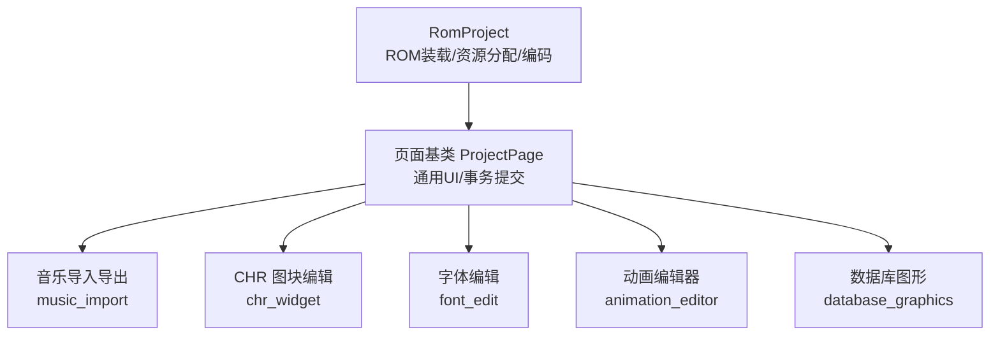
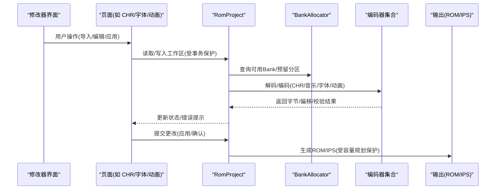
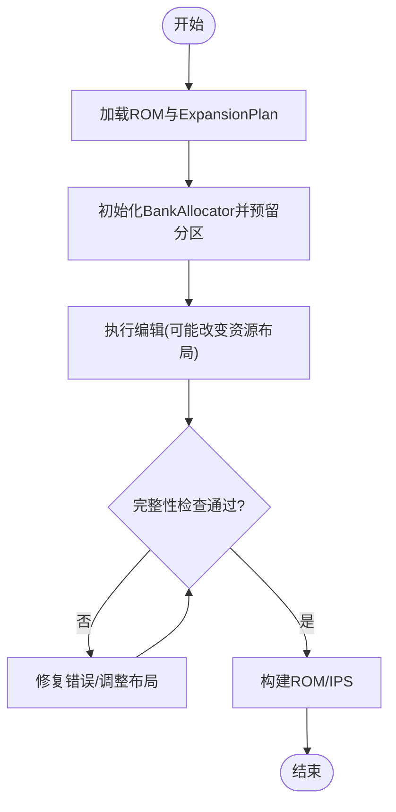
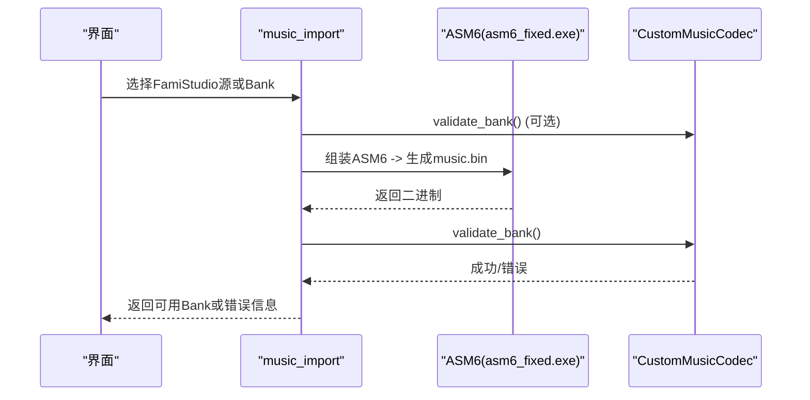
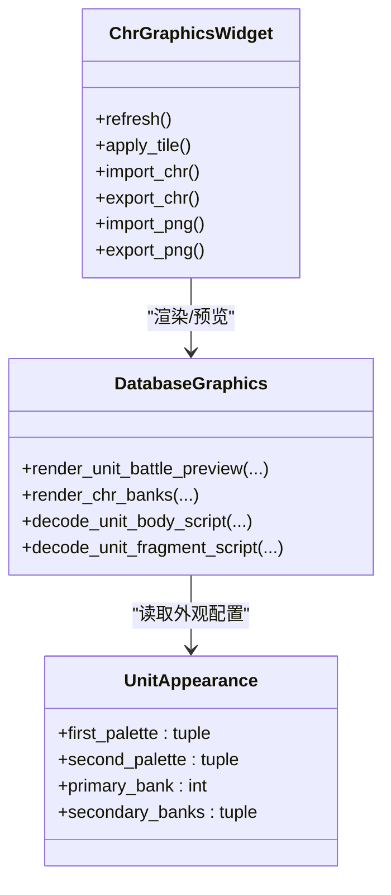
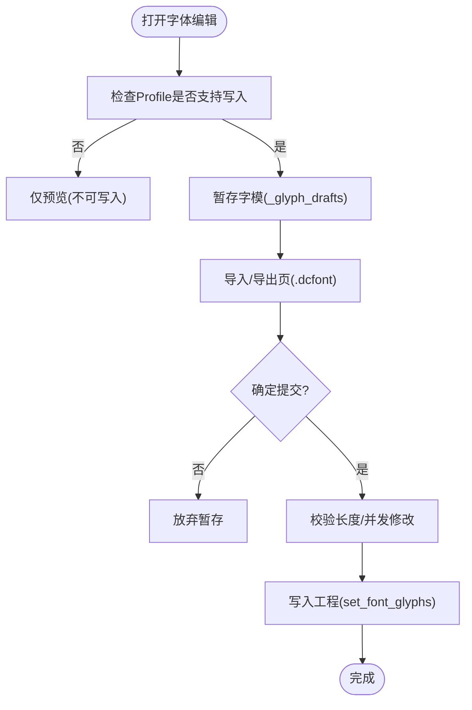
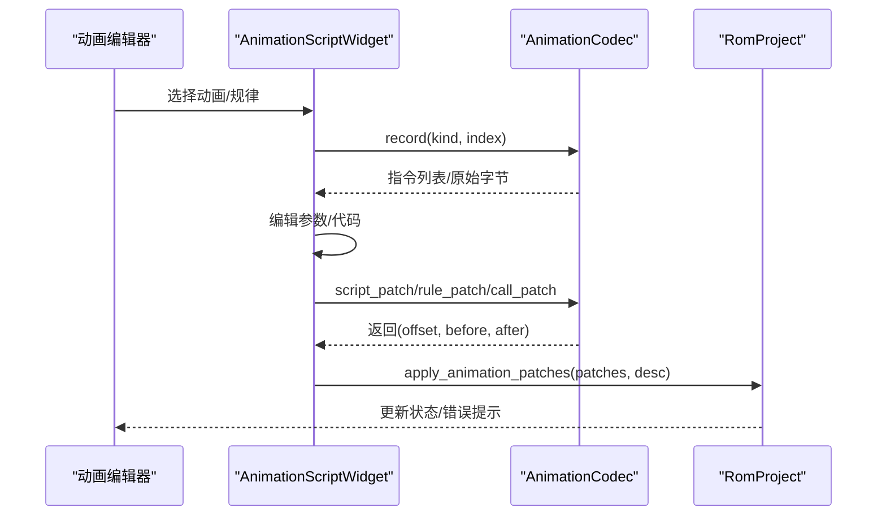
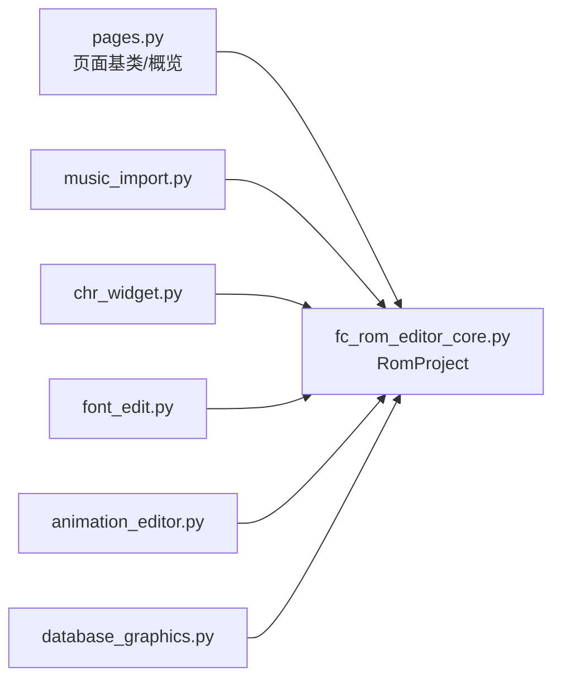

# 高级功能

<cite>
**本文引用的文件**
- [src/dc_modifier/music_import.py](file://src/dc_modifier/music_import.py)
- [src/dc_modifier/chr_widget.py](file://src/dc_modifier/chr_widget.py)
- [src/dc_modifier/font_edit.py](file://src/dc_modifier/font_edit.py)
- [src/dc_modifier/animation_editor.py](file://src/dc_modifier/animation_editor.py)
- [src/dc_modifier/database_graphics.py](file://src/dc_modifier/database_graphics.py)
- [src/dc_modifier/pages.py](file://src/dc_modifier/pages.py)
- [src/fc_rom_editor_core.py](file://src/fc_rom_editor_core.py)
</cite>

## 目录
1. [简介](#简介)
2. [项目结构](#项目结构)
3. [核心组件](#核心组件)
4. [架构总览](#架构总览)
5. [详细组件分析](#详细组件分析)
6. [依赖分析](#依赖分析)
7. [性能考虑](#性能考虑)
8. [故障排查指南](#故障排查指南)
9. [结论](#结论)
10. [附录](#附录)

## 简介
本章节聚焦 DC 修改器的高级功能模块，围绕容量规划与 Bank 空间管理、音乐导入导出（FamiStudio 集成）、图像资源管理（CHR 图块编辑、精灵导入导出、调色板管理）、字体库管理（字符集配置、显示效果调整）以及动画编辑器（帧动画制作、序列配置）展开。文档从实现原理、配置选项、性能优化技巧到复杂场景解决方案与调试方法，提供系统化说明与可视化图示，帮助读者高效使用并安全扩展 ROM 内容。

## 项目结构
DC 修改器的高级功能由多个页面与工具模块组成：
- 工程与资源编排：RomProject 负责加载 ROM、维护工作副本、构建资源分配器与编码器集合，并提供事务与撤销重做能力。
- 资源与页面：pages 提供统一页面基类与常用 UI 行为；各高级功能以独立页面或对话框形式挂载。
- 具体功能模块：
  - 音乐导入导出：music_import 封装 FamiStudio ASM6 组装流程与校验。
  - CHR 图块编辑：chr_widget 提供 8x8 图块绘制、批量导入导出与预览。
  - 字体编辑：font_edit 提供固定字模页的逐字点阵编辑、导入导出与替换。
  - 动画编辑器：animation_editor 提供动画脚本编辑、规律与调用管理。
  - 数据库图形：database_graphics 解析机体外观、拼图脚本与碎片精灵，渲染预览。

**图表来源**
- [src/fc_rom_editor_core.py:463-618](file://src/fc_rom_editor_core.py#L463-L618)
- [src/dc_modifier/pages.py:103-152](file://src/dc_modifier/pages.py#L103-L152)
- [src/dc_modifier/music_import.py:31-92](file://src/dc_modifier/music_import.py#L31-L92)
- [src/dc_modifier/chr_widget.py:162-273](file://src/dc_modifier/chr_widget.py#L162-L273)
- [src/dc_modifier/font_edit.py:61-112](file://src/dc_modifier/font_edit.py#L61-L112)
- [src/dc_modifier/animation_editor.py:29-175](file://src/dc_modifier/animation_editor.py#L29-L175)
- [src/dc_modifier/database_graphics.py:249-321](file://src/dc_modifier/database_graphics.py#L249-L321)

**章节来源**
- [src/fc_rom_editor_core.py:463-618](file://src/fc_rom_editor_core.py#L463-L618)
- [src/dc_modifier/pages.py:103-152](file://src/dc_modifier/pages.py#L103-L152)

## 核心组件
- RomProject：集中管理 ROM 镜像、工作副本、资源分配器与各类编码器（单位、地图、剧情、音乐、CHR、文本等）。支持事务、撤销/重做、只读输出根保护、工程加载与验证。
- 页面基类 ProjectPage：为所有页面提供统一的“待提交草稿”机制、错误提示、导航信号与刷新接口。
- 资源分配与容量规划：通过 BankAllocator 与 ExpansionPlan 在构建阶段保护音频引擎、固定银行与 CHR 区域，避免覆盖关键数据。

**章节来源**
- [src/fc_rom_editor_core.py:463-618](file://src/fc_rom_editor_core.py#L463-L618)
- [src/dc_modifier/pages.py:103-152](file://src/dc_modifier/pages.py#L103-L152)

## 架构总览
下图展示高级功能与底层 ROM 工程的交互关系：页面通过 RomProject 访问资源分配器与编码器，执行变更时进入事务，最终生成 IPS/ROM 输出。

**图表来源**
- [src/fc_rom_editor_core.py:463-618](file://src/fc_rom_editor_core.py#L463-L618)
- [src/dc_modifier/pages.py:103-152](file://src/dc_modifier/pages.py#L103-L152)

## 详细组件分析

### 容量规划与 Bank 空间管理
- 实现要点
  - RomProject 初始化时创建 BankAllocator，并根据 ExpansionPlan 预留分区与直接 reopen 守卫，确保后续资源写入不破坏已占用的关键区域。
  - 工程加载时若包含自动分区但 ROM 无容量规划表，会抛出格式错误，防止不一致状态。
  - 构建输出前进行完整性检查，拦截错误项。
- 配置选项
  - 通过 ExpansionPlan 标志位控制是否启用单位/地图/剧情等扩展区域。
  - 限制只读输出根，避免误写参考目录。
- 性能优化
  - 批量写入时使用事务包裹，减少重复刷新与校验开销。
  - 利用 BankAllocator 的连续 Bank 段与资源描述符快速定位与合并写入。
- 复杂场景与调试
  - 当新增资源导致冲突时，优先检查 ExpansionPlan 中预留分区是否足够；必要时调整资源布局或迁移非关键数据。
  - 使用 RomProject 的 undo/redo 回滚到稳定状态，逐步缩小问题范围。

**图表来源**
- [src/fc_rom_editor_core.py:463-618](file://src/fc_rom_editor_core.py#L463-L618)
- [src/fc_rom_editor_core.py:644-674](file://src/fc_rom_editor_core.py#L644-L674)

**章节来源**
- [src/fc_rom_editor_core.py:463-618](file://src/fc_rom_editor_core.py#L463-L618)
- [src/fc_rom_editor_core.py:644-674](file://src/fc_rom_editor_core.py#L644-L674)

### 音乐导入导出（FamiStudio 集成）
- 实现要点
  - 支持两种输入：已打包的 8 KiB 音乐 Bank 与 FamiStudio 导出的自包含 ASM6 源。
  - 对 ASM6 源进行安全检查：禁止 include/incbin/base/org 指令，限制文件大小，强制 UTF-8/UTF-8 BOM 编码，要求存在 music_data_* 标签。
  - 调用随项目附带的 asm6_fixed.exe 将 ASM 汇编为二进制 Bank，并进行二次校验。
- 配置选项
  - MAX_SOURCE_SIZE 限制源文件大小，防止异常大文件拖慢流程。
  - FORBIDDEN_DIRECTIVE 白名单策略保障可复现与安全。
- 性能优化
  - 临时目录隔离编译产物，避免污染工作区。
  - 超时保护（30秒）避免卡死。
- 复杂场景与调试
  - 若 ASM6 失败，查看 stdout/stderr 日志定位语法或标签缺失。
  - 若生成的 Bank 未通过校验，检查 music_data_* 标签位置与边界对齐。

**图表来源**
- [src/dc_modifier/music_import.py:31-92](file://src/dc_modifier/music_import.py#L31-L92)

**章节来源**
- [src/dc_modifier/music_import.py:31-92](file://src/dc_modifier/music_import.py#L31-L92)

### 图像资源管理（CHR 图块编辑、精灵导入导出、调色板管理）
- 实现要点
  - chr_widget 提供 8x8 图块画布、16x16 缩略浏览器、单图块与批量导入导出（PNG/CHR），以及 HEX 预览。
  - database_graphics 解析机体外观配置、背景拼图脚本与碎片精灵脚本，渲染战斗预览与图库视图。
  - 调色板映射采用内置 FCEUX 调色板，保证预览一致性且不改动游戏调色板字节。
- 配置选项
  - 图块页号（每页 256 图块）、批量数量、像素索引（0–3）与画笔模式。
  - 精灵起始坐标（X/Y）可调，拼图指令保持原值。
- 性能优化
  - 缩略图按页加载，仅渲染可见区域。
  - PNG 导入时先缩放至 8x8，颜色量化至 4 色或按亮度映射，降低内存与计算量。
- 复杂场景与调试
  - 若导入超出有效 CHR-ROM，需调整起点或扩大可用区域（结合容量规划）。
  - 若拼图范围超界（>128x128），检查行宽与连续图块指令参数。

**图表来源**
- [src/dc_modifier/chr_widget.py:162-273](file://src/dc_modifier/chr_widget.py#L162-L273)
- [src/dc_modifier/database_graphics.py:249-321](file://src/dc_modifier/database_graphics.py#L249-L321)
- [src/dc_modifier/database_graphics.py:377-438](file://src/dc_modifier/database_graphics.py#L377-L438)

**章节来源**
- [src/dc_modifier/chr_widget.py:162-273](file://src/dc_modifier/chr_widget.py#L162-L273)
- [src/dc_modifier/database_graphics.py:249-321](file://src/dc_modifier/database_graphics.py#L249-L321)
- [src/dc_modifier/database_graphics.py:377-438](file://src/dc_modifier/database_graphics.py#L377-L438)

### 字体库管理（字符集配置、显示效果调整）
- 实现要点
  - font_edit 提供固定字模页的逐字点阵编辑（12x12），支持导入/导出 .dcfont 页文件，以及用系统字体生成预览并写入。
  - 写入前校验每个字模大小（18 字节），并在提交时检测并发修改，避免覆盖他人改动。
- 配置选项
  - 页面选择器、目标字体（像素尺寸固定 12，关闭抗锯齿）、替换范围（整页或单个字符）。
- 性能优化
  - 暂存机制（_glyph_drafts）批量提交，减少多次写入与校验。
  - 仅在支持 Profile 下启用写入，否则仅预览。
- 复杂场景与调试
  - 若提示“字模已被其他编辑修改”，取消后重新打开窗口，避免覆盖新数据。
  - 若字体不包含某字符，改用点阵编辑或直接导入页文件。

**图表来源**
- [src/dc_modifier/font_edit.py:61-112](file://src/dc_modifier/font_edit.py#L61-L112)
- [src/dc_modifier/font_edit.py:163-186](file://src/dc_modifier/font_edit.py#L163-L186)
- [src/dc_modifier/font_edit.py:251-273](file://src/dc_modifier/font_edit.py#L251-L273)

**章节来源**
- [src/dc_modifier/font_edit.py:61-112](file://src/dc_modifier/font_edit.py#L61-L112)
- [src/dc_modifier/font_edit.py:163-186](file://src/dc_modifier/font_edit.py#L163-L186)
- [src/dc_modifier/font_edit.py:251-273](file://src/dc_modifier/font_edit.py#L251-L273)

### 动画编辑器（帧动画制作、序列配置）
- 实现要点
  - animation_editor 提供动画脚本编辑（等长十六进制代码）、指令参数微调、运行规律与组图规律编辑，以及动画调用列表。
  - 通过 AnimationCodec 解析记录、生成补丁并应用到工程；支持共享指针的同步变化。
- 配置选项
  - 动画名称（来自配置文件）、指令参数范围（低/高字节）、起始坐标（sprite 规律）。
- 性能优化
  - 草稿机制（draft）在窗口内累积变更，确定后一次性写入，减少中间态。
  - 对只读区域与未验证上下文进行保护，避免误改。
- 复杂场景与调试
  - 若代码长度不匹配或非法十六进制，修正后再应用。
  - 若调用上下文未验证，相关控件保持只读，需回到事件脚本层确认。

**图表来源**
- [src/dc_modifier/animation_editor.py:29-175](file://src/dc_modifier/animation_editor.py#L29-L175)
- [src/dc_modifier/animation_editor.py:214-483](file://src/dc_modifier/animation_editor.py#L214-L483)

**章节来源**
- [src/dc_modifier/animation_editor.py:29-175](file://src/dc_modifier/animation_editor.py#L29-L175)
- [src/dc_modifier/animation_editor.py:214-483](file://src/dc_modifier/animation_editor.py#L214-L483)

## 依赖分析
- 页面与工程耦合
  - 所有高级功能页面继承 ProjectPage，依赖 RomProject 提供的资源访问与编码能力。
  - pages 中的 OverviewPage 提供快捷入口，引导至资源规划、地图、单位、武器、剧情、事件、劝降条件与战斗音乐等页面。
- 外部工具依赖
  - music_import 依赖随项目的 ASM6 工具链，路径通过 ROOT 动态解析，确保打包后可用。
- 资源与校验
  - 各模块在写入前进行严格校验（长度、范围、合法性），并通过 RomProject 的事务机制保证一致性。

**图表来源**
- [src/dc_modifier/pages.py:154-241](file://src/dc_modifier/pages.py#L154-L241)
- [src/fc_rom_editor_core.py:463-618](file://src/fc_rom_editor_core.py#L463-L618)

**章节来源**
- [src/dc_modifier/pages.py:154-241](file://src/dc_modifier/pages.py#L154-L241)
- [src/fc_rom_editor_core.py:463-618](file://src/fc_rom_editor_core.py#L463-L618)

## 性能考虑
- 批量处理与缓存
  - CHR 图块浏览按页加载，仅渲染可见区域；PNG 导入时快速缩放与颜色量化。
  - 字体编辑采用暂存机制，批量提交减少 I/O 与校验次数。
- 安全上限与超时
  - ASM6 源文件大小限制与 30 秒超时，避免长时间阻塞。
- 资源保护
  - BankAllocator 与 ExpansionPlan 在构建阶段保护关键区域，避免运行时冲突。
- 建议
  - 在大工程下优先使用批量导入/导出，减少逐条操作。
  - 频繁切换页面时，利用 ProjectPage 的 commit_pending_changes 确保状态一致。

[本节为通用指导，无需特定文件引用]

## 故障排查指南
- 音乐导入失败
  - 检查 ASM6 是否存在且路径正确；查看 stdout/stderr 日志；确认 music_data_* 标签存在且未被禁止指令污染。
  - 若生成 Bank 校验失败，检查边界与对齐。
- CHR 导入越界
  - 确认起点与数量不超过当前 CHR-ROM 容量；必要时调整容量规划或迁移资源。
- 字体编辑冲突
  - 若提示并发修改，取消后重新打开窗口；确保仅编辑 0 列（E/F 列引用同一行 0 列）。
- 动画编辑无效
  - 检查代码长度与十六进制格式；对于未验证上下文，保持只读并回到事件脚本层确认。
- 构建失败
  - 查看 RomProject 的完整性检查结果，逐项修复；必要时回滚到上一个稳定快照。

**章节来源**
- [src/dc_modifier/music_import.py:38-92](file://src/dc_modifier/music_import.py#L38-L92)
- [src/dc_modifier/chr_widget.py:549-583](file://src/dc_modifier/chr_widget.py#L549-L583)
- [src/dc_modifier/font_edit.py:251-273](file://src/dc_modifier/font_edit.py#L251-L273)
- [src/dc_modifier/animation_editor.py:279-313](file://src/dc_modifier/animation_editor.py#L279-L313)
- [src/fc_rom_editor_core.py:644-674](file://src/fc_rom_editor_core.py#L644-L674)

## 结论
DC 修改器的高级功能以 RomProject 为核心，结合页面化 UI 与严格的资源校验，实现了安全的容量规划、音乐/图像/字体/动画编辑与预览。通过事务机制、批量操作与外部工具集成，既保证了稳定性又提升了效率。建议在复杂工程中优先使用批量导入/导出与容量规划，配合调试日志与回滚机制，快速定位与解决问题。

[本节为总结性内容，无需特定文件引用]

## 附录
- 推荐工作流
  - 打开基准 ROM → 自动规划扩展容量 → 修改并随时验证 → 保存工程并构建 ROM/IPS。
- 安全规则
  - 不会覆盖当前载入的基准 ROM；音频引擎、固定银行与 CHR 区域由构建检查保护。

**章节来源**
- [src/dc_modifier/pages.py:171-185](file://src/dc_modifier/pages.py#L171-L185)