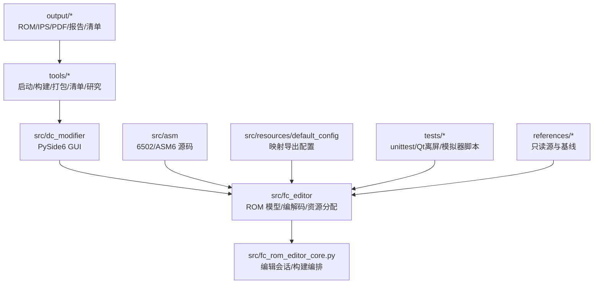
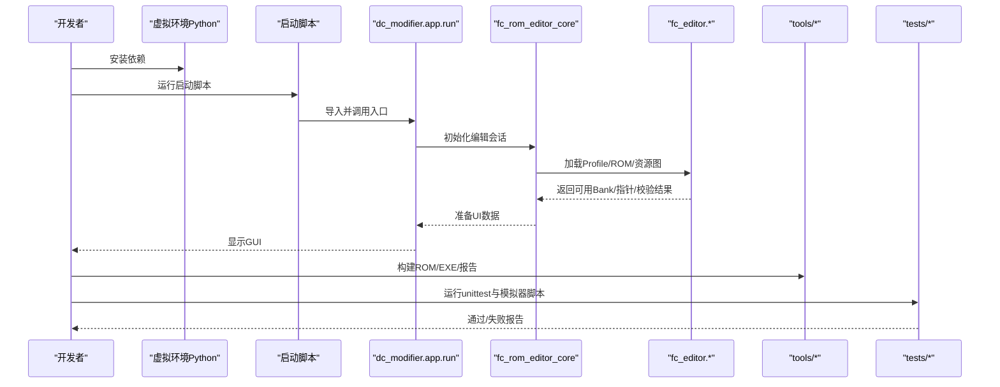
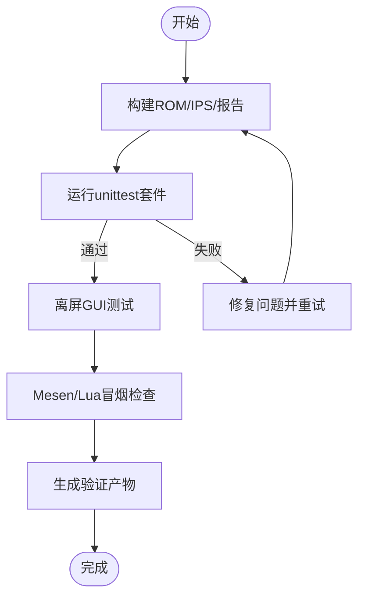
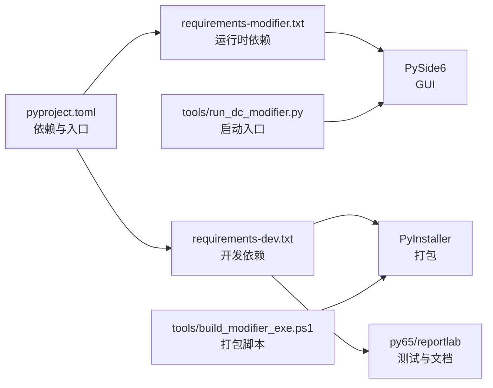

# 贡献指南

<cite>
**本文引用的文件**
- [pyproject.toml](file://pyproject.toml)
- [requirements-modifier.txt](file://requirements-modifier.txt)
- [requirements-dev.txt](file://requirements-dev.txt)
- [启动DC修改器.bat](file://启动DC修改器.bat)
- [tools/run_dc_modifier.py](file://tools/run_dc_modifier.py)
- [tools/build_modifier_exe.ps1](file://tools/build_modifier_exe.ps1)
- [AGENTS.md](file://AGENTS.md)
- [README.md](file://README.md)
- [docs/交接文档.md](file://docs/交接文档.md)
- [docs/提交记录.md](file://docs/提交记录.md)
- [tests/qt_test_case.py](file://tests/qt_test_case.py)
- [tests/test_dc_modifier.py](file://tests/test_dc_modifier.py)
</cite>

## 目录
1. [简介](#简介)
2. [项目结构](#项目结构)
3. [核心组件](#核心组件)
4. [架构总览](#架构总览)
5. [详细组件分析](#详细组件分析)
6. [依赖关系分析](#依赖关系分析)
7. [性能与构建注意事项](#性能与构建注意事项)
8. [故障排查指南](#故障排查指南)
9. [结论](#结论)
10. [附录：贡献清单与模板](#附录：贡献清单与模板)

## 简介
本贡献指南面向希望参与 DC 修改器开发与改进的社区开发者。内容涵盖开发环境搭建、代码规范、Git 工作流程、新功能开发流程、测试要求、文档贡献、行为准则与沟通渠道，帮助你在保证质量与一致性的前提下高效协作。

## 项目结构
仓库采用“核心五目录 + 独立参考输入”的组织方式：
- src：产品源码（GUI、ROM 模型、会话编排、汇编资源、默认配置）
- tools：启动、构建、打包、清单与研究脚本
- tests：单元、集成、GUI 与模拟器检查
- output：所有可再生成或交付产物
- docs：使用说明、设计、交接、研究与历史文档
- references：只读原始输入与历史参考

图表来源
- [README.md:59-112](file://README.md#L59-L112)
- [AGENTS.md:9-24](file://AGENTS.md#L9-L24)

章节来源
- [README.md:59-112](file://README.md#L59-L112)
- [AGENTS.md:9-24](file://AGENTS.md#L9-L24)

## 核心组件
- 桌面界面层：基于 PySide6/Qt 的 GUI，位于 src/dc_modifier/，负责数据编辑、工程管理与用户交互。
- ROM 模型与资源系统：位于 src/fc_editor/，提供 Profile、Bank/指针管理、编解码、资源图与分配器。
- 编辑会话与构建编排：src/fc_rom_editor_core.py，负责事务、撤销/重做、验证与最终 ROM/IPS 构建。
- 汇编与资源：src/asm/ 保存 6502/ASM6 源码；src/resources/default_config/ 保存映射导出配置。
- 工具链：tools/ 下包含启动、ROM 构建、EXE 打包、清单更新与验证脚本。
- 测试套件：tests/ 使用 unittest 进行单元、集成、离屏 GUI 与模拟器冒烟检查。

章节来源
- [README.md:43-57](file://README.md#L43-L57)
- [AGENTS.md:9-24](file://AGENTS.md#L9-L24)

## 架构总览
下图展示从源码到可执行应用的典型构建与运行路径，以及测试如何覆盖关键路径。

图表来源
- [tools/run_dc_modifier.py:7-25](file://tools/run_dc_modifier.py#L7-L25)
- [tools/build_modifier_exe.ps1:1-61](file://tools/build_modifier_exe.ps1#L1-L61)
- [tests/test_dc_modifier.py:46-68](file://tests/test_dc_modifier.py#L46-L68)

## 详细组件分析

### 开发环境与依赖
- Python 版本与包管理
  - 最低 Python 版本由项目定义；推荐使用虚拟环境隔离依赖。
  - 运行时依赖为 PySide6；可选开发依赖包括打包与辅助工具。
- 依赖清单
  - 运行依赖：requirements-modifier.txt
  - 开发依赖：requirements-dev.txt（包含运行依赖及额外工具）
  - 项目元数据：pyproject.toml 定义了包名、版本、入口点与可选依赖
- 快速开始
  - 创建虚拟环境并安装依赖
  - 使用启动脚本或命令行运行修改器
  - 如需构建 ROM/EXE/报告，再安装开发依赖并执行对应脚本

章节来源
- [pyproject.toml:5-23](file://pyproject.toml#L5-L23)
- [requirements-modifier.txt:1-3](file://requirements-modifier.txt#L1-L3)
- [requirements-dev.txt:1-5](file://requirements-dev.txt#L1-L5)
- [README.md:114-139](file://README.md#L114-L139)
- [启动DC修改器.bat:1-16](file://启动DC修改器.bat#L1-L16)

### 代码规范与命名约定
- 缩进与风格
  - 四空格缩进；优先使用类型提示；路径操作使用 pathlib.Path。
- 命名约定
  - 函数与模块使用 snake_case；常量使用 UPPER_SNAKE_CASE。
  - 测试文件以 test_ 前缀命名，按行为组织用例。
- 注释与可读性
  - 保持与周边代码一致的注释风格；变更聚焦且易于审查。
- 路径与可移植性
  - 优先使用相对于仓库根的路径，避免硬编码机器特定路径。
- 无格式化/静态检查强制
  - 未配置统一格式化工具，需遵循就近风格并保持改动最小化。

章节来源
- [AGENTS.md:41-45](file://AGENTS.md#L41-L45)

### Git 工作流程
- 分支策略
  - 建议按功能或修复创建独立分支；合并前确保测试通过。
- 提交信息规范
  - 简洁祈使句主题，例如“修复扩展银行调度”。
  - 正文说明影响范围、验证命令与产物变化。
- 拉取请求与审查
  - 描述受影响的 Bank、行为变化、验证结果与生成产物。
  - 二进制输出变更时附上前后哈希对比。
  - 避免公开分发受版权保护的 ROM，优先共享源码、报告与 IPS。

章节来源
- [AGENTS.md:53-55](file://AGENTS.md#L53-L55)
- [docs/提交记录.md:3-28](file://docs/提交记录.md#L3-L28)

### 新功能开发指南
- 功能提案
  - 在 PR 中明确目标、影响范围、风险评估与验收标准。
  - 如涉及 ROM 布局或音频行为，先阅读交接文档并评估兼容性。
- 开发工作流
  - 在 src/ 中添加产品代码；在 tests/ 添加相应测试；产物写入 output/。
  - 若涉及 ROM 构建，更新构建脚本并确保输出稳定可重复。
- 测试要求
  - 新增断言覆盖新 Bank、指针、大小或哈希不变量。
  - ROM 变更后运行构建器与完整测试套件，并按需执行模拟器冒烟检查。
- 文档更新
  - 任何用户可见变更需要同步更新使用说明与相关文档。

章节来源
- [AGENTS.md:7-8](file://AGENTS.md#L7-L8)
- [AGENTS.md:47-51](file://AGENTS.md#L47-L51)
- [docs/交接文档.md:147-183](file://docs/交接文档.md#L147-L183)

### 测试指南
- 单元测试
  - 使用 Python 标准库 unittest；测试发现路径为 tests/。
  - 对 ROM 身份、Profile、编解码器往返、资源图节点与分配器确定性进行断言。
- 集成测试
  - 覆盖工程保存/载入、资源分配、跨区回退、撤销/重做与非法裸写拦截。
- GUI 测试
  - 使用 QtTestCase 确保窗口生命周期确定性与资源释放。
- 性能与稳定性
  - 通过长时运行与帧级回放验证音频引擎与桥接逻辑。
- 模拟器冒烟
  - 使用 Mesen 0.9.9 与 Lua 脚本进行运行时验证，产物存放于 output/verification/。

图表来源
- [tests/test_dc_modifier.py:46-68](file://tests/test_dc_modifier.py#L46-L68)
- [tests/qt_test_case.py:1-29](file://tests/qt_test_case.py#L1-L29)
- [docs/交接文档.md:147-183](file://docs/交接文档.md#L147-L183)

章节来源
- [tests/test_dc_modifier.py:46-68](file://tests/test_dc_modifier.py#L46-L68)
- [tests/qt_test_case.py:1-29](file://tests/qt_test_case.py#L1-L29)
- [docs/交接文档.md:147-183](file://docs/交接文档.md#L147-L183)

### 文档贡献
- 编写规范
  - 面向用户的操作步骤、截图与限制说明应清晰准确。
  - 技术文档需标注 ROM 身份、Bank 布局、地址与容量等关键信息。
- 翻译流程
  - 保持术语一致性；对照原文核对语义；必要时附注差异。
- 审核标准
  - 与使用说明同步更新；与构建产物和测试结果保持一致。
  - 禁止在 references/ 中修改只读素材；产物写入 output/。

章节来源
- [AGENTS.md:7-8](file://AGENTS.md#L7-L8)
- [README.md:164-172](file://README.md#L164-L172)

### 社区行为准则与沟通渠道
- 尊重与包容
  - 以建设性方式讨论技术与体验问题。
- 透明与可追溯
  - 变更需附带理由、影响范围与验证结果。
- 安全与合规
  - 不公开传播受版权保护的内容；优先分享源码、报告与补丁。
- 沟通渠道
  - 通过仓库 Issue/PR 进行问题反馈与方案讨论；在 PR 中引用相关文档与测试。

[本节为通用指导，不直接分析具体文件]

## 依赖关系分析
- 运行时依赖
  - PySide6 用于 GUI；Python 版本要求由项目定义。
- 构建与发布
  - PyInstaller 用于打包单文件 EXE；ASM6 用于音乐导入。
- 测试与验证
  - unittest 框架；py65 用于 6502 片段验证；reportlab 用于 PDF 手册生成。
- 入口与脚本
  - pyproject 定义控制台入口；启动脚本与 PowerShell 脚本协调运行与构建。

图表来源
- [pyproject.toml:5-23](file://pyproject.toml#L5-L23)
- [requirements-modifier.txt:1-3](file://requirements-modifier.txt#L1-L3)
- [requirements-dev.txt:1-5](file://requirements-dev.txt#L1-L5)
- [tools/run_dc_modifier.py:7-25](file://tools/run_dc_modifier.py#L7-L25)
- [tools/build_modifier_exe.ps1:1-61](file://tools/build_modifier_exe.ps1#L1-L61)

章节来源
- [pyproject.toml:5-23](file://pyproject.toml#L5-L23)
- [requirements-modifier.txt:1-3](file://requirements-modifier.txt#L1-L3)
- [requirements-dev.txt:1-5](file://requirements-dev.txt#L1-L5)
- [tools/run_dc_modifier.py:7-25](file://tools/run_dc_modifier.py#L7-L25)
- [tools/build_modifier_exe.ps1:1-61](file://tools/build_modifier_exe.ps1#L1-L61)

## 性能与构建注意事项
- 构建产物
  - 推荐 ROM 与基线 ROM 的 SHA-256 必须严格匹配，避免误用错误基线。
  - 构建器会验证源 ROM 身份，不会写回只读源或旧兼容基线。
- 模拟器兼容性
  - 当前使用 Mesen 0.9.9；FCEUX 2.6.6 存在 Mapper 194 高位 PRG Bank 回绕问题。
- 资源分配
  - 托管扩展空间由修改器统一登记、分配与验证；受保护 Bank 不得随意写入。
- 发布建议
  - 对外发布优先提供源码、报告和 IPS 补丁；避免公开可能受版权保护的 ROM。

章节来源
- [docs/交接文档.md:147-183](file://docs/交接文档.md#L147-L183)
- [README.md:31-42](file://README.md#L31-L42)

## 故障排查指南
- 启动失败
  - 检查是否已创建虚拟环境并安装依赖；查看启动脚本的错误提示。
  - 源码版需先安装 requirements-modifier.txt 中的依赖。
- 构建失败
  - 确认虚拟环境 Python、ASM6 与 PyInstaller 配置文件存在。
  - 检查 PyInstaller 输出目录与归档完整性；排除不兼容 DLL。
- 测试失败
  - 确认目标 ROM 与基线 ROM 的 SHA-256 正确；重新运行构建器与测试套件。
  - 对 ROM 布局或音频行为变更，执行交接文档中的 Mesen/Lua 冒烟检查。
- 常见问题定位
  - 使用 unittest 的 verbose 模式定位失败用例。
  - 将问题复现步骤、命令与产物（报告/日志/截图）附入 PR。

章节来源
- [启动DC修改器.bat:1-16](file://启动DC修改器.bat#L1-L16)
- [tools/run_dc_modifier.py:13-25](file://tools/run_dc_modifier.py#L13-L25)
- [tools/build_modifier_exe.ps1:10-49](file://tools/build_modifier_exe.ps1#L10-L49)
- [docs/交接文档.md:147-183](file://docs/交接文档.md#L147-L183)

## 结论
本指南提供了从环境搭建到代码规范、Git 流程、功能开发、测试与文档贡献的完整路径。请遵循仓库约束与交接文档，确保每次变更都可验证、可追溯、可复用。通过严格的测试与清晰的文档，共同维护 DC 修改器的质量与一致性。

[本节为总结性内容，不直接分析具体文件]

## 附录：贡献清单与模板
- 环境准备
  - 创建虚拟环境并安装运行依赖；如需构建与测试，安装开发依赖。
- 开发步骤
  - 在 src/ 添加功能；在 tests/ 添加用例；产物写入 output/。
- 提交与审查
  - 使用简洁祈使句主题；正文说明影响范围、验证命令与产物。
  - 二进制输出变更时附上前后哈希；避免公开受版权保护内容。
- 验证清单
  - 运行构建器与完整测试套件；执行必要的模拟器冒烟检查。
  - 更新使用说明与相关文档，确保与功能一致。

[本节为通用模板，不直接分析具体文件]