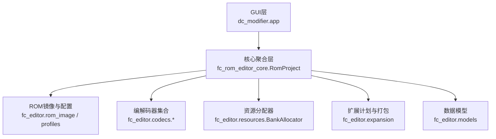
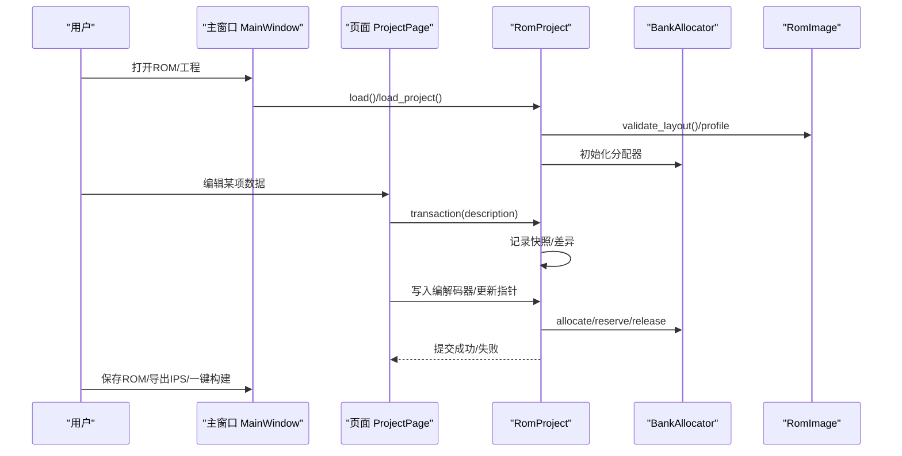
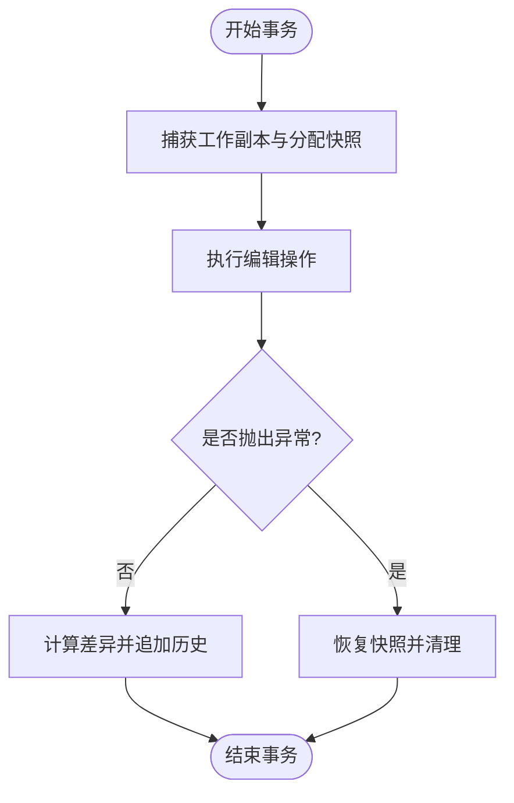
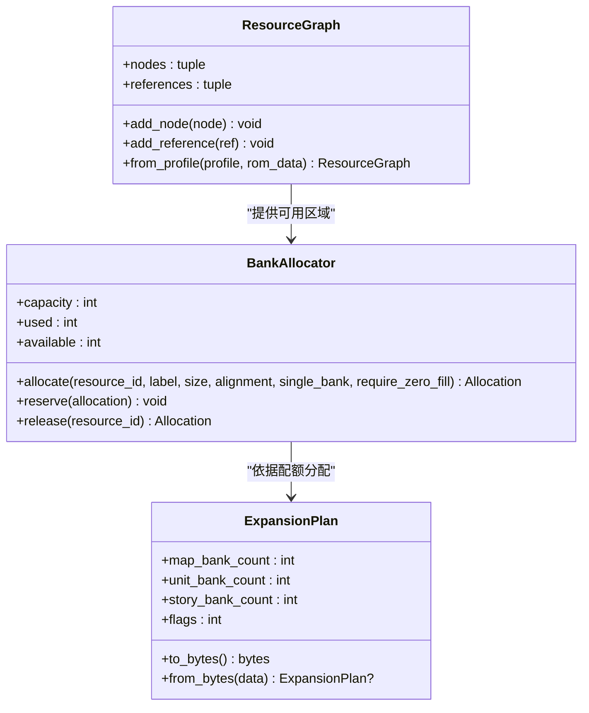
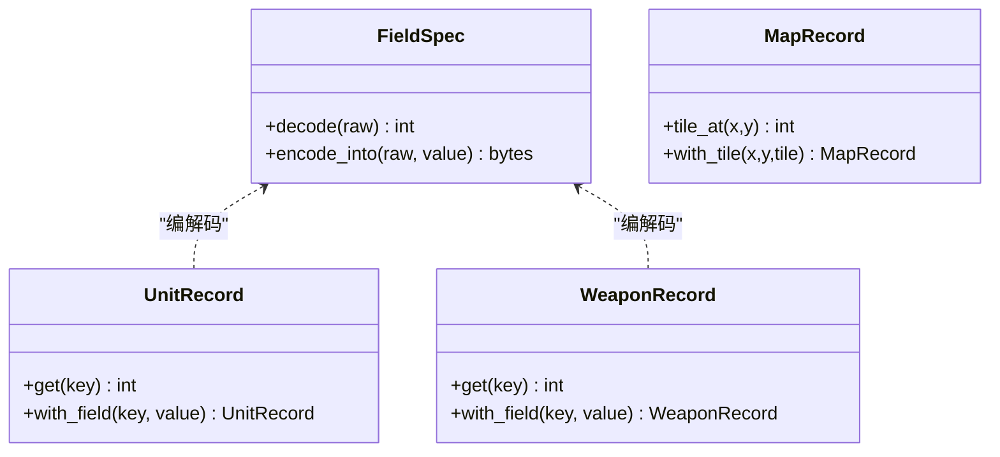
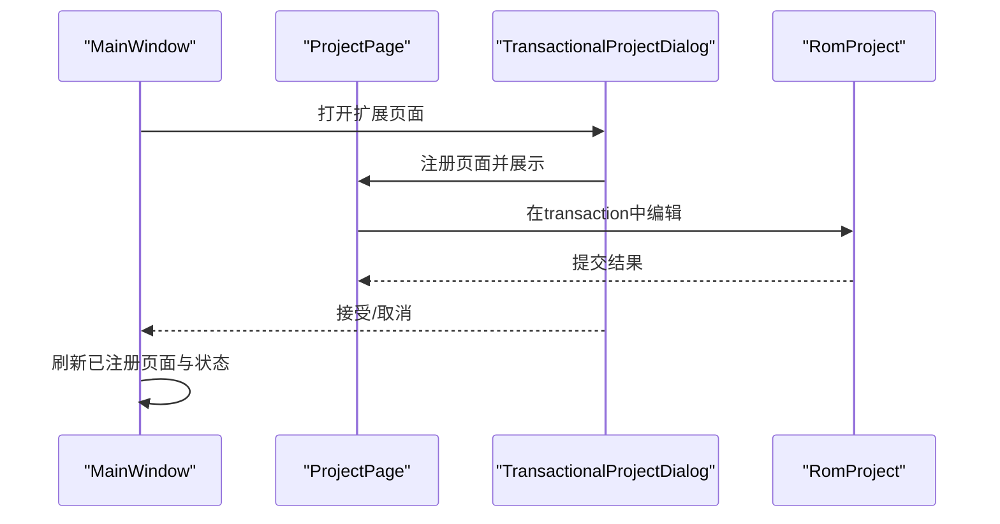
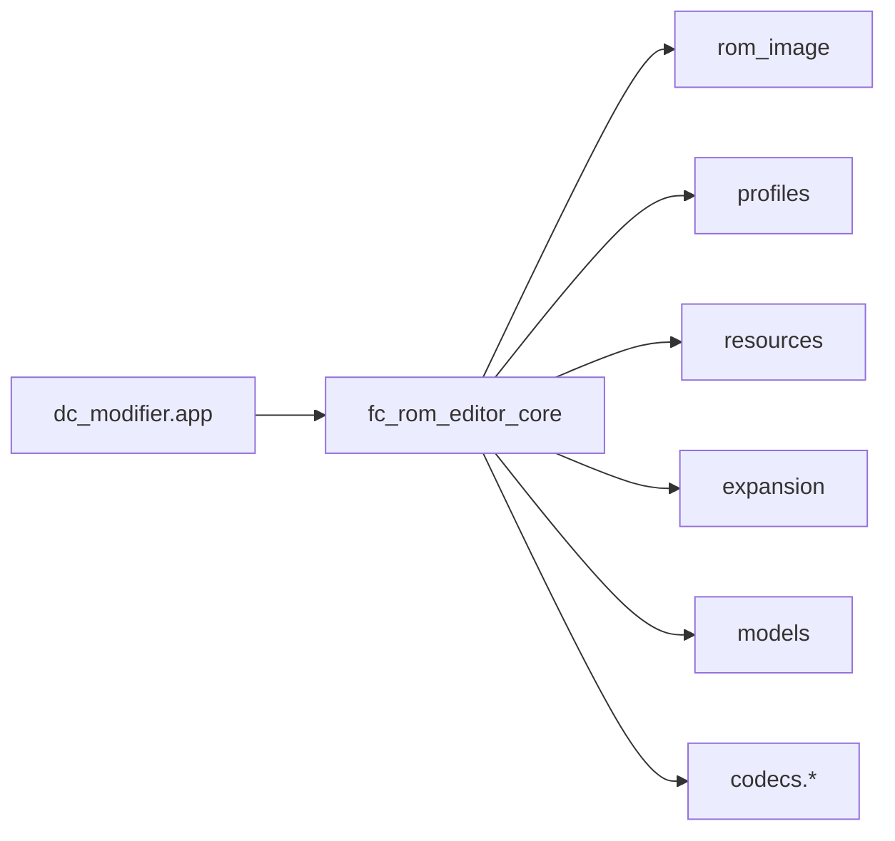

# 项目概述

<cite>
**本文引用的文件**
- [pyproject.toml](file://pyproject.toml)
- [requirements-modifier.txt](file://requirements-modifier.txt)
- [启动DC修改器.bat](file://启动DC修改器.bat)
- [tools/run_dc_modifier.py](file://tools/run_dc_modifier.py)
- [src/dc_modifier/app.py](file://src/dc_modifier/app.py)
- [src/fc_rom_editor_core.py](file://src/fc_rom_editor_core.py)
- [src/fc_editor/rom_image.py](file://src/fc_editor/rom_image.py)
- [src/fc_editor/resources.py](file://src/fc_editor/resources.py)
- [src/fc_editor/expansion.py](file://src/fc_editor/expansion.py)
- [src/fc_editor/models.py](file://src/fc_editor/models.py)
- [src/fc_editor/profiles.py](file://src/fc_editor/profiles.py)
</cite>

## 目录
1. [简介](#简介)
2. [项目结构](#项目结构)
3. [核心组件](#核心组件)
4. [架构总览](#架构总览)
5. [详细组件分析](#详细组件分析)
6. [依赖关系分析](#依赖关系分析)
7. [性能考量](#性能考量)
8. [故障排查指南](#故障排查指南)
9. [结论](#结论)
10. [附录：快速开始](#附录：快速开始)

## 简介
本项目是面向FC游戏《第二次机器人大战》新DC篇扩容版的ROM修改器，提供Windows桌面端编辑能力。项目基于Python与PySide6构建，围绕“多页面编辑器 + ROM镜像处理 + 编解码器系统 + 资源分配管理 + 事务机制”的核心能力，实现对机体、武器、地图、剧情文本、事件脚本、劝降规则、音乐等资源的可视化编辑与打包输出。

技术栈选择要点：
- PySide6：成熟的Qt桌面框架，便于实现多页面、对话框、状态栏、拖放与菜单等交互。
- FamiStudio音频支持：通过配置与汇编桥接，为双引擎（MMC5/Mapper 194）提供可替换的战斗曲槽位与自定义曲目导入能力。
- py65（可选开发依赖）：用于模拟器集成与验证场景（非运行时必需）。

整体目标：在安全、可回滚、可审计的前提下，对扩容版ROM进行结构化编辑，并输出可复用的工程文件、IPS补丁或完整ROM。

章节来源
- [pyproject.toml:5-23](file://pyproject.toml#L5-L23)
- [requirements-modifier.txt:1-3](file://requirements-modifier.txt#L1-L3)

## 项目结构
仓库采用分层模块化组织：
- src/dc_modifier：PySide6 GUI应用与页面（地图、机体、人物、武器、剧情、事件、劝降、音乐、概览、容量规划、变更与验证等）。
- src/fc_editor：ROM镜像、配置文件、模型、编解码器、资源分配、扩展计划、校验服务等底层能力。
- src/fc_rom_editor_core.py：高层聚合入口，封装RomProject、事务、撤销/重做、构建产物等。
- tools：运行脚本、打包与辅助工具。
- references：参考ROM、音频素材、研究资料等。
- tests：覆盖关键逻辑的测试集。

图表来源
- [src/dc_modifier/app.py:276-364](file://src/dc_modifier/app.py#L276-L364)
- [src/fc_rom_editor_core.py:463-618](file://src/fc_rom_editor_core.py#L463-L618)
- [src/fc_editor/rom_image.py:50-125](file://src/fc_editor/rom_image.py#L50-L125)
- [src/fc_editor/resources.py:280-413](file://src/fc_editor/resources.py#L280-L413)
- [src/fc_editor/expansion.py:84-318](file://src/fc_editor/expansion.py#L84-L318)
- [src/fc_editor/models.py:13-162](file://src/fc_editor/models.py#L13-L162)

章节来源
- [src/dc_modifier/app.py:276-364](file://src/dc_modifier/app.py#L276-L364)
- [src/fc_rom_editor_core.py:463-618](file://src/fc_rom_editor_core.py#L463-L618)

## 核心组件
- RomProject（核心聚合）
  - 负责加载ROM、初始化各编解码器、维护工作副本、资源分配器、事务与撤销/重做栈、只读输出根保护、构建产物生成。
  - 暴露统一接口供GUI页面调用，保证编辑一致性。
- RomImage（ROM镜像）
  - 校验iNES头、Mapper、大小、参考哈希；提供Bank地址到文件偏移转换与安全读取。
- BankAllocator（资源分配器）
  - 在Profile声明的可用PRG区域中进行确定性分配，支持对齐、单Bank约束、零填充检查与冲突检测。
- ExpansionPlan（扩展计划）
  - 将464 KiB可管理池按地图、机体、剧情进行配额划分，并绑定剧情组与标志位，支持序列化与校验。
- Models（数据模型）
  - 定义机体/武器字段规格、记录对象、地图/部署/剧情文本等数据结构，提供编码/解码与范围校验。
- Profiles（ROM配置）
  - 描述不同ROM布局（原版、时空之影II、MMC5、扩容MMC3 v1/v2），含指针表、存储区、受保护区域、自由区域、音乐槽等。

章节来源
- [src/fc_rom_editor_core.py:463-800](file://src/fc_rom_editor_core.py#L463-L800)
- [src/fc_editor/rom_image.py:50-125](file://src/fc_editor/rom_image.py#L50-L125)
- [src/fc_editor/resources.py:280-413](file://src/fc_editor/resources.py#L280-L413)
- [src/fc_editor/expansion.py:84-318](file://src/fc_editor/expansion.py#L84-L318)
- [src/fc_editor/models.py:13-162](file://src/fc_editor/models.py#L13-L162)
- [src/fc_editor/profiles.py:276-328](file://src/fc_editor/profiles.py#L276-L328)

## 架构总览
项目采用MVC风格的分层设计：
- 视图层（View）：PySide6主窗口与各页面（地图、机体、剧情、事件、劝降、音乐、概览、容量规划、变更与验证）。
- 控制器层（Controller）：MainWindow协调页面生命周期、打开对话框、执行命令、刷新状态。
- 模型层（Model）：RomProject聚合编解码器与资源分配器，提供领域操作；底层由RomImage、Profiles、Models支撑。

图表来源
- [src/dc_modifier/app.py:276-800](file://src/dc_modifier/app.py#L276-L800)
- [src/fc_rom_editor_core.py:463-800](file://src/fc_rom_editor_core.py#L463-L800)
- [src/fc_editor/rom_image.py:50-125](file://src/fc_editor/rom_image.py#L50-L125)
- [src/fc_editor/resources.py:280-413](file://src/fc_editor/resources.py#L280-L413)

## 详细组件分析

### 事务与撤销/重做机制
- 使用EditPatch与EditHistoryEntry记录字节级差异与分配变化。
- transaction上下文管理器在首次进入时捕获快照，异常时回滚工作副本与分配器，正常退出后合并为历史条目。
- undo/redo通过回放差异与重建分配器完成。

图表来源
- [src/fc_rom_editor_core.py:676-785](file://src/fc_rom_editor_core.py#L676-L785)

章节来源
- [src/fc_rom_editor_core.py:676-785](file://src/fc_rom_editor_core.py#L676-L785)

### 资源分配与容量规划
- BankAllocator在Profile声明的自由PRG区域中按对齐、单Bank、零填充等策略分配资源，避免重叠与越界。
- ExpansionPlan将地图、机体、剧情三类资源在464 KiB池中配额化，并绑定剧情组与标志位，支持序列化为元数据。
- ResourceGraph从Profile构建资源图，统一管理指针表、受保护区域、自定义音乐槽等。

图表来源
- [src/fc_editor/resources.py:280-413](file://src/fc_editor/resources.py#L280-L413)
- [src/fc_editor/expansion.py:84-318](file://src/fc_editor/expansion.py#L84-L318)
- [src/fc_editor/resources.py:47-260](file://src/fc_editor/resources.py#L47-L260)

章节来源
- [src/fc_editor/resources.py:280-413](file://src/fc_editor/resources.py#L280-L413)
- [src/fc_editor/expansion.py:84-318](file://src/fc_editor/expansion.py#L84-L318)
- [src/fc_editor/resources.py:47-260](file://src/fc_editor/resources.py#L47-L260)

### 编解码器系统与数据模型
- 编解码器按数据类型划分（机体、武器、地图、剧情文本、事件、劝降、CHR、音乐等），由RomProject根据Profile动态装配。
- 数据模型以FieldSpec/Record形式表达字段宽度、掩码、位移、取值范围与证据等级，确保编辑安全。
- 地图与部署数据通过pack_*函数压缩与打包，保证单Bank容量限制与指针表正确性。

图表来源
- [src/fc_editor/models.py:13-162](file://src/fc_editor/models.py#L13-L162)
- [src/fc_editor/models.py:165-203](file://src/fc_editor/models.py#L165-L203)
- [src/fc_editor/models.py:309-342](file://src/fc_editor/models.py#L309-L342)

章节来源
- [src/fc_editor/models.py:13-162](file://src/fc_editor/models.py#L13-L162)
- [src/fc_editor/models.py:165-203](file://src/fc_editor/models.py#L165-L203)
- [src/fc_editor/models.py:309-342](file://src/fc_editor/models.py#L309-L342)

### GUI与页面架构
- 主窗口维护页面注册表与工作区，支持导航、状态栏坐标显示、未保存变更提示。
- 页面通过信号与主窗口通信，重要编辑在TransactionalProjectDialog中执行，确保事务边界清晰。
- 扩展功能（音乐、导入、概览、容量规划、变更与验证）以独立对话框形式提供，便于复用与测试。

图表来源
- [src/dc_modifier/app.py:276-653](file://src/dc_modifier/app.py#L276-L653)

章节来源
- [src/dc_modifier/app.py:276-653](file://src/dc_modifier/app.py#L276-L653)

### 构建与输出
- 支持导出IPS补丁、另存ROM、一键构建发布包。
- 原子写入保障文件完整性，SHA-256用于基准ROM校验与报告。

章节来源
- [src/fc_rom_editor_core.py:386-461](file://src/fc_rom_editor_core.py#L386-L461)

## 依赖关系分析
- 运行时依赖：PySide6（GUI）、可选pyinstaller（打包）。
- 开发依赖：py65（模拟器集成）、reportlab（文档生成）。
- 模块耦合：
  - app.py依赖fc_rom_editor_core与多个页面模块。
  - fc_rom_editor_core聚合rom_image、resources、expansion、models、profiles与codecs。
  - profiles定义ROM布局，被rom_image与上层组件共同消费。

图表来源
- [src/dc_modifier/app.py:1-59](file://src/dc_modifier/app.py#L1-L59)
- [src/fc_rom_editor_core.py:15-105](file://src/fc_rom_editor_core.py#L15-L105)

章节来源
- [pyproject.toml:5-23](file://pyproject.toml#L5-L23)
- [src/dc_modifier/app.py:1-59](file://src/dc_modifier/app.py#L1-L59)
- [src/fc_rom_editor_core.py:15-105](file://src/fc_rom_editor_core.py#L15-L105)

## 性能考量
- 资源分配采用确定性首适配算法，避免复杂搜索开销；单Bank约束减少跨Bank跳转成本。
- 地图与指针表打包时按Bank边界切分，控制单次写入规模，降低内存占用。
- 事务机制仅记录差异，减少撤销/重做的数据拷贝成本。
- 建议：
  - 批量编辑尽量包裹在单一事务中，减少多次快照与差异计算。
  - 大资源分配前预估容量，避免反复尝试导致的无效循环。
  - 使用只读输出根防止误写参考目录，提升安全性与稳定性。

[本节为通用指导，不直接分析具体文件]

## 故障排查指南
- ROM校验失败
  - iNES头非法、大小不符、Mapper不匹配、参考哈希不一致等会抛出格式化错误。
  - 扩容版需通过固定代码签名与音频引擎哈希校验。
- 分配失败
  - 资源ID重复、名称为空、对齐非法、超出可用区域、与已有分配重叠、空间不足等。
- 事务异常
  - 事务内抛错将自动回滚至进入前的快照，保持工作副本一致。
- 常见定位方法
  - 查看状态栏消息与错误对话框。
  - 使用“完整检查”功能定位潜在问题。
  - 通过“变更与验证”页查看差异与报告。

章节来源
- [src/fc_editor/rom_image.py:79-125](file://src/fc_editor/rom_image.py#L79-L125)
- [src/fc_editor/resources.py:334-413](file://src/fc_editor/resources.py#L334-L413)
- [src/fc_rom_editor_core.py:676-785](file://src/fc_rom_editor_core.py#L676-L785)

## 结论
本项目以清晰的层次化架构与严格的ROM布局校验为基础，结合事务化编辑与资源分配管理，为《第二次机器人大战》新DC篇扩容版提供了稳定、可扩展的ROM编辑体验。通过多页面GUI、编解码器体系与FamiStudio音频支持，用户可高效完成内容定制与发布。

[本节为总结性内容，不直接分析具体文件]

## 附录：快速开始
- 环境准备
  - 创建虚拟环境并安装依赖（见requirements-modifier.txt）。
  - 使用提供的批处理脚本启动修改器。
- 启动方式
  - 双击“启动DC修改器.bat”，若存在已构建的可执行文件则直接运行；否则通过虚拟环境中的Python执行启动脚本。
- 基本流程
  - 打开ROM或工程文件。
  - 在相应页面进行编辑（如地图、机体、剧情、事件、劝降、音乐等）。
  - 使用“工程”菜单保存工程、导出IPS或一键构建。
  - 通过“变更与验证”页查看差异与完整性检查结果。

章节来源
- [requirements-modifier.txt:1-3](file://requirements-modifier.txt#L1-L3)
- [启动DC修改器.bat:1-16](file://启动DC修改器.bat#L1-L16)
- [tools/run_dc_modifier.py:1-30](file://tools/run_dc_modifier.py#L1-L30)
- [src/dc_modifier/app.py:276-800](file://src/dc_modifier/app.py#L276-L800)