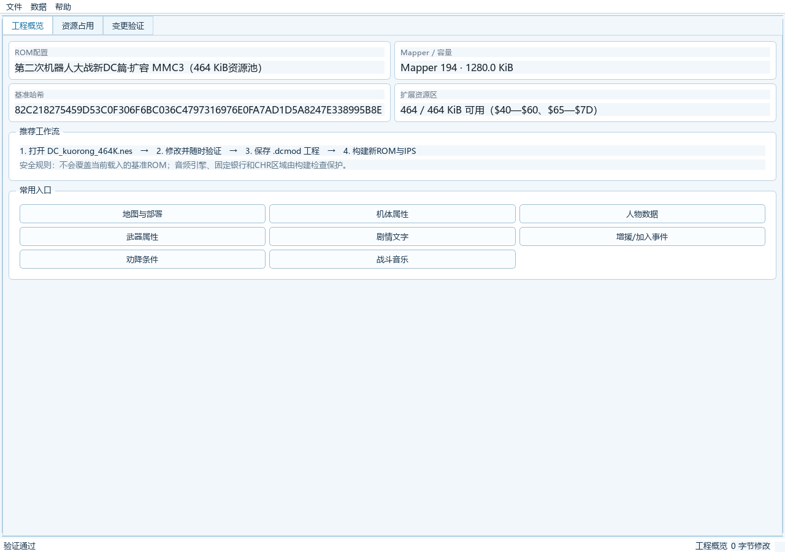
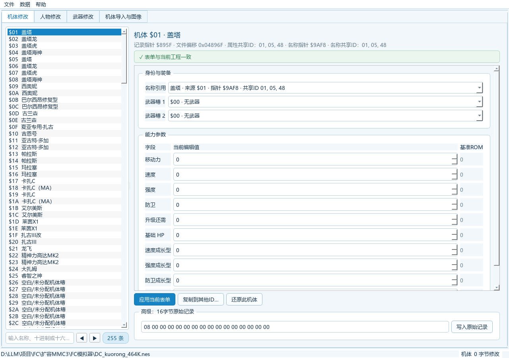
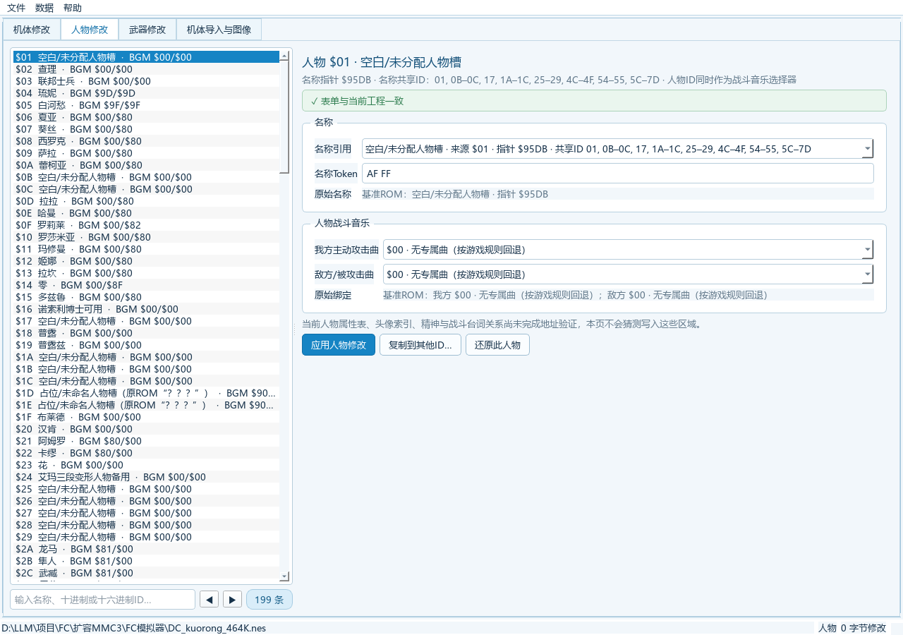
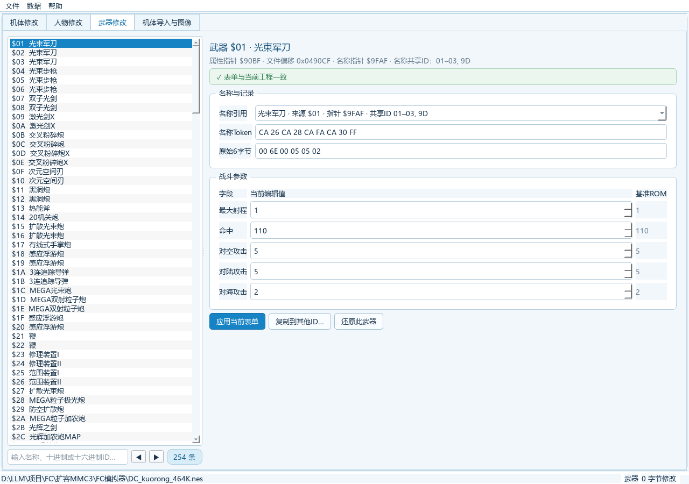
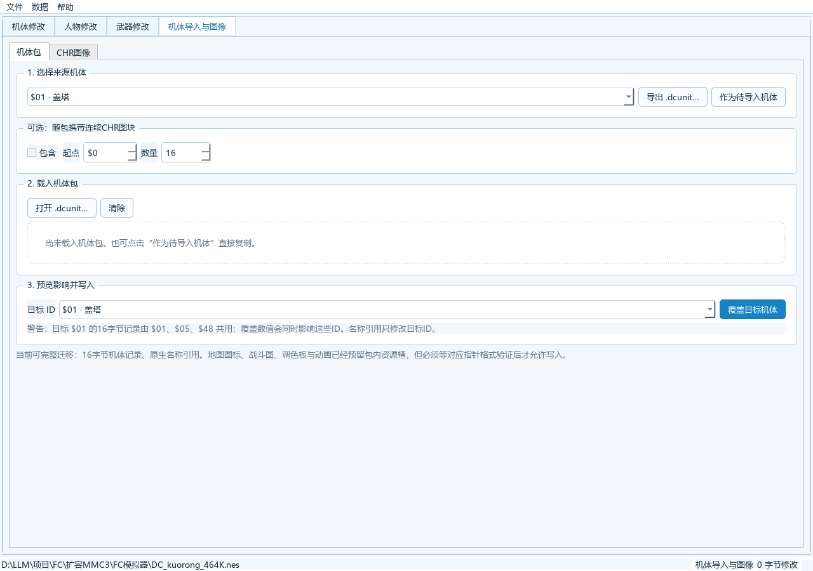
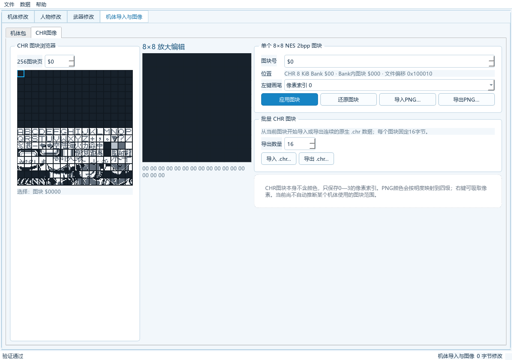
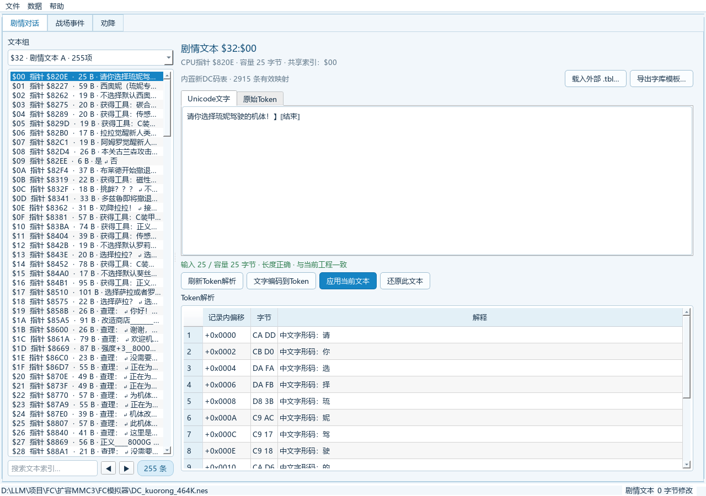
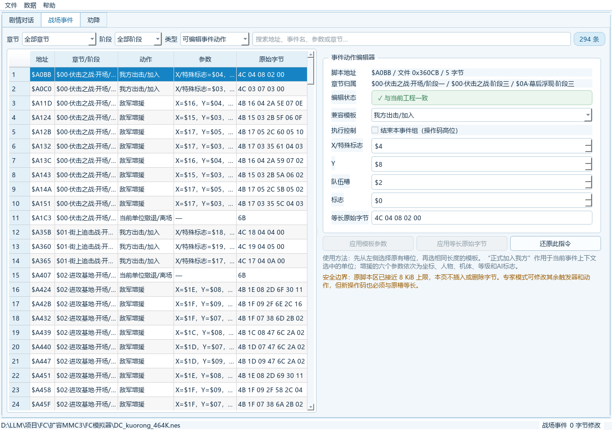
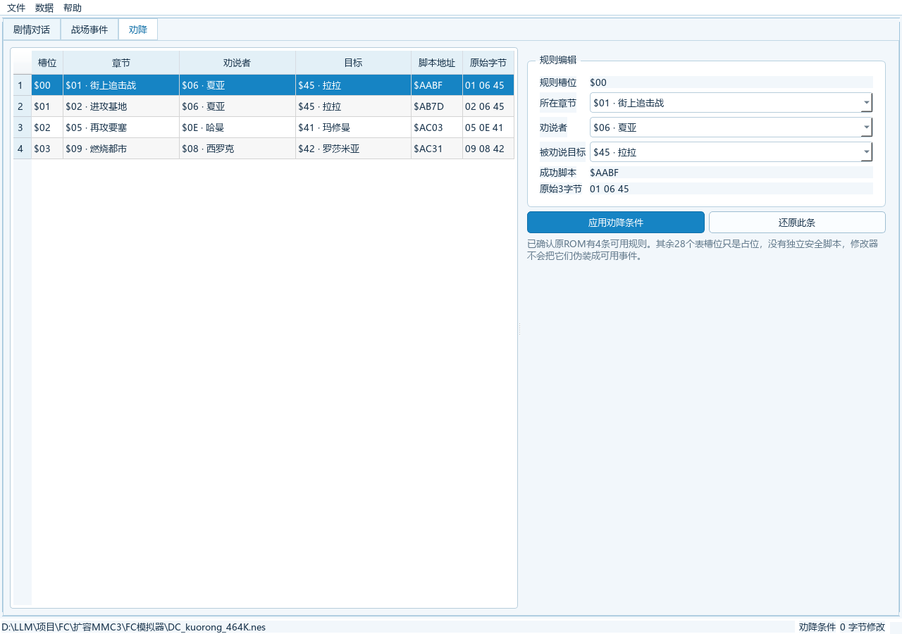
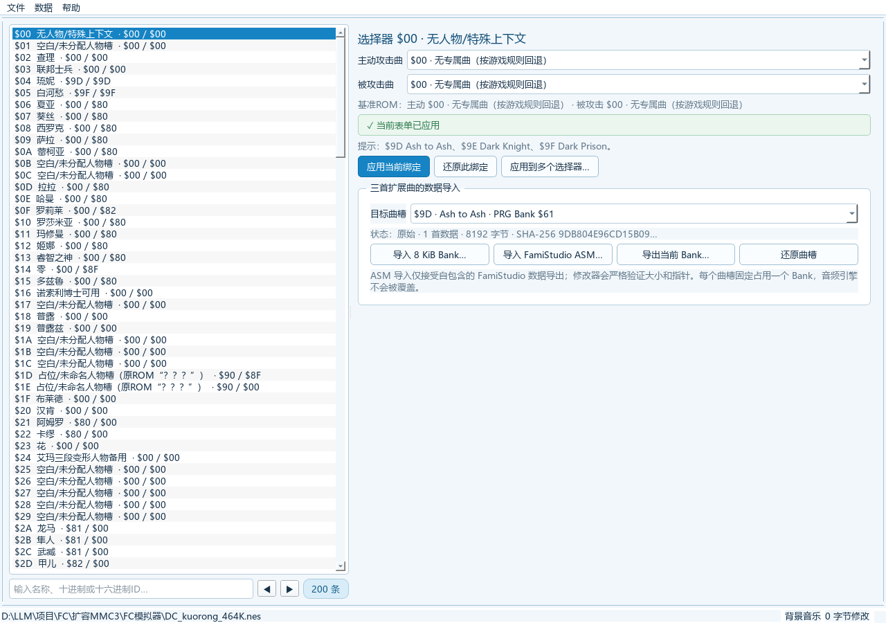

# 新DC篇完整修改器 2.2：图文使用说明

本工具用于编辑扩容后的《第二次机器人大战》新 DC 篇 ROM，支持机体、人物、武器、剧情、地图与部署、战场事件、劝降、背景音乐、CHR 图像和扩展资源。界面沿用旧版 SRW2 修改器的布局：通过“数据”菜单切换大类，同类页面使用顶部页签，左侧选择记录，右侧编辑参数，底部提供操作和状态提示。

> **重要：**页面中的“应用”只把改动写入当前内存工程，并不等于保存 `.dcmod`，也不会直接修改磁盘上的 ROM。完成编辑后仍须保存工程并构建新 ROM。

## 1. 使用前准备

推荐保持以下目录结构：

```text
FC模拟器/
├─ 新DC篇完整修改器.exe
├─ DC_kuorong_464K.nes     推荐基线，464 KiB 托管资源池
└─ DC_kuorong.nes          旧版兼容基线，200 KiB 托管资源池
```

单独复制 EXE 也能启动，不需要安装 Python 或 Qt；但实际编辑时必须通过“文件 → 打开ROM”选择兼容 ROM。“464 KiB/200 KiB”指可托管资源池容量，不是 ROM 文件大小；两个基线 ROM 均为 1,310,736 字节。

双击 `FC模拟器/新DC篇完整修改器.exe` 或运行 `启动DC修改器.bat`。正常情况下会自动打开推荐基线。



*工程概览会显示 Mapper、ROM 容量、基准哈希和当前可用扩展空间。*

## 2. 主界面与安全工作流

顶部菜单分为三组：

| 菜单 | 用途 |
|---|---|
| 文件 | 打开 ROM/工程、保存工程、输出 ROM、导出 IPS、一键构建 |
| 数据 | 打开各编辑器、完整检查、撤销和重做 |
| 帮助 | 查看版本和安全说明 |

推荐每次都按以下顺序操作：

1. 打开 `DC_kuorong_464K.nes`。
2. 立即使用“文件 → 工程另存为”建立 `.dcmod` 工程。
3. 在功能页修改数据，并点击该页的“应用”。
4. 按 `F7` 运行完整检查，处理全部错误。
5. 按 `Ctrl+S` 保存工程。
6. 使用“文件 → 一键构建”生成新 `.nes`、`.ips`、工程副本和报告。
7. 用 Mesen 0.9.9 实际进入战斗、剧情或地图验证。

窗口标题出现 `*` 表示工程尚未保存。修改器会阻止覆盖当前载入的基准 ROM；仍请把输出命名为新文件，切勿选择 `DC_kuorong_464K.nes` 或 `DC_kuorong.nes` 作为输出目标。

## 3. 地图、部署与商店事件


*左上编辑地图内容，左下选择关卡，右侧显示完整地图。*

1. 在左下关卡列表选择地图，可按名称或 ID 搜索。
2. “战场地图”页选择逻辑图块后，在右侧左键连续绘制；右键读取现有图块。
3. 默认勾选“全景适应”，地图会完整显示。取消后可手动调整缩放并滚动查看细节。
4. “初始配置”页分别编辑敌军、客军和我方出击位。
5. “商店事件”页编辑坐标、限定人物和事件/商店编号。
6. 点击“应用地图、部署与事件”，一次提交当前关卡的待应用改动。

地图 RLE 重新编码后不得超过原槽容量；界面会在应用前阻止超限。部署点会同步叠加到地图预览上，修改坐标后应检查是否落在有效格内。

## 4. 机体、人物与武器

### 4.1 机体



在左侧选择机体，搜索框位于列表底部。右侧可修改名称引用、两个武器槽以及已确认的移动力、速度、强度、防卫、HP 和成长字段。右侧“基准ROM”列用于对照原值。

点击“应用当前表单”后再切换记录。名称和属性记录可能被多个机体 ID 共用，复制或覆盖前应阅读标题下方的共享 ID 提示。“写入原始记录”属于高级操作，只应填写完整且已验证的 16 字节记录。

### 4.2 人物



人物页用于修改名称引用及主动攻击/被攻击时的战斗音乐。当前未完全确认的人物能力、头像和对白关联不会被猜测写入。修改后点击“应用人物修改”。

### 4.3 武器



武器页可编辑最大射程、命中以及对空、对陆、对海攻击值。先核对名称和原始 6 字节记录，再修改数值并点击“应用当前表单”。需要批量复用时可使用“复制到其他ID”。

## 5. 导入机体与编辑 CHR 图像



`.dcunit` 用于迁移机体记录和相关资源：

1. 选择来源机体，按需勾选连续 CHR 图块范围。
2. 点击“导出 .dcunit…”保存包，或点击“作为待导入机体”直接复制。
3. 打开外部 `.dcunit` 后，先查看资源摘要和共享 ID 警告。
4. 选择目标 ID，确认影响范围后再点击“覆盖目标机体”。



*CHR 页提供 256 图块总览、8×8 放大绘制和 PNG/CHR 导入导出。*

NES CHR 图块只有 0–3 四级像素索引，不自带颜色。左键使用当前像素索引绘制，右键吸取像素；完成后点击“应用图块”。PNG 导入会按亮度映射到四级。修改器不会自动推断一个机体使用的全部动画图块，批量导入前必须确认连续范围。

## 6. 剧情文本



1. 选择文本组，再从左侧选择文本索引。
2. 在“Unicode文字”页直接编辑中文；“原始Token”页用于核对字节。
3. 查看“输入/容量”提示，编码后的字节数必须与原记录容量完全相等。
4. 点击“文字编码到Token”预览编码，再点击“应用当前文本”。

内置码表含 2915 项有效映射。未确认语义的控制参数会以原始字节形式保留，不应随意删除。外部 `.tbl` 只应来自同一 ROM 版本；载入前可先导出字库模板。

## 7. 战场事件与劝降

### 7.1 战场事件



顶部可按章节、阶段、事件类型或地址搜索。选中左侧指令后，右侧显示脚本地址、所属章节、兼容模板和参数。

- 先选择与原指令**等长**的兼容模板，再按界面字段标签填写参数。
- 不同操作码的参数顺序可能不同，例如别名 `$75/$76` 与 `$4A/$4B` 并不一致；不要凭固定顺序手填原始字节。
- 已知操作会显示中文语义和兼容模板；未确认项会明确标为“保留条件”或“扩展事件指令”，只能在专家模式下等长编辑原始字节。
- 稳定模式只能等长替换，不能插入、删除或重排脚本。
- 专家模式可修改其余触发器和动作，但仍受 8 KiB 脚本区及跳转边界限制。

### 7.2 劝降



当前仅开放 ROM 中 4 条已确认可用的规则。选择规则后修改章节、劝说者和目标，再点击“应用劝降条件”。其余 28 个表槽只是占位，没有独立安全脚本，修改器不会把它们伪装成可用事件。

## 8. 背景音乐



左侧有 200 个战斗音乐选择器。右侧分别设置主动攻击曲和被攻击曲，点击“应用当前绑定”；“应用到多个选择器”适合批量配置。

三首扩展曲固定使用：

| 命令 | 曲目 | PRG Bank |
|---:|---|---:|
| `$9D` | Ash to Ash | `$61` |
| `$9E` | Dark Knight | `$62` |
| `$9F` | Dark Prison | `$63` |

每个曲槽固定占一个 8 KiB Bank。可导入已组装的 8192 字节 `.bin`，或不含外部引用的自包含 FamiStudio ASM6 数据。导入后必须完整检查，并在 Mesen 中验证播放、音效和切回旧曲。

当前推荐基线中，选择器 `$04` 的主动/被攻击音乐都已绑定 `$9D`，选择器 `$05` 都已绑定 `$9F`，`$9E` 尚未绑定。替换 `$9D` 或 `$9F` 曲槽会直接影响这些现有用途，操作前应先导出当前 Bank 备份。

## 9. 扩展资源空间


推荐基线提供 Bank `$40–$60` 和 `$65–$7D`，合计 464 KiB 托管空间。导入二进制资源时，修改器会记录唯一资源 ID、名称、文件范围、Bank、大小和 SHA-256，并通过确定性分配避免重叠。

“导入二进制资源”只负责安全存储数据，不会自动修改游戏代码或指针。资源必须由相应的地图、剧情或引擎功能引用后，游戏才会使用它。资源分配器不会占用 `$61–$64` 或 `$7E–$7F`；其中 `$61–$63` 是专用音乐槽，`$64` 与 `$7E–$7F` 是受保护程序区。

## 10. 变更检查、保存与输出


按 `F7` 或点击“运行完整检查”。上半区列出实际字节改动，下半区显示地图事件、音乐、章节事件、劝降和空间分配结果：

- **错误**：必须处理，不能进入正式构建。
- **警告**：需要人工确认风险。
- **通过/信息**：结构检查通过，但仍不替代游戏内验证。

| 输出方式 | 结果 | 是否自动完整检查 |
|---|---|---|
| 保存工程 | `.dcmod`，保存可重放操作和资源分配 | 否 |
| 输出ROM | 单独的 `.nes` | 否 |
| 导出IPS | 相对基准 ROM 的补丁 | 否 |
| 一键构建 | `.nes`、`.ips`、`.dcmod`、JSON 报告 | 是，存在错误会停止 |

覆盖既有 ROM 输出或一键构建产物时会创建带时间戳的 `.bak`；单独“导出IPS”不会创建备份。因此仍建议每次使用新的输出名称。

## 11. 常见问题

### EXE 能打开，但没有载入 ROM

选择“文件 → 打开ROM”，手动指定兼容基线。把 EXE 与两个 ROM 保持在交付包的 `FC模拟器` 目录中，可恢复自动载入。

### 修改器拒绝打开刚刚输出的 ROM

这是基准身份保护。修改器只接受字节完全匹配的干净基线，已修改或已构建 ROM 不能作为下一次输入。继续工作时应重新打开相应的干净基线，再通过“文件 → 打开工程”载入 `.dcmod`；旧版工程应先手动打开旧版基线。

### 点击“应用”后磁盘 ROM 没变化

这是正常行为。“应用”只更新内存工程；随后要保存 `.dcmod`，再输出 ROM 或执行一键构建。

### 地图仍出现滚动条

勾选右下角“全景适应”。只有取消该选项并手动放大时才需要滚动查看。

### 文本或地图无法应用

查看容量提示。剧情文本编码后的字节数必须与原记录容量完全相等；地图重新压缩后不能超过原 RLE 槽。文本过长时缩短内容，文本过短时保留合适的空白/控制 Token；地图超限时减少造成低压缩率的零散图块修改。

### 事件按钮不可用

确认已选中可编辑动作，并使用与原指令长度兼容的模板。当前版本不支持任意新增或删除事件字节。

### FCEUX 中出现银行回绕或画面异常

扩容版需要正确支持 1 MiB PRG 的 Mapper 194 实现。已验证模拟器为 Mesen 0.9.9；FCEUX 2.6.6 不适合验证本 ROM。

## 12. 常用快捷键

| 快捷键 | 功能 |
|---|---|
| `Ctrl+O` | 打开 ROM |
| `Ctrl+S` | 保存工程 |
| `Ctrl+Alt+S` | 输出 ROM |
| `Ctrl+B` | 一键构建 |
| `Ctrl+Z` / `Ctrl+Y` | 撤销 / 重做 |
| `F7` | 完整检查 |
| `Ctrl+1` | 地图与部署 |
| `Ctrl+2` / `Ctrl+9` / `Ctrl+3` | 机体 / 人物 / 武器 |
| `Ctrl+4` / `Ctrl+5` | 剧情文本 / 战场事件 |
| `Ctrl+6` / `Ctrl+7` | 背景音乐 / 机体导入与图像 |
| `Ctrl+8` | 工程概览 |

最后检查：基线 ROM 已保留、工程已保存、完整检查无错误、输出使用新文件名，并已在 Mesen 中覆盖实际修改场景。`build/nsf/新DC.nes` 是只读源素材，禁止把它作为输出目标或原地修改。对外发布时优先提供 IPS、说明和报告，不直接分发可能受版权保护的 ROM。
