# 新DC篇完整修改器 3.0：图文使用说明

本工具用于编辑扩容后的 FC《第二次机器人大战》新 DC 篇 ROM。3.0 版恢复了参考 SRW2 修改器的窗口和操作顺序：先经过启动器，主窗口固定为战场地图，各类数据从“数据”菜单打开独立窗口；容量规划、机体包、音乐和工程验证等新功能集中在“扩展功能”或“工程”菜单。

> **安全原则：**修改器只在内存工程中编辑，并要求把结果保存为派生 ROM。当前打开的原 ROM 不会被覆盖。尚未完成地址和语义验证的旧版图像、动画、存档及其余未知表只读显示，绝不猜测写入。

> **复刻进度：**当前版本还不是 `SRW2_patched.exe` 的全功能一比一成品。菜单或窗口存在不代表功能已经对齐；逐项状态、参考控件和验收证据见 `docs/research/legacy-modifier/SRW2一比一复刻差异矩阵.md`。

> **2026-09-11 视频反馈优化：**改进地图对象联动、超容后的规划入口、数据库可读性与资源预览、剧情全局作用域/全文检索、窗口缩放与刷新性能；修正字模的真实编码，开放固定字模编辑。详细落实与仍未完成的功能见 `docs/research/legacy-modifier/视频反馈优化验收.md`。本轮没有更换 ROM 布局或音频引擎。

> **2026-09-11 截图反馈续改：**按“功能差异截图”逐项核对，补齐机体字段与配色、人物属性/精神/头像、武器特技与双方动画、战斗/系统/道具文字、成长和商店编辑；关卡设置改用实际分 Bank 指令，地图动画与规律读取真实记录，初始配置默认展示三组图标。各项容量和未完成项目以下文为准。

> **2026-09-11 全量读取补充：**“数据 → 完整ROM数据读取”一次索引机体、人物、武器、地图与部署、文字、动画和关卡事件，并提供覆盖当前内存镜像每个字节的 HEX 页。数据库和属性计算器默认选中有实际数据的记录；占位槽中的 `00` 会明确显示为 ROM 原值。

> **目录调整说明：**项目按 `src/`、`tools/`、`tests/`、`output/`、`docs/` 五个核心目录整理，并独立保留 `references/`。此前的目录迁移只调整归类和调用路径；当前功能变化以本说明和本轮验收记录为准。

## 1. 启动与打开 ROM

推荐保持以下目录结构：

```text
扩容MMC3/
├─ output/
│  ├─ app/新DC篇完整修改器.exe              当前修改器
│  ├─ rom/DC_kuorong_464K.nes               推荐基线，464 KiB 托管资源池
│  ├─ patches/                               IPS 输出
│  └─ reports/rom-build/                     构建报告
└─ references/
   └─ rom/baselines/DC_kuorong.nes           兼容基线，200 KiB 托管资源池
```

单独复制 `output/app/新DC篇完整修改器.exe` 可以启动，不需要另装 Python 或 Qt；实际编辑仍需一份兼容 ROM。两个基线文件都是 1,310,736 字节，“464 KiB/200 KiB”表示可由修改器管理的扩展资源池，不是文件总大小。


1. 双击 `output/app/新DC篇完整修改器.exe`，先出现精简启动页；页面只显示红色“作者 断月残心”和“进入修改器”按钮。
2. 点击“进入修改器”。此时主窗口为空，不会暗中自动载入 ROM。
3. 按 `Ctrl+O`，或选择“文件 → 打开”，再选择 `output/rom/DC_kuorong_464K.nes`。
4. 修改器会校验 iNES 头、Mapper 和受保护 Bank；身份不符时拒绝载入。

关闭主窗口会同时结束启动器会话；若仍有未保存修改，修改器会先询问是否放弃。

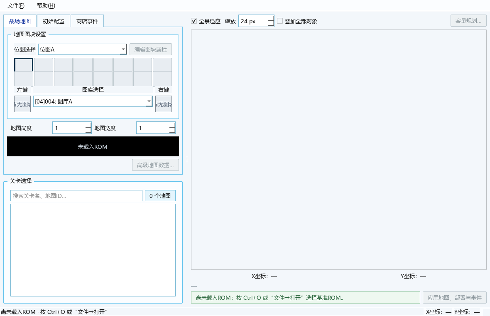

载入成功后，“数据”“扩展功能”和“工程”菜单才会出现。窗口标题显示当前基线路径，末尾 `*` 表示内存内容尚未保存为工程或派生 ROM。底部状态栏显示操作完成消息、修改字节数和地图草稿状态；数据库等窗口关闭后，只刷新当前页面，其余隐藏页面在访问时更新。

机体等记录列表在条目未增减时就地更新，不再每次暂存都清空重建；批量刷新结束后仅加载一次选中记录。带草稿跳转机体/武器时先保存目标编号，再暂存与刷新，避免读取已失效的列表项。

## 2. 主窗口：地图、初始配置与商店事件

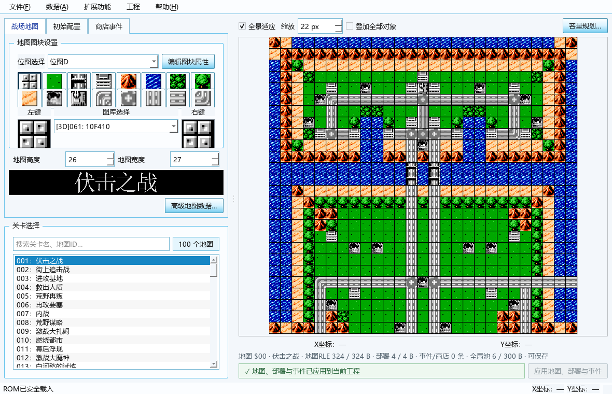

主窗口只承载地图工作流，左侧关卡列表和右侧地图在三个页签间保持不变：

- **战场地图：**选择真实图块后在地图上绘制。左键和右键是两套独立笔刷，可分别绘制或吸取；两侧画笔预览各显示一个逻辑图块的放大图，不再把同一图块重复平铺成 2×2。“全景适应”用于一次显示完整地图。关卡标题使用旧版游戏截图一致的宋体点阵风格和每字 40 像素单元显示；主地图页与剧情窗口共用同一渲染器。全部地图槽位会显示完整标题，不再因为通用 ROM 码表缺少“街”、数字或占位标签字符而漏字，也不会把 12×12 编辑字模机械放大成 4×4 粗块。
- **初始配置：**三组旧修改器图标图库改为按需展开，每组两行、每行 8 个图标；收起时把空间留给部署明细，展开后的预览黑底也只覆盖图标像素区，不再形成大黑边。敌军/客军六字节记录已按游戏真实顺序显示为“X、Y、驾驶员、机体、等级、标志”，机体记录 `+2` 是四图块地图小图标的首图块编号。地图直接显示敌军、客军及能由初始阵容确定的我方真实小图标；为避免透明色与复杂地形混在一起，真实像素外增加黑色高对比底板和阵营色边框，动态队伍槽则保留阵营标记，不猜测剧情运行时成员。部署明细默认展开并可收起，显示各阵营数量、机体/人物名称、等级和坐标。地图右键可直接编辑、删除已有部署，也可在空地新增敌军、客军或我方出击位；双击仍可编辑，左键拖动可改坐标。ROM 的 32 个初始配置表会逐关读取；空表明确说明单位由关卡事件生成，地图素材槽则明确说明没有独立部署记录。
- **商店事件：**切换到此页后，直接在地图格上右键可添加地图事件；已有紫色“事”或绿色“店”标记的格子可右键编辑、删除，同一格存在多条记录时会逐条列出。弹窗可切换“事件/商店”、选择限定人物和具体事件或商店，并允许用数值箭头微调坐标。双击已有标记同样直接打开该条记录；左侧列表用于定位，“打开全部事件记录”保留批量调整能力。空表明确表示该关没有记录，不是读取失败。所有改动仍先作为当前地图草稿，按“应用地图、部署与事件”后写入工程，并可撤销。

左下支持按关卡名/ID搜索，关卡区使用较大的固定最低高度，三个页签都能看到更多关卡。缩放、全景适应、容量、草稿状态与“应用地图、部署与事件”直接显示在主界面；放大后地图可滚动。在初始配置/事件模式点击空地不会误画地形。切换关卡时，合法草稿会自动提交到本次内存会话；尺寸、坐标、容量或 Token 不合法时会阻止切换，并保留当前表单供修正。保存或输出 ROM 前也会自动尝试提交当前地图草稿。

容量不够时，可从地图页“容量规划…”进入规划，超容草稿不会先被丢弃；返回后重新检查，再应用地图。例如默认第一关高度从 26 增加到 30 时，可先完成推荐分区，再提交扩大的地图。不会无提示占用其他类别的配额。

“编辑图块属性”已开放图库 A—G 的真实属性记录。颜色表1的三个 NES 色号同时显示实际色块、十六进制色号和四色组合预览；点击任一色块会展开随工具附带的 `FCEUX.pal` 完整 4×16、64 色面板，按 `$00—$0F`、`$10—$1F`、`$20—$2F`、`$30—$3F` 排列，也可在旁边直接输入色号。战场公用颜色表已由基准 ROM 的数据模板与运行时 `$0490—$049F` 双向验证：背景表为 `$0F $30 $10 $00`，颜色表2为 `$0F $30 $21 $02`，颜色表3为 `$0F $37 $27 $16`。窗口会显示颜色表2、3的真实只读四色条和完整色号；公用表不属于图库 A—G 的属性记录，所以本窗口不允许改写。旧版属性记录中的 `00/55/AA/FF` 字段会在“属性颜色表（原码）”列原样显示和写回，但参考修改器截图与模拟器游戏画面均证明它不能直接作为整个逻辑图块的预览调色板。顶部16个图库按钮、左右画笔、主地图及属性表图块缩略图因此统一按游戏内地形配色路由显示，避免草地和道路被错误染成蓝色；下拉框中的四色条只说明原码对应的颜色表，不代表左侧游戏效果缩略图必须使用该表。修改颜色表1真实色号时，实际使用该颜色组的游戏效果预览会按窗口草稿重绘，点“取消”前不会写入 ROM。每个图块仍可修改属性颜色表原码、防御补正、海属性以及空中、陆地、海上移动补正。`不能移动`、`不补正`、`补正1格`至`补正15格`分别对应已验证的 0—16 编码。应用后作为一次工程事务，可撤销/重做；“还原为打开 ROM 时的值”只恢复窗口草稿，仍需点“应用”。图库 H 没有确认到对应属性记录，因此仍为只读兼容预览。所有区域均已取消手工近似 RGB，统一使用 ROM 的真实 NES 色号。

图库 A—H 的位图0均按参考修改器与游戏画面固定使用背景表 `$0F $30 $10 $00`，在顶部图库、左右画笔、属性窗口和地图实例中显示为同一个灰阶背景块；不会再随图库主题错误显示为绿色、紫色或太空色。

所有游戏内颜色预览共用同一份随程序附带的 `FCEUX.pal`，测试会逐字节检查内置 64 色表与该文件一致。地图、地图图标、机体主体、碎片和人物正面头像均先读取 ROM 色号，再通过这份色表显示；透明/背景索引统一按 `$0F` 处理。头像分层 BMP 导出采用旧修改器约定的素材识别色，通用 CHR/字模编辑器采用便于辨认位平面的工作色，它们都不是游戏内调色板，不能据此判断实机颜色。

地图、部署和触发点可在容量规划后自动搬入地图分区。单条记录不能跨越一个 8 KiB PRG Bank，界面会在提交前检查边界和总配额。

## 3. “数据”菜单：参考工具的独立窗口

“数据”菜单保持参考工具的顺序和快捷键：

| 命令 | 快捷键 | 当前行为 |
|---|---:|---|
| 数据库 | `Ctrl+D` | 机体、人物、武器等六页独立窗口 |
| 完整ROM数据读取 | — | 七类结构化全表、文件偏移、完整原码及逐字节 HEX |
| 文字库 | `Ctrl+W` | ROM 点阵预览、固定字模绘制/替换、页点阵导入导出 |
| 地图动画 | `Ctrl+M` | 当前 ROM 动画、规律、调用位置及已验证参数编辑 |
| 文字转换 | `Ctrl+Z` | 文字与 Token 双向转换，不修改 ROM |
| 剧情事件 | `Ctrl+J` | 六页事件独立窗口 |
| 导出机体 | `Ctrl+F` | 导出所选机体 `.dcunit` 包 |
| 导出头像 | `Ctrl+L` | 按旧版目录和文件名导出人物正面/背面 BMP |
| 属性计算器 | — | 使用当前人物、机体和武器做估算 |
| 存档修改器 | — | 读取存档结构；写入尚未验证，因此只读 |
| 其他 | `Ctrl+T` | 编辑已验证的双击/伤害/命中公式、11 项道具效果和 6 组初始阵容 |

数据库和剧情事件窗口采用整窗事务：页内“暂存/应用”只是写入当前窗口会话；右下“确定”会自动提交仍未暂存的合法表单并保留全部修改，“取消”会恢复打开窗口前的 ROM 字节、资源分配和撤销历史。

### 3.1 完整 ROM 数据读取

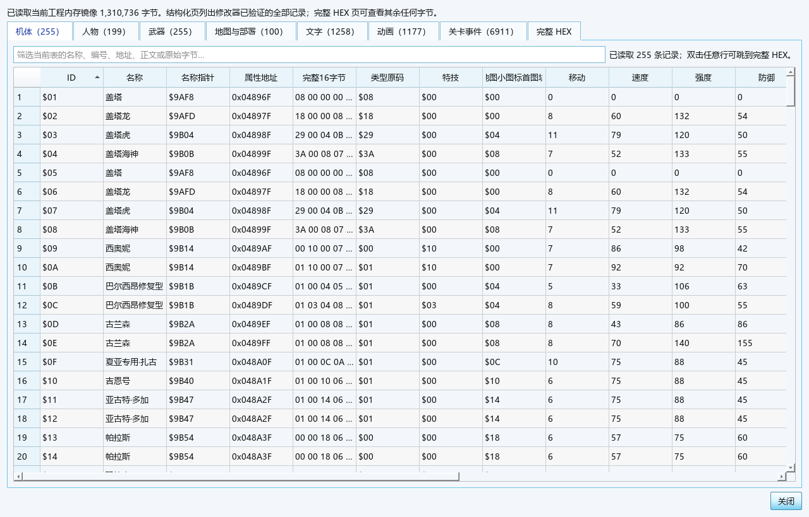

打开“数据 → 完整ROM数据读取”后，八个页签直接读取当前工程的内存镜像：

- “机体、人物、武器、地图与部署、文字、动画、关卡事件”按已验证边界列出全部记录，不只显示当前选中项。默认推荐 ROM 分别读取 255、199、254、100、1258、1177、6911 条；关卡事件数包含 2637 条行动事件表指令和 4274 条分 Bank 关卡脚本指令。
- 每行保留 ID、文件偏移和完整原始字节；已经确认的语义同时拆成单独列。筛选框会搜索当前表的编号、名称、地址、正文和原码。
- 双击结构化表中的一行会跳到“完整 HEX”页的对应文件偏移。HEX 页覆盖当前 ROM 的全部 1,310,736 字节，并显示 iNES 头、PRG 8 KiB Bank 或 CHR 1 KiB Bank 的位置换算。
- 这是只读核对入口。原始字节已被完整读取，但没有证据的位或字节不会被猜成字段，也不会因此开放写入。保存前仍以各编辑页的校验范围为准。

### 3.2 数据库

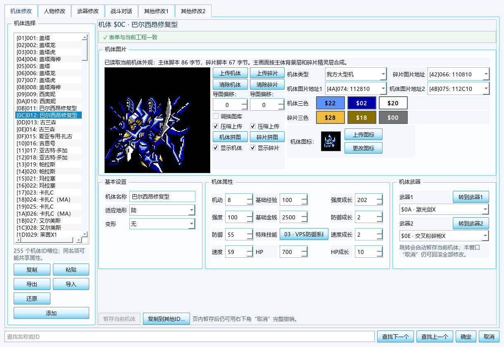

数据库包含“机体修改、人物修改、武器修改、战斗对话、其他修改1、其他修改2”六个页签，底部统一提供查找上一个、查找下一个、确定和取消。

- 数据库支持缩放和滚动；首次打开默认定位到人物 `$04` 和同时具有实际属性、可见机体图库的机体 `$09`，避免占位 ID 的全零值或空图库被误认为没有读取。所有占位槽仍可从左侧选择。机体页按参考工具整理为“左侧机体目录、上方紧凑战斗预览、下方基本设置/机体属性/机体武器三栏、底部全局查找与确定/取消”；在 1316×878 和 1877×984 两种窗口尺寸下无需横向或纵向滚动即可看全。完整 16 字节、类型/标志原码、名称引用和仍待确认绑定的地图图形候选字节移入“名称引用与原始记录”；人物页常驻显示可变长属性记录与 7 字节头像记录，武器页常驻显示 6 字节属性与名称 Token。机体图片区重新按“方形预览、外观摘要、两组颜色、操作、图标”分区，避免摘要与颜色文字互相覆盖。机体页主画面使用与旧修改器一致的 128×128 方形战斗画布并放大两倍显示，不再附加横向黑边。主体以 Y=120 为基线；碎片脚本头按 `X、Y` 顺序读取，Y 从画布底边换算；带敌方方向标志的记录使用右侧画布基准，不会再被负 X 坐标裁掉。两层分别使用机体三色与碎片三色；“显示机体”“显示碎片”可独立核对，“机体拼图”“碎片图库”直达对应资源预览。图标区一次显示一个 16×16 候选图标，并给出对应 CHR 文件位置，不再用整条 16 图标挤占页面高度。
- 机体页会按可用宽度自动使用三栏、两栏加整行武器区或单栏布局；常见中等宽度下把武器区移到下一行，消除截图中的水平滚动条和右侧裁切。修改器中所有可增减的整数/小数输入框统一显示加宽、高对比度的上下箭头；明确设为只读展示的尺寸框仍不显示按钮。
- 机体、人物和武器的左侧目录支持右键操作：“复制当前记录”会记住来源，在目标 ID 上选择“粘贴到当前ID”即可复制；也可直接选择“复制到其他ID…”或“还原当前记录”。机体页把复制、粘贴、导出、导入和还原做成目录下方的常驻按钮，仍可使用原右键菜单；人物目录可直接导出当前正面/背面头像 BMP；武器没有已验证的独立导出协议，因此不显示伪导出入口。粘贴复用各页面现有的已验证字段、共享记录警告、事务和撤销机制，不复制尚未确认的隐藏语义。切换工程会自动清空复制来源，避免跨 ROM 粘贴。
- 三类数据库均可在“直接修改名称”中输入新名称。写入只使用当前名称原槽，保留原指针与相邻记录；编码后超过原槽容量会被拒绝。名称记录被多个 ID 共用时会列出全部受影响 ID 并要求确认。若还要切换“名称引用”，请分两次应用，避免误改新引用指向的共用文字。
- 名称引用和原槽内直接改名，以及移动、速度、强度、防御、HP、成长、基础金钱、基础经验、特技和两个武器槽可以编辑。此前“升级还需”实际对应基础金钱，现已纠正标签；基础经验为原值，游戏另行计算等级差等修正。特技显示完整字节，保留新DC组合值。“转到武器”会切换至武器页并定位关联武器。
- 地形选择只改低两位，保留变形标志。机体页直接显示机体与碎片各三枚大色块，色块同时显示两位十六进制 NES 色号；点击任一色块会打开与地图图块一致的 4×16、完整 64 色 NES 颜色表，选色后即时刷新战斗预览。点“调整配色与图库…”或“机体拼图/碎片图库”进入子窗口后，六个颜色也使用同样的可点击色块，并保留十六进制输入框用于精确输入。所有直接选色仍属于数据库事务，最后按“取消”会完整恢复。大型机有两个机体图库，小型机只有一个。记录 `+1～+3` 是机体颜色并进入运行时 `$0476～$0478`，记录 `+4～+6` 是碎片颜色并进入 `$0479～$047B`。色块和预览使用随工具附带的 `FCEUX.pal`，因此显示器上的 RGB 与 NES 色号是明确对应关系。“战斗合成”页左侧把一个或两个主体图库按 8×8 图块纵向列出，右侧先解析主体的 `F3`、`FD 20`、`F9`、原始图块和 `FF`，再解析碎片脚本的 `X/Y` 坐标、换图、位移及水平/垂直翻转指令并按精灵层叠加；友方左侧与敌方右侧基准均按旧修改器全记录对照。全部 255 个机体记录均须能完整解码。“碎片原始图库”和“拼图脚本原码”另列页签。共用外观记录的机体会一起改变。子窗口确定后，数据库“取消”仍能恢复；主窗口也可撤销。碎片和物理武器仍共用图库，修改时应结合两者核对。
- 参考图中的“上传机体、清除机体、上传碎片、清除碎片、更改图标、变形、新增”保留明确的禁用状态和原因提示：这些跨图库写入、图标绑定或指针重定位关系尚未完成差分验证。机体图标区目前是活动 CHR 候选浏览，不会伪装成已确认的机体 ID 绑定。
- 上传/清除机体、主体脚本编辑、碎片拼图/上传、图标绑定、变形规则和机体大小类型转换尚未完成；不支持任意拆分或追加图形空间。
- 人物页开放名称引用、双方战斗音乐、精神值与成长、五项修正、24 种精神及全局消耗、“击落不消失”和头像设置。头像页显示正面、背景及合成预览，可编辑图库、位置和配色，并上传 32×32 图像。属性与头像记录可能共用；默认尝试在原有固定池内重排，容量不足会拒绝写入。勾选“同时修改共用属性记录/头像记录”会影响提示中的全部人物。精神菜单最多显示按顺序排列的前 6 项，消耗值对全部人物生效。
- “数据 → 导出头像”（`Ctrl+L`）先选择输出根目录，再选择人物，在 `<十进制ID>：<名称>` 子目录生成 `[背面].bmp` 和 `[正面].bmp`。两张图均为 32×32、24 位、无透明通道的 BMP，按头像记录的真实图库和 4×4 图块位置导出；使用旧版素材四色，便于外部编辑后从人物页分别上传。名称中的 Windows 非法路径字符会替换为下划线，已有文件会先询问是否覆盖。导出读取当前工程，不修改 ROM。
- 武器页开放名称、特技、射程、命中、距离修正方式和三种地形攻击值，并显示我方/敌方实际动画脚本。可编辑已验证的等长参数，暂不支持新增脚本、修改指针或播放动画。人物台词到独立人物字段的绑定仍待补齐；战斗对话可在独立页编辑。
- 武器射程和特技共用一个字节，同时修改后保存工程会保留两部分；重新打开 `.dcmod` 不会丢失特技高位。
- 武器页可反查使用它的机体，并跳回对应机体；机体页面也可直接导入/导出当前 `.dcunit` 包。包格式边界不变，不能冒充参考工具的五张 BMP 导出。
- 战斗对话按当前 ROM 的真实文本组和编号列出正文，随机台词另列分支；选中后直接改文字并暂存。系统文字和道具说明使用同一编辑方式。控制 Token 和未改字形的别名编码保持原样，文字只能在现有记录容量内修改，共用地址的记录一起生效。超长或无法编码时保留草稿并阻止确定。
- “其他修改1”包含经验与命中补正、系统文字、成长方式三个子页。经验表显示等级 1—99 的升级阈值、当前累计和还需经验；可编辑升级阈值以及 4×16 武器距离命中补正。成长表按编号 201—253 显示每级 0—15 的数值，214—253 在当前 ROM 共用一条记录，修改会同步影响共用编号；低于 201 的固定成长值在人物/机体属性中设置。非法数值会阻止“确定”并保留草稿。
- “其他修改2”已开放 24 项道具名称、价格和道具说明。名称使用新 DC Token 编码并整体重排固定的 184 字节文本池，局部改名会保留未改字形的原始 Token 别名，“还原”则精确恢复指针和文本池字节；单独改价格不会触碰名称指针或文本池。价格按旧窗口显示为 ROM 原值的 10 倍，因此输入必须是 0—99990 之间且能被 10 整除。24 项价格已逐项通过参考程序“单字段修改、保存、关闭、全新进程重开”验证，确认从 `0x15723` 起按小端 `u16` 连续排列。名称无法编码、总长度超限或价格非法时会阻止“确定”。
- “商店与对话”子页可编辑有效商店的商品、店员和对话起始编号，并编辑七段公共对话。当前 ROM 的 F0—F3 各有四件商品、F4 只有一件；商品数量固定，不会把后一条记录覆盖为额外商品。F5—FE 的指针指向其他数据，显示原因并禁用编辑。七段对话与系统文字共用记录；两页同时修改同一段时会阻止提交，先放弃一页草稿再保留另一页即可。

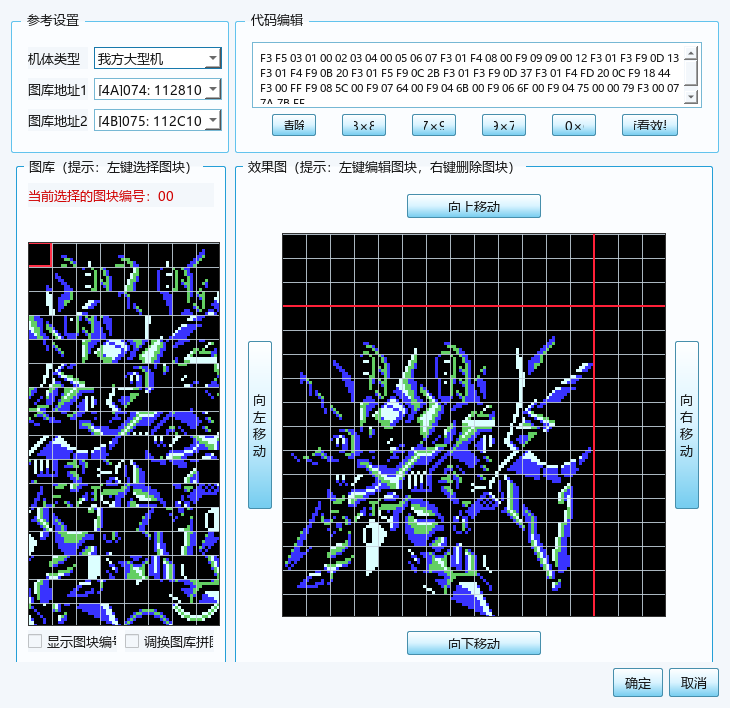

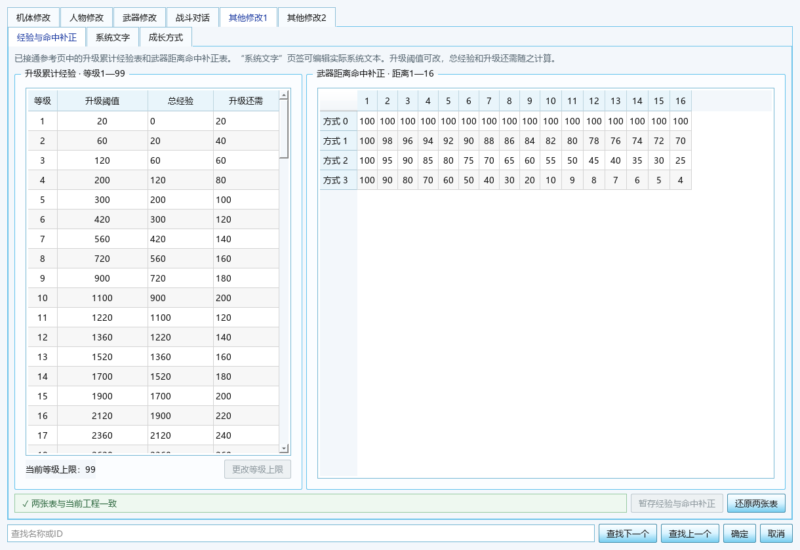

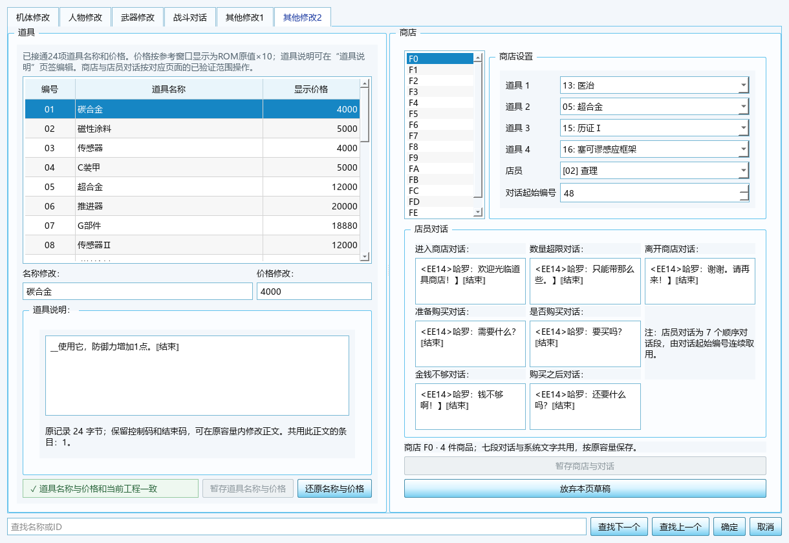

切换机体、人物或武器记录时会自动暂存合法改动；非法下拉值或字段会阻止切换。即使点过暂存，只要最后按“取消”，本次数据库会话仍会整体回滚。

### 3.3 剧情事件

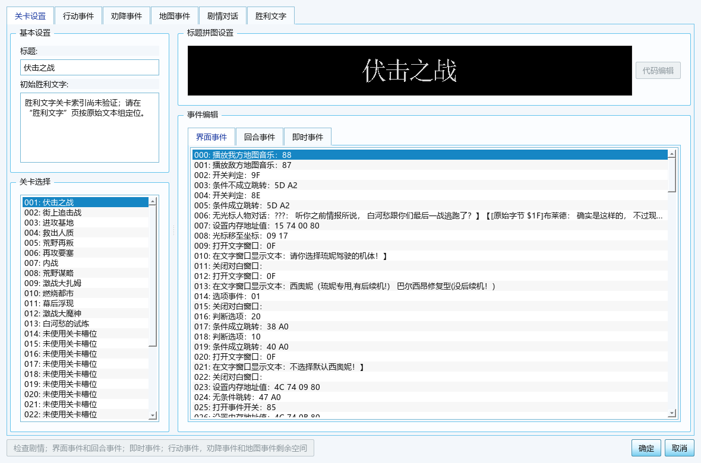

剧情事件窗口包含“关卡设置、行动事件、劝降事件、地图事件、剧情对话、胜利文字”六页，支持缩放。只有关卡设置和地图事件显示章节侧栏；行动与劝降不再跟随当前章节误筛选。“关卡设置”内还有“界面事件、回合事件、即时事件”三个子页。

- 关卡设置从真实的分 Bank 指针读取三类事件，显示当前关卡的完整指令列表、文本摘要和原码。可暂存等长参数修改，保留操作码与长度边界。第一关的初始配置表为空，出击通过界面事件安排；地图上的空配置列表并非遗漏了事件部署。
- 已确认的增援、加入、阵营转换、撤退等动作只能使用等长兼容模板或等长原始字节修改，不插入、删除或重排脚本。
- 行动页是跨章节的已解析行动指令索引，不能当成已经复原参考版的独立行动脚本表。事件列表支持语义/人物/章节/原码搜索；普通参数与高级原码分开，没有语义证据的参数仍明确标为原始参数。
- 可复制当前指令（包含合法未应用草稿），粘贴等长单条指令后检查并应用；长度变化或未知变长规则会被阻止。这不等于参考版的整段粘贴或“接上/接下”插入。
- 劝降页只开放 ROM 中 4 条已确认规则；其余占位槽不会伪装成可用事件。
- 剧情文本支持 Unicode 与原始 Token 无损往返。未知控制参数和未改字形的 Token 别名都按原始字节保留。
- 剧情/胜利页可选择文本组、搜索完整正文；列表优先显示中文摘要，双击直接打开文字编辑。码表设置和 Token 解析默认折叠，需要时再展开。
- 直接修改 Unicode 页后，不必先点“编码到原始 Token”；切换记录或外层“确定”会自动编码并提交合法草稿，无法编码或超出容量时会阻止切换。如果 Unicode 和原始 Token 两边都改过，会先报冲突并保留两份输入；点“文字编码到Token”表示明确以 Unicode 内容为准。
- 对没有语义模板的事件指令，“结束本事件组”只切换操作码高位，其余原始字节保持不变并可撤销。
- 同一物理事件可能同时出现在关卡设置和行动/地图事件页；两页同时有草稿时，直接应用和外层“确定”都会在写入前报冲突，防止后一页覆盖前一页。先在其中一页还原当前指令、放弃该份草稿，再提交另一页；不同 Bank 的同一 CPU 地址则是不同记录。
- 标题拼图、胜利文字到关卡的独立索引等未验证关系明确保持只读，不建立猜测绑定。

### 3.4 文字库、地图动画与文字转换

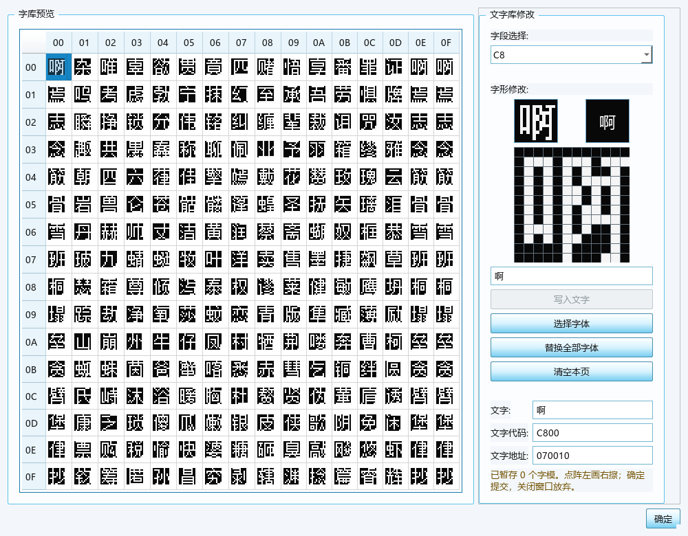

文字库按 16×16 网格显示 ROM 实际字模、码表字符和地址。已修正旧版预览的错误：每个 18 字节字模是三条 4×12 竖条，每字节存两行的四位像素，0 表示前景；不是连续 144 位。文字库仍用于真实 ROM 固定字模读写；关卡标题预览采用独立的旧版标题显示路径，避免不完整通用码表造成整字缺失。

在兼容 MMC3 基线上，可左键画点、右键擦除；“写入文字”暂存当前字模，“确定”一次提交，“取消”放弃整窗字库草稿。也可选择系统字体，将输入字符生成 12 像素预览，核对后写入；“用选定字体替换本页”只处理已有单字码表映射，遇缺字时整批拒绝。此操作只改字形，不会新增字符代码或自动更新码表；同一码的所有名称/剧情都会受影响。

每页有 224 个独立字模。E/F 列实际引用同一行 0 列，不可独立写；每行四个保留字节不会被清页或批量导入覆盖。“清空本页”需确认；页点阵 `.dcfont` 文件固定 4032 字节，按行从 0 到 D 列排列，不含 E/F 别名和行保留字节。支持导入/导出页点阵；不是参考工具未验证的全字体文件格式。确定后仍需保存工程/派生 ROM，并可在主窗口撤销。其他未核验 ROM 布局只读。

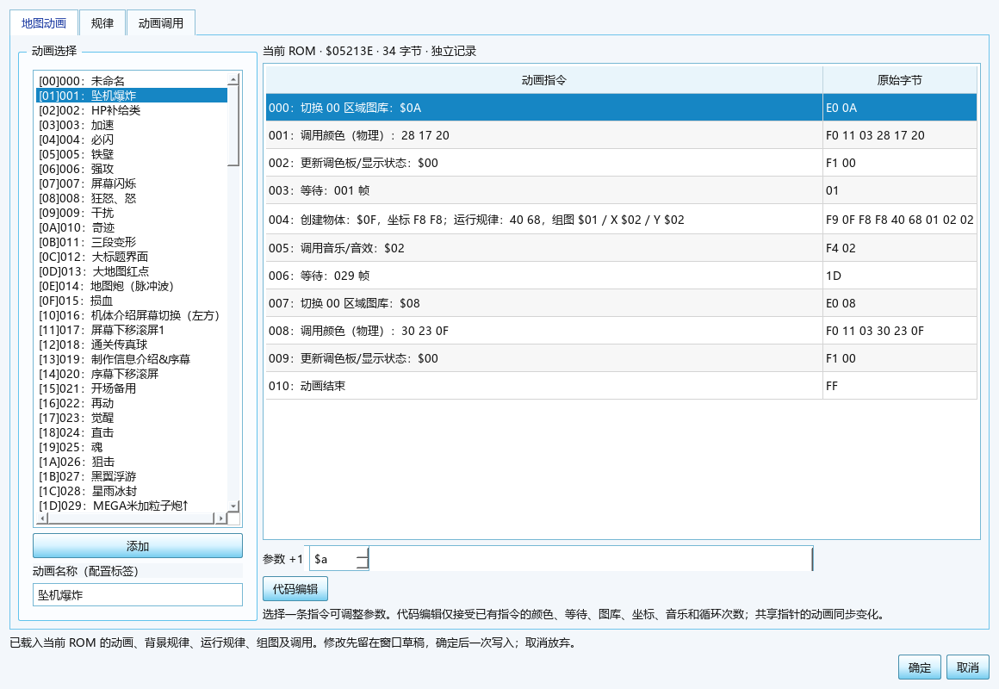

地图动画包含“动画、规律、调用”三个分类，直接读取当前 ROM。动画页显示真实指令、地址、共享编号和原始代码；选中指令或点“代码编辑”可修改已验证的等待、配色、图库、坐标、音乐/音效及循环次数。规律页读取背景、运行和组图记录：已确认解释方式的运行规律可改帧、位移、音效和循环次数，组图可改起始坐标，背景规律暂只读。调用页列出实际调用位置，只有已核对完整指令序列的调用可更换已有动画编号。

原记录的操作码、可变长度字段、资源引用和跳转目标保持不变；非法或变长代码会阻止确定并保留输入。共享记录的改动会影响全部引用者。地图动画窗口使用本地草稿，“确定”合并为一次撤销事务，“取消”不修改工程。暂不支持新增/搬移脚本、完整可视拼图、动画播放测试及全部调用的精神/地图武器名称关联。

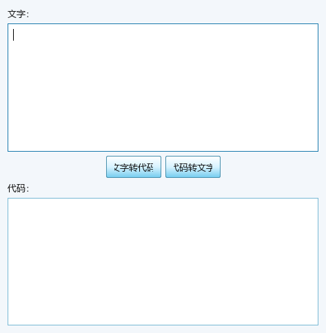

文字转换使用与剧情页相同的新 DC 码表。“文字转代码”和“代码转文字”都不会修改 ROM，适合在编辑剧情前核对 Token。窗口现在可自由缩放，并采用更接近参考工具的初始尺寸。

### 3.5 计算器、存档与其他

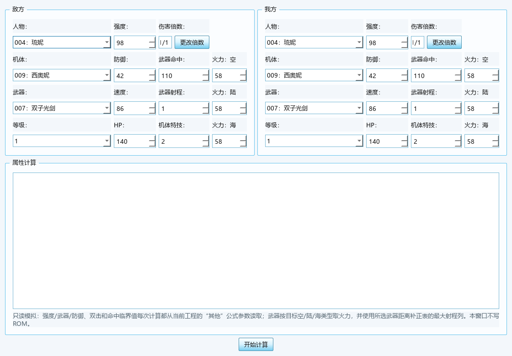

属性计算器从当前工程读取人物、机体和武器，初次打开会选中人物 `$04`、机体 `$02` 和武器 `$01`，直接显示人物属性记录的地址、原码、精神、成长、五项补正与精神列表，以及武器记录的地址、完整原码、特技和距离补正表；机体数值和机体特技也同步载入。它使用界面注明的确定性估算公式显示命中、达到 1% 命中所需的最低速度和伤害；结果仅供平衡参考，不会自动写回属性。旧修改器的完整命中、双击和地形公式仍需黄金样本验证，界面不会把当前估算冒充游戏真实公式。

存档修改器可载入文件进行结构检查，但在校验和、槽位和字段语义全部确认前不提供保存。

旧版“其他”窗口已连接下列经反汇编与三份兼容 ROM 交叉核对的字段：3 项双击公式、5 项伤害公式、命中阈值、11 项道具效果，以及 6 组“人物 / 机体”初始阵容。打开窗口时读取当前 ROM，按“确定”把全部值作为一个撤销事务写入，按“取消”不产生修改。人物和机体下拉框保留 ID 0，以便无损打开特殊或占位记录。全部数值使用 0—255；伤害公式第 3、5 项是除数，不能为 0。经参考 EXE 的 20 项单变量保存与重开实验确认，双击公式每项实际有三份运行时操作数；修改器会同步写入全部三个镜像，避免不同战斗路径取到旧值。载入时和每次写入前都会校验公式/效果立即数周边的固定 opcode、存储目标、跳转或调用目标；立即数本身是通配位，因此合法改过数值的 ROM 仍能重开，但代码上下文已移动或损坏时会拒绝写入。

系统文字和成长方式位于数据库“其他修改1”；道具名称、价格及说明位于“其他修改2”。商店店员与对话的具体支持范围见对应页面和差异矩阵。

## 4. “扩展功能”菜单：新能力

新功能没有挤占参考工具的“数据”菜单，统一放在“扩展功能”：

| 入口 | 用途 |
|---|---|
| 战斗背景音乐 | 修改双方战斗曲，导入 `$9D–$9F` 扩展曲槽 |
| 机体导入与 CHR 图像 | 导入/导出 `.dcunit`，编辑已验证的活动 CHR 图块 |
| 扩展容量规划 | 自动给地图、机体和剧情分配 Bank 并接通运行时 |
| 工程概览 | 查看 Mapper、哈希和可用资源 |
| 变更与验证 | 查看字节改动并运行完整结构检查 |

### 4.1 自动容量规划

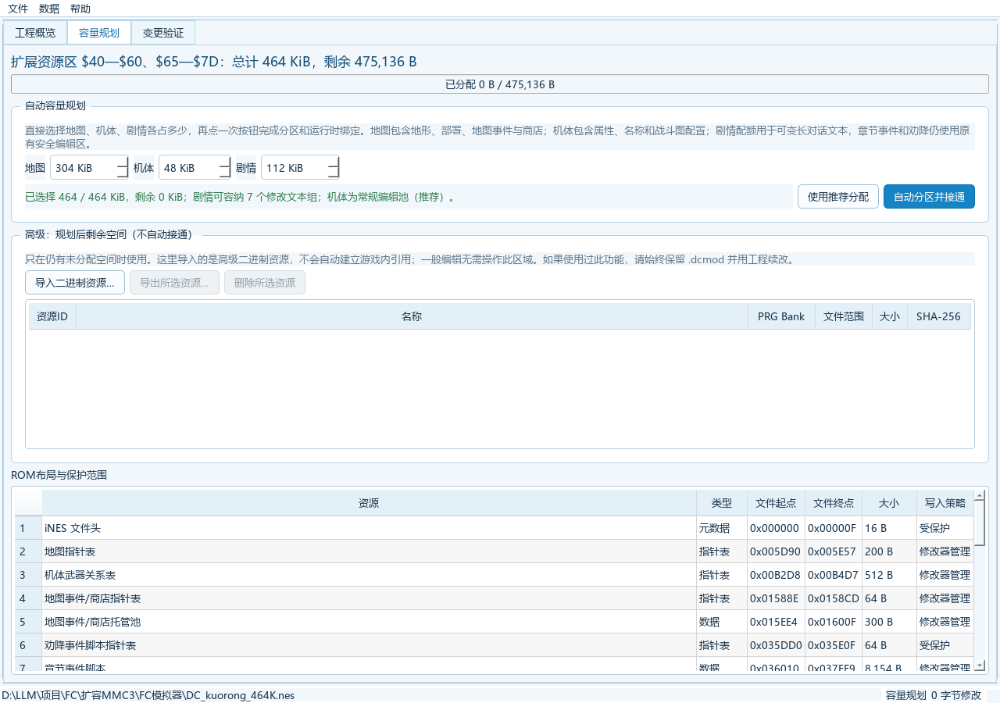

推荐基线共有 464 KiB 托管空间。第一次需要扩展内容时，从“扩展功能 → 扩展容量规划”选择地图、机体和剧情额度，再点击“自动分区并接通”。推荐值为：

| 类别 | 推荐 | 规则 |
|---|---:|---|
| 地图 | `304 KiB` | 8 KiB 递增，共享给地形、部署和触发点 |
| 机体 | `48 KiB` | 可选 48/64/80 KiB；普通编辑选 48 KiB |
| 剧情 | `112 KiB` | 每 16 KiB 对应一个可变长文本组 |

三类配额按完整 Bank 固定边界，分配器会登记占用并禁止相互覆盖。规划完成后不需要手工填写运行时指针。`$61–$63` 是扩展音乐，`$64` 是双音频桥，`$7E–$7F` 是固定程序 Bank，均不会交给普通资源分配。

### 4.2 机体包和 CHR

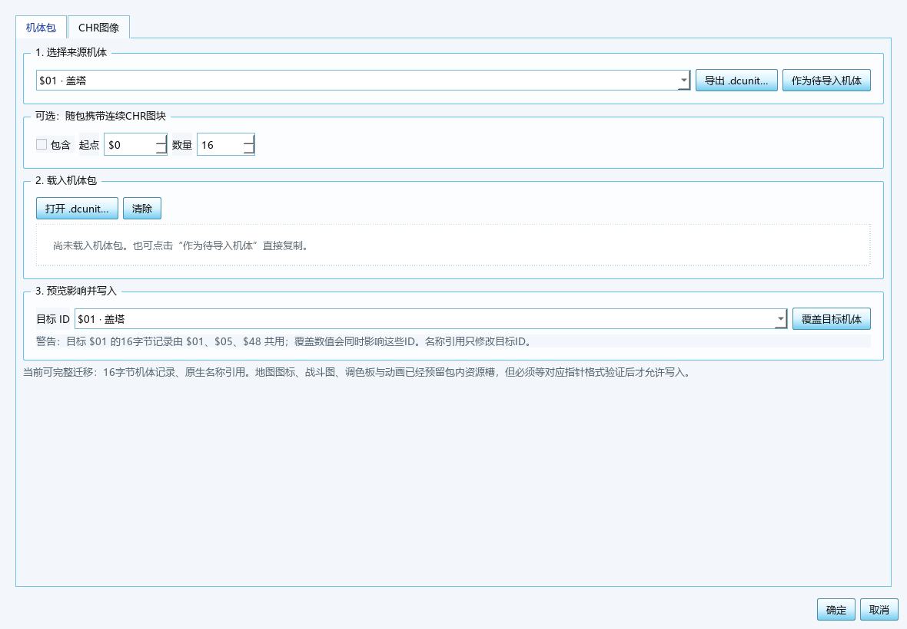

`.dcunit` 当前携带 16 字节机体记录、名称引用和可选连续 CHR 图块。机体的两格独立武器表不在版本 1 包内，导入不会随包覆盖该表；导入前先核对目标 ID、共享记录提示和图块范围，再覆盖目标机体。

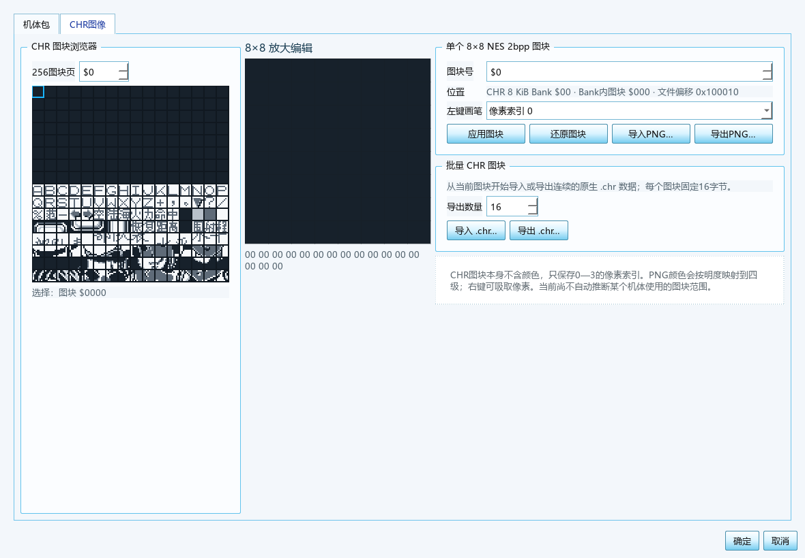

CHR 页提供真实 8×8 图块的放大绘制和 PNG/CHR 导入导出。NES 图块只有 0–3 四级像素索引，不自带颜色；批量导入前必须确认连续图块范围。

单块 CHR 画布属于窗口草稿：切换图块、切换图块页或按外层“确定”时会自动提交合法像素；像素值无效时阻止切换并保留原画布。CHR 和 `.dcunit` 导出会把当前合法画布直接叠加到导出内容，只在文件写入成功后提交草稿；取消文件选择或写入失败不会暗中改动 ROM。导入时会在确认后把已有合法画布作为可撤销基线保留。“取消”仍会回滚本次窗口事务。

### 4.3 战斗音乐

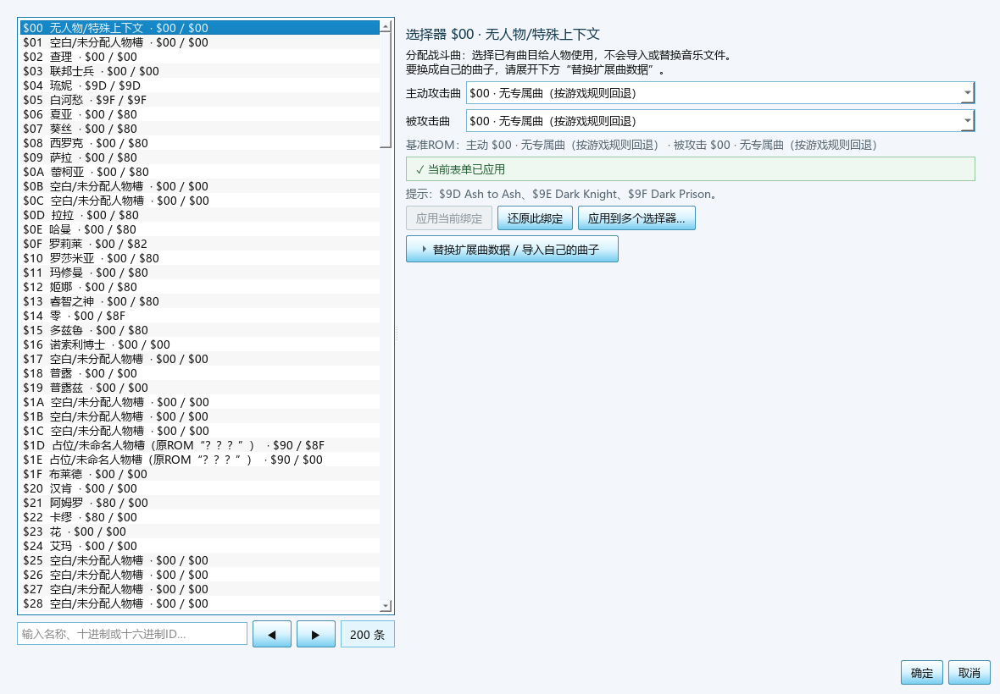

选择器可分别设置主动攻击曲和被攻击曲。扩展曲槽固定为 `$9D`、`$9E`、`$9F`，每槽占一个 8 KiB Bank。导入后必须运行完整检查，并在 Mesen 中验证播放、音效和切回旧曲。

“分配战斗曲”只给人物选择已有曲目，不会导入歌曲。要替换歌曲文件，展开“替换扩展曲数据 / 导入自己的曲子”；它会影响所有使用该曲槽的人物。技术导入区默认折叠，双音频引擎和导入格式不变。

## 5. 工程、撤销、验证与输出

“文件”菜单保持参考工具的简洁动线：

- `Ctrl+O` 打开基线 ROM。
- `Ctrl+S` 保存派生 ROM。第一次使用会要求选择新文件名；之后继续保存到该派生文件。
- `Ctrl+Alt+S` 在“工程”菜单中执行“ROM另存为”。

`.dcmod` 工程、IPS 和构建功能位于“工程”菜单：

1. 使用“工程另存为”建立 `.dcmod`，以后按 `Ctrl+Shift+S` 保存工程。
2. 按 `F7` 打开“变更与验证”，处理全部错误；合法地图草稿会先提交，无效草稿会阻止检查并保留表单。
3. 使用“导出IPS”或 `Ctrl+B` 一键构建 ROM、IPS、工程副本和 JSON 报告。
4. 使用 `tools/vendor/mesen-0.9.9/Mesen.exe` 进入实际关卡、剧情和战斗验证。FCEUX 2.6.6 不适合验证本 1 MiB PRG Mapper 194 ROM。

所有“另存为”和资源导出操作（工程、ROM、IPS、机体包、CHR、音乐 Bank、扩展资源及字库模板）的默认目录均为 `output/exports/`。即使当前打开的是 `references/` 下的旧兼容基线，生成文件也不会默认写回只读参考目录。

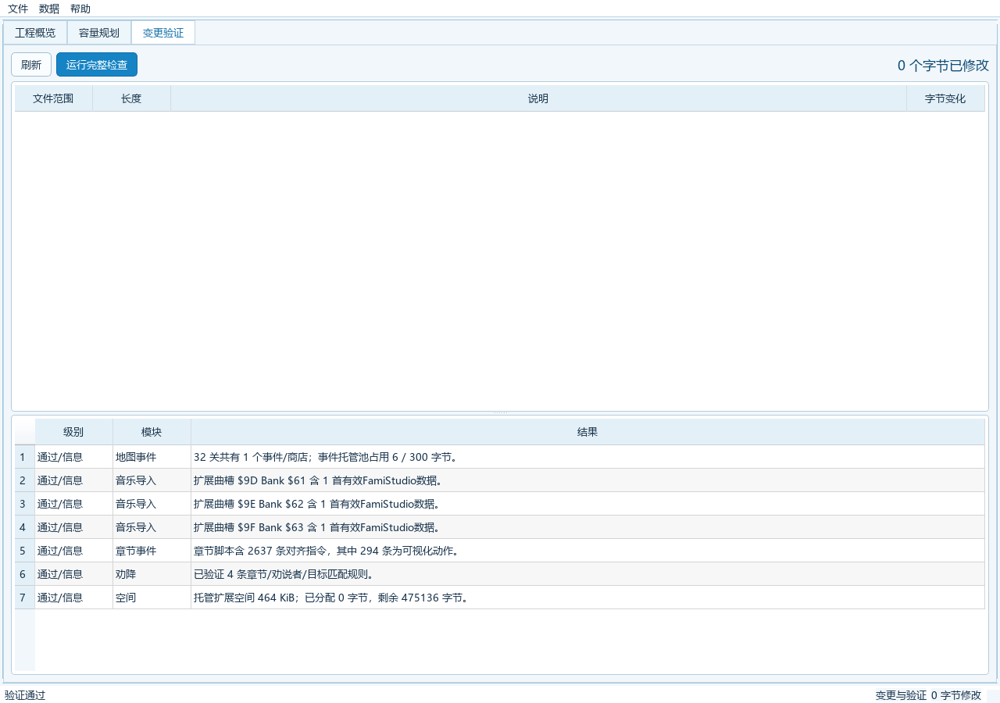

输出前会再次检查 iNES 头、受保护 Bank、分区边界、运行时入口、文本容量和事件长度。有错误时不会生成正式 ROM/IPS。`references/` 内的任何路径均为只读目标；选择当前基线或其他参考文件作为输出目标会被拒绝。覆盖已有派生 ROM 时会先建立时间戳 `.bak`。

按 `Ctrl+Alt+Z` 撤销、`Ctrl+Alt+Y` 重做。撤销当前合法地图草稿时，修改器会先把它作为一个事务提交并立即撤销；无效草稿会被保留并阻止撤销。存在任何地图草稿时，重做会被阻止，避免清空已有重做历史。`Ctrl+Z` 保留给参考工具的“文字转换”，因此不能再作为工程撤销快捷键。

## 6. 草稿、确定与取消

- **记录切换：**机体、人物、武器、文本、事件和 CHR 图块等页面在切换记录前自动提交合法草稿。剧情窗口切换关卡或外层总览时也遵循同一规则；非法草稿会把选中项恢复到原记录。
- **地图切换：**切换关卡或保存前自动提交合法地图草稿。
- **非法输入：**长度、容量、Token、坐标或必选项不合法时，切换和“确定”会被阻止，不会悄悄丢弃表单。
- **确定：**独立数据窗口会先提交各页尚未应用的合法草稿，再保留整个窗口会话。
- **取消：**无论页内是否点过“应用/暂存”，都恢复窗口打开前状态。
- **磁盘保存：**“确定”只改变内存；仍需保存 `.dcmod` 或按 `Ctrl+S` 输出派生 ROM。

## 7. 常见问题

### 进入修改器后为什么是空白

这是 3.0 的正常旧版动线。按 `Ctrl+O` 打开兼容 ROM 后，地图和数据菜单才会启用。

### 为什么一些看起来完整的按钮不能点

这些按钮按参考工具保留对应布局和入口，但其 ROM 地址或联动语义尚未完成差分验证。查看 tooltip 可以看到只读原因。真实预览不代表已允许写入。

### 点“确定”后原 ROM 为什么没有变化

“确定”只保留到内存会话。按 `Ctrl+S` 首次选择一个新 `.nes` 文件，或用工程菜单保存 `.dcmod`。修改器不会原地覆盖载入的基线。

### 文本或地图为何阻止切换

先阅读错误提示。常见原因是文本组超过 16 KiB、结束 Token 缺失、地图记录跨 Bank、部署坐标越界，或尚未进行扩展容量规划。

### 输出 ROM 可以重新打开吗

可以。有效规划和受保护签名都通过时可直接续改；若使用过高级未分配资源，仍建议以原 `.dcmod` 续改，以保留资源 ID、名称和分配意图。

## 8. 快捷键速查

| 快捷键 | 功能 |
|---|---|
| `Ctrl+O` | 打开 ROM |
| `Ctrl+S` | 保存派生 ROM |
| `Ctrl+D / W / M / Z / J` | 数据库 / 文字库 / 地图动画 / 文字转换 / 剧情事件 |
| `Ctrl+F / L / T` | 导出机体 / 导出头像 / 其他 |
| `Ctrl+Shift+O` | 打开 `.dcmod` 工程 |
| `Ctrl+Shift+S` | 保存 `.dcmod` 工程 |
| `Ctrl+Alt+S` | ROM 另存为 |
| `Ctrl+Alt+Z / Ctrl+Alt+Y` | 工程撤销 / 重做 |
| `Ctrl+B` | 一键构建 |
| `F7` | 完整检查 |

最后确认：基线 ROM 仍在原处、派生 ROM 使用新文件名、工程已保存、完整检查无错误，并已在 Mesen 中覆盖实际修改场景。`references/rom/source/新DC.nes` 是只读源素材，不能作为输出目标。对外发布时优先提供 `output/patches/` 中的 IPS、说明和 `output/reports/rom-build/` 中的报告，不直接分发可能受版权保护的 ROM。

## 9. 项目文档

目录整理不会改变 EXE、ROM、工程或快捷键的使用方式。维护与深入阅读入口如下：

- 根目录 `README.md`：项目概览、快速开始、目录结构和开发命令。
- `docs/DC修改器设计与实现方案.md`：分层架构、功能边界和后续扩展条件。
- `docs/research/legacy-modifier/SRW2一比一复刻差异矩阵.md`：参考 EXE 的逐功能现状、缺口和完成判据。
- `docs/提交记录.md`：已完成改动及对应验证记录。
- `output/pdf/DC修改器使用说明.pdf`：本说明书的生成版 PDF。
- `references/legacy_modifier/`：旧修改器与其配置快照，仅作逆向和交互参考，不是当前修改器源码。
